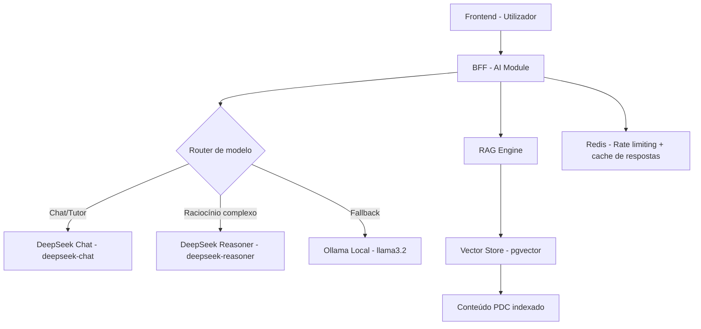
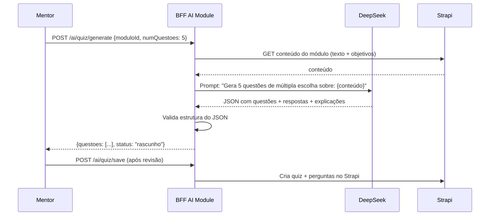
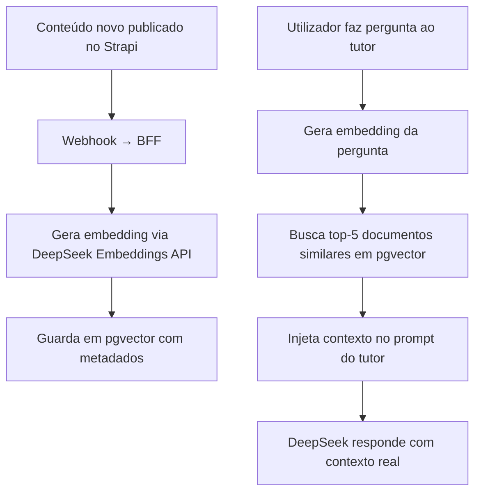
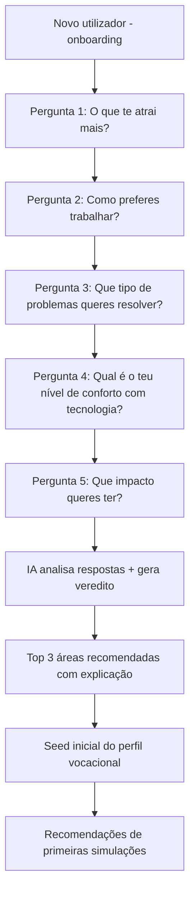

# PDC — Estratégia de IA, RAG e Tutor Vocacional

# PDC — Estratégia de IA, RAG e Tutor Vocacional

<user_quoted_section>Este documento define como a IA é usada no PDC: tutor conversacional, geração de quizzes, pré-orientação vocacional, e RAG (Retrieval-Augmented Generation). Baseado na análise de ,  e .</user_quoted_section>

## 1. Diagnóstico do Estado Atual

O sistema de IA atual tem uma base sólida mas com problemas críticos:

| O que existe | Estado | Problema |
| --- | --- | --- |
| Tutor IA com streaming (DeepSeek) | ✅ Funciona | Rate limiting em `Map` em memória |
| Micro-desafios vocacionais por área | ✅ Funciona | Fallbacks hardcoded para 10+ áreas |
| Hero verdict (veredito vocacional) | ✅ Funciona | Sem contexto real do perfil |
| Dashboard insights | ✅ Funciona | Sem dados reais de telemetria |
| Fallback para Ollama local | ✅ Configurado | Não testado em produção |
| Geração de quizzes | ❌ Não existe | Apenas quizzes manuais |
| RAG com conteúdo da plataforma | ❌ Não existe | IA sem contexto do PDC |
| Pré-orientação vocacional estruturada | ❌ Parcial | Apenas micro-desafios isolados |

## 2. Arquitetura de IA



**Princípios:**

- **DeepSeek como provedor principal** — `deepseek-chat` para conversação, `deepseek-reasoner` para análise vocacional complexa
- **Ollama como fallback local** — quando DeepSeek indisponível ou para desenvolvimento
- **RAG para contexto** — a IA conhece o conteúdo real da plataforma (cursos, simulações, mentores)
- **Rate limiting via Redis** — substituir o `Map` em memória atual
- **Streaming obrigatório** — todas as respostas longas usam streaming SSE

## 3. Módulos de IA

### 3.1 Tutor Vocacional (já existe — melhorar)

O tutor atual em file:src/server/ai-tutor-stream-routes.js já funciona com streaming. Na reconstrução:

**Melhorias:**

- Rate limiting via Redis (não `Map`)
- `perfilId` derivado do JWT (não do header `X-Perfil-Id`)
- Contexto enriquecido com dados reais do perfil vocacional
- Histórico de conversa persistido no servidor (não apenas no cliente)
- Limite de tokens por role: aluno (260 tokens), mentor (500), admin (sem limite)

**System prompt enriquecido com dados reais:**

```
Tu és o Tutor IA do PDC, focado em reduzir evasão universitária em Angola.
Perfil do estudante: {nome}, área de maior afinidade: {topArea} (score: {score}%).
Última simulação: {ultimaSimulacao} — score: {ultimaSimulacaoScore}%.
Dias sem atividade: {diasSemAtividade}.
Responde em português angolano. Máximo 3 parágrafos curtos.
```

### 3.2 Micro-Desafios Vocacionais (já existe — manter)

O sistema de micro-desafios em file:src/server/ai-routes.js gera questões práticas por área vocacional. Funciona bem — manter a lógica, melhorar:

- Rate limiting via Redis
- `perfilId` do JWT
- Guardar resultados na tabela `simulacao-tentativa` (não apenas retornar)
- Alimentar o perfil vocacional com os scores

**Áreas suportadas (já implementadas):**
`medicina`, `engenharia`, `tecnologia`, `direito`, `gestao`, `educacao`, `agronomia`, `artes`, `ciencias_sociais`, `saude`

### 3.3 Geração Automática de Quizzes (novo)

Mentores e instituições podem gerar quizzes automaticamente a partir do conteúdo de um módulo:



**Formato de output:**

```json
{
  "questoes": [
    {
      "enunciado": "Qual é a principal função de um router numa rede?",
      "opcoes": ["A) ...", "B) ...", "C) ...", "D) ..."],
      "correta": "B",
      "explicacao": "Um router encaminha pacotes entre redes diferentes..."
    }
  ]
}
```

**Regras:**

- Máximo 20 questões por geração
- O mentor revê e edita antes de publicar — nunca publicação automática
- Rate limit: 10 gerações por mentor por dia
- Conteúdo do módulo máximo 5000 caracteres para o prompt

### 3.4 RAG — IA com Conhecimento do PDC (novo)

O RAG permite que a IA responda perguntas sobre o conteúdo real da plataforma:

**Casos de uso:**

- "Que simulações existem na área de Saúde?"
- "Quem são os mentores de Engenharia disponíveis?"
- "Qual é o curso mais bem avaliado em Tecnologia?"
- "Que programas aceitam candidaturas agora?"

**Implementação com pgvector:**



**O que é indexado:**

- Títulos e descrições de cursos, simulações, experiências
- Perfis públicos de mentores (bio, áreas, competências)
- FAQs de experiências institucionais
- Descrições de programas

**O que NÃO é indexado:**

- Conteúdo privado ou em draft
- Dados pessoais de utilizadores
- Mensagens privadas

### 3.5 Pré-Orientação Vocacional Estruturada (novo)

Fluxo guiado de 5 perguntas que gera um veredito vocacional inicial para novos utilizadores (antes de terem dados de telemetria suficientes):



**Veredito gerado pela IA:**

```json
{
  "topAreas": [
    {"area": "TECNOLOGIA", "score": 82, "razao": "Atraído por resolução de problemas técnicos e trabalho independente"},
    {"area": "ENGENHARIA", "score": 71, "razao": "Interesse em criar soluções físicas e trabalho em equipa"},
    {"area": "GESTAO", "score": 58, "razao": "Capacidade de liderança e visão estratégica"}
  ],
  "resumo": "O teu perfil sugere forte aptidão para áreas técnicas com componente criativa...",
  "proximoPasso": "Experimenta a simulação de Desenvolvimento de Software para confirmar esta afinidade."
}
```

## 4. Rate Limiting de IA (via Redis)

Substituir o `Map` em memória atual por Redis:

| Endpoint | Role | Limite | Janela |
| --- | --- | --- | --- |
| `/ai/tutor-stream` | aluno | 20 requests | 1 hora |
| `/ai/tutor-stream` | mentor/admin | sem limite | — |
| `/ai/micro-challenge/questions` | qualquer | 10 requests | 1 hora |
| `/ai/quiz/generate` | mentor/instituicao | 10 gerações | 1 dia |
| `/ai/vocacional/orientacao` | aluno | 3 requests | 1 dia |
| `/ai/insights` | qualquer | 30 requests | 1 hora |

## 5. Segurança da IA

### 5.1 Guardrails de conteúdo

O sistema atual já tem guards básicos. Na reconstrução, formalizar:

- **Bloqueio de tópicos sensíveis:** política, religião, conteúdo adulto, automutilação
- **Sem dados pessoais no prompt:** nunca enviar passwords, dados de pagamento, mensagens privadas
- **Sanitização de output:** remover qualquer PII que a IA possa ter gerado
- **Limite de tokens de input:** aluno máx. 1200 chars, mentor máx. 3000 chars

### 5.2 Fallback para Ollama

Quando DeepSeek indisponível:

1. BFF detecta erro de conexão ou timeout (> 10s)
2. Tenta Ollama local (`llama3.2` ou `mistral`)
3. Se Ollama também falhar → resposta de fallback estática (já implementada)
4. Alerta enviado ao Super Admin via notificação

### 5.3 Circuit Breaker

- Após 5 falhas consecutivas ao DeepSeek → abre o circuit breaker
- Durante 60 segundos → todas as requests vão para Ollama
- Após 60 segundos → tenta DeepSeek novamente (half-open)
- Se sucesso → fecha o circuit breaker

## 6. Variáveis de Ambiente

| Variável | Descrição | Obrigatória |
| --- | --- | --- |
| `DEEPSEEK_API_KEY` | Chave da API DeepSeek | ✅ |
| `DEEPSEEK_BASE_URL` | URL base (default: `https://api.deepseek.com`) | ❌ |
| `AI_MODEL_CHAT` | Modelo de chat (default: `deepseek-chat`) | ❌ |
| `AI_MODEL_REASONER` | Modelo de raciocínio (default: `deepseek-reasoner`) | ❌ |
| `OLLAMA_BASE_URL` | URL do Ollama local (default: `http://localhost:11434`) | ❌ |
| `OLLAMA_MODEL` | Modelo Ollama (default: `llama3.2`) | ❌ |
| `AI_FEATURE_ENABLED` | Ativar/desativar IA (default: `true`) | ❌ |
| `AI_STUDENT_RATE_LIMIT_MAX` | Máx. requests de aluno por hora (default: `20`) | ❌ |
| `AI_STUDENT_MAX_INPUT_CHARS` | Máx. chars de input de aluno (default: `1200`) | ❌ |
| `PGVECTOR_ENABLED` | Ativar RAG com pgvector (default: `false`) | ❌ |

## 7. Roadmap de Implementação de IA

| Fase | Feature | Prioridade |
| --- | --- | --- |
| **V1** | Tutor IA melhorado (Redis rate limit + contexto real) | 🔴 Alta |
| **V1** | Micro-desafios vocacionais (guardar resultados no DB) | 🔴 Alta |
| **V1** | Pré-orientação vocacional estruturada (onboarding) | 🔴 Alta |
| **V2** | Geração automática de quizzes | 🟠 Média |
| **V2** | Dashboard insights com dados reais de telemetria | 🟠 Média |
| **V3** | RAG com pgvector | 🟡 Baixa |
| **V3** | Circuit breaker para DeepSeek | 🟡 Baixa |
