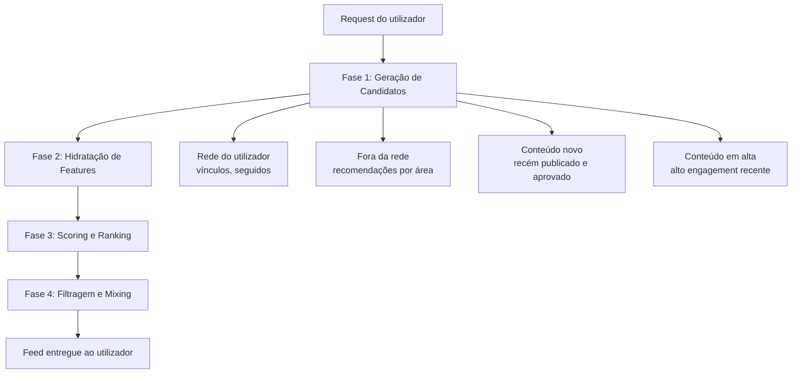
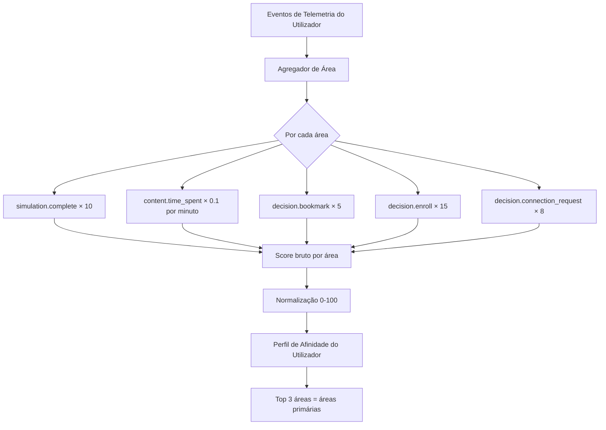

# PDC — Algoritmo de Ranking e Feed

# PDC — Algoritmo de Ranking e Feed

<user_quoted_section>Inspiração: Arquitetura do X (Twitter) the-algorithm — adaptada ao contexto educacional do PDC. O X usa ML pesado com milhares de features; o PDC usa regras determinísticas + scores calculados, evoluindo para ML quando tiver dados suficientes.</user_quoted_section>

## 1. Visão Geral

O algoritmo do PDC resolve um problema diferente do X: não é "o que vais querer ver agora", mas **"o que te vai ajudar a tomar uma decisão vocacional melhor"**. Isto muda fundamentalmente os sinais que importam.

| X (Twitter) | PDC |
| --- | --- |
| Maximizar tempo na plataforma | Maximizar qualidade da decisão vocacional |
| Sinal principal: engagement rápido (likes, retweets) | Sinal principal: engagement profundo (simulações, tempo real, bookmarks) |
| Conteúdo de qualquer pessoa | Conteúdo validado (moderação + comité científico) |
| Feed único "For You" | 4 feeds com propósitos distintos |
| ML com bilhões de parâmetros | Scoring determinístico + pesos configuráveis |

## 2. Arquitetura do Pipeline

O algoritmo funciona em 4 fases sequenciais, inspiradas no pipeline do X:



### 2.1 Fase 1 — Geração de Candidatos

Reduz o universo de conteúdo de **todos os itens publicados** para um pool de ~500 candidatos relevantes para aquele utilizador.

**Fontes de candidatos (Candidate Sources):**

| Fonte | Descrição | % do pool |
| --- | --- | --- |
| **In-Network** | Conteúdo de perfis com quem o utilizador tem vínculo (mentores, instituições conectadas) | ~40% |
| **Área de Interesse** | Conteúdo da(s) área(s) que o utilizador mais explorou (via telemetria) | ~30% |
| **Trending Educacional** | Conteúdo com alto engagement nas últimas 48h na plataforma | ~15% |
| **Novo e Aprovado** | Conteúdo recém-publicado e aprovado pelo moderador (dar visibilidade a novos criadores) | ~10% |
| **Institucional** | Conteúdo da instituição do utilizador (se modo institucional ativo) | ~5% |

### 2.2 Fase 2 — Hidratação de Features

Para cada candidato, o sistema recolhe os sinais necessários para calcular o score:

| Feature | Fonte | Descrição |
| --- | --- | --- |
| `engagement_score` | Tabela `entity_score` | Score agregado de likes, bookmarks, ratings, partilhas |
| `completion_rate` | Telemetria | % de utilizadores que completaram o conteúdo |
| `avg_time_spent` | Telemetria | Tempo médio gasto no conteúdo |
| `rating_avg` | Tabela `rating` | Média ponderada de avaliações (1–5) |
| `rating_count` | Tabela `rating` | Número de avaliações |
| `recency_score` | `publicadoEm` | Frescura do conteúdo (decai com o tempo) |
| `author_reputation` | Tabela `entity_score` | Score de reputação do criador |
| `user_area_affinity` | Telemetria do utilizador | Afinidade do utilizador com a área do conteúdo |
| `moderation_quality` | Flags de moderação | Penalização por denúncias ou rejeições anteriores |
| `institutional_boost` | Vínculo institucional | Boost se o conteúdo é da instituição do utilizador |

### 2.3 Fase 3 — Scoring e Ranking

O score final de cada candidato é calculado com a fórmula:

```
score_final = (
  engagement_score   × W_engagement   +
  completion_rate    × W_completion   +
  avg_time_spent     × W_time         +
  rating_avg         × W_rating       +
  recency_score      × W_recency      +
  author_reputation  × W_author       +
  user_area_affinity × W_affinity
) × moderation_quality × institutional_boost
```

**Pesos por tipo de feed (configuráveis pelo admin):**

| Feature | Feed Geral | Feed Vocacional | Feed Institucional | Feed Trending |
| --- | --- | --- | --- | --- |
| `engagement_score` | 0.20 | 0.10 | 0.15 | 0.35 |
| `completion_rate` | 0.20 | 0.30 | 0.20 | 0.15 |
| `avg_time_spent` | 0.10 | 0.20 | 0.10 | 0.05 |
| `rating_avg` | 0.15 | 0.15 | 0.20 | 0.10 |
| `recency_score` | 0.15 | 0.05 | 0.10 | 0.25 |
| `author_reputation` | 0.10 | 0.10 | 0.15 | 0.05 |
| `user_area_affinity` | 0.10 | 0.10 | 0.10 | 0.05 |

<user_quoted_section>Nota: O Feed Vocacional prioriza completion_rate e avg_time_spent porque estes sinais indicam conteúdo que realmente ajuda na decisão. O Feed Trending prioriza engagement_score e recency_score.</user_quoted_section>

### 2.4 Fase 4 — Filtragem e Mixing

Após o ranking, aplicam-se filtros hard (eliminação) e heurísticas de diversidade:

**Filtros hard (eliminação imediata):**

- Conteúdo com `estado != 'published'` → eliminado
- Conteúdo com `moderation_quality = 0` (oculto por denúncias) → eliminado
- Conteúdo já visto pelo utilizador nas últimas 48h → eliminado
- Conteúdo do próprio utilizador → eliminado do feed geral (aparece no perfil)
- Conteúdo de perfis bloqueados pelo utilizador → eliminado

**Heurísticas de diversidade (evitar monotonia):**

- Máximo 3 itens consecutivos do mesmo criador
- Máximo 40% do feed de um único tipo de conteúdo (ex: não pode ser tudo Simulações)
- Mínimo 1 item "fora da rede" a cada 5 itens (descoberta)
- Mínimo 1 item de criador novo (< 30 dias na plataforma) a cada 10 itens

**Mixing (injeção de conteúdo não-orgânico):**

- Posição 5: "Quem seguir" — sugestão de mentor ou instituição relevante
- Posição 15: Conquista em destaque — conquista recente de alguém da rede
- Posição 25: Programa em destaque — programa com inscrições abertas na área do utilizador

## 3. Os 4 Feeds do PDC

O PDC tem 4 feeds distintos, cada um com propósito e algoritmo próprios:

### 3.1 Feed Geral ("Para Ti")

O feed principal. Mistura conteúdo da rede do utilizador com recomendações fora da rede. Equivalente ao "For You" do X.

**Composição:** 60% in-network + 40% out-of-network

**Tipos de conteúdo:** Posts, Conquistas, Projetos, Cursos, Experiências, Simulações, Programas

### 3.2 Feed Vocacional ("Explorar")

Feed dedicado à descoberta vocacional. Prioriza conteúdo que ajuda o utilizador a tomar decisões — simulações, experiências, cursos com alta taxa de conclusão.

**Composição:** 100% baseado em afinidade de área + qualidade de conteúdo

**Tipos de conteúdo:** Simulações, Experiências, Cursos (sem Posts nem Conquistas)

**Lógica especial:** Se o utilizador ainda não tem área definida (novo utilizador), mostra conteúdo das áreas mais populares na plataforma.

### 3.3 Feed Institucional ("Minha Instituição")

Visível apenas para utilizadores em modo institucional. Mostra conteúdo da sua instituição e dos seus mentores vinculados.

**Composição:** 70% da instituição + 30% dos mentores vinculados

**Tipos de conteúdo:** Todos os tipos publicados pela instituição e mentores vinculados

### 3.4 Feed Trending ("Em Alta")

Conteúdo com maior engagement nas últimas 48h. Não personalizado — igual para todos os utilizadores.

**Composição:** Top 50 itens por score de engagement recente

**Janela temporal:** Últimas 48h (recalculado a cada hora)

## 4. Sinais de Ranking — Tabela Completa

Adaptação direta do `RETREIVAL_SIGNALS.md` do X ao contexto educacional:

| Sinal PDC | Equivalente X | Peso | Justificação |
| --- | --- | --- | --- |
| `simulation.complete` | Tweet Video Watch (100%) | 🔴 Muito alto | Esforço real + intenção clara |
| `decision.enroll` | Retweet | 🔴 Muito alto | Compromisso formal |
| `project.endorsement` | Quote Tweet | 🔴 Muito alto | Validação profissional |
| `decision.connection_request` | Author Follow | 🔴 Muito alto | Relação formal iniciada |
| `decision.bookmark` | Tweet Bookmark | 🟠 Alto | Intenção de revisitar |
| `content.time_spent > 5min` | Tweet Click + dwell time | 🟠 Alto | Engajamento real |
| `interaction.rating` com comentário | Tweet Reply | 🟠 Alto | Opinião fundamentada |
| `project.fork` | Retweet | 🟠 Alto | Inspiração ativa |
| `simulation.question_change` | — | 🟡 Médio | Reflexão e revisão |
| `interaction.like` | Tweet Favorite | 🟡 Médio | Sinal rápido |
| `interaction.comment` | Tweet Reply | 🟡 Médio | Esforço moderado |
| `interaction.share` | Tweet Share | 🟡 Médio | Amplificação |
| `content.scroll_depth 75%+` | Tweet Click | 🟢 Baixo | Leitura parcial |
| `content.video_progress 75%+` | Tweet Video Watch (75%) | 🟢 Baixo | Vídeo quase completo |
| `content.view` | Ntab click | 🟢 Muito baixo | Pode ser acidental |
| `simulation.abandon` | Tweet Don't like | ⬇️ Negativo | Sinal de má qualidade |
| `interaction.report` | Tweet Report | ⬇️ Negativo forte | Conteúdo problemático |
| `content.video_abandon < 30%` | — | ⬇️ Negativo | Vídeo não reteve |

## 5. Cálculo de Recency Score

O conteúdo mais recente recebe um boost que decai com o tempo. Fórmula inspirada no algoritmo de ranking do Hacker News:

```
recency_score = 1 / (1 + horas_desde_publicacao ^ 1.5)
```

| Tempo desde publicação | Recency Score |
| --- | --- |
| 1 hora | 0.50 |
| 6 horas | 0.22 |
| 24 horas | 0.08 |
| 48 horas | 0.03 |
| 7 dias | ~0.00 |

<user_quoted_section>Exceção: Simulações e Experiências têm decaimento mais lento (expoente 1.0 em vez de 1.5) porque o seu valor educacional não expira rapidamente.</user_quoted_section>

## 6. Cálculo de Author Reputation Score

O score de reputação do criador influencia o ranking do seu conteúdo. Calculado com base em:

| Componente | Peso | Fonte |
| --- | --- | --- |
| Média de ratings recebidos | 40% | Tabela `rating` |
| Taxa de conclusão média dos seus conteúdos | 30% | Telemetria |
| Número de vínculos ativos | 15% | Tabela `vinculo` |
| Antiguidade na plataforma (até 12 meses) | 10% | `criadoEm` do perfil |
| Validação pelo Comité Científico | 5% | Flag `validadoAcademicamente` |

**Níveis de reputação (usados no UI):**

| Nível | Score | Badge |
| --- | --- | --- |
| Embaixador | 90–100 | 🏆 |
| Platina | 80–89 | 💎 |
| Ouro | 65–79 | 🥇 |
| Prata | 40–64 | 🥈 |
| Bronze | 0–39 | 🥉 |

## 7. Afinidade de Área (User-Area Affinity)

O sistema calcula a afinidade do utilizador com cada área de conhecimento com base no comportamento real:



**Áreas de conhecimento do PDC:**

| Código | Área |
| --- | --- |
| `medicina` | Medicina e Ciências da Saúde |
| `engenharia` | Engenharia e Tecnologia |
| `direito` | Direito e Ciências Jurídicas |
| `economia` | Economia, Gestão e Negócios |
| `educacao` | Educação e Pedagogia |
| `artes` | Artes, Design e Comunicação |
| `ciencias` | Ciências Naturais e Exactas |
| `humanidades` | Humanidades e Ciências Sociais |

## 8. Penalizações de Moderação

O `moderation_quality` é um multiplicador aplicado ao score final:

| Situação | Multiplicador | Efeito |
| --- | --- | --- |
| Conteúdo sem denúncias | 1.0 | Sem penalização |
| 1–2 denúncias pendentes | 0.7 | Downranking moderado |
| 3+ denúncias em 24h | 0.0 | Oculto até revisão |
| Conteúdo rejeitado e re-submetido | 0.8 | Penalização temporária |
| Validado pelo Comité Científico | 1.2 | Boost de qualidade |
| Criador com histórico de violações | 0.5 | Penalização do criador |

## 9. Ranking de Pesquisa Interna (SEO Interno)

Quando o utilizador pesquisa dentro da plataforma, o ranking dos resultados usa uma fórmula diferente do feed:

```
search_score = (
  text_relevance    × 0.40  +   // match com o query
  author_reputation × 0.20  +   // qualidade do criador
  engagement_score  × 0.20  +   // popularidade
  recency_score     × 0.10  +   // frescura
  user_area_affinity × 0.10     // relevância para o utilizador
) × moderation_quality
```

**Campos indexados para pesquisa:**

| Entidade | Campos indexados |
| --- | --- |
| Curso | título, descrição, área, tags, nome do criador |
| Experiência | título, descrição, área, nome da instituição, curso |
| Simulação | título, descrição, área, tipo |
| Programa | título, descrição, área, objetivos |
| Projeto | título, descrição, área, tags |
| Perfil (Mentor) | nome, área de especialidade, bio |
| Perfil (Instituição) | nome, área, localização, descrição |

**Boost por tipo de entidade na pesquisa:**

| Tipo | Boost | Justificação |
| --- | --- | --- |
| Experiência | 1.3× | Core do produto — marketing institucional |
| Simulação | 1.2× | Core do produto — decisão vocacional |
| Curso | 1.0× | Padrão |
| Programa | 1.0× | Padrão |
| Mentor | 0.9× | Secundário na pesquisa |
| Projeto | 0.8× | Conteúdo de utilizador |
| Post | 0.5× | Conteúdo social — menos relevante na pesquisa |

## 10. Recálculo e Cache

### Frequência de recálculo

| Score | Frequência | Trigger |
| --- | --- | --- |
| `entity_score` (engagement) | Tempo real | A cada nova interação |
| `author_reputation` | A cada hora | Job agendado |
| `user_area_affinity` | A cada 6 horas | Job agendado |
| Feed Geral | A cada 15 minutos | Job agendado + invalidação por evento |
| Feed Trending | A cada hora | Job agendado |
| Feed Vocacional | A cada 6 horas | Job agendado |
| Search index | A cada 30 minutos | Job agendado |

### Estratégia de cache

| Camada | TTL | Invalidação |
| --- | --- | --- |
| Feed pré-calculado por utilizador | 15 min | Nova interação do utilizador |
| Entity scores | 5 min | Nova interação na entidade |
| Author reputation | 1 hora | Nova avaliação recebida |
| Search results | 10 min | Novo conteúdo publicado |

## 11. Wireframe — Feed Geral com Indicadores de Ranking

```wireframe

<html>
<head>
<style>
  body { font-family: sans-serif; background: #f8fafc; padding: 16px; max-width: 640px; margin: 0 auto; }
  .feed-tabs { display: flex; gap: 0; border-bottom: 2px solid #e2e8f0; margin-bottom: 16px; }
  .tab { padding: 10px 20px; font-size: 14px; font-weight: 500; color: #64748b; cursor: pointer; border-bottom: 2px solid transparent; margin-bottom: -2px; }
  .tab.active { color: #4f46e5; border-bottom-color: #4f46e5; font-weight: 700; }
  .feed-item { background: white; border: 1px solid #e2e8f0; border-radius: 12px; padding: 16px; margin-bottom: 12px; }
  .item-header { display: flex; align-items: center; gap: 10px; margin-bottom: 10px; }
  .avatar { width: 36px; height: 36px; border-radius: 50%; background: #4f46e5; display: flex; align-items: center; justify-content: center; color: white; font-size: 14px; font-weight: 700; flex-shrink: 0; }
  .author-info { flex: 1; }
  .author-name { font-size: 14px; font-weight: 600; color: #1e293b; }
  .author-role { font-size: 12px; color: #94a3b8; }
  .badge { font-size: 10px; background: #fef3c7; color: #d97706; border-radius: 4px; padding: 2px 6px; font-weight: 600; }
  .badge.trending { background: #fce7f3; color: #db2777; }
  .badge.new { background: #dcfce7; color: #16a34a; }
  .content-type { font-size: 11px; color: #94a3b8; text-transform: uppercase; letter-spacing: 0.5px; margin-bottom: 6px; }
  .item-title { font-size: 16px; font-weight: 700; color: #1e293b; margin-bottom: 6px; }
  .item-desc { font-size: 13px; color: #64748b; margin-bottom: 12px; line-height: 1.5; }
  .item-meta { display: flex; gap: 12px; font-size: 12px; color: #94a3b8; margin-bottom: 12px; }
  .meta-item { display: flex; align-items: center; gap: 4px; }
  .action-bar { display: flex; gap: 4px; border-top: 1px solid #f1f5f9; padding-top: 10px; }
  .action-btn { display: flex; align-items: center; gap: 4px; padding: 6px 10px; border-radius: 6px; border: none; background: transparent; cursor: pointer; font-size: 12px; color: #64748b; }
  .action-btn:hover { background: #f1f5f9; }
  .action-btn.liked { color: #ef4444; }
  .inject-card { background: #f0f9ff; border: 1px solid #bae6fd; border-radius: 12px; padding: 14px; margin-bottom: 12px; }
  .inject-label { font-size: 11px; color: #0284c7; font-weight: 600; text-transform: uppercase; margin-bottom: 8px; }
  .inject-title { font-size: 14px; font-weight: 600; color: #1e293b; margin-bottom: 4px; }
  .inject-sub { font-size: 12px; color: #64748b; }
  .inject-btn { margin-top: 10px; background: #0284c7; color: white; border: none; border-radius: 6px; padding: 6px 14px; font-size: 12px; font-weight: 600; cursor: pointer; }
  .area-tag { display: inline-block; background: #ede9fe; color: #7c3aed; border-radius: 4px; padding: 2px 8px; font-size: 11px; font-weight: 600; margin-right: 4px; }
</style>
</head>
<body>
  <div class="feed-tabs">
    <div class="tab active" data-element-id="tab-foryou">Para Ti</div>
    <div class="tab" data-element-id="tab-vocational">Explorar</div>
    <div class="tab" data-element-id="tab-institutional">Minha Instituição</div>
    <div class="tab" data-element-id="tab-trending">Em Alta</div>
  </div>


  <div class="feed-item">
    <div class="item-header">
      <div class="avatar">M</div>
      <div class="author-info">
        <div class="author-name">Dr. Manuel Ferreira <span class="badge">🥇 Ouro</span></div>
        <div class="author-role">Mentor · Engenharia Informática</div>
      </div>
      <span class="badge trending">🔥 Em Alta</span>
    </div>
    <div class="content-type">Simulação</div>
    <div class="item-title">Diagnóstico de Sistemas: O que faz um Engenheiro de Software no dia a dia</div>
    <div class="item-desc">Resolve 5 problemas reais que aparecem no trabalho de um engenheiro. Tempo estimado: 25 minutos.</div>
    <div class="item-meta">
      <span class="meta-item">⭐ 4.8 (124 avaliações)</span>
      <span class="meta-item">✅ 87% conclusão</span>
      <span class="meta-item">⏱ 23 min médio</span>
    </div>
    <span class="area-tag">Engenharia</span>
    <div class="action-bar">
      <button class="action-btn liked" data-element-id="like-1">❤️ 342</button>
      <button class="action-btn" data-element-id="bookmark-1">🔖 Guardar</button>
      <button class="action-btn" data-element-id="share-1">↗️ Partilhar</button>
      <button class="action-btn" data-element-id="start-1" style="margin-left:auto; background:#4f46e5; color:white; font-weight:600;">▶ Iniciar</button>
    </div>
  </div>


  <div class="inject-card">
    <div class="inject-label">👤 Mentor Sugerido</div>
    <div class="inject-title">Dra. Ana Lopes — Medicina</div>
    <div class="inject-sub">12 mentorados activos · 4.9 ⭐ · Especialista em Medicina Interna</div>
    <button class="inject-btn" data-element-id="connect-suggested">+ Conectar</button>
  </div>


  <div class="feed-item">
    <div class="item-header">
      <div class="avatar" style="background:#059669;">U</div>
      <div class="author-info">
        <div class="author-name">Universidade Agostinho Neto <span class="badge new">✨ Novo</span></div>
        <div class="author-role">Instituição · Luanda</div>
      </div>
    </div>
    <div class="content-type">Experiência</div>
    <div class="item-title">Por Dentro do Curso de Medicina — UAN 2025</div>
    <div class="item-desc">Depoimentos de alunos do 3º ano, visita virtual ao laboratório e explicação do currículo completo.</div>
    <div class="item-meta">
      <span class="meta-item">⭐ 4.6 (89 avaliações)</span>
      <span class="meta-item">👁 2.4k visualizações</span>
      <span class="meta-item">🆓 Gratuito</span>
    </div>
    <span class="area-tag">Medicina</span>
    <div class="action-bar">
      <button class="action-btn" data-element-id="like-2">❤️ 198</button>
      <button class="action-btn" data-element-id="bookmark-2">🔖 Guardar</button>
      <button class="action-btn" data-element-id="share-2">↗️ Partilhar</button>
      <button class="action-btn" data-element-id="view-2" style="margin-left:auto; background:#059669; color:white; font-weight:600;">👁 Ver</button>
    </div>
  </div>
</body>
</html>
```

## 12. Evolução do Algoritmo (Roadmap)

### V1 — Scoring Determinístico (lançamento)

- Fórmula com pesos fixos configuráveis pelo admin
- Recálculo por jobs agendados
- Cache simples por utilizador

### V2 — Scoring Adaptativo (3–6 meses após lançamento)

- Pesos ajustados automaticamente com base em A/B testing
- Feedback explícito do utilizador ("Não me interessa" / "Ver menos disto")
- Personalização por segmento (estudante novo vs. estudante avançado)

### V3 — ML Leve (quando tiver dados suficientes: ~10k utilizadores ativos)

- Modelo de regressão logística treinado com dados de telemetria
- Features: histórico de interações, perfil vocacional, padrões de sessão
- Inspirado no Light Ranker do X — não requer infraestrutura pesada

### V4 — Embeddings e Similaridade (escala)

- Embeddings de conteúdo (similar ao SimClusters do X)
- Recomendações "conteúdo similar a este"
- Clustering de utilizadores por perfil vocacional

## 13. Métricas de Sucesso do Algoritmo

O algoritmo é avaliado por estas métricas (não por tempo na plataforma):

| Métrica | Definição | Meta V1 |
| --- | --- | --- |
| **Taxa de Simulação Iniciada** | % de utilizadores que iniciam simulação após ver no feed | > 15% |
| **Taxa de Conclusão de Simulação** | % de simulações iniciadas que são concluídas | > 60% |
| **Taxa de Vínculo** | % de utilizadores que fazem pedido de vínculo após ver perfil no feed | > 5% |
| **Diversidade de Área** | % de utilizadores que exploram 2+ áreas diferentes | > 40% |
| **Satisfação com Feed** | Rating médio do feed (feedback explícito) | > 4.0/5 |
| **Taxa de Retorno** | % de utilizadores que voltam em 7 dias | > 50% |

<user_quoted_section>Anti-métrica: Tempo total na plataforma não é uma métrica de sucesso. Um utilizador que passa 10 minutos, completa uma simulação e toma uma decisão é mais valioso do que um que passa 2 horas a fazer scroll.</user_quoted_section>
