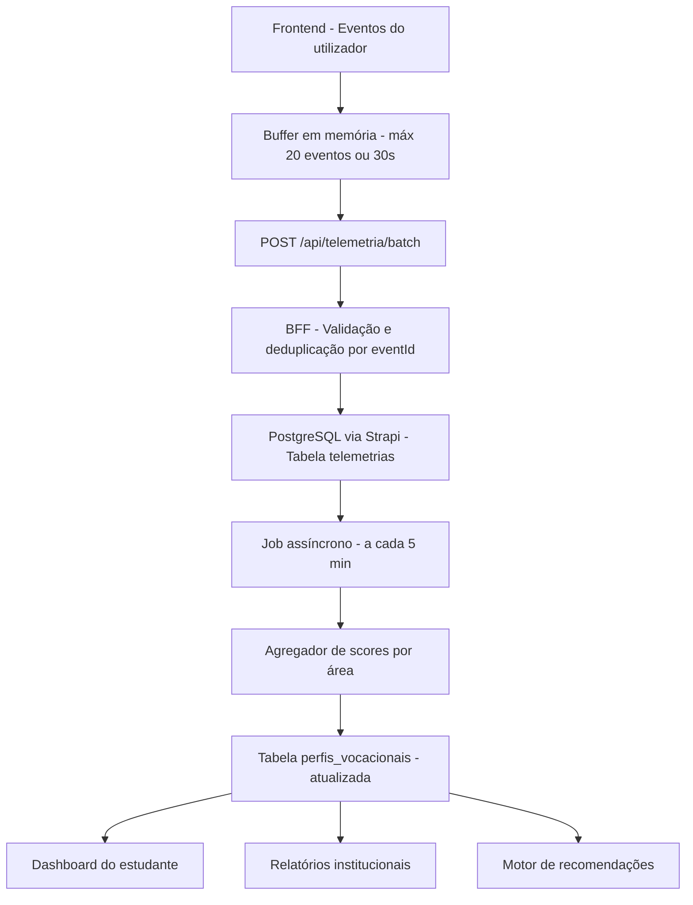
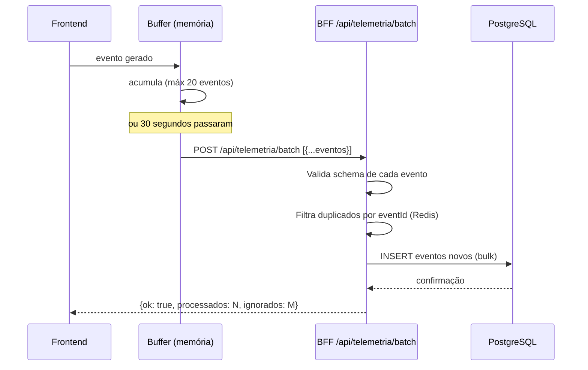
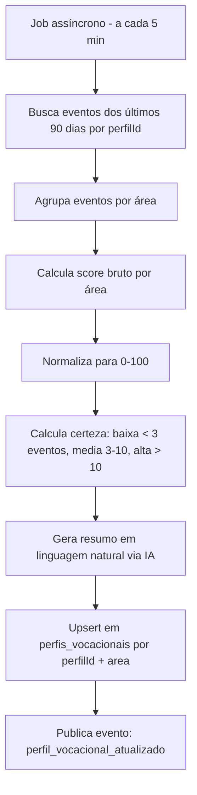

# PDC — Modelo de Telemetria e Perfil Vocacional

# PDC — Modelo de Telemetria e Perfil Vocacional

<user_quoted_section>Este documento define o schema completo de eventos de telemetria, o pipeline de processamento, e como os dados alimentam o perfil vocacional e os relatórios institucionais. Baseado na análise de  e .</user_quoted_section>

## 1. Diagnóstico do Estado Atual

O sistema atual de telemetria tem problemas críticos:

| Problema | Localização | Impacto |
| --- | --- | --- |
| Eventos guardados em ficheiro JSON local (`learning-events.json`) | `learning-analytics.service.js` | Dados perdidos ao reiniciar; não escala |
| Sem `eventId` UUID | Schema `telemetria` | Sem idempotência — duplicados possíveis |
| Sem `sessionId` nem `correlationId` | Schema `telemetria` | Impossível rastrear fluxos |
| Apenas 4 campos no schema | `telemetria/schema.json` | Sem contexto suficiente para análise |
| `perfil-vocacional` sem campo `area` | `perfil-vocacional/schema.json` | Não sabe a que área se refere o score |
| Perfil vocacional calculado manualmente | Não existe pipeline automático | Nunca é atualizado |
| Rate limiting de IA em `Map` em memória | `ai-tutor-stream-routes.js` | Reinicia com o servidor |

## 2. Arquitetura do Pipeline de Telemetria



## 3. Catálogo Completo de Eventos

### 3.1 Eventos de Navegação

| Evento | Quando dispara | Dados capturados |
| --- | --- | --- |
| `pagina_visitada` | Utilizador entra numa página | `url`, `referrer`, `role` |
| `tempo_na_pagina` | Utilizador sai da página | `url`, `duracaoSegundos`, `scrollDepth` |
| `scroll_depth` | Utilizador faz scroll | `url`, `percentagem` (25/50/75/100) |
| `sessao_iniciada` | Login ou abertura da app | `sessionId`, `dispositivo`, `plataforma` |
| `sessao_terminada` | Logout ou inatividade | `sessionId`, `duracaoTotal` |

### 3.2 Eventos de Simulação (peso mais alto no perfil vocacional)

| Evento | Quando dispara | Dados capturados |
| --- | --- | --- |
| `simulacao_iniciada` | Utilizador clica "Iniciar" | `simulacaoId`, `area`, `tipo`, `tentativaNum` |
| `simulacao_pausada` | Utilizador pausa | `simulacaoId`, `tempoDecorrido`, `progressoAtual` |
| `simulacao_retomada` | Utilizador retoma | `simulacaoId`, `tempoAusente` |
| `questao_respondida` | Resposta submetida (Tipo 3) | `simulacaoId`, `questaoId`, `tempoResposta`, `correta`, `area` |
| `criterio_marcado` | Critério marcado (Tipo 1) | `simulacaoId`, `criterioId`, `tempoDecorrido` |
| `iframe_interagido` | Interação no lab externo (Tipo 2) | `simulacaoId`, `duracaoNoIframe`, `tentativas` |
| `simulacao_concluida` | Simulação terminada com sucesso | `simulacaoId`, `area`, `score`, `tempoTotal`, `tentativaNum` |
| `simulacao_abandonada` | Utilizador sai sem concluir | `simulacaoId`, `area`, `progressoAoAbandonar`, `tempoDecorrido` |

### 3.3 Eventos de Cursos

| Evento | Quando dispara | Dados capturados |
| --- | --- | --- |
| `curso_visualizado` | Utilizador abre detalhe do curso | `cursoId`, `area`, `nivel` |
| `curso_inscrito` | Inscrição confirmada | `cursoId`, `area`, `gratuito` |
| `modulo_iniciado` | Utilizador abre módulo | `cursoId`, `moduloId`, `area` |
| `item_iniciado` | Utilizador abre item | `cursoId`, `moduloId`, `itemId`, `tipo` |
| `video_assistido` | Vídeo assistido | `itemId`, `percentagemAssistida`, `duracaoSegundos` |
| `quiz_respondido` | Quiz submetido | `quizId`, `cursoId`, `score`, `tentativas` |
| `tarefa_submetida` | Tarefa enviada | `tarefaId`, `cursoId` |
| `modulo_concluido` | Módulo marcado como concluído | `cursoId`, `moduloId`, `area`, `tempoTotal` |
| `curso_concluido` | Curso 100% completo | `cursoId`, `area`, `tempoTotal`, `nota` |

### 3.4 Eventos de Experiências

| Evento | Quando dispara | Dados capturados |
| --- | --- | --- |
| `experiencia_visualizada` | Utilizador abre detalhe | `experienciaId`, `area`, `instituicaoId` |
| `depoimento_assistido` | Vídeo de depoimento assistido | `experienciaId`, `depoimentoId`, `percentagem` |
| `timeline_explorada` | Utilizador navega na timeline | `experienciaId`, `entradas_vistas` |
| `pergunta_feita` | Utilizador faz pergunta na comunidade | `experienciaId`, `area` |
| `experiencia_bookmarkada` | Utilizador guarda experiência | `experienciaId`, `area` |

### 3.5 Eventos de Decisão (sinais vocacionais fortes)

| Evento | Quando dispara | Dados capturados |
| --- | --- | --- |
| `area_explorada` | Utilizador filtra por área | `area`, `contexto` (catálogo/pesquisa) |
| `mentor_visitado` | Utilizador visita perfil de mentor | `mentorId`, `areaEspecialidade` |
| `mentor_contactado` | Utilizador envia mensagem a mentor | `mentorId`, `areaEspecialidade` |
| `vinculo_solicitado` | Utilizador pede vínculo | `destinatarioId`, `tipo` |
| `instituicao_visitada` | Utilizador visita perfil de instituição | `instituicaoId`, `area` |
| `conteudo_bookmarkado` | Utilizador guarda conteúdo | `targetType`, `targetId`, `area` |
| `pesquisa_realizada` | Utilizador pesquisa | `query`, `resultados`, `area_filtrada` |

### 3.6 Eventos de Interação Social

| Evento | Quando dispara | Dados capturados |
| --- | --- | --- |
| `like_dado` | Utilizador dá like | `targetType`, `targetId` |
| `comentario_feito` | Utilizador comenta | `targetType`, `targetId` |
| `conquista_partilhada` | Utilizador partilha conquista | `conquistaId` |
| `projeto_criado` | Utilizador cria projeto | `projetoId`, `area` |
| `parceiro_procurado` | Utilizador ativa "busco parceiro" | `projetoId`, `area` |

## 4. Envelope Padrão de Evento

Todos os eventos seguem este envelope — baseado no contrato definido em file:docs/reformulation-2026/CONTRATO_EVENTOS_NATS_STRAPI_IA_2026.md:

```json
{
  "eventId": "uuid-v4",
  "sessionId": "uuid-v4",
  "correlationId": "uuid-v4",
  "tipo": "simulacao_concluida",
  "targetType": "simulacao",
  "targetId": "documentId-da-simulacao",
  "dados": {
    "area": "ENGENHARIA",
    "score": 87.5,
    "tempoTotal": 1240,
    "tentativaNum": 2
  },
  "clientTimestamp": 1712345678000,
  "url": "/simulacoes/engenharia-civil-intro",
  "perfilId": "123"
}
```

**Regras do envelope:**

- `eventId` — UUID v4 gerado no cliente; garante idempotência no servidor
- `sessionId` — UUID gerado no início da sessão; persiste até logout
- `correlationId` — UUID gerado por fluxo (ex: toda a jornada de uma simulação)
- `clientTimestamp` — epoch ms no cliente; o servidor adiciona `serverTimestamp`
- `dados` — payload específico do evento; validado por schema no BFF

## 5. Envio em Batch



**Regras do batch:**

- Máximo 20 eventos por request
- Máximo 2 KB por evento
- Timeout de 30 segundos — envia mesmo com menos de 20 eventos
- Persistência local em `sessionStorage` como fallback se offline
- Retry automático com backoff exponencial (1s, 2s, 4s, máx 3 tentativas)
- `eventId` UUID garante que duplicados são ignorados silenciosamente

## 6. Cálculo do Perfil Vocacional

### 6.1 Pesos por tipo de evento

| Tipo de evento | Peso | Justificação |
| --- | --- | --- |
| `simulacao_concluida` | 40 pts × (score/100) | Comportamento mais revelador |
| `simulacao_abandonada` | -5 pts | Sinal negativo de afinidade |
| `modulo_concluido` | 15 pts | Comprometimento com aprendizagem |
| `curso_concluido` | 30 pts | Conclusão completa |
| `experiencia_visualizada` | 5 pts | Interesse exploratório |
| `depoimento_assistido` (>75%) | 8 pts | Interesse genuíno |
| `mentor_contactado` | 10 pts | Intenção ativa |
| `conteudo_bookmarkado` | 6 pts | Interesse guardado |
| `area_explorada` | 3 pts | Exploração passiva |
| `pesquisa_realizada` (com área) | 4 pts | Intenção de pesquisa |
| `projeto_criado` (com área) | 20 pts | Iniciativa criativa |

### 6.2 Algoritmo de cálculo



**Fórmula de score por área:**

- Score bruto = soma dos pontos ponderados de todos os eventos nessa área
- Score normalizado = min(100, score_bruto / fator_normalizacao)
- Fator de normalização = 200 (score máximo teórico para um utilizador muito ativo)
- Score global = média ponderada dos 3 scores mais altos

**Níveis de certeza:**

- `baixa` — menos de 3 eventos na área (score pouco confiável)
- `media` — 3 a 10 eventos (score razoável)
- `alta` — mais de 10 eventos (score confiável)

### 6.3 Output do perfil vocacional

O estudante vê no dashboard:

```wireframe

<html>
<head>
<style>
  body { font-family: system-ui; background: #f8f8f8; padding: 24px; margin: 0; }
  .card { background: white; border-radius: 16px; padding: 32px; max-width: 600px; }
  h2 { font-size: 20px; font-weight: 700; margin: 0 0 8px; color: #111; }
  .subtitle { font-size: 14px; color: #666; margin: 0 0 32px; }
  .area-row { display: flex; align-items: center; gap: 16px; margin-bottom: 20px; }
  .area-label { font-size: 14px; font-weight: 600; color: #111; width: 140px; flex-shrink: 0; }
  .bar-track { flex: 1; height: 8px; background: #f0f0f0; border-radius: 4px; overflow: hidden; }
  .bar-fill { height: 100%; border-radius: 4px; background: #2563eb; }
  .bar-fill.gold { background: #d97706; }
  .bar-fill.green { background: #16a34a; }
  .score { font-size: 14px; font-weight: 700; color: #111; width: 40px; text-align: right; }
  .certeza { font-size: 11px; color: #888; width: 50px; }
  .resumo { background: #f0f4ff; border-radius: 12px; padding: 16px; margin-top: 24px; font-size: 14px; color: #333; line-height: 1.6; }
  .badge { display: inline-block; font-size: 11px; font-weight: 600; padding: 2px 8px; border-radius: 20px; background: #dbeafe; color: #1d4ed8; margin-bottom: 12px; }
</style>
</head>
<body>
<div class="card">
  <span class="badge">Perfil Vocacional</span>
  <h2>As tuas áreas de maior afinidade</h2>
  <p class="subtitle">Baseado em 23 simulações e 8 cursos explorados</p>

  <div class="area-row">
    <span class="area-label">Tecnologia</span>
    <div class="bar-track"><div class="bar-fill" style="width:87%"></div></div>
    <span class="score">87</span>
    <span class="certeza">● Alta</span>
  </div>
  <div class="area-row">
    <span class="area-label">Engenharia</span>
    <div class="bar-track"><div class="bar-fill gold" style="width:72%"></div></div>
    <span class="score">72</span>
    <span class="certeza">● Média</span>
  </div>
  <div class="area-row">
    <span class="area-label">Gestão</span>
    <div class="bar-track"><div class="bar-fill green" style="width:54%"></div></div>
    <span class="score">54</span>
    <span class="certeza">● Média</span>
  </div>

  <div class="resumo">
    O teu perfil mostra forte aptidão técnica e interesse consistente em Tecnologia. Completaste 5 simulações nesta área com score médio de 84%. A tua próxima ação recomendada: experimenta a simulação de Redes e Sistemas para confirmar esta afinidade.
  </div>
</div>
</body>
</html>
```

## 7. Relatórios Institucionais

Os dados de telemetria alimentam relatórios dedicados para gestores de escola:

### 7.1 Relatório de Evasão

Métricas calculadas a partir de eventos de abandono:

| Métrica | Cálculo |
| --- | --- |
| Taxa de abandono por conteúdo | `simulacao_abandonada / simulacao_iniciada` por conteúdo |
| Ponto de abandono médio | `média(progressoAoAbandonar)` por conteúdo |
| Tempo médio antes de abandonar | `média(tempoDecorrido)` em abandonos |
| Comparação com média da plataforma | Score da escola vs. média global |

### 7.2 Relatório de Engagement

| Métrica | Cálculo |
| --- | --- |
| Alunos ativos (últimos 30 dias) | Perfis com ≥ 1 evento nos últimos 30 dias |
| Tempo médio na plataforma | `soma(tempo_na_pagina.duracaoSegundos)` por perfil |
| Conteúdos mais populares | Top 10 por `targetId` em eventos de visualização |
| Taxa de conclusão de simulações | `simulacao_concluida / simulacao_iniciada` |
| Vídeos assistidos até ao fim | `video_assistido` com `percentagemAssistida > 90` |

### 7.3 Relatório de Perfil Vocacional da Escola

Distribuição agregada (anonimizada) das áreas de interesse dos alunos da escola:

| Área | % dos alunos com afinidade alta | Tendência |
| --- | --- | --- |
| Tecnologia | 34% | ↑ +8% vs. trimestre anterior |
| Saúde | 28% | → estável |
| Engenharia | 19% | ↓ -3% |

## 8. Privacidade e Retenção

| Regra | Detalhe |
| --- | --- |
| **Retenção de eventos brutos** | 2 anos; após isso, anonimizados (`perfilId → null`) |
| **Perfil vocacional** | Mantido enquanto a conta existir |
| **Relatórios institucionais** | Apenas dados agregados — nunca dados individuais identificáveis |
| **Consentimento** | Utilizador aceita telemetria no onboarding; pode desativar nas definições |
| **Dados sensíveis** | Nunca capturar: passwords, dados de pagamento, mensagens privadas |
| **IP** | Nunca guardado em claro — apenas hash SHA-256 |

## 9. Integração com IA

O tutor IA (file:src/server/ai-tutor-stream-routes.js) já recebe `progressSummary` com sinais de engajamento. Na reconstrução, este contexto é enriquecido com dados reais do perfil vocacional:

```json
{
  "progressSummary": {
    "avgProgress": 67,
    "affinity": 87,
    "engagement": 72,
    "topArea": "TECNOLOGIA",
    "certeza": "alta",
    "ultimaSimulacao": "Redes e Sistemas",
    "ultimaSimulacaoScore": 84,
    "diasSemAtividade": 3
  }
}
```

O tutor usa estes dados para personalizar as respostas — ex: "Vejo que não entras há 3 dias. A tua simulação de Redes ficou a 84% — queres retomar?"
