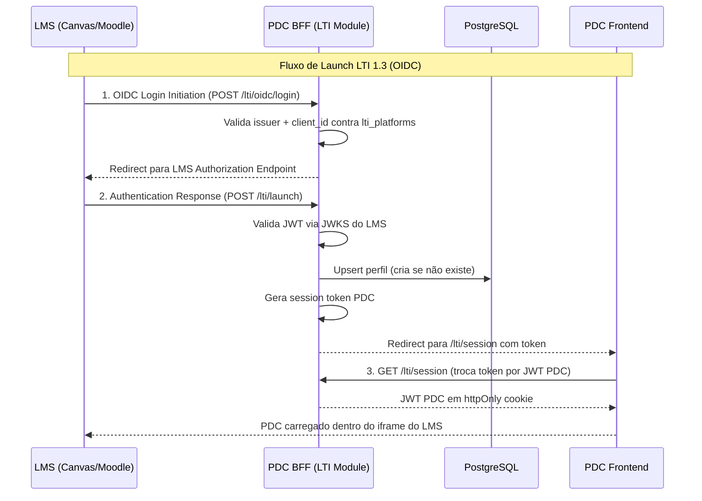
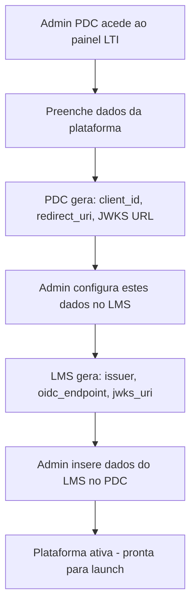
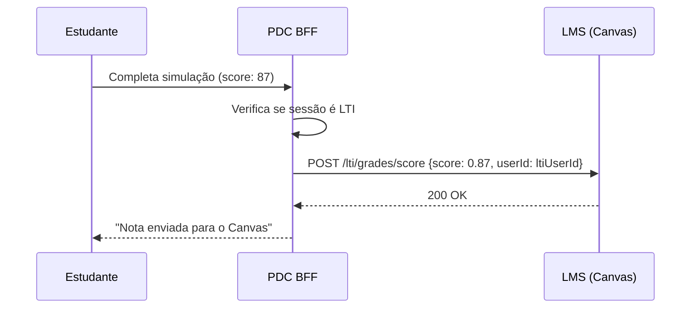

# PDC — LTI 1.3 como Serviço Próprio

# PDC — LTI 1.3 como Serviço Próprio

<user_quoted_section>⚠️ Domínio: O domínio final ainda não está definido. Todos os exemplos de URL usam api.[dominio-pdc] como placeholder. Substituir quando o domínio for escolhido.</user_quoted_section>

<user_quoted_section>Este documento define o PDC como um LTI Tool Provider independente, integrável em qualquer LMS (Canvas, Moodle, Blackboard, etc.). Baseado na análise de file:src/server/lti-launch-routes.js, file:src/server/lti-oidc-routes.js, file:src/server/lti-grades-routes.js, file:src/server/lti-nrps-routes.js e file:docs/LTI_TENANT_IMPLEMENTATION.md.</user_quoted_section>

## 1. O que é o LTI 1.3 no contexto do PDC

O PDC como **LTI Tool Provider** significa que qualquer universidade ou escola que use um LMS (Canvas, Moodle, Blackboard, etc.) pode integrar o PDC diretamente na sua plataforma. Os alunos acedem ao PDC sem sair do ambiente da universidade — o login é feito automaticamente via LTI.

**Valor para as instituições B2B:**

- Alunos acedem ao PDC dentro do Canvas/Moodle da universidade
- Notas e progresso do PDC aparecem automaticamente no gradebook do LMS
- A universidade mantém controlo total sobre quem acede
- Sem necessidade de criar contas separadas no PDC

## 2. Arquitetura do Módulo LTI



## 3. Endpoints LTI a implementar no BFF

| Método | Rota | Descrição | Estado atual |
| --- | --- | --- | --- |
| POST | `/lti/oidc/login` | OIDC Login Initiation — ponto de entrada do LMS | ✅ Existe (`lti-oidc-routes.js`) |
| POST | `/lti/launch` | Authentication Response — valida JWT do LMS | ✅ Existe (`lti-launch-routes.js`) |
| GET | `/lti/session` | Troca token temporário por JWT PDC | ❌ Falta |
| GET | `/.well-known/jwks.json` | JWKS público do PDC (chave pública para o LMS verificar) | ❌ Falta |
| POST | `/lti/grades/lineitem` | AGS — criar/atualizar line item no gradebook | ✅ Existe (`lti-grades-routes.js`) |
| POST | `/lti/grades/score` | AGS — enviar score para o LMS | ✅ Existe |
| GET | `/lti/nrps/members` | NRPS — obter lista de membros do curso | ✅ Existe (`lti-nrps-routes.js`) |
| GET | `/lti/platforms` | Admin — listar plataformas LTI configuradas | ❌ Falta |
| POST | `/lti/platforms` | Admin — registar nova plataforma LTI | ❌ Falta |
| DELETE | `/lti/platforms/:id` | Admin — remover plataforma LTI | ❌ Falta |

## 4. Registo de Plataformas LTI

O content-type `lti-platform` já existe no Strapi (file:infra/strapi/backend/src/api/lti-platform/). Na reconstrução, a gestão de plataformas é feita via painel Admin do PDC:

### Schema `lti-platform` (manter e expandir)

| Campo | Tipo | Notas |
| --- | --- | --- |
| `name` | string, required | Nome da instituição/LMS |
| `issuer` | string, required, unique | URL do LMS (ex: `https://canvas.instructure.com`) |
| `client_id` | string, required | Client ID atribuído pelo LMS |
| `oidc_auth_endpoint` | string | URL de autorização OIDC do LMS |
| `jwks_uri` | string | URL do JWKS do LMS |
| `auth_token_endpoint` | string | URL de token do LMS |
| `base_url` | string | URL base do LMS |
| `deployment_ids` | json, default: [] | IDs de deployment autorizados |
| `active` | boolean, default: true |  |
| `instituicao` | relation → Instituicao | Instituição PDC associada |
| `codigoAcesso` | string | Código B2B da escola |
| `alunosAtivos` | integer | Contador de alunos via LTI |

### Fluxo de registo de nova plataforma



## 5. Segurança do Módulo LTI

### 5.1 Validação de JWT do LMS

O código atual em file:src/server/lti-launch-routes.js já implementa validação via JWKS em produção. Na reconstrução, manter e melhorar:

- **Verificação de assinatura** via JWKS do LMS (já implementado)
- **Verificação de ****`iss`** — deve estar na lista de plataformas registadas
- **Verificação de ****`aud`** — deve ser o `client_id` da plataforma
- **Verificação de ****`exp`** — token não pode estar expirado
- **Verificação de ****`deployment_id`** — deve estar na lista autorizada
- **Nonce único** — previne replay attacks (guardar em Redis com TTL de 10 min)

### 5.2 Isolamento de sessão LTI

Quando um utilizador entra via LTI:

- A sessão PDC é marcada como `ltiSession: true`
- O `X-Frame-Options` é ajustado para permitir o domínio do LMS
- O CSP `frame-ancestors` inclui o domínio do LMS
- O utilizador não pode aceder a funcionalidades fora do contexto LTI (ex: não vê o feed geral)

### 5.3 Grade Passback (AGS)

Quando um estudante completa uma simulação ou curso no PDC via LTI:



## 6. Mapeamento de Roles LTI → Roles PDC

| Role LTI (IMS Global) | Role PDC |
| --- | --- |
| `http://purl.imsglobal.org/vocab/lis/v2/membership#Learner` | `aluno` |
| `http://purl.imsglobal.org/vocab/lis/v2/membership#Instructor` | `mentor` |
| `http://purl.imsglobal.org/vocab/lis/v2/membership#Administrator` | `moderador` |
| `http://purl.imsglobal.org/vocab/lis/v2/institution/person#Administrator` | `super_admin` |

## 7. Painel de Gestão LTI (Super Admin)

Interface no painel admin do PDC para gerir integrações LTI:

```wireframe

<html>
<head>
<style>
  body { font-family: system-ui; background: #f8f8f8; padding: 24px; margin: 0; }
  .header { display: flex; justify-content: space-between; align-items: center; margin-bottom: 24px; }
  h1 { font-size: 22px; font-weight: 700; margin: 0; color: #111; }
  .btn { background: #2563eb; color: white; border: none; padding: 10px 20px; border-radius: 8px; font-size: 14px; font-weight: 600; cursor: pointer; }
  .table { background: white; border-radius: 12px; overflow: hidden; }
  .table-header { display: grid; grid-template-columns: 2fr 2fr 1fr 1fr 80px; padding: 12px 20px; background: #f8f8f8; font-size: 12px; font-weight: 600; color: #666; text-transform: uppercase; letter-spacing: 0.05em; }
  .table-row { display: grid; grid-template-columns: 2fr 2fr 1fr 1fr 80px; padding: 16px 20px; border-top: 1px solid #f0f0f0; align-items: center; }
  .name { font-size: 14px; font-weight: 600; color: #111; }
  .issuer { font-size: 13px; color: #666; font-family: monospace; }
  .badge { display: inline-block; font-size: 11px; font-weight: 600; padding: 3px 10px; border-radius: 20px; }
  .badge.active { background: #dcfce7; color: #16a34a; }
  .badge.inactive { background: #fee2e2; color: #dc2626; }
  .alunos { font-size: 14px; font-weight: 600; color: #111; }
  .actions { display: flex; gap: 8px; }
  .action-btn { background: none; border: 1px solid #e5e5e5; padding: 6px 12px; border-radius: 6px; font-size: 12px; cursor: pointer; color: #555; }
</style>
</head>
<body>
<div class="header">
  <h1>Integrações LTI 1.3</h1>
  <button class="btn">+ Nova Plataforma</button>
</div>
<div class="table">
  <div class="table-header">
    <span>Plataforma</span>
    <span>Issuer</span>
    <span>Estado</span>
    <span>Alunos</span>
    <span></span>
  </div>
  <div class="table-row">
    <div>
      <div class="name">ISP Caála</div>
      <div class="issuer">canvas.ispcaala.ao</div>
    </div>
    <div class="issuer">https://canvas.ispcaala.ao</div>
    <span class="badge active">Ativo</span>
    <span class="alunos">247</span>
    <div class="actions">
      <button class="action-btn">Editar</button>
    </div>
  </div>
  <div class="table-row">
    <div>
      <div class="name">UCAN</div>
      <div class="issuer">moodle.ucan.ao</div>
    </div>
    <div class="issuer">https://moodle.ucan.ao</div>
    <span class="badge inactive">Inativo</span>
    <span class="alunos">0</span>
    <div class="actions">
      <button class="action-btn">Editar</button>
    </div>
  </div>
</div>
</body>
</html>
```

## 8. Guia de Integração para Instituições

Documento simplificado que o PDC envia às instituições parceiras:

### Para Canvas

1. Ir a **Admin → Developer Keys → + LTI Key**
2. Configurar:
  - **Target Link URI:** `https://api.[dominio-pdc]/lti/launch`
  - **OpenID Connect Initiation URL:** `https://api.[dominio-pdc]/lti/oidc/login`
  - **JWK Method:** Public JWK URL → `https://api.[dominio-pdc]/.well-known/jwks.json`
  - **Redirect URIs:** `https://api.[dominio-pdc]/lti/launch`
3. Copiar o **Client ID** gerado e enviar ao PDC
4. PDC activa a integração em menos de 24h

### Para Moodle

1. Ir a **Site Administration → Plugins → Activity Modules → External Tool**
2. Configurar:
  - **Tool URL:** `https://api.[dominio-pdc]/lti/launch`
  - **LTI Version:** LTI 1.3
  - **Public Keyset URL:** `https://api.[dominio-pdc]/.well-known/jwks.json`
  - **Initiate Login URL:** `https://api.[dominio-pdc]/lti/oidc/login`
3. Copiar o **Client ID** e enviar ao PDC

## 9. O que Melhorar em Relação ao Código Atual

| Problema atual | Solução na reconstrução |
| --- | --- |
| `tenant-store` em memória (ficheiro JS) | Migrar para `lti-platform` no Strapi/PostgreSQL |
| Sem endpoint `/lti/session` | Criar endpoint de troca de token temporário |
| Sem JWKS público do PDC | Criar `/.well-known/jwks.json` com chave pública RS256 |
| Sem painel de gestão de plataformas | Criar UI no painel Admin |
| `session_token` gerado mas não usado | Implementar fluxo completo de troca |
| Rate limiting em memória | Migrar para Redis |
| Sem nonce validation | Implementar nonce em Redis com TTL 10 min |
