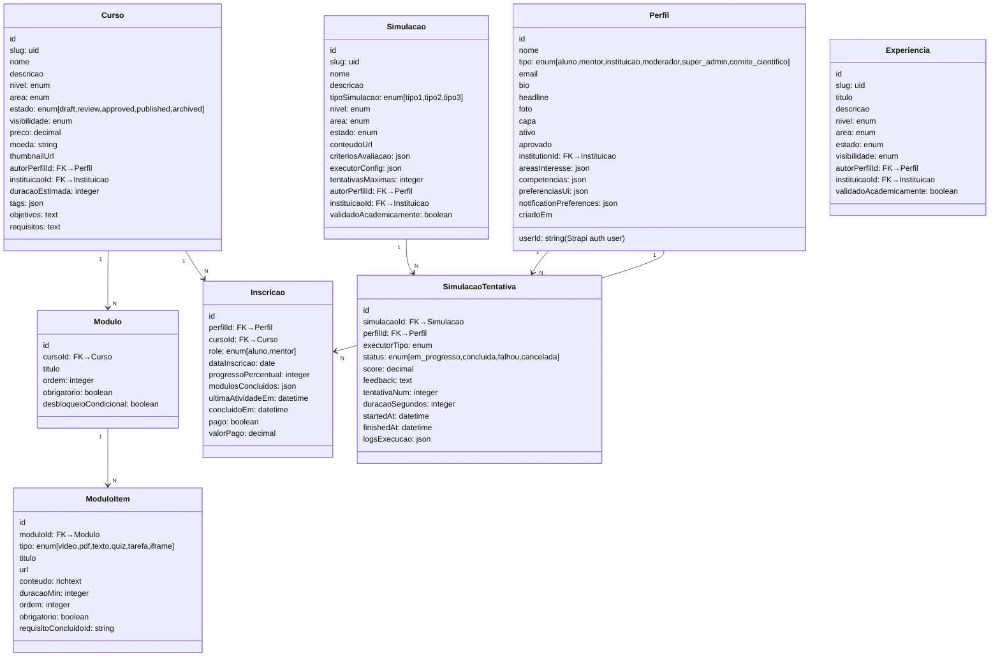

# PDC — Modelo de Dados Completo (Strapi v2)

# PDC — Modelo de Dados Completo (Strapi v2)

<user_quoted_section>Este documento define o schema definitivo de todos os content-types do Strapi v2 para o PDC. É a fonte de verdade antes de qualquer migração. Baseado na análise completa de file:infra/strapi/backend/src/api/.</user_quoted_section>

## 1. Diagnóstico do Schema Atual

### Problemas críticos identificados

| Content-Type | Problema | Ação |
| --- | --- | --- |
| `notificacao` | Relação com `admin::user` (utilizador Strapi) em vez de `api::perfil.perfil` | 🔴 Corrigir |
| `interacao` | Schema genérico com 4 campos — não suporta likes, bookmarks, comentários separados | 🔴 Substituir |
| `telemetria` | Sem `eventId` UUID, sem `sessionId`, sem `correlationId` — impossível garantir idempotência | 🔴 Expandir |
| `vinculo` | Relação com `api::estudante.estudante` (content-type legado) em vez de `api::perfil.perfil` | 🔴 Corrigir |
| `proposta` | Relação com `api::estudante.estudante` em vez de `api::perfil.perfil` | 🔴 Corrigir |
| `perfil-vocacional` | Sem campo `area` — não sabe a que área se refere o score | 🔴 Expandir |
| `audit-log` | Sem `ipHash`, `userAgent`, `actorRole`, `serverTimestamp` | 🟠 Expandir |
| `modulo-item` | Tipo `iframe` em falta no enum — necessário para simulações Tipo 2 | 🟠 Corrigir |
| `conquista` | Sem `tipo` (automática/manual/institucional), sem `categoria` | 🟠 Expandir |
| `post` | Sem `mediaUrls`, sem `slug`, sem `tags` | 🟠 Expandir |
| `curso` | Campo `modulos` JSON legado coexiste com content-type `modulo` — ambiguidade | 🟡 Limpar |
| `perfil` | `instituicaoRef` como JSON em vez de relação real com `api::instituicao.instituicao` | 🟡 Migrar |

### Content-types a eliminar

| Content-Type | Motivo |
| --- | --- |
| `api::estudante.estudante` | Duplicado de `api::perfil.perfil` com tipo `aluno` — causa confusão nas relações |
| `api::comentario-conquista` | Unificar em `api::comentario` polimórfico |
| `api::comentario-simulacao` | Unificar em `api::comentario` polimórfico |
| `api::grupo` | Não está no roadmap V1 — eliminar para reduzir complexidade |
| `api::grupo-tarefa` | Idem |
| `api::secao` | Não usado — eliminar |
| `api::outcome` | Não usado — eliminar |
| `api::pagina` | Substituído por `site-config` |

## 2. Diagrama de Relações (ERD Simplificado)

## 3. Schema Definitivo por Content-Type

### 3.1 `perfil` — Corrigido e expandido

**Alterações em relação ao atual:**

- `instituicaoRef` (JSON) → `instituicao` (relação real com `api::instituicao.instituicao`)
- Adicionar `userId` (string) — referência ao utilizador Strapi Auth
- Adicionar `codigoInstitucional` (string) — para acesso B2B via código de escola
- Adicionar `modoAcesso` (enum: `individual`, `institucional`) — distingue B2C de B2B
- Adicionar `suspensaAte` (datetime) — para suspensões temporárias
- Remover `instituicaoRef` JSON legado

| Campo | Tipo | Notas |
| --- | --- | --- |
| `nome` | string, required |  |
| `tipo` | enum[aluno, mentor, instituicao, moderador, super_admin, comite_cientifico] |  |
| `email` | email |  |
| `userId` | string | ID do utilizador Strapi Auth |
| `ativo` | boolean, default: true |  |
| `suspensaAte` | datetime | null = não suspenso |
| `bio` | text, max: 1000 |  |
| `headline` | string, max: 200 |  |
| `foto` | media |  |
| `capa` | media |  |
| `telefone` | string |  |
| `website` | string |  |
| `socialLinks` | json |  |
| `areasInteresse` | json | array de strings |
| `competencias` | json | array de strings |
| `areaFormacao` | string |  |
| `regiao` | string |  |
| `nivelEnsino` | string |  |
| `anoAcademico` | string |  |
| `funcao` | string | para mentores |
| `tipoInstituicao` | string | para instituições |
| `niveisEnsino` | json | para instituições |
| `modalidadeCusto` | string | para instituições |
| `natureza` | string | pública/privada |
| `aprovado` | boolean, default: true |  |
| `modoAcesso` | enum[individual, institucional], default: individual |  |
| `codigoInstitucional` | string | código da escola B2B |
| `instituicao` | relation manyToOne → Instituicao | substituiu `instituicaoRef` |
| `documentos` | json | URLs de documentos |
| `notificationPreferences` | json |  |
| `visibilitySettings` | json |  |
| `preferenciasUi` | json |  |
| `language` | string, default: pt-AO |  |

### 3.2 `curso` — Expandido com preço e slug

**Alterações:**

- Adicionar `slug` (uid) — para URLs amigáveis
- Adicionar `preco` (decimal) e `moeda` (string) — monetização
- Adicionar `gratuito` (boolean) — flag explícita
- Adicionar `tags` (json) — array em vez de string separada por vírgulas
- Remover `modulos` JSON legado — usar apenas content-type `modulo`
- `autorPerfilId` → relação real com `api::perfil.perfil`

| Campo | Tipo | Notas |
| --- | --- | --- |
| `slug` | uid, unique | gerado de `nome` |
| `nome` | string, required |  |
| `descricao` | text |  |
| `nivel` | enum[basico, medio, avancado] |  |
| `area` | enum[ENGENHARIA, SAUDE, TECNOLOGIA, AGRONOMIA, GESTAO, EDUCACAO, DIREITO, CIENCIAS_SOCIAIS, ARTES, OUTRO] |  |
| `idioma` | enum[pt, en, fr], default: pt |  |
| `estado` | enum[draft, review, approved, published, archived], default: draft |  |
| `visibilidade` | enum[publico, privado, institucional], default: publico |  |
| `gratuito` | boolean, default: true |  |
| `preco` | decimal | null se gratuito |
| `moeda` | string, default: USD |  |
| `thumbnailUrl` | string | URL R2 ou externa |
| `objetivos` | text |  |
| `requisitos` | text |  |
| `syllabus` | text |  |
| `duracaoEstimada` | integer | horas |
| `tags` | json | array de strings |
| `autor` | relation manyToOne → Perfil | substituiu `autorPerfilId` integer |
| `instituicao` | relation manyToOne → Instituicao |  |
| `dataInicio` | date |  |
| `dataFim` | date |  |
| `motivoRejeicao` | text |  |
| `historicoEstados` | json | audit trail de transições |

### 3.3 `modulo-item` — Tipo `iframe` e `texto` adicionados

**Alterações:**

- Adicionar `iframe` e `texto` ao enum de `tipo`
- Adicionar `conteudo` (richtext) — para itens de tipo `texto`

| Campo | Tipo | Notas |
| --- | --- | --- |
| `moduloId` | relation manyToOne → Modulo, required |  |
| `tipo` | enum[video, pdf, texto, quiz, tarefa, iframe], required |  |
| `titulo` | string, required |  |
| `url` | string | para video, pdf, iframe |
| `conteudo` | richtext | para tipo texto |
| `duracaoMin` | integer |  |
| `ordem` | integer, default: 0 |  |
| `obrigatorio` | boolean, default: true |  |
| `requisitoConcluidoId` | string | documentId de pré-requisito |

### 3.4 `simulacao` — Tipo 3 adicionado

**Alterações:**

- Adicionar `tipo3` ao enum de `tipoSimulacao`
- Adicionar `slug` (uid)
- `autorPerfilId` → relação real com `api::perfil.perfil`

| Campo | Tipo | Notas |
| --- | --- | --- |
| `slug` | uid, unique |  |
| `nome` | string, required |  |
| `descricao` | text |  |
| `tipoSimulacao` | enum[tipo1, tipo2, tipo3] |  |
| `nivel` | enum[basico, medio, avancado] |  |
| `area` | enum[...] | mesmo enum de curso |
| `estado` | enum[draft, review, approved, published, archived] |  |
| `conteudoUrl` | string | vídeo (tipo1) ou iframe (tipo2) |
| `criteriosAvaliacao` | json | array de critérios com peso |
| `executorConfig` | json | config por tipo |
| `tentativasMaximas` | integer, default: 0 | 0 = sem limite |
| `materiaisInfo` | json | leituras e downloads |
| `tags` | json | array de strings |
| `autor` | relation manyToOne → Perfil |  |
| `instituicao` | relation manyToOne → Instituicao |  |
| `validadoAcademicamente` | boolean, default: false |  |
| `comiteValidacao` | text |  |
| `dataValidacao` | datetime |  |
| `motivoRejeicao` | text |  |
| `historicoEstados` | json |  |

### 3.5 `simulacao-tentativa` — Status expandido

**Alterações:**

- Adicionar `em_progresso` ao enum de `status`
- Adicionar `areaScore` (json) — scores por área para o perfil vocacional

| Campo | Tipo | Notas |
| --- | --- | --- |
| `simulacao` | relation manyToOne → Simulacao, required |  |
| `perfil` | relation manyToOne → Perfil, required |  |
| `executorTipo` | enum[tipo1, tipo2, tipo3] |  |
| `status` | enum[em_progresso, concluida, falhou, cancelada] |  |
| `score` | decimal, default: 0 | 0-100 |
| `areaScore` | json | scores por dimensão |
| `feedback` | text |  |
| `sugestao` | text |  |
| `tentativaNum` | integer, required |  |
| `duracaoSegundos` | integer |  |
| `startedAt` | datetime |  |
| `finishedAt` | datetime |  |
| `logsExecucao` | json | eventos capturados |
| `outputExecucao` | json | resultado final |

### 3.6 `telemetria` — Expandido com idempotência

**Alterações críticas:**

- Adicionar `eventId` (string, unique) — UUID v4 para idempotência
- Adicionar `sessionId` (string) — UUID da sessão
- Adicionar `correlationId` (string) — para rastrear fluxos
- Adicionar `targetType` e `targetId` — o que foi interagido
- Adicionar `dados` (json) — payload específico do evento
- Adicionar `clientTimestamp` (biginteger) — epoch ms do cliente
- Manter `perfil` (relação) e `tipo` (string)

| Campo | Tipo | Notas |
| --- | --- | --- |
| `eventId` | string, unique, required | UUID v4 — idempotência |
| `sessionId` | string, required | UUID da sessão |
| `correlationId` | string | para rastrear fluxos |
| `tipo` | string, required | ex: `simulacao_iniciada` |
| `targetType` | string | ex: `simulacao`, `curso` |
| `targetId` | string | documentId do alvo |
| `dados` | json | payload específico |
| `clientTimestamp` | biginteger | epoch ms no cliente |
| `url` | string | página onde ocorreu |
| `userAgent` | string |  |
| `perfil` | relation manyToOne → Perfil |  |

### 3.7 `perfil-vocacional` — Expandido com área

**Alterações:**

- Adicionar `area` (enum) — a que área se refere este perfil
- Adicionar `certeza` (enum: baixa/media/alta) — confiança do cálculo
- Adicionar `totalEventos` (integer) — quantos eventos alimentaram o cálculo
- Adicionar `ultimoCalculoEm` (datetime)
- Um perfil pode ter múltiplos registos (um por área)

| Campo | Tipo | Notas |
| --- | --- | --- |
| `perfil` | relation manyToOne → Perfil, required |  |
| `area` | enum[ENGENHARIA, SAUDE, TECNOLOGIA, AGRONOMIA, GESTAO, EDUCACAO, DIREITO, CIENCIAS_SOCIAIS, ARTES, OUTRO] |  |
| `aptidaoTecnica` | float, 0-100 | capacidade técnica observada |
| `compatibilidadePsicologica` | float, 0-100 | alinhamento de personalidade |
| `motivacaoIntrinseca` | float, 0-100 | interesse genuíno |
| `potencialSucesso` | float, 0-100 | probabilidade de conclusão |
| `scoreGlobal` | float, 0-100 | média ponderada |
| `certeza` | enum[baixa, media, alta] | confiança do cálculo |
| `totalEventos` | integer | eventos que alimentaram |
| `resumo` | text | interpretação em linguagem natural |
| `ultimoCalculoEm` | datetime |  |

### 3.8 `notificacao` — Corrigida para usar Perfil

**Alteração crítica:** `usuario` (admin::user) → `perfil` (api::perfil.perfil)

| Campo | Tipo | Notas |
| --- | --- | --- |
| `perfil` | relation manyToOne → Perfil, required | substituiu `usuario` |
| `tipo` | string, required | ex: `like`, `vinculo_pedido`, `conteudo_aprovado` |
| `titulo` | string |  |
| `mensagem` | text, required |  |
| `lida` | boolean, default: false |  |
| `lidaEm` | datetime |  |
| `targetType` | string | tipo do recurso relacionado |
| `targetId` | string | id do recurso relacionado |
| `actorId` | string | quem gerou a notificação |
| `agrupada` | boolean, default: false | notificação agrupada |
| `contagemAgrupada` | integer, default: 1 | quantas notificações agrupa |
| `data` | datetime |  |

### 3.9 `vinculo` — Corrigido para usar Perfil

**Alteração:** Remover relação com `api::estudante.estudante` — usar apenas `api::perfil.perfil`

| Campo | Tipo | Notas |
| --- | --- | --- |
| `solicitante` | relation manyToOne → Perfil, required | quem pediu |
| `destinatario` | relation manyToOne → Perfil, required | quem recebe |
| `tipo` | enum[aluno-mentor, mentor-instituicao, aluno-instituicao] |  |
| `status` | enum[pendente, aprovado, rejeitado, cancelado], default: pendente |  |
| `mensagem` | text, max: 300 | mensagem de pedido |
| `visibleOnProfile` | boolean, default: true |  |
| `documentos` | json |  |
| `criadoEm` | datetime |  |
| `resolvidoEm` | datetime |  |

**Índice único:** `(solicitanteId, destinatarioId, tipo)` — previne duplicados

### 3.10 `conquista` — Expandida com tipo e categoria

**Alterações:**

- Adicionar `tipo` (enum: automatica/manual/institucional)
- Adicionar `categoria` (string) — ex: `primeira_simulacao`, `curso_concluido`
- Adicionar `slug` (uid)
- Adicionar `tags` (json)

| Campo | Tipo | Notas |
| --- | --- | --- |
| `slug` | uid, unique |  |
| `titulo` | string, required |  |
| `descricao` | text |  |
| `tipo` | enum[automatica, manual, institucional, plataforma] |  |
| `categoria` | string | ex: `primeira_simulacao` |
| `midias` | media, multiple |  |
| `autor` | relation manyToOne → Perfil |  |
| `tipoAutor` | enum[mentor, instituicao, plataforma, aluno] |  |
| `aprovada` | boolean, default: false |  |
| `tags` | json |  |
| `data` | datetime |  |
| `validadoAcademicamente` | boolean, default: false |  |

### 3.11 `post` — Expandido com media e slug

| Campo | Tipo | Notas |
| --- | --- | --- |
| `slug` | uid, unique |  |
| `titulo` | string, required |  |
| `descricao` | text |  |
| `conteudo` | richtext |  |
| `tipo` | enum[post, aviso, noticia, conquista_partilhada] |  |
| `autor` | relation manyToOne → Perfil |  |
| `tipoAutor` | enum[mentor, instituicao, plataforma, aluno] |  |
| `mediaUrls` | json | array de URLs de media |
| `tags` | json |  |
| `aprovada` | boolean, default: false |  |
| `estado` | enum[draft, published, archived], default: draft |  |

### 3.12 `audit-log` — Expandido com campos de segurança

| Campo | Tipo | Notas |
| --- | --- | --- |
| `acao` | string, required | ex: `login`, `criar_curso` |
| `actorId` | string | perfilId de quem agiu |
| `actorRole` | string | role no momento |
| `alvoId` | string | id do recurso afetado |
| `alvoTipo` | string | tipo do recurso |
| `detalhes` | json | contexto adicional |
| `ipHash` | string | SHA-256 do IP |
| `userAgent` | string |  |
| `serverTimestamp` | datetime | definido pelo servidor |
| `autor` | relation manyToOne → Perfil |  |

### 3.13 `denuncia` — Expandida com moderação real

| Campo | Tipo | Notas |
| --- | --- | --- |
| `tipo` | string, required | categoria da denúncia |
| `motivo` | string, required | motivo específico |
| `targetType` | string | tipo do conteúdo denunciado |
| `targetId` | string | id do conteúdo |
| `detalhes` | text, max: 500 |  |
| `autor` | relation manyToOne → Perfil | denunciante |
| `estado` | enum[pendente, em_analise, resolvida, rejeitada], default: pendente |  |
| `prioridade` | enum[baixa, media, alta, critica] | calculada pelo servidor |
| `moderador` | relation manyToOne → Perfil | quem está a analisar |
| `comentarioModerador` | text |  |
| `acaoTomada` | enum[nenhuma, aviso, remocao, suspensao] |  |
| `resolvidaEm` | datetime |  |

### 3.14 `proposta` — Corrigida para usar Perfil

| Campo | Tipo | Notas |
| --- | --- | --- |
| `estudante` | relation manyToOne → Perfil, required | substituiu `api::estudante` |
| `instituicao` | relation manyToOne → Instituicao, required |  |
| `titulo` | string, required |  |
| `descricao` | text |  |
| `tipo` | enum[emprego, estagio, bolsa, parceria] |  |
| `status` | enum[pendente, aceita, recusada, expirada], default: pendente |  |
| `mensagem` | text, max: 500 |  |
| `expiradaEm` | datetime |  |
| `criadoEm` | datetime |  |

### 3.15 `instituicao` — Expandida com B2B

| Campo | Tipo | Notas |
| --- | --- | --- |
| `nome` | string, required |  |
| `slug` | uid, unique |  |
| `descricao` | text |  |
| `tipo` | enum[universidade, instituto, escola, empresa, ong, outro] |  |
| `endereco` | string |  |
| `regiao` | string |  |
| `natureza` | enum[publica, privada, mista] |  |
| `contatos` | json |  |
| `website` | string |  |
| `logo` | media |  |
| `capa` | media |  |
| `codigoAcesso` | string, unique | código B2B para alunos |
| `planoAtivo` | enum[gratuito, basico, premium] |  |
| `limiteAlunos` | integer | 0 = sem limite |
| `aprovada` | boolean, default: false |  |
| `branding` | json | cores, fontes, logo personalizado |

## 4. Novos Content-Types a Criar

### 4.1 `like` — Substituir `interacao` genérica

| Campo | Tipo | Notas |
| --- | --- | --- |
| `actor` | relation manyToOne → Perfil, required |  |
| `targetType` | string, required | ex: `post`, `curso`, `simulacao` |
| `targetId` | string, required | documentId do alvo |
| `criadoEm` | datetime |  |

**Índice único:** `(actorId, targetType, targetId)`

### 4.2 `bookmark` — Guardar conteúdo

| Campo | Tipo | Notas |
| --- | --- | --- |
| `actor` | relation manyToOne → Perfil, required |  |
| `targetType` | string, required |  |
| `targetId` | string, required |  |
| `colecao` | string | nome da coleção (opcional) |
| `criadoEm` | datetime |  |

**Índice único:** `(actorId, targetType, targetId)`

### 4.3 `comentario` — Polimórfico (substitui comentario-conquista e comentario-simulacao)

| Campo | Tipo | Notas |
| --- | --- | --- |
| `autor` | relation manyToOne → Perfil, required |  |
| `targetType` | string, required | ex: `post`, `simulacao`, `conquista` |
| `targetId` | string, required |  |
| `conteudo` | text, required, max: 1000 |  |
| `parentId` | string | para respostas |
| `estado` | enum[ativo, removido, moderado], default: ativo |  |
| `editadoEm` | datetime |  |
| `criadoEm` | datetime |  |

### 4.4 `avaliacao` — Rating estruturado

| Campo | Tipo | Notas |
| --- | --- | --- |
| `actor` | relation manyToOne → Perfil, required |  |
| `targetType` | string, required |  |
| `targetId` | string, required |  |
| `estrelas` | integer, 1-5, required |  |
| `comentario` | text, max: 500 |  |
| `criterios` | json | scores por critério |
| `criadoEm` | datetime |  |
| `editadoEm` | datetime |  |

**Índice único:** `(actorId, targetType, targetId)`

### 4.5 `partilha` — Tracking de partilhas

| Campo | Tipo | Notas |
| --- | --- | --- |
| `actor` | relation manyToOne → Perfil, required |  |
| `targetType` | string, required |  |
| `targetId` | string, required |  |
| `canal` | enum[interno, whatsapp, linkedin, twitter, email, outro] |  |
| `criadoEm` | datetime |  |

### 4.6 `voto-projeto` — Votos em projetos

| Campo | Tipo | Notas |
| --- | --- | --- |
| `actor` | relation manyToOne → Perfil, required |  |
| `projeto` | relation manyToOne → Projeto, required |  |
| `tipo` | enum[upvote, endorsement, fork] |  |
| `criadoEm` | datetime |  |

**Índice único:** `(actorId, projetoId, tipo)`

### 4.7 `mensagem` — Expandida

| Campo | Tipo | Notas |
| --- | --- | --- |
| `remetente` | relation manyToOne → Perfil, required |  |
| `destinatario` | relation manyToOne → Perfil, required |  |
| `conteudo` | text, required, max: 2000 |  |
| `lida` | boolean, default: false |  |
| `lidaEm` | datetime |  |
| `tipo` | enum[texto, sistema], default: texto |  |
| `criadoEm` | datetime |  |

### 4.8 `projeto` — Novo content-type

| Campo | Tipo | Notas |
| --- | --- | --- |
| `slug` | uid, unique |  |
| `titulo` | string, required |  |
| `descricao` | text |  |
| `area` | enum[...] |  |
| `estado` | enum[draft, review, approved, published, archived] |  |
| `autor` | relation manyToOne → Perfil |  |
| `colaboradores` | json | array de perfilIds |
| `tags` | json |  |
| `mediaUrls` | json |  |
| `repositorioUrl` | string |  |
| `visibilidade` | enum[publico, privado] |  |
| `buscandoParceiros` | boolean, default: false |  |
| `criadoEm` | datetime |  |

### 4.9 `subscricao` — Modelo B2B e B2C

| Campo | Tipo | Notas |
| --- | --- | --- |
| `perfil` | relation manyToOne → Perfil | para B2C |
| `instituicao` | relation manyToOne → Instituicao | para B2B |
| `tipo` | enum[individual, institucional] |  |
| `plano` | enum[gratuito, premium, institucional_basico, institucional_premium] |  |
| `limiteAlunos` | integer | para B2B |
| `ativa` | boolean, default: true |  |
| `inicioEm` | datetime |  |
| `fimEm` | datetime |  |
| `valorPago` | decimal |  |
| `moeda` | string |  |

## 5. Índices Únicos Obrigatórios (PostgreSQL)

| Tabela | Índice | Propósito |
| --- | --- | --- |
| `likes` | `(actorId, targetType, targetId)` | Previne likes duplicados |
| `bookmarks` | `(actorId, targetType, targetId)` | Previne bookmarks duplicados |
| `avaliacoes` | `(actorId, targetType, targetId)` | Previne ratings duplicados |
| `vinculos` | `(solicitanteId, destinatarioId, tipo)` | Previne vínculos duplicados |
| `votos_projeto` | `(actorId, projetoId, tipo)` | Previne votos duplicados |
| `telemetrias` | `(eventId)` | Idempotência de eventos |
| `perfis` | `(userId)` | Um perfil por utilizador |
| `perfis` | `(codigoInstitucional)` | Código único por escola |
| `instituicoes` | `(codigoAcesso)` | Código de acesso único |
| `programas` | `(slug)` | URL única |
| `cursos` | `(slug)` | URL única |
| `simulacoes` | `(slug)` | URL única |
| `experiencias` | `(slug)` | URL única |

## 6. Plano de Migração

### Fase 1 — Correcções críticas (sem perda de dados)

1. Corrigir `notificacao.usuario` → `notificacao.perfil`
2. Corrigir `vinculo.estudante` → `vinculo.solicitante` (Perfil)
3. Corrigir `proposta.estudante` → `proposta.estudante` (Perfil)
4. Adicionar `eventId`, `sessionId`, `correlationId` à `telemetria`
5. Adicionar `slug` a `curso`, `simulacao`, `experiencia`, `programa`

### Fase 2 — Novos content-types

1. Criar `like`, `bookmark`, `comentario`, `avaliacao`, `partilha`
2. Criar `voto-projeto`, `projeto`, `subscricao`
3. Migrar dados de `interacao` para os novos content-types
4. Eliminar `comentario-conquista` e `comentario-simulacao`

### Fase 3 — Limpeza

1. Eliminar `api::estudante.estudante` (migrar relações para `api::perfil.perfil`)
2. Remover campo `modulos` JSON legado de `curso`
3. Remover `instituicaoRef` JSON de `perfil`
