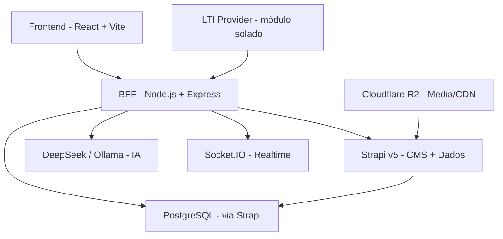

# PDC — Arquitetura de Reconstrução

# PDC — Arquitetura de Reconstrução

<user_quoted_section>Este documento define como o código deve ser reorganizado para servir a visão do produto. Não é uma reescrita do zero — é uma reestruturação com propósito.</user_quoted_section>

## 1. Diagnóstico: O que está errado no código atual

### Problemas Críticos (segurança)

| Problema | Impacto |
| --- | --- |
| Auth via `sessionStorage` em texto claro | Qualquer script pode roubar a sessão |
| Sem JWT real no frontend | Não há token de sessão verificável |
| Sem refresh tokens | Sessão nunca expira automaticamente |
| Rate limiting em memória (Map) | Reinicia com o servidor; não funciona com múltiplas instâncias |
| Denúncias em `localStorage` | Moderadores nunca veem denúncias reais |

### Problemas de Arquitetura

| Problema | Impacto |
| --- | --- |
| `strapiApi.js` com 1887 linhas | Um ficheiro faz tudo — impossível de manter ou testar |
| Redux + Context + SWR + React Query | 4 sistemas de estado em paralelo — inconsistências garantidas |
| Mocks ainda ativos em dev | Dados falsos aparecem sem aviso |
| `process.env.REACT_APP_*` em código Vite | Variáveis quebradas em produção |
| LTI acoplado ao projeto frontend | Impossível escalar independentemente |
| Componentes duplicados em `shared/` | `Button.jsx` existe em 3 locais diferentes |

### Problemas de Custo

| Problema | Impacto |
| --- | --- |
| Strapi a fazer tudo (CMS + auth + lógica) | Caro quando escala; não é ideal para lógica de negócio |
| Socket.IO no mesmo processo que HTTP | Gargalo em produção |
| Sem CDN para media | Uploads vão direto ao Strapi — custo e latência altos |

## 2. Arquitetura Alvo



**Princípios:**

- **Strapi** = CMS de conteúdo e dados académicos. Não gere auth, não tem lógica de negócio complexa
- **BFF (Backend for Frontend)** = centraliza auth JWT, LTI, IA, WebSocket
- **React Query** = único sistema de estado servidor no frontend
- **AuthContext** = único sistema de estado de auth no frontend (sem Redux)
- **httpOnly cookies** para JWT = elimina o problema do sessionStorage

## 3. Estrutura de Pastas Proposta

### Frontend (`src/`)

```
src/
├── app/                    # Configuração global (router, providers, QueryClient)
│   ├── App.jsx
│   ├── router.jsx          # Todas as rotas centralizadas
│   └── providers.jsx       # AuthProvider, QueryClientProvider, RealtimeProvider
│
├── features/               # Domínios de negócio (já existe, manter e limpar)
│   ├── auth/               # Login, registo, recuperação de senha
│   ├── courses/            # Cursos, módulos, tarefas, submissões
│   ├── experiences/        # Experiências institucionais
│   ├── simulations/        # Simulações práticas
│   ├── programs/           # Programas
│   ├── projects/           # Projetos de estudantes
│   ├── profile/            # Perfil + Perfil Vocacional
│   ├── dashboard/          # Dashboards por role
│   ├── messages/           # Mensagens
│   ├── notifications/      # Notificações
│   ├── feed/               # Feed + Conquistas + Posts
│   ├── mentors/            # Mentores e mentorados
│   ├── institutions/       # Instituições
│   ├── admin/              # Painel admin
│   ├── moderation/         # Moderação e denúncias
│   └── analytics/          # Telemetria e relatórios
│
├── shared/                 # Componentes reutilizáveis (design system unificado)
│   ├── ui/                 # Button, Card, Badge, Avatar, Modal, etc. (UM de cada)
│   ├── forms/              # FormInput, FormSelect, FormTextarea
│   ├── layout/             # Sidebar, TopBar, Footer, PageShell
│   └── hooks/              # useDebounce, usePagination, etc.
│
├── lib/                    # Utilitários e serviços
│   ├── api/                # Cliente HTTP (substituir strapiApi.js monolítico)
│   │   ├── client.js       # fetch base com auth headers
│   │   ├── strapi.js       # Wrapper Strapi (CRUD genérico)
│   │   └── bff.js          # Chamadas ao BFF (LTI, IA, etc.)
│   ├── auth/               # AuthContext + hooks de auth
│   └── realtime/           # RealtimeContext + Socket.IO client
│
└── config/                 # Configurações (roles, permissões, platform)
```

### Backend BFF (`server/`)

```
server/
├── index.js                # Entry point
├── middleware/             # CORS, auth, rate-limit, CSP
├── modules/                # Módulos de domínio (já existe, manter)
│   ├── auth/               # JWT, refresh tokens, sessões
│   ├── lti/                # LTI 1.3 (launch, OIDC, AGS, NRPS)
│   ├── ai/                 # DeepSeek, Ollama, tutor, quiz gen
│   ├── realtime/           # Socket.IO
│   └── ...outros módulos
└── services/               # Serviços partilhados (strapi-client, etc.)
```

## 4. Plano de Reconstrução por Fases

### Fase 0 — Fundação (Segurança + Estado)

**Objetivo:** Eliminar os problemas críticos de segurança e unificar o estado

| Tarefa | O que fazer |
| --- | --- |
| Auth seguro | Migrar de sessionStorage para httpOnly cookies com JWT real |
| Eliminar Redux | Remover Redux completamente; usar só AuthContext + React Query |
| Unificar API client | Partir `strapiApi.js` em módulos por domínio (max 200 linhas cada) |
| Eliminar mocks | Remover todos os fallbacks mock; erros reais quando Strapi falha |
| Unificar componentes | Um único `Button`, `Card`, `Modal`, etc. em `shared/ui/` |

### Fase 1 — Core do Produto (Perfil Vocacional + Simulações)

**Objetivo:** O coração do PDC a funcionar com dados reais

| Tarefa | O que fazer |
| --- | --- |
| Perfil Vocacional real | Cálculo automático baseado em telemetria + scores de simulações |
| Simulações funcionais | Tipos 1, 2 e 3 a funcionar com tracking real |
| Telemetria completa | Todos os eventos instrumentados com `event_id` e `correlation_id` |
| Relatório do estudante | Percurso completo com perfil vocacional e recomendações |

### Fase 2 — Ecossistema (Conteúdo + Monetização)

**Objetivo:** Mentores e instituições a publicar e monetizar

| Tarefa | O que fazer |
| --- | --- |
| Experiências completas | Publicação, depoimentos, comunidade, validação científica |
| Cursos completos | Módulos, tarefas, submissões, notas, certificados |
| Programas | Criação e gestão de programas |
| Monetização | Checkout para cursos pagos; comissão PDC |

### Fase 3 — Inteligência (IA + Relatórios)

**Objetivo:** O PDC a ser mais inteligente que qualquer concorrente

| Tarefa | O que fazer |
| --- | --- |
| IA Tutor | Chatbot com contexto do estudante e da plataforma |
| Geração de quizzes | IA gera quizzes a partir de conteúdo de cursos |
| Relatórios institucionais | Dashboard completo para instituições (evasão, tendências, etc.) |
| Personalização adaptativa | Conteúdo adapta-se ao nível e ritmo do estudante |

### Fase 4 — Escala (LTI + B2B)

**Objetivo:** Integração com universidades e modelo B2B funcional

| Tarefa | O que fazer |
| --- | --- |
| LTI Provider robusto | PDC como ferramenta LTI integrável em qualquer LMS |
| Código institucional | Sistema de acesso por código para alunos de escolas parceiras |
| Dashboard B2B | Painel para gestores de escola (não só para admins PDC) |
| Onboarding institucional | Fluxo de integração de nova escola em menos de 1 dia |

## 5. Regras de Desenvolvimento (a seguir daqui em diante)

### Estado

- **React Query** para todo o estado servidor (dados do Strapi/BFF)
- **AuthContext** para estado de autenticação (e só isso)
- **useState/useReducer** para estado local de UI
- **Proibido:** Redux, SWR, Context para dados de servidor

### API

- Cada domínio tem o seu módulo de API (ex: `features/courses/api/coursesApi.js`)
- Nenhum ficheiro de API tem mais de 200 linhas
- Todos os erros são tratados e propagados — sem fallback silencioso para mock

### Componentes

- Um único componente de cada tipo em `shared/ui/`
- Componentes de feature ficam em `features/[domínio]/components/`
- Proibido duplicar componentes

### Segurança

- JWT em httpOnly cookies (nunca em localStorage ou sessionStorage)
- Todas as rotas protegidas verificam token no servidor
- Rate limiting com Redis (não em memória)
- Variáveis de ambiente: só `VITE_*` no frontend

### Nomenclatura

- Português para conceitos de negócio (perfil, conquista, vínculo, etc.)
- Inglês para conceitos técnicos (hook, service, repository, etc.)
- Sem mistura dentro do mesmo ficheiro

## 6. O que Manter do Código Atual

| O que manter | Porquê |
| --- | --- |
| Estrutura `src/features/` | Boa organização por domínio — limpar e completar |
| Strapi content-types | Já bem definidos — não recriar do zero |
| LTI 1.3 (launch, AGS, NRPS) | Funciona — isolar e melhorar |
| Cypress E2E | Boa cobertura — atualizar para dados reais |
| `src/config/roles.js` | Bem estruturado — manter |
| Design Tailwind + GlassCard | Identidade visual do PDC — manter |
| Socket.IO realtime | Funciona — manter e melhorar |

## 7. O que Eliminar

| O que eliminar | Porquê |
| --- | --- |
| Redux (store/, slices/, actions/, reducers/) | Substituído por React Query + AuthContext |
| `strapiApi.js` monolítico | Partir em módulos por domínio |
| `mockApi.js` e todos os fallbacks mock | Dados reais ou erro explícito |
| Componentes duplicados em `shared/` | Unificar num único por tipo |
| Ficheiros de debug na raiz (test-*.js, *.py, *.html) | Mover para `scripts/` ou eliminar |
| `api-bridge.js` e API Bridge (localhost:3333) | Workaround temporário — eliminar |
| `process.env.REACT_APP_*` | Substituir por `VITE_*` ou `platformConfig` |
