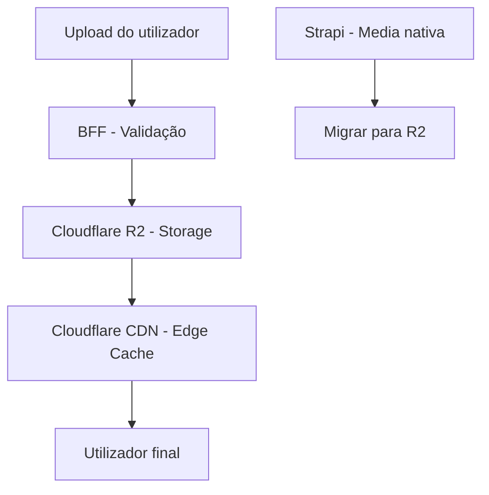

# PDC — SEO, Performance e Distribuição de Conteúdo

# PDC — SEO, Performance e Distribuição de Conteúdo

<user_quoted_section>⚠️ Domínio: O domínio final ainda não está definido. Este documento usa [dominio-pdc] como placeholder em todos os exemplos de URL. Substituir quando o domínio for escolhido.</user_quoted_section>

<user_quoted_section>Este documento define a estratégia de SEO externo, performance de carregamento e distribuição de conteúdo (CDN, media) para o PDC. Contexto: Angola tem conectividade variável — a plataforma deve funcionar bem em redes lentas.</user_quoted_section>

## 1. Contexto: Angola e Conectividade

| Realidade | Impacto no PDC |
| --- | --- |
| Muitos utilizadores em redes 3G/4G lentas | Bundle JS deve ser < 200KB inicial |
| Custo de dados móveis elevado | Imagens otimizadas, lazy loading agressivo |
| Maioria acede pelo telemóvel | Mobile-first obrigatório |
| Latência alta para servidores europeus/americanos | Railway (Europa) + Cloudflare CDN global |
| Alguns utilizadores sem acesso estável | Modo offline básico (PWA) |

## 2. SEO Externo

### 2.1 Meta Tags Obrigatórias

Todas as páginas públicas do PDC devem ter:

```html
<title>Por Dentro do Curso — Decida com Certeza | PDC</title>
<meta name="description" content="Experimenta profissões antes de escolher. Simulações práticas, mentores reais e orientação vocacional baseada em dados.">
<meta name="robots" content="index, follow">
<link rel="canonical" href="https://[dominio-pdc]/cursos/engenharia-civil">

<meta property="og:title" content="Engenharia Civil — Por Dentro do Curso">
<meta property="og:description" content="Experimenta o dia a dia de um engenheiro civil antes de te matriculares.">
<meta property="og:image" content="https://cdn.[dominio-pdc]/og/cursos/engenharia-civil.jpg">
<meta property="og:url" content="https://[dominio-pdc]/cursos/engenharia-civil">
<meta property="og:type" content="website">
<meta property="og:locale" content="pt_AO">

<meta name="twitter:card" content="summary_large_image">
<meta name="twitter:title" content="Engenharia Civil — PDC">
<meta name="twitter:image" content="https://cdn.[dominio-pdc]/og/cursos/engenharia-civil.jpg">
```

### 2.2 JSON-LD (Dados Estruturados)

Para cursos e simulações — melhora a aparência nos resultados do Google:

**Para cursos:**

```json
{
  "@context": "https://schema.org",
  "@type": "Course",
  "name": "Introdução à Engenharia Civil",
  "description": "...",
  "provider": {
    "@type": "Organization",
    "name": "ISP Caála",
    "url": "https://pordentrodocurso.ao/instituicoes/isp-caala"
  },
  "educationalLevel": "Ensino Superior",
  "inLanguage": "pt",
  "offers": {
    "@type": "Offer",
    "price": "0",
    "priceCurrency": "USD",
    "availability": "https://schema.org/InStock"
  }
}
```

**Para perfis de mentores:**

```json
{
  "@context": "https://schema.org",
  "@type": "Person",
  "name": "João Silva",
  "jobTitle": "Engenheiro Civil",
  "description": "...",
  "url": "https://pordentrodocurso.com/perfil/joao-silva"
}
```

### 2.3 URLs Canónicas e Estrutura

| Tipo de página | URL | Notas |
| --- | --- | --- |
| Landing | `[dominio-pdc]/` |  |
| Catálogo de cursos | `[dominio-pdc]/explorar/cursos` |  |
| Detalhe de curso | `[dominio-pdc]/cursos/{slug}` | slug gerado do nome |
| Detalhe de simulação | `[dominio-pdc]/simulacoes/{slug}` |  |
| Detalhe de experiência | `[dominio-pdc]/experiencias/{slug}` |  |
| Perfil público | `[dominio-pdc]/perfil/{username}` |  |
| Instituição | `[dominio-pdc]/instituicoes/{slug}` |  |
| Programa | `[dominio-pdc]/programas/{slug}` |  |

**Regras de URL:**

- Sempre em minúsculas
- Hífens em vez de underscores ou espaços
- Sem parâmetros de query nas URLs canónicas
- Redirect 301 de URLs antigas para novas

### 2.4 Sitemap

Gerado automaticamente pelo BFF e actualizado quando conteúdo é publicado:

```
https://[dominio-pdc]/sitemap.xml
├── /sitemap-static.xml     (landing, sobre, contacto)
├── /sitemap-cursos.xml     (todos os cursos publicados)
├── /sitemap-simulacoes.xml (todas as simulações publicadas)
├── /sitemap-experiencias.xml
├── /sitemap-programas.xml
└── /sitemap-perfis.xml     (apenas perfis públicos)
```

**Prioridades:**

- Landing: 1.0
- Catálogos: 0.9
- Detalhe de conteúdo: 0.8
- Perfis: 0.6

### 2.5 Robots.txt

```
User-agent: *
Allow: /
Disallow: /admin/
Disallow: /moderador/
Disallow: /api/
Disallow: /entrar
Disallow: /registar
Disallow: /onboarding

Sitemap: https://[dominio-pdc]/sitemap.xml
```

## 3. Performance de Carregamento

### 3.1 Targets de Performance (Lighthouse)

| Métrica | Target | Crítico para Angola |
| --- | --- | --- |
| **LCP** (Largest Contentful Paint) | < 2.5s em 4G | ✅ |
| **FID** (First Input Delay) | < 100ms | ✅ |
| **CLS** (Cumulative Layout Shift) | < 0.1 | ✅ |
| **TTI** (Time to Interactive) | < 3.5s em 4G | ✅ |
| **Bundle JS inicial** | < 200KB gzipped | ✅ |
| **Score Lighthouse Performance** | ≥ 85 | ✅ |
| **Score Lighthouse Acessibilidade** | ≥ 90 | ✅ |

### 3.2 Estratégia de Bundle Splitting

Com Vite, dividir o bundle em chunks por rota:

| Chunk | Conteúdo | Tamanho estimado |
| --- | --- | --- |
| `vendor` | React, React Router, React Query | ~80KB |
| `ui` | Radix UI, Motion | ~40KB |
| `landing` | Páginas públicas | ~30KB |
| `auth` | Login, registo, onboarding | ~20KB |
| `estudante` | Dashboard + features do estudante | ~60KB |
| `mentor` | Dashboard + features do mentor | ~40KB |
| `instituicao` | Dashboard + features da instituição | ~40KB |
| `admin` | Painel admin | ~50KB |
| `simulacoes` | Executor de simulações | ~30KB |

**Lazy loading obrigatório** para todos os chunks excepto `vendor`, `ui` e `landing`.

### 3.3 Imagens

| Regra | Detalhe |
| --- | --- |
| Formato | WebP por defeito; JPEG como fallback |
| Thumbnails de cursos | 400×225px (16:9), máx. 50KB |
| Fotos de perfil | 200×200px (1:1), máx. 30KB |
| Imagens de capa | 1200×400px, máx. 150KB |
| OG Images | 1200×630px, geradas automaticamente |
| Lazy loading | `loading="lazy"` em todas as imagens abaixo do fold |
| Placeholder | Blur hash enquanto carrega |

### 3.4 Modo Low-Data (para Angola)

Quando o utilizador tem conectividade limitada (detectado via `navigator.connection`):

- Imagens substituídas por placeholders de cor sólida
- Vídeos não carregam automaticamente — apenas thumbnail + botão play
- Animações desativadas (`prefers-reduced-motion` ou modo manual)
- Conteúdo de texto carregado primeiro
- Notificação discreta: "Modo de dados reduzidos ativo"

## 4. Distribuição de Media (Cloudflare R2 + CDN)

### 4.1 Arquitetura de Storage



**Estrutura de pastas no R2:**

```
pdc-media/
├── perfis/
│   ├── fotos/{perfilId}/{uuid}.webp
│   └── capas/{perfilId}/{uuid}.webp
├── cursos/
│   ├── thumbnails/{cursoId}/{uuid}.webp
│   └── documentos/{cursoId}/{uuid}.pdf
├── simulacoes/
│   └── videos/{simulacaoId}/{uuid}.mp4
├── conquistas/
│   └── media/{conquistaId}/{uuid}.webp
├── og/
│   └── {tipo}/{slug}.jpg
└── uploads/
    └── tarefas/{tarefaId}/{uuid}.*
```

### 4.2 URLs de Media

- **URL pública:** `https://cdn.[dominio-pdc]/{path}` (via Cloudflare CDN)
- **URL de R2:** `https://{account}.r2.cloudflarestorage.com/pdc-media/{path}` (privada)
- **Cache:** `Cache-Control: public, max-age=31536000, immutable` para assets com UUID no nome

### 4.3 Transformações de Imagem

Via Cloudflare Image Resizing (incluído no plano):

```
https://cdn.[dominio-pdc]/perfis/fotos/123/abc.webp?width=200&height=200&fit=cover
https://cdn.[dominio-pdc]/cursos/thumbnails/456/def.webp?width=400&height=225&fit=cover
```

## 5. PWA (Progressive Web App) — Básico

Para suportar utilizadores com conectividade instável:

| Feature | Implementação |
| --- | --- |
| **Manifest** | `manifest.json` com ícones, nome, cores |
| **Service Worker** | Cache de assets estáticos (JS, CSS, fontes) |
| **Offline fallback** | Página de "sem conexão" com conteúdo em cache |
| **Install prompt** | "Adicionar ao ecrã inicial" no mobile |
| **Cache de conteúdo** | Últimas 5 páginas visitadas em cache |

**O que NÃO é cacheado offline:**

- Dados dinâmicos (feed, notificações, mensagens)
- Conteúdo de cursos (demasiado grande)
- Dados de telemetria (enviados quando online)

## 6. Monitorização de Performance

| Ferramenta | Uso |
| --- | --- |
| **Sentry** | Erros de JavaScript + performance traces |
| **Cloudflare Analytics** | Tráfego, latência, cache hit rate |
| **Lighthouse CI** | Score de performance em cada PR (GitHub Actions) |
| **Web Vitals** | LCP, FID, CLS reportados via telemetria |

**Alertas automáticos:**

- LCP > 4s em produção → alerta no Slack/email
- Error rate > 1% → alerta imediato
- Cache hit rate < 80% → revisão de estratégia de cache
