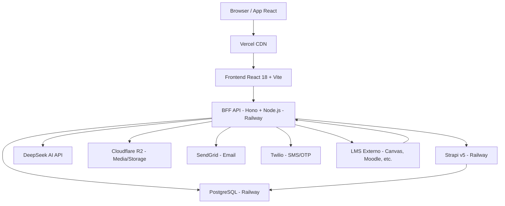
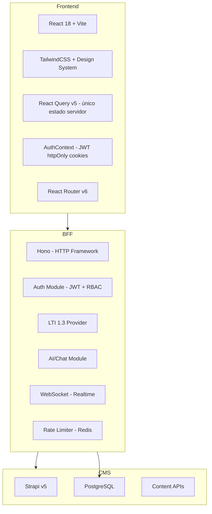

# Plano Mestre de Reconstrução — Por Dentro do Curso (PDC v2)

## Visão Geral

**Por Dentro do Curso (PDC)** é uma plataforma educacional angolana cujo objetivo central é combater a evasão escolar no ensino básico, médio e superior, através de orientação vocacional, experiências imersivas, simulações e integração com instituições de ensino.

Esta spec define a arquitetura, stack, princípios e fases da reconstrução completa do projeto a partir do zero, preservando apenas o que tem valor real do repositório atual.

## Diagnóstico do Projeto Atual (o que está errado)

| Categoria | Problema | Risco |
| --- | --- | --- |
| **Segurança** | Auth via `sessionStorage` (texto claro, sem JWT real) | 🔴 Crítico |
| **Segurança** | Sem refresh tokens, sem revogação de sessão | 🔴 Crítico |
| **Segurança** | Rate limiting em memória (Map) — não funciona com múltiplas instâncias | 🔴 Crítico |
| **Dados** | Denúncias guardadas em `localStorage` — moderadores nunca as veem | 🔴 Crítico |
| **Dados** | Mocks ainda ativos em desenvolvimento — dados falsos sem aviso | 🟠 Alto |
| **Manutenção** | `strapiApi.js` com 1887 linhas — um ficheiro faz tudo | 🟠 Alto |
| **Estado** | Redux + Context + SWR + React Query em paralelo — inconsistências garantidas | 🟠 Alto |
| **Custo** | Strapi a gerir lógica de negócio + CMS + DB — caro quando escala | 🟡 Médio |
| **Estrutura** | Componentes duplicados (Button, Card, etc. em 2-3 locais) | 🟡 Médio |
| **Env vars** | `process.env.REACT_APP_*` em código Vite — quebra em produção | 🟡 Médio |
| **Raiz** | Dezenas de ficheiros de debug/teste/docs na raiz do projeto | 🟢 Baixo |

## Arquitetura Proposta (PDC v2)

### Princípios Fundamentais

1. **Uma única fonte de verdade por responsabilidade** — auth num lugar, dados noutro, UI noutro
2. **Segurança por defeito** — httpOnly cookies, JWT com expiração, RBAC no servidor
3. **Sem mocks em produção** — dados reais ou erro explícito, nunca dados falsos silenciosos
4. **Custo controlado** — Strapi apenas como CMS de conteúdo, lógica de negócio no BFF
5. **LTI como serviço próprio** — integração em qualquer plataforma universitária

### Diagrama de Arquitetura



### Camadas da Aplicação



## Stack Tecnológico Escolhido

### Frontend

| Tecnologia | Versão | Motivo |
| --- | --- | --- |
| React | 18 | Manter — estável, equipa conhece |
| Vite | 5+ | Manter — build rápido |
| TailwindCSS | 3+ | Manter — produtivo |
| React Query (TanStack) | v5 | **Único** sistema de estado servidor — elimina Redux e SWR |
| React Router | v6 | Manter |
| Zod | v3+ | Validação de schemas no cliente e servidor |
| Framer Motion | Manter para animações |  |

**Eliminar:** Redux, redux-thunk, SWR, react-redux, mockApi

### Backend (BFF)

| Tecnologia | Versão | Motivo |
| --- | --- | --- |
| **Hono** | v4+ | Ultra-leve, edge-ready, TypeScript nativo, 10x mais rápido que Express, Railway-friendly |
| Node.js | 22 LTS | Estável, suporte longo |
| **Redis** | via Upstash | Rate limiting, sessões, cache — sem estado em memória |
| **Jose** (JWT) | v5+ | JWT seguro, sem dependências pesadas |
| Zod | v3+ | Validação de input em todas as rotas |
| Socket.IO | v4 | Manter para realtime (notificações, mensagens) |

**Porquê Hono em vez de Express/Fastify:**

- 3x menos overhead que Express
- TypeScript nativo (sem `@types/`)
- Middleware compatível com Edge (Vercel Edge, Cloudflare Workers)
- API limpa e moderna
- Excelente para Railway

### CMS / Base de Dados

| Tecnologia | Uso |
| --- | --- |
| Strapi v5 | **Apenas CMS de conteúdo** — cursos, experiências, simulações, perfis públicos |
| PostgreSQL | Base de dados principal (via Railway) |
| Cloudflare R2 | Storage de media (imagens, vídeos, documentos) — mais barato que S3 |

### Autenticação

| Mecanismo | Uso |
| --- | --- |
| Email + Password | Login principal com bcrypt |
| JWT em httpOnly cookies | Sessão segura — JavaScript não consegue aceder |
| Refresh tokens | Rotação automática, revogação por utilizador |
| Google OAuth 2.0 | Login social |
| OTP por Email (SendGrid) | 2FA — código de 6 dígitos com expiração |
| OTP por SMS (Twilio) | 2FA alternativo para mercado angolano |
| LTI 1.3 OIDC | Login via plataforma universitária |

### Infraestrutura

| Serviço | Uso | Custo estimado |
| --- | --- | --- |
| Vercel | Frontend (CDN global) | Gratuito até escala |
| Railway | BFF + Strapi + PostgreSQL | ~$20-40/mês inicial |
| Cloudflare R2 | Media storage | $0.015/GB/mês |
| Upstash Redis | Rate limiting + cache | Gratuito até 10k req/dia |
| SendGrid | Email transacional | Gratuito até 100/dia |
| Twilio | SMS/OTP | Pay-per-use |

<user_quoted_section>⚠️ Domínio: O domínio de produção ainda não está definido. Todas as referências a URLs de produção nas specs usam [dominio-pdc] como placeholder.</user_quoted_section>

## O que Preservar do Repositório Atual

### ✅ Copiar e adaptar

| Ficheiro/Pasta | O que preservar |
| --- | --- |
| `src/config/roles.js` | Definição de roles e menus — bem estruturado |
| `src/config/permission-registry.js` | Matriz de permissões RBAC |
| `infra/strapi/backend/src/api/*/schema.json` | Todos os schemas Strapi — bem definidos |
| `src/features/*/components/` | Componentes de UI das features — reutilizáveis |
| `src/features/*/hooks/` | Hooks de domínio — lógica válida |
| `cypress/e2e/` | Testes E2E — adaptar para novo stack |
| `src/copy/siteCopy.js` | Copy da plataforma |
| `src/data/` | Dados de referência (programas, opções de perfil) |
| `docs/` | Documentação de produto e decisões |

### ❌ Não copiar (reescrever do zero)

| Ficheiro/Pasta | Motivo |
| --- | --- |
| `src/services/strapiApi.js` | 1887 linhas, faz tudo — dividir em módulos |
| `src/store/` | Redux inteiro — substituir por React Query |
| `src/contexts/AuthContext.jsx` | Auth inseguro — reescrever com JWT httpOnly |
| `src/server/` | Express monolítico — reescrever em Hono modular |
| `src/services/mockApi.js` | Eliminar completamente |
| Ficheiros na raiz (`*.md`, `*.py`, `*.html` de debug) | Limpar |

## Estrutura do Novo Repositório

```
pdc-v2/
├── apps/
│   ├── web/                    # Frontend React
│   │   ├── src/
│   │   │   ├── features/       # Feature-first (manter estrutura atual)
│   │   │   ├── components/     # Design system unificado
│   │   │   ├── lib/            # Clientes API, utils
│   │   │   │   ├── api/        # Módulos de API por domínio (substituir strapiApi.js)
│   │   │   │   └── auth/       # Cliente de auth
│   │   │   ├── hooks/          # Hooks globais
│   │   │   ├── pages/          # Páginas (React Router)
│   │   │   └── config/         # Roles, permissões, platform config
│   │   └── package.json
│   └── api/                    # BFF Hono
│       ├── src/
│       │   ├── routes/         # Rotas por domínio
│       │   ├── modules/
│       │   │   ├── auth/       # JWT, refresh, OAuth, OTP
│       │   │   ├── lti/        # LTI 1.3 Provider
│       │   │   ├── ai/         # DeepSeek, AI tutor
│       │   │   └── realtime/   # WebSocket
│       │   ├── middleware/     # Auth, rate limit, RBAC, logging
│       │   └── lib/            # Strapi client, Redis, email, SMS
│       └── package.json
├── infra/
│   ├── strapi/                 # CMS (manter estrutura atual)
│   └── docker-compose.yml
├── docs/                       # Documentação consolidada
└── package.json                # Monorepo (npm workspaces)
```

## Fases de Reconstrução

### Fase 0 — Fundação (Novo Repositório)

**Objetivo:** Estrutura limpa, tooling configurado, CI/CD básico

- Criar monorepo com npm workspaces (`apps/web`, `apps/api`)
- Configurar TypeScript estrito em ambos
- Configurar ESLint + Prettier + Husky (pre-commit)
- GitHub Actions: build + lint em cada PR
- Configurar Railway (BFF + Strapi + PostgreSQL) e Vercel (frontend)
- Migrar schemas Strapi (copiar `infra/strapi/backend/src/api/`)

### Fase 1 — Autenticação Segura

**Objetivo:** Auth robusto com JWT httpOnly, 2FA, Google OAuth

- BFF: módulo auth completo (register, login, logout, refresh)
- JWT em httpOnly cookies com expiração (15min access, 7d refresh)
- Google OAuth 2.0
- OTP por email (SendGrid) + SMS (Twilio) para 2FA
- Frontend: AuthContext reescrito, sem sessionStorage
- Rate limiting via Redis (Upstash) em endpoints de auth
- Testes E2E de auth

### Fase 2 — Design System e Frontend Base

**Objetivo:** Componentes unificados, sem duplicação, React Query como único estado

- Design system limpo: Button, Input, Card, Modal, Badge, Avatar, Spinner, Toast, Tabs, Table, Pagination
- Eliminar Redux completamente
- React Query como único estado servidor
- Layout por role (Estudante, Mentor, Instituição, Moderador, Admin)
- Migrar páginas críticas: Landing, Login, Dashboard por role

### Fase 3 — API Layer Modular

**Objetivo:** Substituir `strapiApi.js` por módulos de API organizados

- `lib/api/perfis.ts` — CRUD de perfis
- `lib/api/cursos.ts` — catálogo, detalhe, inscrições
- `lib/api/experiencias.ts` — catálogo, detalhe
- `lib/api/simulacoes.ts` — catálogo, tentativas
- `lib/api/notificacoes.ts` — CRUD, realtime
- `lib/api/mensagens.ts` — CRUD, realtime
- `lib/api/media.ts` — upload para R2
- Sem mocks — erro explícito quando API falha

### Fase 4 — Funcionalidades Core

**Objetivo:** Fluxos principais funcionais com dados 100% reais

- Perfil: criação, edição, upload de documentos (R2)
- Cursos: catálogo, detalhe, inscrição, progresso, módulos
- Experiências: catálogo, detalhe, fluxo editorial
- Simulações: catálogo, executor, tentativas, feedback
- Conquistas: feed, publicação, moderação
- Vínculos: pedido, aprovação, gestão

### Fase 5 — LTI 1.3 Provider

**Objetivo:** PDC como ferramenta LTI integrável em qualquer universidade

- BFF: módulo LTI 1.3 completo (OIDC, AGS, NRPS)
- JWKS endpoint público
- Grade passback para LMS externo
- Roster sync (NRPS)
- Configuração de plataformas LTI via admin
- Testes com Canvas e Moodle

### Fase 6 — Moderação, Admin e Segurança

**Objetivo:** Fluxos de moderação reais, painel admin robusto

- Denúncias via API (não localStorage)
- Fila de moderação com estados reais
- Painel admin: utilizadores, permissões, estatísticas, telemetria
- Audit trail completo
- CSP, CORS, OWASP básico
- Monitorização: Sentry + health checks

### Fase 7 — AI e Realtime

**Objetivo:** Assistente AI funcional, notificações e mensagens em tempo real

- AI tutor com DeepSeek (streaming)
- Perfil vocacional com IA
- WebSocket para notificações em tempo real
- Mensagens em tempo real (substituir localStorage/BroadcastChannel)
- Fallback local (Ollama) quando DeepSeek indisponível

## Regras de Desenvolvimento (Definition of Done)

1. **Sem mocks** — qualquer dado falso é um bug
2. **Sem ****`any`**** em TypeScript** — tipagem estrita obrigatória
3. **Sem ****`console.log`**** em produção** — usar logger estruturado
4. **Sem segredos no frontend** — apenas `VITE_*` públicos
5. **Sem lógica de negócio no frontend** — validação no servidor
6. **Cada feature tem testes** — mínimo 1 teste E2E por fluxo crítico
7. **Build sem warnings** — CI falha se houver warnings de build
8. **Acessibilidade básica** — labels, alt text, foco de teclado

## Referências do Repositório Atual

- Schemas Strapi: file:infra/strapi/backend/src/api/
- Roles e permissões: file:src/config/roles.js, file:src/config/permission-registry.js
- Componentes de features: file:src/features/
- Testes E2E: file:cypress/e2e/
- Documentação de produto: file:docs/CHECKLIST_PLATAFORMA_COMPLETA_POR_DENTRO_DO_CURSO.md
