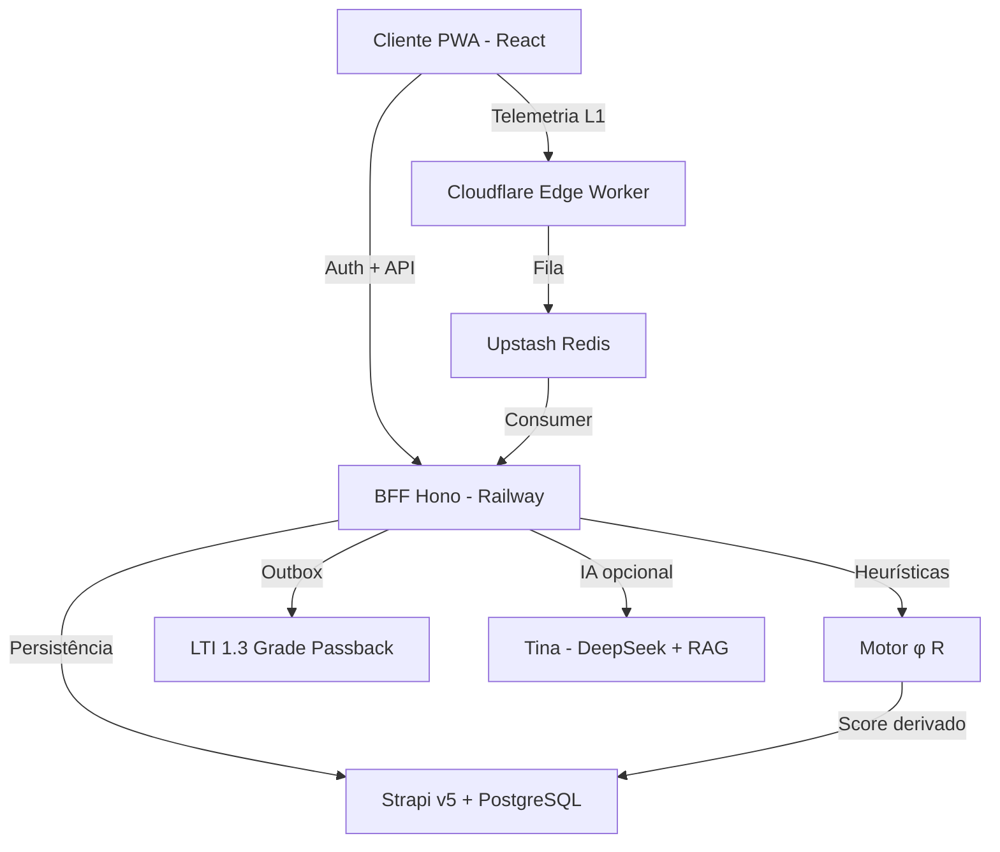
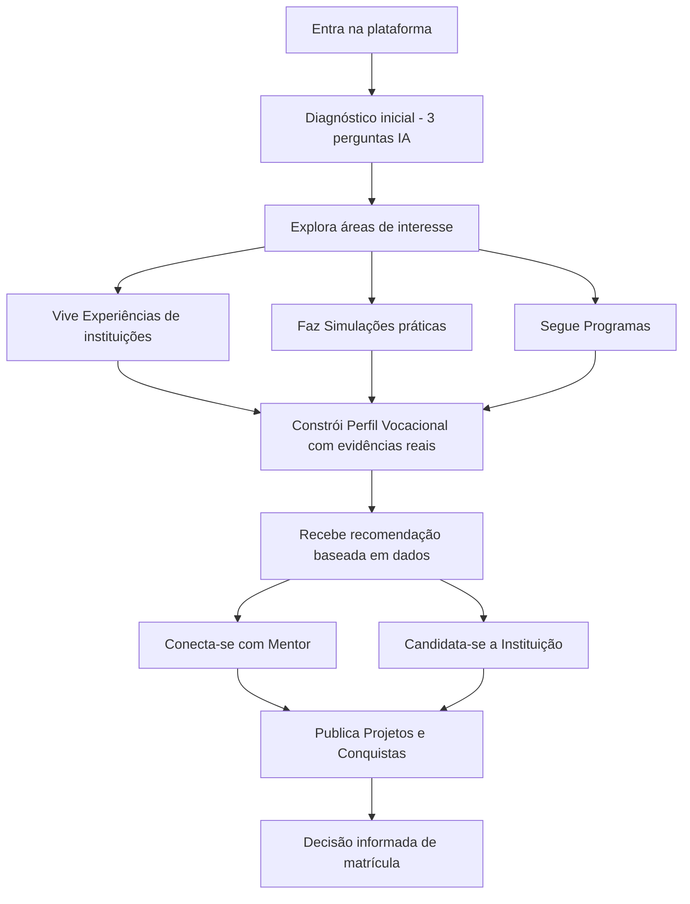
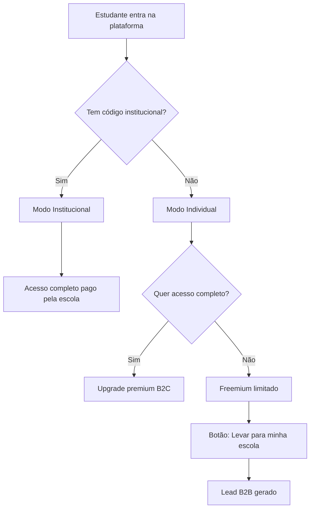

# Por Dentro do Curso (PDC v2) — Visão do Produto (Canónica)

> **Frase de autoridade:** O PDC não é uma plataforma de ensino. É uma infraestrutura de decisão educacional — transforma a incerteza vocacional em escolhas de carreira precisas, antes que as decisões erradas custem dinheiro.

**Status:** Canónico · **Alinhado com:** `specs/IMPORTANTE/01 — Visão do Produto`

---

## 1. O Problema que o PDC Resolve

Em Angola e em mercados emergentes, a escolha de curso universitário é uma **aposta**, não uma decisão informada:

- Altos níveis de **evasão universitária**.
- Famílias perdem dinheiro em cursos abandonados.
- Instituições perdem receita e reputação.
- O país perde talentos que poderiam impulsionar o desenvolvimento.

> O PDC resolve isto dando ao estudante a experiência real do curso antes de se comprometer com a matrícula.

### Contexto de Mercado (Angola e Mercados Emergentes)

- **Conectividade variável** — muitos estudantes acedem via mobile com dados móveis limitados. PWA-first + offline-first é obrigatório.
- **Ecossistema educativo fragmentado** — instituições não cooperam; mentores independentes não têm plataforma de visibilidade.
- **Custo real da evasão** — para uma família angolana, um ano de propinas perdido pode representar anos de poupança.
- **Ausência de orientação vocacional estruturada** — não existem ferramentas de decisão baseadas em evidência comportamental real.
- **Oportunidade B2B** — o argumento "se reter 2-5 alunos que desistiriam, o investimento já se paga" é directamente mensurável.

---

## 2. O que o PDC É (e o que NÃO é)

| O PDC É | O PDC NÃO é |
| --- | --- |
| Uma infraestrutura de decisão vocacional | Um repositório passivo de conteúdo |
| Um sistema que mede **comportamento real** | Um teste de personalidade genérico |
| Uma plataforma de marketing institucional | Uma cópia do Canvas/Moodle |
| Um ecossistema onde todos ganham | Uma ferramenta só para estudantes |
| **Independente de IA** (continua a funcionar se a IA falhar) | Dependente de qualquer LLM |

---

## 3. Core Value (A Promessa Mensurável)

**O estudante toma uma decisão de carreira baseada em evidência real do seu próprio comportamento — não em suposições.**

O sistema usa o **Motor de Heurísticas** (`packages/shared/src/heuristics.ts`) para calcular, a partir da telemetria bruta:

| Métrica | Símbolo | O que mede |
| --- | --- | --- |
| Fluidez Cognitiva | $\phi$ | Constância e ritmo de decisão |
| Resiliência ao Erro | $R$ | Recuperação após falha |
| Estabilidade de Foco | — | Micro-interrupções de atenção |
| Hesitação | — | Tempo + entropia de movimento antes de uma decisão |

> **Princípio anti-fraude (D20–D22):** A pontuação é derivada no servidor a partir da telemetria comportamental — nunca declarada pelo cliente. O browser é tratado como ambiente hostil.

Se tudo o resto falhar, o fluxo `Simulação → Score → Perfil Vocacional → Recomendação` tem de funcionar.

---

## 4. Stack Canónica (Soberana)

| Camada | Tecnologia | Papel |
| --- | --- | --- |
| **Frontend** | React 18 · Vite 6 · TailwindCSS v4 · Motion · GSAP | UI Imersiva (PWA-First) |
| **BFF** | Hono v4 · Node.js 24 LTS · Jose v5 | Orquestração + RPC type-safe |
| **Edge** | Cloudflare Workers (`apps/edge`) | Telemetria L1 + sanity check |
| **CMS** | Strapi v5 · PostgreSQL 16 | Persistência e gestão de conteúdo |
| **Cache/Rate-limit** | Upstash Redis | Filas + idempotência + locks + feature flags |
| **Storage** | Cloudflare R2 | Ativos, projetos, audit cold storage |
| **IA (opcional)** | DeepSeek + RAG (LangChain.js) | Tina — Oráculo Interpretativo |
| **Forms** | react-hook-form + Zod | Validação client+server |
| **UI Components** | Radix UI primitives | Acessibilidade nativa |
| **Monitoring** | Sentry (browser + node + profiling) | Erros + performance |
| **Auth** | JWT httpOnly + OAuth (Google, LinkedIn) | Identidade Total |
| **Email** | Resend + SendGrid | Dual provider |
| **SMS** | Twilio (opcional) | OTP |
| **LTI** | LTI 1.3 Grade Passback | Integração LMS |

**Decisões soberanas (rejeitadas alternativas populares):**

- ❌ Clerk → ✅ Auth próprio com JWT em **httpOnly cookies** (ADR-003)
- ❌ NestJS → ✅ Hono (zero-overhead, RPC type-safe end-to-end) (ADR-002)
- ❌ Turborepo → ✅ npm workspaces simples (ADR-001)

---

## 5. Arquitetura em 4 Camadas (L1–L4)



| Camada | Onde | Responsabilidade |
| --- | --- | --- |
| **L1 — Factos** | Cloudflare Edge | 90% do tráfego (telemetria, catálogos públicos, landing pulse) |
| **L2 — Cérebro Matemático** | `@pdc/shared` + BFF | Cálculo determinístico de $\phi$ e $R$ — **independente de IA** |
| **L3 — Verniz Inteligente** | BFF Hono | Tina (assistente + interpretação lateral) — fallback para heurísticas se falhar |
| **L4 — Core de Negócio** | BFF Hono + Strapi | Auth soberano, RBAC 7 roles, realtime Socket.IO |

---

## 6. Os Atores (Resumo)

| Ator | Papel resumido |
| --- | --- |
| **Estudante** | Utilizador principal — explora, simula, constrói perfil vocacional |
| **Mentor / Professor** | Publica cursos/simulações e programas, orienta, monetiza |
| **Instituição** | Marketing + recrutamento + redução de evasão |
| **Comité Científico** | Valida rigor académico de simulações e experiências |
| **Moderador** | Mantém ambiente seguro e produtivo |
| **Super Admin** | "DEUS" — gere toda a plataforma sem código |
| **Patrocinador** *(futuro)* | Financia talentos, trilhas e programas |

> Detalhe completo de capacidades e permissões: ver `specs/IMPORTANTE/03 — Tipos de Perfis`.

---

## 6.bis Para Quem Já Decidiu — Estudantes do Ensino Superior

O PDC deixa de ser **mapa de "para onde ir"** e passa a ser **GPS de performance** para garantir que o estudante chegue ao topo da montanha que escolheu.

| Necessidade do universitário | O que o PDC faz |
| --- | --- |
| **Validação de Rota e Redução de Danos** | Simulações Tipo 2/3 distinguem *"falta de base"* de *"falta de aptidão"*. Diagnóstico de sobrevivência académica. |
| **CV do Futuro (Empregabilidade Real)** | Perfil Vocacional anexa-se ao diploma com evidências objetivas que o diploma não dá. |
| **Especialização e Pivot Estratégico** | Bússola de especialização — mostra onde inclinar a carreira sem abandonar o curso. |
| **Hub de Mentoria e Oportunidades** | Liga a Mentores de Elite via Vínculos. |
| **Seguro Anti-Evasão (para a Instituição)** | Telemetria identifica alunos em risco de desistência antes do abandono acontecer. |

---

## 7. Tipos de Conteúdo (Resumo)

| Tipo | Quem publica | Monetizável | Função primária |
| --- | --- | --- | --- |
| **Experiência** | Instituição, Mentor | ❌ Sempre gratuita | Marketing institucional + imersão |
| **Simulação** | Mentor, Instituição | ✅ Opcional | Avaliação comportamental real |
| **Curso** | Mentor, Instituição | ✅ Opcional | Aprendizagem estruturada com certificado |
| **Programa** | Instituição, Mentor | ✅ Opcional | Iniciativa ampla (contém Cursos + Experiências) |
| **Projeto** | Estudante, Mentor, Instituição | ❌ Sempre gratuito | Visibilidade + feedback + ponte para patrocinador |
| **Post / Conquista** | Todos os autenticados | ❌ | Feed social + reputação |

> Detalhe completo (regras de visibilidade, criação, inscrição, avaliação): ver `specs/IMPORTANTE/04 — Tipos de Conteúdo`.

---

## 8. Jornada do Estudante (a Espinha Dorsal)



---

## 9. Modelo de Negócio

### 9.1 Motor Principal — B2B Institucional

Escolas e universidades pagam para oferecer o PDC aos seus alunos.

- **Modelo:** pacote por aluno/ano (ex.: $5–$15/aluno/ano).
- **Argumento de venda:** *"Se o PDC retiver apenas 2–5 alunos que desistiriam, o investimento já se paga."*

### 9.2 Complementares

1. **B2C Freemium** — estudantes individuais com acesso limitado; upgrade pago.
2. **Marketplace** — comissão sobre mentorias e cursos pagos.
3. **Patrocínio** — empresas financiam talentos e trilhas.

### 9.3 Dois Modos de Entrada



---

## 10. Identidade Visual — "Soul & Elite" (ADR-006 / ADR-017)

> **Princípio:** Herança Invisível. Sofisticação global com raízes culturais subliminares.

| Elemento | Decisão |
| --- | --- |
| **Tema base** | Claro `#F8F9FA` — Escuro como opção (sem pretos puros para evitar smear OLED) |
| **Acento** | Terracota Africana `#D2691E` — limite ≤ 5% da UI |
| **Institucional** | Azul `#004AAD` |
| **Tipografia** | Inter (UI) · Instrument Serif (autoridade) · JetBrains Mono (dados) |
| **Layouts** | Bento Grids (dashboards) · Glassmorphism (IA) · HUD (simulações) |
| **Padrões africanos** | Subliminares — assimetria de bordas inspirada em Kente/Adinkra (≤ 3% da UI) |
| **Toque mobile** | Mínimo 44px (PWA-First) |
| **Física Apple** | Animações via Motion com springs (`stiffness: 220, damping: 28`) |
| **Linguagem** | "8th-grade rule" — se um aluno do 8.º ano não entender, o design falhou |

> Spec completo: `specs/IMPORTANTE/05 — Design System Soul & Elite`

---

## 11. Constituição Inegociável (5 Regras de Ouro)

1. **SSOT** — Contratos, schemas e tipos nascem em `@pdc/shared`. Aplicações não definem formas privadas que cruzam fronteiras de rede.
2. **Zero `any`** — Tipagem estrita. `any` em código novo é um bug de governação.
3. **Rule of 300** — Nenhum ficheiro fonte > 300 linhas. (Exceção histórica: `packages/shared/src/index.ts`.)
4. **Doc is Law** — Se o código contradiz o markdown, o código é defeituoso. O documento justifica o código, nunca o inverso.
5. **Telemetria Resiliente Edge-First** — A perda de dados comportamentais é inaceitável. Outbox + idempotência são obrigatórios.

---

## 12. Visão de Longo Prazo

O PDC será o lugar de referência para preparar e decidir percursos académicos em todas as fases:

- **Pais de crianças pequenas** — escolha de escolas do ensino básico
- **Estudantes do ensino médio** — escolha de curso superior
- **Estudantes universitários** — mudança de curso ou área
- **Profissionais** — requalificação
- **Instituições** — atrair os alunos certos e reduzir evasão
- **Patrocinadores** — identificar e apoiar talentos validados

### O Moat (Barreira Competitiva)

> Quanto mais o PDC é usado, mais preciso e valioso ele se torna. Os dados comportamentais acumulados são um ativo único e crescente que nenhum concorrente pode replicar rapidamente.

---

## 13. O Efeito de Rede (O Moat Operacional)

A infraestrutura de decisão torna-se imbatível quando o flywheel opera:

```
Mais Conteúdo (Mentores) → Mais Dados (Telemetria)
→ Melhores Recomendações (Motor φ/R + IA)
→ Mais Estudantes
→ Mais Instituições que não querem perder candidatos
→ Mais Conteúdo...
```

### 3 Efeitos de Rede Simultâneos

1. **Rede de Dados** — Quanto mais simulações forem feitas numa área, mais preciso é o "padrão de sucesso". Se 10.000 estudantes fizerem simulação de Engenharia, a IA diz ao 10.001º: "O teu padrão é 90% idêntico ao dos que desistem no 1.º ano".
2. **Rede de Mercado (Duplo lado)** — Estudantes atraem Instituições (marketing + captação). Instituições atraem Mentores (visibilidade + monetização). Mentores produzem Conteúdo.
3. **Rede Social (Prova Social)** — Conquistas partilháveis → novos estudantes entram para competir → Instituições publicam mais Simulações para captar esses talentos.

---

## 14. Repositórios de Referência

| Repositório | Propósito |
| --- | --- |
| `1-PDC` (privado) | Versão v1 — schemas Strapi, lógica LTI, RBAC original. Referência para extracção de lógica validada |
| `the-algorithm` (Twitter/X) | Inspiração para feed ranking e sistema de pesos |
| `langchainjs` | RAG para Tina ("Ask the Lesson") |
| `canvas-lms` / `moodle` | Referência LTI 1.3 Grade Passback |

---

## 15. Out of Scope (MVP)

- Gateway de pagamento em produção (fase comercial posterior).
- Turborepo / Nx (over-engineering para o estágio atual — ADR-001).
- Upload de vídeos > 50MB (usar embed YouTube/Vimeo).
- Antifraude biométrico avançado (MVP usa sanity rules + server-side score).
- Redux / SWR / Zustand (React Query é suficiente — TanStack Query 5).
- Watermarks em conteúdo (DRM é pós-MVP).
- Three.js / 3D obrigatório (pode ser usado pontualmente no Relatório Vocacional sem entrar na Constitution).
- Neon como substituto do PostgreSQL (Strapi v5 + PostgreSQL via Railway é a realidade actual).

---

## 16. Referências Detalhadas

Para detalhes que este documento resume, consultar:

| Tema | Fonte detalhada |
|------|----------------|
| Tokens de design, anti-padrões, componentes | `docs/arquivo-fundacional/09-traycer-specs/design-system-completo.md` |
| Mapa de 80+ rotas por role, menus laterais | `docs/arquivo-fundacional/09-traycer-specs/mapa-paginas-features-transversais.md` |
| 10 features transversais (modelos + endpoints) | Idem, Part B |
| Algoritmo de ranking/feed (4 fases, 4 feeds) | `docs/arquivo-fundacional/09-traycer-specs/algoritmos-dados-seguranca.md` |
| Pipeline telemetria + perfil vocacional 6D | Idem §2 |
| Segurança 7 camadas + rate limits detalhados | Idem §3 |
| Modelo de dados Strapi (ERD + migrações) | Idem §4 |
| Diagnóstico pré-v2 detalhado | `docs/arquivo-fundacional/09-traycer-specs/produto-visao-arquitectura.md` |
| Hotspots de risco (12 identificados) | `docs/arquivo-fundacional/06-engenharia/entitlements-core-trio-analysis.md` |

---

*Última validação: 30 de Abril de 2026 · Fonte de verdade: `specs/IMPORTANTE/01 — Visão do Produto (Canónica)`.* 
