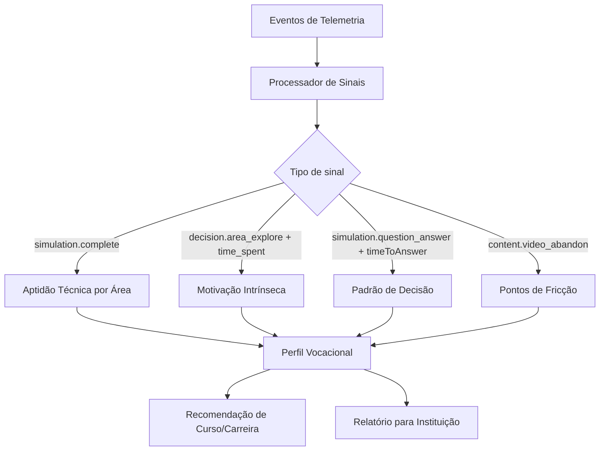

# PDC — Features Transversais: Interações, Avaliações, Telemetria e Moderação

# PDC — Features Transversais

<user_quoted_section>Estas features aparecem em quase todos os domínios (Cursos, Experiências, Simulações, Projetos, Posts, Conquistas, Perfis). São o tecido conjuntivo da plataforma — alimentam o feed, o algoritmo de ranking, o perfil vocacional e os relatórios institucionais.</user_quoted_section>

## 1. Princípios Fundamentais

Antes de definir cada feature, há 3 princípios que governam todas elas:

| Princípio | Significado prático |
| --- | --- |
| **Tudo é sinal** | Cada interação (curtir, guardar, tempo de leitura, scroll) alimenta a telemetria e o perfil vocacional |
| **Separação de contexto** | Uma avaliação de um Curso é diferente de uma avaliação de um Mentor — o modelo de dados reflete isso |
| **Moderação por defeito** | Conteúdo gerado por utilizadores (comentários, denúncias, conquistas) passa por moderação antes de ser público |

## 2. Entidades Alvo (Targets)

Todas as features transversais operam sobre **entidades alvo**. O sistema usa um modelo polimórfico:

```
targetType: 'curso' | 'experiencia' | 'simulacao' | 'programa' | 'projeto' | 'post' | 'conquista' | 'mentor' | 'instituicao'
targetId: number
```

<user_quoted_section>Nota de implementação: O modelo atual tem interacoes como coleção genérica no Strapi sem semântica clara. Na reconstrução, cada tipo de interação tem a sua própria tabela/coleção com campos específicos.</user_quoted_section>

## 3. Feature: Curtir (Like / Reação)

### 3.1 O que é

Um sinal de aprovação rápido, sem texto. Funciona como o "Like" do LinkedIn — não é uma avaliação, é um sinal de relevância.

### 3.2 Quem pode curtir

| Role | Pode curtir |
| --- | --- |
| Visitante (não autenticado) | ❌ — vê o contador mas não pode curtir |
| Estudante | ✅ |
| Mentor | ✅ |
| Instituição | ✅ |
| Moderador | ✅ |
| Super Admin | ✅ |

### 3.3 O que pode ser curtido

| Entidade | Curtir disponível |
| --- | --- |
| Post | ✅ |
| Conquista | ✅ |
| Projeto | ✅ |
| Comentário | ✅ |
| Curso | ✅ |
| Experiência | ✅ |
| Simulação | ✅ |
| Programa | ✅ |
| Perfil de Mentor | ❌ — usa Vínculo |
| Perfil de Instituição | ❌ — usa Vínculo |

### 3.4 Regras de negócio

1. **Toggle:** Curtir duas vezes remove o like (toggle). Não existe "descurtir" como ação separada.
2. **Um por utilizador por entidade:** Um utilizador não pode curtir a mesma entidade mais de uma vez.
3. **Contador público:** O número de likes é visível para todos (incluindo visitantes).
4. **Sem notificação por defeito:** O autor não recebe notificação de cada like individual — apenas resumos periódicos (ex: "5 pessoas curtiram o teu projeto esta semana").
5. **Sinal de telemetria:** Cada like gera um evento `interaction.like` com `targetType`, `targetId`, `actorId`, `timestamp`.

### 3.5 Modelo de dados

```
Like {
  id
  actorId        // perfilId de quem curtiu
  targetType     // tipo da entidade
  targetId       // id da entidade
  createdAt
}
```

**Índice único:** `(actorId, targetType, targetId)` — garante unicidade.

### 3.6 Endpoints

| Método | Rota | Descrição |
| --- | --- | --- |
| POST | `/api/interactions/like` | Toggle like (cria ou remove) |
| GET | `/api/interactions/like/count?targetType=X&targetId=Y` | Contador público |
| GET | `/api/interactions/like/status?targetType=X&targetId=Y` | Se o utilizador atual curtiu |

## 4. Feature: Guardar / Bookmark

### 4.1 O que é

Permite ao utilizador guardar conteúdo para aceder mais tarde. É privado — só o próprio vê os seus bookmarks.

### 4.2 Quem pode guardar

Apenas utilizadores autenticados (todos os roles).

### 4.3 O que pode ser guardado

Cursos, Experiências, Simulações, Programas, Projetos, Posts.

### 4.4 Regras de negócio

1. **Privado:** Bookmarks não são visíveis para outros utilizadores nem para admins (exceto super_admin em auditoria).
2. **Toggle:** Guardar duas vezes remove o bookmark.
3. **Sem limite:** Não há limite de bookmarks por utilizador (na V1).
4. **Sinal de telemetria:** Cada bookmark gera um evento `interaction.bookmark` — é um sinal forte de intenção.
5. **Página dedicada:** O estudante tem uma página "Guardados" no seu dashboard.

### 4.5 Modelo de dados

```
Bookmark {
  id
  actorId
  targetType
  targetId
  createdAt
}
```

### 4.6 Endpoints

| Método | Rota | Descrição |
| --- | --- | --- |
| POST | `/api/interactions/bookmark` | Toggle bookmark |
| GET | `/api/interactions/bookmarks?actorId=X` | Listar bookmarks do utilizador |
| GET | `/api/interactions/bookmark/status?targetType=X&targetId=Y` | Se o utilizador guardou |

## 5. Feature: Comentar

### 5.1 O que é

Comentários são respostas textuais a conteúdo. Existem em dois contextos distintos:

| Contexto | Descrição |
| --- | --- |
| **Comentário de feed** | Em Posts, Conquistas e Projetos — estilo rede social |
| **Discussão de curso** | Em Módulos de Cursos — estilo fórum assíncrono (já definido em file:docs/features/cursos/discussoes.md) |
| **Pergunta de comunidade** | Em Experiências — Q&A vocacional (já definido em file:docs/features/experiencias/perguntas-comunidade.md) |

<user_quoted_section>Esta spec define apenas os Comentários de feed. Os outros dois contextos têm specs próprias.</user_quoted_section>

### 5.2 Quem pode comentar

| Role | Pode comentar |
| --- | --- |
| Visitante | ❌ |
| Estudante | ✅ |
| Mentor | ✅ |
| Instituição | ✅ |
| Moderador | ✅ |
| Super Admin | ✅ |

### 5.3 Regras de negócio

1. **Tamanho:** Mínimo 3 caracteres, máximo 1000 caracteres.
2. **Sem HTML:** Apenas texto simples e emojis. Markdown não é suportado nos comentários de feed.
3. **Edição:** O autor pode editar o seu comentário até 1 hora após criação. Após isso, apenas moderadores.
4. **Eliminação suave:** Comentário eliminado mostra `[comentário removido]` — mantém a estrutura de thread.
5. **Respostas aninhadas:** Suporte a 1 nível de resposta (reply). Não há sub-replies de replies.
6. **Moderação:** Comentários de utilizadores com menos de 7 dias de conta entram em fila de moderação antes de serem públicos.
7. **Sinal de telemetria:** Cada comentário gera `interaction.comment` com `targetType`, `targetId`, `actorId`, `length`, `timestamp`.

### 5.4 Modelo de dados

```
Comentario {
  id
  targetType     // 'post' | 'conquista' | 'projeto'
  targetId
  autorId
  corpo          // texto simples, max 1000 chars
  parentId       // null = comentário raiz; id = reply
  estado         // 'pendente' | 'aprovado' | 'removido'
  editadoEm
  criadoEm
}
```

### 5.5 Endpoints

| Método | Rota | Descrição |
| --- | --- | --- |
| GET | `/api/comments?targetType=X&targetId=Y` | Listar comentários aprovados |
| POST | `/api/comments` | Criar comentário |
| PATCH | `/api/comments/:id` | Editar comentário (autor, dentro de 1h) |
| DELETE | `/api/comments/:id` | Eliminar (autor ou moderador) |
| POST | `/api/comments/:id/replies` | Responder a comentário |

### 5.6 Limites de segurança

| Limite | Valor |
| --- | --- |
| Rate limit por utilizador | 10 comentários por minuto |
| Tamanho máximo do corpo | 1000 caracteres |
| Profundidade máxima de thread | 2 níveis (comentário + reply) |

## 6. Feature: Avaliar (Rating / Reputação)

### 6.1 O que é

Uma avaliação estruturada com estrelas (1–5) e comentário opcional. É diferente do "Curtir" — é uma opinião fundamentada, não um sinal rápido.

<user_quoted_section>Estado atual: O código tem reputation.routes.js e reputation.service.js no servidor Express, mas os dados são guardados em memória (não persistem). Na reconstrução, os ratings persistem no Strapi/PostgreSQL.</user_quoted_section>

### 6.2 O que pode ser avaliado

| Entidade | Quem pode avaliar | Condição |
| --- | --- | --- |
| Curso | Estudante inscrito | Após completar pelo menos 30% do curso |
| Experiência | Qualquer utilizador autenticado | Após visitar pelo menos 3 blocos |
| Simulação | Estudante | Após completar a simulação |
| Mentor | Estudante vinculado | Após pelo menos 1 sessão de mentoria |
| Instituição | Estudante vinculado | Após pelo menos 30 dias de vínculo |
| Projeto | Mentor ou Comité Científico | Após revisão formal |

### 6.3 Regras de negócio

1. **Uma avaliação por utilizador por entidade:** Pode ser atualizada (não duplicada).
2. **Estrelas obrigatórias:** 1 a 5 estrelas. Sem estrelas = sem avaliação.
3. **Comentário opcional:** Máximo 500 caracteres. Se existir, entra em moderação antes de ser público.
4. **Privacidade:** O utilizador pode escolher se a avaliação é pública ou anónima (só o score conta, sem nome).
5. **Score calculado:** A média ponderada das avaliações é calculada no servidor — não no frontend.
6. **Ponderação:** Avaliações de utilizadores com mais histórico na plataforma têm peso ligeiramente maior (anti-spam).
7. **Sinal de telemetria:** Cada avaliação gera `interaction.rating` com `targetType`, `targetId`, `actorId`, `score`, `hasComment`, `isPublic`, `timestamp`.

### 6.4 Modelo de dados

```
Rating {
  id
  targetType     // 'curso' | 'experiencia' | 'simulacao' | 'mentor' | 'instituicao' | 'projeto'
  targetId
  actorId
  score          // 1–5
  comentario     // opcional, max 500 chars
  isPublic       // boolean
  estado         // 'pendente' | 'aprovado' | 'rejeitado'
  criadoEm
  atualizadoEm
}

EntityScore {
  targetType
  targetId
  avgScore       // média ponderada
  totalRatings
  distribuicao   // { 1: n, 2: n, 3: n, 4: n, 5: n }
  atualizadoEm
}
```

### 6.5 Endpoints

| Método | Rota | Descrição |
| --- | --- | --- |
| POST | `/api/ratings` | Criar ou atualizar avaliação |
| GET | `/api/ratings/score?targetType=X&targetId=Y` | Score público da entidade |
| GET | `/api/ratings/reviews?targetType=X&targetId=Y` | Avaliações públicas com comentário |
| GET | `/api/ratings/mine?targetType=X&targetId=Y` | A minha avaliação desta entidade |

### 6.6 Wireframe — Componente de Rating

```wireframe

<html>
<head>
<style>
  body { font-family: sans-serif; background: #f8fafc; padding: 24px; }
  .rating-card { background: white; border: 1px solid #e2e8f0; border-radius: 12px; padding: 20px; max-width: 480px; }
  .rating-header { font-size: 14px; color: #64748b; margin-bottom: 12px; }
  .stars { display: flex; gap: 6px; margin-bottom: 16px; }
  .star { width: 32px; height: 32px; background: #fbbf24; border-radius: 4px; display: flex; align-items: center; justify-content: center; color: white; font-size: 18px; cursor: pointer; }
  .star.empty { background: #e2e8f0; color: #94a3b8; }
  .rating-score { font-size: 28px; font-weight: 700; color: #1e293b; }
  .rating-count { font-size: 13px; color: #94a3b8; margin-left: 8px; }
  .reviews-list { margin-top: 16px; border-top: 1px solid #f1f5f9; padding-top: 16px; }
  .review-item { margin-bottom: 12px; padding-bottom: 12px; border-bottom: 1px solid #f1f5f9; }
  .review-author { font-size: 13px; font-weight: 600; color: #334155; }
  .review-text { font-size: 13px; color: #64748b; margin-top: 4px; }
  .review-stars { color: #fbbf24; font-size: 12px; }
  .btn-rate { background: #4f46e5; color: white; border: none; border-radius: 8px; padding: 10px 20px; font-size: 14px; font-weight: 600; cursor: pointer; margin-top: 12px; width: 100%; }
  .privacy-row { display: flex; align-items: center; gap: 8px; margin-top: 12px; font-size: 13px; color: #64748b; }
  input[type=checkbox] { width: 16px; height: 16px; }
  textarea { width: 100%; border: 1px solid #e2e8f0; border-radius: 8px; padding: 10px; font-size: 13px; resize: none; margin-top: 12px; box-sizing: border-box; }
</style>
</head>
<body>
<div class="rating-card">
  <div class="rating-header">Avaliação do Curso</div>
  <div style="display:flex; align-items:baseline; margin-bottom:8px;">
    <span class="rating-score">4.3</span>
    <span class="rating-count">· 128 avaliações</span>
  </div>
  <div class="stars">
    <div class="star" data-element-id="star-1">★</div>
    <div class="star" data-element-id="star-2">★</div>
    <div class="star" data-element-id="star-3">★</div>
    <div class="star" data-element-id="star-4">★</div>
    <div class="star empty" data-element-id="star-5">★</div>
  </div>
  <textarea data-element-id="rating-comment" rows="3" placeholder="Partilha a tua experiência (opcional)..."></textarea>
  <div class="privacy-row">
    <input type="checkbox" data-element-id="rating-anonymous" id="anon" />
    <label for="anon">Avaliação anónima</label>
  </div>
  <button class="btn-rate" data-element-id="btn-submit-rating">Submeter avaliação</button>
  <div class="reviews-list">
    <div class="review-item">
      <div class="review-author">João M. <span class="review-stars">★★★★★</span></div>
      <div class="review-text">Excelente conteúdo, muito prático e bem estruturado.</div>
    </div>
    <div class="review-item">
      <div class="review-author">Ana S. <span class="review-stars">★★★★☆</span></div>
      <div class="review-text">Bom curso, mas poderia ter mais exercícios práticos.</div>
    </div>
  </div>
</div>
</body>
</html>
```

## 7. Feature: Partilhar

### 7.1 O que é

Permite ao utilizador partilhar conteúdo da plataforma — internamente (no feed do PDC) ou externamente (link copiado / redes sociais).

### 7.2 Tipos de partilha

| Tipo | Descrição |
| --- | --- |
| **Interna** | Partilha no feed do PDC com mensagem opcional — aparece como post no feed |
| **Link** | Copia o URL público da entidade para a área de transferência |
| **Externa** | Abre partilha para WhatsApp, LinkedIn, etc. (via Web Share API) |

### 7.3 Regras de negócio

1. **Partilha interna:** Só utilizadores autenticados. Cria um Post no feed com referência à entidade original.
2. **Partilha de link:** Disponível para todos (incluindo visitantes) — gera URL público.
3. **URLs públicos:** Cursos, Experiências, Simulações e Projetos têm URLs públicos partilháveis mesmo sem login (para SEO e marketing).
4. **Sinal de telemetria:** Cada partilha gera `interaction.share` com `targetType`, `targetId`, `shareType` ('internal' | 'link' | 'external'), `actorId` (null se visitante), `timestamp`.
5. **Contador:** O número de partilhas é visível publicamente.

### 7.4 Endpoints

| Método | Rota | Descrição |
| --- | --- | --- |
| POST | `/api/interactions/share` | Registar partilha (interna ou externa) |
| GET | `/api/interactions/share/count?targetType=X&targetId=Y` | Contador de partilhas |

## 8. Feature: Denunciar

### 8.1 O que é

Permite a qualquer utilizador autenticado reportar conteúdo inadequado, incorreto ou que viola as regras da plataforma.

<user_quoted_section>Estado atual: Denuncias.jsx existe mas usa localStorage — as denúncias nunca chegam aos moderadores. Na reconstrução, persistem no Strapi e entram na fila de moderação.</user_quoted_section>

### 8.2 O que pode ser denunciado

Posts, Comentários, Conquistas, Projetos, Perfis de utilizadores, Cursos, Experiências, Simulações.

### 8.3 Categorias de denúncia

| Categoria | Descrição |
| --- | --- |
| `conteudo_inapropriado` | Linguagem ofensiva, imagens inadequadas |
| `informacao_falsa` | Conteúdo enganoso ou incorreto |
| `spam` | Publicidade não autorizada, repetição |
| `plagio` | Conteúdo copiado sem atribuição |
| `assedio` | Comportamento abusivo ou intimidatório |
| `outro` | Outro motivo (requer descrição) |

### 8.4 Regras de negócio

1. **Autenticação obrigatória:** Visitantes não podem denunciar.
2. **Uma denúncia por utilizador por entidade:** Evita spam de denúncias.
3. **Anonimato:** O denunciante não é revelado ao autor do conteúdo.
4. **Fila de moderação:** Toda denúncia entra na fila com prioridade baseada na categoria:
  - `assedio` → prioridade `urgente`
  - `conteudo_inapropriado` → prioridade `alta`
  - Outros → prioridade `normal`
5. **Threshold automático:** Se uma entidade recebe 3+ denúncias em 24h, é automaticamente ocultada até revisão do moderador.
6. **Feedback ao denunciante:** O utilizador recebe notificação quando a denúncia é resolvida.
7. **Sinal de telemetria:** Cada denúncia gera `interaction.report` com `targetType`, `targetId`, `actorId`, `categoria`, `timestamp`.

### 8.5 Modelo de dados

```
Denuncia {
  id
  targetType
  targetId
  denuncianteId
  categoria
  descricao      // obrigatório se categoria = 'outro', max 500 chars
  estado         // 'pendente' | 'em_revisao' | 'resolvida' | 'rejeitada'
  prioridade     // 'urgente' | 'alta' | 'normal'
  moderadorId    // quem resolveu
  resolucao      // nota do moderador
  criadoEm
  resolvidaEm
}
```

### 8.6 Endpoints

| Método | Rota | Descrição |
| --- | --- | --- |
| POST | `/api/reports` | Criar denúncia |
| GET | `/api/reports?estado=pendente` | Listar denúncias (moderador/admin) |
| PATCH | `/api/reports/:id` | Resolver denúncia (moderador/admin) |
| GET | `/api/reports/mine` | As minhas denúncias e o seu estado |

### 8.7 Wireframe — Modal de Denúncia

```wireframe

<html>
<head>
<style>
  body { font-family: sans-serif; background: rgba(0,0,0,0.5); display: flex; align-items: center; justify-content: center; min-height: 100vh; margin: 0; }
  .modal { background: white; border-radius: 16px; padding: 24px; width: 400px; box-shadow: 0 20px 60px rgba(0,0,0,0.3); }
  .modal-title { font-size: 18px; font-weight: 700; color: #1e293b; margin-bottom: 4px; }
  .modal-sub { font-size: 13px; color: #64748b; margin-bottom: 20px; }
  .category-grid { display: grid; grid-template-columns: 1fr 1fr; gap: 8px; margin-bottom: 16px; }
  .category-btn { border: 1.5px solid #e2e8f0; border-radius: 8px; padding: 10px 12px; font-size: 13px; cursor: pointer; text-align: left; background: white; color: #334155; }
  .category-btn.selected { border-color: #ef4444; background: #fef2f2; color: #dc2626; font-weight: 600; }
  textarea { width: 100%; border: 1px solid #e2e8f0; border-radius: 8px; padding: 10px; font-size: 13px; resize: none; box-sizing: border-box; margin-bottom: 16px; }
  .modal-actions { display: flex; gap: 8px; }
  .btn-cancel { flex: 1; border: 1.5px solid #e2e8f0; background: white; border-radius: 8px; padding: 10px; font-size: 14px; cursor: pointer; color: #64748b; }
  .btn-report { flex: 1; background: #ef4444; color: white; border: none; border-radius: 8px; padding: 10px; font-size: 14px; font-weight: 600; cursor: pointer; }
  .anon-note { font-size: 12px; color: #94a3b8; margin-bottom: 16px; display: flex; align-items: center; gap: 6px; }
</style>
</head>
<body>
<div class="modal">
  <div class="modal-title">Denunciar conteúdo</div>
  <div class="modal-sub">Seleciona o motivo da denúncia</div>
  <div class="category-grid">
    <button class="category-btn selected" data-element-id="cat-inappropriate">Conteúdo inapropriado</button>
    <button class="category-btn" data-element-id="cat-false">Informação falsa</button>
    <button class="category-btn" data-element-id="cat-spam">Spam</button>
    <button class="category-btn" data-element-id="cat-plagiarism">Plágio</button>
    <button class="category-btn" data-element-id="cat-harassment">Assédio</button>
    <button class="category-btn" data-element-id="cat-other">Outro motivo</button>
  </div>
  <textarea data-element-id="report-description" rows="3" placeholder="Descreve o problema (opcional)..."></textarea>
  <div class="anon-note">🔒 A tua identidade não será revelada ao autor</div>
  <div class="modal-actions">
    <button class="btn-cancel" data-element-id="btn-cancel-report">Cancelar</button>
    <button class="btn-report" data-element-id="btn-submit-report">Denunciar</button>
  </div>
</div>
</body>
</html>
```

## 9. Feature: Telemetria de Comportamento

### 9.1 O que é

O sistema nervoso do PDC. Regista eventos de comportamento do utilizador para alimentar:

- O **Perfil Vocacional** (o que o estudante faz, não o que diz)
- Os **Relatórios Institucionais** (onde os utilizadores desistem, o que funciona)
- O **Algoritmo de Ranking** do feed e das recomendações

<user_quoted_section>Estado atual: useTrack existe em  mas os eventos são enviados para um endpoint que não persiste os dados de forma estruturada.</user_quoted_section>

### 9.2 Eventos capturados

#### Eventos de Conteúdo

| Evento | Trigger | Dados capturados |
| --- | --- | --- |
| `content.view` | Utilizador abre uma página de conteúdo | `targetType`, `targetId`, `referrer`, `timestamp` |
| `content.scroll_depth` | Utilizador faz scroll (25%, 50%, 75%, 100%) | `targetType`, `targetId`, `depth`, `timeToDepth` |
| `content.time_spent` | Utilizador sai da página | `targetType`, `targetId`, `durationSeconds` |
| `content.video_play` | Utilizador inicia vídeo | `targetType`, `targetId`, `videoId`, `timestamp` |
| `content.video_progress` | Vídeo atinge 25%, 50%, 75%, 100% | `targetType`, `targetId`, `videoId`, `progress` |
| `content.video_abandon` | Utilizador sai do vídeo antes do fim | `targetType`, `targetId`, `videoId`, `abandonAt` |

#### Eventos de Simulação (sinais vocacionais críticos)

| Evento | Trigger | Dados capturados |
| --- | --- | --- |
| `simulation.start` | Utilizador inicia simulação | `simulacaoId`, `tipo`, `timestamp` |
| `simulation.question_answer` | Utilizador responde a uma questão | `simulacaoId`, `questionId`, `answer`, `timeToAnswer`, `isCorrect` |
| `simulation.question_change` | Utilizador muda resposta | `simulacaoId`, `questionId`, `previousAnswer`, `newAnswer` |
| `simulation.pause` | Utilizador pausa a simulação | `simulacaoId`, `pauseAt`, `durationSoFar` |
| `simulation.abandon` | Utilizador sai sem completar | `simulacaoId`, `abandonAt`, `completionPercent` |
| `simulation.complete` | Utilizador completa a simulação | `simulacaoId`, `score`, `durationSeconds`, `attempts` |

#### Eventos de Decisão (sinais vocacionais de alta qualidade)

| Evento | Trigger | Dados capturados |
| --- | --- | --- |
| `decision.area_explore` | Utilizador explora uma área (Medicina, Engenharia, etc.) | `area`, `timeSpent`, `contentViewed` |
| `decision.bookmark` | Utilizador guarda conteúdo | `targetType`, `targetId`, `area` |
| `decision.enroll` | Utilizador inscreve-se num curso | `cursoId`, `area`, `timestamp` |
| `decision.mentor_connect` | Utilizador pede vínculo a mentor | `mentorId`, `mentorArea`, `timestamp` |
| `decision.institution_connect` | Utilizador pede vínculo a instituição | `instituicaoId`, `area`, `timestamp` |

#### Eventos de Interação Social

| Evento | Trigger | Dados capturados |
| --- | --- | --- |
| `interaction.like` | Utilizador curte | `targetType`, `targetId`, `actorId` |
| `interaction.comment` | Utilizador comenta | `targetType`, `targetId`, `actorId`, `length` |
| `interaction.share` | Utilizador partilha | `targetType`, `targetId`, `shareType`, `actorId` |
| `interaction.rating` | Utilizador avalia | `targetType`, `targetId`, `score`, `hasComment` |
| `interaction.report` | Utilizador denuncia | `targetType`, `targetId`, `categoria` |

### 9.3 Modelo de dados do evento

```
TelemetriaEvento {
  id
  eventId        // UUID único por evento
  correlationId  // agrupa eventos da mesma sessão
  sessionId      // sessão do utilizador
  actorId        // perfilId (null se visitante)
  actorRole      // 'estudante' | 'mentor' | 'instituicao' | 'visitante'
  eventType      // ex: 'simulation.complete'
  targetType     // entidade alvo (se aplicável)
  targetId       // id da entidade alvo (se aplicável)
  payload        // JSON com dados específicos do evento
  clientTimestamp // timestamp do cliente
  serverTimestamp // timestamp do servidor (fonte da verdade)
  userAgent
  ipHash         // hash do IP (não o IP em claro — privacidade)
}
```

### 9.4 Regras de processamento

1. **Batch:** Eventos são enviados em lotes de até 20 eventos ou a cada 30 segundos — não um por um (reduz custos de rede).
2. **Offline-first:** Se o utilizador está offline, os eventos ficam em fila local (IndexedDB) e são enviados quando a ligação é restaurada.
3. **Deduplicação:** O `eventId` (UUID) garante que eventos duplicados são ignorados no servidor.
4. **Privacidade:** O IP nunca é guardado em claro — apenas o hash SHA-256. O `actorId` é `null` para visitantes.
5. **Retenção:** Eventos de telemetria são retidos por 2 anos. Após isso, são anonimizados (actorId → null).
6. **Não bloqueia o UI:** O envio de telemetria é sempre assíncrono e em background — nunca bloqueia a experiência do utilizador.

### 9.5 Endpoint

| Método | Rota | Descrição |
| --- | --- | --- |
| POST | `/api/telemetry/batch` | Enviar lote de eventos |

### 9.6 Como alimenta o Perfil Vocacional



## 10. Barra de Ações Transversal (UI)

Todas as páginas de conteúdo têm uma barra de ações consistente. A composição varia por tipo de entidade:

| Entidade | Like | Guardar | Comentar | Partilhar | Avaliar | Denunciar |
| --- | --- | --- | --- | --- | --- | --- |
| Post | ✅ | ✅ | ✅ | ✅ | ❌ | ✅ |
| Conquista | ✅ | ✅ | ✅ | ✅ | ❌ | ✅ |
| Projeto | ✅ | ✅ | ✅ | ✅ | ✅ (mentor/comité) | ✅ |
| Curso | ✅ | ✅ | ❌ (usa discussões) | ✅ | ✅ (inscrito) | ✅ |
| Experiência | ✅ | ✅ | ❌ (usa Q&A) | ✅ | ✅ | ✅ |
| Simulação | ✅ | ✅ | ❌ | ✅ | ✅ (após completar) | ✅ |
| Programa | ✅ | ✅ | ✅ | ✅ | ❌ | ✅ |

### Wireframe — Barra de Ações

```wireframe

<html>
<head>
<style>
  body { font-family: sans-serif; background: #f8fafc; padding: 24px; }
  .action-bar { background: white; border: 1px solid #e2e8f0; border-radius: 12px; padding: 12px 16px; display: flex; align-items: center; gap: 4px; max-width: 600px; }
  .action-btn { display: flex; align-items: center; gap: 6px; padding: 8px 12px; border-radius: 8px; border: none; background: transparent; cursor: pointer; font-size: 13px; color: #64748b; font-weight: 500; transition: background 0.15s; }
  .action-btn:hover { background: #f1f5f9; }
  .action-btn.active { color: #4f46e5; }
  .action-btn.liked { color: #ef4444; }
  .action-btn.bookmarked { color: #f59e0b; }
  .count { font-size: 12px; color: #94a3b8; }
  .divider { width: 1px; height: 24px; background: #e2e8f0; margin: 0 4px; }
  .icon { font-size: 16px; }
  .report-btn { margin-left: auto; color: #94a3b8; }
  .report-btn:hover { color: #ef4444; background: #fef2f2; }
</style>
</head>
<body>
<div class="action-bar">
  <button class="action-btn liked" data-element-id="btn-like">
    <span class="icon">❤️</span>
    <span>Curtir</span>
    <span class="count">42</span>
  </button>
  <button class="action-btn bookmarked" data-element-id="btn-bookmark">
    <span class="icon">🔖</span>
    <span>Guardado</span>
  </button>
  <button class="action-btn" data-element-id="btn-comment">
    <span class="icon">💬</span>
    <span>Comentar</span>
    <span class="count">8</span>
  </button>
  <button class="action-btn" data-element-id="btn-share">
    <span class="icon">↗️</span>
    <span>Partilhar</span>
    <span class="count">12</span>
  </button>
  <div class="divider"></div>
  <button class="action-btn" data-element-id="btn-rate">
    <span class="icon">⭐</span>
    <span>Avaliar</span>
  </button>
  <button class="action-btn report-btn" data-element-id="btn-report">
    <span class="icon">🚩</span>
  </button>
</div>
</body>
</html>
```

## 11. Feature: Vínculo (Conexão)

### 11.1 O que é

O Vínculo é a relação formal entre dois perfis na plataforma. Funciona como o "Conectar" do LinkedIn — estabelece uma ligação com semântica e permissões específicas. Não é um simples "seguir" — é uma relação bidirecional com estado e tipo.

<user_quoted_section>Estado atual: O schema vinculo existe no Strapi com os tipos corretos, mas a lógica de negócio (notificações, permissões derivadas, propostas de instituições) não está implementada.</user_quoted_section>

### 11.2 Tipos de Vínculo

| Tipo | Quem inicia | Quem aceita | O que desbloqueia |
| --- | --- | --- | --- |
| `aluno-mentor` | Estudante | Mentor | Chat direto, sessões de mentoria, avaliação mútua |
| `aluno-instituicao` | Estudante ou Instituição | O outro lado | Proposta direta, acompanhamento de jornada, relatórios |
| `mentor-instituicao` | Mentor ou Instituição | O outro lado | Colaboração em conteúdo, visibilidade cruzada |

### 11.3 Quem pode iniciar

| Ação | Estudante | Mentor | Instituição | Moderador | Admin |
| --- | --- | --- | --- | --- | --- |
| Pedir vínculo a mentor | ✅ | ❌ | ❌ | ❌ | ✅ |
| Pedir vínculo a instituição | ✅ | ✅ | ❌ | ❌ | ✅ |
| Fazer proposta a estudante | ❌ | ✅ | ✅ | ❌ | ✅ |
| Aceitar/rejeitar pedido | ✅ (se destinatário) | ✅ (se destinatário) | ✅ (se destinatário) | ❌ | ✅ |
| Remover vínculo | ✅ (próprio) | ✅ (próprio) | ✅ (próprio) | ✅ | ✅ |

### 11.4 Regras de negócio

1. **Um vínculo por par:** Não pode existir mais de um vínculo ativo entre o mesmo par de perfis do mesmo tipo.
2. **Estados:** `pendente` → `aprovado` ou `rejeitado`. Um vínculo rejeitado pode ser re-pedido após 30 dias.
3. **Visibilidade:** Por defeito, vínculos aprovados são visíveis no perfil público. O utilizador pode ocultar (`visibleOnProfile: false`).
4. **Proposta institucional:** Instituições podem fazer propostas diretas a estudantes com perfil adequado — é um vínculo iniciado pela instituição com mensagem personalizada.
5. **Notificação:** Pedido de vínculo → notificação ao destinatário. Aceitação/rejeição → notificação ao solicitante.
6. **Sinal de telemetria:** `decision.mentor_connect` ou `decision.institution_connect` gerado no momento do pedido.
7. **Limite:** Um estudante pode ter no máximo 5 mentores ativos em simultâneo (evita dispersão).

### 11.5 Modelo de dados

```
Vinculo {
  id
  tipo           // 'aluno-mentor' | 'aluno-instituicao' | 'mentor-instituicao'
  solicitanteId  // perfilId de quem pediu
  destinatarioId // perfilId de quem recebe
  estado         // 'pendente' | 'aprovado' | 'rejeitado' | 'removido'
  mensagem       // mensagem opcional do solicitante (max 300 chars)
  visibleOnProfile // boolean
  criadoEm
  atualizadoEm
  resolvidoEm
}
```

### 11.6 Endpoints

| Método | Rota | Descrição |
| --- | --- | --- |
| POST | `/api/connections` | Pedir vínculo ou fazer proposta |
| GET | `/api/connections?perfilId=X` | Listar vínculos de um perfil |
| GET | `/api/connections/pending` | Pedidos pendentes (recebidos) |
| PATCH | `/api/connections/:id` | Aceitar ou rejeitar pedido |
| DELETE | `/api/connections/:id` | Remover vínculo |
| GET | `/api/connections/status?targetId=Y` | Estado do vínculo com outro perfil |

### 11.7 Wireframe — Botão de Vínculo no Perfil

```wireframe
<html>
<head>
<style>
  body { font-family: sans-serif; background: #f8fafc; padding: 24px; }
  .profile-card { background: white; border: 1px solid #e2e8f0; border-radius: 16px; padding: 24px; max-width: 400px; }
  .avatar { width: 64px; height: 64px; border-radius: 50%; background: #4f46e5; display: flex; align-items: center; justify-content: center; color: white; font-size: 24px; margin-bottom: 12px; }
  .name { font-size: 18px; font-weight: 700; color: #1e293b; }
  .role { font-size: 13px; color: #64748b; margin-bottom: 16px; }
  .actions { display: flex; gap: 8px; }
  .btn-connect { background: #4f46e5; color: white; border: none; border-radius: 8px; padding: 10px 20px; font-size: 14px; font-weight: 600; cursor: pointer; flex: 1; }
  .btn-connect.pending { background: #f1f5f9; color: #64748b; border: 1.5px solid #e2e8f0; }
  .btn-connect.connected { background: #f0fdf4; color: #16a34a; border: 1.5px solid #bbf7d0; }
  .btn-message { background: white; color: #4f46e5; border: 1.5px solid #4f46e5; border-radius: 8px; padding: 10px 20px; font-size: 14px; font-weight: 600; cursor: pointer; }
  .stats { display: flex; gap: 16px; margin-bottom: 16px; }
  .stat { text-align: center; }
  .stat-value { font-size: 18px; font-weight: 700; color: #1e293b; }
  .stat-label { font-size: 11px; color: #94a3b8; }
</style>
</head>
<body>
<div class="profile-card">
  <div class="avatar">M</div>
  <div class="name">Dr. Manuel Ferreira</div>
  <div class="role">Mentor · Engenharia Informática</div>
  <div class="stats">
    <div class="stat"><div class="stat-value">24</div><div class="stat-label">Mentorados</div></div>
    <div class="stat"><div class="stat-value">4.8</div><div class="stat-label">Avaliação</div></div>
    <div class="stat"><div class="stat-value">12</div><div class="stat-label">Cursos</div></div>
  </div>
  <div class="actions">
    <button class="btn-connect" data-element-id="btn-connect">+ Conectar</button>
    <button class="btn-message" data-element-id="btn-message">Mensagem</button>
  </div>
</div>
</body>
</html>
```

## 12. Feature: Conquistas

### 12.1 O que é

Conquistas são marcos alcançados pelos utilizadores — publicados no perfil e no feed. São diferentes de certificados (que são documentos formais). Uma conquista é um momento de celebração partilhável.

**Exemplos de conquistas:**

- "Completei a minha primeira simulação de Medicina"
- "Obtive certificado no Curso de Programação Web"
- "Fui aceite no Programa de Orientação da Universidade X"
- "Publiquei o meu primeiro projeto"

### 12.2 Tipos de conquista

| Tipo | Gerado por | Descrição |
| --- | --- | --- |
| `automatica` | Sistema | Gerada automaticamente por ação do utilizador (completar simulação, obter certificado, etc.) |
| `manual` | Utilizador | Publicada manualmente pelo utilizador (ex: "Fui aceite na universidade X") |
| `institucional` | Instituição | Atribuída pela instituição ao estudante (ex: "Melhor projeto do semestre") |

### 12.3 Quem pode publicar

| Role | Pode publicar conquista |
| --- | --- |
| Estudante | ✅ (manual + automática) |
| Mentor | ✅ (manual) |
| Instituição | ✅ (institucional para os seus estudantes) |
| Sistema | ✅ (automática) |

### 12.4 Regras de negócio

1. **Moderação:** Conquistas manuais entram em fila de moderação antes de aparecerem no feed público. Conquistas automáticas e institucionais são publicadas diretamente.
2. **Validação académica:** Conquistas que envolvem certificados ou aceitação em programas podem ser marcadas como `validadoAcademicamente: true` pelo Comité Científico.
3. **Visibilidade:** Conquistas aparecem no perfil do utilizador e no feed geral. O utilizador pode ocultar conquistas do feed (mas mantêm-se no perfil).
4. **Interações:** Conquistas suportam Likes, Comentários e Partilha (ver Barra de Ações).
5. **Sinal de telemetria:** Conquista publicada → `interaction.achievement_publish` com `tipo`, `area`, `actorId`.
6. **Limite:** Máximo 3 conquistas manuais por semana por utilizador (anti-spam).

### 12.5 Modelo de dados

```
Conquista {
  id
  titulo         // max 150 chars
  descricao      // max 500 chars
  tipo           // 'automatica' | 'manual' | 'institucional'
  autorId        // perfilId
  tipoAutor      // 'estudante' | 'mentor' | 'instituicao' | 'sistema'
  midias         // array de media (imagens, documentos)
  area           // área de conhecimento (para telemetria vocacional)
  aprovada       // boolean — passou pela moderação
  validadoAcademicamente // boolean
  visivelNoFeed  // boolean
  criadoEm
  publicadoEm
}
```

### 12.6 Conquistas automáticas geradas pelo sistema

| Trigger | Conquista gerada |
| --- | --- |
| Completar primeira simulação | "Primeira Simulação Concluída" |
| Completar simulação com score ≥ 80% | "Excelência em [Área]" |
| Obter certificado de curso | "Certificado em [Nome do Curso]" |
| Vínculo aprovado com mentor | "Encontrei o meu Mentor" |
| Publicar primeiro projeto | "Primeiro Projeto Publicado" |
| 30 dias consecutivos na plataforma | "30 Dias de Jornada" |

### 12.7 Endpoints

| Método | Rota | Descrição |
| --- | --- | --- |
| GET | `/api/achievements?perfilId=X` | Listar conquistas de um perfil |
| POST | `/api/achievements` | Publicar conquista manual |
| GET | `/api/achievements/feed` | Feed de conquistas (todos os utilizadores) |
| PATCH | `/api/achievements/:id` | Editar conquista (autor, antes de aprovação) |
| DELETE | `/api/achievements/:id` | Remover conquista |

## 13. Feature: Notificações

### 13.1 O que é

O sistema de notificações informa os utilizadores de eventos relevantes que aconteceram na plataforma. É o canal de comunicação assíncrona entre o sistema e o utilizador.

<user_quoted_section>Estado atual: O schema notificacao existe mas está ligado a admin::user (utilizador do Strapi admin) em vez de api::perfil.perfil. Na reconstrução, liga ao perfil correto.</user_quoted_section>

### 13.2 Tipos de notificação

| Categoria | Tipo | Trigger |
| --- | --- | --- |
| **Social** | `like_received` | Alguém curtiu o teu conteúdo (resumo semanal) |
| **Social** | `comment_received` | Alguém comentou no teu conteúdo |
| **Social** | `share_received` | Alguém partilhou o teu conteúdo |
| **Vínculo** | `connection_request` | Recebeste um pedido de vínculo |
| **Vínculo** | `connection_accepted` | O teu pedido de vínculo foi aceite |
| **Vínculo** | `connection_rejected` | O teu pedido de vínculo foi rejeitado |
| **Vínculo** | `institution_proposal` | Uma instituição fez-te uma proposta |
| **Conteúdo** | `content_approved` | O teu conteúdo foi aprovado pelo moderador |
| **Conteúdo** | `content_rejected` | O teu conteúdo foi rejeitado (com motivo) |
| **Conquista** | `achievement_approved` | A tua conquista foi aprovada |
| **Moderação** | `report_resolved` | A tua denúncia foi resolvida |
| **Curso** | `course_new_discussion` | Nova discussão no curso em que estás inscrito |
| **Sistema** | `system_announcement` | Anúncio geral da plataforma |

### 13.3 Regras de negócio

1. **Entrega:** Notificações são entregues in-app (sino no header). Email é opcional e configurável pelo utilizador.
2. **Agrupamento:** Likes são agrupados — em vez de "João curtiu", "Maria curtiu", "Pedro curtiu" → "3 pessoas curtiram o teu projeto esta semana".
3. **Lida/Não lida:** Cada notificação tem estado `lida: boolean`. Marcar todas como lidas é uma ação disponível.
4. **Retenção:** Notificações são retidas por 90 dias. Após isso, são eliminadas automaticamente.
5. **Preferências:** O utilizador pode desativar categorias de notificação nas definições de conta.
6. **Tempo real:** Notificações são entregues via WebSocket (Socket.IO) quando o utilizador está online. Se offline, ficam pendentes e são entregues no próximo login.

### 13.4 Modelo de dados

```
Notificacao {
  id
  destinatarioId  // perfilId do destinatário
  tipo            // ver tabela acima
  titulo          // texto curto (max 100 chars)
  mensagem        // texto completo (max 300 chars)
  targetType      // entidade relacionada (opcional)
  targetId        // id da entidade relacionada (opcional)
  lida            // boolean
  agrupada        // boolean — se é um resumo agrupado
  contagemGrupo   // número de eventos agrupados (se agrupada)
  criadoEm
  lidaEm
}
```

### 13.5 Endpoints

| Método | Rota | Descrição |
| --- | --- | --- |
| GET | `/api/notifications` | Listar notificações do utilizador atual |
| GET | `/api/notifications/unread-count` | Contador de não lidas (para o sino) |
| PATCH | `/api/notifications/:id/read` | Marcar como lida |
| PATCH | `/api/notifications/read-all` | Marcar todas como lidas |
| DELETE | `/api/notifications/:id` | Eliminar notificação |

## 14. Feature: Votos em Projetos

### 14.1 O que é

Projetos têm um sistema de votação mais rico do que o Like genérico. Existem 3 tipos de voto com pesos diferentes, refletindo o valor de quem vota.

<user_quoted_section>Estado atual: O project-votes.service.js já implementa esta lógica corretamente no servidor Express, mas os dados são guardados em ficheiro JSON local. Na reconstrução, persistem no Strapi/PostgreSQL.</user_quoted_section>

### 14.2 Tipos de voto em projetos

| Tipo | Quem pode dar | Peso no score | Significado |
| --- | --- | --- | --- |
| `upvote` | Qualquer utilizador autenticado | 1 | "Gostei / Acho interessante" |
| `endorsement` | Mentor, Instituição, Comité Científico | 3 | "Valido profissionalmente este projeto" |
| `fork` | Qualquer utilizador autenticado | 2 | "Quero usar este projeto como inspiração" |

### 14.3 Regras de negócio

1. **Um voto por tipo por utilizador por projeto:** Não se pode dar dois upvotes no mesmo projeto.
2. **Toggle:** Votar duas vezes no mesmo tipo remove o voto.
3. **Endorsement restrito:** Apenas mentores, instituições e comité científico podem dar endorsement — é um sinal de validação profissional.
4. **Score calculado:** `score = upvotes × 1 + endorsements × 3 + forks × 2`
5. **Badges automáticos:**
  - Score ≥ 50 → badge `em-alta`
  - Score ≥ 100 → badge `popular`
6. **Leaderboard:** Projetos são ordenados por score no feed de projetos.
7. **Sinal de telemetria:** Cada voto gera `interaction.project_vote` com `projectId`, `voteType`, `actorId`, `actorRole`.

### 14.4 Modelo de dados

```
ProjectVote {
  id
  projectId
  actorId        // perfilId
  actorRole      // para validar endorsement
  tipo           // 'upvote' | 'endorsement' | 'fork'
  criadoEm
}

ProjectScore {
  projectId
  upvotes
  endorsements
  forks
  scoreValue     // calculado
  badges         // ['popular'] | ['em-alta'] | []
  calculadoEm
}
```

### 14.5 Endpoints

| Método | Rota | Descrição |
| --- | --- | --- |
| POST | `/api/projects/:id/votes` | Dar ou remover voto |
| GET | `/api/projects/:id/votes` | Score e contagens do projeto |
| GET | `/api/projects/leaderboard` | Ranking de projetos por score |

## 15. Limites de Segurança Globais

| Feature | Limite | Valor |
| --- | --- | --- |
| Like | Rate limit por utilizador | 60 likes por minuto |
| Comentário | Rate limit por utilizador | 10 comentários por minuto |
| Comentário | Tamanho máximo | 1000 caracteres |
| Avaliação | Rate limit por utilizador | 20 avaliações por hora |
| Avaliação | Comentário máximo | 500 caracteres |
| Denúncia | Rate limit por utilizador | 5 denúncias por hora |
| Denúncia | Descrição máxima | 500 caracteres |
| Telemetria | Batch máximo | 20 eventos por request |
| Telemetria | Payload máximo por evento | 2KB |
| Partilha | Rate limit por utilizador | 30 partilhas por hora |
| Vínculo | Mentores ativos simultâneos | 5 por estudante |
| Vínculo | Re-pedido após rejeição | 30 dias de espera |
| Vínculo | Mensagem de pedido | 300 caracteres |
| Conquista | Conquistas manuais por semana | 3 por utilizador |
| Conquista | Título máximo | 150 caracteres |
| Conquista | Descrição máxima | 500 caracteres |
| Notificação | Retenção | 90 dias |
| Projeto | Votos por tipo por utilizador | 1 (toggle) |
| Projeto | Endorsement | Apenas mentor/instituição/comité |

### Proteções contra Mass Assignment

Todos os endpoints de criação de interações **ignoram campos não permitidos**. O servidor define explicitamente quais campos aceita — o cliente não pode injetar `actorId`, `estado`, `prioridade` ou outros campos sensíveis.

**Campos sempre ignorados se enviados pelo cliente:**

- `actorId` / `autorId` / `denuncianteId` — sempre derivado do JWT no servidor
- `estado` / `prioridade` / `aprovada` — gerido pelo servidor/moderador
- `verified` / `verificationMode` — calculado pelo servidor
- `scoreValue` / `badges` — calculado pelo servidor
- `criadoEm` / `serverTimestamp` — definido pelo servidor

## 16. Relação com o Algoritmo de Ranking

Cada interação tem um **peso no algoritmo de ranking** do feed e das recomendações:

| Sinal | Peso relativo | Justificação |
| --- | --- | --- |
| `simulation.complete` | 🔴 Muito alto | Intenção clara e esforço real |
| `decision.enroll` | 🔴 Muito alto | Compromisso financeiro/temporal |
| `project.endorsement` | 🔴 Muito alto | Validação profissional de mentor/instituição |
| `decision.connection_request` | 🔴 Muito alto | Intenção de relação formal |
| `interaction.rating` com comentário | 🟠 Alto | Opinião fundamentada |
| `decision.bookmark` | 🟠 Alto | Intenção de revisitar |
| `content.time_spent` > 5min | 🟠 Alto | Engajamento real |
| `project.fork` | 🟠 Alto | Inspiração ativa |
| `interaction.like` | 🟡 Médio | Sinal rápido, fácil de fazer |
| `interaction.comment` | 🟡 Médio | Esforço moderado |
| `interaction.share` | 🟡 Médio | Amplificação |
| `achievement.publish` | 🟡 Médio | Sinal de progressão |
| `content.scroll_depth` 75%+ | 🟢 Baixo | Leitura parcial |
| `content.view` | 🟢 Muito baixo | Pode ser acidental |

## 17. Mapa de Content-Types no Strapi (Reconstrução)

Esta tabela mapeia cada feature para o content-type que deve existir no Strapi v2. Substitui os content-types atuais que estão mal estruturados.

| Feature | Content-Type | Observação |
| --- | --- | --- |
| Like | `like` | Novo — substitui `interacao` genérica |
| Bookmark | `bookmark` | Novo |
| Comentário de feed | `comentario` | Novo — unifica `comentario-conquista` e outros |
| Discussão de curso | `discussao` + `discussao-resposta` | Já existe — manter |
| Q&A de experiência | `experiencia-community-question` + `reply` | Já existe — manter |
| Rating | `rating` | Novo — substitui `reputation.json` em memória |
| Partilha | `partilha` | Novo |
| Denúncia | `denuncia` | Já existe — corrigir campos |
| Telemetria | `telemetria-evento` | Novo — substitui `telemetria` atual (muito genérico) |
| Vínculo | `vinculo` | Já existe — corrigir relações |
| Conquista | `conquista` | Já existe — adicionar campos |
| Notificação | `notificacao` | Já existe — corrigir relação (admin::user → perfil) |
| Voto de projeto | `project-vote` | Novo — substitui `project-votes.json` em memória |

<user_quoted_section>A spec completa do algoritmo de ranking será definida na próxima spec dedicada.</user_quoted_section>
