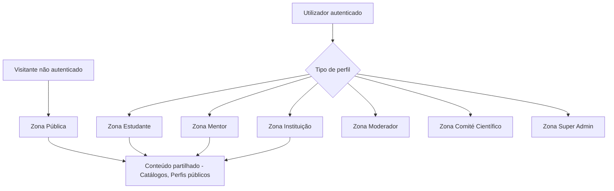
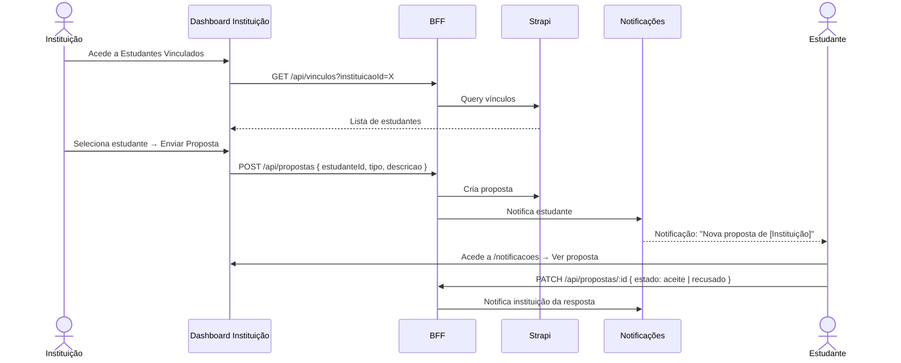
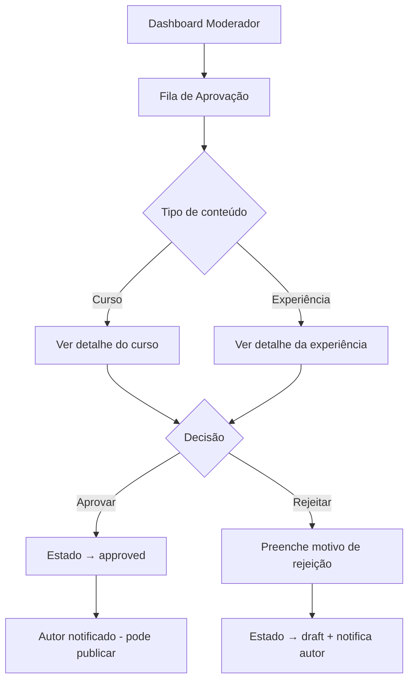

# PDC — Mapa Completo de Páginas e Fluxos por Role

# PDC — Mapa Completo de Páginas e Fluxos por Role

<user_quoted_section>Este documento é o mapa canónico da aplicação. Define cada página, quem a acede, o que faz, e como os fluxos se ligam. É a referência para o router, os guards de autenticação, os menus e a estrutura de navegação.</user_quoted_section>

## 1. Princípios de Navegação

### 1.1 Zonas da aplicação



### 1.2 Layout por zona

| Zona | Sidebar | TopBar | Footer |
| --- | --- | --- | --- |
| Pública (não autenticado) | Não | Sim (Login + Criar conta) | Sim |
| Estudante / Mentor / Instituição | Sim (menu por role) | Sim (notificações, perfil) | Não |
| Moderador / Comité | Sim (menu restrito) | Sim | Não |
| Super Admin | Sidebar admin dedicada | Sim | Não |
| Páginas de auth (login, registo) | Não | Não | Não |

### 1.3 Guards de autenticação

| Guard | Comportamento |
| --- | --- |
| `PublicOnly` | Redireciona para dashboard se já autenticado (ex: `/login`) |
| `RequireAuth` | Redireciona para `/login` se não autenticado |
| `RequireRole(roles[])` | Redireciona para `/403` se role não permitido |
| `RequireActive` | Redireciona para `/conta-inativa` se perfil desativado |

## 2. Zona Pública (Visitante)

Acessível sem autenticação. Objetivo: descoberta, conversão e onboarding.

### 2.1 Mapa de páginas públicas

| Rota | Página | Descrição |
| --- | --- | --- |
| `/` | Landing | Hero com desafio vocacional IA, blocos de impacto, CTA para registo |
| `/explorar` | Explorar | Catálogo geral: experiências, cursos, simulações, mentores, instituições |
| `/experiencias` | Catálogo de Experiências | Filtros por área, nível, instituição, região |
| `/experiencias/:id` | Detalhe de Experiência | Timeline, depoimentos, comunidade, bloco vocacional IA |
| `/cursos` | Catálogo de Cursos | Filtros por área, nível, idioma, preço |
| `/cursos/:id` | Detalhe de Curso | Descrição, módulos (preview), mentor, avaliações, CTA inscrição |
| `/simulacoes` | Catálogo de Simulações | Filtros por área, tipo, nível |
| `/simulacoes/:id` | Detalhe de Simulação | Descrição, critérios, histórico (se autenticado), CTA executar |
| `/programas` | Catálogo de Programas | Filtros por tipo, área, instituição |
| `/programas/:id` | Detalhe de Programa | Descrição, cursos/experiências incluídos, CTA participar |
| `/projetos` | Projetos em Alta | Feed de projetos públicos com votação |
| `/projetos/:id` | Detalhe de Projeto | Descrição, autor, feedback, votos, CTA colaborar |
| `/mentores` | Catálogo de Mentores | Filtros por área, avaliação, disponibilidade |
| `/instituicoes` | Catálogo de Instituições | Filtros por região, natureza, área |
| `/instituicoes/:id` | Perfil de Instituição | Experiências, cursos, programas, mentores vinculados |
| `/perfil/:id` | Perfil Público | Conquistas, projetos, cursos, avaliações |
| `/login` | Login | Email + password; link para registo e recuperação |
| `/criar-conta` | Escolha de tipo de conta | Estudante / Mentor / Instituição |
| `/criar-conta/estudante` | Registo Estudante | Formulário completo |
| `/criar-conta/mentor` | Registo Mentor | Formulário + upload de documentos |
| `/criar-conta/instituicao` | Registo Instituição | Formulário + upload de documentos |
| `/recuperar-senha` | Recuperar Senha | Email para reset |
| `/termos` | Termos de Uso | Documento legal |
| `/privacidade` | Política de Privacidade | Documento legal |
| `/404` | Não Encontrado | Página de erro 404 |
| `/403` | Sem Permissão | Página de erro 403 |
| `/conta-inativa` | Conta Inativa | Aviso de conta desativada |

### 2.2 Fluxo de onboarding (visitante → estudante)

```mermaid
flowchart TD
    A[Landing /] --> B{Clica em desafio vocacional}
    B --> C[Responde 3 perguntas IA]
    C --> D[Recebe veredito vocacional]
    D --> E{Quer continuar?}
    E -->|Sim| F[CTA: Criar conta gratuita]
    E -->|Explorar primeiro| G[/explorar]
    F --> H[/criar-conta/estudante]
    H --> I[Registo completo]
    I --> J[Dashboard Estudante /estudante]
```

### 2.3 Wireframe — Landing Page

```wireframe

<html>
<head>
<style>
* { margin: 0; padding: 0; box-sizing: border-box; font-family: sans-serif; }
body { background: #0a0a0f; color: #e0e0e0; }
.topbar { display: flex; justify-content: space-between; align-items: center; padding: 16px 32px; border-bottom: 1px solid #222; }
.logo { font-size: 18px; font-weight: bold; color: #fff; }
.topbar-actions { display: flex; gap: 12px; }
.btn { padding: 8px 16px; border-radius: 6px; font-size: 13px; cursor: pointer; border: none; }
.btn-outline { background: transparent; border: 1px solid #444; color: #ccc; }
.btn-primary { background: #6c63ff; color: #fff; }
.hero { padding: 80px 32px; text-align: center; max-width: 800px; margin: 0 auto; }
.hero h1 { font-size: 36px; font-weight: 700; margin-bottom: 16px; line-height: 1.2; }
.hero p { font-size: 16px; color: #aaa; margin-bottom: 32px; }
.challenge-box { background: #111; border: 1px solid #333; border-radius: 12px; padding: 24px; margin: 0 auto 32px; max-width: 600px; text-align: left; }
.challenge-box h3 { font-size: 14px; color: #6c63ff; margin-bottom: 12px; text-transform: uppercase; letter-spacing: 1px; }
.challenge-question { font-size: 16px; margin-bottom: 16px; }
.options { display: flex; flex-direction: column; gap: 8px; }
.option { padding: 10px 14px; border: 1px solid #333; border-radius: 8px; cursor: pointer; font-size: 14px; }
.option:hover { border-color: #6c63ff; }
.section { padding: 60px 32px; border-top: 1px solid #1a1a1a; }
.section-title { font-size: 22px; font-weight: 600; margin-bottom: 24px; text-align: center; }
.cards { display: grid; grid-template-columns: repeat(3, 1fr); gap: 16px; max-width: 900px; margin: 0 auto; }
.card { background: #111; border: 1px solid #222; border-radius: 10px; padding: 20px; }
.card-label { font-size: 11px; color: #6c63ff; text-transform: uppercase; margin-bottom: 8px; }
.card-title { font-size: 15px; font-weight: 600; margin-bottom: 6px; }
.card-sub { font-size: 13px; color: #888; }
.cta-section { text-align: center; padding: 60px 32px; }
.cta-section h2 { font-size: 26px; margin-bottom: 16px; }
.btn-large { padding: 14px 32px; font-size: 16px; border-radius: 8px; background: #6c63ff; color: #fff; border: none; cursor: pointer; }
</style>
</head>
<body>
<nav class="topbar">
  <div class="logo">Por Dentro do Curso</div>
  <div class="topbar-actions">
    <button class="btn btn-outline">Explorar</button>
    <button class="btn btn-outline" data-element-id="login-btn">Entrar</button>
    <button class="btn btn-primary" data-element-id="register-btn">Criar conta</button>
  </div>
</nav>

<div class="hero">
  <h1>Descobre a tua carreira antes de te comprometeres</h1>
  <p>Experimenta o dia a dia de qualquer profissão através de simulações reais. Toma decisões baseadas em evidência, não em suposições.</p>

  <div class="challenge-box">
    <h3>Desafio Vocacional — 3 perguntas</h3>
    <div class="challenge-question">Imagina que tens de resolver um problema técnico complexo. O que preferes fazer?</div>
    <div class="options">
      <div class="option" data-element-id="opt-1">Analisar dados e encontrar padrões</div>
      <div class="option" data-element-id="opt-2">Trabalhar com pessoas e comunicar soluções</div>
      <div class="option" data-element-id="opt-3">Construir ou criar algo com as mãos</div>
      <div class="option" data-element-id="opt-4">Investigar e aprofundar o conhecimento teórico</div>
    </div>
  </div>
</div>

<div class="section">
  <div class="section-title">Explora por área</div>
  <div class="cards">
    <div class="card">
      <div class="card-label">Experiências</div>
      <div class="card-title">Engenharia Civil</div>
      <div class="card-sub">Instituto Politécnico de Luanda · 3 depoimentos</div>
    </div>
    <div class="card">
      <div class="card-label">Simulação</div>
      <div class="card-title">Diagnóstico Médico</div>
      <div class="card-sub">Tipo 2 · Nível Médio · 847 tentativas</div>
    </div>
    <div class="card">
      <div class="card-label">Curso</div>
      <div class="card-title">Introdução à Programação</div>
      <div class="card-sub">Prof. João Silva · Gratuito · 4.8 ★</div>
    </div>
  </div>
</div>

<div class="cta-section">
  <h2>Pronto para tomar a decisão certa?</h2>
  <button class="btn-large" data-element-id="main-cta">Começar gratuitamente</button>
</div>
</body>
</html>
```

## 3. Zona Estudante

Acesso: perfil com `tipo = aluno`. Redireccionamento pós-login: `/estudante`.

### 3.1 Menu lateral do estudante

```
Dashboard
Aprendizagem
  ├── Meus Cursos
  ├── Meu Progresso
  ├── Minhas Notas
  ├── Certificados
  └── Simulações
Descoberta
  ├── Explorar
  ├── Experiências
  ├── Programas
  └── Mentores
Comunidade
  ├── Feed
  ├── Projetos
  ├── Conquistas
  └── Grupos
Pessoal
  ├── Mensagens
  ├── Notificações
  ├── Calendário
  └── Guardados
Perfil
  ├── Meu Perfil
  ├── Perfil Vocacional
  └── Definições de Conta
```

### 3.2 Mapa de páginas do estudante

| Rota | Página | Descrição | Dados principais |
| --- | --- | --- | --- |
| `/estudante` | Dashboard | Resumo de progresso, sugestões IA, alertas de risco, atividade recente | Inscrições, progresso, perfil vocacional |
| `/estudante/meus-cursos` | Meus Cursos | Lista de cursos inscritos com % progresso e estado | Inscrições + progresso |
| `/estudante/progresso` | Meu Progresso | Visão detalhada de progresso por curso e módulo | Progresso por módulo |
| `/estudante/notas` | Minhas Notas | Notas de quizzes e atividades por curso | Submissões + notas |
| `/estudante/certificados` | Certificados | Cursos concluídos com certificado disponível | Inscrições concluídas |
| `/estudante/simulacoes` | Minhas Simulações | Histórico de tentativas e scores | Tentativas de simulação |
| `/estudante/conquistas` | Minhas Conquistas | Conquistas obtidas e partilhadas | Conquistas |
| `/estudante/projetos` | Meus Projetos | Projetos publicados pelo estudante | Projetos |
| `/estudante/projetos/colaboracao` | Projetos em Colaboração | Projetos onde participa como colaborador | Projetos (colaborador) |
| `/estudante/ranking` | Ranking | Posição no ranking da plataforma | Score de reputação |
| `/estudante/calendario` | Calendário | Eventos, prazos de tarefas, datas de cursos | Eventos + tarefas |
| `/perfil/me` | Meu Perfil | Perfil público do estudante | Perfil + conquistas + projetos |
| `/perfil/vocacional` | Perfil Vocacional | Aptidões, compatibilidade, recomendações | Perfil vocacional |
| `/definicoes` | Definições de Conta | Email, senha, notificações, privacidade | Conta |
| `/editar-perfil/aluno` | Editar Perfil | Dados pessoais, foto, área, região | Perfil |
| `/vinculo` | Vínculos | Pedidos enviados/recebidos, conexões ativas | Vínculos |
| `/mensagens` | Mensagens | Conversas com mentores, colegas, instituições | Mensagens |
| `/notificacoes` | Notificações | Todas as notificações do sistema | Notificações |
| `/guardados` | Guardados | Conteúdo guardado (cursos, experiências, projetos) | Favoritos |
| `/feed` | Feed | Posts, conquistas, atividade da rede | Posts + conquistas |
| `/grupos` | Grupos | Grupos de estudo e colaboração | Grupos |

### 3.3 Fluxo principal do estudante — Descoberta → Aprendizagem

```mermaid
flowchart TD
    A[Dashboard /estudante] --> B{O que quer fazer?}
    B --> C[Explorar conteúdo]
    B --> D[Continuar curso inscrito]
    B --> E[Ver perfil vocacional]
    C --> F[/experiencias ou /cursos ou /simulacoes]
    F --> G[Detalhe do conteúdo]
    G --> H{Tipo de conteúdo}
    H -->|Experiência| I[Ver timeline + depoimentos + desafio vocacional]
    H -->|Curso| J[Ver módulos + inscrever-se]
    H -->|Simulação| K[Executar simulação + ver score]
    J --> L[/estudante/meus-cursos]
    K --> M[Score contribui para Perfil Vocacional]
    I --> M
    D --> N[/curso/:id/interior]
    N --> O[Módulo → Aula → Quiz/Tarefa]
    O --> P[Progresso atualizado]
    P --> Q{Curso concluído?}
    Q -->|Sim| R[Certificado disponível]
    Q -->|Não| N
```

### 3.4 Wireframe — Dashboard Estudante

```wireframe

<html>
<head>
<style>
* { margin: 0; padding: 0; box-sizing: border-box; font-family: sans-serif; }
body { display: flex; background: #0a0a0f; color: #e0e0e0; min-height: 100vh; }
.sidebar { width: 220px; background: #0d0d14; border-right: 1px solid #1a1a2e; padding: 20px 0; flex-shrink: 0; }
.sidebar-logo { padding: 0 16px 20px; font-size: 14px; font-weight: bold; color: #6c63ff; border-bottom: 1px solid #1a1a2e; margin-bottom: 12px; }
.sidebar-section { padding: 8px 16px 4px; font-size: 10px; color: #555; text-transform: uppercase; letter-spacing: 1px; }
.sidebar-item { padding: 8px 16px; font-size: 13px; color: #aaa; cursor: pointer; display: flex; align-items: center; gap: 8px; }
.sidebar-item.active { color: #fff; background: #1a1a2e; border-left: 2px solid #6c63ff; }
.sidebar-item:hover { color: #fff; }
.main { flex: 1; padding: 24px; overflow-y: auto; }
.topbar { display: flex; justify-content: space-between; align-items: center; margin-bottom: 24px; }
.topbar h1 { font-size: 20px; font-weight: 600; }
.topbar-right { display: flex; gap: 12px; align-items: center; }
.notif-btn { width: 36px; height: 36px; border-radius: 50%; background: #111; border: 1px solid #222; display: flex; align-items: center; justify-content: center; font-size: 16px; cursor: pointer; }
.avatar { width: 36px; height: 36px; border-radius: 50%; background: #6c63ff; display: flex; align-items: center; justify-content: center; font-size: 13px; font-weight: bold; }
.ai-card { background: linear-gradient(135deg, #1a1a2e, #16213e); border: 1px solid #2a2a4e; border-radius: 12px; padding: 20px; margin-bottom: 20px; }
.ai-label { font-size: 11px; color: #6c63ff; text-transform: uppercase; letter-spacing: 1px; margin-bottom: 8px; }
.ai-headline { font-size: 16px; font-weight: 600; margin-bottom: 6px; }
.ai-sub { font-size: 13px; color: #888; margin-bottom: 14px; }
.ai-action { display: inline-block; padding: 8px 16px; background: #6c63ff; border-radius: 6px; font-size: 13px; cursor: pointer; }
.grid-2 { display: grid; grid-template-columns: 1fr 1fr; gap: 16px; margin-bottom: 20px; }
.grid-3 { display: grid; grid-template-columns: repeat(3, 1fr); gap: 16px; margin-bottom: 20px; }
.stat-card { background: #111; border: 1px solid #1e1e1e; border-radius: 10px; padding: 16px; }
.stat-label { font-size: 11px; color: #666; margin-bottom: 6px; }
.stat-value { font-size: 24px; font-weight: 700; color: #fff; }
.stat-sub { font-size: 12px; color: #555; margin-top: 4px; }
.section-title { font-size: 15px; font-weight: 600; margin-bottom: 12px; }
.course-item { background: #111; border: 1px solid #1e1e1e; border-radius: 8px; padding: 14px; margin-bottom: 8px; display: flex; align-items: center; gap: 14px; }
.course-thumb { width: 48px; height: 48px; background: #1a1a2e; border-radius: 6px; flex-shrink: 0; }
.course-info { flex: 1; }
.course-title { font-size: 14px; font-weight: 500; margin-bottom: 4px; }
.course-meta { font-size: 12px; color: #666; }
.progress-bar { height: 4px; background: #1e1e1e; border-radius: 2px; margin-top: 6px; }
.progress-fill { height: 100%; background: #6c63ff; border-radius: 2px; }
.badge { display: inline-block; padding: 2px 8px; border-radius: 4px; font-size: 11px; }
.badge-green { background: #0d2e1a; color: #4caf50; }
.badge-yellow { background: #2e2a0d; color: #ffc107; }
</style>
</head>
<body>
<div class="sidebar">
  <div class="sidebar-logo">PDC</div>
  <div class="sidebar-section">Principal</div>
  <div class="sidebar-item active" data-element-id="nav-dashboard">⬛ Dashboard</div>
  <div class="sidebar-section">Aprendizagem</div>
  <div class="sidebar-item" data-element-id="nav-cursos">📚 Meus Cursos</div>
  <div class="sidebar-item" data-element-id="nav-progresso">📈 Meu Progresso</div>
  <div class="sidebar-item" data-element-id="nav-notas">📝 Minhas Notas</div>
  <div class="sidebar-item" data-element-id="nav-certs">🏆 Certificados</div>
  <div class="sidebar-section">Descoberta</div>
  <div class="sidebar-item" data-element-id="nav-explorar">🔍 Explorar</div>
  <div class="sidebar-item" data-element-id="nav-exp">✨ Experiências</div>
  <div class="sidebar-section">Comunidade</div>
  <div class="sidebar-item" data-element-id="nav-feed">📰 Feed</div>
  <div class="sidebar-item" data-element-id="nav-projetos">💡 Projetos</div>
  <div class="sidebar-section">Pessoal</div>
  <div class="sidebar-item" data-element-id="nav-msgs">💬 Mensagens</div>
  <div class="sidebar-item" data-element-id="nav-notifs">🔔 Notificações</div>
</div>
<div class="main">
  <div class="topbar">
    <h1>Bom dia, Carlos 👋</h1>
    <div class="topbar-right">
      <div class="notif-btn" data-element-id="notif-btn">🔔</div>
      <div class="avatar" data-element-id="avatar-btn">CJ</div>
    </div>
  </div>

  <div class="ai-card">
    <div class="ai-label">Assistente PDC</div>
    <div class="ai-headline">Tens 2 tarefas com prazo esta semana</div>
    <div class="ai-sub">O teu ritmo de estudo caiu 30% esta semana. Recomendamos 45 min hoje no módulo de Estruturas.</div>
    <div class="ai-action" data-element-id="ai-action">Ver plano de hoje →</div>
  </div>

  <div class="grid-3">
    <div class="stat-card">
      <div class="stat-label">Cursos ativos</div>
      <div class="stat-value">3</div>
      <div class="stat-sub">1 com prazo esta semana</div>
    </div>
    <div class="stat-card">
      <div class="stat-label">Progresso médio</div>
      <div class="stat-value">67%</div>
      <div class="stat-sub">+12% vs semana passada</div>
    </div>
    <div class="stat-card">
      <div class="stat-label">Perfil vocacional</div>
      <div class="stat-value">82</div>
      <div class="stat-sub">Aptidão técnica · Engenharia</div>
    </div>
  </div>

  <div class="section-title">Continuar a aprender</div>
  <div class="course-item">
    <div class="course-thumb"></div>
    <div class="course-info">
      <div class="course-title">Introdução à Engenharia Civil</div>
      <div class="course-meta">Módulo 3 de 6 · Prof. António Lopes</div>
      <div class="progress-bar"><div class="progress-fill" style="width:52%"></div></div>
    </div>
    <span class="badge badge-yellow">52%</span>
  </div>
  <div class="course-item">
    <div class="course-thumb"></div>
    <div class="course-info">
      <div class="course-title">Gestão de Projetos</div>
      <div class="course-meta">Módulo 5 de 5 · Dra. Maria Santos</div>
      <div class="progress-bar"><div class="progress-fill" style="width:90%"></div></div>
    </div>
    <span class="badge badge-green">90%</span>
  </div>
</div>
</body>
</html>
```

## 4. Zona Mentor

Acesso: perfil com `tipo = mentor`. Redireccionamento pós-login: `/mentor`.

### 4.1 Menu lateral do mentor

```
Dashboard
Conteúdo
  ├── Meus Cursos (criados)
  ├── Minhas Experiências
  ├── Minhas Simulações
  └── Upload de Conteúdo
Alunos
  ├── Inscritos nos meus cursos
  ├── Vinculados a mim
  └── Mentorados
Instituições
  └── Instituições vinculadas
Comunidade
  ├── Feed
  ├── Grupos
  └── Calendário
Analytics
  └── Relatórios dos meus cursos
Reputação
  └── Avaliações recebidas
Pessoal
  ├── Mensagens
  ├── Notificações
  └── Vínculos
Perfil
  ├── Meu Perfil
  └── Definições de Conta
```

### 4.2 Mapa de páginas do mentor

| Rota | Página | Descrição |
| --- | --- | --- |
| `/mentor` | Dashboard Mentor | Resumo de alunos, cursos, receita, alertas |
| `/mentor/cursos` | Meus Cursos (criados) | Lista de cursos criados com estado editorial |
| `/mentor/cursos/criar` | Criar Curso | Formulário de criação de curso |
| `/mentor/cursos/:id/editar` | Editar Curso | Edição de curso em draft |
| `/mentor/experiencias` | Minhas Experiências | Experiências criadas (via instituição vinculada) |
| `/mentor/simulacoes` | Minhas Simulações | Simulações criadas |
| `/mentor/upload` | Upload de Conteúdo | Upload de vídeos, PDFs, materiais |
| `/mentor/alunos` | Alunos (resumo) | Visão geral de todos os alunos |
| `/mentor/alunos/inscritos` | Alunos Inscritos | Alunos inscritos nos seus cursos |
| `/mentor/alunos/vinculados` | Alunos Vinculados | Alunos com vínculo formal |
| `/mentor/mentorados` | Mentorados | Alunos em mentoria ativa com alertas de risco |
| `/mentor/instituicoes-vinculadas` | Instituições Vinculadas | Instituições com que colabora |
| `/mentor/analytics` | Analytics | Métricas de cursos: conclusão, notas, evasão |
| `/mentor/reputacao` | Reputação | Avaliações recebidas de alunos |
| `/mentor/calendario` | Calendário | Eventos, prazos de tarefas dos seus cursos |
| `/mentor/grupos` | Grupos | Grupos de cursos que gere |
| `/perfil/me` | Meu Perfil | Perfil público do mentor |
| `/editar-perfil/mentor` | Editar Perfil | Dados, foto, área de especialidade |
| `/mensagens` | Mensagens | Conversas com alunos e instituições |
| `/notificacoes` | Notificações | Notificações do sistema |
| `/vinculo` | Vínculos | Pedidos de vínculo recebidos/enviados |

### 4.3 Fluxo de criação e publicação de curso

```mermaid
flowchart TD
    A[/mentor/cursos] --> B[Clica Criar Curso]
    B --> C[/mentor/cursos/criar]
    C --> D[Preenche campos básicos]
    D --> E[Guarda rascunho - estado: draft]
    E --> F[Adiciona módulos e itens]
    F --> G{Pronto para revisão?}
    G -->|Sim| H[Submete para revisão - estado: review]
    G -->|Não| F
    H --> I[Moderador revê]
    I --> J{Decisão}
    J -->|Aprovado| K[Mentor recebe notificação - estado: approved]
    J -->|Rejeitado| L[Mentor recebe feedback - volta a draft]
    K --> M[Mentor publica - estado: published]
    M --> N[Curso aparece no catálogo]
```

## 5. Zona Instituição

Acesso: perfil com `tipo = instituicao`. Redireccionamento pós-login: `/instituicao`.

### 5.1 Menu lateral da instituição

```
Dashboard
Conteúdo
  ├── Cursos publicados
  └── Programas e Experiências
Pessoas
  ├── Mentores vinculados
  └── Estudantes vinculados
Propostas
  └── Propostas enviadas a estudantes
Relatórios
  └── Relatórios detalhados
Branding
  └── Personalização da página
Comunidade
  ├── Feed
  └── Calendário
Reputação
  └── Avaliações recebidas
Pessoal
  ├── Mensagens
  └── Notificações
Perfil
  ├── Perfil da Instituição
  └── Definições de Conta
```

### 5.2 Mapa de páginas da instituição

| Rota | Página | Descrição |
| --- | --- | --- |
| `/instituicao` | Dashboard Instituição | Resumo de alunos, cursos, taxa de evasão, alertas |
| `/instituicao/cursos` | Cursos Publicados | Cursos da instituição com métricas |
| `/instituicao/programas` | Programas e Experiências | Programas e experiências criadas |
| `/instituicao/criar-experiencia` | Criar Experiência | Formulário de criação de experiência |
| `/instituicao/criar-programa` | Criar Programa | Formulário de criação de programa |
| `/instituicao/mentores-vinculados` | Mentores Vinculados | Mentores associados à instituição |
| `/instituicao/estudantes-vinculados` | Estudantes Vinculados | Estudantes associados à instituição |
| `/instituicao/propostas` | Propostas | Propostas enviadas a estudantes |
| `/instituicao/relatorios` | Relatórios | Dashboard de métricas: evasão, engajamento, conteúdo |
| `/instituicao/branding` | Branding | Logo, cores, textos da página pública |
| `/instituicao/reputacao` | Reputação | Avaliações recebidas |
| `/instituicao/calendario` | Calendário | Eventos e programas |
| `/perfil/me` | Perfil da Instituição | Página pública da instituição |
| `/editar-perfil/instituicao` | Editar Perfil | Dados, logo, descrição, região |
| `/mensagens` | Mensagens | Conversas com mentores e estudantes |
| `/notificacoes` | Notificações | Notificações do sistema |

### 5.3 Fluxo de proposta direta a estudante



## 6. Zona Moderador

Acesso: perfil com `tipo = moderador`. Redireccionamento pós-login: `/moderador`.

### 6.1 Menu lateral do moderador

```
Dashboard
Moderação
  ├── Fila de Aprovação
  │   ├── Cursos pendentes
  │   ├── Experiências pendentes
  │   ├── Simulações pendentes
  │   └── Conquistas pendentes
  └── Denúncias
Gestão
  ├── Utilizadores
  └── Reputação
Pessoal
  ├── Mensagens
  └── Notificações
```

### 6.2 Mapa de páginas do moderador

| Rota | Página | Descrição |
| --- | --- | --- |
| `/moderador` | Dashboard Moderador | Fila de aprovação, denúncias pendentes, alertas |
| `/moderador/aprovacoes` | Fila de Aprovação | Hub com tabs: Cursos / Experiências / Simulações / Conquistas |
| `/moderador/aprovacoes/cursos` | Cursos Pendentes | Lista de cursos em estado `review` |
| `/moderador/aprovacoes/experiencias` | Experiências Pendentes | Lista de experiências em `review` |
| `/moderador/aprovacoes/simulacoes` | Simulações Pendentes | Lista de simulações em `review` |
| `/moderador/aprovacoes/conquistas` | Conquistas Pendentes | Lista de conquistas em `review` |
| `/moderador/denuncias` | Denúncias | Lista de denúncias com prioridade e estado |
| `/moderador/utilizadores` | Utilizadores | Gestão de utilizadores (ativar/desativar) |
| `/moderador/reputacao` | Reputação | Moderação de avaliações e scores |
| `/mensagens` | Mensagens | Comunicação com utilizadores |
| `/notificacoes` | Notificações | Notificações do sistema |

### 6.3 Fluxo de aprovação de conteúdo



## 7. Zona Comité Científico

Acesso: perfil com `tipo = comite_cientifico`. Redireccionamento pós-login: `/comite-cientifico`.

### 7.1 Mapa de páginas

| Rota | Página | Descrição |
| --- | --- | --- |
| `/comite-cientifico` | Dashboard Comité | Simulações e conquistas pendentes de validação |
| `/comite-cientifico/validacao` | Validação Científica | Lista com filtros: Pendentes / Todos; marcar como validado com comentário |
| `/mensagens` | Mensagens | Comunicação |
| `/notificacoes` | Notificações | Notificações |

**Nota:** O comité científico valida o rigor académico do conteúdo (simulações, conquistas). É diferente da moderação editorial (que aprova/rejeita para publicação). Um conteúdo pode estar publicado e depois receber validação científica.

## 8. Zona Super Admin

Acesso: perfil com `tipo = super_admin`. Redireccionamento pós-login: `/admin`.

### 8.1 Menu lateral do super admin

```
Dashboard
Dados & Análise
  ├── Estatísticas globais
  ├── Telemetria
  ├── Presença online
  └── Registo de atividade (Auditoria)
Utilizadores
  ├── Todos os utilizadores
  ├── Permissões
  ├── Instituições pendentes
  └── Mentores pendentes
Moderação
  ├── Fila de aprovação
  ├── Denúncias
  ├── Reputação
  └── Validação científica
Sistema
  ├── Site Settings (copy, logos, cores)
  ├── Feature Flags
  ├── Financeiro
  └── Configurações técnicas
Pessoal
  ├── Mensagens
  └── Notificações
```

### 8.2 Mapa de páginas do super admin

| Rota | Página | Descrição |
| --- | --- | --- |
| `/admin` | Dashboard Admin | KPIs globais: utilizadores, conteúdo, receita, evasão |
| `/admin/estatisticas` | Estatísticas | Gráficos de crescimento, retenção, uso por área |
| `/admin/telemetria` | Telemetria | Eventos comportamentais, funis, drop-offs |
| `/admin/presence` | Presença Online | Utilizadores ativos em tempo real |
| `/admin/auditoria` | Registo de Atividade | Log de ações críticas com ator, data, contexto |
| `/admin/utilizadores` | Todos os Utilizadores | Lista completa com filtros, ativar/desativar |
| `/admin/permissoes` | Permissões | Matriz de permissões por role (consulta) |
| `/admin/instituicoes-pendentes` | Instituições Pendentes | Fila de aprovação de novas instituições |
| `/admin/mentores-pendentes` | Mentores Pendentes | Fila de aprovação de novos mentores |
| `/admin/moderacao` | Fila de Aprovação | Mesma fila do moderador + acesso total |
| `/admin/denuncias` | Denúncias | Todas as denúncias da plataforma |
| `/admin/reputacao` | Reputação | Gestão de scores e avaliações |
| `/admin/site-settings` | Site Settings | Editar copy, logos, imagens sem código |
| `/admin/funcionalidades` | Feature Flags | Ativar/desativar funcionalidades por role |
| `/admin/financeiro` | Financeiro | Receita, transações, comissões |
| `/admin/configuracoes` | Configurações | Variáveis técnicas do sistema |
| `/mensagens` | Mensagens | Comunicação |
| `/notificacoes` | Notificações | Notificações |

## 9. Páginas Partilhadas (todos os roles autenticados)

Estas páginas são acessíveis a todos os utilizadores autenticados, independentemente do role.

| Rota | Página | Descrição |
| --- | --- | --- |
| `/perfil/:id` | Perfil Público | Perfil de qualquer utilizador |
| `/feed` | Feed Global | Posts e conquistas da rede |
| `/feed/:type/:id` | Detalhe de Post/Conquista | Post ou conquista individual |
| `/mensagens` | Mensagens | Inbox de mensagens |
| `/notificacoes` | Notificações | Centro de notificações |
| `/guardados` | Guardados | Conteúdo guardado |
| `/busca` | Busca Global | Pesquisa em toda a plataforma |
| `/vinculo` | Vínculos | Gestão de conexões |
| `/vinculo/pedido/:id` | Pedido de Vínculo | Aceitar/recusar pedido de vínculo |
| `/relatorio/:id` | Relatório de Perfil | Relatório detalhado de um perfil |
| `/curso/:id/interior` | Interior do Curso | Conteúdo do curso (módulos, aulas, tarefas) |
| `/curso/:id/discussoes` | Discussões do Curso | Fórum do curso |
| `/curso/:id/notas` | Livro de Notas | Notas do curso (mentor vê todos; aluno vê as suas) |
| `/tarefa/:id` | Detalhe de Tarefa | Tarefa com submissão |
| `/quiz/:id` | Responder Quiz | Interface de quiz |
| `/conquistas/publicar` | Publicar Conquista | Formulário de publicação de conquista |
| `/reputacao/ranking` | Ranking de Reputação | Ranking global da plataforma |
| `/reputacao/avaliacoes` | Avaliações | Avaliações recebidas/dadas |

## 10. Fluxo de Autenticação Completo

```mermaid
flowchart TD
    A[Utilizador acede à app] --> B{Tem sessão válida?}
    B -->|Sim| C{Perfil ativo?}
    B -->|Não| D[/login]
    C -->|Sim| E[Redireciona para dashboard do role]
    C -->|Não| F[/conta-inativa]
    D --> G[Preenche email + password]
    G --> H{Credenciais válidas?}
    H -->|Não| I[Erro: credenciais inválidas]
    H -->|Sim| J{Perfil aprovado?}
    J -->|Não| K[Aguarda aprovação - mensagem informativa]
    J -->|Sim| E
    E --> L{Tipo de perfil}
    L -->|aluno| M[/estudante]
    L -->|mentor| N[/mentor]
    L -->|instituicao| O[/instituicao]
    L -->|moderador| P[/moderador]
    L -->|comite_cientifico| Q[/comite-cientifico]
    L -->|super_admin| R[/admin]
```

## 11. Regras de Acesso a Conteúdo de Cursos

| Conteúdo | Visitante | Estudante (não inscrito) | Estudante (inscrito) | Mentor (autor) | Outros roles |
| --- | --- | --- | --- | --- | --- |
| Catálogo de cursos | ✅ | ✅ | ✅ | ✅ | ✅ |
| Detalhe do curso (preview) | ✅ | ✅ | ✅ | ✅ | ✅ |
| Módulos e aulas | ❌ | ❌ | ✅ | ✅ | Moderador/Admin ✅ |
| Tarefas e quizzes | ❌ | ❌ | ✅ | ✅ | Moderador/Admin ✅ |
| Discussões do curso | ❌ | ❌ | ✅ | ✅ | Moderador/Admin ✅ |
| Livro de notas | ❌ | ❌ | Só as suas | Todos os alunos | Admin ✅ |
| Criar/editar curso | ❌ | ❌ | ❌ | ✅ (próprio) | Admin ✅ |

## 12. Resumo de Rotas por Role

| Role | Rotas exclusivas | Rotas partilhadas |
| --- | --- | --- |
| Visitante | `/`, `/login`, `/criar-conta/*`, `/recuperar-senha` | Catálogos públicos, perfis públicos |
| Estudante | `/estudante/*`, `/editar-perfil/aluno`, `/perfil/vocacional` | Feed, mensagens, notificações, cursos (inscrito), busca |
| Mentor | `/mentor/*`, `/editar-perfil/mentor` | Feed, mensagens, notificações, cursos (autor), busca |
| Instituição | `/instituicao/*`, `/editar-perfil/instituicao` | Feed, mensagens, notificações, busca |
| Moderador | `/moderador/*` | Mensagens, notificações, acesso de leitura a todo o conteúdo |
| Comité | `/comite-cientifico/*` | Mensagens, notificações |
| Super Admin | `/admin/*` | Tudo |
