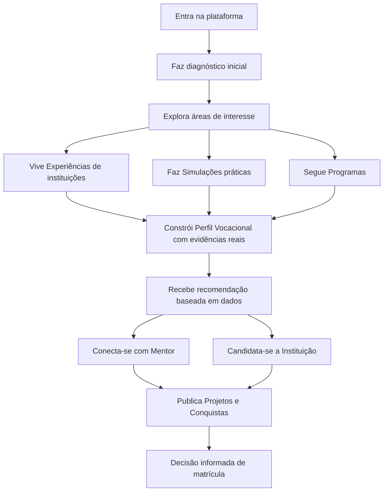
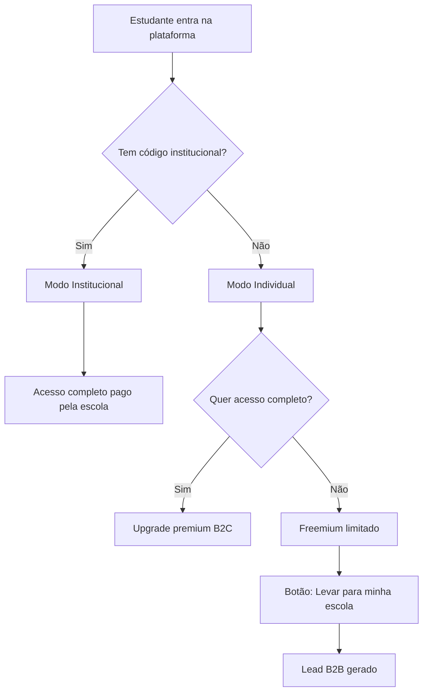

# PDC — Visão do Produto e Lógica de Funcionamento

# Por Dentro do Curso (PDC) — Visão do Produto

<user_quoted_section>Frase central: O PDC não é uma plataforma de ensino. É uma infraestrutura de decisão educacional — transforma a incerteza vocacional em escolhas de carreira precisas, antes que as decisões erradas custem dinheiro.</user_quoted_section>

## 1. O Problema que o PDC Resolve

Em Angola (e em muitos mercados emergentes), a escolha de curso universitário é uma aposta, não uma decisão informada. O resultado:

- Altos níveis evasão no primeiro ano em algumas instituições
- Famílias perdem dinheiro em cursos abandonados
- Instituições perdem receita e reputação
- O país perde talentos que poderiam impulsionar o desenvolvimento

**O PDC resolve isto dando ao estudante a experiência real do curso antes de se comprometer.**

## 2. O que o PDC É (e o que não é)

| O PDC É | O PDC NÃO É |
| --- | --- |
| Uma infraestrutura de decisão vocacional | Um repositório passivo de conteúdo |
| Um sistema que mede comportamento real | Um teste de personalidade genérico |
| Uma plataforma de marketing institucional | Uma cópia do Canvas/Moodle |
| Um ecossistema onde todos ganham | Uma ferramenta só para estudantes |

## 3. Os Utilizadores e o que Cada Um Faz

### 3.1 Estudante (utilizador principal)

O estudante é o centro de tudo. Tudo o que existe na plataforma serve para ajudá-lo a tomar uma decisão melhor.

**Jornada do estudante:**

**O que o estudante pode fazer:**

- Explorar Experiências, Simulações, Cursos e Programas
- Fazer simulações práticas e receber feedback imediato
- Construir um perfil vocacional baseado em desempenho real (não autoavaliação)
- Conectar-se com mentores (contratar, pedir feedback, parceiros de estudo)
- Publicar projetos e conquistas para ganhar visibilidade
- Receber propostas diretas de instituições
- Aceder a relatórios detalhados do seu percurso

### 3.2 Mentor / Professor

Orienta estudantes, publica conteúdo, avalia, monetiza o seu conhecimento.

**O que o mentor faz:**

- Publica Cursos e Simulações (monetizáveis)
- Orienta estudantes vinculados (mentorados)
- Avalia projetos e dá feedback
- Acede a analytics dos seus alunos
- Recebe propostas de colaboração de instituições

### 3.3 Instituição

Usa o PDC como ferramenta de marketing, recrutamento e redução de evasão.

**O que a instituição faz:**

- Publica Experiências (gratuitas — marketing institucional)
- Publica Cursos e Programas (monetizáveis)
- Faz propostas diretas a estudantes com perfil adequado
- Acompanha a jornada de estudantes vinculados
- Acede a relatórios detalhados (taxa de evasão, conteúdos mais populares, onde os utilizadores desistem, cliques, tempo por questão, etc.)
- Gere mentores e estudantes vinculados à instituição

### 3.4 Comité Científico

Valida a qualidade e rigor académico do conteúdo.

**O que faz:**

- Valida Simulações e Experiências antes de serem publicadas
- Garante que o feedback dado aos estudantes é baseado em evidência real, não especulação

### 3.5 Moderador

Mantém o ambiente seguro e produtivo.

**O que faz:**

- Aprova/rejeita conteúdo publicado
- Gere denúncias
- Supervisiona utilizadores

### 3.6 Super Admin

Gere toda a plataforma, configura o sistema, acede a todos os dados.

### 3.7 Patrocinador (papel futuro)

Empresas que financiam talentos, trilhas ou programas. Acedem a talentos validados pela plataforma.

## 4. Os Tipos de Conteúdo (Domínios)

### 4.1 Experiência

**O que é:** Apresentação imersiva do programa curricular de um curso numa instituição. Inclui depoimentos, explicações, conselhos de alunos reais. É 100% gratuita — é marketing institucional.

**Quem publica:** Instituições e Mentores

**Formato:** Vídeos, textos, depoimentos, timeline do curso, comunidade de perguntas

**Objetivo:** Dar ao estudante uma visão real de "como é estudar X na instituição Y"

### 4.2 Simulação

**O que é:** Ambiente prático onde o estudante experimenta tarefas reais da profissão antes de se comprometer com a matrícula.

**Tipos:**

| Tipo | Descrição |
| --- | --- |
| Tipo 1 | Vídeo guiado + checklist + avaliação por critérios |
| Tipo 2 | Laboratório externo (iframe) + tracking de tentativas |
| Tipo 3 | Ambiente altamente interativo com feedback em tempo real |

**O que o sistema mede:** tempo por questão, decisões tomadas, erros, padrão comportamental, taxa de conclusão, score final

**Output para o estudante:** Score + feedback detalhado + contribuição para o Perfil Vocacional

### 4.3 Curso

**O que é:** Conteúdo estruturado com módulos, aulas, tarefas, quizzes e certificado. Pode ser monetizado por mentores e instituições.

**Estrutura:** Curso → Módulos → Itens (aula/tarefa/ficheiro/link) → Submissões → Notas

### 4.4 Programa

**O que é:** Iniciativa mais ampla que pode conter Cursos e Experiências. Serve para disseminar ideias, incentivar práticas, promover eventos, executar projetos, visitar escolas, acompanhar o dia a dia de profissionais.

**Exemplos:** "Programa de Orientação Vocacional para o Ensino Médio", "Semana da Engenharia", "Visita à Faculdade de Medicina"

### 4.5 Projeto

**O que é:** Trabalho publicado por um estudante para ganhar visibilidade, feedback, mentorado e conexão com patrocinadores.

**Funcionalidades:** Votação, feedback de mentores, colaboração, ponte com patrocinadores

### 4.6 Post / Conquista

**Posts:** Publicações gerais da comunidade
**Conquistas:** Marcos alcançados pelos utilizadores (completar simulação, obter certificado, ser aceite numa instituição) — partilháveis publicamente

## 5. Recursos Transversais

### 5.1 Perfil Vocacional (core do produto)

O coração do PDC. Construído automaticamente com base em comportamento real:

| Dimensão | Como é medida |
| --- | --- |
| Aptidão Técnica | Scores em simulações e tarefas por área |
| Compatibilidade Psicológica | Padrões de decisão, persistência, tempo de resposta |
| Motivação Intrínseca | Áreas onde o estudante passa mais tempo voluntariamente |
| Potencial de Sucesso | Combinação das três dimensões acima |

**Output:** Relatório vocacional com recomendações de cursos/carreiras baseadas em evidência real

### 5.2 Telemetria

O sistema de inteligência do PDC. Mede tudo:

- Tempo por questão/tarefa
- Decisões tomadas (e mudadas)
- Onde os utilizadores desistem
- Padrões de comportamento por área
- Taxa de conclusão por conteúdo

**Uso:** Alimenta o Perfil Vocacional, os Relatórios Institucionais e a IA

### 5.3 IA

- Geração automática de quizzes a partir de conteúdo
- Auxílio no aprendizado (tutor conversacional)
- Pré-orientação vocacional (análise do perfil)
- Chatbot com conhecimento da plataforma
- Auxílio na elaboração de relatórios

### 5.4 Relatórios

**Para estudantes:** Percurso completo, scores, perfil vocacional, recomendações

**Para instituições:**

- Taxa de evasão por curso
- Conteúdos mais populares
- Onde os utilizadores desistem nos seus conteúdos
- Cliques, tempo por questão
- Perfil dos estudantes vinculados
- Tendências e comparações

**Para admins:** Visão global da plataforma, telemetria, auditoria

### 5.5 Vínculo (Conexão)

Funciona como o "Conectar" do LinkedIn — estabelece uma relação formal entre:

- Estudante ↔ Mentor (mentorado)
- Estudante ↔ Instituição (candidato/aluno)
- Mentor ↔ Instituição (colaboração)

### 5.6 Monetização

| Quem | O quê | Modelo |
| --- | --- | --- |
| Mentores | Cursos, Simulações, Mentorias | Preço definido pelo mentor; PDC retém comissão |
| Instituições | Cursos, Programas | Preço definido pela instituição; PDC retém comissão |
| Experiências | SEMPRE GRATUITAS | Marketing institucional |
| PDC (B2B) | Licença institucional | Por aluno/ano ou pacote fechado |
| PDC (B2C) | Acesso premium para estudantes | Freemium + upgrade |

## 6. Modelo de Negócio

### Motor Principal: B2B Institucional

Escolas e universidades pagam para oferecer o PDC aos seus alunos.

**Modelo:** Pacote por aluno/ano (ex: $5–$15/aluno/ano)

**Argumento de venda:** "Se o PDC ajudar a reter apenas 2-5 alunos que desistiriam, o investimento já se paga"

### Complementares

1. **B2C Freemium** — estudantes individuais com acesso limitado; upgrade pago
2. **Marketplace** — comissão sobre mentorias e cursos pagos
3. **Patrocínio** — empresas financiam talentos e trilhas

### Dois Modos de Entrada

## 7. Visão de Longo Prazo

O PDC será o lugar de referência para consultar e preparar-se para os desafios académicos em todas as fases:

- **Pais de crianças pequenas** que procuram as melhores escolas do ensino básico
- **Estudantes do ensino médio** indecisos sobre que curso escolher
- **Estudantes universitários** que querem mudar de curso ou área
- **Profissionais** que querem requalificar-se
- **Instituições** que querem atrair os alunos certos e reduzir evasão
- **Patrocinadores** que querem identificar e apoiar talentos

**O moat (barreira competitiva):**

<user_quoted_section>Quanto mais o PDC é usado, mais preciso e valioso ele se torna. Os dados comportamentais acumulados são um ativo único e crescente que nenhum concorrente pode replicar rapidamente.</user_quoted_section>
