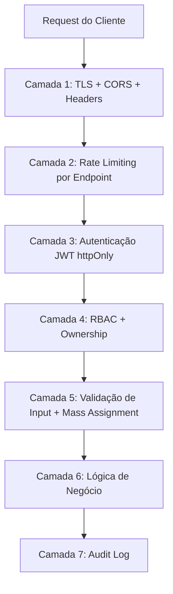
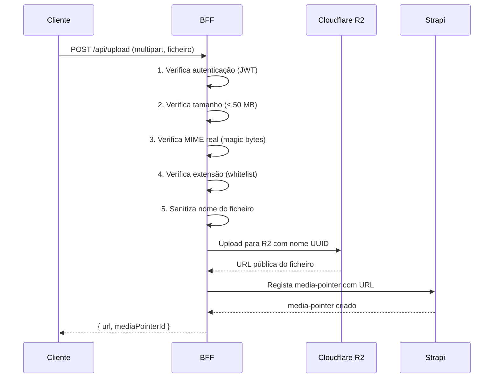

# PDC — Regras de Segurança Base

# PDC — Regras de Segurança Base

<user_quoted_section>Âmbito: BFF (Node.js/Fastify) + Strapi v5 + Frontend (React/Vite). Esta spec define as regras que devem estar implementadas antes de qualquer feature — são a fundação sobre a qual tudo o resto é construído.</user_quoted_section>

## 1. Diagnóstico do Estado Atual

Antes de definir o que deve existir, aqui está o que existe e o que está errado:

| Problema | Localização | Severidade |
| --- | --- | --- |
| Rate limiting em `Map` em memória | file:infra/strapi/backend/src/middlewares/rateLimitAuth.ts | 🟠 Médio — não funciona com múltiplas instâncias |
| Rate limiting apenas em `/api/auth/local` | Mesmo ficheiro | 🔴 Crítico — todos os outros endpoints sem limite |
| `actorId` lido de headers `x-perfil-id` | file:src/server/modules/reputation/reputation.service.js | 🔴 Crítico — qualquer cliente pode falsificar o actor |
| Ratings e votos em ficheiros JSON locais | `reputation.service.js`, `project-votes.service.js` | 🔴 Crítico — dados perdidos ao reiniciar |
| Denúncias em `localStorage` no frontend | `Denuncias.jsx` | 🔴 Crítico — moderadores nunca veem denúncias |
| Upload sem validação de tipo MIME real | file:infra/strapi/backend/config/plugins.ts | 🟠 Médio — apenas tamanho é verificado |
| RBAC com fallback `allow by default` | file:infra/strapi/backend/src/policies/rbac-enforcement.ts linha 216 | 🔴 Crítico — recursos não mapeados ficam abertos |
| `sessionStorage` para dados de auth | Frontend | 🔴 Crítico — XSS expõe sessão |
| Sem CSP header | Toda a app | 🟠 Médio — XSS sem mitigação adicional |

## 2. Arquitetura de Segurança em Camadas



Cada camada é independente — uma falha numa não compromete as outras.

## 3. Rate Limiting por Endpoint

### 3.1 Princípios

1. **Redis obrigatório** — o `Map` em memória atual não funciona com múltiplas instâncias e reinicia com o servidor. Na reconstrução, usar Redis (já disponível no Railway).
2. **Por utilizador autenticado + por IP** — utilizadores autenticados têm limites por `perfilId`; não autenticados por IP.
3. **Limites diferentes por endpoint** — endpoints sensíveis têm limites mais apertados.
4. **Headers informativos** — todos os responses incluem `X-RateLimit-Limit`, `X-RateLimit-Remaining`, `X-RateLimit-Reset`.
5. **Retry-After** — responses 429 incluem `Retry-After` em segundos.

### 3.2 Tabela de Limites por Endpoint

| Grupo | Endpoints | Janela | Limite | Chave |
| --- | --- | --- | --- | --- |
| **Auth — Login** | `POST /api/auth/login` | 15 min | 5 tentativas | Por IP |
| **Auth — Registo** | `POST /api/auth/register` | 1 hora | 3 registos | Por IP |
| **Auth — Reset Password** | `POST /api/auth/reset-password` | 1 hora | 3 pedidos | Por IP |
| **Auth — Refresh Token** | `POST /api/auth/refresh` | 1 min | 10 pedidos | Por `perfilId` |
| **Telemetria** | `POST /api/telemetry/batch` | 1 min | 5 batches | Por `perfilId` |
| **Like / Bookmark** | `POST /api/interactions/like`, `/bookmark` | 1 min | 60 pedidos | Por `perfilId` |
| **Comentários** | `POST /api/comments` | 1 min | 10 pedidos | Por `perfilId` |
| **Avaliações** | `POST /api/ratings` | 1 hora | 20 pedidos | Por `perfilId` |
| **Denúncias** | `POST /api/reports` | 1 hora | 5 pedidos | Por `perfilId` |
| **Partilhas** | `POST /api/interactions/share` | 1 hora | 30 pedidos | Por `perfilId` |
| **Vínculos** | `POST /api/connections` | 1 hora | 10 pedidos | Por `perfilId` |
| **Upload de ficheiros** | `POST /api/upload` | 1 hora | 20 uploads | Por `perfilId` |
| **Pesquisa** | `GET /api/search` | 1 min | 30 pedidos | Por IP ou `perfilId` |
| **Feed** | `GET /api/feed/*` | 1 min | 60 pedidos | Por `perfilId` |
| **API geral (leitura)** | `GET /api/*` | 1 min | 120 pedidos | Por IP |
| **API geral (escrita)** | `POST/PATCH/DELETE /api/*` | 1 min | 30 pedidos | Por `perfilId` |
| **Admin** | `/api/admin/*` | 1 min | 30 pedidos | Por `perfilId` |

### 3.3 Comportamento ao atingir o limite

```
HTTP 429 Too Many Requests
Retry-After: 847
X-RateLimit-Limit: 5
X-RateLimit-Remaining: 0
X-RateLimit-Reset: 1712345678

{
  "error": {
    "status": 429,
    "code": "RATE_LIMIT_EXCEEDED",
    "message": "Muitas tentativas. Aguarda 14 minutos e tenta novamente.",
    "retryAfterSeconds": 847
  }
}
```

### 3.4 Bypass para testes (apenas em desenvolvimento)

O header `X-Test-Client-Id` isola o rate limit por cliente de teste — já implementado no middleware atual. **Nunca disponível em produção** (`NODE_ENV=production` desativa completamente).

## 4. Autenticação — JWT com httpOnly Cookies

### 4.1 O problema atual

O frontend guarda o perfil do utilizador em `sessionStorage` em texto claro. Qualquer script XSS pode ler estes dados. Na reconstrução:

- **Access Token:** JWT de curta duração (15 minutos), enviado em cookie `httpOnly; Secure; SameSite=Strict`
- **Refresh Token:** JWT de longa duração (30 dias), também em cookie `httpOnly`
- **Nunca em ****`localStorage`**** ou ****`sessionStorage`**

### 4.2 Fluxo de autenticação

```mermaid
sequenceDiagram
    participant C as Cliente (Browser)
    participant B as BFF (Fastify)
    participant S as Strapi

    C->>B: POST /api/auth/login {email, password}
    B->>S: POST /api/auth/local
    S-->>B: {jwt, user}
    B->>B: Gera Access Token (15min) + Refresh Token (30d)
    B-->>C: Set-Cookie: access_token=...; httpOnly; Secure
    B-->>C: Set-Cookie: refresh_token=...; httpOnly; Secure; Path=/api/auth/refresh

    Note over C,B: Pedidos subsequentes
    C->>B: GET /api/feed (cookie enviado automaticamente)
    B->>B: Valida Access Token do cookie
    B->>S: GET /api/... (com API token do servidor)
    S-->>B: dados
    B-->>C: dados

    Note over C,B: Token expirado
    C->>B: GET /api/feed → 401
    C->>B: POST /api/auth/refresh (refresh_token cookie)
    B->>B: Valida Refresh Token, gera novo Access Token
    B-->>C: Set-Cookie: access_token=... (novo)
    C->>B: GET /api/feed (novo access_token)
```

### 4.3 Revogação de sessão

- Logout: o BFF invalida o refresh token (lista negra em Redis com TTL = duração do token)
- Mudança de password: invalida todos os refresh tokens do utilizador
- Suspeita de comprometimento: admin pode invalidar todos os tokens de um utilizador

## 5. Limites de Input e Validação

### 5.1 Limites de tamanho por campo

Todos os campos de texto têm limites máximos definidos no servidor. O cliente **nunca** define estes limites — são validados no BFF antes de chegar ao Strapi.

| Campo | Limite | Onde se aplica |
| --- | --- | --- |
| Título (cursos, simulações, etc.) | 200 caracteres | Todos os content-types |
| Descrição curta | 500 caracteres | Todos os content-types |
| Descrição longa / corpo | 10.000 caracteres | Cursos, Experiências, Programas |
| Comentário de feed | 1.000 caracteres | `POST /api/comments` |
| Comentário de avaliação | 500 caracteres | `POST /api/ratings` |
| Descrição de denúncia | 500 caracteres | `POST /api/reports` |
| Mensagem de vínculo | 300 caracteres | `POST /api/connections` |
| Bio de perfil | 1.000 caracteres | `PATCH /api/profiles/:id` |
| Nome de utilizador | 50 caracteres | Registo e edição de perfil |
| Payload de evento de telemetria | 2 KB por evento | `POST /api/telemetry/batch` |
| Batch de telemetria | 20 eventos por request | `POST /api/telemetry/batch` |
| Tags / keywords | 10 tags, 30 chars cada | Cursos, Projetos |
| URL externa (vídeo, link) | 2.048 caracteres | Módulos, Media Pointers |
| Mensagem de chat | 2.000 caracteres | Mensagens diretas |

### 5.2 Validação de tipos

| Tipo | Validação |
| --- | --- |
| Email | Regex RFC 5322 + verificação de domínio MX (opcional) |
| URL | `new URL()` — rejeita URLs malformadas |
| URL de vídeo | Deve ser YouTube ou Vimeo (whitelist de domínios) |
| Número de estrelas | Inteiro entre 1 e 5 |
| Score | Float entre 0.0 e 100.0 |
| Data | ISO 8601 — rejeita datas no futuro onde não faz sentido |
| `targetType` | Enum estrito — rejeita valores não listados |
| `perfilId` | UUID v4 ou inteiro positivo — validado contra DB |

### 5.3 Sanitização

- **HTML:** Todos os campos de texto são stripped de HTML antes de guardar. Apenas Markdown básico é permitido onde explicitamente suportado.
- **SQL Injection:** Prevenido pelo ORM do Strapi (queries parametrizadas). Nunca concatenar strings em queries.
- **Path Traversal:** Nomes de ficheiros são sanitizados — removidos `../`, `./`, caracteres especiais.
- **Null bytes:** Strings com `\0` são rejeitadas.

## 6. Proteção contra Mass Assignment

### 6.1 O problema

Mass assignment acontece quando o cliente envia campos que não deveria poder definir e o servidor os aceita. Exemplo: cliente envia `{ "estado": "aprovado", "actorId": "123" }` e o servidor guarda sem validar.

### 6.2 Regra fundamental

**O servidor define explicitamente quais campos aceita de cada endpoint.** Todos os outros campos são ignorados silenciosamente (não retornam erro — apenas são descartados).

### 6.3 Campos sempre ignorados (nunca aceites do cliente)

| Campo | Motivo |
| --- | --- |
| `actorId` / `autorId` / `denuncianteId` | Sempre derivado do JWT no servidor |
| `estado` / `aprovada` / `publicado` | Gerido pelo servidor ou moderador |
| `prioridade` | Calculada pelo servidor com base na categoria |
| `verified` / `verificationMode` | Calculado pelo servidor |
| `scoreValue` / `badges` / `avgScore` | Calculado pelo servidor |
| `criadoEm` / `serverTimestamp` | Definido pelo servidor |
| `perfilTipo` / `actorRole` | Lido do JWT, nunca do body |
| `moderadorId` / `resolvidaEm` | Apenas moderadores via endpoint dedicado |
| `validadoAcademicamente` | Apenas Comité Científico via endpoint dedicado |
| `institutionId` (em modo B2B) | Derivado do código institucional validado |

### 6.4 Implementação no BFF

Cada endpoint tem um schema de validação explícito (ex: com `zod` ou `joi`). O BFF extrai apenas os campos permitidos do body antes de passar ao Strapi:

```
// Exemplo conceptual — apenas campos permitidos passam
const allowed = pick(body, ['titulo', 'descricao', 'area', 'tags'])
```

## 7. Uploads de Ficheiros

### 7.1 Decisão: Upload direto vs. Vídeo externo

| Tipo de media | Estratégia | Limite | Justificação |
| --- | --- | --- | --- |
| **Imagens** (thumbnails, fotos de perfil, media de conquistas) | Upload direto → Cloudflare R2 | 5 MB | Tamanho razoável, controlo total |
| **Documentos** (PDFs, materiais de curso) | Upload direto → Cloudflare R2 | 50 MB | Limite definido pelo utilizador |
| **Vídeos curtos** (até 50 MB) | Upload direto → Cloudflare R2 | 50 MB | Vídeos de demonstração, depoimentos curtos |
| **Vídeos longos** (> 50 MB) | Link externo (YouTube / Vimeo) | N/A | Custo de storage e bandwidth — não faz sentido hospedar |
| **Vídeos de simulação** (laboratórios externos) | iframe de URL externa | N/A | Tipo 2 de simulação — ambiente externo |

<user_quoted_section>Regra clara: Se o vídeo tem mais de 50 MB → obrigatório usar YouTube ou Vimeo. O sistema rejeita uploads de vídeo acima deste limite com mensagem clara ao utilizador.</user_quoted_section>

### 7.2 Validação de uploads

**Validações obrigatórias antes de aceitar qualquer ficheiro:**

| Validação | Detalhe |
| --- | --- |
| **Tamanho máximo** | 50 MB para todos os tipos (hard limit no BFF, antes de chegar ao Strapi) |
| **Tipo MIME real** | Verificação do magic bytes do ficheiro (não apenas a extensão) — usa `file-type` library |
| **Extensões permitidas** | Whitelist explícita por contexto (ver tabela abaixo) |
| **Nome do ficheiro** | Sanitizado — apenas `[a-zA-Z0-9._-]`, máx. 255 chars |
| **Scan de malware** | Integração com ClamAV ou serviço externo (V2) |
| **Dimensões de imagem** | Máx. 4096×4096 px para imagens |

**Extensões permitidas por contexto:**

| Contexto | Extensões permitidas |
| --- | --- |
| Foto de perfil | `.jpg`, `.jpeg`, `.png`, `.webp` |
| Thumbnail de curso/simulação | `.jpg`, `.jpeg`, `.png`, `.webp` |
| Media de conquista | `.jpg`, `.jpeg`, `.png`, `.webp`, `.gif` |
| Documento de curso | `.pdf`, `.docx`, `.pptx`, `.xlsx` |
| Vídeo direto (≤ 50 MB) | `.mp4`, `.webm` |
| Ficheiro de submissão de tarefa | `.pdf`, `.docx`, `.zip`, `.jpg`, `.png` |

### 7.3 Fluxo de upload



### 7.4 Validação de URLs de vídeo externo

Quando o utilizador fornece um link de YouTube ou Vimeo:

1. **Whitelist de domínios:** Apenas `youtube.com`, `youtu.be`, `vimeo.com` são aceites
2. **Extração do ID:** O servidor extrai o `videoId` e reconstrói a URL canónica (evita URLs maliciosas com parâmetros extras)
3. **Verificação de existência (opcional V2):** Chamada à API do YouTube/Vimeo para confirmar que o vídeo existe e é público
4. **Sem redirect:** URLs que redirecionam para outros domínios são rejeitadas

```
// Domínios aceites (whitelist)
ALLOWED_VIDEO_DOMAINS = ['youtube.com', 'youtu.be', 'vimeo.com']

// URL canónica reconstruída pelo servidor
youtube.com/watch?v=ABC123 → https://www.youtube.com/embed/ABC123
vimeo.com/123456789 → https://player.vimeo.com/video/123456789
```

## 8. Race Conditions

### 8.1 Cenários identificados e soluções

| Cenário | Problema | Solução |
| --- | --- | --- |
| **Like toggle simultâneo** | Dois requests simultâneos criam dois likes | Índice único `(actorId, targetType, targetId)` no DB — o segundo request falha com constraint violation |
| **Inscrição em curso com vagas limitadas** | Dois utilizadores inscrevem-se na última vaga | Transação DB com `SELECT FOR UPDATE` na contagem de vagas |
| **Vínculo duplicado** | Dois pedidos de vínculo simultâneos | Índice único `(solicitanteId, destinatarioId, tipo)` no DB |
| **Avaliação duplicada** | Dois ratings simultâneos do mesmo utilizador | Índice único `(actorId, targetType, targetId)` + `INSERT OR UPDATE` (upsert) |
| **Score de reputação** | Dois eventos simultâneos corrompem o score | Score calculado em job assíncrono, não em tempo real no request |
| **Upload duplicado** | Utilizador clica "Upload" duas vezes | Frontend desativa o botão após primeiro click; BFF usa idempotency key |
| **Conquista automática duplicada** | Evento de telemetria processado duas vezes | `eventId` UUID único com índice — segundo processamento é ignorado |

### 8.2 Idempotency Keys

Para operações de escrita críticas (pagamentos futuros, inscrições, vínculos), o cliente envia um `Idempotency-Key` header. O BFF guarda o resultado do primeiro request em Redis (TTL: 24h) e devolve o mesmo resultado para requests repetidos com a mesma chave.

```
POST /api/connections
Idempotency-Key: uuid-v4-gerado-pelo-cliente

→ Primeiro request: processa e guarda resultado em Redis
→ Segundo request com mesma chave: devolve resultado guardado sem processar
```

## 9. Headers de Segurança HTTP

Todos os responses do BFF incluem estes headers:

| Header | Valor | Protege contra |
| --- | --- | --- |
| `Strict-Transport-Security` | `max-age=31536000; includeSubDomains` | Downgrade para HTTP |
| `X-Content-Type-Options` | `nosniff` | MIME sniffing |
| `X-Frame-Options` | `DENY` | Clickjacking |
| `Referrer-Policy` | `strict-origin-when-cross-origin` | Leak de URL |
| `Permissions-Policy` | `camera=(), microphone=(), geolocation=()` | APIs desnecessárias |
| `Content-Security-Policy` | Ver abaixo | XSS |

**CSP para o PDC:**

```
Content-Security-Policy:
  default-src 'self';
  script-src 'self';
  style-src 'self' 'unsafe-inline';
  img-src 'self' data: https://img.youtube.com https://i.vimeocdn.com https://*.r2.cloudflarestorage.com;
  frame-src https://www.youtube.com https://player.vimeo.com;
  connect-src 'self' https://api.pdc.ao;
  font-src 'self';
  object-src 'none';
  base-uri 'self';
  form-action 'self';
```

<user_quoted_section>Nota: unsafe-inline em style-src é necessário para Tailwind CSS em produção. Remover quando migrar para CSS estático.</user_quoted_section>

## 10. CORS

| Ambiente | Origens permitidas |
| --- | --- |
| Desenvolvimento | `http://localhost:5173`, `http://localhost:3000` |
| Staging | `https://staging.pdc.ao`, `https://pdc-staging.vercel.app` |
| Produção | `https://pdc.ao`, `https://www.pdc.ao` |

**Regras:**

- `credentials: true` — necessário para cookies httpOnly
- Métodos: `GET, POST, PUT, PATCH, DELETE, OPTIONS`
- Headers permitidos: `Content-Type, Authorization, Idempotency-Key`
- Preflight cache: `Access-Control-Max-Age: 86400` (24h)

## 11. Proteção contra Ataques Específicos

### 11.1 Enumeração de utilizadores

Os endpoints de auth **não revelam** se um email existe ou não:

- Login com email inexistente → mesma mensagem que password errada: `"Credenciais inválidas"`
- Reset de password → sempre: `"Se o email existir, receberás um link"`

### 11.2 Timing attacks

Comparações de passwords e tokens usam comparação em tempo constante (`crypto.timingSafeEqual`) — evita inferir informação pelo tempo de resposta.

### 11.3 Clickjacking

`X-Frame-Options: DENY` + CSP `frame-ancestors 'none'` — a app não pode ser embebida em iframes de outros domínios.

<user_quoted_section>Exceção LTI: Quando a app é lançada via LTI (dentro do Canvas ou outra plataforma), o header é ajustado para permitir o domínio da plataforma parceira: frame-ancestors https://canvas.instructure.com.</user_quoted_section>

### 11.4 Injeção de logs (Log Injection)

Todos os inputs do utilizador são sanitizados antes de serem escritos em logs — newlines (`\n`, `\r`) são substituídos por espaços para evitar falsificação de entradas de log.

## 12. Audit Log

Todas as ações sensíveis são registadas na tabela `audit-log` do Strapi:

| Ação | Registada |
| --- | --- |
| Login / Logout | ✅ |
| Registo de conta | ✅ |
| Mudança de password | ✅ |
| Criação/edição/eliminação de conteúdo | ✅ |
| Aprovação/rejeição de moderação | ✅ |
| Resolução de denúncia | ✅ |
| Criação/remoção de vínculo | ✅ |
| Upload de ficheiro | ✅ |
| Acesso a relatórios institucionais | ✅ |
| Mudança de role de utilizador | ✅ |
| Tentativas de login falhadas (> 3) | ✅ |

**Schema do audit log:**

```
AuditLog {
  id
  acao          // ex: 'login', 'criar_curso', 'aprovar_conteudo'
  actorId       // perfilId de quem fez a ação
  actorRole     // role no momento da ação
  alvoId        // id do recurso afetado
  alvoTipo      // tipo do recurso
  detalhes      // JSON com contexto adicional
  ipHash        // SHA-256 do IP (não o IP em claro)
  userAgent
  criadoEm
}
```

**Retenção:** 2 anos. Após isso, anonimizado (`actorId → null`).

## 13. Variáveis de Ambiente Críticas (Reconstrução)

| Variável | Descrição | Obrigatória em Produção |
| --- | --- | --- |
| `JWT_ACCESS_SECRET` | Segredo para access tokens (mín. 64 chars) | ✅ |
| `JWT_REFRESH_SECRET` | Segredo para refresh tokens (diferente do access) | ✅ |
| `REDIS_URL` | URL do Redis para rate limiting e sessões | ✅ |
| `R2_ACCOUNT_ID` | Cloudflare R2 account | ✅ |
| `R2_ACCESS_KEY_ID` | Cloudflare R2 access key | ✅ |
| `R2_SECRET_ACCESS_KEY` | Cloudflare R2 secret | ✅ |
| `R2_BUCKET` | Nome do bucket R2 | ✅ |
| `UPLOAD_MAX_FILE_SIZE` | Limite de upload em bytes (padrão: 52428800 = 50 MB) | ✅ |
| `CORS_ORIGINS` | Origens permitidas (separadas por vírgula) | ✅ |
| `RATE_LIMIT_ENABLED` | `true` em produção, `false` em dev local | ✅ |
| `AUDIT_LOG_RETENTION_DAYS` | Dias de retenção do audit log (padrão: 730) | ❌ |

## 14. Checklist de Segurança — Pré-Deploy

### Fundação

JWT em httpOnly cookies (não em localStorage/sessionStorage)Rate limiting com Redis em todos os endpointsRBAC sem fallback allow by defaultMass assignment bloqueado em todos os endpoints de escritaCSP header configurado

### Uploads

Limite de 50 MB aplicado no BFF (antes do Strapi)Validação de MIME real (magic bytes)Whitelist de extensões por contextoSanitização de nomes de ficheirosWhitelist de domínios para vídeos externos

### Race Conditions

Índices únicos no DB para likes, bookmarks, vínculos, ratingsTransações DB para operações com vagas limitadasIdempotency keys para operações críticas

### Audit

Audit log activo para todas as ações sensíveisLogs sem dados PII em claro (IP hasheado, sem passwords)
