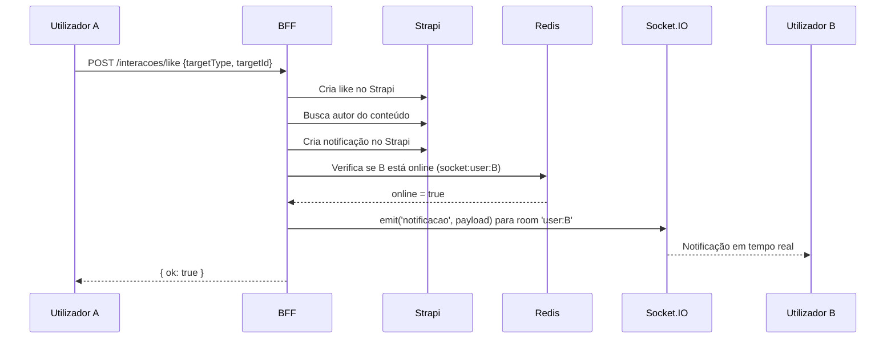
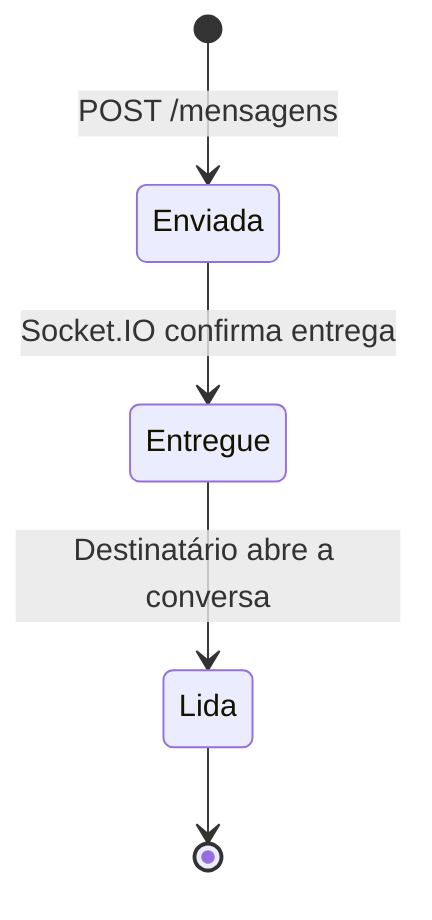
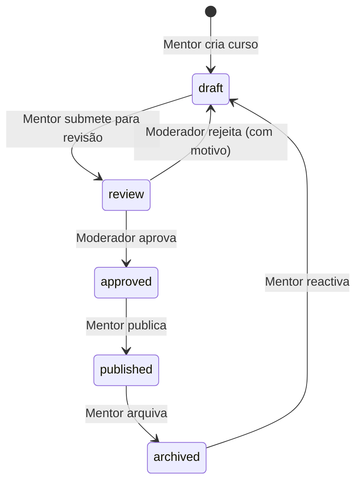
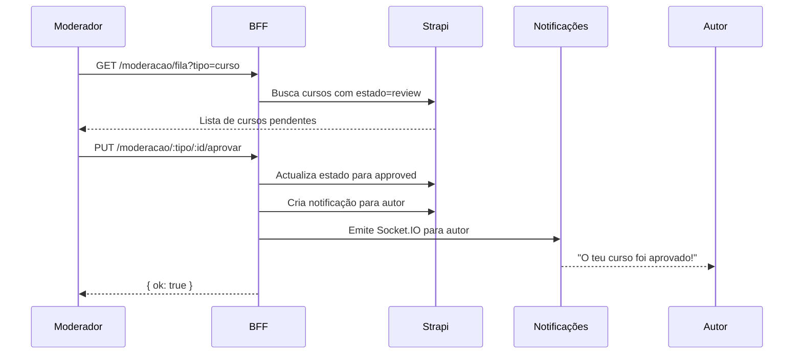

# PDC v2 — Plano Mestre de Execução: Ondas 1 a 4

## Visão Geral

Este plano consolida **tudo o que falta implementar no PDC v2**, organizado em 4 ondas de entrega por impacto no produto. É a fonte de verdade para os próximos sprints.

**Referências base:**

- spec:5f1dd624-24b6-4beb-bdc2-9f8eaa32a3e5/83bb2912-fa87-4545-8807-93b366d19797 — Spec Mestra de Produto
- file:.planning/c67e1ed4-6098-471c-937d-481a110375fc-PDC_—_Mapa_Completo_de_Páginas_e_Fluxos_por_Role.md
- file:.planning/ae07e114-7c3a-4ed1-8c59-55eec60b752f-PDC_—_Features_Transversais__Interações,_Avaliações,_Telemetria_e_Moderação.md
- file:.planning/15428b59-2e22-44bd-bacb-dc83e9d61a17-PDC_—_Algoritmo_de_Ranking_e_Feed.md
- file:.planning/36c60fa0-6874-4517-9be9-df9b093e4924-PDC_—_Modelo_de_Dados_Completo_`(Strapi_v2).md`

## Estado actual do v2

| Zona | Implementado | Em falta |
| --- | --- | --- |
| Pública | `/`, `/login`, `/register`, `/forgot-password`, `/experiencias`, `/experiencias/:id` | ~20 rotas públicas |
| Estudante | Dashboard, simulações, cursos, perfil, conquistas, projectos, mentorias | Notas, certificados, ranking, calendário, guardados, grupos, perfil vocacional público |
| Moderador | Denúncias (list + detail) | Fila de aprovação de conteúdo, gestão de utilizadores |
| Admin | Utilizadores, stats, audit, LTI | ~12 páginas admin |
| Partilhadas | — | Feed, mensagens, notificações, busca, vínculos, perfil público |
| Mentor | — | Todas as ~15 páginas |
| Instituição | — | Todas as ~12 páginas |
| Comité Científico | — | Todas as páginas |

**Total implementado: ~25 rotas. Total em falta: ~65 rotas.**

## Onda 1 — Diferencial do Produto (Semana 1-2)

### 1.1 Micro Desafio Vocacional — Versão Completa

O componente `MicroDesafio.tsx` existe mas está simplificado. O v1 tinha uma versão muito mais rica que é o coração do produto.

**O que falta:**

| Feature | Descrição |
| --- | --- |
| **Detecção adaptativa de área** | Campo de texto livre "O que sonhas fazer?" — detecta área por palavras-chave antes de mostrar perguntas |
| **10 áreas com perguntas específicas** | Não 3 perguntas genéricas — cada área tem o seu conjunto de perguntas práticas |
| **Live Pulse** | Feed em tempo real de actividade de outros utilizadores por área (Socket.IO) |
| **Carrossel de instituições** | Instituições parceiras com score de localidade e área |
| **Veredito com arquétipo** | Score + arquétipo + próximo passo + recomendação de 3 simulações |
| **Telemetria completa** | `landing_hero_started`, `landing_hero_area_detected`, `landing_hero_verdict_generated` |

**Fluxo completo:**

```mermaid
flowchart TD
    A[Utilizador vê a landing] --> B[Campo: O que sonhas fazer?]
    B --> C{Detecção de área por palavras-chave}
    C -->|Área detectada| D[Mostra 5 perguntas específicas da área]
    C -->|Área não detectada| E[Mostra 3 perguntas genéricas]
    D --> F[Utilizador responde]
    E --> F
    F --> G[POST /tina/chat com contexto]
    G --> H[Veredito: score + arquétipo + próximo passo]
    H --> I[Mostra 3 simulações recomendadas]
    I --> J{CTA}
    J -->|Criar conta| K[/criar-conta/estudante]
    J -->|Explorar| L[/explorar]
```

**Wireframe — Micro Desafio Completo:**

```wireframe

<html>
<head>
<style>
* { margin: 0; padding: 0; box-sizing: border-box; font-family: sans-serif; }
body { background: #0a0a0a; color: #f5f5f5; display: flex; justify-content: center; align-items: center; min-height: 100vh; padding: 24px; }
.challenge { background: #141414; border: 1px solid rgba(245,158,11,0.3); border-radius: 20px; padding: 32px; max-width: 600px; width: 100%; }
.label { font-size: 11px; color: #f59e0b; text-transform: uppercase; letter-spacing: 1.5px; margin-bottom: 16px; display: flex; align-items: center; gap: 8px; }
.label-dot { width: 6px; height: 6px; background: #22c55e; border-radius: 50%; animation: pulse 2s infinite; }
@keyframes pulse { 0%,100%{opacity:1} 50%{opacity:0.3} }
.dream-input { width: 100%; background: rgba(255,255,255,0.04); border: 1px solid rgba(255,255,255,0.1); border-radius: 12px; padding: 16px; color: #f5f5f5; font-size: 15px; resize: none; height: 80px; margin-bottom: 8px; }
.area-detected { background: rgba(245,158,11,0.1); border: 1px solid rgba(245,158,11,0.3); border-radius: 8px; padding: 10px 14px; font-size: 13px; color: #f59e0b; margin-bottom: 20px; display: flex; align-items: center; gap: 8px; }
.progress { display: flex; gap: 6px; margin-bottom: 20px; }
.dot { height: 4px; flex: 1; border-radius: 2px; background: rgba(255,255,255,0.1); }
.dot.active { background: #f59e0b; }
.dot.done { background: rgba(245,158,11,0.4); }
.question { font-size: 17px; font-weight: 600; margin-bottom: 16px; line-height: 1.4; }
.options { display: flex; flex-direction: column; gap: 10px; margin-bottom: 24px; }
.option { padding: 14px 16px; border: 1px solid rgba(255,255,255,0.08); border-radius: 10px; cursor: pointer; font-size: 14px; color: #a3a3a3; display: flex; align-items: center; gap: 12px; }
.option:hover { border-color: #f59e0b; color: #f5f5f5; background: rgba(245,158,11,0.05); }
.option.selected { border-color: #f59e0b; color: #f5f5f5; background: rgba(245,158,11,0.1); }
.option-icon { font-size: 20px; }
.live-pulse { background: rgba(255,255,255,0.03); border-radius: 10px; padding: 12px 16px; margin-bottom: 20px; font-size: 12px; color: #525252; display: flex; align-items: center; gap: 8px; }
.verdict { background: rgba(245,158,11,0.08); border: 1px solid rgba(245,158,11,0.2); border-radius: 14px; padding: 24px; }
.verdict-area { font-size: 13px; color: #f59e0b; margin-bottom: 8px; }
.verdict-score { font-size: 36px; font-weight: 800; margin-bottom: 4px; }
.verdict-archetype { font-size: 14px; color: #a3a3a3; margin-bottom: 16px; }
.verdict-sims { display: flex; flex-direction: column; gap: 8px; margin-bottom: 20px; }
.sim-card { background: rgba(255,255,255,0.04); border-radius: 8px; padding: 10px 14px; font-size: 13px; display: flex; justify-content: space-between; align-items: center; }
.sim-cta { font-size: 11px; color: #f59e0b; }
.cta-row { display: flex; gap: 10px; }
.cta-primary { flex: 1; background: #f59e0b; color: #0a0a0a; border: none; border-radius: 10px; padding: 14px; font-size: 14px; font-weight: 700; cursor: pointer; }
.cta-secondary { background: transparent; color: #a3a3a3; border: 1px solid rgba(255,255,255,0.1); border-radius: 10px; padding: 14px 20px; font-size: 14px; cursor: pointer; }
</style>
</head>
<body>
<div class="challenge">
  <div class="label"><div class="label-dot"></div> ✨ Desafio Vocacional · 847 a fazer agora</div>
  <div class="area-detected">🎯 Área detectada: <strong>Tecnologia & Engenharia</strong> — perguntas adaptadas</div>
  <div class="progress">
    <div class="dot done"></div><div class="dot done"></div><div class="dot active"></div><div class="dot"></div><div class="dot"></div>
  </div>
  <div class="question">Num projecto de software, qual é o teu papel natural?</div>
  <div class="options">
    <div class="option selected" data-element-id="opt-1"><span class="option-icon">🏗️</span> Arquitecto — defino a estrutura e as decisões técnicas</div>
    <div class="option" data-element-id="opt-2"><span class="option-icon">🎨</span> Designer — foco na experiência do utilizador</div>
    <div class="option" data-element-id="opt-3"><span class="option-icon">🔧</span> Implementador — gosto de construir e resolver bugs</div>
    <div class="option" data-element-id="opt-4"><span class="option-icon">📊</span> Analista — defino requisitos e métricas de sucesso</div>
  </div>
  <div class="live-pulse">🟢 <strong>23 pessoas</strong> na área de Tecnologia estão a fazer o desafio agora</div>
  <div class="verdict">
    <div class="verdict-area">O teu veredito vocacional</div>
    <div class="verdict-score">89% Engenharia de Software</div>
    <div class="verdict-archetype">Arquétipo: Arquitecto Sistémico · Próximo passo: Explorar Engenharia Informática</div>
    <div class="verdict-sims">
      <div class="sim-card">🔬 Diagnóstico de Sistemas — Tipo 1 <span class="sim-cta">Experimentar →</span></div>
      <div class="sim-card">💻 Resolução de Problemas Técnicos — Tipo 2 <span class="sim-cta">Experimentar →</span></div>
      <div class="sim-card">🏛️ Por Dentro da Engenharia — UCAN <span class="sim-cta">Ver →</span></div>
    </div>
    <div class="cta-row">
      <button class="cta-primary" data-element-id="cta-register">Criar conta e ver relatório completo →</button>
      <button class="cta-secondary" data-element-id="cta-explore">Explorar</button>
    </div>
  </div>
</div>
</body>
</html>
```

**Ficheiros a actualizar:**

- `apps/web/src/features/landing/useMicroDesafio.ts` — adicionar detecção de área, 10 conjuntos de perguntas, live pulse via Socket.IO
- `apps/web/src/features/landing/MicroDesafio.tsx` — campo de texto livre, carrossel de instituições, veredito com simulações recomendadas
- `apps/web/src/pages/LandingPage.tsx` — carrossel de instituições, feed de actividade em tempo real

### 1.2 Catálogos Públicos e Registo por Tipo

**Rotas a criar:**

| Rota | Componente | Dados |
| --- | --- | --- |
| `/explorar` | `ExplorarPage` | Tabs: Tudo / Experiências / Cursos / Simulações / Mentores / Instituições |
| `/cursos` | `CursosCatalogo` | Grid com filtros (área, nível, idioma, preço) |
| `/cursos/:slug` | `CursoPublicoDetail` | Preview de módulos, mentor, avaliações, CTA inscrição |
| `/simulacoes` | `SimulacoesCatalogo` | Grid com filtros (área, tipo, nível) |
| `/simulacoes/:slug` | `SimulacaoPublicoDetail` | Descrição, critérios, CTA executar |
| `/mentores` | `MentoresCatalogo` | Grid com filtros (área, disponibilidade) |
| `/mentores/:id` | `MentorPublicoPerfil` | Bio, cursos, avaliações, botão conectar |
| `/instituicoes` | `InstituicoesCatalogo` | Grid com filtros (tipo, região) |
| `/instituicoes/:slug` | `InstituicaoPublicoPerfil` | Sobre, experiências, programas, mentores |
| `/perfil/:id` | `PerfilPublico` | Perfil de qualquer utilizador |
| `/criar-conta` | `EscolhaTipoConta` | 3 cards: Estudante / Mentor / Instituição |
| `/criar-conta/estudante` | `RegistoEstudante` | Nome, email, password, área, nível |
| `/criar-conta/mentor` | `RegistoMentor` | Nome, email, password, área, upload docs |
| `/criar-conta/instituicao` | `RegistoInstituicao` | Nome, email, password, região, upload docs |

**Wireframe — Página ****`/criar-conta`****:**

```wireframe

<html>
<head>
<style>
* { margin: 0; padding: 0; box-sizing: border-box; font-family: sans-serif; }
body { background: #0a0a0a; color: #f5f5f5; display: flex; justify-content: center; align-items: center; min-height: 100vh; padding: 24px; }
.container { max-width: 680px; width: 100%; text-align: center; }
.logo { font-size: 13px; color: #f59e0b; font-weight: 700; letter-spacing: 2px; margin-bottom: 40px; }
h1 { font-size: 28px; font-weight: 800; margin-bottom: 8px; }
p { font-size: 15px; color: #a3a3a3; margin-bottom: 40px; }
.cards { display: grid; grid-template-columns: repeat(3, 1fr); gap: 16px; margin-bottom: 24px; }
.card { background: #141414; border: 2px solid rgba(255,255,255,0.06); border-radius: 16px; padding: 28px 20px; cursor: pointer; transition: all 0.2s; text-align: left; }
.card:hover { border-color: rgba(245,158,11,0.4); background: rgba(245,158,11,0.04); }
.card.selected { border-color: #f59e0b; background: rgba(245,158,11,0.08); }
.card-icon { font-size: 32px; margin-bottom: 16px; }
.card-title { font-size: 16px; font-weight: 700; margin-bottom: 8px; }
.card-desc { font-size: 13px; color: #525252; line-height: 1.5; margin-bottom: 16px; }
.card-features { list-style: none; }
.card-features li { font-size: 12px; color: #a3a3a3; padding: 3px 0; display: flex; align-items: center; gap: 6px; }
.card-features li::before { content: "✓"; color: #f59e0b; font-weight: 700; }
.cta { background: #f59e0b; color: #0a0a0a; border: none; border-radius: 12px; padding: 16px 40px; font-size: 15px; font-weight: 700; cursor: pointer; }
.login-link { margin-top: 20px; font-size: 13px; color: #525252; }
.login-link a { color: #f59e0b; }
</style>
</head>
<body>
<div class="container">
  <div class="logo">PDC</div>
  <h1>Como queres usar o PDC?</h1>
  <p>Escolhe o teu perfil para personalizar a experiência</p>
  <div class="cards">
    <div class="card selected" data-element-id="card-student">
      <div class="card-icon">🎓</div>
      <div class="card-title">Estudante</div>
      <div class="card-desc">Descobre a tua vocação e explora carreiras</div>
      <ul class="card-features">
        <li>Simulações vocacionais</li>
        <li>Perfil vocacional IA</li>
        <li>Mentorias personalizadas</li>
        <li>Cursos e certificados</li>
      </ul>
    </div>
    <div class="card" data-element-id="card-mentor">
      <div class="card-icon">👨‍🏫</div>
      <div class="card-title">Mentor</div>
      <div class="card-desc">Orienta estudantes e partilha o teu conhecimento</div>
      <ul class="card-features">
        <li>Criar cursos e simulações</li>
        <li>Gerir mentorados</li>
        <li>Analytics de impacto</li>
        <li>Reputação profissional</li>
      </ul>
    </div>
    <div class="card" data-element-id="card-institution">
      <div class="card-icon">🏛️</div>
      <div class="card-title">Instituição</div>
      <div class="card-desc">Apresenta o teu curso e atrai os melhores estudantes</div>
      <ul class="card-features">
        <li>Página institucional</li>
        <li>Publicar experiências</li>
        <li>Propostas a estudantes</li>
        <li>Relatórios de evasão</li>
      </ul>
    </div>
  </div>
  <button class="cta" data-element-id="cta-continue">Continuar como Estudante →</button>
  <div class="login-link">Já tens conta? <a href="#" data-element-id="login-link">Entrar</a></div>
</div>
</body>
</html>
```

## Onda 2 — Zona Estudante Completa (Semana 3-4)

### 2.1 Páginas de Aprendizagem

| Rota | Componente | Prioridade |
| --- | --- | --- |
| `/estudante/meus-cursos` | `MeusCursosPage` | 🔴 |
| `/estudante/notas` | `MinhasNotasPage` | 🟠 |
| `/estudante/certificados` | `CertificadosPage` | 🟠 |
| `/estudante/ranking` | `RankingPage` | 🟡 |
| `/estudante/calendario` | `CalendarioPage` | 🟡 |
| `/estudante/guardados` | `GuardadosPage` | 🟠 |
| `/perfil/vocacional` | `PerfilVocacionalPublico` | 🔴 |

### 2.2 Editar Perfil por Tipo

Cada role tem campos diferentes. Não é um formulário genérico.

| Rota | Campos específicos |
| --- | --- |
| `/editar-perfil/aluno` | Nome, foto, bio, área de interesse, nível de ensino, região |
| `/editar-perfil/mentor` | Nome, foto, bio, área de especialidade, headline, documentos de validação |
| `/editar-perfil/instituicao` | Nome, logo, capa, descrição, tipo, região, website, contactos |

**Regra crítica para upload de foto:** A foto de perfil, após upload para R2, deve:

1. Actualizar o campo `foto` no Strapi via `strapiPut`
2. Emitir evento Socket.IO `pro`file:photo_updated com `{ perfilId, newUrl }`
3. O frontend invalida `queryClient.invalidateQueries(['perfil', perfilId])` globalmente
4. Todos os componentes que usam `Avatar` com esse `perfilId` actualizam automaticamente via React Query

### 2.3 Definições de Conta

| Rota | Secções |
| --- | --- |
| `/definicoes` | Email, password, notificações (por categoria), privacidade, eliminar conta |

### 2.4 Discussões em Cursos (portado do v1)

| Rota | Descrição |
| --- | --- |
| `/curso/:id/discussoes` | Fórum do curso — threads por módulo, ordenados por actividade |
| `/curso/:id/discussoes/:threadId` | Thread individual com respostas |

**Modelo de dados:** Usa o content-type `comentario` polimórfico com `targetType: 'modulo'` e `targetId: moduloId`.

## Onda 3 — Features Transversais (Semana 5-6)

Esta onda é a mais complexa porque as features existem em múltiplas páginas simultaneamente.

### 3.1 Motor de Notificações — Tabela Completa de Triggers

Esta é a lógica que estava em falta. Para cada acção, define-se exactamente quem recebe, por que canal, e com que agrupamento.

| Acção | Receptor | Canal | Agrupamento |
| --- | --- | --- | --- |
| Alguém deu like no teu conteúdo | Autor do conteúdo | In-app | Sim — "X pessoas curtiram" (semanal) |
| Alguém comentou no teu conteúdo | Autor do conteúdo | In-app + email | Não — imediato |
| Alguém partilhou o teu conteúdo | Autor do conteúdo | In-app | Sim — resumo diário |
| Pedido de vínculo recebido | Destinatário | In-app + email | Não — imediato |
| Pedido de vínculo aceite | Solicitante | In-app | Não — imediato |
| Pedido de vínculo rejeitado | Solicitante | In-app | Não — imediato |
| Proposta institucional recebida | Estudante | In-app + email | Não — imediato |
| Conteúdo aprovado pelo moderador | Autor | In-app + email | Não — imediato |
| Conteúdo rejeitado pelo moderador | Autor | In-app + email | Não — imediato (com motivo) |
| Conquista aprovada | Autor | In-app | Não — imediato |
| Denúncia resolvida | Denunciante | In-app | Não — imediato |
| Nova discussão no curso | Todos os inscritos | In-app | Sim — máx. 1 por dia por curso |
| Mentor corrigiu tarefa | Aluno | In-app + email | Não — imediato |
| Novo aluno inscrito no curso | Mentor/Instituição | In-app | Sim — resumo diário |
| Anúncio do sistema | Todos os utilizadores | In-app | Não |

**Implementação:** O BFF tem um `notification.service.ts` que é chamado após cada acção relevante. Nunca é o Strapi a gerar notificações — é sempre o BFF.



### 3.2 Feed Global — Implementação do Algoritmo

O algoritmo está documentado em file:.planning/15428b59. A implementação no BFF:

**Endpoint:** `GET /feed?tipo=geral|vocacional|institucional|trending&page=1&area=tecnologia`

**Pipeline no BFF:**

1. **Geração de candidatos** — busca ~500 itens do Strapi por fonte (in-network, área, trending, novo)
2. **Hidratação** — para cada candidato, busca scores do Redis (entity_score, author_reputation)
3. **Scoring** — aplica fórmula com pesos por tipo de feed
4. **Filtragem** — remove conteúdo já visto, do próprio utilizador, de perfis bloqueados
5. **Mixing** — injeta sugestões de mentores (posição 5), conquistas (posição 15), programas (posição 25)
6. **Cache** — guarda resultado no Redis com TTL 15min por utilizador

**Rotas a criar:**

| Rota | Componente |
| --- | --- |
| `/feed` | `FeedPage` com tabs: Para Ti / Explorar / Minha Instituição / Em Alta |
| `/feed/:type/:id` | `FeedItemDetail` — post ou conquista com comentários |
| `/postar` | `CriarPostPage` — formulário de publicação |

### 3.3 Interações Transversais — ActionBar

O componente `ActionBar` aparece em todos os cards e páginas de detalhe. É o motor de engagement.

**Componente:** `apps/web/src/components/ui/ActionBar.tsx`

**Props:**

```ts
interface ActionBarProps {
  targetType: 'curso' | 'simulacao' | 'experiencia' | 'projeto' | 'post' | 'conquista'
  targetId: string
  counts: { likes: number, comentarios: number, bookmarks: number }
  userState: { liked: boolean, bookmarked: boolean }
  showReport?: boolean
  showRating?: boolean
}
```

**BFF — rotas a criar:**

| Método | Rota | Descrição |
| --- | --- | --- |
| POST | `/interacoes/like` | Toggle like |
| POST | `/interacoes/bookmark` | Toggle bookmark |
| GET | `/interacoes/counts/:tipo/:id` | Contadores de interações |
| GET | `/interacoes/user-state/:tipo/:id` | Estado do utilizador (liked, bookmarked) |
| POST | `/interacoes/rating` | Avaliar conteúdo (só após consumir) |
| GET | `/interacoes/share/:tipo/:id` | Gerar link partilhável |
| POST | `/comentarios` | Criar comentário |
| GET | `/comentarios?targetType=X&targetId=Y` | Listar comentários |
| DELETE | `/comentarios/:id` | Remover comentário (autor ou moderador) |

### 3.4 Vínculos (Conexões)

| Rota | Componente |
| --- | --- |
| `/vinculo` | `VinculosPage` — pedidos recebidos/enviados, conexões activas |

**BFF — rotas a criar:**

| Método | Rota | Descrição |
| --- | --- | --- |
| POST | `/vinculos` | Pedir vínculo |
| GET | `/vinculos?perfilId=X` | Listar vínculos de um perfil |
| GET | `/vinculos/pendentes` | Pedidos pendentes recebidos |
| PATCH | `/vinculos/:id` | Aceitar ou rejeitar |
| DELETE | `/vinculos/:id` | Remover vínculo |
| GET | `/vinculos/status?targetId=Y` | Estado do vínculo com outro perfil |

**Regras de negócio críticas:**

- Máximo 5 mentores activos por estudante
- Vínculo rejeitado pode ser re-pedido após 30 dias
- Proposta institucional é um vínculo iniciado pela instituição

### 3.5 Busca Global, Mensagens e Páginas Legais

| Rota | Componente |
| --- | --- |
| `/busca` | `BuscaPage` — resultados agrupados por tipo com ranking de pesquisa |
| `/mensagens` | `MensagensPage` — inbox com conversas em tempo real |
| `/mensagens/:conversaId` | `ConversaPage` — chat com estados de entrega |
| `/notificacoes` | `NotificacoesPage` — centro de notificações com filtros |
| `/guardados` | `GuardadosPage` — conteúdo guardado por categoria |
| `/termos` | `TermosPage` — Termos de Uso |
| `/privacidade` | `PrivacidadePage` — Política de Privacidade |
| `/403` | `SemPermissaoPage` |
| `/conta-inativa` | `ContaInativaPage` |

**Mensagens — estados de entrega:**



## Onda 4 — Zonas de Criação e Gestão (Semana 7-9)

Esta onda é a mais delicada. As páginas de criação de conteúdo são tratadas com cuidado especial.

### 4.1 Formulários de Criação — Princípios Gerais

Todos os formulários de criação seguem estes princípios:

| Princípio | Implementação |
| --- | --- |
| **Auto-save** | Debounce de 2s — guarda rascunho no Strapi automaticamente |
| **Pré-visualização** | Botão "Pré-visualizar" mostra como ficará para o utilizador final |
| **Upload progressivo** | Upload de media com barra de progresso e cancelamento |
| **Validação em camadas** | Zod no cliente (feedback imediato) + Zod no BFF (segurança) |
| **Estado editorial visível** | Badge de estado (Rascunho / Em Revisão / Aprovado / Publicado) sempre visível |
| **Saída segura** | Aviso "Tens alterações não guardadas" ao tentar sair |

**Wireframe — Formulário de Criação de Curso:**

```wireframe

<html>
<head>
<style>
* { margin: 0; padding: 0; box-sizing: border-box; font-family: sans-serif; }
body { background: #0a0a0a; color: #f5f5f5; }
.header { background: #141414; border-bottom: 1px solid rgba(255,255,255,0.06); padding: 16px 24px; display: flex; align-items: center; gap: 16px; position: sticky; top: 0; z-index: 10; }
.back { color: #525252; font-size: 13px; cursor: pointer; }
.title { font-size: 15px; font-weight: 600; flex: 1; }
.status-badge { font-size: 11px; background: rgba(255,255,255,0.06); color: #a3a3a3; padding: 4px 10px; border-radius: 20px; }
.autosave { font-size: 11px; color: #525252; }
.btn-preview { background: transparent; border: 1px solid rgba(255,255,255,0.1); color: #a3a3a3; border-radius: 8px; padding: 8px 16px; font-size: 13px; cursor: pointer; }
.btn-submit { background: #f59e0b; color: #0a0a0a; border: none; border-radius: 8px; padding: 8px 20px; font-size: 13px; font-weight: 700; cursor: pointer; }
.layout { display: grid; grid-template-columns: 1fr 320px; gap: 0; min-height: calc(100vh - 57px); }
.main { padding: 32px; border-right: 1px solid rgba(255,255,255,0.06); }
.sidebar { padding: 24px; }
.section { margin-bottom: 32px; }
.section-title { font-size: 13px; font-weight: 600; color: #a3a3a3; text-transform: uppercase; letter-spacing: 1px; margin-bottom: 16px; }
.field { margin-bottom: 20px; }
.label { font-size: 13px; color: #a3a3a3; margin-bottom: 8px; display: block; }
.label span { color: #ef4444; }
.input { width: 100%; background: #1a1a1a; border: 1px solid rgba(255,255,255,0.08); border-radius: 10px; padding: 12px 16px; color: #f5f5f5; font-size: 14px; }
.textarea { width: 100%; background: #1a1a1a; border: 1px solid rgba(255,255,255,0.08); border-radius: 10px; padding: 12px 16px; color: #f5f5f5; font-size: 14px; resize: vertical; height: 100px; }
.select { width: 100%; background: #1a1a1a; border: 1px solid rgba(255,255,255,0.08); border-radius: 10px; padding: 12px 16px; color: #f5f5f5; font-size: 14px; }
.upload-zone { border: 2px dashed rgba(255,255,255,0.1); border-radius: 12px; padding: 32px; text-align: center; cursor: pointer; }
.upload-zone:hover { border-color: rgba(245,158,11,0.4); background: rgba(245,158,11,0.03); }
.upload-icon { font-size: 32px; margin-bottom: 8px; }
.upload-text { font-size: 13px; color: #525252; }
.modules-list { display: flex; flex-direction: column; gap: 8px; }
.module-item { background: #1a1a1a; border: 1px solid rgba(255,255,255,0.06); border-radius: 10px; padding: 14px 16px; display: flex; align-items: center; gap: 12px; }
.module-drag { color: #525252; cursor: grab; }
.module-name { flex: 1; font-size: 14px; }
.module-count { font-size: 12px; color: #525252; }
.btn-add-module { width: 100%; background: transparent; border: 1px dashed rgba(255,255,255,0.1); border-radius: 10px; padding: 12px; color: #525252; font-size: 13px; cursor: pointer; margin-top: 8px; }
.btn-add-module:hover { border-color: rgba(245,158,11,0.4); color: #f59e0b; }
.sidebar-card { background: #141414; border: 1px solid rgba(255,255,255,0.06); border-radius: 12px; padding: 16px; margin-bottom: 16px; }
.sidebar-card-title { font-size: 12px; font-weight: 600; color: #a3a3a3; text-transform: uppercase; letter-spacing: 1px; margin-bottom: 12px; }
.checklist { display: flex; flex-direction: column; gap: 8px; }
.check-item { display: flex; align-items: center; gap: 8px; font-size: 13px; }
.check-icon { font-size: 14px; }
.check-done { color: #22c55e; }
.check-pending { color: #525252; }
</style>
</head>
<body>
<div class="header">
  <span class="back" data-element-id="back-btn">← Meus Cursos</span>
  <span class="title">Introdução à Programação Web</span>
  <span class="status-badge">📝 Rascunho</span>
  <span class="autosave">Guardado há 2s</span>
  <button class="btn-preview" data-element-id="preview-btn">Pré-visualizar</button>
  <button class="btn-submit" data-element-id="submit-btn">Submeter para Revisão</button>
</div>
<div class="layout">
  <div class="main">
    <div class="section">
      <div class="section-title">Informações Básicas</div>
      <div class="field">
        <label class="label">Título do Curso <span>*</span></label>
        <input class="input" value="Introdução à Programação Web" data-element-id="title-input" />
      </div>
      <div class="field">
        <label class="label">Descrição</label>
        <textarea class="textarea" data-element-id="desc-input">Aprende HTML, CSS e JavaScript do zero...</textarea>
      </div>
      <div style="display:grid;grid-template-columns:1fr 1fr;gap:16px;">
        <div class="field">
          <label class="label">Área <span>*</span></label>
          <select class="select" data-element-id="area-select"><option>Tecnologia</option></select>
        </div>
        <div class="field">
          <label class="label">Nível <span>*</span></label>
          <select class="select" data-element-id="level-select"><option>Básico</option></select>
        </div>
      </div>
    </div>
    <div class="section">
      <div class="section-title">Thumbnail</div>
      <div class="upload-zone" data-element-id="thumbnail-upload">
        <div class="upload-icon">🖼️</div>
        <div class="upload-text">Arrasta uma imagem ou clica para seleccionar<br><small>JPG, PNG, WebP · Máx. 2MB · 1280×720px recomendado</small></div>
      </div>
    </div>
    <div class="section">
      <div class="section-title">Módulos</div>
      <div class="modules-list">
        <div class="module-item"><span class="module-drag">⠿</span><span class="module-name">1. Introdução ao HTML</span><span class="module-count">4 itens</span></div>
        <div class="module-item"><span class="module-drag">⠿</span><span class="module-name">2. CSS Básico</span><span class="module-count">3 itens</span></div>
        <div class="module-item"><span class="module-drag">⠿</span><span class="module-name">3. JavaScript Fundamentos</span><span class="module-count">6 itens</span></div>
      </div>
      <button class="btn-add-module" data-element-id="add-module-btn">+ Adicionar Módulo</button>
    </div>
  </div>
  <div class="sidebar">
    <div class="sidebar-card">
      <div class="sidebar-card-title">Checklist de Publicação</div>
      <div class="checklist">
        <div class="check-item"><span class="check-icon check-done">✅</span> Título preenchido</div>
        <div class="check-item"><span class="check-icon check-done">✅</span> Descrição preenchida</div>
        <div class="check-item"><span class="check-icon check-done">✅</span> Área e nível definidos</div>
        <div class="check-item"><span class="check-icon check-pending">⬜</span> Thumbnail adicionada</div>
        <div class="check-item"><span class="check-icon check-done">✅</span> Mínimo 1 módulo</div>
        <div class="check-item"><span class="check-icon check-pending">⬜</span> Objectivos definidos</div>
      </div>
    </div>
    <div class="sidebar-card">
      <div class="sidebar-card-title">Visibilidade</div>
      <select class="select" data-element-id="visibility-select"><option>Público</option><option>Privado</option><option>Institucional</option></select>
    </div>
    <div class="sidebar-card">
      <div class="sidebar-card-title">Preço</div>
      <select class="select" data-element-id="price-type-select"><option>Gratuito</option><option>Pago</option></select>
    </div>
  </div>
</div>
</body>
</html>
```

### 4.2 Zona Mentor — Páginas de Gestão

| Rota | Componente | Descrição |
| --- | --- | --- |
| `/mentor` | `MentorDashboard` | KPIs: alunos, cursos, receita, alertas de risco |
| `/mentor/cursos` | `MentorCursosPage` | Lista com estado editorial e métricas |
| `/mentor/cursos/criar` | `CriarCursoPage` | Formulário completo (ver wireframe acima) |
| `/mentor/cursos/:id/editar` | `EditarCursoPage` | Edição com módulos e itens |
| `/mentor/cursos/:id/modulos/:moduloId` | `EditarModuloPage` | Gestão de itens do módulo |
| `/mentor/simulacoes` | `MentorSimulacoesPage` | Simulações criadas |
| `/mentor/simulacoes/criar` | `CriarSimulacaoPage` | Formulário de simulação |
| `/mentor/upload` | `UploadConteudoPage` | Upload de vídeos e PDFs para R2 |
| `/mentor/alunos/inscritos` | `AlunosInscritosPage` | Alunos com progresso por curso |
| `/mentor/mentorados` | `MentoradosPage` | Mentorados com alertas de risco de evasão |
| `/mentor/analytics` | `MentorAnalyticsPage` | Conclusão, notas, evasão por curso |
| `/mentor/reputacao` | `MentorReputacaoPage` | Avaliações recebidas |

**Lógica de publicação de curso:**



### 4.3 Zona Instituição — Páginas de Gestão

| Rota | Componente | Descrição |
| --- | --- | --- |
| `/instituicao` | `InstituicaoDashboard` | KPIs: alunos, evasão, engajamento |
| `/instituicao/criar-experiencia` | `CriarExperienciaPage` | Formulário de experiência |
| `/instituicao/criar-programa` | `CriarProgramaPage` | Formulário de programa (inclui ShadowApro e EduVisit) |
| `/instituicao/programas` | `InstituicaoProgramasPage` | Programas e experiências com estado |
| `/instituicao/estudantes-vinculados` | `EstudantesVinculadosPage` | Estudantes com proposta directa |
| `/instituicao/propostas` | `PropostasPage` | Propostas enviadas e recebidas |
| `/instituicao/relatorios` | `RelatoriosPage` | Dashboard de métricas de evasão |
| `/instituicao/branding` | `BrandingPage` | Logo, cores, textos da página pública |

**ShadowApro e EduVisit — tipos especiais de Programa:**

| Tipo | Lógica específica |
| --- | --- |
| **ShadowApro** | Matching estudante ↔ profissional por área. Agendamento de dia de shadowing. Feedback pós-experiência. Telemetria `shadowapro.completed`. |
| **EduVisit** | Inscrição com confirmação pela instituição. Visita virtual (iframe) ou presencial. Relatório pós-visita. Telemetria `eduvisit.completed`. |

Ambos são criados via `/instituicao/criar-programa` com um selector de tipo que muda os campos do formulário.

### 4.4 Zona Moderador — Fila de Aprovação

O v2 tem denúncias mas não tem a fila de aprovação de conteúdo — que é a função principal do moderador.

| Rota | Componente | Descrição |
| --- | --- | --- |
| `/moderador` | `ModeradorDashboard` | Fila de aprovação + denúncias pendentes |
| `/moderador/aprovacoes` | `FilaAprovacaoPage` | Tabs: Cursos / Experiências / Simulações / Conquistas |
| `/moderador/aprovacoes/:tipo/:id` | `DetalheAprovacaoPage` | Detalhe com botões Aprovar / Rejeitar + campo de motivo |

**Fluxo de aprovação:**



### 4.5 Zona Comité Científico

| Rota | Componente | Descrição |
| --- | --- | --- |
| `/comite-cientifico` | `ComiteDashboard` | Simulações e conquistas pendentes de validação |
| `/comite-cientifico/validacao` | `ValidacaoCientificaPage` | Lista com filtros, marcar como validado com comentário |

### 4.6 Zona Admin — Páginas em Falta

| Rota | Componente | Descrição |
| --- | --- | --- |
| `/admin/estatisticas` | `AdminEstatisticasPage` | Gráficos de crescimento, retenção, uso por área |
| `/admin/telemetria` | `AdminTelemetriaPage` | Eventos comportamentais, funis, drop-offs |
| `/admin/presence` | `AdminPresencaPage` | Utilizadores activos em tempo real |
| `/admin/instituicoes-pendentes` | `InstituicoesPendentesPage` | Fila de aprovação de novas instituições |
| `/admin/mentores-pendentes` | `MentoresPendentesPage` | Fila de aprovação de novos mentores |
| `/admin/funcionalidades` | `FeatureFlagsPage` | Activar/desactivar features por role |

## Strapi — Novos Content-Types a Criar

Antes de implementar as Ondas 3 e 4, o Strapi precisa de novos content-types. Referência: file:.planning/36c60fa0-6874-4517-9be9-df9b093e4924-PDC_—_Modelo_de_Dados_Completo_`(Strapi_v2).md`

| Content-Type | Prioridade | Onda |
| --- | --- | --- |
| `like` | 🔴 | Onda 3 |
| `bookmark` | 🔴 | Onda 3 |
| `comentario` (polimórfico) | 🔴 | Onda 3 |
| `avaliacao` | 🟠 | Onda 3 |
| `partilha` | 🟡 | Onda 3 |
| `voto-projeto` | 🟠 | Onda 3 |
| `subscricao` | 🟡 | Onda 4 |
| `entity_score` (cache de scores) | 🔴 | Onda 3 |

## Divisão de trabalho — Gemini CLI vs Copilot

| Bloco | Agente recomendado | Motivo |
| --- | --- | --- |
| BFF — rotas de interações, feed, vínculos | **Gemini CLI** | Ficheiros longos, lógica de negócio, imports `.js` |
| BFF — motor de notificações | **Gemini CLI** | Lógica complexa com múltiplos triggers |
| Frontend — catálogos públicos, registo por tipo | **Copilot (Claude Opus 4.6)** | Componentes React ricos com filtros e paginação |
| Frontend — formulários de criação (curso, experiência, programa) | **Copilot (Claude Opus 4.6)** | UX complexa com auto-save, upload, pré-visualização |
| Frontend — feed com algoritmo | **Copilot (Claude Opus 4.6)** | Componentes de feed com ActionBar integrada |
| Frontend — zonas mentor e instituição | **Copilot (Claude Opus 4.6)** | Muitas páginas com padrão consistente |
| Strapi — novos content-types | **Gemini CLI** | Ficheiros JSON de schema |
| Micro Desafio completo | **Copilot (Claude Opus 4.6)** | Componente visual rico com animações |

## Estimativa de Entrega

| Onda | Semanas | Agentes |
| --- | --- | --- |
| Onda 1 — Diferencial do produto | 1-2 | Gemini CLI + Copilot em paralelo |
| Onda 2 — Zona estudante completa | 3-4 | Gemini CLI + Copilot em paralelo |
| Onda 3 — Features transversais | 5-6 | Gemini CLI + Copilot em paralelo |
| Onda 4 — Zonas de criação e gestão | 7-9 | Gemini CLI + Copilot em paralelo |

**Total: ~9 semanas com 2 agentes em paralelo.**