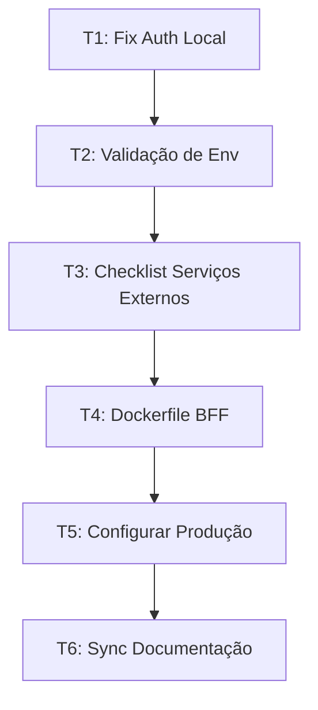

# Abordagem Técnica — Auth Fix + Produção + Docs

# Abordagem Técnica — PDC v2

<user_quoted_section>Decisões técnicas, estado-alvo, invariantes e estratégia de verificação para os 3 blocos de trabalho.</user_quoted_section>

## 1. Decisões-Chave

### D1: API Token — Full Access (agora), Custom (futuro)

**Decisão:** Regenerar o token no Strapi admin como **Full Access** e substituir no file:apps/api/.env.

**Racional:** O BFF acede a 20+ collections. Configurar permissões granulares para cada uma é trabalho desnecessário nesta fase. Com equipa pequena e acesso restrito ao painel Strapi, o risco de token comprometido é baixo.

**Trade-off:** Menos seguro (token acede a tudo) mas zero risco de 403 em módulos esquecidos. Migrar para Custom quando houver multi-tenancy ou equipa maior.

**Impacto:** Apenas configuração — zero código. O `STRAPI_API_TOKEN` já é lido correctamente em `auth.service.ts` e `strapi.client.ts`.

### D2: Registo de utilizadores — Seed script + Frontend (nunca via Strapi admin)

**Decisão:** Usar o seed script existente (file:tests/helpers/seed.ts) para criar contas de teste, e o frontend (`/criar-conta`) para o fluxo real. Documentar que registar directamente via Strapi admin **não cria perfil** e resulta em dados incompletos.

**Racional:** A documentação original (file:docs/guia-tecnico/setup-local.md) já define este fluxo. O seed cria 5 contas (aluno, mentor, instituição, moderador, super_admin) com perfis completos via BFF.

**Trade-off:** Nenhum negativo — o seed já existe e é idempotente.

**Impacto:** Documentar o comando `npx tsx tests/helpers/seed.ts` no setup-local e garantir que funciona com o novo token.

### D3: Gestão de .env — Consolidar em `apps/api/.env.{environment}` como fonte de verdade

**Decisão:** Usar **Custom por ambiente** com validação:

1. file:apps/api/.env — desenvolvimento local (fonte de verdade para dev)
2. file:apps/api/.env.production — template de produção (fonte de verdade para prod)
3. file:apps/api/.env.staging — template de staging
4. **Eliminar** file:.env.production.example e file:.env.staging.example da raiz (inconsistentes com o código — usam `REDIS_URL` e `POSTMARK_TOKEN` que o código não lê)
5. **Criar** file:apps/web/.env para dev e file:apps/web/.env.production para prod
6. **Adicionar** validação de variáveis obrigatórias no arranque do BFF — falhar explicitamente em vez de silently usar defaults

**Racional:** Os templates da raiz contradizem o código (variáveis diferentes). O script `tsx watch --env-file=.env` lê de `apps/api/.env`. Ter uma única fonte de verdade por ambiente evita confusão.

**Trade-off:** Mais rigor no setup inicial, mas elimina bugs silenciosos por variáveis em falta.

**Impacto:**

- Eliminar 2 ficheiros (file:.env.production.example, file:.env.staging.example)
- Corrigir file:apps/api/.env (OAUTH_REDIRECT_BASE_URL: `3000` → `5173`)
- Criar file:apps/web/.env e file:apps/web/.env.production
- Adicionar validação de env obrigatórias no arranque (file:apps/api/src/index.ts ou novo `config.ts`)

### D4: Validação de env no arranque — Fail fast

**Decisão:** Criar um módulo file:apps/api/src/lib/env.ts que valida variáveis obrigatórias com Zod no arranque do BFF. Em produção, falhar se JWT_SECRET, STRAPI_API_TOKEN, UPSTASH_REDIS_REST_URL estiverem ausentes.

**Racional:** Hoje o sistema falha silenciosamente — `redis.ts` já faz isto para Redis em produção, mas `auth.service.ts` usa um `console.warn` que é fácil de ignorar. Com validação centralizada, o BFF não arranca se faltar algo crítico.

**Trade-off:** Mais disciplina no setup. Um dev novo precisa de configurar tudo antes de correr o BFF pela primeira vez.

**Impacto:** 1 novo ficheiro (`env.ts`), importado no `index.ts`.

### D5: Dockerfile para BFF

**Decisão:** Criar file:apps/api/Dockerfile multi-stage (build + runtime) seguindo o mesmo padrão do file:infra/strapi/Dockerfile.

**Racional:** Sem Dockerfile, Railway usa nixpacks (auto-detection) que pode instalar dependências desnecessárias e produzir imagens maiores. Com Dockerfile explícito, há controlo total sobre o build.

**Impacto:** 1 novo ficheiro. Sem mudança de código.

### D6: Ordem de execução — Fix local primeiro, produção depois, docs por último

**Decisão:** Sequenciar o trabalho assim:



**Racional:**

- T1 desbloqueia tudo — sem auth, nada funciona
- T2 previne que o mesmo problema se repita (variáveis em falta)
- T3 é pré-requisito para T5 (precisa das contas criadas)
- T4 é pré-requisito para T5 (Railway precisa do Dockerfile)
- T5 configura tudo para produção
- T6 é o último porque depende de saber o estado final real

### D7: Cookie SameSite para OAuth — Diferido

**Decisão:** Não alterar file:apps/api/src/modules/auth/auth.helper.ts agora. O risco H1 (SameSite Strict + OAuth cross-domain) será resolvido quando configurarmos Google OAuth para produção (T5).

**Racional:** O OAuth não é bloqueante para o lançamento inicial. O login com email/password é o fluxo principal. Resolver quando tivermos Google Client ID/Secret configurados.

## 2. Estado-Alvo

### Após conclusão, o sistema terá:

| Propriedade | Estado actual | Estado-alvo |
| --- | --- | --- |
| Login email/password | ❌ 403 no getUserById | ✅ Funcional com token Full Access |
| Seed de contas de teste | ⚠️ Falha (token inválido) | ✅ 5 contas criadas com perfil completo |
| Variáveis de env dev | ⚠️ Placeholder + inconsistências | ✅ Valores reais, OAUTH_REDIRECT corrigido |
| Variáveis de env prod | ❌ Todas vazias | ✅ Template correcto + checklist documentado |
| Validação de env no arranque | ❌ Falha silenciosa | ✅ Fail fast com mensagem clara |
| Dockerfile BFF | ❌ Não existe | ✅ Multi-stage, pronto para Railway |
| Templates .env contraditórios | ⚠️ 2 templates na raiz com vars erradas | ✅ Eliminados, fonte de verdade em apps/ |
| `apps/web/.env` | ❌ Não existe | ✅ Criado com VITE_API_URL |
| STATE.md | ⚠️ 30+ discrepâncias | ✅ Sincronizado com código real |
| REQUIREMENTS.md | ⚠️ 6 requisitos com status errado | ✅ Corrigido |
| roadmap.md | ⚠️ 25+ tarefas outdated | ✅ Actualizado |

### Critério de "done"

1. `POST /auth/login` com credenciais válidas retorna `200` com user data (com `DEV_SKIP_OTP=true`)
2. `GET /auth/me` com cookie retorna perfil completo (nome, role, email)
3. `npx tsx tests/helpers/seed.ts` cria 5 contas sem erros
4. BFF em produção recusa arrancar sem `JWT_SECRET`, `STRAPI_API_TOKEN`, `UPSTASH_REDIS_REST_URL`
5. `docker build` no BFF Dockerfile produz imagem funcional
6. `tsc --noEmit` passa em todos os workspaces (zero erros)
7. STATE.md, REQUIREMENTS.md e roadmap.md reflectem o estado real verificado

## 3. Arquitectura de Componentes

### Novo módulo: `apps/api/src/lib/env.ts`

**Responsabilidade:** Validar e exportar variáveis de ambiente tipadas no arranque do BFF.

**Interface:**

```typescript
// Schema Zod com variáveis obrigatórias por ambiente
// Em dev: STRAPI_URL, STRAPI_API_TOKEN, JWT_SECRET (warn se Redis ausente)
// Em prod: + UPSTASH_REDIS_REST_URL, UPSTASH_REDIS_REST_TOKEN, FRONTEND_URL
```

**Relação com existentes:**

- Importado em file:apps/api/src/index.ts como primeira instrução (antes de qualquer middleware)
- Substitui os `process.env.X || 'default'` dispersos em `auth.service.ts`, `redis.ts`, `strapi.client.ts`
- Os módulos existentes passam a importar de `env.ts` em vez de ler `process.env` directamente

### Novo ficheiro: `apps/api/Dockerfile`

**Estrutura:** Multi-stage idêntica ao Strapi Dockerfile:

- Stage 1 (build): `npm ci` + `tsc`
- Stage 2 (runtime): `npm ci --omit=dev` + copiar `dist/`
- Base: `node:24-alpine` (alinhado com `.nvmrc`)

### Ficheiros eliminados

| Ficheiro | Motivo |
| --- | --- |
| file:.env.production.example | Inconsistente (usa `REDIS_URL`, `POSTMARK_TOKEN` — código não lê) |
| file:.env.staging.example | Idem |

### Ficheiros novos

| Ficheiro | Conteúdo |
| --- | --- |
| `apps/api/src/lib/env.ts` | Validação Zod de variáveis de ambiente |
| `apps/api/Dockerfile` | Multi-stage build |
| `apps/web/.env` | `VITE_API_URL=http://localhost:3001` |
| `apps/web/.env.production` | `VITE_API_URL=https://api.usepdc.com` |

## 4. Invariantes

### Comportamentais

- **O login com email/password deve funcionar end-to-end** (browser → Vite proxy → BFF → Strapi → resposta com cookies)
- **`DEV_SKIP_OTP=true`**** deve continuar a saltar OTP em dev** — o guard triplo não pode ser alterado
- **`DEV_SKIP_OTP`**** nunca em produção** — a validação de env deve rejeitar esta variável em `NODE_ENV=production`
- **Refresh token rotation deve continuar a funcionar** — revogar token antigo + emitir novo par
- **RBAC inalterado** — os 6 roles e as permissões por rota não são tocados

### Contractuais

- **API pública não muda** — todos os endpoints (`/auth/login`, `/auth/register/*`, `/auth/me`, `/auth/refresh`, `/auth/logout`) mantêm os mesmos contratos de request/response
- **Cookie names inalterados** — `access_token`, `refresh_token` (o frontend e os testes dependem disto)
- **Shared types inalterados** — `User`, `Role`, `LoginResponse` em `@pdc/shared` não são tocados

### Performance

- **Zero impacto** — as mudanças são de configuração, não de lógica. A validação de env corre apenas 1 vez no arranque.

### Dados

- **Strapi schemas inalterados** — nenhum content-type é modificado
- **Dados existentes preservados** — o seed é idempotente (ignora duplicados)

## 5. Estratégia de Verificação

### Testes existentes que servem de rede de segurança

| Teste | O que valida | Condição |
| --- | --- | --- |
| file:tests/helpers/seed.ts | Registo de 5 contas via BFF + login de cada uma | Requer BFF + Strapi + token válido |
| file:tests/e2e/auth/login.spec.ts | Render da página, credenciais inválidas, login aluno | Requer stack completa |

### Verificação manual pós-fix (T1)

```
1. docker compose up -d
2. Abrir http://localhost:1337/admin → Settings → API Tokens → Create Full Access
3. Colar token em apps/api/.env → STRAPI_API_TOKEN
4. npm run dev --workspace=apps/api
5. npx tsx tests/helpers/seed.ts
6. npm run dev --workspace=apps/web
7. Abrir http://localhost:5173/login → aluno@traycer.test / password123
8. Verificar: redirect para /dashboard, GET /auth/me retorna perfil completo
```

### Verificação da validação de env (T2)

```
1. Remover JWT_SECRET do .env → BFF deve recusar arrancar com erro claro
2. Restaurar JWT_SECRET, remover STRAPI_API_TOKEN → idem
3. Em NODE_ENV=production, sem UPSTASH vars → deve falhar
```

### Verificação do Dockerfile (T4)

```
1. docker build -t pdc-api -f apps/api/Dockerfile .
2. docker run -p 3001:3001 --env-file apps/api/.env pdc-api
3. curl http://localhost:3001/health → 200
```

### Verificação da documentação (T6)

Comparar cada claim no STATE.md contra:

- `tsc --noEmit` em cada workspace
- Grep por ficheiros referenciados
- Estado real dos endpoints via curl
