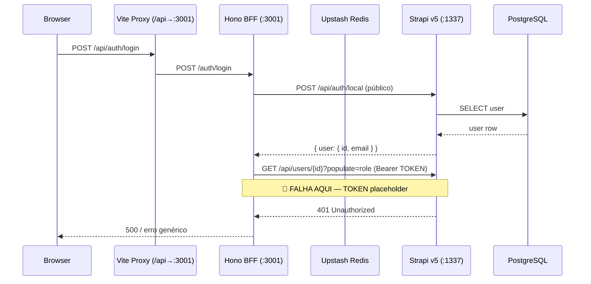

# Análise de Refactoring — Auth Fix + Produção + Docs

# Análise de Refactoring — PDC v2

<user_quoted_section>Estado actual do sistema antes de qualquer alteração. Sem propostas de implementação — apenas factos observados.</user_quoted_section>

## 1. Mapa de Dependências

### 1.1 Auth — Cadeia de chamadas

### 1.2 authService — Quem depende

| Ficheiro | Usa | Impacto |
| --- | --- | --- |
| file:apps/api/src/routes/auth.ts | `login`, `register`, `registerWithRole`, `getUserById`, `generateTokens`, `saveRefreshToken`, `revokeRefreshToken` | Directo — todas as rotas auth |
| file:apps/api/src/routes/auth.otp.ts | `getUserById`, `generateTokens`, `saveRefreshToken` | Fluxo OTP/2FA |
| file:apps/api/src/routes/auth.oauth.ts | `findOrCreateUser`, `generateTokens`, `saveRefreshToken` | Google/LinkedIn OAuth |
| **25+ ficheiros de rotas** | `verifyJwt` (middleware) | Todas as rotas protegidas dependem do JWT gerado pelo authService |

### 1.3 STRAPI_API_TOKEN — Utilizadores

O token é lido em **2 locais**:

| Ficheiro | Uso | Impacto se inválido |
| --- | --- | --- |
| file:apps/api/src/modules/auth/auth.service.ts | `getUserById()`, `register()`, `findOrCreateUser()` | Auth impossível |
| file:apps/api/src/modules/strapi/strapi.client.ts | **Todos** os pedidos ao Strapi (cursos, simulações, perfis, etc.) | **Toda a API falha** |

⚠️ **Descoberta crítica**: O token não é inválido — **retorna 403 (Forbidden)**. O token existe no Strapi mas **não tem permissões** para aceder à collection `users`. Em Strapi v5, API tokens têm níveis de acesso granular: o token precisa de permissão explícita para `Users & Permissions → User → find/findOne`. Sem essa permissão, o `getUserById()` falha com 403 e o login é impossível.

Além disso, este mesmo token é usado pelo file:apps/api/src/modules/strapi/strapi.client.ts para **todos** os 30+ módulos do BFF (cursos, simulações, perfis, feed, conquistas, etc.). Se o token não tiver permissões para uma collection, todo o módulo correspondente falha.

### 1.4 strapiClient — Alcance do impacto do token

O `strapiGet/strapiPost/strapiPut/strapiDelete` é importado em **20+ ficheiros**:

| Módulo | Collections Strapi acedidas |
| --- | --- |
| `auth.service.ts` | `/users`, `/perfis` |
| `feed.ts` | `/users`, cursos, simulacoes, experiencias |
| `perfis.ts` | `/users`, `/perfis` |
| `cursos.ts` | `/cursos`, `/inscricoes`, `/modulos` |
| `simulacoes.ts` | `/simulacoes`, `/tentativas` |
| `vinculos.ts` | `/vinculos` |
| `mensagens.ts` | `/conversas`, `/mensagens` |
| `conquistas.ts` | `/conquistas`, `/telemetrias` |
| `lti.service.ts` | `/lti-plataformas`, `/users` |
| `seo.ts` | `/cursos`, `/simulacoes`, `/experiencias` |
| `ai.rag.ts` | `/cursos` |
| `vocacional.service.ts` | `/tentativas` |
| `reputation.service.ts` | `/perfis`, `/ratings` |
| `feature-flags.service.ts` | `/feature-flags` |
| + 10 outros | diversas collections |

**Implicação**: O API token precisa de permissão **Full access** (ou permissões individuais para todas as collections listadas acima).

### 1.4b Redis — Usos no sistema

| Funcionalidade | Ficheiro | Comportamento sem Redis |
| --- | --- | --- |
| Refresh tokens | `auth.service.ts` | Mock retorna `null` → tokens não persistem |
| Rate limiting | file:apps/api/src/middleware/rateLimit.ts | Sem protecção |
| OTP challenge | `auth.otp.ts` | `if (redis)` guard → silently skips |
| OAuth state | `auth.oauth.ts` | `if (redis)` guard → state not validated |
| Feature flags cache | `feature-flags.service.ts` | Sem cache (hit Strapi a cada request) |
| Telemetria idempotência | `telemetria.ts` | Eventos duplicados aceites |

O mock em file:apps/api/src/lib/redis.ts usa `as any as Redis` — compila mas é essencialmente um no-op. Em desenvolvimento sem Redis, o sistema **parece funcionar** mas perde dados entre restarts e não protege contra abusos.

### 1.5 Frontend — Dependentes do AuthContext

`useAuth()` é importado em **15+ componentes/páginas**:

- `ProtectedRoute`, `Sidebar`, `DashboardPage`, `LoginPage`
- Todos os dashboards por role (Aluno, Mentor, Instituição)
- `FeedPage`, `MensagensPage`, `ProjetoDetailPage`, `TinaChat`

`credentials: 'include'` está configurado globalmente em file:apps/web/src/lib/api/http.ts — todos os pedidos do frontend enviam cookies automaticamente.

### 1.6 Ficheiros .env — Estado actual

| Ficheiro | Existe? | Estado |
| --- | --- | --- |
| file:apps/api/.env | ✅ | `STRAPI_API_TOKEN` = placeholder; `DEV_SKIP_OTP=true`; Redis comentado |
| file:apps/web/.env | ❌ | Não existe — `VITE_API_URL` undefined (OK em dev via proxy) |
| file:apps/api/.env.production | ✅ | Todos os valores sensíveis vazios |
| file:apps/api/.env.staging | ✅ | Todos os valores sensíveis vazios |
| file:.env.production.example | ✅ | Usa `REDIS_URL` (inconsistente — código espera `UPSTASH_REDIS_REST_URL`) |
| file:.env.staging.example | ✅ | Usa `POSTMARK_TOKEN` (inconsistente — código espera `SENDGRID_API_KEY`) |

## 2. Risk Hotspots

### 🔴 H1: Cookie SameSite em produção (OAuth)

file:apps/api/src/modules/auth/auth.helper.ts define `SameSite: 'Strict'` em produção. Com frontend em `usepdc.com` e API em `api.usepdc.com`, o cookie **não será enviado** no redirect de retorno do Google OAuth (cross-site). O file:docs/decisoes/adr-003-jwt-cookies.md já menciona este risco.

**Cenário de falha**: Login Google → redirect Google → `api.usepdc.com/auth/google/callback` → set cookie → redirect `usepdc.com/app/dashboard` → cookie `Strict` **não é enviado** → utilizador parece não-autenticado.

### 🔴 H2: COOKIE_DOMAIN não configurado

file:.env.production.example referencia `COOKIE_DOMAIN=.usepdc.com`, mas **nenhum código** lê esta variável. Em `auth.helper.ts`, o `setCookie()` não define `domain`. Isto significa que em produção, cookies setados por `api.usepdc.com` só serão enviados para `api.usepdc.com` — o frontend em `usepdc.com` nunca os recebe.

### 🟠 H3: Strapi Dockerfile usa Node.js 20

file:infra/strapi/Dockerfile usa `node:20-alpine`. O projecto define Node.js 24 LTS como padrão (file:.nvmrc). Strapi v5 pode ou não suportar Node.js 24 — verificação necessária.

### 🟠 H4: Inconsistências entre .env templates

| Template | Variável | Código espera |
| --- | --- | --- |
| `.env.production.example` | `REDIS_URL` | `UPSTASH_REDIS_REST_URL` + `UPSTASH_REDIS_REST_TOKEN` |
| `.env.production.example` | `POSTMARK_TOKEN` | `SENDGRID_API_KEY` |
| `.env.production.example` | `COOKIE_DOMAIN` | Nada (variável não lida) |
| `apps/api/.env` | `OAUTH_REDIRECT_BASE_URL=localhost:3000` | Frontend é `localhost:5173` |

### 🟡 H5: Sem Dockerfile para o BFF

`apps/api/` não tem Dockerfile. Railway pode fazer deploy com nixpacks (auto-detection), mas não há controlo sobre o processo de build.

## 3. Cobertura de Testes

### Testes existentes

| Tipo | Ficheiros | Cobertura auth |
| --- | --- | --- |
| **E2E (Playwright)** | file:tests/e2e/auth/login.spec.ts, file:tests/e2e/auth/oauth.spec.ts | Login render, credenciais inválidas, login aluno, redirect autenticado |
| **Setup auth** | file:tests/e2e/setup.auth.ts | Cria sessões autenticadas para 5 roles |
| **Seed** | file:tests/helpers/seed.ts | Cria 5 contas de teste via BFF `/auth/register/*` |
| **Load (k6)** | file:tests/k6/auth-flow.js | Login → me → refresh (200 VUs, p95 < 500ms) |
| **Unit tests** | Nenhum encontrado | Zero testes unitários para authService, middleware, OTP |

### Lacunas críticas

- **Zero testes unitários** para `auth.service.ts`, `auth.middleware.ts`, `otp.service.ts`
- Os testes e2e **dependem** de um stack completo (BFF + Strapi + PostgreSQL + Redis) — não correm isolados
- Os testes e2e **nunca foram executados com sucesso** (o seed falha se o STRAPI_API_TOKEN for inválido)
- O `seed.ts` assume `DEV_SKIP_OTP=true` — o fluxo com OTP real nunca foi testado

### O que os testes cobrem se funcionassem

Se o STRAPI_API_TOKEN fosse válido e a stack estivesse operacional:

- ✅ Login render e UX básica
- ✅ Credenciais inválidas mostram erro
- ✅ Login bem-sucedido com aluno (com DEV_SKIP_OTP)
- ✅ Redirect de utilizador autenticado
- ❌ Fluxo OAuth completo (e2e não testa redirect Google)
- ❌ Fluxo OTP real (nunca testado)
- ❌ Refresh token rotation
- ❌ Rate limiting
- ❌ RBAC (quem acede o quê)

## 4. Superfície de Mudança

### Bloco A: Fix Auth Local

| Acção | Ficheiro(s) | Tipo de mudança |
| --- | --- | --- |
| Gerar STRAPI_API_TOKEN real | Painel Strapi admin | Manual (browser) |
| Actualizar token no `.env` | file:apps/api/.env | Configuração |
| Corrigir `OAUTH_REDIRECT_BASE_URL` | file:apps/api/.env | `localhost:3000` → `localhost:5173` |
| Criar `apps/web/.env` | file:apps/web/.env | Novo ficheiro |
| Resolver cookie `domain` para produção | file:apps/api/src/modules/auth/auth.helper.ts | Código (ler `COOKIE_DOMAIN` do env) |
| Resolver `SameSite` para OAuth em produção | file:apps/api/src/modules/auth/auth.helper.ts | Código (parâmetro para OAuth flow) |

### Bloco B: Preparação Produção

| Acção | Ficheiro(s) | Tipo de mudança |
| --- | --- | --- |
| Consolidar `.env` templates (eliminar inconsistências) | `.env.production.example`, `.env.staging.example` | Configuração |
| Preencher env de produção com valores reais | file:apps/api/.env.production | Configuração (após criar contas) |
| Criar Dockerfile para BFF | `apps/api/Dockerfile` | Novo ficheiro |
| Verificar compatibilidade Strapi + Node.js | file:infra/strapi/Dockerfile | Investigação |
| Documentar checklist de serviços | Novo doc | Documentação |

### Bloco C: Sync Documentação

| Acção | Ficheiro(s) | Tipo de mudança |
| --- | --- | --- |
| Actualizar estado de 30+ tarefas | file:.planning/roadmap.md | Documentação |
| Corrigir 6 discrepâncias de requisitos | file:.planning/REQUIREMENTS.md | Documentação |
| Sincronizar status de fases | file:.planning/STATE.md | Documentação |
| Alinhar docs Traycer externos | `/home/cj/Documentos/Traycer/STATE.md` | Documentação |

**Ficheiros com mudança de código**: Apenas 1 (`auth.helper.ts`) — todas as restantes são configuração ou documentação.
