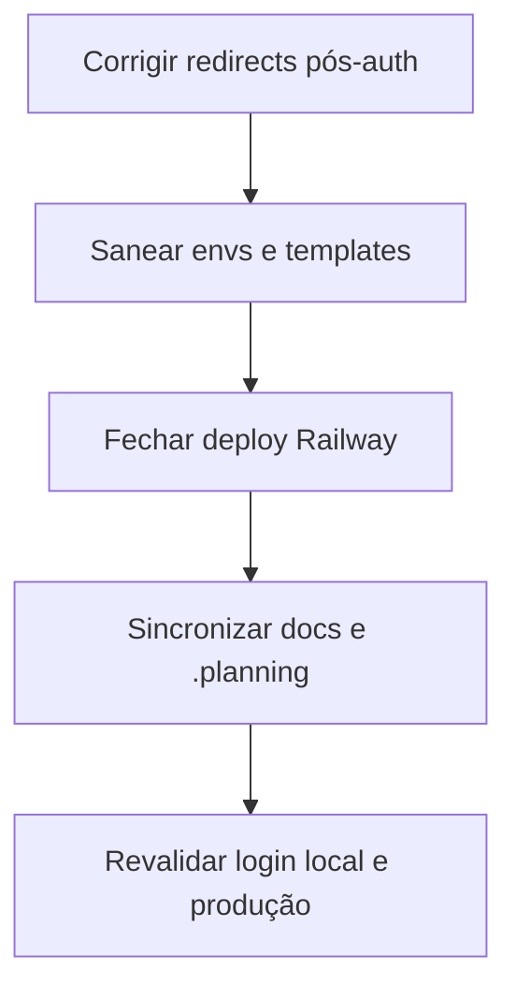

# T5: Fechamento final — auth local, env/docs e deploy Railway

Este ticket consolida o remanescente de ticket:4e02dfe2-b436-4a1f-8741-5b4bddc6be2f/307401b1-a213-48f6-800e-05dd01be59aa, ticket:4e02dfe2-b436-4a1f-8741-5b4bddc6be2f/f9e6491c-e38c-4a3e-92fe-41959b0ab32e e ticket:4e02dfe2-b436-4a1f-8741-5b4bddc6be2f/a7f05c2f-a828-4430-8d99-7d648ba2148f, com base na verificação contra spec:4e02dfe2-b436-4a1f-8741-5b4bddc6be2f/ab2f7bb6-a4c4-421e-89c5-72ef4fee66f7 e spec:4e02dfe2-b436-4a1f-8741-5b4bddc6be2f/34fcce11-4024-446a-9bbc-ed18ca0ee7e8.

## Objetivo

Fechar o que ainda impede:

- login local confiável
- staging coerente com o validador de env
- deploy real no Railway sem configuração implícita
- documentação e `.planning` coerentes com o estado real

## Escopo

### 1) Corrigir o 404 pós-login e pós-OAuth

**Arquivos afetados**

- file:apps/web/src/pages/LoginPage.tsx
- file:apps/web/src/features/auth/TwoFactorPage.tsx
- file:apps/api/src/routes/auth.oauth.ts

**Problema atual**

- `LoginPage` ainda usa fallback `/dashboard`
- `TwoFactorPage` ainda usa fallback `/app/dashboard`
- callbacks OAuth ainda redirecionam para `/app/dashboard`
- o router real só conhece `/app` e `/app/dashboard/{role}` em file:apps/web/src/router.tsx

**Estado esperado**

- todo fluxo pós-auth deve cair em **`/app`** como destino neutro
- o `DashboardRedirect` resolve a rota final por role
- fallback local de OAuth não pode continuar em `localhost:3000`

### 2) Sanear templates/env e setup local

**Arquivos afetados**

- file:apps/api/.env.staging
- file:.env.example
- file:apps/api/.env.example
- file:apps/web/.env.example
- file:docs/guia-tecnico/setup-local.md
- file:.gitignore

**Problemas atuais**

- `apps/api/.env.staging` usa `NODE_ENV=staging`, mas file:apps/api/src/lib/env.ts só aceita `development|production|test`
- file:.env.example ainda carrega um valor concreto/token-like e variáveis que o código não usa
- file:apps/api/.env.example ainda está com `PORT=3000` e `OAUTH_REDIRECT_BASE_URL=http://localhost:3000`
- file:docs/guia-tecnico/setup-local.md ainda menciona `JWT_REFRESH_SECRET`, que não é usado
- a política de env versionado/ignorado ainda está inconsistente entre api/web/strapi

**Estado esperado**

- staging compatível com o validador atual
- nenhum template versionado contém segredo concreto
- exemplos refletem **somente** o que o código realmente lê
- setup local descreve exatamente o fluxo real

### 3) Fechar deploy Railway de verdade

**Superfícies afetadas**

- file:docs/guia-tecnico/deploy.md
- file:apps/api/.env.production
- configurações dos serviços Railway `@pdc/web`, `@pdc/api`, `strapi`

**Problemas atuais**

- `deploy.md` ainda fala em **Vercel** no frontend
- `deploy.md` ainda fala em `JWT_REFRESH_SECRET`
- documentação do Strapi ainda sugere `DATABASE_URL`, mas file:infra/strapi/config/database.ts lê `DATABASE_HOST`, `DATABASE_PORT`, `DATABASE_NAME`, `DATABASE_USERNAME`, `DATABASE_PASSWORD`, `DATABASE_SSL`
- `@pdc/web` ainda depende de configuração manual para não cair em `No start command detected`
- ainda falta documentar/configurar Railway como SPA estática, LinkedIn, PostgreSQL mapping e rede interna do Strapi
- file:apps/api/.env.production ainda aponta `STRAPI_URL=https://strapi.usepdc.com`, enquanto a estratégia preferida era networking interno no Railway

**Estado esperado**

- frontend documentado e configurado como Railway SPA
- `@pdc/web` com build estável e fallback SPA
- `@pdc/api` e `strapi` com modo de deploy explícito
- PostgreSQL mapeado do jeito que o Strapi realmente consome
- checklist de produção inclui LinkedIn
- secrets temporárias da primeira semana ficam só nas plataformas e depois são rotacionadas

### 4) Sincronizar `.planning` com a realidade

**Arquivos afetados**

- file:.planning/STATE.md
- file:.planning/roadmap.md
- file:.planning/REQUIREMENTS.md (se necessário, apenas onde o status depender desses fixes)

**Problemas atuais**

- `STATE.md` diz “lançamento concluído” e “nenhum blocker ativo”
- `roadmap.md` e partes de `STATE.md` tratam infra/auth/deploy como fechados
- isso contradiz o estado real: ainda há 404 local e deploy Railway incompleto

**Estado esperado**

- `.planning` só pode declarar lançamento concluído depois de:
  - login local validado sem 404
  - deploy Railway estável
  - docs corrigidas
- blockers e foco atual precisam refletir o estado real até essa validação acontecer

## Fora de escopo

- Simulação Tipo 3
- gateway de pagamento
- refactor geral de modularidade > 200 linhas
- mudanças grandes de arquitetura de auth
- novos recursos de produto fora de auth/infra/deploy/docs

## Critérios de aceite

1. Fazer login local a partir de `http://localhost:5173/login` não termina em 404; o fluxo cai em `/app` e resolve corretamente para o dashboard por role.
2. Fluxo OTP não usa mais fallback para rota inexistente.
3. Callbacks Google e LinkedIn redirecionam para rota válida e não dependem de `localhost:3000`.
4. file:apps/api/.env.staging é compatível com file:apps/api/src/lib/env.ts.
5. file:.env.example, file:apps/api/.env.example e file:apps/web/.env.example não contêm segredos concretos nem variáveis obsoletas; portas/URLs batem com o setup real.
6. file:docs/guia-tecnico/setup-local.md não menciona `JWT_REFRESH_SECRET` e descreve corretamente o setup atual.
7. file:docs/guia-tecnico/deploy.md passa a refletir Railway para os 3 serviços, inclui LinkedIn, explica PostgreSQL `DATABASE_*`, remove Vercel/JWT drift e documenta SPA fallback.
8. O serviço `@pdc/web` deixa de falhar com `No start command detected` no Railway.
9. A estratégia de domínio fica explícita: usar `https://usepdc.com` como canônico com redirect de `www`, **ou** ajustar CORS/múltiplas origins conscientemente; não pode ficar implícito.
10. file:.planning/STATE.md e file:.planning/roadmap.md deixam de afirmar que o lançamento está concluído antes da validação final.
11. Depois da configuração manual de plataforma, `https://api.usepdc.com/health` responde 200 e o login email/senha funciona no ambiente de teste da primeira semana.

## Verificação

### Verificação local

1. Abrir `/login`
2. Entrar com uma conta seed
3. Confirmar que a navegação final não vai para `/dashboard` nem `/app/dashboard`
4. Se houver OTP, confirmar que o fallback também cai em `/app`

### Verificação de templates/docs

1. Rever os exemplos de env e confirmar que nenhum carrega valor sensível real
2. Confirmar que os exemplos batem com file:apps/api/src/lib/env.ts e file:apps/web/src/main.tsx
3. Confirmar que `setup-local.md` e `deploy.md` não se contradizem

### Verificação Railway

1. `@pdc/web` faz build sem erro de start command
2. acesso direto a `/login` no domínio publicado carrega a SPA
3. `@pdc/api` responde health check
4. Strapi sobe com PostgreSQL via `DATABASE_*`
5. LinkedIn/Google ficam documentados e prontos para credenciais reais

### Verificação operacional

1. usar as credenciais temporárias já guardadas fora do repositório apenas nas plataformas
2. não commitar nenhuma credencial
3. rotacionar os segredos temporários após a primeira semana de teste
