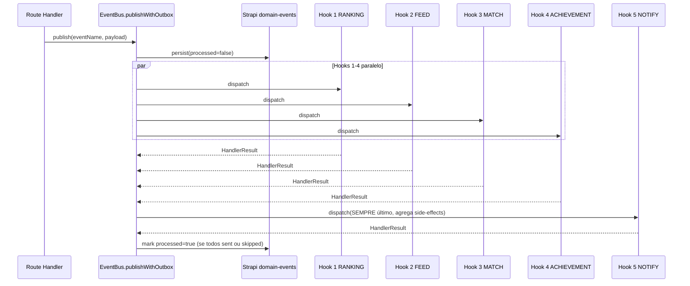
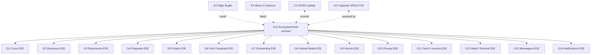

# G15 — EcosystemHook<T> Contract (Hooks Integrador Canónico)

## Status

Draft · **CRÍTICA** · Bloqueia G1–G14 · Coordena com C1, C2, E2, E4.

## Manifesto

<user_quoted_section>Nenhuma escrita de domínio é considerada completa enquanto os 5 hooks ecossistémicos canónicos não correm com sucesso (ou são marcados para retry no outbox). G15 transforma "fluxo completo" de princípio para contrato verificável e testável.</user_quoted_section>

Esta spec define:

- **O contrato** `EcosystemHook<T>` partilhado em `@pdc/shared`.
- **Os 5 hooks canónicos** com ordem garantida e idempotência obrigatória.
- **A taxonomia completa de Domain Events** (expandida para cobrir os 6 tipos de conteúdo + identidade + engagement).
- **A Definition of Done E2E** que **cada uma das 14 G-specs subsequentes** terá de satisfazer literalmente.

## Estado actual auditado (referências `file:` específicas)

### O que já existe ✅

| Componente | Onde | Maturidade |
| --- | --- | --- |
| EventBus singleton | file:apps/api/src/modules/events/event-bus.ts | ✅ `register`, `publish`, `publishWithOutbox`, `Promise.allSettled` para isolamento de falhas, throw para `processed=false` em erro |
| `DomainEventName` enum (13 eventos) | file:apps/api/src/modules/events/types.ts | 🟡 Cobre simulação/curso/login/comentário/rating mas **não cobre Programa, Projeto, Post, Experiência publish-event, Vinculo solicitado, Mensagem enviada, Tentativa falhada** |
| Outbox `domain-event` content type | file:infra/strapi/src/api/domain-event/content-types/domain-event/schema.json | ✅ name, payload, correlationId, processed, processedAt, attempts |
| Outbox Replay Scheduler | file:apps/api/src/index.ts linhas 147–162, file:apps/api/src/modules/events/outbox-replay.ts | 🟡 Funciona em `setInterval` co-localizado com o BFF main (D5 — risco de saturar event loop sob backlog grande) |
| `feedHandler` | file:apps/api/src/modules/events/feed.handler.ts | 🔴 **NÃO IDEMPOTENTE** — cada replay cria novo Post, duplica feed |
| `conquistasHandler` | file:apps/api/src/modules/events/conquistas.handler.ts + file:apps/api/src/modules/conquistas/conquistas.engine.ts | ✅ Idempotente via `isAlreadyUnlocked()` + 12 regras + `EVENT_TO_TRIGGER_MAP` |
| `ltiHandler` | file:apps/api/src/modules/events/lti.handler.ts | ✅ RedLock + Redis SADD idempotency + retry classification |
| Reputation com `marcarParaRecalculo` | file:apps/api/src/modules/reputation/reputation.service.ts linhas 153–156 | 🟡 Existe mas **NUNCA é chamado por nenhum event handler** — drift |
| Feed scoring (`calcScore`, weights tunáveis) | file:apps/api/src/modules/feed/feed.scoring.ts + `feed.weights.ts` | ✅ Mas calculado on-the-fly em `feed.helpers.ts`, sem invalidação por evento |
| Realtime socket (conquista, mensagem, notificação) | file:apps/api/src/modules/realtime/socket.service.ts linhas 79–93 | ✅ 3 emitters mas **sem handler centralizado que orquestre fanout** |
| Resend mail service | file:apps/api/src/modules/mail/mail.service.ts | ✅ Existe |
| Cursos invoca event | file:apps/api/src/routes/cursos.ts linha 192 (`eventBus.publishWithOutbox(CURSO_PUBLICADO, ...)`) | 🟡 Único route a invocar — outros 40 routes do BFF não disparam eventos |

### O que falta ❌

| Falha | Impacto E2E |
| --- | --- |
| **Match Terminal handler** não existe — content events não recomputam candidatos | Feature B8/spec:IMPORTANTE/02 parcialmente partida |
| **Ranking handler** — content events não disparam `marcarParaRecalculo()` para recalcular reputação do autor | D1 (debt) — reputação congelada após criação |
| **Feed cache invalidation handler** — novo conteúdo não invalida cache de feed dos perfis afins | Utilizador vê feed stale por 5 min |
| **Notification fanout handler** centralizado — apenas socket está coberto, falta web push, APNs (mobile), FCM (mobile), email digest | Mobile shipping (D2) sem fanout = app inútil |
| **Telemetry pulse handler** — domain events não geram pulsos para analytics admin | `AdminTelemetriaPage` mostra dados parciais |
| **`feedHandler`**** idempotency bug** — dedupe key inexistente | Em qualquer replay, feed enche-se de duplicados |
| **Eventos faltam**: `programa.publicado`, `programa.aprovado`, `projeto.publicado`, `projeto.acesso_solicitado`, `projeto.acesso_concedido`, `post.publicado`, `simulacao.publicada`, `vinculo.solicitado`, `vinculo.aprovado`, `mensagem.enviada`, `tentativa.falhada`, `inscricao.criada`, `comite.aprovou`, `moderador.aprovou`, `denuncia.criada` | 7+ tipos de fluxo sem rasto E2E |
| **Contract abstrato ****`EcosystemHook<T>`** não existe em `@pdc/shared` — handlers são funções soltas | Cada G* iria reinventar a roda |
| **40+ routes** não invocam eventos quando criam/atualizam conteúdo | Maior parte do CRUD é silencioso para o ecossistema |

## Estado canónico

### Os 5 Hooks Ecossistémicos Canónicos



| # | Hook | Responsabilidade | Idempotência |
| --- | --- | --- | --- |
| **1. RANKING** | `rankingHook` | Re-avalia reputação do autor (`marcarParaRecalculo`) + recalcula score do conteúdo no feed (`calcScore` cache invalidation) | Por `(autorId, eventId)` em Redis SADD |
| **2. FEED** | `feedHook` | Decide separador (`Geral`/`Vocacional`/`Institucional`/`Trending`), cria entrada de feed (Strapi `feed-entry` collection nova), invalida cache `feed:{perfilId}:{source}` para perfis afins | **Dedupe key obrigatória**: `feed:event:{eventId}` |
| **3. MATCH** | `matchHook` | Recalcula candidatos do Match Terminal: cruza Perfil Vocacional × área × tier × pesos super_admin → top N por afinidade. Persiste em Strapi `match-terminal-suggestion` (collection nova) | Por `(eventId, candidateId)` |
| **4. ACHIEVEMENT** | `achievementHook` | Wrapper do `conquistasHandler` actual + extensão para 25+ regras canónicas (não só 12) + suporta dependências entre conquistas | ✅ Já existente — manter `isAlreadyUnlocked` |
| **5. NOTIFY** | `notifyHook` | **SEMPRE último**. Agrega side-effects dos 4 hooks anteriores (e.g.: "tu destrancaste conquista X" + "o teu curso entrou no feed") e faz fanout multi-canal: (a) Socket.IO realtime, (b) Web Push API, (c) APNs (iOS), (d) FCM (Android), (e) Email digest (Resend, agrupado N min) | Dedup por `(perfilId, eventId, canal)` |

### Contrato `EcosystemHook<T>` em `@pdc/shared`

```ts
// packages/shared/src/ecosystem-hook.ts (NOVO)
export interface EcosystemHookContext { ... }
export interface EcosystemHookResult { ... }
export interface EcosystemHook<TPayload = unknown> { ... }
```

Snippet conceptual (não código completo) — cada hook implementa:

- `name: 'ranking' | 'feed' | 'match' | 'achievement' | 'notify'`
- `dependencies: ('ranking'|'feed'|'match'|'achievement')[]` (vazio para 1–4, `['ranking','feed','match','achievement']` para notify)
- `idempotencyKey: (event) => string` — obrigatória.
- `execute: (event, context) => Promise<EcosystemHookResult>`
- `compensate?: (event, context) => Promise<void>` — opcional, para rollback em falha downstream

### Taxonomia Completa de Domain Events (expandida)

| Categoria | Eventos canónicos | Estado |
| --- | --- | --- |
| **Simulação** | `tentativa.iniciada`, `tentativa.concluida`, `tentativa.falhada`, `simulacao.criada`, `simulacao.publicada` (após Comité aprovou), `simulacao.aprovada` (Comité), `simulacao.rejeitada` | 🟡 3 existem |
| **Curso** | `curso.publicado`, `curso.atualizado`, `curso.arquivado`, `curso.inscricao`, `curso.modulo.concluido`, `curso.concluido` | 🟡 3 existem |
| **Experiência** | `experiencia.publicada`, `experiencia.visualizada`, `experiencia.qa.respondida` | 🟡 1 existe |
| **Programa** | `programa.publicado`, `programa.aprovado` (Moderador), `programa.inscricao` (livre), `programa.convite_enviado`, `programa.convite_aceite`, `shadowapro.vinculo_criado`, `eduvisita.agendada` | ❌ NENHUM |
| **Projeto** | `projeto.publicado`, `projeto.acesso_solicitado`, `projeto.acesso_concedido`, `projeto.acesso_recusado`, `projeto.colaborador_aceite`, `projeto.endorsement_recebido`, `projeto.selo_atribuido` | ❌ NENHUM |
| **Post/Conquista** | `post.publicado`, `conquista.desbloqueada` (já no enum mas nunca disparado fora do handler), `comentario.criado`, `like.adicionado`, `bookmark.adicionado` | 🟡 2 existem |
| **Identidade** | `perfil.criado`, `perfil.atualizado`, `perfil.role_alterado`, `perfil.suspensa`, `login`, `logout`, `2fa.ativado`, `oauth.vinculado` | 🟡 2 existem |
| **Vínculo** | `vinculo.solicitado`, `vinculo.aprovado`, `vinculo.rejeitado`, `vinculo.terminado` | 🟡 1 existe |
| **Mensagens** | `mensagem.enviada`, `mensagem.lida`, `conversa.iniciada` | ❌ NENHUM (passa direto pelo socket sem evento) |
| **Moderação** | `denuncia.criada`, `denuncia.resolvida`, `conteudo.removido`, `comite.aprovou`, `comite.rejeitou`, `moderador.aprovou`, `moderador.rejeitou` | ❌ NENHUM |
| **Mídia** | `media.uploaded`, `media.processed`, `media.failed` | ❌ NENHUM |

Total: **49 eventos canónicos**, dos quais **13 existem** e **36 são novos**.

### Regras de ouro confirmadas (das tuas 4 verdades laterais)

1. **G15 manda em todas**: nenhum write de conteúdo é considerado completo sem disparar os 5 hooks. Falha → outbox replay; nunca silencia. ✅
2. **Feed Institucional** só recebe conteúdo de `instituicao` ou `mentor` vinculado a instituição. Conteúdo de mentor independente vai para Vocacional. ✅
3. **Match Terminal** só sugere conteúdo a estudante se compatibilidade de área ≥ tier mínimo (Bronze=baixa, Prata=média, Ouro=alta, Diamante=ultra-alta). Pesos tunáveis pelo super_admin. ✅
4. **Toda conquista** é desbloqueada via Event Bus, nunca por endpoint manual. `POST /conquistas/verificar` é wrapper do bus, não fonte primária. ✅

## Tickets

### G15-T1 — Criar contrato `EcosystemHook<T>` + `DomainEventName` expandido em `@pdc/shared`

- Novo ficheiro file:packages/shared/src/ecosystem-hook.ts exporta interfaces `EcosystemHook`, `EcosystemHookContext`, `EcosystemHookResult`, enum `EcosystemHookName`.
- Mover `DomainEventName` enum de `apps/api/src/modules/events/types.ts` para file:packages/shared/src/domain-events.ts e expandir para os **49 eventos canónicos**.
- Adicionar Zod schema `DomainEventSchema<T>` partilhado para validação edge↔BFF↔Strapi.
- Adicionar `EventPayloadSchema` por evento (49 schemas tipados).
- Manter retro-compatibilidade: `apps/api/.../types.ts` re-exporta de `@pdc/shared`.
- **DoD E2E**:
  - **UI**: N/A.
  - **Contrato**: Zod schemas exportados; type inference funciona em todos os workspaces (`apps/api`, `apps/edge`, `apps/web`).
  - **BFF**: imports actualizados sem breaking changes.
  - **Persistência**: `domain-event` content type valida `name` contra novo enum.
  - **Impacto**: G1–G14 podem partir de uma única definição canónica de evento.

### G15-T2 — Refactor EventBus para suportar `EcosystemHook<T>` com ordering garantido

- file:apps/api/src/modules/events/event-bus.ts: adicionar `registerHook(hook: EcosystemHook<T>)`.
- Internalmente, ordena execução: hooks com `dependencies: []` correm em paralelo (`Promise.allSettled`); depois hooks que dependem deles, recursivamente.
- `notifyHook` com `dependencies: ['ranking','feed','match','achievement']` corre **sempre último**, recebendo no `context` os `HookResult` dos anteriores.
- Adicionar idempotency check: antes de executar `hook.execute`, verifica `idempotencyKey` em Redis SADD; se existe, retorna `{ status: 'skipped', reason: 'already-processed' }`.
- Manter API antiga `register()` para retrocompatibilidade durante 1 release.
- **DoD E2E**:
  - **Contrato**: `EcosystemHook<T>` é cidadão de primeira classe.
  - **BFF**: `eventBus.publishWithOutbox` corre 4 hooks em paralelo + 1 (notify) em série, em <500ms p95 para 95% dos eventos.
  - **Persistência**: idempotência funciona via Redis (re-publish do mesmo eventId não duplica side-effects).
  - **Impacto**: bug actual do `feedHandler` (duplicar Posts em replay) deixa de existir.

### G15-T3 — Implementar `rankingHook` (Hook 1)

- file:apps/api/src/modules/hooks/ranking.hook.ts (novo).
- Para eventos: `curso.publicado`, `curso.atualizado`, `simulacao.publicada`, `experiencia.publicada`, `programa.publicado`, `projeto.publicado`, `post.publicado`, `rating.criado`, `tentativa.concluida`, `comentario.criado`.
- Acção: `await reputationService.marcarParaRecalculo(autorId, evento.name)`. Adicionalmente invalida cache `reputation:{perfilId}` em Redis.
- Idempotência: `ranking:{eventId}` SADD (TTL 7d).
- **DoD E2E**:
  - **BFF**: hook executa em <50ms (só marca queue).
  - **Persistência**: perfil é recalculado no próximo passo do batch worker (`recalcularGlobal`).
  - **Impacto**: autor publica curso → 60s depois reputação reflecte novo `cursosPublicados`.

### G15-T4 — Implementar `feedHook` (Hook 2) substituindo `feedHandler` actual + content type novo

- Criar Strapi content type file:infra/strapi/src/api/feed-entry/.../schema.json (novo): `entityType` enum dos 6 tipos, `entityId`, `autorId`, `area`, `source` enum (`geral|vocacional|institucional|trending`), `score`, `eventId` (unique para idempotência), `publicadoEm`.
- file:apps/api/src/modules/hooks/feed.hook.ts (novo): cria `feed-entry` apropriado para cada evento de publicação. Decide `source` por regra:
  - `instituicao` ou `mentor.instituicaoId != null` → cria entrada em `institucional` + `vocacional` da área.
  - `mentor` independente → `vocacional` apenas.
  - `estudante` (post, projeto) → `geral` + `vocacional` da área se aplicável.
  - Score inicial via `calcScore` com weights da `feed.weights`.
- Invalida cache `feed:{source}:{area}` em Redis (afecta perfis afins na próxima leitura).
- **Idempotência crítica**: `feed-entry.eventId` é unique constraint Postgres; `INSERT ... ON CONFLICT DO NOTHING`. Bug actual eliminado.
- Substitui (deprecates) file:apps/api/src/modules/events/feed.handler.ts.
- **DoD E2E**:
  - **UI**: utilizador vê novo conteúdo no feed correcto em <60s (cache invalidation).
  - **Contrato**: schema Zod `FeedEntry` em `@pdc/shared`.
  - **BFF**: GET `/feed?source=...` lê de `feed-entries` (não recomputa do zero).
  - **Persistência**: zero duplicatas mesmo com 100 replays do mesmo evento.
  - **Impacto**: regra confirmada (Verdade Lateral 2) — Institucional só recebe instituição/mentor vinculado.

### G15-T5 — Implementar `matchHook` (Hook 3) + Match Terminal canónico

- Criar Strapi content type file:infra/strapi/src/api/match-suggestion/.../schema.json: `estudantePerfilId`, `entityType`, `entityId`, `score` (0–1), `tierMinimo` enum, `criadaEm`, `expiraEm`, `vista` boolean, `acceitada` boolean, `eventId`.
- file:apps/api/src/modules/hooks/match.hook.ts (novo): para eventos de publicação, cruza:
  - Perfil Vocacional do estudante (`perfil-vocacional.area` + `scoreGlobal`)
  - Tier de reputação do estudante (`getTier`)
  - Pesos super_admin (lidos de `feature-flag` ou nova `match-weights` collection)
  - Algoritmo: `score = (afinidadeArea * 0.5) + (compatibilidadeReputacao * 0.3) + (recencyBoost * 0.2)`
  - Se score ≥ threshold por tier (Bronze 0.4, Prata 0.55, Ouro 0.7, Diamante 0.85), cria `match-suggestion`.
- Idempotência: `match:{eventId}:{candidateId}` SADD.
- Top N por entidade (configurável; default N=50 candidatos por entidade publicada).
- Endpoint novo: `GET /match/sugestoes` no BFF (rota file:apps/api/src/routes/match.ts nova) que lista sugestões para o utilizador autenticado.
- **DoD E2E**:
  - **UI**: estudante vê novas oportunidades no Hub "Match Terminal" (`spec:E1` HUB) realtime via socket.
  - **Contrato**: `MatchSuggestion` schema Zod.
  - **BFF**: query optimizada (compound index `(estudantePerfilId, expiraEm, vista)`).
  - **Persistência**: sugestões expiram automaticamente em 7 dias.
  - **Impacto**: regra confirmada (Verdade Lateral 3) — só sugere se score ≥ tier mínimo.

### G15-T6 — Substituir `conquistasHandler` por `achievementHook` (Hook 4) + expandir para 25+ regras

- file:apps/api/src/modules/hooks/achievement.hook.ts (refactor de `conquistas.handler.ts`).
- Manter conformidade com `EcosystemHook<T>` interface (já é idempotente via `isAlreadyUnlocked`).
- Expandir `REGRAS` em file:apps/api/src/modules/conquistas/conquistas.engine.ts para 25+:
  - Já existem 12.
  - Adicionar: `primeiro-projeto`, `colaborador-recebido`, `aptidao-validada` (selo), `top-8-percent` (estabilidade), `tier-prata-alcancado`, `tier-ouro-alcancado`, `tier-diamante-alcancado`, `streak-7-dias`, `streak-30-dias`, `streak-100-dias`, `programa-completo`, `experiencia-completa`, `mentor-vinculado` (estudante), `5-mentorados-aceites` (mentor), `feedback-de-comite`, `5-endorsements`, `viral-100-likes`.
- Adicionar dependências entre conquistas (e.g., `tier-ouro-alcancado` requer 5+ outras).
- **DoD E2E**:
  - **UI**: estudante recebe toast realtime via socket quando conquista desbloqueia (já existe; verificar que continua a funcionar).
  - **Contrato**: 25+ regras tipadas em Zod.
  - **BFF**: feature flag `AUTO_ACHIEVEMENTS` continua a controlar.
  - **Persistência**: idempotência mantida.
  - **Impacto**: regra confirmada (Verdade Lateral 4) — todas via bus, nunca manual.

### G15-T7 — Implementar `notifyHook` (Hook 5) com fanout multi-canal

- file:apps/api/src/modules/hooks/notify.hook.ts (novo).
- Recebe no `context` os `HookResult` dos 4 hooks anteriores; agrega numa única notificação humana ("o teu curso X entrou no feed institucional, recebeste sugestão para 12 estudantes, e desbloqueaste 'Primeiro Curso'").
- Decide destinatários por evento:
  - Autor da acção (sempre).
  - Seguidores do autor (subset, sem flood).
  - Targets do match (e.g., os 12 estudantes sugeridos).
  - Stakeholders (instituição vinculada, mentor responsável).
- Respeita `notificationPreferences` do perfil (file:packages/shared/src/user.ts linhas 57–63).
- Fanout para 4 canais paralelos:
  1. **Socket.IO**: `socketService.emitirNotificacao(perfilId, payload)` (já existe).
  2. **Web Push** (browser desktop): novo módulo file:apps/api/src/modules/push/web-push.service.ts com `web-push` npm; tokens em Strapi `push-subscription` collection nova.
  3. **APNs** (iOS): novo módulo file:apps/api/src/modules/push/apns.service.ts (depende de `spec:D2-T5`); tokens em mesma collection com `platform: 'ios'`.
  4. **FCM** (Android): mesmo módulo via `firebase-admin`; tokens com `platform: 'android'`.
  5. **Email digest** (Resend): batched a cada 15 min (configurável); usa file:apps/api/src/modules/mail/mail.service.ts actual.
- Strapi content type file:infra/strapi/src/api/notificacao/.../schema.json (verificar se existe; se não, criar): `perfilId`, `tipo`, `titulo`, `corpo`, `link`, `eventId`, `lida`, `entreguePor` (json: `{socket, webPush, apns, fcm, email}`), `criadaEm`.
- Idempotência: `notify:{perfilId}:{eventId}:{canal}` SADD.
- **DoD E2E**:
  - **UI**: notificação aparece em-app (toast + counter), browser push (se permitido), mobile push native, email digest (se opted-in).
  - **Contrato**: `NotificationPayload` schema Zod com `channels: NotificationChannel[]`.
  - **BFF**: dispatcher unificado.
  - **Persistência**: histórico em `notificacao` collection com canal de entrega rastreado.
  - **Impacto**: utilizador inactivo recebe push no telemóvel; activo só vê toast.

### G15-T8 — Audit + adicionar `eventBus.publishWithOutbox` em todos os routes que escrevem domínio

- Auditar 41 routes em file:apps/api/src/routes/.
- Para cada route que faz `strapiPost`/`strapiPut` num content type de domínio (curso, simulação, experiência, programa, projeto, post, vínculo, mensagem, denúncia, comentário, rating, conquista manual, perfil update, etc.), garantir que dispara o evento canónico apropriado.
- Tabela de auditoria como output documentado: `route → tipo de write → evento que dispara → cobertura E2E sim/não`.
- Se Programa precisa de aprovação Moderador (spec:IMPORTANTE/04 §3.4), o evento `programa.aprovado` é disparado pelo `PATCH /programas/:id/estado` quando transição for `review → approved`, não no create.
- **DoD E2E**:
  - **BFF**: zero writes de domínio sem evento correspondente.
  - **Persistência**: outbox tem rasto de toda escrita relevante.
  - **Impacto**: G1–G14 conseguem partir do princípio "se está em Strapi, evento foi disparado".

### G15-T9 — Migrar Outbox Replay para worker isolado (D5 fix)

- Criar file:apps/api/src/modules/outbox/outbox-worker.ts que **substitui** o `setInterval` em file:apps/api/src/index.ts linhas 147–162.
- Worker correrá como processo Railway separado: `npm run start:outbox-worker` (script existe em `package.json` como `replay-outbox`; estender para modo daemon).
- Lock distribuído via Redis: `outbox:lock` com TTL 90s — só uma instância processa por vez (idempotência multi-instance).
- Chunk size: 50 eventos por iteração (config via env `OUTBOX_CHUNK_SIZE`).
- Yield ao event loop entre chunks (`await new Promise(r => setImmediate(r))`).
- Failure classification: usa o `HandlerResult.status` (`sent | skipped | retryable_error` já existe no `event-bus.ts`).
- Métricas via `metric: 'domain_events_failed_total'` (já está no log; adicionar exporter Sentry para D3).
- **DoD E2E**:
  - **BFF**: main process desimpedido sob backlog grande (50.000 eventos não saturam main).
  - **Persistência**: garantia at-least-once mantida.
  - **Impacto**: D5 + parte de D3 fechados.

### G15-T10 — Admin Observability: Hooks Health Dashboard

- Novo route BFF file:apps/api/src/routes/admin.ts (estender) com `GET /admin/hooks/health` que retorna:
  - Por hook (ranking/feed/match/achievement/notify): success rate (24h, 7d), p50/p95 latência, throughput por minuto, top 3 eventos com mais falhas.
  - Outbox: backlog actual (count `processed=false`), eventos com `attempts > 3`, age do mais antigo não processado.
- Novo página frontend file:apps/web/src/features/admin/AdminHooksHealthPage.tsx (BentoGrid de 5 tiles, um por hook + 1 tile global de outbox).
- Acessível só por `super_admin` (`checkRole(['super_admin'])`).
- Refresh automático cada 30s via React Query.
- **DoD E2E**:
  - **UI**: super_admin vê em tempo real saúde dos 5 hooks (Soul & Elite tiles, BentoGrid, GlassCard para alertas críticos).
  - **Contrato**: `HookHealthSnapshot` schema Zod em `@pdc/shared`.
  - **BFF**: rota agregada com cache 30s.
  - **Persistência**: lê de Strapi + Redis.
  - **Impacto**: ops detecta degradação antes do utilizador.

### G15-T11 — Tests integration E2E que validam fluxo completo de 1 evento

- Vitest integration test em file:apps/api/src/modules/hooks/hooks.integration.spec.ts.
- Cenário canónico: dispara `eventBus.publishWithOutbox(CURSO_PUBLICADO, fixtures.curso)` →
  - Asserta que `domain-event` foi criado com `processed=true` em <2s.
  - Asserta que `marcarParaRecalculo` foi chamada (mock + spy).
  - Asserta que `feed-entry` foi criado com `eventId` correcto.
  - Asserta que ≥1 `match-suggestion` foi criada.
  - Asserta que conquista "primeiro-curso" foi desbloqueada para o autor.
  - Asserta que `notificacao` foi criada e `socketService.emitirNotificacao` foi chamada.
- **DoD E2E**: test corre em CI (job `e2e-smoke` ou novo job `hooks-integration`).

### G15-T12 — Documentação: cookbook "Como adicionar uma nova feature E2E"

- Novo file:docs/guia-tecnico/ecosystem-hooks.md.
- Guia step-by-step para futuras G* (e features além das 14):
  1. Define o evento em `@pdc/shared/domain-events.ts`.
  2. Define o payload Zod.
  3. Adiciona o `eventBus.publishWithOutbox(...)` no route handler.
  4. Garante que cada um dos 5 hooks sabe lidar com o teu evento (extender map se necessário).
  5. Escreve test integration que valida os 5 hooks.
  6. Documenta na spec da feature qual o impacto em cada camada.
- Linkado de file:.planning/CONSTITUTION.md (via `spec:C4`).
- **DoD E2E**: novo dev cria feature E2E completa em <1 dia seguindo o cookbook.

## Wireframe — Admin Hooks Health Dashboard (G15-T10)

```wireframe
<!DOCTYPE html>
<html>
<head>
<style>
:root {
  --surface-canvas: #F8F9FA;
  --surface-elevated: #FAF6EE;
  --surface-recessed: #F2EFE8;
  --ink-primary: #2A2724;
  --ink-secondary: #5A5751;
  --ink-tertiary: #8A867F;
  --accent-terracotta: #D2691E;
  --accent-success: #2F7A4F;
  --accent-warning: #C68A2E;
  --accent-danger: #B23B2E;
  --radius-md: 10px;
  --radius-lg: 14px;
  --radius-asym-a: 18px 6px 18px 6px;
}
* { margin: 0; padding: 0; box-sizing: border-box; }
body { font-family: Inter, system-ui, sans-serif; background: var(--surface-canvas); color: var(--ink-primary); padding: 24px; min-height: 100vh; }
.layout { max-width: 1240px; margin: 0 auto; }
.header { display: flex; justify-content: space-between; align-items: flex-end; margin-bottom: 24px; }
.title-wrap { }
.eyebrow { font: 11px 'JetBrains Mono', ui-monospace; color: var(--accent-terracotta); letter-spacing: 0.12em; }
.h1 { font-family: 'Instrument Serif', Georgia, serif; font-size: 30px; line-height: 1.1; margin-top: 6px; }
.refresh { font: 11px 'JetBrains Mono', ui-monospace; color: var(--ink-tertiary); letter-spacing: 0.05em; padding: 8px 12px; background: var(--surface-elevated); border-radius: var(--radius-md); display: flex; align-items: center; gap: 8px; }
.refresh .pulse { width: 8px; height: 8px; border-radius: 50%; background: var(--accent-success); }
.bento { display: grid; grid-template-columns: repeat(4, 1fr); grid-auto-rows: 200px; gap: 20px; margin-bottom: 24px; }
.tile { background: var(--surface-elevated); border-radius: var(--radius-lg); padding: 20px; box-shadow: 0 1px 2px rgba(42,39,36,0.04), 0 1px 3px rgba(42,39,36,0.06); display: flex; flex-direction: column; }
.tile-outbox { grid-column: span 2; grid-row: span 2; border-radius: var(--radius-asym-a); position: relative; }
.tile-eyebrow { font: 11px 'JetBrains Mono', ui-monospace; color: var(--ink-tertiary); letter-spacing: 0.10em; }
.tile-name { font: 600 16px Inter; margin: 6px 0 4px; }
.tile-status { display: inline-flex; align-items: center; gap: 6px; font: 10px 'JetBrains Mono', ui-monospace; padding: 3px 8px; border-radius: 999px; letter-spacing: 0.08em; align-self: flex-start; margin-top: auto; }
.status-ok { background: rgba(47,122,79,0.10); color: var(--accent-success); }
.status-warn { background: rgba(198,138,46,0.10); color: var(--accent-warning); }
.status-fail { background: rgba(178,59,46,0.12); color: var(--accent-danger); }
.metric-row { display: flex; justify-content: space-between; align-items: baseline; margin-top: 12px; }
.metric-big { font-family: 'Instrument Serif', Georgia, serif; font-size: 36px; line-height: 1; color: var(--ink-primary); }
.metric-big em { color: var(--accent-terracotta); font-style: italic; font-size: 16px; vertical-align: super; }
.metric-meta { font: 10px 'JetBrains Mono', ui-monospace; color: var(--ink-tertiary); letter-spacing: 0.05em; text-align: right; }
.spark { display: flex; align-items: end; gap: 2px; height: 24px; margin-top: 10px; }
.spark-bar { width: 4px; background: var(--accent-terracotta); border-radius: 1px; opacity: 0.7; }
.outbox-grid { display: grid; grid-template-columns: 1fr 1fr; gap: 16px; margin-top: 16px; flex: 1; }
.outbox-stat { background: var(--surface-recessed); border-radius: var(--radius-md); padding: 14px; }
.outbox-stat-label { font: 10px 'JetBrains Mono', ui-monospace; color: var(--ink-tertiary); letter-spacing: 0.10em; }
.outbox-stat-num { font-family: 'Instrument Serif', Georgia, serif; font-size: 32px; line-height: 1; margin-top: 6px; color: var(--ink-primary); }
.outbox-stat-num.warn { color: var(--accent-warning); }
.outbox-stat-num.danger { color: var(--accent-danger); }
.alerts-panel { background: rgba(250, 246, 238, 0.92); backdrop-filter: blur(18px) saturate(140%); border: 1px solid rgba(42,39,36,0.08); border-radius: var(--radius-lg); padding: 20px; margin-top: 16px; }
.alerts-header { display: flex; align-items: center; gap: 10px; margin-bottom: 14px; }
.alerts-mark { width: 24px; height: 24px; border-radius: var(--radius-asym-a); background: var(--accent-warning); color: #FFFCF7; display: flex; align-items: center; justify-content: center; font: 700 12px 'Instrument Serif', Georgia, serif; }
.alerts-title { font: 600 13px Inter; }
.alert-row { display: flex; gap: 12px; padding: 10px; border-radius: var(--radius-md); background: var(--surface-recessed); margin-bottom: 8px; }
.alert-icon { font-size: 14px; color: var(--accent-danger); }
.alert-text { font-size: 13px; color: var(--ink-secondary); flex: 1; }
.alert-time { font: 10px 'JetBrains Mono', ui-monospace; color: var(--ink-tertiary); }
</style>
</head>
<body>
<div class="layout">
  <div class="header">
    <div class="title-wrap">
      <div class="eyebrow">ADMIN · OBSERVABILIDADE</div>
      <h1 class="h1">Saúde dos Hooks Ecossistémicos</h1>
    </div>
    <div class="refresh">
      <div class="pulse"></div>
      Atualiza a cada 30s · agora há 12s
    </div>
  </div>

  <div class="bento">
    <div class="tile tile-outbox">
      <div class="tile-eyebrow">OUTBOX · DOMAIN EVENTS</div>
      <div class="tile-name" style="font-family: 'Instrument Serif', Georgia, serif; font-size: 24px;">Fila de eventos pendentes</div>
      <div class="outbox-grid">
        <div class="outbox-stat">
          <div class="outbox-stat-label">PENDENTES AGORA</div>
          <div class="outbox-stat-num">42</div>
        </div>
        <div class="outbox-stat">
          <div class="outbox-stat-label">FALHADOS (>3 TENT)</div>
          <div class="outbox-stat-num warn">3</div>
        </div>
        <div class="outbox-stat">
          <div class="outbox-stat-label">PROCESSADOS (24H)</div>
          <div class="outbox-stat-num">12.4k</div>
        </div>
        <div class="outbox-stat">
          <div class="outbox-stat-label">MAIS ANTIGO</div>
          <div class="outbox-stat-num">2m</div>
        </div>
      </div>
      <div class="tile-status status-ok" style="margin-top: 16px;">
        <div style="width: 6px; height: 6px; border-radius: 50%; background: var(--accent-success);"></div>
        OUTBOX SAUDÁVEL
      </div>
    </div>

    <div class="tile">
      <div class="tile-eyebrow">HOOK 1 · RANKING</div>
      <div class="tile-name">Reputação re-avaliada</div>
      <div class="metric-row">
        <div class="metric-big">99.2<em>%</em></div>
        <div class="metric-meta">SUCCESS · 24H<br/>P95 12ms</div>
      </div>
      <div class="spark">
        <div class="spark-bar" style="height: 60%"></div>
        <div class="spark-bar" style="height: 80%"></div>
        <div class="spark-bar" style="height: 70%"></div>
        <div class="spark-bar" style="height: 90%"></div>
        <div class="spark-bar" style="height: 75%"></div>
        <div class="spark-bar" style="height: 85%"></div>
        <div class="spark-bar" style="height: 95%"></div>
        <div class="spark-bar" style="height: 80%"></div>
      </div>
      <div class="tile-status status-ok"><div style="width: 6px; height: 6px; border-radius: 50%; background: var(--accent-success);"></div>OK</div>
    </div>

    <div class="tile">
      <div class="tile-eyebrow">HOOK 2 · FEED</div>
      <div class="tile-name">Feed entries criadas</div>
      <div class="metric-row">
        <div class="metric-big">98.7<em>%</em></div>
        <div class="metric-meta">SUCCESS · 24H<br/>P95 28ms</div>
      </div>
      <div class="spark">
        <div class="spark-bar" style="height: 70%"></div>
        <div class="spark-bar" style="height: 65%"></div>
        <div class="spark-bar" style="height: 80%"></div>
        <div class="spark-bar" style="height: 75%"></div>
        <div class="spark-bar" style="height: 90%"></div>
        <div class="spark-bar" style="height: 88%"></div>
        <div class="spark-bar" style="height: 92%"></div>
        <div class="spark-bar" style="height: 85%"></div>
      </div>
      <div class="tile-status status-ok"><div style="width: 6px; height: 6px; border-radius: 50%; background: var(--accent-success);"></div>OK</div>
    </div>

    <div class="tile">
      <div class="tile-eyebrow">HOOK 3 · MATCH</div>
      <div class="tile-name">Sugestões geradas</div>
      <div class="metric-row">
        <div class="metric-big">94.1<em>%</em></div>
        <div class="metric-meta">SUCCESS · 24H<br/>P95 142ms</div>
      </div>
      <div class="spark">
        <div class="spark-bar" style="height: 60%"></div>
        <div class="spark-bar" style="height: 70%"></div>
        <div class="spark-bar" style="height: 50%"></div>
        <div class="spark-bar" style="height: 80%"></div>
        <div class="spark-bar" style="height: 95%"></div>
        <div class="spark-bar" style="height: 65%"></div>
        <div class="spark-bar" style="height: 70%"></div>
        <div class="spark-bar" style="height: 60%"></div>
      </div>
      <div class="tile-status status-warn" data-element-id="hook-match-warn"><div style="width: 6px; height: 6px; border-radius: 50%; background: var(--accent-warning);"></div>LATÊNCIA ELEVADA</div>
    </div>

    <div class="tile">
      <div class="tile-eyebrow">HOOK 4 · ACHIEVEMENT</div>
      <div class="tile-name">Conquistas desbloqueadas</div>
      <div class="metric-row">
        <div class="metric-big">99.8<em>%</em></div>
        <div class="metric-meta">SUCCESS · 24H<br/>P95 18ms</div>
      </div>
      <div class="spark">
        <div class="spark-bar" style="height: 80%"></div>
        <div class="spark-bar" style="height: 85%"></div>
        <div class="spark-bar" style="height: 90%"></div>
        <div class="spark-bar" style="height: 92%"></div>
        <div class="spark-bar" style="height: 88%"></div>
        <div class="spark-bar" style="height: 95%"></div>
        <div class="spark-bar" style="height: 90%"></div>
        <div class="spark-bar" style="height: 87%"></div>
      </div>
      <div class="tile-status status-ok"><div style="width: 6px; height: 6px; border-radius: 50%; background: var(--accent-success);"></div>OK</div>
    </div>

    <div class="tile">
      <div class="tile-eyebrow">HOOK 5 · NOTIFY</div>
      <div class="tile-name">Fanout multi-canal</div>
      <div class="metric-row">
        <div class="metric-big">96.4<em>%</em></div>
        <div class="metric-meta">SUCCESS · 24H<br/>P95 220ms</div>
      </div>
      <div class="spark">
        <div class="spark-bar" style="height: 75%"></div>
        <div class="spark-bar" style="height: 80%"></div>
        <div class="spark-bar" style="height: 70%"></div>
        <div class="spark-bar" style="height: 88%"></div>
        <div class="spark-bar" style="height: 65%"></div>
        <div class="spark-bar" style="height: 82%"></div>
        <div class="spark-bar" style="height: 90%"></div>
        <div class="spark-bar" style="height: 85%"></div>
      </div>
      <div class="tile-status status-ok"><div style="width: 6px; height: 6px; border-radius: 50%; background: var(--accent-success);"></div>OK</div>
    </div>

    <div class="tile">
      <div class="tile-eyebrow">CANAIS · ÚLTIMA HORA</div>
      <div class="tile-name">Entregas por canal</div>
      <div style="display: flex; flex-direction: column; gap: 6px; margin-top: 12px; font: 12px 'JetBrains Mono', ui-monospace; color: var(--ink-secondary);">
        <div style="display: flex; justify-content: space-between;"><span>SOCKET</span><span style="color: var(--accent-success);">2.1k ✓</span></div>
        <div style="display: flex; justify-content: space-between;"><span>WEBPUSH</span><span style="color: var(--accent-success);">847 ✓</span></div>
        <div style="display: flex; justify-content: space-between;"><span>APNS</span><span style="color: var(--accent-success);">312 ✓</span></div>
        <div style="display: flex; justify-content: space-between;"><span>FCM</span><span style="color: var(--accent-warning);">198 ⚠ 4 fail</span></div>
        <div style="display: flex; justify-content: space-between;"><span>EMAIL</span><span style="color: var(--accent-success);">42 ✓</span></div>
      </div>
    </div>
  </div>

  <div class="alerts-panel">
    <div class="alerts-header">
      <div class="alerts-mark">!</div>
      <div class="alerts-title">Alertas activos</div>
      <div style="margin-left: auto; font: 10px 'JetBrains Mono', ui-monospace; color: var(--ink-tertiary);">3 PENDENTES</div>
    </div>
    <div class="alert-row">
      <div class="alert-icon">▲</div>
      <div class="alert-text">Hook MATCH com latência p95 acima de 100ms — evento <code>curso.publicado</code> está a saturar query de candidatos para área ENGENHARIA.</div>
      <div class="alert-time">há 4m</div>
    </div>
    <div class="alert-row">
      <div class="alert-icon">▲</div>
      <div class="alert-text">FCM token inválido para 4 perfis — possível desinstalação. Marcar tokens como revoked.</div>
      <div class="alert-time">há 17m</div>
    </div>
    <div class="alert-row">
      <div class="alert-icon">▲</div>
      <div class="alert-text">3 eventos com attempts > 3 no outbox: <code>programa.publicado</code> (id 8821), <code>projeto.acesso_concedido</code> (id 8845), <code>tentativa.concluida</code> (id 8902).</div>
      <div class="alert-time">há 1h</div>
    </div>
  </div>
</div>
</body>
</html>
```

## Dependências e impacto



- **Bloqueia**: G1–G14 (todas as G* implementam o contrato definido aqui).
- **Depende de**: nada estrutural; pode iniciar imediatamente. Mas G15-T7 (notifyHook fanout APNs/FCM) só fica realmente útil depois de `spec:D2` (registo de device tokens nativos).
- **Coordena com**:
  - `spec:E2` (edge bugfix + idempotência) — usa o mesmo princípio SET NX EX.
  - `spec:E4` (Wave 2 closeout) — D1 heuristics consolidação remove dependência do hook ranking de duas implementações.
  - `spec:C1` + `spec:C2` (REQUIREMENTS + STATE) — registar G15 como base operacional.
  - `spec:C4` (CONSTITUTION) — adicionar regra "Toda escrita de domínio dispara EcosystemHook<T>" como 8.ª lei.

## Definição de "Done E2E" (a Lei que aplica a G1–G14)

A partir de G15 ratificada, *toda spec G tem 5 caixas obrigatórias**, e nenhum ticket pode ser fechado sem todas tickadas:

- ☐ **UI Premium**: Soul & Elite tokens, primitivos canónicos, mobile-first 44px, todos os estados (vazio, erro, loading, sucesso, partial, offline). **Wireframe obrigatório**.
- ☐ **Contrato Zod (****`@pdc/shared`****)**: schema do payload, validado client-side antes de enviar, validado server-side antes de processar. Type inference partilhado.
- ☐ **BFF (Hono + RBAC)**: rota tipada, `checkRole()` correcto, regras de reputação se aplicável, rate-limit, idempotência via `eventId`, audit trail.
- ☐ **Persistência (Strapi + R2)**: schema correcto, lifecycle hooks de validação, transacções, mídia em R2 com referência rastreável.
- ☐ **Impacto Ecossistémico (G15)**: `eventBus.publishWithOutbox(eventoCanonico, payload)` invocado. Os 5 hooks correm. Testes integration validam que: Ranking marcou perfil para recálculo, Feed criou entrada no separador certo, Match gerou ≥1 sugestão (ou justificou ausência), Achievement avaliou regras, Notify entregou no canal correcto.