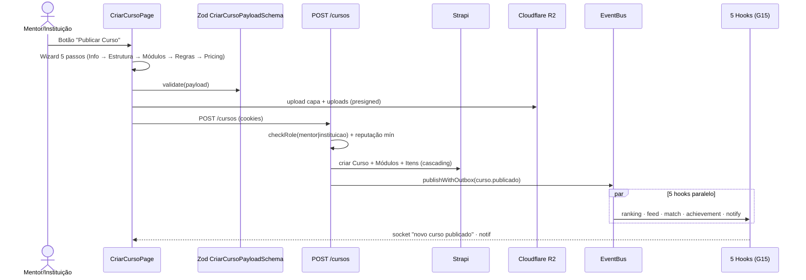

# G1 — Curso E2E Lifecycle (Mentor/Instituição → Estudante → Ecossistema)

## Status

Draft · Depende de `spec:G15`, `spec:E1`, `spec:E5` · Coordena com `spec:E3`.

## Estado actual auditado

- ✅ UI: file:apps/web/src/features/cursos/CriarCursoPage.tsx + file:apps/web/src/features/mentor/CriarCursoPage.tsx (drift duplicado), file:apps/web/src/features/cursos/CursoDetailPage.tsx, file:apps/web/src/features/cursos/CursoListPage.tsx, file:apps/web/src/features/cursos/ItemPlayer.tsx.
- ✅ Catálogo público + interior: file:apps/web/src/features/catalogo/CursoPublicoDetailPage.tsx, file:apps/web/src/features/catalogo/CursosCatalogoPage.tsx.
- ✅ Mentor management: file:apps/web/src/features/mentor/MentorCursosPage.tsx, `MentorAnalyticsPage.tsx`, `AlunosInscritosPage.tsx`.
- ✅ Strapi: file:infra/strapi/src/api/curso/.../schema.json, `modulo`, `modulo-item`, `inscricao`, `certificado`.
- ✅ Rota BFF: file:apps/api/src/routes/cursos.ts — **único route que invoca ****`eventBus.publishWithOutbox(CURSO_PUBLICADO, ...)`** (linha 192). Modelo de referência.
- 🟡 Schema Zod: `CriarCursoPayloadSchema` em file:packages/shared/src/cursos.ts.
- ❌ **Faltam eventos**: `curso.atualizado`, `curso.arquivado`, `curso.modulo.concluido`, `curso.concluido`, `curso.inscricao` (existe enum mas route POST `/inscricao` em linha 284 não emite).
- ❌ Lifecycle de submissão Comité para cursos com selo académico (não existe estado `review`).
- ❌ Bloqueio E2E: dois `CriarCursoPage` duplicados (mentor/ vs cursos/) é débito de governação UI.

## Estado canónico (spec:IMPORTANTE/04 §3.3)



## Tickets

### G1-T1 — Resolver duplicação `CriarCursoPage` (UI)

- Eliminar file:apps/web/src/features/mentor/CriarCursoPage.tsx.
- Manter file:apps/web/src/features/cursos/CriarCursoPage.tsx como única implementação, refactored para wizard 5 passos: Informação Básica · Estrutura · Módulos+Itens · Regras de Inscrição · Pricing.
- Alinhar com Soul & Elite: AsymmetricButton no CTA "Publicar", BentoGrid no resumo, AspirationalEmpty no estado vazio de módulos.
- **DoD E2E**:
  - **UI**: 1 página única, wizard 5 passos, 44px touch, zero hardcoded colors, mobile-first.
  - **Contrato**: `CriarCursoPayloadSchema` actualizado para suportar o passo de pricing (gratuito/pago + comissão).
  - **BFF**: POST `/cursos` aceita o novo schema.
  - **Persistência**: Strapi guarda + relations cascading (já funciona).
  - **Impacto**: zero divergência UI; só uma fonte de verdade.

### G1-T2 — Adicionar eventos canónicos restantes

- Emitir `curso.atualizado` em `PUT /cursos/:id` (linha 211).
- Emitir `curso.arquivado` em `PATCH /cursos/:id/estado` quando transição → `archived`.
- Emitir `curso.inscricao` em `POST /cursos/:id/inscricao` (linha 284) — actualmente silencioso.
- Emitir `curso.modulo.concluido` quando estudante completa módulo (novo route `POST /cursos/:id/modulos/:moduloId/concluido`).
- Emitir `curso.concluido` quando `progressoPercentual = 100` (lifecycle hook em `inscricao`).
- **DoD E2E**:
  - **Contrato**: 5 novos events em `@pdc/shared/domain-events.ts` (via `spec:G15-T1`).
  - **BFF**: cada route invoca `eventBus.publishWithOutbox`.
  - **Persistência**: outbox tem rasto.
  - **Impacto**: G15 hooks correm para cada operação; ranking re-avalia, feed actualiza, conquistas disparam.

### G1-T3 — Lifecycle Comité para cursos com selo académico (opt-in)

- Adicionar campo `requerValidacaoComite: boolean` no schema Strapi `curso` (default false).
- Se `true`: estado fica `review`, evento `curso.submetido_comite`, fila aparece em file:apps/web/src/features/comite/ValidacaoCientificaPage.tsx.
- Comité aprova → estado `approved`, evento `comite.aprovou` + `curso.publicado` (composto).
- **DoD E2E**:
  - **UI**: toggle no wizard de Pricing/Regras "Pedir validação do Comité Científico (selo académico)".
  - **Contrato**: schema novo.
  - **BFF**: novos endpoints `POST /comite/cursos/:id/aprovar` e `/rejeitar`.
  - **Persistência**: estado canónico draft → review → approved → published.
  - **Impacto**: cursos com selo recebem badge especial no feed e match terminal pondera-os com peso superior.

### G1-T4 — Página Interior do Curso (Player) Soul & Elite

- Refactor file:apps/web/src/features/cursos/ItemPlayer.tsx para Bento layout: sidebar com módulos + área central com vídeo/texto/quiz/tarefa + GlassCard lateral com Tina insights ancorados ao módulo.
- Estado de inscrito + acesso: lê de `/cursos/:id/interior` (criar se não existe).
- Telemetria por item: `curso.item.visualizado`, `curso.item.concluido`.
- **DoD E2E**:
  - **UI**: player mobile-first com tabs em mobile, sidebar em desktop.
  - **Contrato**: schema TelemetriaCursoItem.
  - **BFF**: GET `/cursos/:id/interior` valida inscrição; POST `/cursos/:id/itens/:itemId/concluido` persiste progresso e dispara evento.
  - **Persistência**: `inscricao.modulosConcluidos[]` actualizado.
  - **Impacto**: progresso 100% → `curso.concluido` → certificado gerado + conquista.

### G1-T5 — Tests E2E completos

- Playwright spec `tests/e2e/curso-lifecycle.spec.ts`: mentor cria → publica → estudante inscreve → completa → recebe certificado + conquista.
- Vitest integration: `eventBus.publishWithOutbox(CURSO_PUBLICADO)` → 5 hooks correm → `feed-entry` criado em `vocacional` ou `institucional` correctamente conforme tipo do autor.
- **DoD E2E**: testes passam em CI (smoke + full).

## Wireframe — Wizard de Criação de Curso (passo "Estrutura")

```wireframe
<html><head><style>
:root { --surface-canvas:#F8F9FA; --surface-elevated:#FAF6EE; --surface-recessed:#F2EFE8; --ink-primary:#2A2724; --ink-secondary:#5A5751; --ink-tertiary:#8A867F; --accent-terracotta:#D2691E; --accent-success:#2F7A4F; --radius-md:10px; --radius-lg:14px; --radius-asym-a:18px 6px 18px 6px; }
*{margin:0;padding:0;box-sizing:border-box} body{font-family:Inter,system-ui,sans-serif;background:var(--surface-canvas);color:var(--ink-primary);padding:20px;min-height:100vh}
.layout{max-width:1100px;margin:0 auto}
.wizard{display:flex;gap:12px;margin-bottom:24px}
.step{flex:1;padding:12px;border-radius:var(--radius-md);background:var(--surface-elevated);font:11px 'JetBrains Mono',monospace;color:var(--ink-tertiary);letter-spacing:.10em;text-align:center}
.step.active{background:var(--accent-terracotta);color:#FFFCF7;font-weight:600}
.step.done{background:rgba(47,122,79,.15);color:var(--accent-success)}
.h1{font-family:'Instrument Serif',Georgia,serif;font-size:28px;line-height:1.15;margin-bottom:6px}
.sub{font-size:13px;color:var(--ink-secondary);margin-bottom:24px}
.panel{background:var(--surface-elevated);border-radius:var(--radius-lg);padding:24px;margin-bottom:16px}
.module{background:var(--surface-recessed);border-radius:var(--radius-md);padding:16px;margin-bottom:12px}
.module-head{display:flex;justify-content:space-between;align-items:center;margin-bottom:12px}
.module-title{font:600 14px Inter}
.module-meta{font:10px 'JetBrains Mono',monospace;color:var(--ink-tertiary);letter-spacing:.08em}
.item{display:flex;align-items:center;gap:10px;padding:10px;background:var(--surface-elevated);border-radius:var(--radius-md);margin-bottom:6px;font-size:13px;min-height:44px}
.item-type{font:10px 'JetBrains Mono',monospace;color:var(--accent-terracotta);background:rgba(210,105,30,.10);padding:3px 8px;border-radius:999px;letter-spacing:.06em}
.item-name{flex:1;color:var(--ink-primary)}
.item-actions{display:flex;gap:6px}
.btn{font:500 12px Inter;padding:8px 12px;border-radius:var(--radius-md);border:1px solid rgba(42,39,36,.12);background:transparent;cursor:pointer;min-height:44px;color:var(--ink-secondary)}
.btn-add{font:500 13px Inter;padding:10px 14px;border:1px dashed var(--accent-terracotta);color:var(--accent-terracotta);background:transparent;border-radius:var(--radius-md);cursor:pointer;min-height:44px;width:100%;margin-top:6px}
.btn-add-mod{font:600 14px Inter;padding:12px 18px;background:var(--accent-terracotta);color:#FFFCF7;border:none;border-radius:var(--radius-asym-a);cursor:pointer;min-height:44px;display:block;margin:16px auto 0}
.actions{display:flex;justify-content:space-between;margin-top:24px}
</style></head><body>
<div class="layout">
  <div class="wizard">
    <div class="step done" data-element-id="step-1">1. INFO ✓</div>
    <div class="step active" data-element-id="step-2">2. ESTRUTURA</div>
    <div class="step" data-element-id="step-3">3. REGRAS</div>
    <div class="step" data-element-id="step-4">4. PRICING</div>
    <div class="step" data-element-id="step-5">5. REVISÃO</div>
  </div>
  <h1 class="h1">Estrutura do Curso</h1>
  <p class="sub">Adiciona módulos e dentro de cada um os teus itens (vídeo, PDF, quiz, tarefa, lab externo).</p>
  <div class="panel">
    <div class="module">
      <div class="module-head"><div class="module-title">Módulo 1 · Fundamentos de Cálculo Estrutural</div><div class="module-meta">3 ITENS · 45 MIN</div></div>
      <div class="item"><span class="item-type">VÍDEO</span><span class="item-name">Introdução: Forças e Momentos</span><div class="item-actions"><button class="btn" data-element-id="m1-i1-edit">Editar</button></div></div>
      <div class="item"><span class="item-type">PDF</span><span class="item-name">Tabelas de Dimensionamento (NBR 8800)</span><div class="item-actions"><button class="btn" data-element-id="m1-i2-edit">Editar</button></div></div>
      <div class="item"><span class="item-type">QUIZ</span><span class="item-name">Verificação de Conhecimento (5 perguntas)</span><div class="item-actions"><button class="btn" data-element-id="m1-i3-edit">Editar</button></div></div>
      <button class="btn-add" data-element-id="m1-add-item">+ Adicionar Item</button>
    </div>
    <div class="module">
      <div class="module-head"><div class="module-title">Módulo 2 · Cálculo de Vigas Reais</div><div class="module-meta">2 ITENS · 30 MIN</div></div>
      <div class="item"><span class="item-type">TAREFA</span><span class="item-name">Dimensiona uma viga de 6m com carga distribuída</span><div class="item-actions"><button class="btn" data-element-id="m2-i1-edit">Editar</button></div></div>
      <div class="item"><span class="item-type">LAB</span><span class="item-name">Simulador de Carga (iframe externo)</span><div class="item-actions"><button class="btn" data-element-id="m2-i2-edit">Editar</button></div></div>
      <button class="btn-add" data-element-id="m2-add-item">+ Adicionar Item</button>
    </div>
    <button class="btn-add-mod" data-element-id="add-module">+ Novo Módulo</button>
  </div>
  <div class="actions"><button class="btn" data-element-id="back">← Anterior</button><button class="btn" style="background:var(--accent-terracotta);color:#FFFCF7;border:none;border-radius:var(--radius-asym-a);font-weight:600" data-element-id="next">Próximo: Regras →</button></div>
</div></body></html>
```

## Eventos canónicos (do contrato `spec:G15`)

- **Emite**: `curso.publicado`, `curso.atualizado`, `curso.arquivado`, `curso.inscricao`, `curso.modulo.concluido`, `curso.concluido`, `curso.submetido_comite`, `comite.aprovou` (quando aplicável).
- **Hooks que activa** (G15): Ranking (autor) · Feed (Vocacional ou Institucional conforme regra Verdade Lateral 2) · Match (sugere a estudantes da área com tier ≥ Bronze) · Achievement (`primeiro-curso`, `5-cursos-publicados` para mentores) · Notify (autor, seguidores, instituição vinculada).