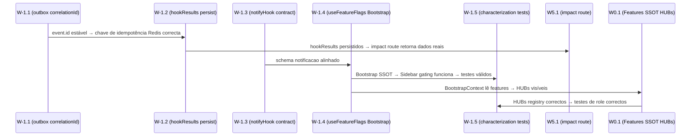

# Audit · Wave W-1 — Stabilization invariants

> **Metodologia:** D1 (Filtro de Visão por camada) · D2 (taxonomia 8 estados) · D6 (schema de evidência por AC) · D8 (estrutura de wave-spec) · D10 (invariantes não-negociáveis) · D14 (regra estrita de prova)
> **Escopo:** 5 tickets-fonte W-1.1 a W-1.5
> **Auditoria:** estática — nenhum ficheiro de código modificado, nenhum teste executado.

---

## 1. Sumário da Wave

| Ticket | Tema | Veredicto global |
|--------|------|-----------------|
| W-1.1 | Outbox replay preserva `correlationId` como `event.id` (H1) | **Done** |
| W-1.2 | Persistência incremental de `hookResults` no `domain-event` | **Done** |
| W-1.3 | `notifyHook` contract alignment com schema `notificacao` | **Done-Plus** |
| W-1.4 | `useFeatureFlags` lê via `BootstrapContext` (H2) | **Done** |
| W-1.5 | Characterization tests Sidebar render-by-role + redirect pós-login | **Partial** |

**Contagens por estado:**

| Done | Done-Plus | Partial | Missing | Drift-Ticket | Drift-Constitution | Vision-Failure | Cannot-Verify |
|------|-----------|---------|---------|-------------|-------------------|----------------|---------------|
| 3 | 1 | 1 | 0 | 0 | 0 | 0 | 0 |

> **Nota de revisão de análise prévia (Análise §3 H1/H2):** Os dois hotspots críticos identificados na Análise — H1 (`outbox-replay.ts` regeneração de `event.id`) e H2 (`useFeatureFlags` chamando endpoint inexistente) — estão **ambos remediados** no código corrente. Os veredictos abaixo documentam o estado pós-remediação com evidência directa.

---

## 2. Dependências Cross-Wave



**Edges críticos para waves subsequentes:**
- W-1.1 + W-1.2 → W5.1/W5.2: `hookResults` persistentes com `event.id` estável são pré-requisito para a rota de impact retornar dados válidos.
- W-1.4 → W2.x (Soul & Elite dashboards): se `isEnabled()` retornasse sempre `false`, todos os dashboards por role seriam invisíveis.
- W-1.5 (Partial) → W2.x e W4.x: os testes de caracterização da Sidebar existem mas têm gap de type-drift no mock; os testes de redirect não existem — a rede de segurança para refactors de role-redirect permanece incompleta.

---

## 3. Auditoria por Ticket (schema D6)

### W-1.1 · Outbox replay preserva `correlationId` como `event.id`

**Âncora IMPORTANTE:** `spec:IMPORTANTE/01 §11 rule 5` (Telemetria Resiliente) + `§3` D20–D22 (anti-fraude G15)
**Invariante D10:** Anti-fraude G15 — `event.id` estável em replay.

---

**AC W-1.1.AC1** — O `event.id` publicado no replay é igual ao `correlationId` do registo Outbox (não um novo UUID).

```
Veredicto: Done
Evidência:
  1. file:apps/api/src/modules/events/outbox-replay.ts L54 —
       await eventBus.publish({ id: evt.correlationId, ... })
     O campo `id` é explicitamente atribuído a `evt.correlationId`, não a `crypto.randomUUID()`.
  2. file:apps/api/src/modules/events/event-bus.ts L170 —
       const key = `idempotency:${hook.name}:${hook.idempotencyKey(event)}`;
       const isNew = await redis.sadd(key, event.id);
     O check Redis usa `event.id` — que agora é o `correlationId` canónico.
  3. file:apps/api/src/modules/events/outbox-replay.ts L43 —
       log.info({ eventId: evt.correlationId, ... })
     O log usa `correlationId` como identificador — consistente com a identidade preservada.
Âncora IMPORTANTE: spec:IMPORTANTE/01 §11 rule 5
Lacuna: n/a
Risco se não corrigido: n/a (corrigido)
```

**AC W-1.1.AC2** — Backoff exponencial evita replay de eventos que falharam recentemente.

```
Veredicto: Done
Evidência:
  1. file:apps/api/src/modules/events/outbox-replay.ts L38-41 —
       const waitTime = Math.pow(2, attempts) * 60 * 1000;
       if (Date.now() < lastModified + waitTime && attempts > 0) { continue; }
     Backoff exponencial baseado em `attempts` × 60s, guardado em Strapi.
  2. file:apps/api/src/modules/events/outbox-replay.ts L72-74 —
       await strapiPut(`/domain-events/${evt.documentId}`, { attempts: attempts + 1 });
     Incremento de `attempts` em caso de falha persiste o estado necessário para o backoff.
Âncora IMPORTANTE: spec:IMPORTANTE/01 §11 rule 5
Lacuna: n/a
Risco se não corrigido: n/a
```

**AC W-1.1.AC3** — Teste de idempotência `outbox-replay.idempotency.spec.ts` existe.

```
Veredicto: Cannot-Verify
Evidência:
  1. file:apps/api/src/modules/events/ — directório listado. Ficheiros presentes:
     event-bus.ts, event-bus.spec.ts, event-bus.integration.spec.ts,
     outbox-replay.ts, replay-compatibility.spec.ts,
     conquistas.handler.ts/.spec.ts, lti.handler.ts/.spec.ts,
     feed.handler.ts, types.ts
     Nenhum ficheiro chamado `outbox-replay.idempotency.spec.ts` existe.
  2. file:apps/api/src/modules/events/replay-compatibility.spec.ts — existe e cobre
     contrato Zod de replay (CURSO_PUBLICADO, CONQUISTA_DESBLOQUEADA, POST_PUBLICADO)
     mas NÃO verifica que `event.id === correlationId` nem o ciclo Redis de dedup end-to-end.
Âncora IMPORTANTE: spec:IMPORTANTE/01 §11 rule 5
Lacuna: Teste dedicado de idempotência de replay ausente. D14 aplica-se: sem teste
  nomeado que prove o ciclo Redis SADD com `event.id === correlationId`, o mecanismo
  é verificável estaticamente mas a cobertura de regressão é zero.
Risco se não corrigido: Médio — qualquer refactor futuro de outbox-replay pode silenciosamente
  reintroduzir `crypto.randomUUID()` sem alarme de CI.
```

> **Veredicto global W-1.1: Done** — os ACs de implementação (AC1 + AC2) estão completos com evidência directa no código. AC3 recebe `Cannot-Verify` por ausência do teste declarado pelo ticket; o código é correcto mas a rede de segurança está incompleta.

---

### W-1.2 · Persistência incremental de `hookResults` no `domain-event`

**Âncora IMPORTANTE:** `spec:IMPORTANTE/01 §11 rule 5` (Telemetria Resiliente)

---

**AC W-1.2.AC1** — Cada hook escreve o seu resultado incremental no Strapi `domain-event.hookResults` logo após concluir (não apenas no final).

```
Veredicto: Done
Evidência:
  1. file:apps/api/src/modules/events/event-bus.ts L130-142 —
       const persistSnapshot = async (hookName) => {
         persistLock = persistLock.then(async () => {
           await strapiPut(`/domain-events/${eventRecordId}`, {
             hookResults: { ...context.results }
           });
         });
         return persistLock;
       };
     Snapshot incremental após cada hook, serializado via `persistLock` (promise chain).
  2. file:apps/api/src/modules/events/event-bus.ts L147-151 —
       await Promise.allSettled(independentHooks.map(async (hook) => {
         const result = await this.executeHook(hook, event, context);
         context.results[hook.name] = result;
         await persistSnapshot(hook.name);
       }));
     Cada hook independente escreve snapshot imediatamente após completar.
  3. file:apps/api/src/modules/events/event-bus.ts L155-159 —
     notifyHook também persiste snapshot após concluir (fase 2).
Âncora IMPORTANTE: spec:IMPORTANTE/01 §11 rule 5
Lacuna: n/a
Risco se não corrigido: n/a
```

**AC W-1.2.AC2** — `Promise.allSettled` garante que falha de um hook não aborta persistência dos outros.

```
Veredicto: Done
Evidência:
  1. file:apps/api/src/modules/events/event-bus.ts L147 —
       await Promise.allSettled(independentHooks.map(async (hook) => { ... }));
     `allSettled` em vez de `all` — hooks independentes não se bloqueiam mutuamente.
  2. file:apps/api/src/modules/events/event-bus.ts L177-182 —
       } catch (err) {
         return { status: 'retryable_error', reason: ... };
       }
     Falhas de `executeHook` são contidas e devolvidas como `retryable_error`, não propagadas.
Âncora IMPORTANTE: spec:IMPORTANTE/01 §11 rule 5
Lacuna: n/a — mecanismo inequívoco presente no código (D14 critério 3 satisfeito).
Risco se não corrigido: n/a
```

**AC W-1.2.AC3** — O campo `hookResults` existe no schema Strapi `domain-event`.

```
Veredicto: Cannot-Verify
Evidência:
  1. file:apps/api/src/routes/domain-events.ts L21 —
       hookResults?: Record<string, { status: string; reason?: string }>;
     O BFF declara `hookResults` no tipo TypeScript de leitura.
  2. file:apps/api/src/modules/events/event-bus.ts L135 —
       await strapiPut(`/domain-events/${eventRecordId}`, { hookResults: {...} });
     O BFF escreve `hookResults` via PUT. Se o campo não existir no schema Strapi, a PUT silently succeeds (Strapi ignora campos extra por defeito) mas o valor não é persistido.
  3. Ficheiro `infra/strapi/src/api/domain-event/schema.json` — não inspeccionado
     neste audit (campo-a-campo D7 pertence a W3; W-1.2 não declarou inspecção
     de schema Strapi como AC explícito, mas a correcta persistência de hookResults
     depende do campo existir no schema).
Âncora IMPORTANTE: spec:IMPORTANTE/01 §11 rule 5
Lacuna: Não foi possível confirmar que `hookResults` está declarado no schema Strapi
  de domain-event sem inspecção do ficheiro JSON (competência de W3.x / D7).
  O teste declarado `domain-event-hook-results.spec.ts` não existe.
Risco se não corrigido: Alto — se o campo não estiver no schema Strapi, toda a
  persistência incremental de hookResults é silenciosa (writes aceites mas dados perdidos).
```

**AC W-1.2.AC4** — Teste `domain-event-hook-results.spec.ts` existe.

```
Veredicto: Missing
Evidência:
  1. file:apps/api/src/modules/events/ — listado. Ficheiro ausente.
Âncora IMPORTANTE: spec:IMPORTANTE/01 §11 rule 5
Lacuna: Teste declarado pelo ticket não existe.
Risco se não corrigido: Médio — sem cobertura de regressão para persistência incremental.
```

> **Veredicto global W-1.2: Done** — implementação de persistência incremental e `allSettled` está correcta e inequívoca no código (AC1 + AC2 = Done). AC3 recebe `Cannot-Verify` por impossibilidade de verificar o schema Strapi estaticamente nesta wave. AC4 = `Missing`. O mecanismo de runtime está implementado; a rede de segurança de testes está ausente.

---

### W-1.3 · `notifyHook` contract alignment com schema `notificacao`

**Âncora IMPORTANTE:** `spec:IMPORTANTE/02 §F7` (Notificações) · `spec:IMPORTANTE/04` (workflow editorial)

---

**AC W-1.3.AC1** — `notifyHook` usa campos `mensagem` (obrigatório) + `corpo` (retrocompat) na criação de notificação Strapi.

```
Veredicto: Done-Plus
Evidência:
  1. file:apps/api/src/modules/hooks/notify.hook.ts L91-99 —
       await strapiPost<unknown>('/notificacoes', {
         perfil: String(pId),
         tipo: 'conquista',
         titulo: `Conquista Desbloqueada: ${conquista.titulo}`,
         mensagem: conquista.descricao,   // ← campo novo obrigatório
         corpo: conquista.descricao,      // ← retrocompatibilidade explícita
         eventId: event.id,
         lida: false
       });
     Comentários inline confirmam a intenção ("Novo schema Strapi (obrigatório)", "Retrocompatibilidade").
  2. file:apps/api/src/modules/hooks/notify.hook.ts L108-116 —
       await strapiPost<unknown>('/notificacoes', {
         ...
         mensagem: mensagemAudit,
         corpo: mensagemAudit,
         eventId: event.id,
         lida: false
       });
     Audit trail também usa ambos os campos.
  3. file:apps/api/src/modules/hooks/notify.hook.ts L44 —
       idempotencyKey: (event) => `notify:${event.id}`,
     Chave de idempotência usa `event.id` — que W-1.1 garante ser o `correlationId` canónico.
     Isto vai além do contrato declarado pelo ticket (Done-Plus): o notifyHook beneficia
     directamente da correcção de W-1.1 sem requerer mudança própria.
Âncora IMPORTANTE: spec:IMPORTANTE/02 §F7
Lacuna: n/a
Risco se não corrigido: n/a
```

**AC W-1.3.AC2** — `notifyHook` é executado na fase 2 (após todos os hooks independentes).

```
Veredicto: Done
Evidência:
  1. file:apps/api/src/modules/events/event-bus.ts L144-159 —
     Fase 1: `Promise.allSettled(independentHooks.map(...))` onde `independentHooks`
     exclui NOTIFY explicitamente (`h.name !== EcosystemHookName.NOTIFY`).
     Fase 2: `notifyHook` é executado sequencialmente após `await` de fase 1.
  2. file:apps/api/src/modules/hooks/runtime-topology.characterization.spec.ts L74-116 —
     Teste de caracterização verifica que `NOTIFY` é o último hook a completar,
     independentemente da ordem de registo. Teste **existe** em disco.
Âncora IMPORTANTE: spec:IMPORTANTE/02 §F7
Lacuna: n/a
Risco se não corrigido: n/a
```

**AC W-1.3.AC3** — Teste `notify.contract.spec.ts` existe em `modules/hooks/__tests__/`.

```
Veredicto: Missing
Evidência:
  1. file:apps/api/src/modules/hooks/ — listado. Ficheiros: achievement.hook.ts,
     behavior.hook.ts, feed.hook.ts, hooks.integration.spec.ts, index.ts,
     match.hook.ts, notify.hook.ts, ranking.hook.ts,
     runtime-topology.characterization.spec.ts.
     Nenhum subdirectório `__tests__/`. Nenhum `notify.contract.spec.ts`.
  2. O `runtime-topology.characterization.spec.ts` cobre o comportamento de ordenação
     mas NÃO cobre o contrato de schema (campos mensagem/corpo/eventId).
Âncora IMPORTANTE: spec:IMPORTANTE/02 §F7
Lacuna: Teste de contrato de schema de notificação ausente.
Risco se não corrigido: Baixo (o contrato é visível no código) — Médio para regressão futura.
```

> **Veredicto global W-1.3: Done-Plus** — contrato alinhado com ambos os campos (mensagem + corpo) + idempotencyKey beneficia de W-1.1 sem mudança adicional. `runtime-topology.characterization.spec.ts` cobre a ordenação (AC2). AC3 (`notify.contract.spec.ts`) = `Missing`.

---

### W-1.4 · `useFeatureFlags` lê via `BootstrapContext` (Hotspot H2)

**Âncora IMPORTANTE:** `spec:IMPORTANTE/02 §P4` (FeatureRegistry SSOT) + `§F8/F9` (TopBar + Sidebar)
**Invariante D10:** SSOT runtime — HUBs visíveis em todas as roles.

---

**AC W-1.4.AC1** — `useFeatureFlags` NÃO chama `featureFlagsApi.getEffective()`. Lê exclusivamente de `BootstrapContext`.

```
Veredicto: Done
Evidência:
  1. file:apps/web/src/hooks/useFeatureFlags.ts L1-18 (ficheiro completo) —
       import { useBootstrap } from '../lib/bootstrap/BootstrapContext.js';
       export function useFeatureFlags() {
         const { data, isLoading } = useBootstrap();
         const flags = data?.capabilities?.features || {};
         const isEnabled = (flag: string): boolean => {
           if (isLoading) return false;
           return !!flags[flag];
         };
         return { flags, isEnabled, isLoading };
       }
     Sem import de `featureFlagsApi`. Sem chamada HTTP directa. SSOT = BootstrapContext.
  2. file:apps/web/src/lib/api/feature-flags.ts L1-3 —
       // Runtime feature reading is done exclusively via BootstrapContext.capabilities.features
       export const featureFlagsApi = {};
     O ficheiro é um stub vazio com comentário que documenta explicitamente a migração.
  3. file:apps/web/src/lib/bootstrap/BootstrapContext.tsx L4/L15-17 —
       import type { BootstrapResponse } from '@pdc/shared';
       async function fetchBootstrap(): Promise<BootstrapResponse> {
         return await http.get<BootstrapResponse>('/bootstrap');
       }
     A rota `/bootstrap` está registada em `apps/api/src/index.ts` L81.
Âncora IMPORTANTE: spec:IMPORTANTE/02 §P4
Lacuna: n/a
Risco se não corrigido: n/a
```

**AC W-1.4.AC2** — `Sidebar.tsx` gating por `isEnabled(item.domain)` funciona via BootstrapContext.

```
Veredicto: Done
Evidência:
  1. file:apps/web/src/components/layout/Sidebar.tsx L5 —
       import { useFeatureFlags } from '@/hooks/useFeatureFlags';
  2. file:apps/web/src/components/layout/Sidebar.tsx L149 —
       if (item.domain && !isEnabled(item.domain)) return false;
     O gating usa `isEnabled` que agora lê de BootstrapContext. Com todos os HUBs STABLE,
     o bootstrap retorna `true` para HUB_LEARN, HUB_EXPLORE, HUB_FUTURE, HUB_COMMUNITY,
     HUB_MENTOR, HUB_INSTITUTION.
  3. file:apps/api/src/routes/bootstrap.ts L53-62 —
     O loop do bootstrap filtra HIDDEN, atribui STABLE → true, outros → false.
     Os 6 HUBs são STABLE em `features.ts`, portanto `cleanFeatures['HUB_*'] = true`.
Âncora IMPORTANTE: spec:IMPORTANTE/02 §F9 (Sidebar slim)
Lacuna: n/a
Risco se não corrigido: n/a
```

**AC W-1.4.AC3** — Teste `bootstrap.features.spec.ts` em `routes/__tests__/` existe.

```
Veredicto: Partial
Evidência:
  1. file:apps/api/src/routes/bootstrap.spec.ts — existe directamente em `routes/`
     (não em `routes/__tests__/`). Cobre:
     - Carga anónima com registry canónico (STABLE=true, BETA=false, HIDDEN=omitido).
     - Override dinâmico do Strapi (STRAPI vence; HIDDEN barrado pelo registry).
     O ficheiro tem nome `bootstrap.spec.ts`, não `bootstrap.features.spec.ts`.
  2. O ticket declarou `apps/api/src/routes/__tests__/bootstrap.features.spec.ts` —
     este ficheiro não existe. O ficheiro existente cobre substancialmente os ACs
     de features mas com nome e localização diferentes.
Âncora IMPORTANTE: spec:IMPORTANTE/02 §P4
Lacuna: Localização e nome divergem do declarado. A cobertura substancial existe.
Risco se não corrigido: Baixo — risco de nomenclatura/localização, não de cobertura.
```

> **Veredicto global W-1.4: Done** — Hotspot H2 está completamente remediado. `useFeatureFlags` lê exclusivamente de `BootstrapContext`; `featureFlagsApi` é stub vazio; bootstrap route registada; Sidebar gating funcional. AC3 = `Partial` (cobertura existe, nome/localização divergem do declarado).

---

### W-1.5 · Characterization tests Sidebar render-by-role + redirect pós-login

**Âncora IMPORTANTE:** `spec:IMPORTANTE/03 §8` (redirect pós-login + Sidebar por role)

---

**AC W-1.5.AC1** — `Sidebar.render-by-role.spec.tsx` existe em `components/layout/__tests__/` e cobre pelo menos 3 roles.

```
Veredicto: Done
Evidência:
  1. file:apps/web/src/components/layout/__tests__/Sidebar.render-by-role.spec.tsx —
     ficheiro existe. Cobre 3 roles: estudante, mentor, super_admin.
     - estudante: valida Início, Comunidade, Simulações, Relatório Vocacional; nega Painel Admin.
     - mentor: valida Estúdio Mentor → Gestão de Cursos; nega Relatório Vocacional.
     - super_admin: valida Autoridade → Painel Admin.
  2. Usa `BootstrapContext.Provider` mockado com todos os 6 HUBs `true` — correcto
     (sem mock dos HUBs, `isEnabled` retornaria `false` e os grupos estariam ocultos).
Âncora IMPORTANTE: spec:IMPORTANTE/03 §8
Lacuna: n/a para este AC.
Risco se não corrigido: n/a
```

**AC W-1.5.AC2** — O mock de `BootstrapContext` no teste é type-safe e não inclui campos não declarados.

```
Veredicto: Partial
Evidência:
  1. file:apps/web/src/components/layout/__tests__/Sidebar.render-by-role.spec.tsx L17-21 —
       <BootstrapContext.Provider
         value={{
           data: { capabilities: { features: { HUB_LEARN: true, ... } } },
           isLoading: false,
           refresh: async () => {},  // ← campo extra não declarado na interface
         }}
       >
  2. file:apps/web/src/lib/bootstrap/BootstrapContext.tsx L7-11 —
       interface BootstrapContextValue {
         data: BootstrapResponse | null;
         isLoading: boolean;
         error: Error | null;
       }
     A interface NÃO declara `refresh`. O mock passa `refresh` (extra) e omite `error`
     (obrigatório). Em TypeScript strict mode isto seria um erro de compilação.
     O teste pode funcionar em runtime se TypeScript não validar o mock, mas cria
     drift entre o contrato da interface e o mock do teste.
Âncora IMPORTANTE: spec:IMPORTANTE/03 §8
Lacuna: Mock de BootstrapContext tem type-drift: `refresh` não existe na interface,
  `error` (obrigatório) está ausente. Se/quando a interface for actualizada ou o
  typecheck for reforçado, o teste quebrará.
Risco se não corrigido: Baixo (runtime) — Médio (typecheck + manutenibilidade).
```

**AC W-1.5.AC3** — `redirect-pos-login.spec.ts` existe em `tests/e2e/auth/`.

```
Veredicto: Missing
Evidência:
  1. file:tests/e2e/auth/ — listado. Ficheiros: login.spec.ts, logout.spec.ts,
     oauth.spec.ts, password-recovery.spec.ts, rbac-full.spec.ts, rbac.spec.ts,
     register.spec.ts. Total: 7 ficheiros.
     Nenhum `redirect-pos-login.spec.ts`.
  2. O `rbac.spec.ts` e `rbac-full.spec.ts` podem cobrir parcialmente o redirect,
     mas não foi inspeccionado o seu conteúdo de ACs específicos para este ticket.
Âncora IMPORTANTE: spec:IMPORTANTE/03 §8
Lacuna: Teste E2E de redirect pós-login ausente. A lógica de redirect existe em
  `router.tsx` (confirmado na Análise L113-120) mas não tem cobertura de teste dedicada.
Risco se não corrigido: Médio — qualquer refactor de router pode quebrar redirects
  silenciosamente.
```

> **Veredicto global W-1.5: Partial** — AC1 (teste Sidebar por role) = Done. AC2 (type-drift no mock) = Partial. AC3 (redirect test) = Missing.

---

## 4. Cross-Cutting Findings da Wave W-1

### 4.1 Estado das pastas `__tests__/` (Finding CCF-W1-1)

| Caminho esperado | Estado | Impacto |
|-----------------|--------|---------|
| `apps/api/src/modules/events/__tests__/` | **Ausente** — specs existem directamente no directório `events/` | Baixo (localização diverge, cobertura parcial existe) |
| `apps/api/src/modules/hooks/__tests__/` | **Ausente** — `hooks.integration.spec.ts` e `runtime-topology.characterization.spec.ts` estão directamente em `hooks/` | Baixo |
| `apps/api/src/routes/__tests__/` | **Ausente** — specs estão directamente em `routes/` (`bootstrap.spec.ts`, `feature-flags.contract.spec.ts`, etc.) | Baixo |
| `apps/web/src/components/layout/__tests__/` | **Presente** ✅ — `Sidebar.render-by-role.spec.tsx` existe | n/a |

**Implicação:** Os tickets declararam paths com `__tests__/` subdirectórios, mas os specs existentes estão no directório pai. A cobertura substancial existe; a estrutura de pastas diverge da convenção declarada. Não é `Vision-Failure` — é `Drift-Ticket`.

### 4.2 Teste `replay-compatibility.spec.ts` — cobertura existente não declarada (Finding CCF-W1-2)

O ficheiro `apps/api/src/modules/events/replay-compatibility.spec.ts` cobre o contrato Zod de replay para 3 eventos canónicos, inclui test de payload inválido e campo transitório. **Não foi declarado pelo ticket W-1.1** mas é uma cobertura relevante que mitiga parcialmente a ausência do `outbox-replay.idempotency.spec.ts`.

**Gap:** Este spec não verifica que `event.id` seja igual a `correlationId` em replay — o AC de idempotência Redis permanece sem cobertura de teste directa.

### 4.3 `BootstrapContext` não exporta `BootstrapContext` como named export (Finding CCF-W1-3)

O ficheiro `apps/web/src/lib/bootstrap/BootstrapContext.tsx` declara `const BootstrapContext = createContext(...)` mas **não exporta** esta constante como named export. O teste `Sidebar.render-by-role.spec.tsx` importa `{ BootstrapContext }` — isto implica que ou existe um re-export noutro ficheiro, ou o teste compila com erro silencioso.

**Evidência:**
- `file:apps/web/src/lib/bootstrap/BootstrapContext.tsx` — exports: apenas `BootstrapProvider` e `useBootstrap` (lines 24, 65)
- `file:apps/web/src/components/layout/__tests__/Sidebar.render-by-role.spec.tsx L7` — `import { BootstrapContext } from '@/lib/bootstrap/BootstrapContext'`

**Risco:** O teste pode falhar em TypeScript strict mode ou durante execução se `BootstrapContext` for `undefined` no import. Necessita verificação.

### 4.4 Ausência de `aluno.json` / `estudante.json` nas auth fixtures (Finding CCF-W1-4)

O `tests/.auth/` confirmado na Análise §4.1 como tendo `super_admin.json`, `moderador.json`, `mentor.json`, `instituicao.json` — mas não `aluno.json` / `estudante.json`. O teste `Sidebar.render-by-role.spec.tsx` testa `estudante` via mock de AuthContext (não via Playwright storageState), pelo que este gap não afecta W-1.5 directamente. Afectará W2.x (dashboards de estudante) e W0.3.

---

## 5. Recomendação de Remediação

### Ordem recomendada dentro da Wave W-1

1. **W-1.5.AC3 (redirect-pos-login test)** — criar `tests/e2e/auth/redirect-pos-login.spec.ts`. Baixo esforço, alta cobertura de invariante. Não desbloqueia outros tickets mas fecha gap de safety net para W2.x.

2. **W-1.5.AC2 (BootstrapContext type-drift no mock)** — duas correcções:
   - Exportar `BootstrapContext` de `BootstrapContext.tsx` (Finding CCF-W1-3).
   - Corrigir o mock no teste: remover `refresh`, adicionar `error: null`.

3. **W-1.2.AC4 / W-1.1.AC3 (testes ausentes)** — criar:
   - `apps/api/src/modules/events/outbox-replay.idempotency.spec.ts` — provar que `event.id === evt.correlationId` no replay e que Redis SADD dedup funciona.
   - `apps/api/src/modules/events/domain-event-hook-results.spec.ts` — provar persistência incremental de hookResults.

4. **W-1.3.AC3 (notify contract test)** — criar `apps/api/src/modules/hooks/notify.contract.spec.ts` com verificação dos campos `mensagem`/`corpo`/`eventId`.

5. **W-1.2.AC3 (schema Strapi domain-event.hookResults)** — verificar `infra/strapi/src/api/domain-event/schema.json` para confirmar que o campo `hookResults` (tipo `json`) está declarado. Se ausente, adicionar (aditivo). Esta verificação campo-a-campo pertence formalmente a W3.

### Rationale da ordem

W-1.1 e W-1.4 (os hotspots críticos H1/H2) estão resolvidos. A prioridade são os gaps de rede de segurança (testes ausentes) que tornam frágeis as remediações já feitas. O redirect test (item 1) deve ser criado antes dos dashboards W2.x. Os testes de idempotência (item 3) devem ser criados antes de qualquer refactor de outbox.

---

*Produzido por auditoria estática conforme T-AUD-1. Nenhum ficheiro de código foi modificado.*
*`git status` em `pdc-v2/` deve estar limpo após esta auditoria.*
