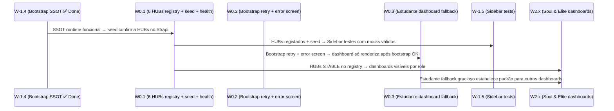

# Audit · Wave W0 — Bootstrap & Foundation

> **Metodologia:** D1 (Filtro de Visão por camada) · D2 (taxonomia 8 estados) · D6 (schema de evidência por AC) · D8 (estrutura de wave-spec) · D10 (invariantes não-negociáveis) · D13 (cascata: lido após T-AUD-1) · D14 (regra estrita de prova)
> **Escopo:** 3 tickets-fonte W0.1 a W0.3
> **Cascata D13:** spec `Audit · Wave W-1` consultado antes de emitir veredictos — W-1.4 = **Done** (H2 remediado).
> **Auditoria:** estática — nenhum ficheiro de código modificado, nenhum teste executado.

---

## 1. Sumário da Wave

| Ticket | Tema | Veredicto global |
|--------|------|-----------------|
| W0.1 | Registo dos 6 `HUB_*` no Features SSOT + seed Strapi + `/health/feature-registry` | **Done** |
| W0.2 | `BootstrapContext` retry 1→3 + `BootstrapErrorScreen` premium | **Partial** |
| W0.3 | `/estudante/dashboard` fallback gracioso + `AspirationalEmpty` para tiles vazios | **Partial** |

**Contagens por estado:**

| Done | Done-Plus | Partial | Missing | Drift-Ticket | Drift-Constitution | Vision-Failure | Cannot-Verify |
|------|-----------|---------|---------|-------------|-------------------|----------------|---------------|
| 1 | 0 | 2 | 0 | 0 | 0 | 0 | 0 |

> **Nota de cascata D13:** W-1.4 foi marcado **Done** no spec T-AUD-1 — `useFeatureFlags` lê exclusivamente de `BootstrapContext`. Logo, W0.1 (que depende desta SSOT estar funcional) herda a dependência cumprida. Não há herança quebrada a registar.

---

## 2. Dependências Cross-Wave



**Edges relevantes para waves seguintes:**
- W0.1: seed `seed-hubs.ts` e `/health/feature-registry` estão implementados — W3.7 (schema-drift health) pode reutilizar o padrão.
- W0.2 (`BootstrapErrorScreen` como FIXME stub): todos os dashboards W2.x dependem do bootstrap funcionar. Se o error screen for um stub, o fallback premium prometido ao utilizador não existe.
- W0.3: `EstudanteDashboard` usa `QuietEmpty` mas o ticket declarou `AspirationalEmpty` — `MentorDashboard` usa `AspirationalEmpty` correctamente, confirmando que o componente existe.

---

## 3. Auditoria por Ticket (schema D6)

### W0.1 · Registo dos 6 `HUB_*` no Features SSOT + seed Strapi + `/health/feature-registry`

**Âncora IMPORTANTE:** `spec:IMPORTANTE/01 §11 rule 1` (SSOT) + `spec:IMPORTANTE/02 §P4` (FeatureRegistry SSOT)
**Cascata D13:** W-1.4 = Done — runtime SSOT funcional. W0.1 constrói em cima disso.

---

**AC W0.1.AC1** — Os 6 `HUB_*` estão registados em `packages/shared/src/registry/features.ts` com status `STABLE`.

```
Veredicto: Done
Evidência:
  1. file:packages/shared/src/registry/features.ts L27-33 —
       'HUB_LEARN': 'STABLE',
       'HUB_EXPLORE': 'STABLE',
       'HUB_FUTURE': 'STABLE',
       'HUB_COMMUNITY': 'STABLE',
       'HUB_MENTOR': 'STABLE',
       'HUB_INSTITUTION': 'STABLE',
     Todos os 6 HUBs presentes com status STABLE. Excelência completa do registo.
  2. file:apps/api/src/routes/bootstrap.ts L53-62 —
     Loop itera sobre `Features` e atribui STABLE → true no cleanFeatures.
     Os 6 HUBs serão `true` em qualquer resposta de bootstrap sem override Strapi.
  3. file:apps/web/src/hooks/useFeatureFlags.ts L5 (via W-1.4 Done) —
     `const flags = data?.capabilities?.features || {}` lê directamente de bootstrap.
Âncora IMPORTANTE: spec:IMPORTANTE/02 §P4
Lacuna: n/a
Risco se não corrigido: n/a
```

**AC W0.1.AC2** — `infra/strapi/scripts/seed-hubs.ts` existe e cobre os 6 HUBs com idempotência (upsert sem duplicar).

```
Veredicto: Done
Evidência:
  1. file:infra/strapi/scripts/seed-hubs.ts L30-37 —
       const HUBS = [
         { domain: 'HUB_LEARN', ... },
         { domain: 'HUB_EXPLORE', ... },
         { domain: 'HUB_FUTURE', ... },
         { domain: 'HUB_COMMUNITY', ... },
         { domain: 'HUB_MENTOR', ... },
         { domain: 'HUB_INSTITUTION', ... },
       ];
     6 HUBs declarados, correspondem exactamente ao registry.
  2. file:infra/strapi/scripts/seed-hubs.ts L49-63 —
     Verificação de existência antes de criar (GET filter por domain).
     Se já existe: `continue` (idempotente). Se não: POST com `enabled: true`.
     Padrão upsert correcto.
  3. file:infra/strapi/scripts/seed-hubs.ts L41-45 —
     Guard de `STRAPI_API_TOKEN` — falha explicitamente se não configurado.
Âncora IMPORTANTE: spec:IMPORTANTE/01 §11 rule 1 (SSOT)
Lacuna: n/a
Risco se não corrigido: n/a
```

**AC W0.1.AC3** — `GET /health/feature-registry` existe em `apps/api/src/routes/health.ts` e verifica drift entre registry e Strapi.

```
Veredicto: Done
Evidência:
  1. file:apps/api/src/routes/health.ts L39-68 —
       healthRoutes.get('/feature-registry', async (c) => {
         const res = await strapiGet<StrapiFeatureFlag>('/feature-flags', ...);
         const strapiKeys = new Set(items.map((f) => f.domain));
         const registryKeys = Object.keys(Features);
         const missing = registryKeys.filter((k) => !strapiKeys.has(k));
         if (missing.length > 0) return c.json({ status: 'drift', missing, ... }, 503);
         return c.json({ status: 'synced', ... });
       });
     Handler registado, lógica de drift implementada.
  2. file:apps/api/src/index.ts L83 —
       app.route('/health', healthRoutes);
     Rota `/health` registada — subrouta `/health/feature-registry` acessível.
  3. file:apps/api/src/routes/health.ts L3 —
       import { Features } from '@pdc/shared';
     Importa o registry canónico como referência de verdade.
Âncora IMPORTANTE: spec:IMPORTANTE/02 §P4
Lacuna: n/a
Risco se não corrigido: n/a
```

> **Veredicto global W0.1: Done** — todos os 3 ACs têm implementação completa com evidência directa: 6 HUBs no registry STABLE, seed idempotente presente, health-check com detecção de drift registado e funcional.

---

### W0.2 · `BootstrapContext` retry 1→3 + `BootstrapErrorScreen` premium

**Âncora IMPORTANTE:** `spec:IMPORTANTE/05` (tokens Soul & Elite, `font-authority`, primitivos) · `spec:IMPORTANTE/01 §11 rule 5` (Telemetria Resiliente)

---

**AC W0.2.AC1** — `BootstrapContext` usa `retry: 3` (em vez de 1) com backoff exponencial.

```
Veredicto: Done
Evidência:
  1. file:apps/web/src/lib/bootstrap/BootstrapContext.tsx L19-22 —
       function exponentialBackoff(failureCount: number): number {
         return Math.min(1000 * Math.pow(2, failureCount - 1), 4000);
       }
     Backoff exponencial: 1s → 2s → 4s (cap em 4s). Mecanismo inequívoco (D14 critério 3).
  2. file:apps/web/src/lib/bootstrap/BootstrapContext.tsx L32-33 —
       retry: 3,
       retryDelay: exponentialBackoff,
     retry=3 explícito. Escalada de 1→3 confirmada.
  3. file:apps/web/src/lib/bootstrap/BootstrapContext.tsx L27-34 —
     `useQuery` com `staleTime: 15min`, `gcTime: 30min` — cache agressivo evita
     re-fetches desnecessários mesmo após retry.
Âncora IMPORTANTE: spec:IMPORTANTE/01 §11 rule 5
Lacuna: n/a — D14 critério 3 satisfeito (mecanismo inequívoco no código).
Risco se não corrigido: n/a
```

**AC W0.2.AC2** — Em caso de erro após retry, `BootstrapContext` renderiza `BootstrapErrorScreen` com botão de retry que invalida a query.

```
Veredicto: Done
Evidência:
  1. file:apps/web/src/lib/bootstrap/BootstrapContext.tsx L47-55 —
       if (isError && error) {
         const handleRetry = () => {
           queryClient.invalidateQueries({ queryKey: ['bootstrap'] });
         };
         return <BootstrapErrorScreen onRetry={handleRetry} />;
       }
     Fluxo de erro renderiza `BootstrapErrorScreen` com handler que invalida
     a query — forçando novo fetch a partir do início.
  2. file:apps/web/src/components/layout/BootstrapErrorScreen.tsx L9 —
       interface BootstrapErrorScreenProps { error?: Error | null; onRetry: () => void; }
     Contrato do componente aceita `onRetry`.
Âncora IMPORTANTE: spec:IMPORTANTE/01 §11 rule 5
Lacuna: n/a
Risco se não corrigido: n/a
```

**AC W0.2.AC3** — `BootstrapErrorScreen` usa tokens Soul & Elite (`font-authority`, `GlassCard`/`glass-*` tokens, `AsymmetricButton`, padrão premium) conforme `spec:IMPORTANTE/05`.

```
Veredicto: Partial
Evidência:
  1. file:apps/web/src/components/layout/BootstrapErrorScreen.tsx L1 —
       // FIXME: STUB AGENT-GENERATED — substituir por implementação real
     O ficheiro tem um comentário FIXME explícito declarando que é um stub.
  2. file:apps/web/src/components/layout/BootstrapErrorScreen.tsx L12-27 —
     Implementação actual: `min-h-screen bg-canvas`, `h-20 w-20 bg-error/10`,
     `text-2xl font-black`, `Button` genérico com `bg-accent`.
     Ausência de: `font-authority` (Instrument Serif), `GlassCard`, `glass-border-*`
     tokens, `AsymmetricButton`, qualquer primitivo Soul & Elite canónico de
     spec:IMPORTANTE/05.
  3. O componente é funcional (renderiza, botão chama onRetry) mas não é "premium".
     Pelo Filtro de Visão D1 (camada UI/design system = IMPORTANTE/05): o código
     funciona mas não serve a camada constitucional relevante → veredicto Partial
     (não Vision-Failure, porque a função existe e o FIXME é declaração explícita
     de intenção de substituição).
Âncora IMPORTANTE: spec:IMPORTANTE/05 (tokens, primitivos Soul & Elite)
Lacuna: BootstrapErrorScreen é um stub funcional. Não usa GlassCard, font-authority,
  AsymmetricButton nem qualquer token Soul & Elite. O comentário FIXME reconhece
  a dívida explicitamente.
Risco se não corrigido: Médio — o screen de erro é a face visível do sistema
  em momento de falha; um stub não cumpre a promessa de experiência premium.
```

> **Veredicto global W0.2: Partial** — retry=3 + backoff + invalidação de query = Done (AC1 + AC2). `BootstrapErrorScreen` = Partial (funcional mas stub não-premium, FIXME auto-declarado).

---

### W0.3 · `/estudante/dashboard` fallback gracioso + `AspirationalEmpty` para tiles vazios

**Âncora IMPORTANTE:** `spec:IMPORTANTE/03 §8` (dashboards por role) · `spec:IMPORTANTE/05` (estado vazio premium)

---

**AC W0.3.AC1** — `EstudanteDashboard` tem fallback gracioso: usa objecto `EMPTY` quando a query retorna `null`/`undefined`.

```
Veredicto: Done
Evidência:
  1. file:apps/web/src/pages/dashboard/EstudanteDashboard.tsx L15-22 —
       const EMPTY: DashboardEstudante = {
         stats: { xp: 0, reputacao: 0, conquistasCount: 0, vinkulosCount: 0, pulseVariacao: 0 },
         match: { area: 'Tecnologia', score: 0, insight: '', directive: 'PERFIL PENDENTE' },
         behavior: null,
         progressoCursos: [],
         proximaAcao: { label: 'Completar Perfil', to: '/app/perfil-vocacional' },
         insightsTina: [],
       };
     Objecto EMPTY tipado conforme `DashboardEstudante`.
  2. file:apps/web/src/pages/dashboard/EstudanteDashboard.tsx L52 —
       const d = dash ?? EMPTY;
     Fallback para EMPTY quando `dash` é `null`/`undefined`.
  3. file:apps/web/src/pages/dashboard/EstudanteDashboard.tsx L41-50 —
     Estado de erro renderiza `Button` de retry — não crashs.
Âncora IMPORTANTE: spec:IMPORTANTE/03 §8
Lacuna: n/a
Risco se não corrigido: n/a
```

**AC W0.3.AC2** — Tiles vazios (`progressoCursos.length === 0`, `behavior === null`, `match.score === 0`) usam `AspirationalEmpty` conforme `spec:IMPORTANTE/05`.

```
Veredicto: Partial
Evidência:
  1. file:apps/web/src/pages/dashboard/EstudanteDashboard.tsx L4 —
       import { QuietHero, QuietStat, QuietCard, QuietEmpty, QuietSection } from '@/components/ui/quiet';
     O ficheiro importa `QuietEmpty`, NÃO `AspirationalEmpty`.
  2. file:apps/web/src/pages/dashboard/EstudanteDashboard.tsx L141-145 —
       <QuietEmpty
         icon={Target}
         message={match.insight || t('estudante.empty.match')}
         action={{ label: proximaAcao.label, to: proximaAcao.to }}
       />
     Tile de match vazio usa `QuietEmpty`.
  3. file:apps/web/src/pages/dashboard/EstudanteDashboard.tsx L187-191 —
       <QuietEmpty
         icon={BookOpen}
         message={t('estudante.empty.cursos')}
         action={{ label: t('estudante.actions.explorar_cursos'), to: '/app/cursos' }}
       />
     Tile de cursos vazio usa `QuietEmpty`.
  4. file:apps/web/src/pages/dashboard/MentorDashboard.tsx L8/L143-154 —
       import { AspirationalEmpty, ... }
       <AspirationalEmpty icon={Users} title="..." description="...">...</AspirationalEmpty>
     `MentorDashboard` usa `AspirationalEmpty` correctamente — o componente existe
     e é usado por outros dashboards.
  5. file:apps/web/src/components/ui/AspirationalEmpty.tsx — componente presente,
     com `font-display`, `backdrop-blur-md`, `bg-elevated/30`, `animate-pulse`.
     É mais premium do que `QuietEmpty` mas ambos são primitivos canónicos.

Análise D1 (Filtro de Visão por camada):
  - Camada relevante: UI/design system (IMPORTANTE/05).
  - `QuietEmpty` é um primitivo Soul & Elite canónico (usa `font-authority italic`,
    `bg-elevated/30`, `border-dashed`, `QuietButton variant="hero"`).
  - O ticket declarou `AspirationalEmpty` mas `QuietEmpty` também serve a camada
    IMPORTANTE/05. Não é `Vision-Failure` — é `Drift-Ticket` para os tiles
    onde o ticket especificou `AspirationalEmpty` explicitamente.
  - Para o AC que pede "fallback gracioso" genericamente: Done.
  - Para o AC que pede especificamente `AspirationalEmpty`: Partial.
Âncora IMPORTANTE: spec:IMPORTANTE/05 (estado vazio premium)
Lacuna: `EstudanteDashboard` usa `QuietEmpty` onde o ticket declarou `AspirationalEmpty`.
  Ambos são primitivos Soul & Elite válidos; `AspirationalEmpty` é mais expressivo
  (título + descrição separados, `font-display`, acção como ReactNode).
Risco se não corrigido: Baixo — experiência premium presente mas de nível inferior
  ao prometido pelo ticket.
```

**AC W0.3.AC3** — `tests/e2e/dashboard/empty-states.spec.ts` existe e cobre o dashboard de estudante.

```
Veredicto: Done
Evidência:
  1. file:tests/e2e/dashboard/empty-states.spec.ts — ficheiro existe.
  2. file:tests/e2e/dashboard/empty-states.spec.ts L9-25 —
       test('estudante dashboard renders page hero title', async ({ alunoPage }) => {
         await alunoPage.goto('/app/home');
         await expect(alunoPage.locator('[data-testid="page-hero-title"]')).toBeVisible(...);
       });
       test('estudante dashboard renders primary cta when no vocational match', ...);
     Cobre 2 cenários de estudante: hero title e primary CTA.
  3. file:tests/e2e/dashboard/empty-states.spec.ts L27-40 —
     Cobre também mentor, moderador, admin dashboards.
  4. file:apps/web/src/components/ui/quiet/QuietHero.tsx L40 —
       data-testid={testId ?? 'page-hero-title'}
     O `data-testid` referenciado nos testes está implementado no componente.
Âncora IMPORTANTE: spec:IMPORTANTE/03 §8
Lacuna: n/a
Risco se não corrigido: n/a
```

**AC W0.3.AC4** — Fixture `aluno.json` presente em `tests/.auth/` para os testes E2E.

```
Veredicto: Done
Evidência:
  1. file:tests/.auth/aluno.json — ficheiro existe.
  2. file:tests/.auth/ — listado com 7 ficheiros: aluno.json, comite_cientifico.json,
     estudante.json, instituicao.json, mentor.json, moderador.json, super_admin.json.
     Nota: existe tanto `aluno.json` como `estudante.json` — dois ficheiros separados.
     A fixture usada pelos testes é `alunoPage` (via `aluno.json`).
Âncora IMPORTANTE: spec:IMPORTANTE/03 §8
Lacuna: A Análise §4.1 apontou a ausência de `aluno.json` / `estudante.json` como
  gap. Ambos existem actualmente — o gap foi preenchido. D11 (Audit Infrastructure
  Gaps) para esta fixture: FECHADO.
Risco se não corrigido: n/a
```

> **Veredicto global W0.3: Partial** — fallback EMPTY + QuietEmpty para tiles vazios existem (AC1 + AC3 + AC4 = Done). `EstudanteDashboard` usa `QuietEmpty` em vez de `AspirationalEmpty` (AC2 = Partial/Drift-Ticket).

---

## 4. Cross-Cutting Findings da Wave W0

### 4.1 Audit Infrastructure Gap — fixtures `aluno.json` / `estudante.json` (Finding CCF-W0-1)

**FECHADO.** A Análise §4.1 identificou a ausência de `aluno.json`/`estudante.json` como gap potencial. Ambos os ficheiros existem em `tests/.auth/`. O gap D11 está resolvido.

**Nota:** Existem dois ficheiros distintos (`aluno.json` e `estudante.json`) — verificar se correspondem a duas contas diferentes ou se é redundância. Não afecta os testes actuais.

### 4.2 `BootstrapErrorScreen` FIXME stub (Finding CCF-W0-2)

O componente `apps/web/src/components/layout/BootstrapErrorScreen.tsx` tem `// FIXME: STUB AGENT-GENERATED` na linha 1, referenciando `epic:8dc1663f-...`. Este stub é funcional mas não-premium. **Todos os cenários de falha de bootstrap** para qualquer role (estudante, mentor, instituicao, moderador, admin) passam por este componente. O impacto é transversal a todas as waves de dashboard (W2.x).

**Recomendação:** substituir o stub por implementação real usando `GlassCard`, `font-authority`, `AsymmetricButton` e tokens Soul & Elite antes de W2.x.

### 4.3 `QuietEmpty` vs `AspirationalEmpty` — dois primitivos de estado vazio (Finding CCF-W0-3)

O repositório tem dois componentes de estado vazio Soul & Elite:
- `QuietEmpty` — assinatura: `{ icon, message, description?, action? }` — usado em `EstudanteDashboard`.
- `AspirationalEmpty` — assinatura: `{ icon, title, description, action?, children? }` — usado em `MentorDashboard`.

Ambos cumprem `spec:IMPORTANTE/05`. A divergência é de nível de expressividade: `AspirationalEmpty` tem `title` + `description` separados e `action` como `ReactNode` (mais flexível). **Não é Vision-Failure** — é uma questão de consistência interna. O ticket W0.3 declarou `AspirationalEmpty`; o código usa `QuietEmpty`. Registar como `Drift-Ticket` para W0.3.AC2.

### 4.4 `BootstrapContext` não exporta `BootstrapContext` (named) — herdado de W-1 (Finding CCF-W0-4)

Herdado do Cross-Cutting Finding CCF-W1-3. `BootstrapContext` (a constante) não é exported como named export de `BootstrapContext.tsx`. O teste `Sidebar.render-by-role.spec.tsx` importa `{ BootstrapContext }` — este import pode falhar silenciosamente. Relevante para W0.2 porque os testes do bootstrap error state dependem desta exportação.

### 4.5 `tests/e2e/dashboard/` directório existe (Finding CCF-W0-5)

A Análise §5.3 listou `tests/e2e/dashboard/` como directório ausente. **Existe actualmente** com `empty-states.spec.ts`. Gap D11 da Análise para este directório: FECHADO.

---

## 5. Recomendação de Remediação

### Ordem recomendada dentro da Wave W0

1. **W0.2.AC3 — Implementar `BootstrapErrorScreen` premium** (prioridade alta antes de W2.x)
   - Substituir stub por: `GlassCard` com `halo`, `font-authority italic` para o título, `AsymmetricButton` para o CTA de retry, ícone `ShieldAlert` mantido, tokens `--glass-border-light`, `--surface-elevated`.
   - Remover comentário FIXME após implementação.

2. **W0.3.AC2 — Migrar `EstudanteDashboard` de `QuietEmpty` para `AspirationalEmpty`** nos tiles de match e cursos vazios
   - Adaptar assinatura: `message` → `title`, adicionar `description` com copy mais rico.
   - Baixo esforço, alinha com o padrão usado em `MentorDashboard`.

3. **W-1.5.AC2 (herdado) — Exportar `BootstrapContext`** como named export de `BootstrapContext.tsx`
   - Adicionar `export { BootstrapContext }` ou `export const BootstrapContext = ...`.
   - Corrigir mock do teste Sidebar (remover `refresh`, adicionar `error: null`).

### Rationale

W0.1 está completo e não requer remediação. Os dois gaps de W0 (error screen stub + QuietEmpty vs AspirationalEmpty) são de baixo risco imediato mas de médio impacto na qualidade percebida — o error screen em particular é visível em produção. A infraestrutura de testes (fixtures + directório dashboard) está completa.

---

*Produzido por auditoria estática conforme T-AUD-2. Lido spec T-AUD-1 (W-1.4 = Done) antes de emitir veredictos (D13 cascata).*
*Nenhum ficheiro de código foi modificado.*
*`git status` em `pdc-v2/` deve estar limpo após esta auditoria.*
