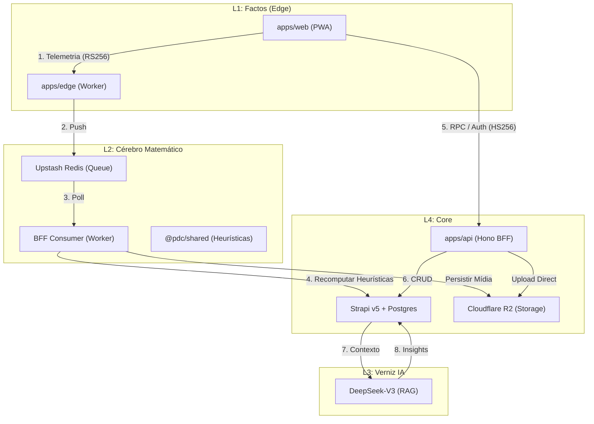

# Arquitectura do PDC v2 — Definição Soberana (G15/B2)

## Visão Geral

O PDC v2 opera num modelo de **4 Camadas (L1-L4)** para garantir latência zero na ingestão de telemetria e rigor matemático no processamento de mérito. O repositório é um monorepo npm workspaces.

```
pdc-v2/
├── apps/
│   ├── web/          # L1/L2: React 18 + Vite 6 (Frontend PWA)
│   ├── api/          # L2/L4: Hono BFF (Cérebro & Orquestração)
│   └── edge/         # L1: Cloudflare Workers (Ingestão Factos)
├── packages/
│   └── shared/       # Motores de Heurísticas, Esquemas e Tipos SSOT
├── infra/
│   └── strapi/       # L4: Strapi v5 Headless CMS (Persistência)
└── tests/            # Suítes cross-app (E2E, Load, A11y)
```

---

## 🏛️ As 4 Camadas de Autoridade

1.  **L1: Factos (Edge)** — Cloudflare Workers. Captura telemetria densa (biomechanics, focus, visibility) com validação JWS RS256.
2.  **L2: Cérebro Matemático (Shared + BFF)** — Implementação determinística das fórmulas de Fluidez ($\phi$), Resiliência ($R$) e Foco.
3.  **L3: Verniz IA (Tina)** — Camada de interpretação generativa (DeepSeek) que transforma scores matemáticos em linguagem humana.
4.  **L4: Core (Hono + Strapi)** — Fonte da verdade para identidade, conteúdo e persistência soberana.

---

## Diagrama de Fluxo Ecossistémico



---

## 🔐 Gestão de Tokens (Sovereign Auth)

O PDC v2 utiliza dois padrões de tokens distintos para isolar autoridade e garantir que factos de telemetria não podem ser forjados pelo cliente após a emissão:

| Tipo | Algoritmo | Uso | Armazenamento | Expiração | Autoridade |
|------|-----------|-----|---------------|-----------|------------|
| **User Session** | **HS256** | Autenticação de utilizador no BFF | Cookie `httpOnly` | 7 dias | Emitido pelo BFF (Secret) |
| **Telemetry Token** | **RS256** | Autoridade de escrita no Edge Worker | Memória (RAM) | 1 hora | Assinado pelo BFF (Priv), Validado pelo Edge (Pub) |

### Fluxo de Validação RS256
1.  **Emissão**: O BFF assina o token com a chave privada RS256 e entrega-o ao cliente via `bootstrap`.
2.  **Verificação**: O Edge Worker obtém a chave pública via JWKS endpoint (`/.well-known/jwks.json`) exposto pelo BFF.
3.  **Cache**: O Edge Worker faz cache do conjunto de chaves por 1 hora para evitar latência.

---

## 🛠️ Stack Tecnológica Auditada

| Camada | Tecnologia | Versão |
|--------|-----------|--------|
| **Frontend** | React | 18.3.1 |
| **Frontend Build** | Vite | 6.0.0 |
| **Design System** | TailwindCSS | 4.0.0 |
| **Animações** | Motion | 11.11.0 |
| **Edge Runtime** | Cloudflare Workers | Wrangler 3 |
| **BFF Framework** | Hono | 4.12.13 |
| **Runtime BFF** | Node.js | 24.13.0 |
| **Base de Dados** | PostgreSQL | 16 |
| **Cache & Queue** | Upstash Redis | 1.34.0 |
| **Storage** | Cloudflare R2 (S3) | SDK v3 |
| **Realtime** | Socket.IO | 4.8.0 |
| **E-mail** | Resend | 6.12.0 |
| **JWT/JWS** | Jose | 5.9.0 |
| **IA Generativa** | DeepSeek | V3 / R1 |
| **Observabilidade** | Sentry | 10.47.0 |
| **Deploy Frontend** | Cloudflare Pages | — |
| **Deploy BFF** | Railway | — |

---

## Ciclo de Vida de um Evento (G15)

1.  **Ação**: Utilizador executa uma escrita de domínio no BFF.
2.  **Outbox**: BFF persiste o evento em `domain-events` (processed=false).
3.  **Hooks**: O `EventBus` dispara 5 hooks canónicos (Ranking, Feed, Match, Achievement, Notify).
4.  **Finalização**: Após sucesso dos hooks, o evento é marcado como processado.
5.  **Replay**: Em caso de falha, o `outbox-worker` isolado reprocessa o evento até ao sucesso.

---
*Doc is Law — Última auditoria: 21 de Abril de 2026 (Ref: B2).*
