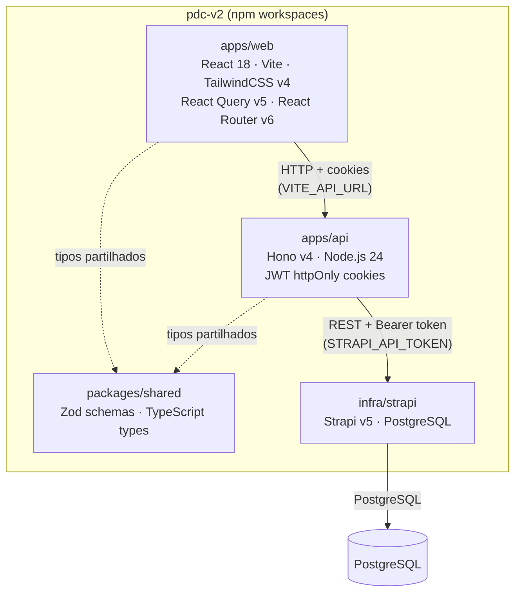
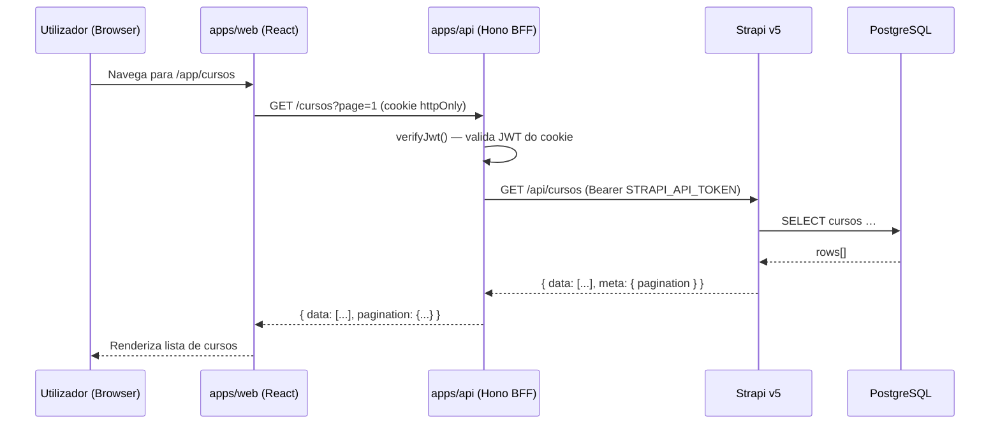

# Arquitectura do PDC v2

## Visão Geral

O PDC v2 é um monorepo npm workspaces com três pacotes principais:

```
pdc-v2/
├── apps/
│   ├── web/          # React 18 + Vite (frontend)
│   └── api/          # Hono BFF (backend-for-frontend)
├── packages/
│   └── shared/       # Tipos Zod partilhados
└── infra/
    └── strapi/       # Strapi v5 CMS (conteúdo + persistência)
```

---

## Diagrama do Monorepo



---

## Fluxo de Dados



---

## Camadas de Segurança

```
Browser
  └── HTTPS (TLS 1.3)
       └── Hono BFF
            ├── securityMiddleware (headers defensivos)
            ├── cors() — Origin restrita a FRONTEND_URL
            ├── secureHeaders() — CSP, HSTS, etc.
            ├── verifyJwt — jose · HS256
            ├── checkRole — RBAC 6 níveis
            └── auditLog — regista acções sensíveis
                 └── Strapi /api/audit-logs
```

---

## Módulos do BFF (`apps/api/src/`)

| Directório | Responsabilidade |
|-----------|-----------------|
| `routes/` | Handlers HTTP por domínio (≤200 linhas cada) |
| `modules/auth/` | JWT, RBAC, middleware de autenticação |
| `modules/strapi/` | Cliente tipado para Strapi v5 |
| `modules/ai/` | Integração DeepSeek (Fase 7) |
| `modules/lti/` | LTI 1.3 Provider (Fase 5) |
| `modules/realtime/` | WebSocket (Fase 7) |
| `middleware/` | `security.ts`, `audit.ts`, `rateLimit.ts` |

---

## Stack de Tecnologia

| Camada | Tecnologia | Versão |
|--------|-----------|--------|
| Frontend framework | React | 18 |
| Frontend build | Vite | 6 |
| CSS | TailwindCSS | 4 (CSS-first) |
| Estado servidor | TanStack Query | 5 |
| Roteamento | React Router | 6 |
| BFF framework | Hono | 4 |
| Runtime | Node.js | 24 LTS |
| Validação | Zod | 3 |
| CMS / Persistência | Strapi | 5 |
| Base de dados | PostgreSQL | 16 |
| Armazenamento ficheiros | Cloudflare R2 | — |
| Autenticação | JWT (httpOnly cookies) | jose |
| Deploy frontend | Vercel | — |
| Deploy BFF + Strapi | Railway | — |
