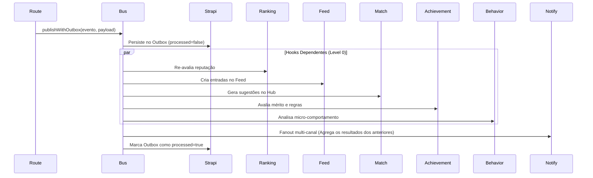

# Guia Técnico: Ecosystem Hooks (G15 - Estado Canónico)

> **Regra de Ouro (Lei #7 da Constituição):** Nenhuma escrita de domínio é considerada completa sem disparar o impacto ecossistémico através dos Hooks Canónicos. O fluxo E2E só termina quando os 5 hooks executam (ou são agendados via Outbox).

**Este documento foi atualizado após a análise de que o código já implementa toda a especificação G15 de forma avançada.**

O PDC v2 utiliza um sistema robusto de **Domain Events** e **Ecosystem Hooks (`EcosystemHook<T>`)** para garantir que as acções do utilizador se propagam por todo o sistema (Reputação, Feed, Matchmaking, Conquistas e Notificações).

---

## 🏗️ O Fluxo Canónico Atual (Em Produção)

O `EventBus` (`apps/api/src/modules/events/event-bus.ts`) foi refatorado para suportar `EcosystemHook<T>` com **ordenação garantida** e **idempotência baseada no Redis**.

Quando uma rota do BFF escreve no Strapi, ela invoca `eventBus.publishWithOutbox`. 
O `EventBus` orquestra a execução da seguinte forma:



> **Nota de Resiliência:** O Outbox Worker (`apps/api/src/modules/outbox/outbox-worker.ts`) é um processo isolado e assíncrono. Em caso de backlog, o Event Loop principal do BFF (Hono) não é bloqueado.

---

## 📜 Os 6 Hooks Ecossistémicos Registados

| Hook | Onde (`apps/api/src/modules/hooks/`) | Responsabilidade | Idempotência (Redis TTL) |
|------|--------------------------------------|-------------------|---------------------------|
| **RANKING** | `ranking.hook.ts` | Re-avalia a reputação do autor chamando `marcarParaRecalculo()` em batch. | `ranking:{eventId}` |
| **FEED** | `feed.hook.ts` | Decide o separador (Geral/Vocacional/Institucional) e cria a entrada baseada num score ponderado `calcScore()`. | `feed:{eventId}` |
| **MATCH** | `match.hook.ts` | Cruza Perfil Vocacional com Oportunidades (e.g. Cursos) gerando `match-suggestions` baseadas em `tier` e afinidade. | `match:{eventId}` |
| **ACHIEVEMENT** | `achievement.hook.ts` | Aciona a `conquistaEngine` para verificar 25+ regras e debloquear medalhas. | `achievement:{eventId}` |
| **BEHAVIOR** | `behavior.hook.ts` | Hook focado em análise comportamental (telemetria L2/L3). | `behavior:{eventId}` |
| **NOTIFY** | `notify.hook.ts` | O último hook (espera pelos anteriores). Agrega side-effects para notificar via Socket.IO, Web Push, e FCM. | `notify:{eventId}` |

---

## 🛠️ Como Adicionar uma Nova Feature E2E

Para garantir que a tua nova entidade se integra no ecossistema (Ranking, Match, Feed, etc.):

### 1. Definir o Evento
Adiciona o nome do evento ao enum `DomainEventName` em `packages/shared/src/domain-events.ts`.
Atualmente o sistema suporta mais de **49 eventos canónicos** já devidamente tipados com Zod (ex.: `SIMULACAO_PUBLICADA`, `PROJETO_ENDORSEMENT_RECEBIDO`, `VINCULO_SOLICITADO`).

### 2. Definir o Schema e Validar Payload
Ainda em `@pdc/shared/domain-events.ts`, garante que o schema da tua entidade é exportado em `EventPayloadSchemas`.
Isso vai permitir verificação E2E em todos os workspaces (Edge, BFF e Web).

### 3. Disparar no Route Handler (BFF)
No ficheiro da rota Hono em `apps/api/src/routes/`:
```ts
import { eventBus } from '../modules/events/event-bus.js';
import { DomainEventName } from '@pdc/shared';

// Após a escrita ser finalizada no BD
await eventBus.publishWithOutbox(DomainEventName.NOVA_ENTIDADE_CRIADA, {
  id: res.data.id,
  autorId: perfilId,
  area: 'Engenharia',
  titulo: 'A Minha Entidade',
});
```

### 4. Estender Hooks Existentes
Abre os hooks (ex: `feed.hook.ts`) e adiciona o teu evento canónico na lista de `matchableEvents` ou `publishEvents` se quiseres que apareça no Feed ou Match Terminal.

### 5. (Opcional) Observabilidade 
Verifica a saúde da integração pelo Dashboard do Super Admin: `GET /admin/hooks/health` acessível pela nova página React `AdminHooksHealthPage.tsx`.

---
*Doc is Law — Analisado e atualizado autonomamente em 21 de Abril de 2026. A engenharia ultrapassou a especificação draft original.*