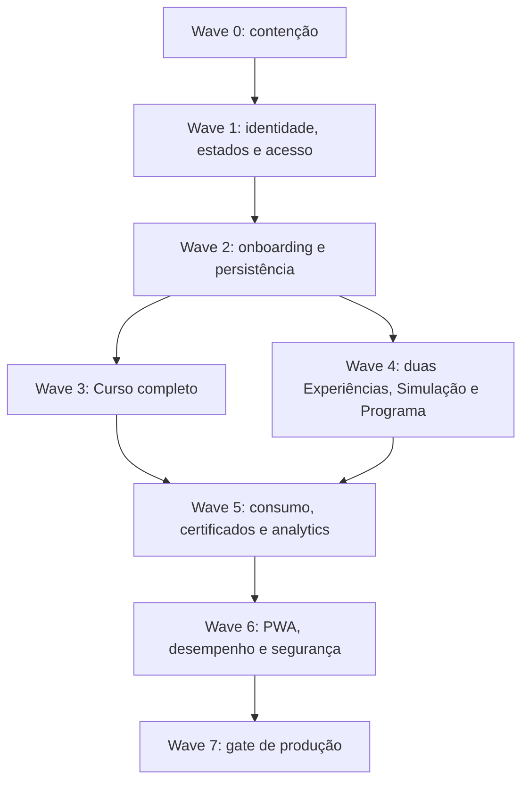

# PDC v2: auditoria de correcção e plano de implementação sem ambiguidades

**Estado do documento:** Revisão 2, plano executável, pronto para entrega à equipa ou ao Codex
**Repositório auditado:** `devpdc2-png/pdc`
**Branch auditada:** `main`
**Snapshot imutável:** `ba8a92f1011713c24c58a3709b6a81b0334631ec`
**Data:** 30 de Julho de 2026
**Objectivo:** corrigir o PDC para receber mentores, instituições e parceiros VWX externos, permitir criação real de conteúdos e garantir consumo, progresso, avaliação, moderação e relatórios íntegros, preservando integralmente a visão canónica já definida para o produto.
**Inventário fechado:** 55 tickets (`COR-0001` a `COR-0705`, nos intervalos definidos neste documento).

> Este plano é prescritivo. Quem o executar não deve escolher alternativas de arquitectura, inventar estados, manter placeholders ou reduzir critérios de aceitação. Uma alteração à decisão descrita aqui exige ADR, justificação de risco e aprovação explícita do responsável do PDC antes de escrever código.

> **Regra de continuidade:** este trabalho não cria um novo PDC. A Revisão 2 substitui qualquer passagem da versão anterior que tenha tratado Experiência apenas como storytelling institucional ou VWX como Programa. O domínio `Experiência` tem duas vertentes canónicas: `institucional` e `vwx`. Nenhum ticket pode redefinir essa decisão.

## 1. Veredicto

O estado actual continua **NO-GO para onboarding externo e produção oficial**.

O problema principal não é falta de acabamento visual. O código permite que dados e estados inválidos atravessem todas as camadas:

- o identificador numérico instável do Strapi é exposto nas rotas e mudou durante a submissão para revisão;
- curso em rascunho ou revisão pode ser inscrito e consumido;
- os itens `quiz` e `tarefa` não têm modelos, editores nem motores próprios;
- o progresso aceita conclusão manual sem provar que o item pertence ao curso nem que a regra do tipo foi cumprida;
- a página de certificados transforma inscrições concluídas em “certificados verificados”, mas não existe certificado emitido, PDF, código de verificação nem registo imutável;
- a interface afirma existir “Blockchain de Mérito PDC (W5)” sem implementação correspondente;
- os relatórios institucionais apresentam percentagens e volumes hard-coded como se fossem factos;
- Experiência só implementa parcialmente a vertente institucional e não possui o discriminante, o template, as tarefas, as evidências, o percurso, a protecção de dados nem a jornada de consumo da vertente VWX;
- Simulação e Programa têm contratos parciais ou genéricos que deixam os builders aparentarem completude sem permitirem criação funcional;
- o workflow editorial tem estados duplicados entre a aplicação e Draft & Publish do Strapi;
- o Service Worker guarda respostas autenticadas de `/api/*` numa cache comum por URL, criando risco de exposição entre contas num dispositivo partilhado;
- E2E, acessibilidade e Lighthouse continuam opcionais ou não bloqueantes no CI.

Os builders existentes não devem ser considerados “Done” apenas porque têm `BuilderShell`, secções e botões. O critério correcto é: o criador consegue produzir uma entidade válida, submetê-la, o revisor consegue aprová-la, um utilizador autorizado consegue consumi-la, e o servidor consegue provar progresso e resultado.

## 2. Evidência usada

### 2.1 Evidência funcional autenticada

Na sessão institucional de produção foram reproduzidos:

- Quiz e Tarefa com o mesmo formulário genérico de URL/texto;
- perfil institucional misturado com campos pessoais;
- duas rotas de branding com comportamentos diferentes;
- KPIs demonstrativos exibidos com zero inscrições;
- pré-visualização de rascunho com CTA de inscrição/consumo;
- “Aptidão Validada” e “Certificado Digital” antes de avaliação;
- conclusão visível apenas depois de recarregar;
- submissão para revisão alterando o URL de curso de `22` para `23`;
- listagem com zero inscritos apesar da inscrição de teste;
- atalhos PWA inválidos e tempos observados de 6 a 16 segundos.

### 2.2 Evidência estática no snapshot

Ficheiros centrais:

- [`packages/shared/src/cursos.ts`](https://github.com/devpdc2-png/pdc/blob/ba8a92f1011713c24c58a3709b6a81b0334631ec/packages/shared/src/cursos.ts)
- [`apps/api/src/modules/cursos/cursos.service.ts`](https://github.com/devpdc2-png/pdc/blob/ba8a92f1011713c24c58a3709b6a81b0334631ec/apps/api/src/modules/cursos/cursos.service.ts)
- [`apps/api/src/routes/cursos.ts`](https://github.com/devpdc2-png/pdc/blob/ba8a92f1011713c24c58a3709b6a81b0334631ec/apps/api/src/routes/cursos.ts)
- [`apps/web/src/features/instituicao/components/CourseCurriculum.tsx`](https://github.com/devpdc2-png/pdc/blob/ba8a92f1011713c24c58a3709b6a81b0334631ec/apps/web/src/features/instituicao/components/CourseCurriculum.tsx)
- [`apps/web/src/features/cursos/ItemPlayer.tsx`](https://github.com/devpdc2-png/pdc/blob/ba8a92f1011713c24c58a3709b6a81b0334631ec/apps/web/src/features/cursos/ItemPlayer.tsx)
- [`apps/web/src/features/cursos/CursoDetailPage.tsx`](https://github.com/devpdc2-png/pdc/blob/ba8a92f1011713c24c58a3709b6a81b0334631ec/apps/web/src/features/cursos/CursoDetailPage.tsx)
- [`packages/shared/src/experiencias.ts`](https://github.com/devpdc2-png/pdc/blob/ba8a92f1011713c24c58a3709b6a81b0334631ec/packages/shared/src/experiencias.ts)
- [`packages/shared/src/simulacoes.ts`](https://github.com/devpdc2-png/pdc/blob/ba8a92f1011713c24c58a3709b6a81b0334631ec/packages/shared/src/simulacoes.ts)
- [`packages/shared/src/schemas/programas.ts`](https://github.com/devpdc2-png/pdc/blob/ba8a92f1011713c24c58a3709b6a81b0334631ec/packages/shared/src/schemas/programas.ts)
- [`apps/web/src/features/instituicao/RelatoriosInstituicaoPage.tsx`](https://github.com/devpdc2-png/pdc/blob/ba8a92f1011713c24c58a3709b6a81b0334631ec/apps/web/src/features/instituicao/RelatoriosInstituicaoPage.tsx)
- [`apps/web/src/features/estudante/CertificadosPage.tsx`](https://github.com/devpdc2-png/pdc/blob/ba8a92f1011713c24c58a3709b6a81b0334631ec/apps/web/src/features/estudante/CertificadosPage.tsx)
- [`apps/api/src/routes/estudante.ts`](https://github.com/devpdc2-png/pdc/blob/ba8a92f1011713c24c58a3709b6a81b0334631ec/apps/api/src/routes/estudante.ts)
- [`apps/web/public/sw.js`](https://github.com/devpdc2-png/pdc/blob/ba8a92f1011713c24c58a3709b6a81b0334631ec/apps/web/public/sw.js)
- [`apps/web/public/manifest.webmanifest`](https://github.com/devpdc2-png/pdc/blob/ba8a92f1011713c24c58a3709b6a81b0334631ec/apps/web/public/manifest.webmanifest)
- [`.github/workflows/ci.yml`](https://github.com/devpdc2-png/pdc/blob/ba8a92f1011713c24c58a3709b6a81b0334631ec/.github/workflows/ci.yml)

Também foram confirmados no snapshot:

- `packages/shared/src/experiencias.ts` não possui `tipoExperiencia` e descreve apenas painéis institucionais;
- `infra/strapi/src/api/experiencia/content-types/experiencia/schema.json` não distingue as duas vertentes;
- `apps/web/src/features/instituicao/CriarExperienciaPage.tsx` instancia sempre seis secções institucionais e guarda o draft apenas em `localStorage`;
- `apps/web/src/router.tsx` só oferece o builder de Experiência à Instituição, embora o contrato e o BFF também autorizem Mentor;
- `apps/api/src/routes/experiencias.ts` trata qualquer participação da mesma forma e não possui execução, tarefas, evidências ou conclusão VWX;
- `infra/strapi/src/api/experiencia-participante/content-types/experiencia-participante/schema.json` guarda apenas `estudanteId` e a relação com Experiência;
- `apps/web/src/features/experiencias/ExperienciaListPage.tsx` e `apps/web/src/features/catalogo/ExperienciasCatalogoPage.tsx` duplicam catálogo e apresentam apenas linguagem institucional.
- o `package.json` raiz declara o workspace `apps/mobile`, mas o snapshot não contém `apps/mobile/package.json`, `capacitor.config.ts`, projectos iOS/Android, bridge nativa ou pipeline de distribuição; portanto, a promessa anterior de empacotar a PWA para as lojas ainda não tem implementação.

### 2.3 Benchmarks funcionais, não cópia de produto

- O Curso deve atingir o mínimo funcional do [Course Builder do Tutor LMS](https://docs.themeum.com/tutor-lms/course-builder/course-creation/basic/): tópicos, lições ricas, quizzes e tarefas com configurações próprias.
- Quiz deve ter tipos reais de pergunta e explicação de resposta, como documentado no [Quiz Builder do Tutor LMS](https://docs.themeum.com/tutor-lms/quiz-builder/quiz-creation/).
- Tarefa deve incluir instruções, anexos, prazo, pontos, nota mínima e limites de ficheiro, conforme o [modelo de Assignments do Tutor LMS](https://docs.themeum.com/tutor-lms/course-builder/course-creation/curriculum/).
- Simulação deve seguir a lógica de cenário executável e medição comportamental usada nas [Work Experience Simulations do Springpod](https://www.partners.springpod.com/product/work-experience-simulations), sem abandonar a telemetria e as heurísticas soberanas do PDC.
- O benchmark não redefine a taxonomia do PDC. Experiência Institucional continua a mostrar como é estudar uma área numa instituição. VWX continua a permitir experimentar como é trabalhar numa profissão, com tarefas, entregáveis, debrief e evidências. Simulação continua a ser o motor de cenário e medição comportamental. Programa continua a agregar conteúdos. Curso continua a ensinar.

### 2.4 Contrato canónico de continuidade do PDC

O PDC não é um LMS, um repositório de conteúdos nem uma cópia do Springpod ou Tutor LMS. É uma **infraestrutura de decisão educacional**. A jornada mantém-se:

```text
Explorar -> Experimentar -> Aprender -> Provar -> Decidir
```

| Componente canónico | Pergunta que responde | Criadores | Regra comercial | Resultado |
|---|---|---|---|---|
| Experiência Institucional | “Como é realmente estudar esta área nesta instituição?” | Instituição ou Mentor aprovado | Sempre gratuita para o participante | Clareza académica e institucional |
| VWX, PDC Digital Work Experience | “Como é trabalhar nesta profissão?” | Mentor ou Instituição como autor principal; empresa/profissional como parceiro validante | Sempre gratuita para o participante; financiada pelo PDC, instituição ou empresa | Tarefas, entregáveis, reflexão e evidências |
| Simulação | “Consigo lidar com decisões e tarefas realistas desta área?” | Mentor ou Instituição | Gratuita ou monetizada | Tentativa, telemetria validada e resultado comportamental |
| Curso | “Que competências preciso desenvolver?” | Mentor ou Instituição | Gratuito ou monetizado | Aprendizagem, avaliação, progresso e certificado |
| Projecto | “Que evidências posso mostrar?” | Estudante, Mentor ou Instituição | Sempre gratuito | Activo de carreira, público ou privado |
| Programa | “Como combinar conteúdos numa iniciativa?” | Mentor ou Instituição | Gratuito ou monetizado | Sequência de Cursos, Experiências, Simulações e Projectos |
| Perfil Vocacional | “O que os meus dados válidos revelam?” | Calculado pela plataforma | Privado por defeito | Síntese de sinais comportamentais válidos |

**Fronteiras obrigatórias:**

- VWX é uma vertente do módulo `Experiência`, não uma entidade independente, um tipo de Programa, um Curso ou uma Simulação;
- o mesmo `documentId` identifica a Experiência e `tipoExperiencia` define o contrato;
- Programa pode incluir uma Experiência Institucional ou VWX, mas não altera o seu tipo;
- VWX pode referenciar uma Simulação publicada como uma etapa, mas não absorve o score nem replica o motor da Simulação;
- recursos explicativos de uma VWX não a transformam em Curso;
- uma evidência VWX só se torna Projecto por acção explícita do participante e nasce em `draft`, privada por defeito;
- apenas resultados válidos de Simulação alimentam score no Perfil Vocacional; conclusão VWX alimenta evidências e competências declaradas, não score comportamental;
- o lançamento deve avançar por módulos. Projectos e Perfil Vocacional não serão redesenhados neste plano, mas nenhum ticket pode quebrar os seus contratos;
- PWA-first e offline-first são requisitos do produto, com isolamento por utilizador e sem cache global de respostas autenticadas;
- o mesmo produto será distribuído como PWA e como uma aplicação móvel PDC única para iOS e Android; a shell nativa complementa o produto com offline seguro, push, deep links e partilha de ficheiros, sem criar uma segunda lógica de negócio;
- o modelo é B2B2C: instituições são a principal linha pagadora; empresas financiam VWX como segunda linha; acesso essencial do participante é gratuito ou financiado.

**Decisões VWX já fechadas:**

- nome público: `PDC Digital Work Experience`; nome curto: `VWX`; rótulo em português: `Experiência Profissional Digital`;
- público prioritário: pessoas a partir dos 16 anos, estudem ou não; não exigir vínculo académico;
- formato MVP: online, on-demand, entre 6 e 10 horas; uma sessão ao vivo pode ser opcional, mas nunca requisito de conclusão;
- 70–80% do percurso é template PDC bloqueado; 20–30% é adaptado à profissão, parceiro, caso, tarefas, ferramentas e critérios;
- cada VWX inclui contexto, briefing, materiais, 3–5 tarefas inspiradas em trabalho real, projecto final, debrief, reflexão, feedback e evidências;
- não é estágio, emprego ou curso tradicional; não promete contratação e não pode produzir trabalho útil não remunerado para o parceiro;
- PDC lidera o desenho e a produção metodológica; Mentor/Instituição mantém autoria formal; empresa/profissional fornece contexto, especialista, materiais autorizados e validação;
- empresa recebe dados agregados por defeito; dados individuais, contactos, entregáveis e Opportunity Pathway exigem consentimento separado, explícito, revogável, específico ao parceiro e com prazo;
- reconhecimento pode ser Participação, Conclusão ou Distinção, conforme política tipada da VWX; qualquer certificado emitido é verificável;
- rotas de aquisição não se misturam: `/experiencias-profissionais` serve participantes e `/empresas/experiencias-profissionais` serve parceiros B2B;
- nenhuma campanha VWX é publicada antes de catálogo/landing, formulário de conversão e tracking estarem activos e testados.

### 2.5 Requisitos do Resumo Executivo sobre perfis institucionais

O ficheiro `Resumo Executivo-1.pdf`, fornecido pelo responsável do PDC, foi tratado como entrada de requisitos para COR-0206. Dele entram no plano: identidade legal e educativa, contactos estruturados, localização, oferta formativa, instalações e acessibilidade, dimensão com proveniência, acreditações, políticas, media, links, pesquisa e API estruturada.

Não entram literalmente:

- RGPD, CNPD, NIF de nove dígitos, código postal `NNNN-NNN`, distrito ou catálogos portugueses como regras do MVP angolano;
- empresas, ONG e laboratórios dentro da collection `instituicao`;
- arrays de strings ou JSON aberto para oferta, contactos, recursos, políticas e media;
- `DELETE /instituicoes/:id` como hard delete de uma entidade com conteúdo, participações e auditoria;
- cronograma de 2025 do documento.

A adaptação vinculante é:

- Angola é a jurisdição inicial; aplicar a [Lei n.º 22/11 de Protecção de Dados Pessoais](https://apd.ao/ao/legislacao/) e os direitos de informação, acesso, rectificação, actualização, eliminação e oposição descritos pela [Agência de Protecção de Dados](https://apd.ao/ao/direitos-do-cidadao/);
- os níveis iniciais seguem a [estrutura oficial angolana](https://xilonga.med.gov.ao/sobre-educacao) de ensino Primário, Secundário e Superior e os seus subsistemas, sem impedir a expansão internacional pelo registry de país do contrato;
- referências portuguesas/europeias do PDF servem para interoperabilidade futura, nunca para afirmar conformidade legal em Angola;
- qualquer expansão de país exige validação jurídica local e fixtures desse país, sem alterar registos angolanos existentes.

## 3. Decisões bloqueadas

Estas decisões devem ser registadas no início da Wave 1 em:

- `docs/decisoes/adr-051-content-studio-integrity.md`;
- `docs/decisoes/adr-052-experience-variants-vwx.md`;
- `docs/decisoes/adr-053-mobile-store-distribution.md`;
- `docs/decisoes/adr-054-institution-profile-contract.md`.

Os quatro ADRs são reflectidos nas specs canónicas antes da implementação estrutural.

| ID | Decisão final |
|---|---|
| D-01 | Todo identificador que sai do Strapi e entra no BFF, UI, URL, evento ou relação externa é `documentId`. O `id` numérico do PostgreSQL nunca sai da camada Strapi. |
| D-02 | Draft & Publish do Strapi permanece activo nos conteúdos governados. O seu `status` controla a existência de uma versão publicada; `estado` controla o workflow de revisão. Não haverá um valor editorial `published`. |
| D-03 | Estados editoriais únicos: `draft`, `review`, `approved`, `hidden`, `archived`. `rejected` e `published` são removidos. Rejeição volta o draft para `draft`, com decisão e motivo preservados num registo de revisão. |
| D-04 | Um conteúdo público tem obrigatoriamente `status=published` e `estado=approved`. Nenhuma outra combinação entra no catálogo, detalhe público, inscrição, execução ou progresso. |
| D-05 | O autor edita a versão draft. A versão publicada anterior continua pública enquanto uma nova revisão está em `draft` ou `review`. Durante `review`, a versão draft fica bloqueada para escrita. |
| D-06 | O preview de autor/revisor é uma rota read-only separada. Preview nunca cria inscrição, participação, progresso, score, conquista ou certificado. |
| D-07 | `Experiência` é um único domínio com união discriminada obrigatória: `tipoExperiencia=institucional` ou `tipoExperiencia=vwx`. Não criar collection, módulo ou marca independente para VWX. |
| D-08 | Nenhum `z.record(z.unknown())`, `z.unknown()` ou JSON genérico será aceite em novos contratos de rede. JSON persistido só é permitido quando validado por uma união discriminada completa em `@pdc/shared`. |
| D-09 | Progresso, score, conclusão, certificado e analytics são calculados no servidor a partir de relações, respostas e telemetria válidas. O cliente só envia factos permitidos pelo schema. |
| D-10 | Não existe certificado sem registo `certificado`, número público, código de verificação, PDF gerado e endpoint de verificação. Não existe “blockchain” no texto do produto enquanto não existir arquitectura e ADR próprios. |
| D-11 | Dados insuficientes produzem `null` e uma razão explícita. Nunca produzem uma percentagem estimada, demonstrativa ou aspiracional. |
| D-12 | Abertura externa só ocorre depois de todos os gates P0 da secção 17 passarem em staging e num piloto controlado. |
| D-13 | Experiência Institucional é vitrine de decisão académica, sempre gratuita, sem Tarefa pedagógica, score ou certificado. VWX é percurso profissional prático, também gratuito para o participante, com tarefas, projecto, evidências e reconhecimento próprio. |
| D-14 | VWX não é trabalho produtivo gratuito. Toda tarefa usa dados sintéticos, anonimizados ou públicos; o parceiro não adquire o entregável; uso individual, contacto ou oportunidade exige consentimento separado. |
| D-15 | Rotas públicas canónicas: `/experiencias` e `/experiencias/:documentId` para Institucional; `/experiencias-profissionais` e `/experiencias-profissionais/:documentId` para VWX; `/empresas/experiencias-profissionais` para aquisição B2B. |
| D-16 | PWA offline usa pacotes allowlisted e stores por utilizador. Nenhuma resposta autenticada de `/api/*` entra em cache global; nenhuma conclusão, submissão ou certificado é confirmado sem ACK do servidor. |
| D-17 | O PDC móvel é a mesma aplicação React empacotada com Capacitor 8, com `appId=com.usepdc.app`, nome `PDC – Por Dentro do Curso`, assets web incorporados na build e sem `server.url` remoto em produção. iOS e Android não criam contratos de domínio paralelos. |
| D-18 | A primeira release móvel permite descobrir e consumir conteúdos gratuitos ou já patrocinados. Não mostra compra externa, instruções de pagamento ou link de checkout para conteúdo digital; monetização móvel permanece desligada até um ticket próprio de StoreKit/Google Play Billing e revisão comercial. |
| D-19 | O PDC não usa SDK de publicidade nem tracking entre aplicações. Push é opt-in contextual; dados, permissões, login social e eliminação de conta cumprem exactamente o inventário de privacidade e as políticas das lojas definido em COR-0608. |
| D-20 | `instituicao` representa apenas fornecedores de educação/formação. Empresa, ONG e laboratório que participem numa VWX ficam em `organizacao-parceira`; ambas partilham tipos base de identidade organizacional, mas nunca a mesma collection, role ou workflow. |
| D-21 | O perfil institucional é country-aware e começa por Angola. Nunca codificar NIF, código postal, distrito ou legislação de Portugal como regra global. País, esquema do identificador legal e subdivisões administrativas ficam explícitos; validações de outros países entram por registry versionado. |
| D-22 | Documentos, representante legal, contactos pessoais e notas de verificação são privados. O DTO público expõe apenas campos allowlisted; números institucionais e indicadores só aparecem com fonte, ano de referência e estado de verificação. |

### 3.1 Máquina editorial obrigatória

O estado editorial é aplicado à versão draft. Draft & Publish mantém a versão publicada estável pelo mesmo `documentId`.

| Acção | Pré-condição | Resultado draft | Resultado publicado | Actor |
|---|---|---|---|---|
| Criar | conta de criador aprovada | `draft` | inexistente | Mentor, Instituição, Super Admin |
| Guardar | `draft` | `draft` actualizado | versão anterior inalterada | Autor |
| Submeter | validação estrutural completa; em VWX, partner validation do mesmo checksum | `review`, bloqueado | versão anterior inalterada | Autor |
| Cancelar revisão | `reviewStartedAt=null` | `draft` | versão anterior inalterada | Autor |
| Iniciar análise | `review` | `review`, bloqueado | versão anterior inalterada | Revisor autorizado |
| Pedir alterações | `review` | `draft`, com revisão `changes_requested` | versão anterior inalterada | Revisor autorizado |
| Aprovar | checksum igual ao submetido | `approved` e `publish()` | nova versão publicada | Revisor autorizado |
| Criar nova edição | existe versão publicada | novo draft editável | versão aprovada anterior continua pública | Autor |
| Ocultar | conteúdo publicado | `hidden` e `unpublish()` | removido do público | Moderador/Super Admin |
| Reabilitar | `hidden` e revisão aprovada | `approved` e `publish()` | volta ao público | Moderador/Super Admin |
| Arquivar | não há obrigação activa incompatível | `archived` e `unpublish()` | removido do público | Autor/Super Admin |

### 3.2 Matriz de revisão

| Tipo | Cria | Aprova a primeira publicação e revisões |
|---|---|---|
| Curso | Mentor, Instituição, Super Admin | Moderador ou Super Admin |
| Experiência Institucional | Mentor, Instituição, Super Admin | Comité Científico ou Super Admin |
| VWX | Mentor, Instituição, Super Admin; Parceiro VWX apenas como coautor convidado | validação do parceiro + Comité Científico ou Super Admin |
| Simulação | Mentor, Instituição, Super Admin | Comité Científico ou Super Admin |
| Programa | Mentor, Instituição, Super Admin | Moderador ou Super Admin |

Moderador não aprova Experiência ou Simulação. Comité não aprova Curso ou Programa. Parceiro VWX nunca publica, não se auto-aprova e só valida as secções que lhe foram atribuídas. O frontend nunca substitui estas regras; o BFF aplica-as.

## 4. Ordem de execução



Não iniciar W3 ou W4 antes de W1 estar migrada em staging. Não executar em paralelo duas tarefas que alterem `EstadoEditorialSchema`, mapeadores Strapi, `documentId`, `inscricao` ou schemas partilhados.

Dependências fechadas:

- COR-0401 a COR-0406 podem avançar depois de W1/W2;
- COR-0407 só começa depois do schema e serviço partilhado de rubric de COR-0303;
- COR-0408 só começa depois de COR-0308 aceitar alvos de Curso e VWX;
- COR-0409 só começa depois de COR-0401 a COR-0408;
- COR-0413/0414 só começam depois de COR-0401 e dos contratos finais de Curso/Simulação;
- COR-0607 só começa depois de COR-0307 e COR-0407 fecharem idempotência/progresso;
- COR-0608 só começa depois de COR-0605, COR-0606 e da API offline de COR-0607; a shell nativa nunca mascara contratos ainda instáveis;
- COR-0701/0702 só são concluídos depois de todos os contratos anteriores, não com fixtures temporárias.

## 5. Wave 0: contenção imediata

### COR-0001: fechar onboarding e publicação externos

**Prioridade:** P0, antes de qualquer outro deploy.

Adicionar os seguintes flags ao registry existente de feature flags:

- `external_creator_onboarding_enabled=false`
- `content_submission_enabled=false`
- `certificates_enabled=false`
- `institution_advanced_analytics_enabled=false`
- `vwx_creator_enabled=false`
- `vwx_catalog_enabled=false`
- `vwx_partner_onboarding_enabled=false`
- `vwx_opportunity_pathway_enabled=false`
- `external_project_publication_enabled=false`
- `mobile_store_release_enabled=false`
- `mobile_paid_enrollment_enabled=false`

**Comportamento exacto:**

- signup de Mentor/Instituição pode aceitar uma lista de espera, mas não provisiona conta criadora enquanto o primeiro flag estiver falso;
- signup de Parceiro VWX pode aceitar lead/lista de espera, mas não provisiona acesso de coautoria enquanto `vwx_partner_onboarding_enabled=false`;
- builders existentes continuam acessíveis apenas às contas internas de QA;
- `POST .../submeter` devolve `503 CONTENT_SUBMISSION_TEMPORARILY_DISABLED` enquanto o segundo flag estiver falso;
- a rota de certificados apresenta apenas um empty state neutro enquanto o terceiro flag estiver falso;
- relatórios mostram apenas contagens reais já disponíveis e escondem todos os cartões avançados.
- o criador não vê a opção VWX enquanto `vwx_creator_enabled=false`;
- API pública filtra `tipoExperiencia=vwx` enquanto `vwx_catalog_enabled=false`, mesmo por `documentId`;
- Opportunity Pathway não recolhe consentimento nem expõe candidatos enquanto o seu flag estiver falso.
- criação/publicação externa de Projectos fica desligada até auditoria própria; COR-0407 só pode criar Projecto privado em `draft`, nunca publicá-lo.
- builds de loja não são promovidas enquanto `mobile_store_release_enabled=false`;
- o cliente móvel nunca mostra compra, pagamento manual, WhatsApp de vendas ou link externo para conteúdo digital enquanto `mobile_paid_enrollment_enabled=false`.

**Ficheiros alvo:**

- registry e schemas existentes em `apps/api/src/modules/feature-flags/`;
- guardas de rota em `apps/api/src/routes/cursos.ts`, `experiencias.ts`, `simulacoes.ts`, `programas.ts`;
- páginas de signup e builders em `apps/web/src/features/`;
- `packages/shared/src/feature-flags.ts` ou ficheiro canónico equivalente.

**Aceitação:**

- uma conta de QA permitida continua a guardar drafts;
- qualquer conta externa recebe mensagem de indisponibilidade clara;
- nenhuma flag é lida apenas no frontend;
- teste de BFF prova `503` mesmo com chamada directa;
- VWX não aparece por catálogo, detalhe, pesquisa ou feed enquanto o flag estiver falso.

### COR-0002: bloquear acesso a conteúdo não publicado

**Prioridade:** P0, hotfix independente da migração.

Criar `apps/api/src/modules/conteudo/content-access.service.ts` com funções puras:

```ts
canReadPublicContent({ strapiStatus, estado }): boolean
canPreviewContent({ actor, authorId, reviewerRoles }): boolean
canEnrollOrParticipate({ strapiStatus, estado, accessPolicy }): boolean
```

Aplicar o serviço a:

- `POST /cursos/:documentId/inscricao`;
- `GET /cursos/:documentId/learn`;
- progresso de curso;
- participação em Experiência Institucional;
- início/retoma de percurso VWX, tarefas, submissões, feedback, evidências e Opportunity Pathway;
- início de tentativa de Simulação;
- inscrição/convite de Programa.

Enquanto D-02 ainda não estiver migrada, o hotfix aceita como público apenas `estado=approved` **e** uma versão publicada confirmada pelo Strapi. Nunca aceitar `published` apenas porque existe como string no campo.

**Respostas:**

- usar `404 CONTENT_NOT_FOUND` para visitante sem autorização, evitando revelar drafts;
- usar `403 PREVIEW_ONLY` quando um autor tenta consumir o próprio draft pela rota de learner;
- usar `409 CONTENT_NOT_AVAILABLE` quando uma relação existente aponta para conteúdo oculto/arquivado.

**Testes negativos obrigatórios:**

- draft, review, hidden e archived não permitem inscrição;
- preview de autor funciona, mas não cria linha em `inscricoes`;
- preview VWX não cria participação, submissão, evidência, consentimento ou reconhecimento;
- ID inexistente e ID privado produzem a mesma resposta pública;
- chamada directa ao BFF não contorna a regra.

### COR-0003: retirar afirmações e números falsos

**Prioridade:** P0, mesmo deploy da contenção.

1. Em `apps/web/src/features/instituicao/RelatoriosInstituicaoPage.tsx`:
   - remover `75%`, `-22%`, `80%`, `450`, `94.8%`, distribuição `65/20/15`, “Authority AI Validada” e o gráfico placeholder;
   - remover ou desactivar Exportar enquanto não existir um endpoint real;
   - mostrar `Sem dados suficientes` quando o backend devolver `null`;
   - manter apenas total de conteúdos, inscrições e participações realmente devolvidos.
2. Em `apps/web/src/features/estudante/CertificadosPage.tsx`:
   - remover “Verificado”, PDF, Partilhar, “documentos oficiais”, “Decision Engine” e “Blockchain de Mérito PDC (W5)” enquanto não houver `CertificadoSchema`;
   - nunca mapear `InscricaoComCurso` como certificado.
3. Em `apps/web/src/features/cursos/CursoDetailPage.tsx`:
   - retirar “Aptidão Validada”;
   - mostrar “Certificado disponível após conclusão” apenas se `curso.certificatePolicy.enabled=true`;
   - mostrar “Certificado emitido” apenas se a resposta trouxer `certificateId`.
4. Em `apps/web/src/components/ecosystem/EcosystemImpactPanel.tsx`:
   - eliminar `defaultImpacts` e valores `...`;
   - substituir o overlay por confirmação simples de sucesso e estado de revisão;
   - reintroduzir impacto apenas quando `/domain-events/:id/my-impact` devolver dados reais autorizados.

**Aceitação:**

- busca no código pelos literais acima não encontra uso em componentes de produção;
- zero inscrições gera zero ou empty state, nunca percentagens;
- nenhum botão sem handler é renderizado;
- screenshots E2E confirmam que a interface não apresenta uma certificação antes de emissão.

### COR-0004: limpar o conteúdo de QA

O curso de auditoria que ficou em revisão como ID numérico `23` deve ser resolvido depois de D-01:

1. localizar o documento pelo título exacto de QA e recuperar o `documentId`;
2. confirmar `autor`, `estado`, inscrições e progresso;
3. se só contiver dados de auditoria, cancelar a revisão e apagar em staging/produção conforme a política de delete de COR-0501;
4. se tiver relação que impeça delete, arquivar e marcar `isDemo=true`;
5. registar o resultado no audit trail.

Não apagar por `id=23` sem confirmar o `documentId`.

## 6. Wave 1: fundação de identidade, estados e acesso

### COR-0101: usar `documentId` em todas as fronteiras

**Problema provado:** o BFF devolve o `id` numérico do Strapi e o frontend constrói URLs com ele. No Strapi 5, esse ID físico pode mudar entre versões draft/publicada. O `documentId` é a identidade estável.

**Alterações:**

1. Criar `packages/shared/src/content-id.ts`:

```ts
export const DocumentIdSchema = z.string().regex(/^[a-z0-9]{24}$/);
export type DocumentId = z.infer<typeof DocumentIdSchema>;
```

Não usar branded cast. Se instâncias existentes tiverem comprimento diferente, ajustar a regex com prova obtida do Strapi antes de merge, mantendo uma única definição.

2. Alterar todos os DTOs públicos de Curso, Módulo, Item, Experiência, Simulação, Programa, Inscrição, Tentativa e Certificado:

```ts
id: DocumentIdSchema
```

3. Nos mapeadores BFF:
   - `id = entity.documentId`;
   - rejeitar resposta do Strapi sem `documentId`;
   - manter `numericId` apenas num tipo privado dentro do adapter Strapi, nunca no DTO.
4. Substituir filtros/update por `documentId` nos módulos:
   - `apps/api/src/modules/cursos/cursos.service.ts`;
   - `apps/api/src/routes/experiencias.ts`;
   - `apps/api/src/routes/simulacoes.ts`;
   - `apps/api/src/routes/programas.ts`;
   - `apps/api/src/modules/moderacao/moderacao.service.ts`.
5. Remover `StrapiIdSchema` que aceita número das fronteiras externas de `packages/shared/src/cursos.ts`.
6. Remover `matchIds`, `persistedId()` heurístico e aliases que tentam comparar ID numérico com `documentId`.
7. Adicionar compatibilidade temporária de uma release:
   - se uma rota receber apenas dígitos, resolver internamente para `documentId`;
   - responder `308` para a URL canónica;
   - emitir log `legacy_numeric_id_used`;
   - remover esta compatibilidade depois de confirmar zero ocorrências por sete dias.

**Migração de relações guardadas como string:**

- converter `autorId`, `cursoId`, `moduloId`, `itemId` e IDs dentro de JSON legado para `documentId`;
- gerar relatório `before/after/unresolved`;
- não substituir um valor sem encontrar exactamente um documento correspondente;
- qualquer ambiguidade bloqueia o deploy.

**Aceitação:**

- criar, guardar, submeter e aprovar não altera a URL;
- bookmarks antigos numéricos redireccionam para o `documentId`;
- nenhum schema de resposta pública contém `z.union([z.string(), z.number()])`;
- teste de contrato falha se `id` for número;
- `rg "entity\\.id|res\\.data\\.id"` nos mapeadores auditados não encontra exposição externa não justificada.

### COR-0102: separar estado editorial de Draft & Publish

**Ficheiros de contrato:**

- `packages/shared/src/schemas/enums.ts`;
- `packages/shared/src/cursos.ts`;
- `packages/shared/src/experiencias.ts`;
- `packages/shared/src/simulacoes.ts`;
- `packages/shared/src/schemas/programas.ts`.

Substituir todas as enumerações locais por:

```ts
export const EstadoEditorialSchema = z.enum([
  'draft',
  'review',
  'approved',
  'hidden',
  'archived',
]);
```

Não aceitar `published` nem `rejected`. O status draft/published é lido do Strapi e não faz parte de `EstadoEditorial`.

**Schemas Strapi alvo:**

- `infra/strapi/src/api/curso/content-types/curso/schema.json`;
- `.../experiencia/.../schema.json`;
- `.../simulacao/.../schema.json`;
- `.../programa/.../schema.json`.

Manter `"draftAndPublish": true`; alinhar o enum `estado`; adicionar `reviewVersion`, `submittedAt`, `approvedAt`, `approvedBy` e relação `currentReview`.

**Migração:**

| Valor actual | Novo estado | Acção Draft & Publish |
|---|---|---|
| `draft` | `draft` | manter draft; não publicar |
| `review` | `review` | manter draft bloqueado |
| `approved` | `approved` | validar; publicar se ainda não houver versão publicada válida |
| `published` | `approved` | confirmar versão publicada; publicar se necessário |
| `rejected` | `draft` | preservar motivo no registo de revisão |
| `hidden` | `hidden` | unpublish |
| `archived` | `archived` | unpublish |

Executar a migração em `infra/strapi/database/migrations/` com nome temporal ordenável. O script `up()` deve ser idempotente por conteúdo e escrever um relatório. Como migrações Strapi são executadas uma vez e antes da sincronização automática de schemas, testar numa cópia integral da base antes de staging.

**Queries obrigatórias:**

- público: `status=published` + `filters[estado][$eq]=approved`;
- autor/revisor: `status=draft`;
- nunca depender do default de status do Strapi.

**Aceitação:**

- não existe `PUBLIC_CATALOG_ESTADOS = ['approved','published']`;
- apenas a combinação publicada/aprovada aparece publicamente;
- a versão publicada anterior continua disponível enquanto a nova draft está em revisão;
- `EditorialStateBadge` recebe o tipo partilhado e inclui `hidden`/`archived` sem fallback silencioso;
- zero `as any` nos badges.

### COR-0103: revisão versionada, bloqueada e auditável

Criar content-type `revisao-conteudo`:

`infra/strapi/src/api/revisao-conteudo/content-types/revisao-conteudo/schema.json`

Campos:

| Campo | Tipo/regra |
|---|---|
| `contentType` | enum `curso`, `experiencia`, `simulacao`, `programa` |
| `contentVariant` | `institucional` ou `vwx` apenas quando `contentType=experiencia`; `null` nos demais |
| `contentDocumentId` | string `DocumentIdSchema` |
| `version` | integer positivo |
| `status` | enum `pending`, `in_review`, `approved`, `changes_requested`, `cancelled` |
| `snapshot` | JSON do DTO normalizado e validado |
| `checksum` | SHA-256 hexadecimal do JSON canónico |
| `submittedBy` | relação perfil |
| `submittedAt` | datetime |
| `reviewStartedBy` | relação perfil opcional |
| `reviewStartedAt` | datetime opcional |
| `reviewedBy` | relação perfil opcional |
| `reviewedAt` | datetime opcional |
| `reason` | text opcional, obrigatório em `changes_requested` |
| `checklist` | JSON validado por `ReviewChecklistSchema` |

Criar `packages/shared/src/revisoes.ts` com DTOs e checklists específicos:

- Curso: identidade, estrutura, cada item válido, preço coerente, media acessível, avaliação configurada;
- Experiência Institucional: discriminante correcto, secções obrigatórias, fontes de estatísticas, consentimento de depoimentos e gratuitidade;
- VWX: versão do template, duração, percurso bloqueado, 3–5 tarefas, projecto final, rubrics, feedback, acessibilidade, dados autorizados, protecção contra trabalho gratuito, parceiro validante, reconhecimento e Opportunity Pathway;
- Simulação: config do tipo válida, pesos 100, executor testável, telemetria e fallback;
- Programa: conteúdos aprovados, ordem, datas, acesso, capacidade e preço.

Criar `apps/api/src/modules/moderacao/review.service.ts` com operações:

- `submitForReview(type, documentId, actor)`;
- `startReview(reviewId, reviewer)`;
- `requestChanges(reviewId, reason, checklist, reviewer)`;
- `approveReview(reviewId, checklist, reviewer)`;
- `cancelReview(reviewId, actor)`.

**Regras:**

- submissão valida o agregado inteiro, cria snapshot/checksum e define draft `review`;
- VWX só pode ser submetida se existir `partner_validation` válida para o mesmo checksum; o autor principal não pode assinar essa validação como parceiro;
- qualquer PUT/PATCH do autor durante `review` devolve `409 CONTENT_LOCKED_FOR_REVIEW`;
- aprovação volta a calcular o checksum; divergência devolve `409 REVIEW_VERSION_MISMATCH`;
- aprovação chama `publish()` para o mesmo `documentId`;
- rejeição não apaga dados: estado volta a draft e a revisão fica `changes_requested`;
- cancelamento só é permitido antes de `reviewStartedAt`;
- toda operação emite evento outbox e audit log.

**Rotas canónicas:**

```text
POST /:tipo/:documentId/submeter
POST /moderacao/revisoes/:reviewId/iniciar
POST /moderacao/revisoes/:reviewId/aprovar
POST /moderacao/revisoes/:reviewId/pedir-alteracoes
POST /:tipo/:documentId/cancelar-revisao
```

Remover PATCH genérico `/:id/estado` da UI e do BFF depois da migração. Não manter dois caminhos mutáveis.

**Aceitação:**

- autor não consegue alterar conteúdo já submetido;
- revisão mostra exactamente a versão submetida;
- motivo de alterações é obrigatório e visível ao autor;
- aprovação por role errada devolve 403;
- Programa aparece na fila;
- a fila distingue Experiência Institucional de VWX sem criar um quinto `contentType`;
- VWX com validação do parceiro ausente, expirada ou relativa a outro checksum devolve `422 PARTNER_VALIDATION_REQUIRED`;
- paginação do frontend usa `meta.pagination` real;
- transição inválida nunca altera conteúdo.

### COR-0104: preview isolado do consumo

Criar para cada conteúdo:

```text
GET /cursos/:documentId/preview
GET /experiencias/:documentId/preview
GET /simulacoes/:documentId/preview
GET /programas/:documentId/preview
```

**Autorização:**

- autor do documento;
- revisor permitido para aquele tipo quando existe revisão atribuída;
- Super Admin.

**Resposta:** DTO completo com `mode: "preview"` e `mutationsAllowed: false`.

Na UI:

- banner persistente “Pré-visualização, os resultados não serão guardados”;
- esconder inscrição, participação, iniciar tentativa real, progresso, rating, certificado e partilha pública;
- permitir navegação e execução sandbox sem telemetria vocacional;
- em VWX, usar submissões sandbox efémeras em memória e nunca persistir entregável, reflexão, evidência, consentimento ou shortlist;
- todo endpoint mutável verifica o modo no servidor, não apenas o banner.

**Aceitação:** abrir preview e percorrer todos os itens não cria nem altera `inscricao`, `participacao`, `tentativa`, `progresso`, `submissao`, `evidencia`, `consentimento`, `rating`, `conquista`, `perfil-vocacional` ou `certificado`.

### COR-0105: erro semântico único

Criar em `packages/shared/src/api-errors.ts` uma enum fechada e envelopes:

```ts
{
  ok: false,
  error: {
    code: ApiErrorCode,
    message: string,
    fieldErrors?: Record<string, string[]>,
    correlationId: string
  }
}
```

Códigos mínimos: `VALIDATION_FAILED`, `CONTENT_NOT_FOUND`, `CONTENT_NOT_AVAILABLE`, `CONTENT_LOCKED_FOR_REVIEW`, `REVIEW_VERSION_MISMATCH`, `ROLE_NOT_ALLOWED`, `ENROLLMENT_REQUIRED`, `PAYMENT_REQUIRED`, `PREREQUISITE_NOT_MET`, `ATTEMPT_LIMIT_REACHED`, `INSUFFICIENT_DATA`, `DEPENDENCY_UNAVAILABLE`.

Não devolver `200` com fallback vazio quando Strapi falha. Empty state é dado legítimo; falha de dependência é `502/503` com retry.

## 7. Wave 2: onboarding de criadores e persistência


### COR-0201: onboarding verificável de Mentor, Instituição e Parceiro VWX

**Objectivo:** permitir entrada externa sem dar poder de publicação a uma identidade não validada.

Estados da conta criadora:

```text
pending_profile -> pending_review -> changes_requested -> approved
                                             \-> suspended
```

**Instituição:**

- dados canónicos ficam em `instituicao`, não em campos institucionais do `perfil`;
- obrigatórios antes de `pending_review`: nome oficial, tipo, natureza, país, níveis de ensino, pelo menos um identificador legal/oficial permitido por COR-0206, alvará/documento equivalente quando aplicável, representante privado, morada conforme país, email institucional verificado, telefone e logo;
- o perfil integral, a matriz condicional, o snapshot público e a excepção documentada seguem exclusivamente COR-0206; COR-0201 não cria um segundo schema;
- cada documento tem `tipo`, asset R2, emitente, número, validade opcional e status de revisão.

**Mentor:**

- obrigatórios: identidade, área de especialidade, formação, experiência, instituição quando aplicável, documento de identidade profissional/académico e bio;
- capacidade de criar drafts pode ser activada em `pending_review`;
- submissão de conteúdo só em `approved`.

**Parceiro VWX:**

- empresa usa a role existente `patrocinador`, mas recebe apenas capabilities de parceiro, nunca permissão geral de autor/publicador;
- profissional individual usa conta Mentor aprovada;
- não existe signup público directo para `patrocinador`;
- Super Admin converte um `vwx-partner-lead` qualificado em convite de onboarding, com token hash de uso único e expiração de sete dias;
- o representante aceita em `/criar-conta/parceiro-vwx?token=<opaque>`; URL sem token válido devolve 404;
- criar `organizacao-parceira` para empresa com nome legal, NIF, sector, representante, email institucional, contacto de privacidade, website opcional, logo e documentos de verificação;
- a conta `patrocinador` só entra num builder por convite ligado a uma VWX específica;
- Parceiro pode editar apenas os slots concedidos em `vwx-colaborador`, comentar e validar o conteúdo atribuído;
- Parceiro não pode criar Curso, Simulação, Programa ou Experiência Institucional, submeter para Comité, publicar, ver dados individuais ou alterar política de reconhecimento;
- um profissional que também seja autor principal não pode validar o próprio conteúdo; deve existir segundo especialista aprovado.

**Persistência:**

- adicionar `creatorApprovalStatus`, `approvalReason`, `approvedAt`, `approvedBy`, `suspendedAt` às entidades canónicas de Mentor, Instituição e Organização Parceira;
- documentos não ficam em JSON genérico; criar `documento-verificacao` com media R2 e relações;
- dados sensíveis nunca entram no perfil público.

**Rotas:**

```text
GET  /creator-onboarding/me
PUT  /creator-onboarding/me
POST /creator-onboarding/me/submit
POST /admin/vwx-partner-leads/:leadId/invite-onboarding
POST /partner-onboarding/invites/:token/accept
GET  /admin/creator-onboarding?status=pending_review
POST /admin/creator-onboarding/:documentId/start
POST /admin/creator-onboarding/:documentId/approve
POST /admin/creator-onboarding/:documentId/request-changes
POST /admin/creator-onboarding/:documentId/suspend
```

As rotas admin aceitam apenas Super Admin. Toda decisão exige nota e audit trail.

**Aceitação:**

- conta pendente não submete conteúdo mesmo chamando o BFF directamente;
- instituição aprovada chega ao dashboard correcto;
- parceiro aprovado continua sem acesso até aceitar convite para uma VWX;
- revogar/suspender parceiro remove imediatamente a coautoria sem apagar o histórico de validação;
- reenvio depois de alterações preserva histórico;
- ficheiro inválido, MIME falso, tamanho excedido ou malware detectado é recusado;
- dados de documento não aparecem em nenhum DTO público.

### COR-0202: unificar perfil e branding institucional

**Rota canónica:** `/app/instituicao/perfil/*`.

Alterações:

- redireccionar `/app/instituicao/branding` para `/app/instituicao/perfil/identidade`;
- remover `BrandingPage.tsx` depois de cobrir o redirect;
- apontar Sidebar, dashboard, user menu e command palette para a mesma rota;
- `EditPerfilPage.tsx` só serve perfis pessoais autorizados, não instituição;
- usar uma única query key `institutionKeys.me()`;
- migrar `tipoInstituicao`, `niveisEnsino` e demais campos organizacionais legados de `perfil` para `instituicao`;
- marcar campos legados read-only durante uma release e removê-los depois de telemetria zero;
- se `perfil.instituicaoGerida` estiver ausente, apresentar erro accionável e ferramenta Super Admin de reparação. Nunca usar mensagem genérica “instituição não encontrada”.

**Aceitação:**

- todos os pontos de entrada abrem o mesmo editor;
- uma alteração de logo/cor reflecte-se no perfil e no dashboard sem refresh forçado;
- instituição nunca vê “Sobre mim”, experiência profissional ou formação pessoal;
- mentor e estudante continuam a usar o editor pessoal.

### COR-0203: upload real de media

`BuilderUploadZone` não pode devolver `blob:` URLs como persistência.

Implementar:

1. pedido de URL assinada ao BFF;
2. upload directo para R2;
3. confirmação do upload com hash, MIME real e tamanho;
4. persistência do asset ID/URL canónica;
5. progresso, cancelamento, retry e remoção;
6. preview com `alt`, legenda e transcrição quando o tipo exigir;
7. allowlist por uso:
   - imagem: JPEG/PNG/WebP, máximo 10 MB;
   - PDF: `application/pdf`, máximo 25 MB;
   - áudio: MP3/M4A/OGG, máximo 50 MB;
   - anexos de tarefa: configurados pelo autor, máximo global 100 MB;
   - vídeo longo: serviço canónico/R2 multipart, nunca upload rápido acima de 50 MB.

**Aceitação:**

- reload mantém os assets;
- URL `blob:` nunca é enviada ao BFF;
- cancelamento elimina upload incompleto;
- ficheiro renomeado com MIME falso é recusado por content sniffing server-side;
- asset removido de um draft sem outras referências entra em limpeza assíncrona, não é apagado de imediato se estiver referenciado.

### COR-0204: gravação atómica dos agregados

O BFF actual cria/actualiza Curso, Módulos e Itens por várias chamadas sequenciais, e apaga antes de terminar a nova gravação. Uma falha intermédia deixa conteúdo parcial ou perde dados.

**Implementação Strapi:**

- adicionar rotas customizadas no API existente de cada agregado;
- usar o Document Service pelo `documentId`;
- envolver Curso + Módulos + Itens + Quiz/Tarefa numa transacção `strapi.db.transaction`;
- usar `Idempotency-Key` obrigatório em create e update;
- validar o payload integral antes de iniciar a transacção;
- update executa diff em memória, depois aplica creates/updates/deletes dentro da mesma transacção;
- delete de filho ocorre por último;
- falha faz rollback integral.

Rotas internas Strapi canónicas:

```text
POST /api/cursos/aggregate
PUT  /api/cursos/:documentId/aggregate
POST /api/experiencias/aggregate
PUT  /api/experiencias/:documentId/aggregate
POST /api/programas/aggregate
PUT  /api/programas/:documentId/aggregate
```

O agregado de Experiência inclui a raiz, o contrato da vertente, colaboradores, validação de parceiro e, para VWX, tarefas, projecto final, rubrics e políticas. Submissões, evidências e consentimentos de participantes nunca são apagados nem recriados por um update editorial; ficam ligados à versão publicada que os originou.

O BFF continua a ser a única API do browser. Não expor estas rotas directamente à web; proteger com token de serviço e rede.

**Aceitação:**

- teste injecta falha no terceiro item e prova que o estado antes/depois é idêntico;
- repetir a mesma `Idempotency-Key` não duplica curso, módulos ou itens;
- update concorrente com versão antiga devolve `409 VERSION_CONFLICT`;
- nenhum delete acontece fora da transacção;
- Pino regista correlation ID e tempo da transacção, sem conteúdo sensível.

### COR-0205: autosave de servidor e conflito

Remover localStorage como fonte de verdade dos builders. LocalStorage pode guardar somente um rascunho de recuperação cifrado/escopado por utilizador, nunca o único draft.

**Contrato:**

```text
PATCH /:tipo/:documentId/draft
If-Match: "<revision>"
Idempotency-Key: "<uuid>"
```

Resposta:

```json
{
  "documentId": "...",
  "revision": 12,
  "savedAt": "2026-07-30T12:00:00.000Z",
  "validation": {
    "complete": false,
    "errors": []
  }
}
```

Debounce de 1,5 segundos depois da última alteração. Apenas um save em voo. Se chegar nova alteração, guardar depois da resposta. `409 VERSION_CONFLICT` abre comparação e nunca sobrescreve silenciosamente.

**Aceitação:** fechar e reabrir outro dispositivo recupera o draft do servidor; duas abas não perdem alterações; estado visual diferencia “A guardar”, “Guardado” e “Falha ao guardar”.

### COR-0206: contrato completo, verificável e público do perfil institucional

**Objectivo:** substituir o formulário híbrido actual por um perfil institucional estruturado, localizado para Angola, útil ao participante e seguro para onboarding. Este ticket implementa o requisito do `Resumo Executivo-1.pdf` sem introduzir regras portuguesas no domínio angolano.

**Limite do domínio:**

- `instituicao` contém apenas fornecedores de educação ou formação;
- `organizacao-parceira` continua a representar empresa, ONG, laboratório ou outra entidade parceira;
- ambas reutilizam `OrganizationIdentitySchema`, `OrganizationAddressSchema`, `OrganizationContactSchema`, `OrganizationLegalIdentifierSchema` e `OrganizationExternalLinkSchema`;
- campos académicos, oferta formativa e instalações educativas existem apenas em `InstitutionProfileSchema`;
- não transformar uma `organizacao-parceira` em `instituicao` para lhe dar perfil público.

**Contratos partilhados:**

Criar:

```text
packages/shared/src/organizations/base.ts
packages/shared/src/organizations/country-rules.ts
packages/shared/src/institutions/profile.ts
packages/shared/src/institutions/academic-offering.ts
packages/shared/src/institutions/public-profile.ts
```

Usar os seguintes enums fechados no MVP:

```ts
type InstitutionType =
  | 'escola_primaria'
  | 'escola_secundaria'
  | 'instituto_tecnico_profissional'
  | 'instituto_superior'
  | 'faculdade'
  | 'universidade'
  | 'centro_formacao'
  | 'outra_instituicao_ensino';

type LegalNature =
  | 'publica'
  | 'publico_privada'
  | 'privada'
  | 'confessional'
  | 'cooperativa'
  | 'outra';

type EducationLevel =
  | 'pre_escolar'
  | 'primario'
  | 'secundario_i_ciclo'
  | 'secundario_ii_ciclo'
  | 'tecnico_profissional'
  | 'graduacao'
  | 'pos_graduacao'
  | 'mestrado'
  | 'doutoramento'
  | 'formacao_profissional'
  | 'educacao_adultos';

type OrganizationContactPurpose =
  | 'geral'
  | 'admissoes'
  | 'academico'
  | 'parcerias'
  | 'privacidade'
  | 'suporte';
```

`CountryCodeSchema` aceita ISO 3166-1 alpha-2 em maiúsculas. A UI sugere `AO`, mas o valor é sempre enviado e persistido explicitamente. `country-rules.ts` tem registry versionado e começa com:

```ts
const countryRules = {
  AO: {
    address: {
      required: ['addressLine1', 'province', 'municipality'],
      optional: ['commune', 'locality', 'postalCode']
    },
    legalIdentifierSchemes: ['ao_nif', 'ao_school_code', 'other_official'],
    legalIdentifierFormats: {
      ao_nif: '^\\d{10}$',
      ao_school_code: '^[A-Z0-9][A-Z0-9._/-]{2,29}$'
    },
    phoneCountryCode: '+244',
    postalCodeRequired: false
  }
} as const;
```

O NIF de organização AO é normalizado para dez dígitos. Validação estrutural não equivale a verificação: aprovação exige consulta ao [Portal da Administração Geral Tributária](https://agt.minfin.gov.ao/PortalAGT/) quando a integração estiver disponível ou comprovativo emitido pela AGT revisto por Super Admin. Não codificar regex portuguesa de NIF ou código postal. Um novo país só entra com regra, fixtures válidas/inválidas e referência do emitente oficial. Nunca aceitar `scheme='other_official'` sem `issuingAuthority`, `label` e documento de verificação.

**Raiz do perfil:**

`InstitutionProfileSchema` contém exactamente:

```text
documentId
officialName
shortName?
institutionType
legalNature
countryCode
foundedYear?
mission?
description
languages[]
legalIdentifiers[]
address
contacts[]
representativePrivate
educationLevels[]
academicOfferings[]
facilities[]
dimensionIndicators[]
accreditations[]
policies[]
media[]
externalLinks[]
parentInstitution?
profileStatus
revision
verifiedAt?
verifiedBy?
```

Regras:

- `officialName`: 3–180 caracteres; `shortName`: 2–40;
- `description`: 80–2.000 caracteres; texto simples sanitizado;
- pelo menos um `legalIdentifier` verificado antes de aprovação;
- `address` exige `addressLine1`, país e campos obrigatórios do registry; latitude e longitude são ambos presentes ou ambos ausentes e respeitam intervalos válidos;
- pelo menos um email institucional verificado com purpose `geral` ou `admissoes`, e um telefone E.164;
- `representativePrivate` guarda nome, cargo, email, telefone e relação com `documento-verificacao`; nunca entra no DTO público;
- se não existir website, persistir `websiteUnavailable=true`; não inventar URL;
- imagens usam asset de COR-0203, `alt`, legenda opcional, ordem e declaração de direito de uso; não persistir arrays de URLs;
- todos os URLs externos usam HTTPS, salvo ambiente local de teste, e passam pela validação de host de COR-0606.

`InstitutionPublicProfileSchema` expõe exactamente:

```text
documentId
officialName
shortName?
institutionType
legalNature
countryCode
description
languages[]
publicIdentifiers[]          # ao_school_code/ROR; nunca ao_nif
publicAddress
publicContacts[]             # apenas visibility=public e valor verificado
educationLevels[]
activeAcademicOfferings[]
publicFacilities[]
verifiedDimensionIndicators[]
activeVerifiedAccreditations[]
activePolicies[]
approvedMedia[]
approvedExternalLinks[]
parentInstitutionSummary?
verifiedAt
```

O mapeador é uma função explícita server-side; não usa spread de entidade Strapi, `sanitizeOutput` genérico nem selecção controlada pelo cliente.

`publicAddress` inclui linha 1, linha 2 opcional, país, província, município, comuna/localidade opcional e código postal opcional. Coordenadas só entram quando `publishCoordinates=true` no snapshot aprovado. `publicContacts` só aceita purpose `geral`, `admissoes`, `academico`, `parcerias` ou `suporte`; contacto de representante e purpose `privacidade` permanecem privados salvo um endereço funcional separado marcado explicitamente como público.

**Oferta formativa não é Curso PDC:**

Criar `oferta-formativa` como entidade relacionada, com:

```text
documentId, institution, name, area, educationLevel, credentialName?,
modality(on_campus|online|hybrid), durationValue?, durationUnit?,
admissionUrl?, accreditation?, activeFrom?, activeUntil?, status
```

Esta entidade descreve aquilo que a instituição ensina formalmente. Não reutilizar `curso`, que é conteúdo de aprendizagem do PDC. O perfil público só mostra ofertas `active`; uma Experiência Institucional pode referenciar uma `oferta-formativa`.

**Instalações e acessibilidade:**

Cada `facility` usa tipo fechado:

```text
laboratorio, oficina, biblioteca, sala_informatica, internet,
auditorio, desporto, apoio_carreira, acessibilidade_motora,
acessibilidade_visual, acessibilidade_auditiva, outra
```

Inclui `availability=available|partial|unavailable|unknown`, `quantity?`, `description?` e `evidenceAsset?`. Nunca inferir acessibilidade de uma fotografia nem converter ausência de resposta em `unavailable`.

**Indicadores de dimensão:**

Tipos iniciais:

```text
enrolled_students, teaching_staff, non_teaching_staff, installed_capacity
```

Cada valor inclui `value >= 0`, `referenceYear`, `sourceType=official_document|institution_declaration|public_registry`, `sourceUrl?`, `verificationDocument?` e `verificationStatus`. O público só recebe indicadores `verified`; a UI mostra o ano e a fonte. Um indicador com mais de 24 meses recebe `stale=true` e não participa em comparações ou analytics actuais.

**Acreditações e políticas:**

- acreditação inclui nome, autoridade, número, âmbito, datas de validade, URL pública opcional e documento privado de prova;
- estado é calculado `active|expired|not_yet_valid|unverified`;
- não mostrar selo “acreditada” quando não houver pelo menos uma acreditação `active` e verificada;
- políticas tipadas: `privacy`, `child_safeguarding`, `non_discrimination`, `accessibility`, `complaints`, `data_retention`, `other`;
- cada política tem título, URL ou asset, versão e `effectiveFrom`;
- contacto de privacidade é obrigatório e privado por defeito; pode existir um email funcional público separado;
- como o PDC admite participantes de 16–17 anos, uma instituição que publique conteúdo para menores precisa de política `child_safeguarding` activa ou fica bloqueada na validação editorial.

**Matriz de obrigatoriedade:**

| Grupo | Todas | Escolas | Instituto/Faculdade/Universidade | Centro de formação |
|---|---|---|---|---|
| Nome, tipo, natureza, país e descrição | obrigatório | obrigatório | obrigatório | obrigatório |
| Identificador oficial verificado | pelo menos um | `ao_school_code` ou excepção documentada pelo Super Admin | `ao_nif` ou outro registo legal oficial | `ao_nif` ou outro registo legal oficial |
| Morada AO | linha 1, província, município | igual | igual | igual |
| Email e telefone verificados | obrigatório | obrigatório | obrigatório | obrigatório |
| Níveis de ensino | pelo menos um | obrigatório | obrigatório | obrigatório |
| Oferta formativa activa | pelo menos uma para publicar | obrigatório | obrigatório | obrigatório |
| Acreditação | conforme entidade emissora | opcional, nunca alegada sem prova | pelo menos uma prova ou excepção documentada | conforme o programa |
| Política de privacidade | URL/asset ou declaração de aplicação da política PDC | obrigatório | obrigatório | obrigatório |
| Protecção de menores | se conteúdo aceitar 16–17 | condicional | condicional | condicional |
| Indicadores de dimensão | opcional | opcional | opcional | opcional |
| Logo e imagem de capa | obrigatório para publicação | obrigatório | obrigatório | obrigatório |

`Excepção documentada` não é um campo de texto do criador. É uma decisão Super Admin com tipo, motivo, documento, actor, data e expiração; fica no audit trail e nunca transforma um identificador não verificado em verificado.

**Draft e publicação do perfil:**

- edição acontece numa revisão draft `instituicao-revisao` com checksum;
- o DTO público continua a servir o último snapshot aprovado enquanto o draft é revisto;
- alteração de nome oficial, natureza, país, identificador, representante ou morada exige nova verificação;
- alteração apenas de descrição, oferta, instalações, media ou links exige moderação de conteúdo, não nova verificação legal;
- instituição suspensa sai da pesquisa e não cria/submete conteúdo, mas relações históricas permanecem;
- não implementar hard delete. `POST /instituicoes/me/archive-request` abre pedido auditado e só arquiva depois de verificar conteúdos, certificados e obrigações de retenção.

**API canónica:**

```text
GET  /instituicoes?query=&type=&countryCode=&province=&municipality=&educationLevel=&area=&verified=
GET  /instituicoes/:documentId
GET  /instituicoes/me/profile
PUT  /instituicoes/me/profile
POST /instituicoes/me/profile/validate
POST /instituicoes/me/profile/submit
GET  /instituicoes/:documentId/preview
POST /instituicoes/me/archive-request
```

As duas rotas públicas usam `InstitutionPublicProfileSchema`, paginação com limite máximo 50 e allowlist de campos. Nunca devolvem representante, NIF bruto, documentos, contactos privados, notas, rejeições, email de privacidade privado ou indicadores não verificados. Filtros inválidos devolvem 422; `verified=true` significa perfil aprovado, não uma afirmação de qualidade académica.

**UI canónica:**

```text
/app/instituicao/perfil/identidade
/app/instituicao/perfil/localizacao-contactos
/app/instituicao/perfil/oferta-formativa
/app/instituicao/perfil/instalacoes-acessibilidade
/app/instituicao/perfil/qualidade-politicas
/app/instituicao/perfil/media-links
/app/instituicao/perfil/revisao
/instituicoes
/instituicoes/:documentId
```

O editor mostra por secção `incomplete|complete|needs_review|verified`, autosave de COR-0205, resumo de erros com links de foco e preview do DTO público. O perfil público mostra “Perfil verificado pelo PDC” apenas com `profileStatus=approved`, data da verificação e explicação do que foi verificado. Não mostrar rankings, qualidade, dimensão ou recursos sem dados do contrato.

**Persistência:**

Criar ou tipar:

```text
infra/strapi/src/api/oferta-formativa/
infra/strapi/src/api/instituicao-revisao/
infra/strapi/src/api/instituicao-acreditacao/
infra/strapi/src/api/instituicao-indicador/
infra/strapi/src/api/instituicao-excepcao-verificacao/
infra/strapi/src/components/organization/
infra/strapi/src/components/institution/
```

Componentes Strapi só persistem estruturas validadas pelos schemas partilhados; não criar campos `json` abertos. Índices mínimos: nome normalizado, tipo, país, província, município, status e níveis de ensino. A pesquisa ignora acentos e caixa, mas não inventa resultados nem mistura organizações parceiras.

**Migração:**

1. criar estruturas novas sem remover campos;
2. mapear `tipoInstituicao`, `niveisEnsino`, branding e contactos institucionais legados;
3. nunca copiar “Sobre mim”, formação ou experiência profissional para instituição;
4. não assumir `countryCode=AO` apenas por texto de morada; registo sem país inequívoco fica `needs_review`;
5. conflito entre `perfil` e `instituicao` preserva os dois valores no relatório e bloqueia publicação até revisão;
6. manter o perfil público anterior até o novo snapshot ser aprovado;
7. remover campos legados apenas na Release C, depois de zero reads por uma release completa.

Relatório obrigatório:

```text
institutions_before
profiles_migrated
profiles_needing_review
identity_conflicts
addresses_incomplete
contacts_unverified
offerings_created
legacy_fields_remaining
institutions_after
```

**Aceitação e testes negativos:**

- instituição angolana aprovada preenche as sete secções, fecha/reabre noutro dispositivo, submete e mantém `documentId`;
- pesquisa filtra por tipo, província, município, nível e área com paginação estável;
- perfil público nunca contém documento, representante, nota de revisão, NIF bruto ou contacto privado;
- empresa parceira não aparece em `/instituicoes` e instituição não entra em `/partner/vwx`;
- código postal português e NIF de nove dígitos não são exigidos num endereço AO;
- um país não configurado aceita draft, mas bloqueia submissão com `COUNTRY_RULES_NOT_CONFIGURED`;
- indicador sem fonte/ano ou não verificado não aparece no público;
- acreditação expirada não produz selo activo;
- perfil que aceita menores sem política de protecção não submete conteúdo;
- actualização de identidade invalida a verificação correspondente sem retirar o snapshot público anterior;
- falha de migração não perde o valor legado e não publica uma inferência.

## 8. Wave 3: Curso completo, do builder ao certificado

### COR-0301: contrato discriminado de itens do Curso

Substituir o objecto genérico de `ItemModuloSchema` por uma união discriminada. A UI, BFF e Strapi não podem continuar a aceitar os mesmos campos para todos os tipos.

**Campos base comuns:**

```ts
{
  id: DocumentId;
  titulo: string;
  tipo: 'texto' | 'video' | 'pdf' | 'iframe' | 'quiz' | 'tarefa';
  ordem: number;
  obrigatorio: boolean;
  prerequisiteItemId?: DocumentId;
  duracaoMinutos?: number;
}
```

**Configuração por tipo:**

| Tipo | Campos obrigatórios | Regra de conclusão permitida |
|---|---|---|
| `texto` | `conteudoRichText`; `attachments[]` opcional | confirmação explícita depois de abrir; opcional `minimumActiveSeconds` |
| `video` | `videoAssetId` ou `providerVideoId`; `transcriptAssetId` recomendado | telemetria server-side comprova percentagem vista, default 90% |
| `pdf` | `assetId`; `altTitle`; `downloadAllowed` | abrir + confirmação; opcional `minimumActiveSeconds` |
| `iframe` | `url` HTTPS; `allowedOrigin`; `sandboxPermissions`; `completionEvent` opcional | evento assinado/origin validado; sem evento, confirmação explícita |
| `quiz` | relação one-to-one `quiz` | tentativa com score igual ou superior à nota mínima |
| `tarefa` | relação one-to-one `tarefa` | submissão/avaliação segundo `completionMode` configurado |

`prerequisiteItemId` deve apontar para item anterior no mesmo curso. Ciclos, referência a outro curso e pré-requisito posterior são `422`.

**Strapi:**

- adicionar relações inversas `curso.modulos` e `modulo.itens`;
- manter `modulo-item` para a ordem comum;
- criar relações `quiz` e `tarefa`;
- remover uso de `url`, `conteudo` e `videoId` como saco genérico para Quiz/Tarefa;
- adicionar índice único `(modulo_id, ordem)` e validação de ordem não negativa.

**Shared:**

- dividir `packages/shared/src/cursos.ts` em ficheiros com menos de 300 linhas:
  - `packages/shared/src/cursos/course.ts`;
  - `course-items.ts`;
  - `course-authoring.ts`;
  - `course-enrollment.ts`;
  - `course-progress.ts`;
  - barrel `packages/shared/src/cursos/index.ts`.

**Aceitação:**

- `QuizItemSchema` não possui URL ou texto genérico como definição da avaliação;
- `TarefaItemSchema` exige `tarefaId`;
- payload com campos de outro tipo é rejeitado;
- dados legados inválidos aparecem num relatório de migração e não são publicados automaticamente;
- leitura pública nunca inclui chave de resposta de Quiz.

### COR-0302: Quiz authorável, executável e avaliável

Criar os content-types:

```text
infra/strapi/src/api/quiz/
infra/strapi/src/api/quiz-question/
infra/strapi/src/api/quiz-option/
infra/strapi/src/api/quiz-attempt/
infra/strapi/src/api/quiz-response/
```

**Quiz:**

- `documentId`;
- relação one-to-one com `modulo-item`;
- `titulo`, `descricao`;
- `passPercent` de 0 a 100;
- `timeLimitSeconds` opcional;
- `attemptsAllowed`, com `0` igual a ilimitado;
- `shuffleQuestions`, `shuffleOptions`;
- `answerDisclosure`: `after_attempt`, `after_pass`, `never`;
- `questions` ordenadas.

**Oito tipos obrigatórios de pergunta:**

1. `true_false`;
2. `single_choice`;
3. `multiple_choice`;
4. `short_answer`;
5. `fill_blank`;
6. `matching`;
7. `ordering`;
8. `essay`.

**Campos de pergunta:**

- `promptRichText`;
- `type`;
- `points` maior que zero;
- `required`;
- `explanationRichText` opcional;
- `options` quando aplicável;
- chave/critério de resposta guardado no servidor;
- `manualGrading=true` para Essay e para Short Answer quando não houver respostas aceites exactas.

**Tentativa:**

- relação a Quiz, Inscrição e Perfil;
- `attemptNo`, `startedAt`, `expiresAt`, `submittedAt`;
- status `in_progress`, `submitted`, `awaiting_manual_grade`, `graded`, `expired`;
- `autoScore`, `manualScore`, `finalScore`, `passed`;
- unique `(enrollment, quiz, attemptNo)`.

**Rotas learner:**

```text
POST /cursos/:courseId/quizzes/:quizId/attempts
PUT  /cursos/:courseId/quizzes/:quizId/attempts/:attemptId/responses/:questionId
POST /cursos/:courseId/quizzes/:quizId/attempts/:attemptId/submit
GET  /cursos/:courseId/quizzes/:quizId/attempts/:attemptId/result
```

Guardar cada resposta de forma idempotente. O submit calcula auto-score no servidor e bloqueia edição. Se houver questão manual, o Quiz não está aprovado/concluído até avaliação.

**Rotas do autor/avaliador:**

```text
GET  /creator/courses/:courseId/quizzes/:quizId/attempts?status=awaiting_manual_grade
POST /creator/courses/:courseId/quizzes/:quizId/attempts/:attemptId/grade
```

O avaliador tem de ser autor/colaborador do curso ou Super Admin. A nota manual inclui feedback e audit trail.

**Builder UI:**

- `QuizEditor.tsx` abre dentro do tópico;
- lista de perguntas com drag-and-drop;
- editor muda conforme o tipo;
- valida pontos, opções, respostas e settings;
- preview usa dados saneados e nunca revela respostas correctas no DOM;
- duplicar pergunta gera novos IDs;
- apagar pergunta usada numa tentativa só é possível num novo draft do Curso.

**Testes obrigatórios:**

- cada um dos oito tipos;
- múltipla escolha parcial não recebe ponto salvo se uma opção errada estiver marcada, excepto se regra explícita de pontuação parcial for adicionada ao schema;
- tempo expirado bloqueia novas respostas;
- attempts limit;
- resposta correcta nunca aparece no payload inicial;
- alteração de DOM/client score não muda score do servidor;
- Essay mantém curso pendente até nota.

### COR-0303: Tarefa com submissão, rubric e feedback

Criar:

```text
infra/strapi/src/api/tarefa/
infra/strapi/src/api/tarefa-submission/
infra/strapi/src/api/tarefa-assessment/
```

**Tarefa:**

- relação one-to-one com item;
- `instructionsRichText`;
- `resourceAssetIds[]`;
- `duePolicy`: `none`, `absolute`, `relative_to_enrollment`;
- `dueAt` ou `daysAfterEnrollment`;
- `totalPoints`;
- `minimumPassPoints`;
- `submissionTypes`: combinação de `text`, `file`, `url`;
- `maxFiles`, `maxFileSizeMb`, `allowedMimeTypes`;
- `attemptsAllowed`;
- `completionMode`: `on_submission` ou `on_pass`;
- `rubric[]`: `id`, `criterion`, `description`, `maxPoints`.

**Submissão:**

- Inscrição, Tarefa, Perfil, attemptNo;
- `status`: `draft`, `submitted`, `returned`, `graded`;
- `text`, `files[]`, `url` conforme configuração;
- `submittedAt`, `gradedAt`;
- nenhuma submissão depois do prazo, salvo override auditado do autor;
- ficheiros R2 privados, URL assinada apenas a learner/avaliador autorizado.

**Avaliação:**

- score por critério;
- score total calculado no servidor;
- feedback geral;
- `passed`;
- avaliador e timestamps.

**Rotas:**

```text
POST /cursos/:courseId/tarefas/:taskId/submissions
PUT  /cursos/:courseId/tarefas/:taskId/submissions/:submissionId
POST /cursos/:courseId/tarefas/:taskId/submissions/:submissionId/submit
GET  /creator/courses/:courseId/tasks/:taskId/submissions
POST /creator/courses/:courseId/tasks/:taskId/submissions/:submissionId/grade
```

**UI learner:** instruções, recursos, prazo, rubric, editor, uploads, guardar draft, submeter, status e feedback. “Abrir Tarefa” como link externo deixa de ser a implementação principal.

**Aceitação:**

- `on_submission` conclui depois de submissão válida;
- `on_pass` só conclui depois de nota mínima;
- soma da rubric tem de ser igual a `totalPoints`;
- upload não autorizado não pode ser descarregado;
- reenvio só acontece se tentativa disponível;
- autor não avalia submissão de outro curso;
- todos os estados têm empty/loading/error state.

### COR-0304: builder de Curso comparável a um LMS real

Refactorizar `SovereignCourseBuilder` e `CourseCurriculum` em componentes menores de 300 linhas:

```text
features/course-studio/
  CourseStudioPage.tsx
  CourseBasicsSection.tsx
  CoursePricingSection.tsx
  CourseAccessSection.tsx
  CourseCurriculumEditor.tsx
  ModuleCard.tsx
  LessonEditor.tsx
  QuizEditor/
  AssignmentEditor/
  CourseReviewPanel.tsx
  course-studio.mapper.ts
```

**Ordem da interface:**

1. Básico: título, slug preview, descrição, área, nível, idioma, capa, autor/instituição;
2. Resultados e requisitos: objectivos, requisitos, duração estimada;
3. Currículo: módulos e itens ordenáveis;
4. Acesso: público/privado/institucional, datas, pré-requisitos;
5. Preço: gratuito ou pago, moeda AOA por defeito, contacto/instruções enquanto não houver gateway;
6. Certificado: desligado por defeito; critérios e template apenas depois de COR-0308;
7. Revisão: checklist de erros, preview e submeter.

**Currículo:**

- adicionar/renomear/duplicar/ordenar módulo;
- adicionar item por tipo;
- drag-and-drop com teclado acessível e botões “Mover acima/abaixo”;
- título e tipo visíveis sem abrir o editor;
- guardar item antes de colapsar;
- duplicação cria IDs novos;
- delete pede confirmação e explica impacto;
- pelo menos um módulo e um item obrigatório para submissão;
- Quiz e Tarefa abrem editores próprios.

**Validação de submissão:**

- identidade completa;
- capa válida;
- mínimo de um módulo/item;
- cada media resolve;
- cada Quiz tem pergunta, score e regra de tentativa;
- cada Tarefa tem instrução e critérios;
- pré-requisitos acíclicos;
- preço coerente;
- política de certificado coerente;
- erros aparecem numa lista com link para a secção/campo.

**Aceitação E2E:** instituição e mentor criam o mesmo curso de fixture, fecham/reabrem, ordenam conteúdos, fazem preview, submetem e recebem estado de revisão sem perder dados.

### COR-0305: separar catálogo, detalhe e conteúdo inscrito

Criar DTOs diferentes:

- `CursoCatalogItem`: só metadados, preço, autor, rating agregado e contagem real;
- `CursoPublicDetail`: metadados + lista de módulos/itens marcada como preview, sem conteúdo protegido;
- `CursoLearnerDetail`: conteúdo completo, progresso e capabilities;
- `CursoAuthorDetail`: draft completo e validação;
- `CursoReviewDetail`: snapshot submetido e checklist.

**Rotas:**

```text
GET /cursos
GET /cursos/:documentId
GET /cursos/:documentId/learn
GET /cursos/:documentId/preview
GET /creator/courses/:documentId
GET /moderacao/revisoes/:reviewId
```

O detalhe público pode expor apenas itens com `isPreview=true`; os demais devolvem título/tipo/duração, nunca corpo, URL privada, respostas ou anexos.

**Aceitação:** copiar o URL do learner para uma sessão sem inscrição não revela conteúdo; R2 exige URL assinada; crawler público só recebe DTO público.

### COR-0306: inscrição, pagamento manual e contagens

Migrar `inscricao`:

| Campo novo | Regra |
|---|---|
| `perfil` | relação obrigatória |
| `curso` | relação obrigatória por documento |
| `role` | enum `estudante`, `mentor`, `instituicao` |
| `status` | `active`, `completed`, `cancelled` |
| `enrolledAt` | datetime |
| `lastActivityAt` | datetime |
| `completedAt` | datetime opcional |
| `progressPercent` | integer 0..100 |
| `paymentStatus` | `not_required`, `pending`, `confirmed`, `refunded` |
| `amountPaid`, `currency`, `paymentReference` | opcionais, coerentes com status |

Remover `dataInscricao` do tipo date, `progressoPercentual`/`progressoPercentagem` duplicados, `modulosConcluidos` JSON e enum legacy `aluno`. Adicionar índice único `(perfil, curso)` no PostgreSQL.

**Curso gratuito:**

```text
POST /cursos/:documentId/inscricao
```

- estudante, mentor ou instituição autenticados;
- primeira chamada: 201;
- repetição idempotente: 200 com a mesma inscrição;
- apenas conteúdo publicado/aprovado;
- capacidade/datas/regras verificadas numa transacção.

**Curso pago sem gateway:**

```text
POST /cursos/:documentId/pedidos-inscricao
POST /creator/courses/:documentId/enrollment-requests/:requestId/confirm-payment
```

- primeiro endpoint cria pedido `pending`, mostra instruções de contacto;
- não cria acesso learner;
- confirmação exige autor/gestor/Super Admin, valor, moeda e referência auditável;
- confirmação cria inscrição `paymentStatus=confirmed`;
- nunca aceitar `pago=true` enviado pelo learner.

**Contagens:**

- `inscritosCount` é calculado no BFF por agregação de inscrições activas;
- “Meus Cursos” devolve contagem real;
- não criar campo hard-coded no DTO;
- se for criada projecção para desempenho, actualizá-la via outbox idempotente e reconciliar diariamente.

**Aceitação:** curso draft/review não recebe inscrição; lotação não é ultrapassada por chamadas concorrentes; curso pago não abre conteúdo antes de confirmação; listagem actualiza contagem sem reload manual.

### COR-0307: progresso por item com regra de conclusão

Criar `progresso-curso-item`:

- relação única a Inscrição e Item;
- status `not_started`, `in_progress`, `completed`, `revoked`;
- `completionReason`: `explicit_confirmation`, `video_threshold`, `quiz_passed`, `assignment_submitted`, `assignment_passed`, `trusted_embed_event`;
- `startedAt`, `completedAt`, `updatedAt`;
- metadata tipada por tipo, não JSON aberto.

**BFF:**

- antes de qualquer mutação, carregar o item pelo `documentId` e confirmar que pertence ao curso e à inscrição;
- verificar pré-requisito;
- impedir conclusão manual de Quiz, Tarefa e vídeo com threshold;
- calcular progresso como itens obrigatórios concluídos / itens obrigatórios totais;
- usar `Set`/unique DB, nunca contar IDs arbitrários;
- 100% só quando todos os obrigatórios satisfazem regras;
- se uma conclusão for revogada, limpar `completedAt` da inscrição e revogar certificado conforme política;
- emitir `course.item_completed` e `course.completed` uma única vez por transição, via outbox.

**Frontend:**

- actualizar a cache TanStack imediatamente com a resposta;
- aguardar a mutação e nova síntese antes de navegar;
- não depender de reload;
- mostrar bloqueio/pré-requisito e razão;
- retomar no primeiro item obrigatório incompleto.

**Testes críticos:**

- `itemId` de outro curso é 404/422 e não aumenta progresso;
- chamadas duplicadas não duplicam percentagem/evento;
- vídeo a 10% não completa;
- Quiz reprovado não completa;
- Tarefa `on_pass` não completa ao submeter;
- último item actualiza lista/detalhe/certificado sem refresh;
- concorrência não produz percentagem acima de 100.

### COR-0308: certificado e reconhecimento reais, tipados e verificáveis

Criar:

```text
packages/shared/src/certificados.ts
infra/strapi/src/api/certificado/
apps/api/src/routes/certificados.ts
apps/api/src/modules/certificados/certificate.service.ts
apps/web/src/features/estudante/CertificadosPage.tsx
apps/web/src/features/certificados/VerifyCertificatePage.tsx
```

**Contrato único:**

- `documentId`;
- `certificateNumber` único, não sequencial previsível;
- `kind`: `course_completion`, `vwx_participation`, `vwx_completion` ou `vwx_distinction`;
- Perfil e uma relação discriminada:
  - `course_completion`: Inscrição, Curso e versão publicada do Curso;
  - qualquer `vwx_*`: Participação, Experiência com `tipoExperiencia=vwx` e versão publicada da VWX;
- `issuedAt`, `revokedAt`, `revocationReason`;
- `verificationTokenHash`;
- `pdfAssetId`;
- snapshot de nome do participante, título, autor/entidade, parceiro quando aplicável, carga, `kind` e critérios no momento da emissão;
- `status`: `valid`, `revoked`.

Aplicar uma constraint XOR: certificado tem exactamente um alvo de Curso ou VWX. Experiência Institucional, Simulação isolada, Programa e preview nunca emitem certificado por este ticket.

**Emissão:**

- apenas os eventos idempotentes `course.completed`, `vwx.participation_eligible`, `vwx.completed` e `vwx.distinction_awarded` chamam o serviço;
- Curso verifica `certificatePolicy.enabled`, inscrição concluída e todas as avaliações;
- VWX verifica a `recognitionPolicy` da versão publicada, participação real, regras server-side de cada nível e zero avaliação pendente para Distinção;
- gerar PDF server-side;
- gerar URL pública `/certificados/verificar/:certificateNumber`;
- nunca incluir email, telefone, score privado, entregáveis, consentimentos ou telemetria no endpoint público;
- emitir uma vez por `(perfil, targetDocumentId, targetPublishedVersion, kind)`, com unique constraint;
- se o participante for elegível a Conclusão depois de já ter Participação, manter ambos como reconhecimentos distintos apenas quando `participationEnabled=true`; nunca substituir silenciosamente um PDF emitido;
- Distinção nunca é inferida do ranking relativo da coorte; depende do threshold absoluto aprovado na `recognitionPolicy`.

**Rotas:**

```text
GET /certificados/me
GET /certificados/:documentId/pdf
GET /public/certificates/:certificateNumber
POST /admin/certificates/:documentId/revoke
```

**UI:**

- botão PDF só com asset válido;
- Partilhar usa URL de verificação;
- badge “Verificado” apenas se status valid;
- página pública mostra nome, tipo de reconhecimento em linguagem humana, Curso ou VWX, entidade emissora, parceiro quando autorizado no snapshot, data, número e status;
- certificado revogado continua verificável como revogado.

**Correcção directa do bug actual:** `GET /estudante/certificados` deixa de filtrar `inscricoes` por um campo `concluido` que não existe no schema. A rota passa a consultar `certificados`.

**Aceitação:**

- inscrição/participação sem certificado nunca aparece;
- conclusão incompleta não emite;
- Experiência Institucional não emite;
- VWX em preview não emite;
- `vwx_distinction` não emite com avaliação pendente ou score abaixo do threshold;
- retry de evento não duplica;
- PDF e página têm o mesmo número;
- revogação muda a verificação pública;
- string “Blockchain” não existe na UI nem no PDF.

## 9. Wave 4: Experiência Institucional, VWX, Simulação e Programa completos

### COR-0401: dividir o domínio Experiência por variante sem o fragmentar

**Decisão:** manter `api::experiencia.experiencia` e introduzir uma união discriminada. Não criar `vwx` como collection paralela nem adicionar `vwx` a `ProgramaTipoSchema`.

Criar:

```text
packages/shared/src/experiencias/
  base.ts
  institucional.ts
  vwx.ts
  authoring.ts
  participation.ts
  index.ts
```

`packages/shared/src/experiencias.ts` torna-se apenas um barrel temporário e é removido depois de todos os imports migrarem.

**Contrato:**

```ts
export const TipoExperienciaSchema = z.enum(['institucional', 'vwx']);

const ExperienciaBaseSchema = z.object({
  id: DocumentIdSchema,
  tipoExperiencia: TipoExperienciaSchema,
  titulo: z.string().min(3).max(200),
  descricao: z.string().min(10).max(2000),
  area: AreaVocacionalSchema,
  capaAssetId: DocumentIdSchema,
  gratuito: z.literal(true),
  autor: CreatorSummarySchema,
  instituicao: InstitutionSummarySchema.optional(),
  estado: EstadoEditorialSchema,
  publishedVersion: z.number().int().positive().optional(),
});

export const ExperienciaSchema = z.discriminatedUnion('tipoExperiencia', [
  ExperienciaInstitucionalSchema,
  ExperienciaVwxSchema,
]);
```

Não usar `.passthrough()`. Campos da outra variante são rejeitados.

**Persistência Strapi:**

Alterar `infra/strapi/src/api/experiencia/content-types/experiencia/schema.json`:

- adicionar `tipoExperiencia`, enum obrigatório `institucional | vwx`;
- manter campos comuns na raiz;
- manter `secoes`, `painelRealidade`, `muralVozes` e `guiaInstitucional` apenas para `institucional`;
- adicionar relações VWX descritas em COR-0405 a COR-0408;
- adicionar `fundingModel`, enum `pdc | institution | company_sponsored`, apenas para VWX; isto não altera `gratuito=true`;
- adicionar `fundingPartner` para `organizacao-parceira`; obrigatório somente em `company_sponsored`; `institution` exige relação `instituicao`;
- adicionar lifecycle/service validation que aplica XOR entre os campos das variantes antes de qualquer create/update/publish;
- `validadoAcademicamente` deixa de ser input; deriva da revisão aprovada;
- `vagas`, datas e capacidade só são aceites quando uma política de coorte as usar, não como campos decorativos.

**Migração:**

1. todas as Experiências existentes recebem `tipoExperiencia=institucional`;
2. validar secções e marcar `migrationStatus=needs_review` quando o contrato institucional falhar;
3. não inferir VWX por título, tags ou conteúdo;
4. backfill de `experiencia-participante` conserva relações existentes como participação institucional;
5. publicar apenas linhas `institucional` válidas; nenhuma linha legada é convertida em VWX;
6. relatório inclui `total`, `institutional_migrated`, `needs_review`, `unresolved_participants` e checksum.

**DTOs separados:**

- `ExperienciaCatalogItem`;
- `ExperienciaPublicDetail`;
- `ExperienciaLearnerDetail`, apenas VWX;
- `ExperienciaAuthorDetail`;
- `ExperienciaReviewDetail`;

Cada DTO mantém o discriminante. O frontend faz switch exaustivo e o `default` chama `assertNever`.

**Aceitação:**

- payload sem `tipoExperiencia` é 422 em novas writes;
- payload institucional com `vwxConfig` é 422;
- payload VWX com `painelRealidade` institucional é 422;
- `company_sponsored` sem `fundingPartner` e `institution` sem Instituição são 422;
- todos os registos legados válidos permanecem acessíveis pelo mesmo `documentId`;
- nenhuma rota pública precisa consultar título/tag para descobrir a variante;
- `ProgramaTipoSchema` continua apenas `standard | shadowapro | eduvisit`;
- busca por `z.record(z.unknown())` não encontra fronteira de Experiência.

### COR-0402: Experiência Institucional mantém a definição canónica e ganha contrato tipado

Experiência Institucional é “o sentir”: apresentação imersiva de um curso/instituição, sempre gratuita. Não contém Quiz/Tarefa pedagógica, não emite certificado e não contribui um score de simulação.

Substituir `ExperienciaItemSchema` genérico e `metadata: z.record(z.unknown())` por `z.discriminatedUnion('tipo', ...)`.

**Tipos e campos:**

| Tipo | Campos obrigatórios |
|---|---|
| `texto` | `richText` |
| `video` | `assetId` ou provider ID, `caption`, `transcriptAssetId` |
| `imagem` | `assetId`, `alt`, `caption` opcional |
| `galeria` | mínimo 2 imagens, cada uma com `assetId` e `alt` |
| `pdf` | `assetId`, `label`, `downloadAllowed` |
| `link` | URL HTTPS, `label`, `openInNewTab` |
| `iframe` | URL HTTPS, `allowedOrigin`, `title`, sandbox allowlist |
| `audio` | `assetId`, `transcriptAssetId`, `caption` |
| `depoimento` | nome/anonimização, papel, texto ou vídeo, `consentAssetId`, `consentedAt` |
| `faq` | `question`, `answerRichText` |
| `cta` | `label`, URL HTTPS, `kind` |
| `estatistica` | `label`, `value` numérico, `unit`, `sourceLabel`, `sourceUrl`, `observedAt`, `scope` |

**Painel de Realidade:**

- substituir percentagens em string por valores numéricos + unidade;
- fonte e data são obrigatórias para empregabilidade, salário e conclusão;
- `salarioMedio` inclui moeda e periodicidade;
- estatística sem fonte bloqueia submissão;
- interface mostra fonte ao lado do valor.

**Depoimentos:**

- consentimento é obrigatório para pessoa identificada;
- opção anónima não guarda nome público;
- revisor vê prova de consentimento; público não a recebe.

**Secções obrigatórias antes de revisão:**

- `boas_vindas`;
- `realidade`;
- `ano_fase` ou `curriculo`;
- `depoimentos`;
- `infraestrutura`;
- `proximos_passos`.

Cada secção obrigatória tem pelo menos um item válido. `gratuito` permanece `z.literal(true)` e não aparece como toggle.

**Autoria e autenticidade:**

- `instituicao` é relação obrigatória nesta variante;
- gestor da própria Instituição pode criar/submeter;
- Mentor só pode criar para uma Instituição quando existir vínculo aprovado com capability `create_institutional_experience`;
- o BFF deriva a Instituição do vínculo/capability e não aceita `instituicaoId` arbitrário do cliente;
- Comité vê o vínculo e a Instituição no snapshot;
- revogar o vínculo impede novos edits/submits, mas não apaga versões/histórico publicados.

**Migração:** parser legado transforma `conteudo`, `mediaUrl`, `arquivoUrl`, `metadata` e `cta` no subtipo correspondente. Item impossível de converter é marcado `migrationStatus=needs_review`; a Experiência volta a draft e não é publicada.

### COR-0403: builder de Experiência Institucional modular e seguro

Refactorizar para:

```text
features/experience-studio/
  ExperienceStudioRouterPage.tsx
  ExperienceTypeChooserPage.tsx
  InstitutionalExperienceStudioPage.tsx
  ExperienceBasicsSection.tsx
  RealityPanelEditor.tsx
  SectionLibrary.tsx
  ExperienceSectionCard.tsx
  ExperienceItemEditor/
  TestimonialEditor.tsx
  InstitutionGuideEditor.tsx
  ExperienceReviewPanel.tsx
```

**Fluxo:**

1. escolher `Experiência Institucional` ou `VWX` antes de criar o primeiro draft;
2. para Institucional, contexto: curso específico, instituição, área, nível, modalidade, duração;
3. painel de realidade com fontes;
4. biblioteca de secções;
5. itens dentro de cada secção;
6. preview desktop/mobile;
7. checklist e submissão.

**Rotas de criador canónicas:**

```text
/app/creator/experiencias
/app/creator/experiencias/nova
/app/creator/experiencias/:documentId/editar
```

Mentor e Instituição usam as mesmas páginas e o mesmo contrato. `apps/web/src/router.tsx` mantém redirects `308` das rotas antigas `/app/instituicao/criar-experiencia` e `/app/instituicao/editar-experiencia/:id` durante uma release.

**Regras:**

- adicionar, duplicar, ordenar e ocultar secções;
- `visibilidade=autenticado` só para bloco vocacional/Q&A permitido; identidade e conteúdo decisório essencial continuam públicos;
- autosave de servidor COR-0205;
- uploads COR-0203;
- não guardar `blob:` nem localStorage como único draft;
- CTA externo mostra domínio antes de navegar;
- iframe só aceita origin na allowlist institucional;
- preview não cria participação.

**Substituição directa:**

- `apps/web/src/features/instituicao/CriarExperienciaPage.tsx` deixa de ser o builder canónico;
- migrar `ExperienceSectionsBuilder`, `ExperienceIdentityFields` e `ExperienceCanonicalPanelsEditor` para `features/experience-studio/institutional/`;
- remover o `STORAGE_KEY=pdc_builder_experiencia_draft` depois de COR-0205;
- `BuilderActionsBar` não expõe Publicar ao autor; apenas Guardar, Preview e Submeter;
- a escolha de variante é imutável depois da primeira gravação. Para trocar, duplicar metadados num novo draft e escolher explicitamente a outra variante.

**Aceitação E2E:** Instituição e Mentor criam a mesma fixture Institucional com todas as secções, fecham/reabrem, pré-visualizam e submetem; Comité vê snapshot, fontes/consentimentos e aprova; visitante vê o detalhe completo, sem dados privados.

### COR-0404: participação e consumo de Experiência Institucional

Separar:

```text
GET  /experiencias                         público
GET  /experiencias/:documentId             público, versão publicada
GET  /experiencias/:documentId/preview     autor/revisor
POST /experiencias/:documentId/participar  learner autenticado, role técnica `estudante`
GET  /experiencias/:documentId/me          participação própria
```

`participar` aceita uma conta learner `estudante`, tenha ou não vínculo académico, é idempotente e exige publicada/aprovada. Mentor/Instituição usam preview, não criam participação.

**Tracking:**

- evento `experience.section_viewed` inclui participationId, sectionId e dwell time validado;
- BFF mantém conjunto de secções únicas visitadas;
- rating só é permitido depois de pelo menos três secções únicas;
- estatísticas públicas nunca são usadas como prova de resultado individual;
- participação não gera certificado.

**Analytics legítimo:** views únicas, participações, secções visitadas e rating. Não chamar participação de inscrição de curso.

### COR-0405: contrato e template obrigatório da VWX

VWX usa o mesmo `documentId` de Experiência e `tipoExperiencia=vwx`. O template é versionado e não pode ser apagado, reordenado ou reduzido pelo criador.

Criar `packages/shared/src/experiencias/vwx.ts` com:

```ts
export const VwxStageIdSchema = z.enum([
  'entrada_regras',
  'profissao_por_dentro',
  'caso_autentico',
  'observar',
  'praticar',
  'projeto_final',
  'comunicar_defender',
  'debrief',
  'reflexao',
  'feedback',
  'proximos_passos',
]);

export const VwxConfigSchema = z.object({
  templateVersion: z.literal(1),
  professionTitle: z.string().min(2).max(120),
  sector: z.string().min(2).max(120),
  roleSummary: z.string().min(50).max(2000),
  recommendedMinimumAge: z.literal(16),
  academicEnrollmentRequired: z.literal(false),
  deliveryMode: z.literal('on_demand'),
  modalidade: z.literal('online'),
  durationMinutes: z.number().int().min(360).max(600),
  optionalLiveSession: OptionalLiveSessionSchema.optional(),
  skills: z.array(VwxSkillSchema).min(3).max(12),
  tools: z.array(VwxToolSchema).max(20),
  stages: VwxStagesV1Schema,
  recognitionPolicy: VwxRecognitionPolicySchema,
  opportunityPolicy: VwxOpportunityPolicySchema,
  safety: VwxSafetyPolicySchema,
});
```

`VwxStagesV1Schema` valida exactamente os onze IDs, na ordem acima, sem duplicados. Os blocos e regras seguintes são controlados pelo PDC:

- entrada, duração, acessibilidade, consentimento e aviso de segurança;
- ordem e presença dos onze estágios;
- número de tarefas, projecto final, reflexão e debrief;
- ownership do entregável, privacidade, progresso, reconhecimento e Opportunity Pathway;
- linguagem obrigatória “Não é estágio. Não é emprego. Não garante contratação.”

O parceiro pode adaptar somente:

- profissão, sector, contexto e especialista;
- caso, restrições, materiais autorizados e ferramentas;
- 3–5 prompts de tarefa;
- prompt do projecto final;
- critérios e pesos da rubric dentro dos limites;
- exemplos/modelos de resposta apresentados apenas no debrief;
- identidade visual secundária do parceiro.

Isto implementa o princípio 70–80% padronizado e 20–30% adaptável por capabilities, não por um cálculo cosmético.

**Conteúdo mínimo por estágio:**

| Estágio | Conteúdo obrigatório |
|---|---|
| Entrada e regras | objectivo, duração, pré-requisitos, acessibilidade, consentimentos, limites e aviso de não emprego |
| Profissão por dentro | função, sector, rotina real, decisões, competências, ferramentas e desafios |
| Caso autêntico | briefing, objectivo, dados autorizados, restrições, destinatário e critério de sucesso |
| Observar | entrevista, demonstração ou shadowing gravado com transcrição |
| Praticar | 3–5 tarefas tipadas de COR-0407 |
| Projecto final | entregável integrador, rubric e formato de submissão |
| Comunicar/defender | justificação escrita, áudio ou vídeo curto do raciocínio |
| Debrief | modelo de abordagem, explicação do especialista e comparação orientada |
| Reflexão | perguntas fixas sobre interesse, dificuldade, aprendizagem e decisão |
| Feedback | estado, rubric e feedback orientador; pode chegar depois da submissão |
| Próximos passos | recursos, áreas relacionadas, reconhecimento e consentimento opcional para oportunidades |

**Elegibilidade:**

- utilizador com role técnica `estudante` pode participar mesmo sem estudar actualmente;
- inscrição directa exige 16 anos ou mais;
- pessoa com menos de 16 anos só entra por coorte institucional autorizada, com consentimento do encarregado verificado e `minimumAge` da VWX compatível;
- sessão ao vivo, quando configurada, é opcional, gravada/resumida e nunca bloqueia conclusão;
- vínculo académico, instituição, curso actual e experiência profissional anterior nunca são pré-requisitos implícitos.

**Segurança e integridade:**

`VwxSafetyPolicySchema` fixa:

```ts
{
  workProductUse: 'training_only';
  participantOwnsDeliverable: true;
  partnerCommercialUseAllowed: false;
  allowedDataClasses: Array<'synthetic' | 'anonymized' | 'public'>;
  confidentialDataAllowed: false;
  hiringPromiseAllowed: false;
}
```

O autor não pode alterar estes literais. Material classificado como interno, pessoal sem base legal ou confidencial bloqueia revisão.

**Aceitação:**

- VWX com 2 ou 6 tarefas é 422;
- duração abaixo de 360 ou acima de 600 minutos é 422;
- remover/reordenar estágio é 422;
- sessão ao vivo marcada obrigatória é 422;
- requisito de vínculo académico é 422;
- `partnerCommercialUseAllowed=true` é 422;
- copy com promessa de emprego/estágio detectada pelo checklist bloqueia aprovação;
- uma Simulação pode ser referenciada como bloco aprovado, mas não substitui as 3–5 tarefas nem o projecto final.

### COR-0406: VWX Studio, coautoria e validação do parceiro

**Autor e parceiro:**

- `autorPrincipal`: Mentor ou Instituição com `creatorApprovalStatus=approved`;
- `productionSupport`: Super Admin, apenas quando atribuído e com audit log;
- parceiro empresa: `patrocinador` ligado a `organizacao-parceira` aprovada;
- parceiro profissional: Mentor aprovado;
- toda VWX tem pelo menos um `partnerValidator` diferente de `submittedBy`.

| Actor | Responsabilidade fechada |
|---|---|
| PDC/Super Admin atribuído | template, metodologia, segurança, apoio de produção e operação da plataforma |
| Mentor/Instituição autor | coordenação do draft, completude, convites, resolução de comentários e submissão |
| Empresa/profissional parceiro | contexto real, especialista, materiais autorizados, tarefas adaptadas e validação de autenticidade/direitos |
| Comité Científico | revisão independente de qualidade, segurança, rubrics, dados e claims antes da publicação |

O parceiro não transfere para o PDC dados confidenciais de clientes, colaboradores ou operações. O PDC não publica em nome do parceiro sem o checksum validado.

Criar:

```text
infra/strapi/src/api/vwx-colaborador/
infra/strapi/src/api/vwx-parceiro-validacao/
apps/api/src/modules/vwx/vwx-collaboration.service.ts
apps/web/src/features/experience-studio/vwx/
  VwxStudioPage.tsx
  VwxTemplateNavigator.tsx
  ProfessionContextEditor.tsx
  AuthenticCaseEditor.tsx
  SpecialistMediaEditor.tsx
  VwxTaskListEditor.tsx
  VwxFinalProjectEditor.tsx
  VwxRecognitionEditor.tsx
  VwxOpportunityEditor.tsx
  VwxSafetyPanel.tsx
  VwxReviewPanel.tsx
```

**`vwx-colaborador`:**

- relações a Experiência e Perfil/Organização;
- `role`: `content_partner`, `subject_matter_expert`, `partner_validator`;
- permissions fechadas: `edit_profession`, `edit_case`, `edit_tasks`, `edit_tools`, `upload_partner_assets`, `comment`, `validate_partner_content`;
- `invitedBy`, `invitedAt`, `acceptedAt`, `revokedAt`;
- convite por token hash, uso único e expiração de sete dias;
- unique `(experiencia, perfil, role)`.

Nenhuma permission inclui `submit`, `publish`, `change_owner`, `change_safety_policy`, `change_opportunity_policy` ou `read_participant_data`.

**Fluxo do builder:**

1. autor escolhe VWX e cria draft;
2. wizard instancia o template v1 completo;
3. autor preenche base e convida parceiro/especialista;
4. cada actor vê apenas os campos permitidos;
5. comentários são threads ligadas a campo/estágio;
6. autor resolve comentários;
7. parceiro valida as secções atribuídas;
8. serviço calcula checksum do snapshot integral;
9. autor submete;
10. Comité executa checklist e sandbox antes de aprovar.

**Validação do parceiro:**

`vwx-parceiro-validacao` guarda Experiência, `reviewVersion`, checksum, actor, organização, campos validados, declaração de direitos sobre materiais, declaração de dados permitidos e timestamp. Qualquer alteração posterior invalida a validação. Autor principal não valida o próprio conteúdo.

**Rotas:**

```text
POST   /creator/experiencias/:documentId/vwx/collaborators/invite
POST   /vwx/collaboration-invites/:token/accept
DELETE /creator/experiencias/:documentId/vwx/collaborators/:collaboratorId
POST   /creator/experiencias/:documentId/vwx/comments
POST   /creator/experiencias/:documentId/vwx/partner-validation
GET    /creator/experiencias/:documentId/vwx/validation-status
```

**Rotas web do parceiro:**

```text
/app/partner/vwx
/app/partner/vwx/:documentId/collaborate
```

Ambas usam `RoleGuard(['patrocinador', 'mentor'])` e ainda verificam a relação `vwx-colaborador` no BFF. Ter a role não basta.

**Aceitação E2E:**

- Instituição e Mentor conseguem ser autores principais;
- parceiro sem convite recebe 404;
- parceiro só altera os slots atribuídos;
- revogação corta acesso na chamada seguinte;
- validação antiga não serve depois de qualquer alteração;
- autor não se auto-valida;
- Comité vê template, diff, direitos de media, política de dados e validação do parceiro no mesmo snapshot;
- builder fecha/reabre noutro dispositivo sem perder conteúdo.

### COR-0407: tarefas, submissões, evidências e progresso VWX

Criar content-types relacionais; não guardar submissões dentro de `vwxConfig`:

```text
infra/strapi/src/api/vwx-tarefa/
infra/strapi/src/api/vwx-submissao/
infra/strapi/src/api/vwx-avaliacao/
infra/strapi/src/api/vwx-reflexao/
infra/strapi/src/api/vwx-evidencia/
apps/api/src/modules/vwx/vwx-progress.service.ts
apps/api/src/modules/vwx/vwx-evidence.service.ts
packages/shared/src/assessment/rubric.ts
packages/shared/src/experiencias/vwx-assessment.ts
```

O motor de rubric em `packages/shared/src/assessment/rubric.ts` e `apps/api/src/modules/avaliacao/rubric.service.ts` é partilhado com Tarefa de Curso, mas as tabelas e ciclos editoriais continuam separados.

**Migrar `experiencia-participante`:**

- substituir `estudanteId` string por relação obrigatória `perfil`;
- manter relação obrigatória `experiencia`;
- adicionar `experienceVariantSnapshot`;
- `status`: `active | completed | cancelled`;
- `source`: `public_catalog | institutional_cohort | partner_campaign | program`;
- `publishedVersion`, `startedAt`, `lastActivityAt`, `completedAt`, `progressPercent`;
- `cohortId` opcional;
- unique `(perfil, experiencia)`;
- institucional usa participação/views e mantém `progressPercent` apenas como cobertura de secções;
- VWX usa o engine desta secção; o cliente nunca escreve percentagem/status.

**`vwx-tarefa`:**

- Experiência, versão publicada e `kind`: `practice | final_project`;
- `ordem`, `titulo`, `briefRichText`, `estimatedMinutes`;
- `resourceAssetIds[]`;
- `submissionTypes`: combinação de `text | file | url | audio | video`;
- limites de ficheiro e MIME;
- `completionMode`: `on_submission | on_pass`;
- `totalPoints`, `minimumPassPoints`, rubric tipada;
- `dataClass`: `synthetic | anonymized | public`;
- `trainingOnly=true`, `partnerUseAllowed=false`;
- 3–5 tarefas `practice` e exactamente um `final_project`.

**`vwx-submissao`:**

- Participação, Tarefa, Perfil, attemptNo e versão;
- status `draft | pending_sync | submitted | returned | graded`;
- conteúdo tipado segundo `submissionTypes`;
- `submittedAt`, `gradedAt`;
- ownership `participant`;
- ficheiros privados com URL assinada;
- unique `(participacao, tarefa, attemptNo)`.

**`vwx-avaliacao`:**

- score por critério, total server-side, feedback, `passed`, avaliador e timestamps;
- autor/especialista avalia apenas a VWX atribuída;
- parceiro só vê submissão individual se for avaliador atribuído e o consentimento operacional de avaliação estiver incluído nas regras de participação;
- avaliação não concede licença comercial sobre o entregável.

**`vwx-reflexao`:**

- respostas às quatro dimensões fixas: interesse, dificuldade, aprendizagem e decisão;
- privada para o participante e PDC por defeito;
- parceiro recebe apenas agregação, salvo consentimento individual separado;
- conclusão da reflexão é obrigatória; conteúdo textual nunca entra em analytics agregados.

**`vwx-evidencia`:**

- deriva de uma submissão ou projecto final real;
- título, resumo, skills, asset/url, rubricSnapshot e `visibility=private` por defeito;
- participante controla a visibilidade;
- `POST /vwx/evidence/:evidenceId/publish-as-project` cria um Projecto novo em `draft`, privado, com ownership do participante;
- a publicação do Projecto segue o workflow próprio; não ocorre automaticamente.

**Rotas learner:**

```text
POST  /experiencias/:documentId/participar
GET   /experiencias/:documentId/learn
PUT   /experiencias/:documentId/vwx/tasks/:taskId/submissions/draft
POST  /experiencias/:documentId/vwx/tasks/:taskId/submissions/:submissionId/submit
GET   /experiencias/:documentId/vwx/tasks/:taskId/submissions/me
POST  /experiencias/:documentId/vwx/reflection
GET   /experiencias/:documentId/vwx/progress
GET   /vwx/evidence/me
POST  /vwx/evidence/:evidenceId/publish-as-project
```

**Rotas de avaliação:**

```text
GET  /creator/experiencias/:documentId/vwx/submissions?status=
POST /creator/experiencias/:documentId/vwx/submissions/:submissionId/grade
```

**Progresso server-side:**

- estágio informativo obrigatório concluído por visita + confirmação;
- tarefa `on_submission` concluída por submissão válida;
- tarefa `on_pass` concluída apenas por avaliação aprovada;
- projecto final e reflexão são sempre obrigatórios;
- feedback manual não bloqueia `vwx.completed`, mas Distinção espera todas as avaliações;
- `progressPercent = unidades obrigatórias concluídas / unidades obrigatórias totais`;
- 100% emite `vwx.completed` uma única vez;
- completion VWX cria evidências/competências, nunca score no Perfil Vocacional;
- Simulação incorporada mantém tentativa e score próprios.

**Aceitação:**

- task de outra VWX não altera progresso;
- duplicar request não duplica submissão/evento;
- ficheiro privado não abre para outro participante ou parceiro não atribuído;
- final project ausente impede 100%;
- reflexão vazia impede 100%;
- trabalho marcado confidencial/comercial impede publicação;
- concluir VWX não altera score vocacional;
- publicar evidência cria apenas Projecto privado em draft;
- draft offline aparece `pending_sync` e só conta depois de ACK, conforme COR-0607.

### COR-0408: feedback, reconhecimento, dados e Opportunity Pathway da VWX

**Feedback:**

- toda tarefa mostra rubric antes da submissão;
- debrief/modelo só é revelado depois de submissão da tarefa correspondente;
- feedback pode ser `automated_guidance`, `rubric_manual` ou combinação;
- auto-feedback nunca finge revisão humana;
- participante vê score, critérios e comentário apenas da própria submissão;
- parceiro recebe distribuição agregada, não textos livres.

**Política de reconhecimento:**

```ts
{
  participationEnabled: boolean;
  completionEnabled: true;
  distinctionEnabled: boolean;
  participationMinimumProgress: 50;
  distinctionThreshold: number; // inteiro 80..95, default 85
}
```

- Participação: pelo menos 50% das unidades obrigatórias e uma tarefa submetida;
- Conclusão: todas as unidades obrigatórias, tarefas, projecto final e reflexão;
- Distinção: Conclusão, todas as avaliações terminadas, score ponderado igual/superior ao threshold e nenhuma violação de integridade;
- emitir através de COR-0308; “melhor participante” não é um tipo de certificado;
- reconhecimento nunca promete emprego, estágio, equivalência académica ou licença profissional.

**Relatório privado do participante:**

- gerar `VwxParticipantReport` depois de Conclusão;
- incluir stages concluídos, tarefas/entregáveis do próprio participante, rubric/feedback disponíveis, skills praticadas, reflexão privada e próximos passos;
- não chamar skills de “competências validadas” sem rubric concluída;
- disponibilizar web/PDF apenas ao participante;
- parceiro só recebe campos abrangidos por consentimento Opportunity activo;
- rota: `GET /experiencias/:documentId/vwx/report`.

**Opportunity Pathway:**

Criar `vwx-opportunity-consent`:

- Participação, Experiência, Perfil e parceiro específico;
- `eligibility`: `completion | distinction`;
- scopes independentes: `basic_profile`, `contact`, `evidence`, `assessment_summary`;
- todos começam `false`;
- texto/version da finalidade, `grantedAt`, `expiresAt` fixo em 90 dias, `revokedAt`;
- prova de consentimento, IP/correlation ID e audit trail;
- unique activo `(participacao, parceiro)`.

O convite de consentimento só aparece depois de o participante atingir a elegibilidade. Recusar não reduz progresso, score, reconhecimento ou acesso. Revogar corta novos acessos imediatamente. Cada leitura individual cria `vwx.opportunity_data_accessed`.

**Rotas:**

```text
GET    /experiencias/:documentId/vwx/opportunity
GET    /experiencias/:documentId/vwx/report
POST   /experiencias/:documentId/vwx/opportunity/consent
DELETE /experiencias/:documentId/vwx/opportunity/consent
GET    /partner/vwx/:documentId/aggregate-analytics
GET    /partner/vwx/:documentId/opportunity-candidates
GET    /partner/vwx/:documentId/opportunity-candidates/:participationId
```

**Dados do parceiro:**

- default: apenas contagens, taxas e distribuições agregadas;
- métricas por estágio/score só aparecem com amostra mínima de cinco participantes; abaixo disso, `value=null`, `reason=insufficient_sample`;
- lista individual contém somente participantes com consentimento activo e apenas scopes concedidos;
- não existe export individual em massa no MVP;
- filtro “Distinção” actua apenas sobre opt-ins; não existe ranking público ou oculto de todos os participantes;
- contacto e entregável nunca são inferidos de perfil público;
- textos de reflexão e telemetria bruta nunca são expostos ao parceiro.

**Aceitação:**

- sem consentimento, parceiro não descobre nome, contacto, evidência ou score individual;
- consentir apenas `basic_profile` não abre contacto/evidência;
- consentimento expirado/revogado é 403;
- recusa não altera reconhecimento;
- parceiro não pertencente à VWX recebe 404;
- amostra de quatro participantes produz empty state honesto;
- Distinção abaixo do threshold ou com avaliação pendente não emite;
- busca no produto não encontra copy de contratação garantida.

### COR-0409: catálogos, rotas, funis e analytics das duas Experiências

**API pública:**

```text
GET /experiencias?tipoExperiencia=institucional|vwx&area=&modalidade=&durationMax=&partner=&skills=&page=
GET /experiencias/:documentId
```

O BFF filtra `status=published`, `estado=approved`, feature flag e discriminante. Filtros incompatíveis com a variante são 422, não ignorados silenciosamente.

**Rotas web canónicas:**

```text
/experiencias
/experiencias/:documentId
/experiencias-profissionais
/experiencias-profissionais/:documentId
/empresas/experiencias-profissionais
/app/experiencias
/app/experiencias-profissionais/:documentId/learn
/app/creator/experiencias
/app/creator/experiencias/nova
/app/creator/experiencias/:documentId/editar
/app/partner/vwx
/app/partner/vwx/:documentId/collaborate
```

- `/experiencias` mostra catálogo unificado com filtro visível “Institucional | Experiência Profissional”;
- detalhe Institucional usa `/experiencias/:documentId`;
- catálogo VWX usa `/experiencias-profissionais` e fixa `tipoExperiencia=vwx`;
- detalhe VWX usa `/experiencias-profissionais/:documentId`;
- um URL no caminho errado responde `308` para o canónico depois de ler o discriminante;
- não criar rota pública `/vwx`; se já houver link divulgado, redireccionar 308 para `/experiencias-profissionais`;
- `apps/web/src/features/experiencias/ExperienciaDetailPage.tsx` torna-se dispatcher exaustivo;
- `ExperienceStoryPanels.tsx` fica exclusivo da variante Institucional;
- consolidar `ExperienciaListPage.tsx` e `ExperienciasCatalogoPage.tsx` num único catálogo; remover a duplicação depois dos redirects.

**Filtros por variante:**

| Institucional | VWX |
|---|---|
| área, instituição, curso, nível, modalidade | profissão, área, parceiro, skills, duração, estado de inscrição |

Cards mostram sempre o rótulo da variante. Não usar “Instituição Validada” quando não houver prova nem “Local presencial” quando modalidade for online.

**Funil participante:** `/experiencias-profissionais`

- explica a profissão por dentro, duração, tarefas, evidências e gratuidade;
- CTA único principal: explorar/iniciar uma VWX;
- utilizador sem conta vai para criação de conta learner e regressa ao mesmo `documentId`;
- a UI chama a conta de “Participante”; a role interna continua `estudante` para não abrir uma migração de RBAC neste ticket;
- registo aceita `learningContext = secondary | higher_education | professional_training | not_studying | other`; `not_studying` é válido e nenhum valor bloqueia VWX;
- alterar `packages/shared/src/user.ts` e `apps/web/src/features/auth/RegistoEstudantePage.tsx`; o DTO público nunca expõe `learningContext` sem necessidade;
- não apresenta formulário B2B concorrente.

**Funil empresa:** `/empresas/experiencias-profissionais`

- explica co-criação, responsabilidades, segurança, dados agregados e modelo patrocinado;
- CTA único principal: solicitar parceria;
- criar `vwx-partner-lead` e `POST /public/vwx-partner-leads` com nome da organização, NIF opcional na fase lead, sector, representante, email profissional, telefone opcional, profissão desejada e consentimento de contacto;
- status fechado `new | qualified | invited | converted | rejected`; mudança apenas por Super Admin e com audit trail;
- deduplicar por email profissional + organização dentro de 30 dias e devolver o mesmo resultado neutro;
- rate limit, anti-spam, deduplicação e audit log;
- não apresenta CTA de inscrição como participante.

**Gate de publicação de campanha:**

- landing participante resolve;
- landing empresa e formulário resolvem;
- evento `vwx_landing_view`, `vwx_primary_cta_click`, `vwx_partner_lead_submitted`, `vwx_signup_started`, `vwx_participation_started` chega ao analytics com UTM allowlisted;
- página de obrigado/retorno existe;
- teste E2E cobre desktop/mobile;
- só então activar campanhas/posts. `vwx_catalog_enabled` e destinations fazem parte do preflight.

**Analytics de produto:**

- Institucional: views únicas, participação, secções únicas, dwell time validado e rating elegível;
- VWX: views, starts, progresso por estágio, task submission, final project, reflection, completion, distinction e opt-in Opportunity;
- taxas trazem numerador, denominador, amostra, período e `refreshedAt`;
- company partner recebe apenas a vista agregada de COR-0408;
- PDC/autor vê operação individual somente para avaliação e suporte legítimos;
- copy, enums, datas e números usam Português de Angola; enums técnicos nunca aparecem na UI.

**Aceitação:**

- cada variante tem URL canónico e card correcto;
- copy “Criar Conta Académica” é substituída por “Criar conta de participante” neste funil;
- pesquisa/filtro não mistura campos;
- Mentor e Instituição chegam ao mesmo selector/builder;
- funis não misturam CTA;
- lead não cria automaticamente conta ou organização aprovada;
- campanha preflight falha se form/tracking/destination estiver indisponível;
- catálogo e detalhe respeitam feature flags e `documentId`.

### COR-0410: união discriminada para os três tipos de Simulação

Manter `executorConfig` JSON no Strapi conforme a spec, mas substituir `z.record(z.unknown())` por uma união completa:

```ts
type ExecutorConfig =
  | Tipo1ExecutorConfig
  | Tipo2ExecutorConfig
  | Tipo3ExecutorConfig;
```

**Tipo 1, triagem guiada:**

```ts
{
  kind: 'tipo1';
  intro: { videoAssetId?: DocumentId; richText: string };
  checklist: Array<{ id: string; label: string; required: boolean }>;
  questions: SimulationQuestion[];
  feedbackBands: Array<{ min: number; max: number; feedback: string }>;
}
```

Perguntas usam tipos fechados e IDs estáveis. Chave de resposta e bandas de score nunca entram no DTO learner.

**Tipo 2, lab externo:**

```ts
{
  kind: 'tipo2';
  iframeUrl: string;
  allowedOrigin: string;
  sandboxPermissions: Array<'allow-scripts' | 'allow-forms' | 'allow-downloads'>;
  completionEvent: string;
  eventSchemaVersion: 1;
  timeoutSeconds: number;
  fallbackInstructions: string;
}
```

Não permitir `allow-same-origin` em conjunto com conteúdo não controlado. `postMessage` valida `event.origin`, source window e schema. Eventos desconhecidos são ignorados e registados sem score.

**Tipo 3, cenário ramificado/HUD:**

```ts
{
  kind: 'tipo3';
  initialSceneId: string;
  scenes: Array<{
    id: string;
    promptRichText: string;
    mediaAssetId?: DocumentId;
    choices: Array<{
      id: string;
      label: string;
      nextSceneId?: string;
      terminalOutcomeId?: string;
      serverRuleId: string;
    }>;
  }>;
  outcomes: Array<{ id: string; label: string; feedbackRichText: string }>;
}
```

Pontuação/delta não vai para o cliente: `serverRuleId` referencia regras privadas persistidas. Validação do grafo exige:

- cena inicial existente;
- todo edge aponta para cena/outcome existente;
- pelo menos um outcome terminal;
- zero cenas inalcançáveis;
- zero loop sem saída;
- IDs únicos.

**Contrato base da Simulação:**

- usar apenas `tipoSimulacao`, remover alias numérico `tipo`;
- `tentativasMaximas`;
- `criteriosAvaliacao` com soma exacta 100;
- `materiaisLab` com assets reais;
- `validadoAcademicamente` é derivado da aprovação do Comité, não toggle do autor;
- `executorConfig` obrigatório e coerente com tipo.

### COR-0411: builder de Simulação por tipo

Refactorizar:

```text
features/simulation-studio/
  SimulationStudioPage.tsx
  SimulationBasicsSection.tsx
  LabSetupSection.tsx
  Type1Builder/
  Type2Builder/
  Type3Builder/
  EvaluationCriteriaEditor.tsx
  SimulationGraphValidator.ts
  SimulationReviewPanel.tsx
```

**Correcções directas:**

- `handleSave` passa sempre por `form.handleSubmit`, nunca `form.getValues()` sem validação;
- “Criar e submeter” primeiro aguarda criação, recebe `documentId`, depois chama `/submeter`;
- nenhum save navega antes de concluir;
- editor muda completamente por tipo;
- Tipo 1 tem editor de checklist/perguntas/feedback;
- Tipo 2 tem teste de handshake e origin;
- Tipo 3 tem editor de cenas, escolhas e outcomes, mais lista de erros de grafo;
- pesos mostram soma e bloqueiam revisão se diferente de 100;
- preview usa tentativa sandbox.

**Aceitação E2E:** criar e executar uma fixture válida de cada tipo, incluindo falhas de config; nenhuma fixture usa iframe ou Quiz falso apenas para satisfazer o schema.

### COR-0412: tentativa e score de Simulação são server-side

Remover do contrato:

```ts
telemetria: z.array(z.record(z.unknown()))
metadata: z.record(z.unknown())
```

O browser não envia telemetria bruta no endpoint de conclusão.

**Fluxo:**

1. `POST /simulacoes/:id/attempts` valida role, publicação e limite;
2. devolve `attemptId`, `telemetrySessionId` e token de telemetria curto/escopado;
3. respostas/decisões são persistidas por endpoints tipados;
4. Edge recebe telemetria com eventId/attemptId e idempotência;
5. `POST .../attempts/:attemptId/complete` fecha entrada;
6. BFF espera/consulta os eventos aceites, aplica sanity check e heurísticas;
7. score final é calculado e persistido no servidor;
8. resultado alimenta Perfil Vocacional apenas para tentativa learner real;
9. preview/review nunca alimenta o perfil.

**Roles:**

- estudante: tentativa real;
- autor Mentor/Instituição: sandbox;
- Comité: sandbox de revisão;
- Super Admin: diagnóstico;
- nenhum outro actor cria score real.

**Rotas públicas e autenticadas:** retirar `verifyJwt` global da lista/detalhe público. Aplicar auth apenas a attempt/result/history.

**Aceitação:**

- alterar score no cliente não altera resultado;
- eventId duplicado conta uma vez;
- telemetria futura, frequência impossível ou duração negativa é etiquetada, não apagada;
- falta de telemetria suficiente produz resultado `insufficient_evidence`, nunca score inventado;
- attempt limit é transaccional;
- resultado só fica disponível depois de processamento terminal.

### COR-0413: Programa usa conteúdos ordenados e regras completas

Criar `programa-item` em vez de depender apenas de quatro arrays sem ordem.

**ProgramaItem:**

- relação a Programa;
- `tipo`: `curso`, `experiencia`, `simulacao`, `projeto`;
- uma e apenas uma relação do tipo correspondente preenchida;
- `ordem`;
- `obrigatorio`;
- `prerequisiteProgramaItemId` opcional;
- `unlockPolicy`: união `immediate`, `previous_completed`, `date`;
- índice único `(programa, ordem)`.

**Builder expõe todos os campos já suportados pelo contrato:**

- propósito, metodologia, recursos;
- responsável;
- `modoAcesso`: `livre`, `convite`, `misto`;
- cronograma;
- modalidade;
- duração;
- data inicial/final;
- vagas;
- requisitos;
- regras de matrícula tipadas;
- política de preço;
- conteúdos ordenados.

Substituir `regrasMatricula: z.record(z.unknown())` por:

```ts
{
  minimumAge?: number;
  maximumAge?: number;
  educationLevels?: string[];
  areas?: AreaVocacional[];
  institutionCodeRequired: boolean;
  approvalRequired: boolean;
  applicationQuestion?: string;
}
```

**Regras por tipo:**

- `standard`: sem campos adicionais;
- `shadowapro`: `profissionalShadow`, `areaShadowing`, janelas de agenda e capacidade por sessão;
- `eduvisit`: instituição/local físico, datas de visita, capacidade e instruções.

Só conteúdos com versão publicada/aprovada podem ser adicionados. Se um conteúdo for ocultado depois, o Programa mostra indisponibilidade e notifica o criador; não serve a versão escondida.

Quando `tipo=experiencia`, o `ProgramaItem` guarda também o discriminante lido do conteúdo. O criador não o escolhe. Programa pode incluir ambas as variantes:

- Institucional mantém consumo por secções;
- VWX mantém o percurso, tarefas, evidências, reconhecimento e consentimentos próprios;
- Programa nunca converte Institucional em VWX nem aplica certificado de Programa sobre uma VWX;
- mudança de variante não é permitida no conteúdo existente, conforme COR-0401.

**Criadores:** Mentor, Instituição e Super Admin, conforme specs. Não restringir Programa apenas a Instituição.

### COR-0414: inscrição, convite e progresso de Programa

**Rotas:**

```text
POST /programas/:id/inscricao
POST /programas/:id/application
POST /programas/:id/invites
POST /programas/invites/:token/accept
GET  /programas/:id/me
```

**Modo:**

- `livre`: inscrição imediata se elegível/capacidade;
- `convite`: apenas token válido, destinatário correspondente e não expirado;
- `misto`: ambos;
- regra `approvalRequired` cria candidatura, não inscrição.

Convite tem token hash, destinatário, expiração, uso único e audit trail. Capacidade é verificada na mesma transacção da inscrição.

**Progresso:**

- derivado dos `programa-item` obrigatórios;
- Curso usa conclusão de inscrição;
- Simulação usa tentativa terminal válida;
- Experiência Institucional usa participação + mínimo de secções definido pelo Programa;
- VWX usa `vwx.completed`; o Programa não pode considerar apenas views, uma tarefa ou percentagem parcial;
- Projeto usa regra explicitamente configurada ou não é obrigatório;
- percentagem não é editável pelo cliente.

**Preço:** aplicar o mesmo fluxo manual auditado de pedido/confirmação de COR-0306 enquanto gateway estiver fora de escopo.

**Aceitação:** convite não pode ser reutilizado; duas inscrições concorrentes não excedem vagas; conteúdo draft não entra; ordem/pré-requisitos são respeitados; Programa pago não abre itens antes da confirmação; VWX incluída só conclui o item depois de `vwx.completed`.

## 10. Wave 5: operação de criadores, moderação e dados reais

### COR-0501: dashboard operacional de Mentor/Instituição e colaboração VWX

As listas “Meus Cursos”, “Experiências”, “Simulações” e “Programas” devem usar um mesmo contrato:

```ts
{
  id: DocumentId;
  title: string;
  contentType: 'curso' | 'experiencia' | 'simulacao' | 'programa';
  experienceVariant?: 'institucional' | 'vwx';
  workflowState: EstadoEditorial;
  hasPublishedVersion: boolean;
  updatedAt: string;
  submittedAt?: string;
  validationErrorCount: number;
  enrollmentOrParticipationCount: number;
  pendingGradingCount: number;
  capabilities: {
    edit: boolean;
    preview: boolean;
    submit: boolean;
    cancelReview: boolean;
    archive: boolean;
    delete: boolean;
  };
}
```

**Acções permitidas:**

- Editar: draft/approved com nova versão draft;
- Preview: sempre para autor;
- Submeter: draft válido e conta aprovada;
- Cancelar revisão: apenas antes de análise começar;
- Arquivar: conteúdo já publicado ou com relações históricas;
- Apagar: apenas draft nunca publicado, sem revisão activa, inscrição, participação, tentativa, Programa ou certificado;
- Duplicar: cria novo `documentId`, estado draft e zero relações de consumo.
- Em Experiência, Duplicar mantém a variante; converter variante exige um novo draft iniciado no selector de COR-0403.
- Parceiro VWX vê apenas “Colaborações VWX”, estado da sua contribuição, comentários e acção Validar; não vê dashboard geral de autor.

**Rotas:**

```text
GET    /creator/content?type=&state=&page=
GET    /partner/vwx/collaborations?state=&page=
POST   /:type/:documentId/duplicate
POST   /:type/:documentId/archive
DELETE /:type/:documentId
```

O BFF calcula `capabilities`. O frontend não adivinha a partir do estado.

**Aceitação:**

- conteúdo com inscrição nunca é apagado;
- delete de draft órfão remove filhos na mesma transacção e coloca assets sem referência na fila de limpeza;
- acção indisponível explica a razão;
- contagens são reais;
- Experiências mostram rótulo Institucional ou VWX e contagens semanticamente correctas;
- parceiro não vê inscrições, entregáveis ou oportunidades por esta listagem;
- filtros e paginação persistem no URL.

### COR-0502: fila de moderação completa

Refactorizar `FilaAprovacaoPage.tsx` para:

```text
features/moderation/
  ReviewQueuePage.tsx
  ReviewQueueFilters.tsx
  ReviewDetailPage.tsx
  ReviewChecklist.tsx
  ReviewDiff.tsx
  ReviewDecisionDialog.tsx
```

**Fila:**

- tabs Curso, Experiência Institucional, VWX, Simulação e Programa; as duas Experiências continuam a usar `contentType=experiencia` e um filtro de variante;
- filtro por status, tipo, autor, data e revisor;
- ordenação FIFO por `submittedAt`, não `createdAt`;
- paginação de `meta.pagination`;
- atribuição de revisor;
- título, autor, versão, data e idade na fila;
- nenhum botão Aprovar directamente no cartão.

**Detalhe:**

- preview da versão submetida;
- diff contra última versão publicada;
- checklist específico obrigatório;
- fontes/consentimentos para Experiência Institucional;
- template, tarefas, projecto, partner validation, dados, segurança, reconhecimento e Opportunity Pathway para VWX;
- execução sandbox para Simulação;
- estrutura, Quiz e Tarefa para Curso;
- conteúdos/datas/acesso para Programa;
- Aprovar só habilita com itens obrigatórios marcados;
- Pedir alterações exige motivo de 20 a 2000 caracteres.

**Backend:**

- substituir endpoints PUT deprecated pelos POST de COR-0103;
- bloquear auto-revisão de conteúdo próprio;
- FIFO é default, mas Super Admin pode priorizar com motivo auditado;
- checklist, decisão, actor, IP, checksum e timestamp entram no audit trail.

**Aceitação:** nenhum tipo/variante fica fora da fila; role errada não abre a revisão; conteúdo alterado depois de submit não aprova; VWX sem partner validation não entra na fila; UI e API apresentam a mesma versão/checksum.

### COR-0503: analytics institucional com fórmulas e amostra explícitas

Criar `packages/shared/src/analytics/institution-analytics.ts` e:

```text
GET /instituicoes/me/analytics?from=<ISO>&to=<ISO>
GET /instituicoes/me/analytics/export.csv?from=<ISO>&to=<ISO>
```

**Resposta de cada métrica:**

```ts
{
  value: number | null;
  numerator?: number;
  denominator?: number;
  sampleSize: number;
  reason?: 'insufficient_sample' | 'not_available' | 'outside_scope';
  refreshedAt: string;
}
```

**Métricas autorizadas:**

| Métrica | Fórmula | Amostra mínima |
|---|---|---|
| Visualizadores únicos | utilizadores únicos com `content_viewed` | 1 |
| Participações/inscrições | relações únicas activas criadas no período | 1 |
| Conversão | inscrições ou participações / visualizadores únicos × 100 | 20 views |
| Conclusão de Curso | inscrições concluídas / inscrições iniciadas × 100 | 10 inscrições |
| Conclusão VWX | participações VWX concluídas / participações VWX iniciadas × 100 | 10 participações |
| Conclusão de Simulação | tentativas válidas concluídas / tentativas iniciadas × 100 | 10 tentativas |
| Drop-off por item | learners que iniciaram e não concluíram em 7 dias / starters do item × 100 | 10 starters |
| Rating médio | soma de ratings elegíveis / total | 5 ratings |
| Opt-in Opportunity VWX | consentimentos activos / participantes VWX elegíveis × 100 | 10 elegíveis |

**Métricas proibidas até existir metodologia validada:**

- “redução de evasão”;
- “mais chance de concluir”;
- “precisão de match”;
- “talentos identificados” como número inferido;
- cluster `65/20/15`;
- qualquer comparação com baseline inexistente.

Para introduzir evasão/redução, será necessário:

1. coorte definida;
2. baseline histórico da própria instituição;
3. janela de observação;
4. consentimento/base legal;
5. método estatístico e erro;
6. ADR e validação de domínio.

**Isolamento:**

- instituição só vê conteúdos próprios e utilizadores com relação legítima;
- métricas individuais privadas não entram no relatório agregado;
- empresa parceira usa exclusivamente `/partner/vwx/:documentId/aggregate-analytics` e a amostra mínima de COR-0408; não recebe o relatório institucional global;
- export usa exactamente o mesmo DTO/filtros do ecrã;
- CSV inclui intervalo, timezone, numerador, denominador, amostra e `refreshedAt`.

**Aceitação:**

- zero dados produz `null`/zero correcto;
- mudar período muda numerador/denominador;
- export coincide com ecrã;
- nenhuma constante de KPI existe em TSX;
- teste de tenant prova que Instituição A não lê dados de B.

### COR-0504: ratings com elegibilidade server-side

**Regras:**

- Curso: inscrição e pelo menos 30% concluído;
- Experiência Institucional: participação e três secções únicas;
- VWX: `vwx.completed`;
- Simulação: tentativa real concluída;
- Programa: não tem rating próprio no MVP;
- um rating activo por perfil/conteúdo; update permitido, delete auditado.

Criar endpoint único tipado por target, mas aplicar função de elegibilidade específica. A média e contagem são calculadas no BFF/DB, não recebidas do cliente.

**Aceitação:** chamada directa sem elegibilidade é 403; rating duplicado actualiza; média pública não inclui rating removido/inválido; autor não avalia o próprio conteúdo sem consumo elegível.

### COR-0505: notificações operacionais

Eventos obrigatórios:

- conta de criador aprovada/alterações pedidas/suspensa;
- conteúdo submetido;
- revisão iniciada;
- alterações pedidas;
- conteúdo aprovado/publicado/ocultado;
- pedido de inscrição paga;
- pagamento confirmado;
- Tarefa submetida/avaliada;
- Quiz manual pendente/avaliado;
- convite de Programa;
- convite, comentário e validação de parceiro VWX;
- submissão/avaliação de tarefa VWX;
- conclusão, Participação, Conclusão e Distinção VWX;
- pedido, concessão, revogação e expiração de Opportunity Pathway;
- acesso individual consentido por parceiro;
- certificado emitido/revogado.

Usar outbox idempotente. Notificação in-app é obrigatória; email depende do provider configurado, mas falha de email não faz rollback da decisão. Guardar resultado e retry.

**Aceitação:** cada transição emite uma notificação, sem duplicar em retry; link aponta para rota canónica `documentId`; utilizador não recebe dados de outro tenant.

## 11. Wave 6: PWA, desempenho, autenticação e segurança

### COR-0601: Service Worker não guarda respostas autenticadas

Em `apps/web/public/sw.js`, remover `CACHES.api` e a estratégia `networkFirst` para `/api/*`.

**Regra final:**

```js
if (url.origin === self.location.origin && url.pathname.startsWith('/api/')) {
  event.respondWith(fetch(request));
  return;
}
```

Nenhum response de API, mesmo GET, entra em Cache Storage. O cache por URL actual não distingue utilizador e pode servir dados da conta anterior num dispositivo partilhado.

**Offline:**

- HTML de navegação pode usar `/offline.html`;
- assets com hash continuam CacheFirst;
- manifest/fontes continuam stale-while-revalidate;
- inscrição, conclusão, emissão de reconhecimento e leitura de dados individuais são sempre network-only no Service Worker;
- drafts e eventos allowlisted podem ser guardados/sincronizados apenas pela store por utilizador de COR-0607;
- não mostrar “O teu progresso está guardado” quando a mutação nunca foi persistida;
- texto exacto para operação não enfileirável: “Sem ligação à internet. Esta alteração não foi enviada. Volta a tentar quando recuperares a ligação.”;
- texto exacto para draft enfileirado: “Guardado neste dispositivo. O envio está pendente e só ficará concluído depois da sincronização.”

O requisito offline-first é implementado em COR-0607 com store por utilizador, allowlist de DTOs, cifragem, expiração e purge no logout. Não reintroduzir cache global de `/api/*`.

**Teste de segurança:** utilizador A abre dados, termina sessão, utilizador B entra e fica offline. B nunca recebe qualquer resposta de A.

### COR-0602: fila de telemetria sem perda por corrida

O código actual faz `peekQueue()` e, depois de um envio com sucesso, `clearQueue()`. Eventos enfileirados durante o request podem ser apagados sem terem sido enviados.

**Implementação:**

- `IDB_VERSION=2`;
- store `telemetry-events`, `keyPath: 'eventId'`;
- cada evento validado tem UUID `eventId`;
- upgrade copia eventos legados com eventId válido; inválidos ficam no store legado até expiração e são contabilizados;
- `readBatch(limit=100)` devolve eventos específicos;
- `/api/telemetria/batch` devolve `acceptedEventIds`, `duplicateEventIds`, `rejected[]`;
- apagar apenas accepted + duplicate confirmados;
- rejeitados ficam marcados com razão e são movidos para cold/error store depois do limite;
- backoff exponencial com jitter e máximo;
- uma lock impede dois flush simultâneos;
- `clearQueue()` é removido.

**Correcções adicionais:**

- confirmar que o endpoint relativo `/api/telemetria/batch` resolve para o BFF correcto em produção;
- token de telemetria é escopado à sessão/attempt;
- logout tenta flush curto, mas não mistura eventos entre identidades;
- não incluir PII no IndexedDB.

**Aceitação:** evento adicionado durante flush permanece; duplicado não duplica no servidor; batch parcial apaga apenas ACKs; teste de browser fecha/reabre e reenvia.

### COR-0603: manifest, push e offline válidos

Alterar atalhos:

```json
[
  { "name": "Experiências Profissionais", "url": "/app/experiencias?tipoExperiencia=vwx" },
  { "name": "Iniciar Simulação", "url": "/app/simulacoes" },
  { "name": "Mensagens", "url": "/app/mensagens" },
  { "name": "Perfil", "url": "/app/perfil" }
]
```

`/app/perfil` passa a ser role-aware: instituição redirecciona para `/app/instituicao/perfil`, outros perfis para o editor pessoal permitido.

**Push:**

- fallback de icon/badge é `/icon-192.png`, coerente com o manifest;
- URL da notificação permanece same-origin;
- rota inexistente cai em `/app/notificacoes`;
- payload é validado por schema, sem `err?.name` inseguro.

**Precache:**

- garantir que `/offline.html`, manifest e ícones existem no build;
- não usar um `cache.addAll` all-or-nothing seguido de fallback que também pode falhar;
- adicionar cada asset com `Promise.allSettled`, falhando o build se um asset obrigatório não existir;
- screenshots declarados no manifest têm de existir e ter dimensões declaradas; caso contrário, removê-los até existirem.

Criar `apps/web/src/pwa/manifest-shortcuts.spec.ts` que lê o manifest e confirma que cada URL resolve pelo router.

**Aceitação Lighthouse PWA:** manifest instalável, ícones válidos, atalhos abrem ecrã autenticado correcto, offline page abre, push icon não dá 404.

### COR-0604: eliminar N+1 e impor budgets

**Curso detail actual:** uma query para Curso, uma para Módulos e uma por Módulo para Itens. Substituir por:

- relações inversas `curso.modulos` e `modulo.itens`;
- endpoint agregado Strapi com `populate` explícito e campos mínimos;
- ou uma query batch de itens com `modulo.documentId IN (...)`;
- máximo de 2 chamadas Strapi por detalhe, idealmente 1.

**Outras medidas:**

- todas as listas paginadas server-side;
- não popular media/relações que o DTO não usa;
- contagens de inscrições em batch, não uma query por cartão;
- índices PostgreSQL para `document_id`, estado/status, autor/instituição, relações e datas de analytics;
- cache só para catálogos anónimos publicados, com chave de versão/locale e purge por evento;
- draft, preview, learner, perfil e analytics nunca entram na cache pública;
- `Server-Timing` no BFF com tempo Strapi/DB/serialização;
- Sentry span por serviço, sem query string/PII.

**SLO de staging e produção:**

| Operação | Objectivo |
|---|---|
| GET catálogo p95 | até 800 ms no BFF |
| GET detalhe público p95 | até 1.200 ms |
| GET learner detail p95 | até 1.500 ms |
| GET VWX learner p95 | até 1.500 ms |
| Guardar draft p95 | até 2.000 ms |
| Sync offline, 50 acções p95 | até 2.000 ms, sem uploads |
| LCP mobile p75 | até 2,5 s |
| INP p75 | até 200 ms |
| CLS p75 | até 0,1 |

Adicionar budgets K6 e Lighthouse CI. Uma regressão acima do budget bloqueia merge depois de uma baseline aprovada; não usar `continue-on-error`.

### COR-0605: login, OTP e 2FA coerentes

A spec define verificação OTP no onboarding e 2FA opcional para utilizadores externos. Aplicar:

- verificação do email por OTP é obrigatória no signup;
- 2FA é opcional para Estudante, Mentor e Instituição;
- 2FA é obrigatório para Patrocinador/Parceiro VWX, Comité, Moderador e Super Admin;
- guardar `twoFactorEnabled`, método e recovery codes com hash;
- nunca guardar OTP ou recovery code em claro;
- resend com cooldown, limite por conta/IP e expiração;
- cinco falhas bloqueiam temporariamente o desafio, com audit log;
- não usar `DEV_SKIP_OTP` fora de test; validação de env já deve impedir produção.

**Disponibilidade:**

- Redis primário e email provider entram em `/health/ready`;
- para contas com 2FA activo, dependência indisponível devolve `503 AUTH_DEPENDENCY_UNAVAILABLE`, nunca desactiva o factor;
- UI preserva email e mostra retry, sem loop;
- recovery code funciona uma vez;
- Super Admin pode iniciar recuperação auditada, nunca ver o segredo.

**OAuth:**

- criar `GET /auth/capabilities` com providers configurados;
- botão Google/LinkedIn só aparece quando provider está configurado e health válido;
- callback origin é validado;
- `oauth_unavailable` mostra mensagem concreta e login por email continua funcional;
- não apresentar botão quebrado.

**Aceitação E2E:** signup de cada role externo, OTP, login sem 2FA, activação de 2FA, recovery, role interno obrigatório, Redis/email indisponível e OAuth desligado.

### COR-0606: endurecer autorização e isolamento

Criar testes de matriz para todas as rotas sensíveis:

- autor só lê/escreve os próprios drafts;
- gestor institucional só age sobre a instituição gerida;
- Mentor colaborador precisa de relação explícita;
- Parceiro VWX precisa de convite activo, permission por campo e, para dados individuais, consentimento activo por scope;
- revisor apenas tipos permitidos;
- learner só lê a própria inscrição/tentativa/submissão;
- assets privados exigem actor autorizado;
- Super Admin é explícito, não fallback;
- nenhum filtro de tenant depende do ID enviado pelo cliente.

Adicionar:

- CSRF para mutações baseadas em cookie;
- `SameSite`, `Secure`, `httpOnly` nos cookies;
- CORS por allowlist exacta;
- rate limit em login, upload, inscrição, tentativa, respostas, review e export;
- validação de URLs iframe/link para HTTPS e bloqueio de hosts internos/SSRF;
- `Content-Security-Policy` coerente com origins aprovadas;
- logs sem cookies, tokens, conteúdo de submissões ou documentos de onboarding.
- logs de Opportunity guardam actor, scope, consentimento e target, mas nunca copiam contacto/entregável.

**Aceitação:** suite de autorização prova 403/404 em cross-tenant e cross-partner; consentimento sem scope não abre o campo; SSRF contra localhost/metadata IP é bloqueado; logs de teste não contêm JWT/OTP nem entregáveis.

### COR-0607: offline-first seguro e verificável

O PDC deve funcionar em conectividade variável sem misturar contas nem afirmar que o servidor recebeu algo que continua apenas no dispositivo.

Criar:

```text
packages/shared/src/offline/content-pack.ts
packages/shared/src/offline/pending-action.ts
apps/api/src/routes/offline.ts
apps/api/src/modules/offline/offline-pack.service.ts
apps/api/src/modules/offline/offline-sync.service.ts
apps/web/src/pwa/offline-db.ts
apps/web/src/pwa/offline-pack.service.ts
apps/web/src/pwa/offline-sync.service.ts
apps/web/src/features/offline/OfflineDownloadsPage.tsx
```

**Pacote offline:**

```text
POST /offline/packs
GET  /offline/packs/:packId/status
GET  /offline/packs/:packId/download
DELETE /offline/packs/:packId
```

- pedido inclui `contentType`, `documentId` e versão publicada;
- servidor verifica acesso e produz DTO allowlisted, manifesto, hashes e expiração;
- Experiência Institucional pública pode incluir texto/media pública;
- VWX pode incluir stages, recursos e prompts autorizados, mas exclui chaves, debrief ainda bloqueado, feedback privado, outros participantes, Opportunity candidates e telemetria bruta;
- Curso exclui respostas de Quiz e assets não autorizados;
- pacote é ligado a `userScopeHash`, `contentDocumentId`, `publishedVersion` e expira em 30 dias ou quando o acesso for revogado;
- assets privados usam blobs cifrados; não guardar URL assinada expirada como fonte;
- actualização de versão invalida o pacote e exige download explícito.

**Store local:**

- IndexedDB versionada, namespaced por hash do utilizador;
- `CryptoKey` AES-GCM não extractável por conta/dispositivo;
- stores separadas `content-packs`, `pending-actions`, `pending-files`, `sync-results`;
- logout ou troca de conta faz purge antes de mostrar o shell da nova conta;
- falha de purge bloqueia abertura de dados offline e apresenta acção “Limpar dados deste dispositivo”;
- nenhum dado offline entra em Cache Storage partilhada.

**Acções que podem ser enfileiradas:**

- confirmação de estágio informativo;
- draft textual de Tarefa/VWX;
- reflexão VWX em draft;
- telemetria allowlisted com token válido no momento de criação;
- bookmark local.

**Acções que não podem ser confirmadas offline:**

- inscrição/participação inicial;
- submit final de Quiz, Tarefa ou VWX;
- upload de ficheiro concluído;
- nota/feedback;
- conclusão;
- emissão de certificado/reconhecimento;
- consentimento Opportunity;
- leitura de dados individuais.

Cada pending action contém `actionId` UUID, schemaVersion, actor scope, target/version, payload tipado, createdAt e idempotency key. O sync envia em ordem por agregado, recebe ACK individual, remove apenas accepted/duplicate e mantém conflito/rejeição com razão.

**Ficheiros offline:**

- podem ficar `pending_files` cifrados até 100 MB total por utilizador;
- UI mostra tamanho e estado;
- reconexão faz upload R2, confirma asset e só depois permite submit;
- falta de quota não apaga draft textual;
- botão “Remover deste dispositivo” é explícito.

**Conflito/versionamento:**

- action para versão antiga devolve `409 OFFLINE_CONTENT_VERSION_CHANGED`;
- UI mostra o que mudou e permite copiar texto para o novo draft;
- nunca aplicar resposta a tarefa cujo prompt/rubric mudou;
- revogação de acesso torna o pack unreadable e agenda purge.

**Aceitação:**

- utilizador A descarrega VWX, sai; utilizador B não vê bytes, títulos ou drafts de A;
- concluir tarefa offline mostra “envio pendente”, não progresso confirmado;
- reconexão e ACK actualizam progresso uma vez;
- action duplicada não duplica evento/submissão;
- versão alterada não recebe submissão cega;
- pacote VWX não contém debrief bloqueado ou Opportunity data;
- Lighthouse e Playwright testam instalação, download, modo avião, draft, reconexão, conflito, logout e troca de conta.

### COR-0608: aplicação móvel e gate App Store/Google Play

**Objectivo:** cumprir a decisão anterior de distribuir a PWA como aplicação iOS/Android sem publicar um simples wrapper do website, sem duplicar domínio e sem submeter uma build que viole políticas de conta, pagamento, privacidade ou funcionalidade mínima.

**Baseline vinculante:**

- Capacitor 8, actualmente activo segundo a [política oficial de suporte](https://capacitorjs.com/docs/main/reference/support-policy);
- `appId`: `com.usepdc.app`;
- nome: `PDC – Por Dentro do Curso`;
- iOS deployment target 15;
- Android `minSdk=24`, `compileSdk=36` e `targetSdk=36`; o target 36 é obrigatório para novas submissões a partir de 31 de Agosto de 2026 segundo o [requisito oficial do Google Play](https://developer.android.com/google/play/requirements/target-sdk);
- uma aplicação universal de participante; criadores, revisores e parceiros continuam a ter o Content Studio completo na web/PWA;
- idiomas iniciais `pt-AO` e fallback `pt`;
- orientação portrait e landscape nos players; páginas comuns suportam portrait; não bloquear rotação durante vídeo/PDF.

**Estrutura exacta:**

```text
apps/mobile/
  package.json
  capacitor.config.ts
  tsconfig.json
  scripts/copy-web-build.mjs
  src/
    bridge/
      auth.ts
      deep-links.ts
      files.ts
      network.ts
      notifications.ts
      offline-vault.ts
      platform.ts
      share.ts
    plugins/
      pdc-secure-session/
      pdc-offline-vault/
  assets/
    icon-only-1024.png
    splash-2732.png
    android-notification-icon.png
  ios/
  android/
```

`apps/mobile` consome o build exacto de `apps/web`, copia `apps/web/dist` para `apps/mobile/dist` e usa `webDir: 'dist'`. A build de produção:

- não define `server.url`;
- não carrega a aplicação principal de um host remoto;
- grava SHA, versão web, versão mobile e schema offline no mesmo `build-info.json`;
- falha se houver ficheiro web modificado depois da cópia;
- usa o mesmo pacote `@pdc/shared` e as mesmas rotas BFF;
- não contém chave, certificado, profile de provisioning, `google-services.json` real ou token no Git.

**Valor móvel próprio:**

A release de loja só é elegível quando oferece, em dispositivo real:

1. download e consumo offline seguro de COR-0607;
2. push opt-in para revisão, feedback, prazo e disponibilidade de conteúdo;
3. Universal Links/App Links para catálogo, conteúdo, convite e verificação;
4. selecção de ficheiro pelo picker do sistema e partilha pelo share sheet;
5. sessão guardada no Keychain iOS/Keystore Android;
6. recuperação de draft/submissão depois de o sistema encerrar a aplicação;
7. indicador de conectividade, sync pendente e purge por conta.

Não apresentar ao reviewer apenas páginas públicas, marketing ou links. O fluxo demo precisa de login, download offline, progresso, VWX, Curso, notificações e eliminação de conta.

**Bridge e segurança:**

- `pdc-secure-session` é plugin local do repositório: iOS Keychain com accessibility `AfterFirstUnlockThisDeviceOnly`; Android Keystore + storage cifrada, sem backup;
- refresh token rotativo fica apenas nesse plugin; access token fica em memória; nenhum token entra em `localStorage`, logs, analytics ou URL;
- `pdc-offline-vault` guarda packs/files cifrados em directório app-private, chave por conta no secure session e interface equivalente à store de COR-0607;
- logout, suspensão, eliminação ou mudança de conta revoga refresh token e limpa secure session, vault, WebView storage, cookies, Cache Storage e notificações locais;
- sync acontece no foreground, no `resume`, no regresso de rede ou por acção do utilizador; não prometer background sync em iOS;
- push payload leva apenas `eventType`, `resourceDocumentId` e deep link allowlisted; nunca nome, email, nota, feedback, contacto ou conteúdo de submissão;
- WebView não recebe bridge JavaScript para origens externas. Links externos abrem no browser do sistema.

**Autenticação móvel:**

Implementar Authorization Code + PKCE:

```text
POST /auth/mobile/authorize
GET  /mobile/auth/callback
POST /auth/mobile/token
POST /auth/mobile/refresh
POST /auth/mobile/logout
```

- login abre browser do sistema, nunca captura credencial do provider na WebView;
- callback HTTPS `https://usepdc.com/mobile/auth/callback` usa Universal/App Link e código de uso único, TTL de 60 segundos, ligado ao PKCE challenge e device installation ID aleatório;
- fallback web do callback mostra botão “Voltar ao PDC”, sem token;
- email/password e OTP continuam disponíveis;
- como existem Google/LinkedIn, adicionar Sign in with Apple no iOS e no BFF antes da submissão; validar `iss`, `aud`, `nonce`, assinatura e `sub`, aceitar Private Relay e nunca usar email como identidade do provider;
- primeiro login liga provider a uma conta existente apenas depois de reautenticação ou confirmação de email segura; nunca fundir contas só porque o email coincide;
- logout do dispositivo revoga a família de refresh tokens daquele dispositivo; “Terminar todas as sessões” revoga todas.

**Deep links:**

Publicar em `usepdc.com`:

```text
/.well-known/apple-app-site-association
/.well-known/assetlinks.json
```

Rotas allowlisted:

```text
/cursos/:documentId
/experiencias/:documentId
/experiencias-profissionais/:documentId
/simulacoes/:documentId
/programas/:documentId
/verificar/:certificateNumber
/convites/:opaqueToken
/mobile/auth/callback
```

Qualquer path desconhecido abre Home; qualquer host diferente de `usepdc.com` abre browser; token de convite é trocado por sessão/estado server-side e removido do histórico. Team ID Apple e fingerprints Android vêm das contas/certificados reais no pipeline, nunca de placeholder. Teste automatizado valida os dois ficheiros contra a build assinada.

**Push e permissões:**

- pedir push apenas quando o utilizador activa “Avisar-me” ou chega a um evento justificável; recusa não bloqueia conteúdo;
- registar APNs/FCM token como instalação, com platform, appVersion, locale, lastSeen e estado; token é removido em logout/deletion;
- categorias: `content_review`, `assessment_feedback`, `deadline`, `content_available`, `security`;
- definir channel Android por categoria; segurança sem conteúdo sensível;
- usar system file picker/photo picker; não pedir acesso amplo a fotos/media;
- não declarar localização, contactos, calendário, Bluetooth, saúde, SMS, chamadas, `MANAGE_EXTERNAL_STORAGE`, camera ou microfone na v1;
- se uma futura tarefa exigir camera/microfone, abrir ticket próprio com disclosure, consentimento e fallback de upload;
- manter um teste que compara permissões declaradas com allowlist e falha o CI ao surgir uma nova.

**Guest e matriz de funcionalidades:**

| Actor/estado | Móvel v1 |
|---|---|
| Visitante | Home, pesquisa, catálogos e detalhes públicos sem login |
| Participante | inscrição gratuita/patrocinada, consumo, VWX, Curso, tarefas, evidências, progresso, reconhecimento, offline e conta |
| Mentor/Instituição | consumo como participante, notificações e estado resumido; criação/edição/revisão abre indicação neutra “Disponível na versão web”, sem deep link de compra |
| Parceiro/Moderador/Admin | notificações e leitura autorizada mínima; operações administrativas permanecem web |
| Conteúdo pago sem entitlement | não aparece no catálogo móvel e não abre por deep link |
| Conteúdo pago já adquirido/patrocinado | consumo permitido; nenhuma compra, renovação ou steering |

Enquanto `mobile_paid_enrollment_enabled=false`, BFF filtra conteúdo pago para clientes móveis, excepto quando a conta já possui entitlement válido. A aplicação não mostra preço, checkout web, IBAN, WhatsApp, “comprar no site” ou instrução equivalente. Um futuro pagamento digital móvel exige StoreKit/Google Play Billing, validação server-side de recibos, restauro de compras e ticket/ADR próprios.

O token emitido pelo fluxo PKCE contém `clientPlatform=ios|android`; o BFF não confia num header para conceder acesso. Pedidos públicos sem token enviam `X-PDC-Client=ios|android`, usado apenas para restringir o resultado e nunca para aumentar capability. Ausência/forja do header não cria entitlement nem rota de pagamento.

**Eliminação de conta end-to-end:**

As políticas actuais da [Apple](https://developer.apple.com/app-store/review/guidelines/) e do [Google Play](https://support.google.com/googleplay/android-developer/answer/13327111?hl=en) exigem um caminho de eliminação quando existe criação de conta. Implementar:

```text
/app/configuracoes/conta/eliminar
/eliminar-conta
POST /account-deletion/preview
POST /account-deletion/request
GET  /account-deletion/:requestId/status
```

`AccountDeletionRequestSchema` contém `requestId`, `accountDocumentId`, `status=requested|processing|completed|failed`, `requestedFrom=web|ios|android`, `policyVersion`, `idempotencyKey`, `requestedAt`, `dueAt`, `completedAt?` e `failureCodes[]`. Depois de `completed`, remover `accountDocumentId` e conservar apenas o request ID aleatório e o relatório técnico sem PII.

Fluxo:

1. mostrar categorias eliminadas, efeitos nos conteúdos/certificados e retenções justificadas;
2. reautenticar com password/OTP/provider e exigir confirmação final;
3. criar request idempotente; devolver data-limite máxima de 30 dias;
4. revogar imediatamente sessões, tokens push, OAuth grants controláveis e consentimentos Opportunity;
5. bloquear novo login e executar job por outbox;
6. apagar perfil, contactos, credenciais, drafts pessoais, ficheiros, evidências, submissões e dados offline server-side;
7. anonimizar analytics agregados, removendo a chave de ligação;
8. apagar assets R2 e pedir eliminação aos subprocessadores aplicáveis;
9. revogar certificados públicos, remover nome/PDF e conservar apenas número aleatório, tipo, datas e estado `revoked_account_deleted`, sem relação recuperável ao utilizador;
10. conteúdo institucional permanece propriedade da instituição e perde a relação pessoal; draft de Mentor individual é apagado; conteúdo publicado de Mentor fica indisponível a novas inscrições, preserva acesso já concedido por no máximo 90 dias sem PII do autor e depois é arquivado/apagado conforme dependências;
11. logs de segurança estritamente necessários ficam pseudonimizados por no máximo 90 dias; backups expiram em 35 dias e o pipeline de restore reaplica tombstones antes de abrir tráfego;
12. ao concluir, enviar confirmação sem incluir dados eliminados e guardar apenas request ID, timestamps, resultado e erros técnicos sem PII.

`/eliminar-conta` é pública, responsiva e permite autenticar/solicitar sem reinstalar a app. Desactivar ou suspender não conta como eliminação. Uma retenção diferente das janelas acima bloqueia release até ADR jurídico específico e texto correspondente na política de privacidade.

**Privacidade e lojas:**

Criar inventário versionado:

```text
docs/compliance/mobile-data-inventory.yml
docs/compliance/apple-app-privacy.md
docs/compliance/google-play-data-safety.md
docs/compliance/mobile-permissions.yml
docs/compliance/store-review-notes.md
```

O inventário lista, para cada dado, origem, finalidade, base/consentimento, ligação à identidade, partilha, cifragem, retenção, eliminação, SDK e declaração nas lojas. Inclui WebView e todos os SDKs; as declarações devem corresponder ao comportamento, conforme [App Privacy da Apple](https://developer.apple.com/help/app-store-connect/manage-app-information/manage-app-privacy/) e [Data Safety do Google Play](https://support.google.com/googleplay/android-developer/answer/10787469?hl=en).

Regras:

- política pública HTML em `/privacidade`, escolhas em `/privacidade/escolhas` e eliminação em `/eliminar-conta`; páginas não são PDF, não exigem login e não são geobloqueadas;
- zero SDK de ads, fingerprinting, venda de dados ou tracking cross-app/site; não pedir ATT na v1;
- App Privacy/Data Safety incluem analytics, crash reporting, autenticação, uploads, push e SDKs reais;
- idade alvo 16+; não seleccionar “Designed for Families/Made for Kids”; manter salvaguardas para utilizadores de 16–17;
- screenshots mostram a build real e dados de demo marcados, nunca KPIs ou certificados fictícios;
- reviewer recebe conta demo estável com conteúdo publicado, uma VWX, um Curso, um pack offline, feedback e caminho de eliminação; backend permanece disponível durante review;
- notas de review explicam credenciais, offline, push, conteúdo financiado e ausência de compra móvel.

**CI e distribuição:**

Adicionar jobs:

```text
mobile-web-build-integrity
mobile-ios-build
mobile-android-build
mobile-permissions
mobile-deep-links
mobile-privacy-manifest
mobile-real-device-smoke
```

- `mobile-ios-build` usa Xcode 26 e produz archive sem publicar;
- `mobile-android-build` produz AAB com target 36;
- assinatura acontece só em environment protegido, com secrets fora de logs;
- SBOM e scan de SDKs são anexados por SHA;
- TestFlight interno e Google Play internal track precedem piloto; depois TestFlight externo/closed track;
- produção usa phased release, crash-free sessions >= 99,5%, ANR Android < 0,47%, zero P0/P1 e rollback de versão disponível;
- `mobile_store_release_enabled` só muda para true no environment de release depois de todos os checks, metadados e aprovações.

**Aceitação:**

- instalação limpa em iPhone/iPad iOS 15+ e Android 7/API 24+ abre sem rede e explica o estado;
- visitante consulta catálogos sem login;
- participante autentica com PKCE, descarrega VWX, trabalha offline, retoma depois de kill, sincroniza uma vez e faz logout sem deixar bytes;
- Universal/App Links abrem a rota exacta e hosts/path inválidos não entram na WebView;
- recusar push, ficheiros ou biometria não impede o percurso;
- conta A nunca lê token, pack, draft, notificação ou WebView data de B;
- conteúdo pago não aparece nem faz steering; entitlement prévio continua consumível;
- Sign in with Apple cria/liga conta sem colisão de email;
- eliminação pode ser iniciada na app e na web, revoga acesso imediato e conclui o relatório de cada store de dados;
- APK/AAB não declara permissões fora da allowlist;
- App Privacy e Data Safety geradas do inventário coincidem com captura de rede e SBOM;
- App Review/Play reviewer completa Home → login → VWX/Curso → offline → conta sem placeholder, erro 5xx ou dado falso.

## 12. Wave 7: migração, testes e gate de produção

### COR-0701: fixtures que representam o produto real

Actualizar `tests/helpers/seed.ts` para criar:

**Contas:**

- 2 Estudantes;
- 2 Mentores, um aprovado e um pendente;
- 2 Instituições, uma aprovada e uma pendente;
- 2 Parceiros VWX, uma organização `patrocinador` aprovada e uma pendente;
- 1 Comité;
- 1 Moderador;
- 1 Super Admin.

**Perfis institucionais:**

- uma Instituição AO completa/aprovada, com identificador verificado, oferta, instalações, acreditação, política e indicador com fonte;
- uma Instituição AO em draft, sem contacto verificado;
- uma revisão com conflito entre campo legado pessoal e entidade institucional;
- uma acreditação expirada e um indicador stale;
- uma Organização Parceira válida que prove que empresa não aparece no catálogo de instituições;
- uma conta marcada para eliminação, com assets, certificado, consentimento, push token e tombstone de backup.

**Conteúdos:**

- Curso aprovado/publicado com texto, vídeo, PDF, iframe confiável, Quiz de oito tipos e Tarefa;
- Curso draft, review, hidden e archived;
- Curso pago com pedido pendente;
- Experiência Institucional válida com secções/fontes/consentimento;
- VWX válida com template v1, parceiro, 3 tarefas, projecto final, reflection, rubrics e recognition policy;
- VWX inválida com tarefa de uso comercial e sem partner validation, exclusiva para testes negativos;
- participação VWX concluída, uma submissão pendente de avaliação, uma evidência privada e consentimentos Opportunity activo/revogado;
- Simulações Tipo 1, 2 e 3;
- Programa livre, por convite e misto;
- versões draft de conteúdos já publicados;
- uma submissão de Tarefa e um Quiz manual pendentes;
- certificado válido e revogado.

Nenhuma fixture usada em E2E pode ser um stub, apenas título vazio, URL falsa ou objecto que o schema de produção rejeitaria.

### COR-0702: pirâmide de testes obrigatória

**Shared/unit:**

- todos os schemas e uniões discriminadas;
- união `tipoExperiencia`, template VWX, ordem de stages e fronteiras entre Institucional/VWX;
- regras anti-trabalho-gratuito, recognition policy e scopes de consentimento;
- máquina editorial e transições;
- regras de conclusão;
- graph validator Tipo 3;
- fórmulas de analytics e amostra;
- normalização `documentId`;
- sanitização de DTO público;
- schemas de organização/instituição, regras AO, matriz condicional e DTO público;
- inventário de dados/permissões móveis e transformações de eliminação.

**BFF/integration com Strapi + PostgreSQL + Redis:**

- CRUD agregado e rollback;
- RBAC/tenant por rota;
- inscrição/capacidade/pagamento;
- tentativa/score;
- progress/certificate idempotency;
- progresso/evidência/reconhecimento VWX;
- partner validation/checksum e Opportunity consent;
- revisão/checksum/publish;
- outbox e retry;
- draft/revisão/snapshot público institucional;
- account deletion em PostgreSQL, Strapi, R2, Redis, push, OAuth, analytics e certificados;
- auth móvel PKCE, rotação/revogação de refresh token e deep-link allowlist;
- migração de dados legados;
- falhas de dependência.

**Web/component:**

- editor de cada item;
- validation summary/focus;
- autosave/conflito;
- selector de variante, VWX Studio e permissões de parceiro;
- player VWX, pending sync e Opportunity scopes;
- query cache de progresso;
- empty/loading/error;
- atalhos/router;
- nenhuma afirmação sem capability/dado;
- sete secções do perfil institucional, preview sanitizado e pesquisa;
- shell móvel: guest, auth, offline, push opt-in, links, permissions e eliminação.

**Playwright E2E obrigatório:**

1. onboarding e aprovação de Instituição;
2. onboarding e aprovação de Mentor;
3. criação, reabertura, preview, revisão e publicação de Curso;
4. consumo, Quiz, Tarefa, conclusão e certificado;
5. criação/publicação/participação de Experiência Institucional por Instituição e Mentor;
6. criação VWX, convite/coautoria, validação do parceiro, revisão e publicação;
7. consumo VWX, 3 tarefas, projecto final, reflexão, conclusão, evidência, relatório privado e reconhecimento;
8. Opportunity Pathway: recusa, consentimento por scope, acesso, revogação e expiração;
9. criação, revisão e execução dos três tipos de Simulação;
10. criação e inscrição/convite de Programa com Institucional e VWX;
11. alterações pedidas e nova submissão;
12. ocultação e reabilitação;
13. isolamento entre instituições, parceiros e participantes;
14. PWA install, pacote offline VWX, draft, sync, conflito, logout e shortcuts;
15. login OTP/2FA/recovery, incluindo 2FA obrigatório do Parceiro VWX;
16. os dois funis VWX, formulário B2B e tracking de conversão;
17. perfil institucional AO completo, revisão, publicação, pesquisa, alteração de identidade, excepção e sanitização pública;
18. aplicação móvel em iOS/Android: guest, PKCE, deep link, push recusado/aceite, ficheiro, VWX/Curso offline, kill/resume, logout e troca de conta;
19. eliminação de conta iniciada na app e no browser público, com verificação de cada store, certificado revogado, Opportunity removida e tombstone aplicado após restore.

**Acessibilidade:**

- axe sem violações serious/critical;
- todo drag-and-drop tem alternativa de teclado;
- foco vai para primeiro erro;
- dialogs prendem/restauram foco;
- touch targets mínimo 44px;
- legendas/transcrições e alt obrigatórios conforme media;
- VoiceOver e TalkBack percorrem navegação, player, progresso, sync e eliminação sem ordem ou rótulo quebrado;
- Dynamic Type/font scaling a 200% não corta CTA, erro ou confirmação.

### COR-0703: CI deixa de tratar qualidade como opcional

Alterar `.github/workflows/ci.yml`:

- `e2e-smoke` executa automaticamente em todo `pull_request` para `main` e em push para `main`;
- manter full E2E manual/nocturno, mas smoke não depende de input;
- remover `continue-on-error` de Lighthouse;
- remover `continue-on-error` do Axe;
- adicionar job `strapi-schema-and-migrations`;
- adicionar job `contract-access-matrix`;
- adicionar job `vwx-safety-and-consent`;
- adicionar job `offline-account-isolation`;
- adicionar jobs `institution-public-profile-contract`, `account-deletion-integrity`, `mobile-web-build-integrity`, `mobile-ios-build`, `mobile-android-build`, `mobile-permissions`, `mobile-deep-links` e `mobile-privacy-manifest`;
- fazer deploy web depender de web, api, shared, docs, migrations, access matrix, VWX safety/consent, offline isolation, institution profile, account deletion e e2e-smoke;
- fazer promoção móvel depender também de todos os jobs `mobile-*` e de `mobile-real-device-smoke` no environment protegido;
- guardar relatórios Playwright/Lighthouse/Axe/K6 em failure;
- usar a mesma SHA no checkout, build, Sentry, deploy e rollback.

**Required checks no GitHub:**

```text
web - lint + typecheck + build
api - lint + typecheck + build
shared - lint + typecheck + build
docs - link check + code references
strapi-schema-and-migrations
contract-access-matrix
vwx-safety-and-consent
offline-account-isolation
institution-public-profile-contract
account-deletion-integrity
mobile-web-build-integrity
mobile-ios-build
mobile-android-build
mobile-permissions
mobile-deep-links
mobile-privacy-manifest
e2e - Playwright smoke
lighthouse - mobile perf + a11y
```

Configurar branch protection/ruleset de `main`:

- PR obrigatório;
- um review humano;
- CodeRabbit resolvido;
- branch actualizada;
- todos os checks acima;
- force push e delete bloqueados;
- admin não ignora checks, excepto procedimento de incidente auditado.

No snapshot auditado, a API do GitHub não apresentou status checks associados ao commit. Isto não prova que não exista CI, mas obriga a confirmar o ruleset e uma execução verde antes de considerar o snapshot elegível.

### COR-0704: migração em duas releases, sem big bang

**Release A, aditiva e compatível:**

1. backup lógico e snapshot do volume/assets;
2. criar schemas/índices/campos novos;
3. adicionar `documentId` aos DTOs internos e compatibilidade numérica;
4. criar revisão, progresso por item, Quiz, Tarefa, certificado genérico e entidades VWX;
5. criar contratos/entidades do perfil institucional, revisão de perfil, oferta formativa e excepções verificáveis;
6. criar instalação móvel, refresh-token family, account-deletion request/outbox e tombstone;
7. dual-read controlado onde necessário;
8. adicionar `tipoExperiencia` e migrar todas as Experiências existentes explicitamente para `institucional`;
9. migrar `experiencia-participante.estudanteId` para relação de Perfil, sem inventar correspondências;
10. migrar campos institucionais conforme COR-0206, sem inferir país, verificação ou acreditação;
11. manter campos legados read-only;
12. executar backfill com relatório;
13. validar counts e relações;
14. manter flags externas e móveis desligadas.

**Release B, switch canónico:**

1. BFF e web usam apenas contratos novos;
2. estado público exige published + approved;
3. Experiência exige discriminante e dispatcher; nenhum read infere variante;
4. writes legados desligados;
5. endpoints aliases emitindo deprecation deixam de ser usados pela web;
6. executar E2E integral;
7. piloto controlado;
8. criar builds TestFlight/internal track da mesma SHA, mantendo promoção pública desligada;
9. só depois remover compatibilidade numérica e campos legados numa Release C.

**Relatório de migração obrigatório por content-type:**

```text
total_before
migrated
unchanged
needs_review
unresolved_relations
published_valid
published_unpublished_due_to_validation
total_after
checksum_sample
```

Se `unresolved_relations > 0`, o deploy não avança. Conteúdo que falha validação volta a draft e fica fora do público; nunca completar campos com fallback inventado.

Para `experiencia`, acrescentar ao relatório:

```text
institutional_before
institutional_migrated
vwx_before
vwx_created_after_migration
participants_relation_migrated
participants_unresolved
variant_contract_failures
```

`vwx_before` tem de ser zero no snapshot auditado, salvo evidência contrária produzida antes da migração. Nunca classificar conteúdo legado como VWX por heurística.

Para `instituicao`, acrescentar:

```text
institutions_before
profiles_migrated
profiles_needing_review
identity_conflicts
countries_unresolved
addresses_incomplete
contacts_unverified
offerings_created
public_snapshots_preserved
legacy_fields_remaining
institutions_after
```

`countries_unresolved`, `identity_conflicts` ou perda de snapshot público impedem o switch canónico. O migrador não transforma uma empresa/ONG/laboratório em Instituição.

### COR-0705: rollback e recuperação

Antes da Release A:

- testar restore completo do PostgreSQL;
- testar restore/referência de assets R2;
- medir Recovery Time Objective;
- guardar SHA e imagem de cada serviço.

**Rollback de aplicação:**

- desligar flags de onboarding/submissão;
- reverter web/BFF/Strapi para a imagem anterior compatível com a Release A;
- não executar down migration destrutiva em produção;
- preservar campos/tabelas aditivos;
- corrigir dados por migration forward depois de diagnóstico.

**Stop conditions:**

- alteração inesperada de número de conteúdos/inscrições;
- relação unresolved;
- erro de login acima do baseline;
- p95 acima do dobro do SLO;
- qualquer leitura cross-tenant;
- qualquer draft público;
- emissão de certificado indevida;
- qualquer VWX sem partner validation ou com tarefa produtiva/confidencial publicada;
- qualquer dado individual exposto ao parceiro sem consentimento activo e scope correspondente;
- qualquer conclusão offline antes de ACK;
- perda/duplicação de telemetria fora do limite idempotente;
- qualquer campo institucional privado no DTO público ou país/verificação inferidos;
- qualquer conta em eliminação que ainda autentique ou mantenha Opportunity/push activo;
- qualquer build móvel com `server.url`, permissão fora da allowlist, compra externa, declaração de privacidade divergente ou dado de A visível a B.

Qualquer stop condition desliga flags, interrompe rollout e restaura a versão anterior.

## 13. Matriz mínima de API final

Esta tabela evita manter aliases contraditórios.

| Domínio | Método e rota canónica | Auth |
|---|---|---|
| Instituições públicas | `GET /instituicoes[/:documentId]` | não |
| Perfil institucional próprio | `GET/PUT /instituicoes/me/profile` | gestor |
| Validar/submeter perfil | `POST /instituicoes/me/profile/validate`; `POST /instituicoes/me/profile/submit` | gestor |
| Preview institucional | `GET /instituicoes/:documentId/preview` | gestor/revisor/admin |
| Arquivo institucional | `POST /instituicoes/me/archive-request` | gestor |
| Curso público | `GET /cursos` | não |
| Curso público | `GET /cursos/:documentId` | não |
| Curso learner | `GET /cursos/:documentId/learn` | inscrição |
| Curso preview | `GET /cursos/:documentId/preview` | autor/revisor/admin |
| Curso create | `POST /cursos` | criador aprovado |
| Curso update | `PUT /cursos/:documentId` | autor, draft |
| Curso submit | `POST /cursos/:documentId/submeter` | autor |
| Curso cancel review | `POST /cursos/:documentId/cancelar-revisao` | autor, não iniciado |
| Curso enroll | `POST /cursos/:documentId/inscricao` | role elegível |
| Curso progress | endpoints por item/engine | inscrição |
| Experiência catálogo/detalhe | `GET /experiencias[/:documentId]` | não |
| Experiência creator | `GET/POST/PUT /creator/experiencias[/:documentId]` | Mentor/Instituição aprovado |
| Experiência preview | `GET /experiencias/:documentId/preview` | autor/revisor/admin |
| Experiência submit/cancel | `POST /experiencias/:documentId/submeter`; `POST /experiencias/:documentId/cancelar-revisao` | autor |
| Experiência participation | `POST /experiencias/:documentId/participar` | learner elegível |
| VWX learner | `GET /experiencias/:documentId/learn` | participação VWX |
| VWX task draft/submit | `/experiencias/:documentId/vwx/tasks/:taskId/submissions/*` | participante |
| VWX reflection/progress | `/experiencias/:documentId/vwx/reflection`; `/experiencias/:documentId/vwx/progress` | participante |
| VWX evaluation | `/creator/experiencias/:documentId/vwx/submissions/*` | avaliador atribuído |
| VWX collaboration | `/creator/experiencias/:documentId/vwx/collaborators/*` | autor/parceiro convidado |
| VWX partner validation | `POST /creator/experiencias/:documentId/vwx/partner-validation` | validador parceiro |
| VWX evidence | `GET /vwx/evidence/me`; `POST /vwx/evidence/:id/publish-as-project` | participante |
| VWX private report | `GET /experiencias/:documentId/vwx/report` | participante |
| VWX Opportunity | `/experiencias/:documentId/vwx/opportunity/*` | participante |
| VWX partner aggregate | `GET /partner/vwx/:documentId/aggregate-analytics` | parceiro atribuído |
| VWX consented candidates | `GET /partner/vwx/:documentId/opportunity-candidates[/:participationId]` | parceiro + consentimento |
| VWX B2B lead | `POST /public/vwx-partner-leads` | não |
| Simulação pública | `GET /simulacoes[/:documentId]` | não |
| Simulação attempt | `POST /simulacoes/:documentId/attempts` | estudante |
| Programa público | `GET /programas[/:documentId]` | não |
| Programa access | inscrição/application/invite | conforme modo |
| Revisão | `/moderacao/revisoes/*` | revisor por tipo |
| Certificado | `GET /public/certificates/:number` | não |
| Analytics | `GET /instituicoes/me/analytics` | gestor da instituição |
| Offline pack/sync | `/offline/packs/*`; `POST /offline/sync` | actor com acesso |
| Auth móvel | `/auth/mobile/authorize`; `/auth/mobile/token`; `/auth/mobile/refresh`; `/auth/mobile/logout`; `GET /mobile/auth/callback` | conforme etapa |
| Eliminação de conta | `POST /account-deletion/preview`; `POST /account-deletion/request`; `GET /account-deletion/:requestId/status` | titular reautenticado |
| Página de eliminação | `GET /eliminar-conta` | não |

Depois de a web deixar de usar aliases, remover:

- `/cursos/:id/inscrever` em favor de `/inscricao`;
- `/experiencias/:id/inscrever` em favor de `/participar`;
- rotas creator apenas institucionais em favor de `/app/creator/experiencias/*`;
- duplicações `criar/create` e `editar/update` no client;
- PUT de moderação legado;
- PATCH genérico de estado;
- qualquer rota que aceite ID numérico.

Durante uma release de depreciação, aliases são read-through para a rota canónica, emitem métricas e headers de depreciação. Não manter indefinidamente.

## 14. Ficheiros novos mínimos

Estes paths são o destino prescrito. Só podem mudar se um path já existente provar conflito técnico no snapshot de implementação; nesse caso, parar o ticket e actualizar o ADR 051, 052, 053 ou 054 aplicável antes de criar alternativa.

```text
packages/shared/src/
  content-id.ts
  api-errors.ts
  revisoes.ts
  certificados.ts
  analytics/institution-analytics.ts
  assessment/rubric.ts
  offline/content-pack.ts
  offline/pending-action.ts
  account-deletion.ts
  organizations/base.ts
  organizations/country-rules.ts
  institutions/profile.ts
  institutions/academic-offering.ts
  institutions/public-profile.ts
  cursos/course.ts
  cursos/course-items.ts
  cursos/course-authoring.ts
  cursos/course-enrollment.ts
  cursos/course-progress.ts
  experiencias/base.ts
  experiencias/institucional.ts
  experiencias/vwx.ts
  experiencias/vwx-assessment.ts
  experiencias/vwx-opportunity.ts
  experiencias/authoring.ts
  experiencias/participation.ts
  experiencias/index.ts

apps/api/src/modules/
  conteudo/content-access.service.ts
  conteudo/content-validation.service.ts
  moderacao/review.service.ts
  certificados/certificate.service.ts
  analytics/institution-analytics.service.ts
  avaliacao/rubric.service.ts
  institutions/institution-profile.service.ts
  institutions/institution-review.service.ts
  institutions/institution-public-query.service.ts
  auth/mobile-auth.service.ts
  accounts/account-deletion.service.ts
  accounts/account-deletion-worker.ts
  vwx/vwx-collaboration.service.ts
  vwx/vwx-progress.service.ts
  vwx/vwx-evidence.service.ts
  vwx/vwx-opportunity.service.ts
  offline/offline-pack.service.ts
  offline/offline-sync.service.ts

apps/api/src/routes/
  offline.ts
  institutions.ts
  mobile-auth.ts
  account-deletion.ts

infra/strapi/src/api/
  revisao-conteudo/
  quiz/
  quiz-question/
  quiz-option/
  quiz-attempt/
  quiz-response/
  tarefa/
  tarefa-submission/
  tarefa-assessment/
  progresso-curso-item/
  certificado/
  documento-verificacao/
  oferta-formativa/
  instituicao-revisao/
  instituicao-acreditacao/
  instituicao-indicador/
  instituicao-excepcao-verificacao/
  mobile-installation/
  account-deletion-request/
  programa-item/
  organizacao-parceira/
  vwx-partner-lead/
  vwx-colaborador/
  vwx-parceiro-validacao/
  vwx-tarefa/
  vwx-submissao/
  vwx-avaliacao/
  vwx-reflexao/
  vwx-evidencia/
  vwx-opportunity-consent/

apps/web/src/features/
  institution-profile/
    InstitutionProfileRouterPage.tsx
    InstitutionPublicListPage.tsx
    InstitutionPublicDetailPage.tsx
    sections/
  account-deletion/
    AccountDeletionPage.tsx
    PublicAccountDeletionPage.tsx
  course-studio/
  experience-studio/
    ExperienceStudioRouterPage.tsx
    ExperienceTypeChooserPage.tsx
    institutional/
    vwx/
  experiencias/
    InstitutionalExperienceDetail.tsx
    VwxPublicDetail.tsx
    VwxLearnerPage.tsx
  vwx-partner/
  offline/
  simulation-studio/
  moderation/
  certificados/

apps/web/src/pwa/
  offline-db.ts
  offline-pack.service.ts
  offline-sync.service.ts

apps/web/public/.well-known/
  apple-app-site-association
  assetlinks.json

apps/mobile/
  package.json
  capacitor.config.ts
  tsconfig.json
  scripts/copy-web-build.mjs
  src/bridge/
  src/plugins/pdc-secure-session/
  src/plugins/pdc-offline-vault/
  assets/
  ios/
  android/

docs/decisoes/
  adr-051-content-studio-integrity.md
  adr-052-experience-variants-vwx.md
  adr-053-mobile-store-distribution.md
  adr-054-institution-profile-contract.md

docs/compliance/
  mobile-data-inventory.yml
  apple-app-privacy.md
  google-play-data-safety.md
  mobile-permissions.yml
  store-review-notes.md

infra/strapi/src/components/
  organization/
  institution/
```

## 15. Ficheiros a remover depois da migração

- `apps/web/src/features/instituicao/BrandingPage.tsx`;
- `apps/web/src/features/instituicao/CriarExperienciaPage.tsx`, depois de redirects e paridade E2E;
- um dos catálogos duplicados `ExperienciaListPage.tsx`/`ExperienciasCatalogoPage.tsx`, mantendo apenas a implementação canónica de COR-0409;
- `STORAGE_KEY=pdc_builder_experiencia_draft` e o draft de Experiência como fonte local única;
- aliases duplicados em `apps/web/src/lib/api/cursos.ts`;
- alias `/experiencias/:id/inscrever`;
- cache API no Service Worker;
- `defaultImpacts` do `EcosystemImpactPanel`;
- campos/DTOs `published`/`rejected` editoriais;
- `modulosConcluidos` JSON;
- campos duplicados `progressoPercentual`/`progressoPercentagem`;
- filtro de certificados por `inscricao.concluido`;
- `z.record(z.unknown())` nas fronteiras de Simulação, Experiência e Programa;
- qualquer inferência de VWX por título, tag, rota ou `ProgramaTipoSchema`;
- compatibilidade de ID numérico depois da janela medida;
- campos institucionais legados em `perfil` depois do backfill.

Remoção exige `rg` de referências, testes verdes e ADR quando exigido por `AGENTS.md`. Nunca apagar imports/exports apenas para silenciar lint.

## 16. Protocolo de execução para Codex/equipa

### 16.1 Regra de tamanho e branch

- uma branch por ticket: `fix/pdc-cor-XXXX-descricao`;
- um PR por ticket, excepto quando o ticket declara explicitamente schema + BFF + UI como uma vertical slice inseparável;
- cada PR toca apenas os ficheiros da secção do ticket e dependências directas justificadas;
- nenhum ficheiro fonte novo ultrapassa 300 linhas;
- zero `any`, `as any`, `z.any`, cast cego, fallback que mascara erro, stub, FIXME de domínio, botão sem handler ou dado hard-coded;
- não iniciar o ticket seguinte com testes do actual vermelhos;
- actualizar spec/ADR no mesmo PR quando a decisão muda o contrato.

### 16.2 Sealed Envelope obrigatório

Copiar o ticket integral deste documento e antecedê-lo por:

```markdown
[SEALED ENVELOPE - PDC v2 INTEGRITY]

Spec Soberana:
- specs/IMPORTANTE/01 - Visão do Produto
- specs/IMPORTANTE/03 - Perfis, RBAC e Privacidade
- specs/IMPORTANTE/04 - Conteúdos, Visibilidade e Moderação
- docs/decisoes/adr-051-content-studio-integrity.md
- docs/decisoes/adr-052-experience-variants-vwx.md
- docs/decisoes/adr-053-mobile-store-distribution.md
- docs/decisoes/adr-054-institution-profile-contract.md
- PDC_Plano_Correccao_Executavel_2026-07-30.md, ticket <ID>

Wave/Contexto: <Wave e nome exactos deste plano>
Caixa Autorizada: <A para bug contra spec; C para mudança estrutural com ADR>

Scope IN:
- somente os ficheiros e directórios listados no ticket
- testes e documentação directamente exigidos pelo mesmo ticket

Scope OUT:
- todo o resto
- refactors estéticos não necessários ao critério de aceitação
- alterações de regras de produto não descritas no ticket

Blacklist:
1. AP-01: apagar export/import para silenciar typecheck
2. AP-02: criar stub, placeholder ou fallback inventado
3. AP-03: cast cego, any, z.any ou contrato unknown
4. AP-04: transformar erro de dependência em array/zero falso
5. AP-05: substituir logs estruturados por strings
6. AP-06: scripts fix_* ou lixo na raiz
7. AP-07: remoção sem ADR quando exigido
8. AP-08: modelar VWX como Programa, Curso, Simulação ou collection independente
9. AP-09: inferir variante de Experiência por título, tag, rota ou conteúdo
10. AP-10: expor dados individuais VWX sem consentimento activo e scope exacto
11. AP-11: permitir tarefa/entregável VWX para uso produtivo do parceiro
12. AP-12: misturar empresa/ONG/laboratório com Instituição ou codificar Portugal como regra global
13. AP-13: expor documento, representante, NIF bruto, contacto privado ou indicador não verificado no perfil público
14. AP-14: publicar aplicação móvel com server.url remoto, WebView sem valor próprio, permissão excessiva ou steering de pagamento
15. AP-15: tratar suspensão/congelamento como eliminação de conta ou deixar dados associados sem regra explícita

Critério Done:
[ ] UI, Shared, BFF, Persistence e Ecosystem atravessados quando aplicável
[ ] npm run typecheck
[ ] npm run lint
[ ] npm test -w @pdc/shared
[ ] testes unit/integration do ticket
[ ] Playwright do happy path e negações do ticket
[ ] migração e rollback/forward verificados quando aplicável
[ ] nenhum critério de aceitação pendente
```

**Caixa por wave:**

- Wave 0: Caixa A;
- Wave 1: Caixa C, ADR-051 a ADR-054 obrigatórios;
- Wave 2: Caixa C para schemas/onboarding/perfil institucional, Caixa A para branding/upload existente;
- Wave 3: Caixa C;
- Wave 4: Caixa C;
- Wave 5: Caixa A para falsos dados/moderação e C para analytics;
- Wave 6: Caixa A, excepto COR-0607 e COR-0608 que são Caixa C;
- Wave 7: Caixa A/C conforme migration.

### 16.3 O que fazer perante surpresa

Se a implementação encontrar um campo, rota ou comportamento que contradiga este plano:

1. parar o ticket;
2. produzir evidência com path, contrato e teste reproduzível;
3. classificar Box A/B/C/D conforme `AGENTS.md`;
4. propor ADR quando Box C;
5. aguardar decisão;
6. não escolher silenciosamente uma alternativa.

Isto não autoriza a equipa a reabrir decisões já fechadas neste plano apenas por preferência técnica.

## 17. Gate de produção

### 17.1 P0 obrigatórios

- [ ] COR-0001 a COR-0004;
- [ ] COR-0101 a COR-0105;
- [ ] COR-0201 a COR-0206;
- [ ] COR-0301 a COR-0308;
- [ ] COR-0401 a COR-0414;
- [ ] COR-0501, COR-0502 e notificações essenciais de COR-0505;
- [ ] COR-0503 com contagens reais; métricas avançadas podem ficar `null` até amostra;
- [ ] COR-0504 antes de mostrar ratings públicos;
- [ ] COR-0601 a COR-0608;
- [ ] COR-0701 a COR-0705.

### 17.2 Verificações de integridade

- [ ] zero conteúdo draft/review/hidden/archived no catálogo;
- [ ] zero URL que muda depois de review/publish;
- [ ] zero inscrição/participação/tentativa criada por preview;
- [ ] zero empresa/ONG/laboratório classificado como Instituição e zero regra portuguesa aplicada a registo AO;
- [ ] zero documento, representante, NIF bruto, contacto privado, indicador sem fonte ou acreditação não verificada no perfil público;
- [ ] toda Instituição pública tem snapshot aprovado, identificador verificável, oferta activa e `documentId` estável;
- [ ] toda Experiência tem `tipoExperiencia`; nenhum legado foi inferido como VWX;
- [ ] zero VWX publicada sem template, 3–5 tarefas, projecto, partner validation e checklist de segurança;
- [ ] zero tarefa VWX com dados confidenciais ou uso produtivo/comercial pelo parceiro;
- [ ] zero dado individual, contacto, evidência ou score exposto sem consentimento e scope;
- [ ] zero conclusão/recognition VWX antes das regras server-side;
- [ ] zero conclusão por item alheio ou regra não cumprida;
- [ ] zero certificado sem registo e verificação;
- [ ] zero KPI hard-coded;
- [ ] zero resposta privada na cache PWA;
- [ ] zero dado offline de uma conta visível a outra e zero ACK fictício;
- [ ] zero build móvel com `server.url`, permissão fora da allowlist, steering de pagamento ou declaração de privacidade divergente;
- [ ] eliminação de conta testada em todas as stores, R2, cache, push, OAuth, certificados, Opportunity e backup restore;
- [ ] zero leitura cross-tenant;
- [ ] rollback e restore testados;
- [ ] todos os required checks verdes na SHA que será promovida.

### 17.3 Piloto obrigatório

Antes do público:

- 2 Instituições reais;
- 2 Mentores reais;
- 1 empresa parceira VWX verificada;
- 1 profissional/especialista parceiro VWX;
- 10 Estudantes;
- pelo menos um Curso, uma Experiência Institucional, uma VWX, uma Simulação de cada tipo e um Programa;
- os dois perfis institucionais completos e publicados pelo contrato AO; um alterado e revisto sem expor o draft;
- VWX piloto com 3–5 tarefas, projecto, avaliação, evidência, reconhecimento e teste completo de consentimento;
- pelo menos 3 iPhones/iPads e 5 Androids, incluindo Android API 24/36, com TestFlight/closed track da mesma SHA;
- um ciclo real de instalação, deep link, push, offline, kill/resume, update e eliminação de conta em cada plataforma;
- sete dias de uso;
- todos os actores dão feedback sobre criação, revisão e consumo;
- nenhuma correcção manual directa na base durante o piloto sem registo;
- triagem diária de Sentry, logs, filas e métricas.

**Critérios de saída do piloto:**

- taxa de sucesso de guardar draft acima de 99%;
- zero perda de conteúdo;
- zero violação de acesso;
- zero certificado/score indevido;
- zero acesso individual de parceiro sem consentimento;
- zero entregável usado como trabalho produtivo;
- zero campo institucional privado no público e zero indicador sem fonte/ano;
- sync offline sem perda, duplicação ou mistura de conta;
- crash-free sessions móveis >= 99,5%, ANR Android < 0,47% e zero divergência App Privacy/Data Safety;
- p95 dentro dos SLO;
- 100% dos fluxos E2E críticos concluídos;
- todos os incidentes P0/P1 resolvidos ou lançamento adiado.

### 17.4 Decisão GO

GO só pode ser emitido por escrito depois de:

1. staging verde na SHA exacta;
2. migração validada;
3. piloto aprovado;
4. backup/rollback testados;
5. flags externas activadas primeiro para allowlist;
6. observação de 24 horas;
7. activação gradual para todos;
8. App Store/Google Play só depois de TestFlight/closed track e gate móvel independentes; aprovação web não implica aprovação móvel.

Qualquer falha P0 mantém o estado **NO-GO**. Não existe “GO parcial” com métricas falsas, builders incompletos ou autorização apenas no frontend.

## 18. Resultado esperado

Quando este plano estiver concluído:

- Mentor, Instituição e Parceiro VWX passam pelo nível de verificação correcto e chegam apenas às capabilities autorizadas;
- Instituição tem perfil AO estruturado, verificável, pesquisável e separado de pessoa/empresa, com oferta, instalações, qualidade, políticas e campos públicos sanitizados;
- todos os conteúdos mantêm URL estável;
- Curso permite lições, Quiz e Tarefa reais;
- Experiência possui duas variantes explícitas no mesmo domínio;
- Experiência Institucional permite storytelling de decisão académica com fontes e consentimento;
- VWX permite experimentar uma profissão em 6–10 horas, com template PDC, 3–5 tarefas, projecto, debrief, reflexão, feedback, evidências e reconhecimento;
- dados VWX são agregados por defeito e Opportunity Pathway só abre scopes consentidos;
- nenhuma VWX é estágio, promessa de emprego ou trabalho produtivo gratuito;
- Simulação permite três motores válidos e score server-side;
- Programa organiza conteúdos, agenda e acesso sem absorver ou redefinir VWX;
- revisão é imutável, tipada e auditável;
- utilizador só consome aquilo a que tem direito;
- progresso, contagens, ratings, analytics e certificados correspondem a dados comprováveis;
- PWA permite uso offline allowlisted sem misturar dados entre contas nem confirmar operações antes do servidor;
- iOS e Android entregam a mesma jornada com offline nativo, push, deep links, sessão segura e eliminação de conta, sem wrapper remoto nem compra externa;
- CI impede que o mesmo conjunto de falhas volte à produção.

Este é o mínimo de integridade necessário para convidar criadores externos sem lhes entregar um builder apenas aparente ou expor o PDC a decisões mal interpretadas.
