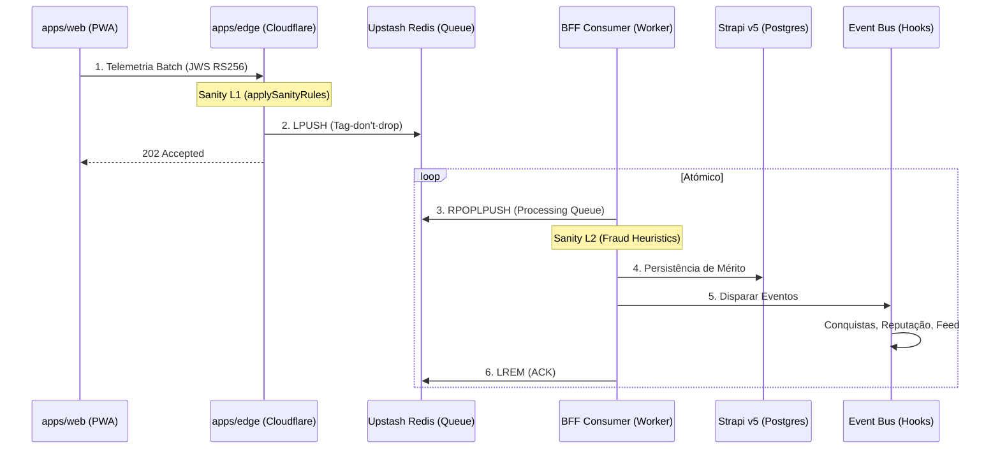

# Pipeline de Telemetria PDC v2 — Definição Soberana (B4)

O PDC captura o "músculo comportamental" através de um pipeline distribuído em 4 camadas, garantindo latência zero na ingestão e integridade absoluta no processamento de mérito.

---

## 🏗️ Diagrama de Fluxo (Dual-Layer Sanity)

O sistema utiliza a estratégia **"Tag-don't-drop"**: o Edge etiqueta eventos suspeitos, mas não os descarta, permitindo auditoria forense posterior.

---

## 🔐 Idempotência e a Falha da Meia-Noite (D6)

O PDC v2 resolve a dívida técnica **D6 (Midnight Rollover)** abandonando chaves baseadas em data (`tel:2026-04-21:...`).

### Estratégia SET NX EX 7d
Cada evento de telemetria possui um `eventId` (UUIDv4) gerado no cliente. O Consumer utiliza o padrão atómico do Redis:
- **Chave**: `tel:evt:{eventId}`
- **Comando**: `SET key 1 NX EX 604800` (7 dias)
- **Porquê?**: Chaves por data falham quando um batch cruza a meia-noite (eventos de ontem vs hoje). O TTL de 7 dias garante protecção contra replays de rede e duplicação no Outbox sem janelas de erro.

---

## 🔄 Outbox Replay (Sovereign Replay)

Para garantir a entrega **at-least-once**, o sistema implementa o **Outbox Pattern** no Strapi (`domain-events`).

1.  **Worker Isolado**: O replay não corre no processo principal da API (evita D5). É invocado via `npm run start:outbox-worker`.
2.  **Lock Distribuído**: Usa `outbox:lock` em Redis para garantir que apenas uma instância processa a fila.
3.  **Exponential Backoff**: Falhas no processamento incrementam `attempts`. O replay ignora eventos falhados recentemente baseado em `2^attempts * 1min`.
4.  **Chunk Size**: Processamento em blocos de 50 eventos para manter o event loop desimpedido.

---

## 📱 Resiliência no Cliente (PWA)

O `useTelemetry` hook em `apps/web` implementa garantias de entrega de classe mundial:

- **Offline Buffer**: Até 500 eventos guardados em `localStorage` se a rede estiver indisponível.
- **Keepalive**: Usa a flag `keepalive: true` no `fetch`. Essencial para garantir que eventos críticos de fecho de página (ex: `simulacao.abandonada`) cheguem à Edge mesmo que a aba seja encerrada.
- **Backoff Exponencial**: Se a Edge retornar `503`, o cliente aguarda intervalos crescentes antes de tentar re-sincronizar.
- **Tagging Forense**: Eventos detectados como "lentos" ou "fora de ordem" no browser são etiquetados com `metadata.clientFlagged`.

---
*Doc is Law — Última auditoria: 21 de Abril de 2026.*
