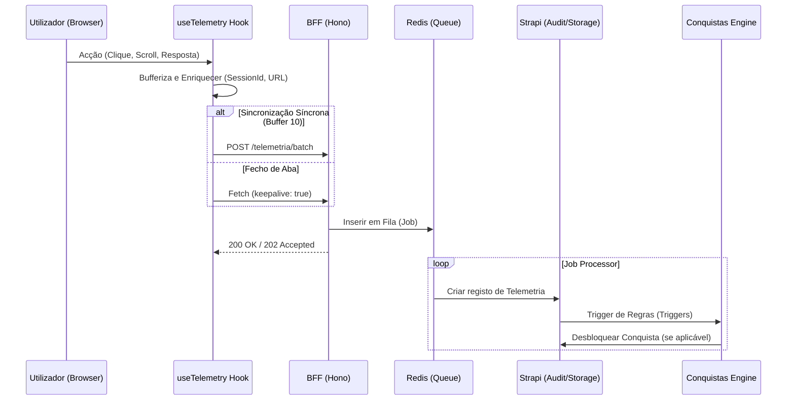

# Pipeline de Telemetria PDC v2

O PDC captura o "músculo comportamental" dos utilizadores através de um pipeline resiliente e distribuído.

## Diagrama de Fluxo

## Resiliência
1. **Offline Fallback**: Se o envio falhar, os eventos são guardados em `localStorage` (max 500) e sincronizados no próximo boot.
2. **Keepalive**: O uso de `fetch` com `keepalive: true` garante que eventos disparados no fecho da aba (como `visibility.lost`) cheguem ao servidor.
3. **Session Stability**: Cada sessão gera um UUID único, permitindo analisar o funil de conversão sem depender de cookies persistentes.
