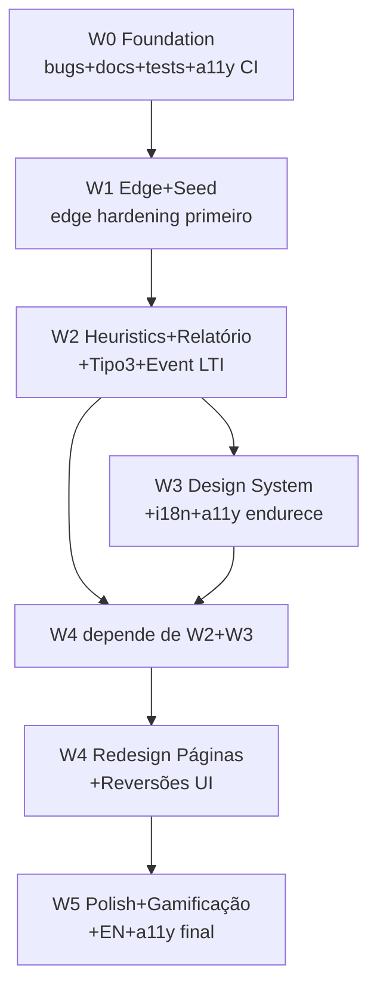
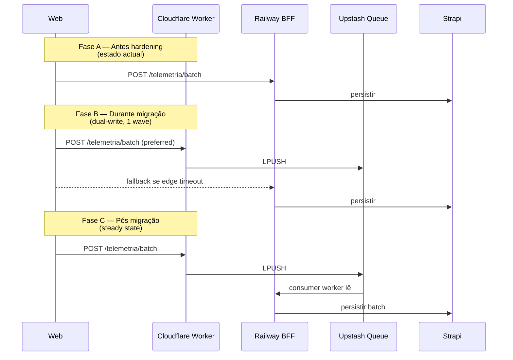
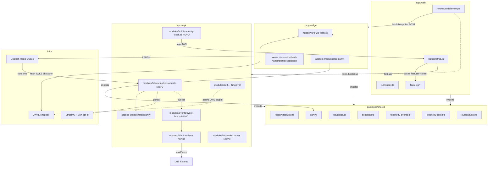
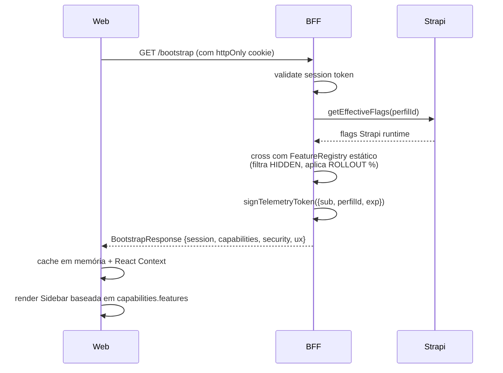
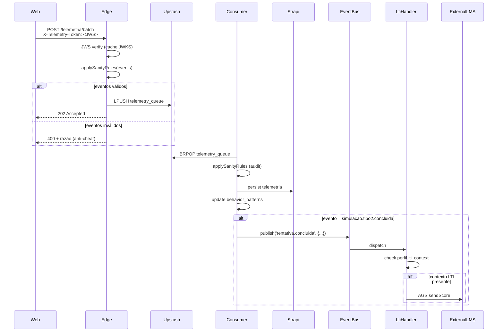

# Refactoring Approach — PDC v2 Restauração + Cherry-Pick (5 Waves + W0)

# Refactoring Approach — PDC v2

<user_quoted_section>Documento de abordagem técnica (Parte 2 do plan-refactor). Consolida 18 decisões fechadas com o utilizador (rondas 1+2) e define o caminho do estado actual para o estado-alvo: 5 Waves auto-contidas precedidas por W0 explícita de pre-flight + foundation. Não inclui implementação ticket-by-ticket — isso é o output do `ticket-breakdown`. Spec atlas cruzada: spec:63eac955-69ad-45d7-8599-09637d3ce043/3e8a4789-7b06-404b-93c7-fc9e91c37167.</user_quoted_section>

## 0. Contexto — Resumo do que já está decidido

| # | Decisão | Origem |
| --- | --- | --- |
| A1 | W0 explícita (pre-flight + docs + tests) antes de W1 | Utilizador |
| A2 | 16 melhorias + 15 reversões distribuídas por Wave técnica natural | Utilizador |
| A3 | `apps/edge` hardening PRIMEIRO em W1 (antes do seed narrativo) | Utilizador |
| A4 | i18n estrutura+Strapi W3 + EN W5+; a11y CI gate W0+endurece W3+polish W5 | Utilizador |
| B1 | BootstrapResponseSchema **layered** (`session`/`capabilities`/`security`/`ux`) | Utilizador |
| B2 | FeatureRegistry **híbrido** (estático no `@pdc/shared` + override Strapi runtime) | Delegado |
| B3 | TelemetryToken **JWT JWS RS256** (mesma chave RSA do JWKS LTI 1.3) | Delegado |
| C1 | `MensagensPage` **build-from-scratch** conforme spec v2 (W4) | Utilizador |
| C2 | Sanity validator em **`packages/shared/src/sanity/`** (regras puras, importadas por edge+BFF) | Utilizador |
| C3 | LTI Grade Passback **event-driven** (`tentativa.concluida` → handlers subscrevem) | Utilizador |
| C4 | Recriar AMBOS `roadmap.md` + `CONSTITUTION.md` v2.1 ratificada (W0) | Utilizador |
| C5 | `getReputacao()` muda para **endpoint separado** `/reputacao/me` 404-when-flag-off | Utilizador |
| C6 | `.planning_backup/` → **`docs/_archive/planning-2026-04/`** | Utilizador |
| D1 | **6 tickets atómicos** de testes em W0 (1 por área) | Utilizador |
| E1 | Pre-commit: lint + typecheck + test (--bail --changed); axe → CI gate; `--no-verify` bloqueado server-side | Delegado |
| E2 | `pdc-v2/specs/4e02dfe2-.../` Auth Fix → **auditar e fundir em W0**, arquivar set | Utilizador |
| F1 | Sidebar.tsx — **importar ****`Brain`****+****`Zap`** (intent original) | Utilizador |
| G1 | Naming **híbrido**: tickets antigos M*/Onda* mantêm-se; novos `W{n}-T{n}: <descrição>` | Delegado |

Decisões anteriormente fechadas no `understand-refactor` que se preservam: rejeitar Clerk, manter auth v2, tema CLARO `#F8F9FA`+`#004AAD`+`#FFB800` como base + Terracota `#D2691E` ≤5% acento, dark mode opcional, Inter+Instrument Serif+JetBrains Mono, file limit 300, PWA-First→Capacitor W6, deep-chat-react preservado, hubs Sidebar mantidos, Strapi só CMS, gateway pagamentos OUT, código Moodle/Canvas OUT.

## 1. Key Decisions

### 1.1 Structure — Como organizar a mudança

**Decisão — Decomposição por Wave técnica (5 Waves + W0 prefixo)**

| Wave | Responsabilidade | Critério de aceitação |
| --- | --- | --- |
| **W0 — Foundation** | Pre-flight bugs (3) + Docs sync (4) + 6 specs de teste characterization + Auditoria/fusão `4e02dfe2-...` + a11y CI gate + arquivo `.planning_backup/` | Build verde, types verdes, 6 testes verdes contra implementação atual, docs sem fantasmas, GitHub Branch Protection activa |
| **W1 — Estabilidade + Edge + Seed** | Hardening `apps/edge` (Telemetry Token JWS, dual-write, Upstash queue, deploy pipeline) + Seed narrativo (10 instituições, 30 mentores, 100 alunos, 4 áreas vocacionais) + Limpeza de fantasmas residuais | Edge worker em produção, telemetria a fluir edge→queue→consumer→behavior_patterns, dashboard com dados reais |
| **W2 — Heurísticas + Relatório + Tipo3** | Anti-cheat sanity validator + Heuristics Engine (φ/R/F/H em `@pdc/shared`) + Relatório Vocacional Premium + Sim Tipo 3 + Event-driven LTI Grade Passback (auto-fire) | Scores reais (não hardcoded), Relatório com Bento Grid + dados reais, Tipo 3 funcional, AGS dispara em cada conclusão |
| **W3 — Design System + i18n + a11y endurece** | Tokens Tailwind v4 finalizados (purgar hardcoded `text-slate-*`/`bg-blue-*`), Glassmorphism contextual, Bento Grid genérico, padrões africanos 3%, react-i18next + extracção PT, Strapi i18n.localized opt-in, contrast AA/AAA validado | Visual regression baseline, axe-core sem erros críticos, strings PT 100% extraídas |
| **W4 — Redesign de Páginas + Reversões UI** | Restaurar Mensagens (build-from-scratch), Feed completo 4 fontes (Geral/Vocacional/Institucional/Trending), Comments com moderação, Dashboard Bento, Top Bar Glass Header com Command+K, Sidebar slim hubs, Reputação Bento role-aware, Hub de Oportunidades "Match Terminal", Empty States aspiracionais | Todas as páginas amputadas restauradas, novo design system aplicado, E2E Playwright passa |
| **W5 — Polish + Gamificação + EN + a11y final** | Micro-interações, streaks, Tina omnipresente como camada de tradução E como assistente, Tier Bronze→Diamond, Talent Bounties, EN como segunda língua activa, axe full audit | Lighthouse Performance ≥90 mobile, EN funcional, gamificação activa, micro-interações em ≥80% dos elementos clicáveis |

**Princípio de placement — onde vive cada coisa NOVA:**

| Artefacto novo | Localização | Razão |
| --- | --- | --- |
| `FeatureRegistry` const + Schema | `packages/shared/src/registry/features.ts` | Single source of truth tipada |
| `SanityRule` types + `applyRules()` | `packages/shared/src/sanity/` | Importado por edge E BFF |
| `TelemetryEventNameSchema` Zod enum | `packages/shared/src/telemetry-events.ts` | Centraliza nomes canónicos (7 actuais + futuros) |
| Heuristics formulas (φ/R/F/H) | `packages/shared/src/heuristics.ts` | Frontend preview = Backend certificação |
| `BootstrapResponseSchema` | `packages/shared/src/bootstrap.ts` | Contrato consumido por web e validado por BFF |
| `ReputacaoBreakdown` schema | `packages/shared/src/reputation.ts` | 6 dimensões tipadas |
| Telemetry Token sign helper | `apps/api/src/modules/auth/telemetry-token.ts` | Reutiliza `lti.jwks.ts` keypair |
| JWS verify middleware (edge) | `apps/edge/src/middleware/jws-verify.ts` | Cache JWKS no isolate |
| Event bus leve | `apps/api/src/modules/events/event-bus.ts` | EventEmitter ou pub/sub Redis (decisão técnica W2) |
| LTI handler subscriber | `apps/api/src/modules/lti/lti.handler.ts` | Subscribe a `tentativa.concluida` |
| i18n setup + ficheiros | `apps/web/src/i18n/{index.ts,locales/pt.json,locales/en.json}` | Padrão react-i18next |
| Bootstrap fetch + state | `apps/web/src/lib/bootstrap.ts` | App boot → hydrate features+token+ux |

**Princípio de gathering — onde está a lógica scattered hoje:**

| Tema | Hoje espalhado em… | Consolidar em… |
| --- | --- | --- |
| Telemetria | `routes/telemetria.ts`, `useTelemetry.ts`, `telemetria.processor.ts` | Manter divisão; adicionar edge layer + sanity shared |
| Reputação | `reputation.service.ts` (BFF), `ReputacaoPage.tsx` (web minimal) | Service mantém-se; UI Bento Grid em W4 |
| Feature flags | `feature-flags.service.ts` (Strapi runtime), strings soltas no código | Registry estático no shared + service Strapi mantém-se |
| Heuristics | `heuristics.engine.ts` actual (BFF) | Mover formulas puras para `@pdc/shared`; engine = orquestrador |
| Eventos LTI/conquista/notificação | Inline em `routes/simulacoes.ts` (com bug `log` sem import) | Event bus único + handlers subscrevem |

### 1.2 Transition — Como migrar com segurança

**Decisão — Strangler Pattern para edge + bottom-up para Waves**



**Coexistência durante transição edge (W1):**



**Order — bottom-up:** W0 (foundation) → W1 (dados+infra edge) → W2 (motor matemático) → W3 (visual base) → W4 (redesign+reversões) → W5 (polish+EN).

**Rollback strategy:**

- Cada Wave é git-revertable individualmente.
- W1 edge hardening é apenas código novo em `apps/edge/` — zero touch em `apps/api/` durante a fase A→B; rollback = router DNS.
- W2 anti-cheat é flag-gated (`SANITY_VALIDATOR_ENABLED`); rollback = flip flag.
- W4 reversões UI são feature-flagged via `FEED_V2_ENABLED`, `MENSAGENS_ENABLED` — utilizador pode comparar antes/depois.

### 1.3 Mapping & Gaps — O que não traduz cleanly

| Gap | Como resolver |
| --- | --- |
| Tickets M*/Onda* antigos vs W*-T* novos | **Híbrido (G1)**: antigos intactos como histórico; novos prefix `W{n}-T{n}`. Mapping table no `roadmap.md` recriado. |
| Spec Mestra `83bb2912` ~45 rotas vs implementação parcial | **Audit page-by-page em W4**. Output: matriz "rota |
| `.planning/` actual (post-REPLACE) vs `.planning_backup/` (pré-REPLACE) vs `Documentos/Traycer/tmp/` (alma v2 expandida) | **Canónica = ****`.planning/`**** actual + correcções W0**. `_backup` arquivado em `docs/_archive/`. Specs valiosas migram para `docs/produto/`. |
| Feature flags: rollout gradual vs hide-fantasma (semântica dual) | **Constitution emendada**: registry estático declara existência (STABLE/BETA/ALPHA/HIDDEN/ROLLOUT); Strapi runtime controla ON/OFF efectivo. `HIDDEN` = feature em desenho; `ROLLOUT` = % de utilizadores; restantes booleanos. |
| `getReputacao()` retornar `0` ambíguo | **C5 — Endpoint separado** `/reputacao/me` retorna 404 quando flag off, payload completo quando on. `getReputacao()` mantém-se internamente para outros consumidores; UI usa endpoint novo. |
| `MensagensPage` comentada no router | **Build-from-scratch** em W4 conforme spec v2. Não restore from git. |
| LTI passback gate `metadata.ltiContext` | **Event-driven**: publicar `tentativa.concluida` event; LTI handler decide se aplicável (presença de contexto LTI no perfil). |
| Score Tipo 2 hardcoded `=8.5` | **Substituir em W2** pela função `analyzeFluidity(events)` real. Behavioural change explícito. |
| Tipo 3 placeholder `<Wrench>` | **Implementar em W2** com player próprio + telemetria. Prioridade Alta restaurada. |
| Sora/Satoshi (conversa) vs Inter/Instrument Serif (v2 canónica) | **Inter+Instrument Serif+JetBrains Mono** (decisão fechada). Sora/Satoshi rejeitados. |
| Tema escuro Tech-Terracota dominante (post-REPLACE) | **Tema CLARO base + dark mode opcional** (já reflectido em `index.css`). Acções W3 = limpeza hardcoded + verificação contrast. |

**Semantic changes intencionais:**

- `getReputacao()` em endpoint separado: comportamento muda (0 → 404 quando flag off).
- Telemetry POST: client passa a usar edge primeiro com fallback BFF (dual-write → eventual cutover).
- LTI passback: muda de inline-conditional para event-handler subscriber.

### 1.4 Design — Interfaces e tipos novos

**`BootstrapResponseSchema`**** (Opção C layered):**

```ts
// packages/shared/src/bootstrap.ts (~30 linhas)
export const BootstrapResponseSchema = z.object({
  session: z.object({ user: UserSchema, perfilId: z.string() }),
  capabilities: z.object({ features: z.record(z.boolean()), roles: z.array(RoleSchema) }),
  security: z.object({ telemetryToken: z.string(), csrfToken: z.string() }),
  ux: z.object({ theme: z.enum(['light','dark','system']), locale: z.enum(['pt-AO','en-US']) }),
});
```

**`Features`**** registry (B2 híbrido):**

```ts
// packages/shared/src/registry/features.ts (~80 linhas)
export const FeatureStatusSchema = z.enum(['STABLE','BETA','ALPHA','HIDDEN','ROLLOUT']);
export const Features = {
  TELEMETRY_CORE: { id: 'telemetry-core', status: 'STABLE', label: 'Telemetria', owner: 'core' },
  REPUTATION_VISIBLE: { id: 'reputation-visible', status: 'BETA', label: 'Reputação visível', owner: 'product' },
  AUTO_ACHIEVEMENTS: { id: 'auto-achievements', status: 'STABLE', label: 'Conquistas automáticas', owner: 'product' },
  // ... outras
} as const;
export type FeatureKey = keyof typeof Features;
```

**`TelemetryToken`**** payload:**

```ts
// packages/shared/src/telemetry-token.ts (~20 linhas)
export const TelemetryTokenPayloadSchema = z.object({
  sub: z.string(),       // userId
  perfilId: z.string(),
  iss: z.literal('pdc-v2-bff'),
  aud: z.literal('pdc-v2-edge'),
  exp: z.number(),       // Unix timestamp + 1h
  iat: z.number(),
});
```

**`SanityRule`**** shape:**

```ts
// packages/shared/src/sanity/types.ts
export interface SanityRule {
  name: string;
  appliesTo: (event: TelemetryEvent) => boolean;
  validate: (event: TelemetryEvent, context?: { previous?: TelemetryEvent }) =>
    { valid: true } | { valid: false; reason: string };
}
```

**`DomainEvent`**** para event bus:**

```ts
// apps/api/src/modules/events/types.ts
export type DomainEventName = 'tentativa.concluida' | 'curso.completo' | 'conquista.desbloqueada';
export interface DomainEvent<T = unknown> {
  name: DomainEventName;
  payload: T;
  publishedAt: number;
  correlationId: string;
}
```

### 1.5 New Concerns — Problemas que o refactor introduz

| Concern | Mitigação |
| --- | --- |
| **Concurrency**: dual-write edge+BFF durante W1 fase B pode duplicar eventos | `eventId` UUID já existe no `TelemetryEventSchema` → idempotência no consumer (`SADD seen_event_ids` no Redis com TTL 7d) |
| **Failure mode novo**: edge JWKS fetch falha no boot do isolate | Retry com backoff + permitir grace window (cache stale 1h adicional); pior caso = worker rejeita 503, frontend faz fallback para BFF Railway |
| **Failure mode novo**: event bus perde event | Para eventos críticos (`tentativa.concluida` → LTI score), usar Outbox Pattern: persistir evento no Strapi numa tabela `domain_events` antes de publicar, consumer marca como processed. Reentrante. |
| **Performance**: bootstrap layered tem mais payload | Mensurável: ~600 bytes vs ~150 bytes single-endpoint. Aceitável para 1 request por sessão. Comprimido gzip cai para ~250 bytes. |
| **Complexidade introduzida — event bus** | Começar com EventEmitter Node nativo (zero deps); migrar para Redis pub/sub se houver multi-instância. Decisão técnica W2. |
| **Complexidade — sanity validator dupla** | Aceite por design: edge bloqueia óbvios (CPU barato); BFF faz audit completo (forense). Regras IDÊNTICAS via `@pdc/shared`. |
| **Strapi i18n migração** | Faz field-by-field opt-in. Nenhum content-type forçado em W3; só os que vão ter EN ativado em W5. |
| **a11y CI gate pode bloquear PRs em massa no W0** | Mitigar: gate começa como warning em W0, vira erro em W3. |

### 1.6 Risk Mitigation — Tratamento dos hotspots da §2 do atlas

| Hotspot do atlas | Mitigação técnica neste approach |
| --- | --- |
| 🔴 Pipeline telemetria multi-camada | W0 testes characterization de `useTelemetry` ANTES de mover para edge. Sanity validator dupla. eventId idempotência. |
| 🔴 Auth próprio (jose+httpOnly+RBAC) | **ZERO TOQUE** em `apps/api/src/modules/auth/`. TelemetryToken é AUTH SEPARADO (JWS short-lived) — não substitui session token. |
| 🟠 Reputação como pilar | C5 endpoint separado + Bento Grid role-aware em W4 + 6 dimensões expostas. |
| 🟠 ADR-005 migração | Strangler edge primeiro (Fase A→B→C). Rollback via DNS routing. |
| 🟠 Tina dual papel | Mantém `<TinaChat />` global em `AppLayout`. Adiciona "Threaded Insights" em Relatório Vocacional como Anotações Laterais (segunda capacidade, mesma infra). |
| 🟠 Sim Tipo 1/2/3 estados | W2 substitui hardcoded; Tipo 3 ganha player próprio com telemetria nativa. |
| 🟠 Schemas Strapi vs Shared | W0 audit + W2 alinhamento. Strapi `experiencia` JÁ está alinhado (verificado no atlas — F5 refutado). |
| 🟠 Realtime não migra para Workers | Confirmado — Socket.IO permanece em Railway. Edge só faz HTTP stateless. |
| 🟡 4 fontes documentais (8 reais) | C6 + audit C/E2 + migração para `docs/produto/` + arquivo `_archive/`. |
| 🟡 Identidade visual hardcoded | W3 purga + lint rule contra `text-slate-*`/`bg-blue-*` directos. |
| 🟡 Sidebar 5 links 404 | **Refutado pelo atlas** — todas as 5 rotas existem. F1 fix Brain+Zap import. Mensagens é o ÚNICO 404 real (build em W4). |
| 🟡 I18N (§2.12) | W3 estrutura + W5 EN ativado. |
| 🟠 a11y (§2.13) | W0 axe-core CI gate (warning) + W3 endurece (erro) + W5 polish. |

## 2. Target State

### 2.1 Como o código fica estruturado

```
pdc-v2/
├── apps/
│   ├── web/        # React 18 + Vite + Tailwind v4 + i18n + a11y
│   ├── api/        # Hono BFF (auth + lógica + realtime + event bus)
│   └── edge/       # Cloudflare Worker (telemetria + landing pulse + catálogos)
├── packages/
│   └── shared/     # contratos Zod + registry + sanity + heuristics + bootstrap
├── infra/
│   └── strapi/     # CMS v5 + i18n.localized opt-in + ESLint scripts/
├── docs/
│   ├── produto/    # specs valiosas migradas de Documentos/Traycer/
│   ├── decisoes/   # ADRs (1-5 + novos: 006 event-bus, 007 i18n, 008 a11y)
│   └── _archive/
│       └── planning-2026-04/   # .planning_backup arquivado
└── .planning/      # PROJECT.md + REQUIREMENTS.md + STATE.md + roadmap.md (NOVO 5-Waves) + CONSTITUTION.md (NOVA v2.1 ratificada)
```

### 2.2 Propriedades do estado-alvo

- **Honesto**: zero `[x]` em `REQUIREMENTS.md` que não corresponda a comportamento real verificável.
- **Tipado de ponta a ponta**: BFF `/bootstrap` valida com Zod o mesmo schema que o Frontend consome.
- **Edge-ready**: telemetria + landing pulse + catálogos públicos read corre em Cloudflare Workers.
- **Resiliente**: telemetria com offline-first + sanity validator dupla + dual-write durante migração.
- **Observable**: event bus interno publica eventos para LTI passback, conquistas automáticas, notificações.
- **Acessível**: axe-core sem erros críticos, contrast AA/AAA validado, touch targets ≥44px.
- **i18n-ready**: estrutura `react-i18next` instalada, strings PT extraídas, EN preparado para W5.
- **Premium visual**: tema claro `#F8F9FA`+`#004AAD`+`#FFB800` base + Terracota acento ≤5% + Bento Grid + Glassmorphism + padrões africanos 3% + JetBrains Mono para dados.
- **Bisturi não casino**: Mensagens restauradas + Feed 4 fontes restauradas + Likes/Bookmarks/Ratings restaurados, mas reputação como token transversal valoriza mérito sobre vaidade.

### 2.3 Verificável por

- `npm run lint && npm run typecheck && npm test --run` verde em monorepo inteiro (incluindo `infra/strapi/scripts`).
- `axe-core` sem erros críticos via CI.
- `wrangler dev` funcional + `wrangler deploy` produz worker activo em pré-produção.
- E2E Playwright suite (49 ficheiros) verde + nova suite "Mensagens-restored" + "Reputation-bento".
- k6 load test confirma `POST /telemetria/batch` <100ms p99 no edge.
- Visual regression baseline (W3 entrega).
- Manual smoke: pitch deck Tech-Terracota visualmente coerente com Bento Grid no Dashboard.

## 3. Component Architecture

### 3.1 Diagrama de componentes (high-level)



### 3.2 Componentes-chave (responsabilidades)

| Componente | Responsabilidade | Localização |
| --- | --- | --- |
| `BootstrapHandler` | Compor `BootstrapResponse` (user+features+token+ux) num único endpoint | `apps/api/src/routes/bootstrap.ts` (NOVO) |
| `TelemetryTokenSigner` | Emitir JWS RS256 short-lived (1h) na hora do bootstrap/login/refresh | `apps/api/src/modules/auth/telemetry-token.ts` (NOVO) |
| `JwsVerifyMiddleware` | Edge middleware que cacheia JWKS no isolate + valida JWS por request | `apps/edge/src/middleware/jws-verify.ts` (NOVO) |
| `SanityValidator` | Aplica regras puras (do `@pdc/shared/sanity`) a um evento; retorna válido/inválido + razão | importado por `apps/edge` E `apps/api` |
| `EventBus` | Pub/sub interno no BFF; v1 = EventEmitter nativo; v2 (futura) = Redis pub/sub | `apps/api/src/modules/events/` (NOVO) |
| `LtiPassbackHandler` | Subscriber de `tentativa.concluida`; chama `ltiAgs.sendScore()` se contexto LTI | `apps/api/src/modules/lti/lti.handler.ts` (NOVO) |
| `TelemetryConsumer` | Consome Upstash queue → sanity → behavior_patterns → publica eventos | `apps/api/src/modules/telemetria/consumer.ts` (NOVO) |
| `ReputationRoute` | `GET /reputacao/me` 404 quando flag off; payload completo quando on | `apps/api/src/routes/reputation.ts` (REFACTOR) |
| `FeatureRegistry` | Const tipado + Zod metadata; consultado pelo BFF para compor `features` no bootstrap | `packages/shared/src/registry/features.ts` (NOVO) |
| `i18n setup` | `react-i18next` config + `pt.json` + `en.json` (vazio em W3, populado W5) | `apps/web/src/i18n/` (NOVO) |
| `EdgeWorker (hardened)` | nodejs_compat, secrets, deploy pipeline, dual-write logic | `apps/edge/` (REFACTOR) |

### 3.3 Padrões de interacção

**Boot flow (W4 final):**



**Telemetria flow (W1 fase C, edge produção):**



### 3.4 Schema changes

| Componente | Mudança | Wave |
| --- | --- | --- |
| `behavior_patterns` (Strapi) | Já existe — confirmar campos `phi`, `resilience_index`, `focus_stability`, `tina_summary_json` | W1 |
| `domain_events` (Strapi) | NOVA tabela — Outbox pattern para event bus crítico (`name`, `payload`, `processed`, `published_at`) | W2 |
| `experiencia` (Strapi) | Já tem `vagas`, `dataInicio`, `dataFim`, `localizacao`, `modalidade` (refutado F5) | — |
| Strapi i18n.localized | Opt-in em `curso`, `experiencia`, `programa`, `simulacao` (apenas campos texto) | W3 |
| `perfil.lti_context` (Strapi) | Adicionar campo `lti_context` JSONB para handler LTI saber se aplicar passback | W2 |
| `domain_events` consumer state | Manter em Redis (`SADD processed_events`) com TTL para idempotência | W2 |

## 4. Invariants

### 4.1 Behavioural

- **Auth flow**: login/logout/refresh/OAuth/OTP **inalterados**. Cookies httpOnly preservados (ADR-003).
- **6 roles**: `aluno|mentor|instituicao|moderador|comite_cientifico|super_admin` mantidos. RBAC middleware intacto.
- **Strapi v5 = só CMS**: zero lógica de negócio movida para Strapi. BFF orquestra.
- **`<TinaChat />`**** global em AppLayout**: continua presente em todas as páginas autenticadas (não regredir para "fab inferior" nem remover).
- **Sidebar hubs**: Aprender / Explorar / Meu Futuro / Comunidade / Estúdio Mentor / Gestão Institucional / Autoridade preservados (estado actual já correcto).
- **Tipo 1 score auto-avaliado**: até W2 substituir, comportamento mantém-se.
- **Tipo 2 score hardcoded**: até W2 substituir por algoritmo, comportamento mantém-se mas marcado com `// FIXME [W2-T?]`.
- **PWA Service Worker**: `manifest.json` + registo em `main.tsx` continuam funcionais.
- **Realtime Socket.IO**: mensagens + notificações + presence FICAM em Railway BFF (Workers não suportam).

### 4.2 Contract

- `/bootstrap` é **NOVO endpoint, NÃO substitui** `/auth/me` e `/feature-flags/effective` durante W1-W4 (coexistem para rollback). Em W5 podem ser deprecated com aviso.
- `TelemetryEvent` schema no `@pdc/shared` mantém `eventId` UUID e `clientTimestamp`. Adições são opcionais (backward compat).
- `JWKS` endpoint público existente (`/.well-known/jwks.json`) intacto. Telemetry Token reutiliza a mesma chave RSA — não introduz novo keypair.
- `LtiAgs.sendScore()` assinatura mantém-se (`lineitemUrl`, `score`, `accessToken`); chamadores mudam (de inline para handler).
- `getEffectiveFlags()` no `feature-flags.service` mantém assinatura. Nova lógica de cross com registry estático faz-se em `BootstrapHandler`.

### 4.3 Performance

- BFF Railway latency p99 não pode subir vs baseline actual (medir antes de W1).
- Edge `POST /telemetria/batch` p99 < 100ms (target ADR-005).
- `GET /bootstrap` p99 < 300ms (composição em paralelo, cache Redis).
- `axe-core` em CI < 60s para PR típico.
- Vitest pre-commit < 30s wall-clock (apenas ficheiros tocados via `--changed`).
- Bundle web: i18n + react-i18next adiciona ~25kB gzip — aceitável.

### 4.4 Data

- Linhas existentes em `behavior_patterns`, `tentativa`, `perfil`, etc. **preservadas** — zero migração destrutiva.
- Strapi i18n field-by-field opt-in: campos não-localizados continuam single-locale (PT) por defeito; apenas campos marcados ganham `pt-AO`/`en-US` versions.
- `eventId` UUID idempotência: evento com mesmo ID nunca é processado 2x.
- TelemetryToken expira em 1h; tokens emitidos antes do refresh continuam válidos até `exp`.
- `domain_events` outbox: events publicados são preservados até consumer marcar `processed: true`. Replay possível.

## 5. Test Strategy

### 5.1 Estado actual (verificado no atlas)

- 1 unit test (vocacional) + 2 contract tests (area-enum + feature-flags) + 1 hook test (useTelemetry, com possíveis dependências quebradas) + 1 shared test (telemetry).
- 49 ficheiros E2E Playwright cobrindo auth (7), admin (5), cursos (5), simulações (3 — sem Tipo 3), feed (4), discussions (2), conquistas (2), mensagens (2), mentorias (2), moderação (2), perfil (3), vínculos (2), critical-path (1), experiencias (2).
- 10 scripts k6 para load (auth, catálogo, discussions, feed, full-journey, soak, spike, stress, telemetry-parallel, helpers).

### 5.2 Estratégia por Wave

**W0 — Test Foundation (D1: 6 tickets atómicos):**

| Ticket | Cobertura | Razão |
| --- | --- | --- |
| `W0-T1` | `useTelemetry.spec.ts` — batching, keepalive, fallback offline, sanity client-side, retry com backoff | Hook é tocado por edge migration (W1) e sanity (W2) |
| `W0-T2` | `heuristics.engine.spec.ts` — formulas φ/R/F/H com casos limite (0, infinito, valores impossíveis) | Engine é refactorizado em W2 (mover formulas para `@pdc/shared`) |
| `W0-T3` | `vocacional.service.spec.ts` — expandir spec existente para cobrir 100 personas seed | Service é tocado por relatório premium (W2) |
| `W0-T4` | `reputation.service.spec.ts` — 6 dimensões + cache Redis + flag REPUTATION_VISIBLE | Service ganha endpoint próprio (W2 C5) e UI Bento (W4) |
| `W0-T5` | `conquistas.engine.spec.ts` — auto-trigger por evento + flag AUTO_ACHIEVEMENTS | Engine vira subscriber de event bus (W2) |
| `W0-T6` | `lti.ags.spec.ts` (+ service) — sendScore com mock fetch + envelope JSON LTI 1.3 | sendScore vira handler de event bus (W2 C3) + bug fix (W0) |

**Estratégia comum**: testes usam **stubs in-memory que validam schemas reais do ****`@pdc/shared`** (Constitution v2.1 — zero mocks). Stub que não respeita o schema falha o teste.

**W1-W5 — Testes incrementais:**

- W1 edge: nova suite vitest para `apps/edge` (jws verify, sanity, queue). Suite k6 nova: `edge-load.js`.
- W2 anti-cheat + heuristics + Tipo 3 + LTI handler: testes próprios + integração (event bus dispara handler correctamente).
- W3 design system + i18n + a11y: visual regression baseline (Percy ou Chromatic — decisão técnica W3) + axe-core CI gate.
- W4 redesign: nova suite Playwright para `mensagens-inbox`, `feed-v2`, `reputacao-bento`, `comments-moderation`.
- W5 polish: lighthouse CI score ≥90 mobile + EN translation coverage ≥80%.

### 5.3 Gating rule

Cada Wave técnica que toque uma das 6 áreas Q2 SÓ pode começar refactor depois do teste W0 correspondente passar. Se W0 test falha contra implementação actual, **isso revela bug latente** — endereçar antes de avançar.

### 5.4 Onde NÃO investir

- Cobertura UI 100% (botões, cores) — gordura. Foco na pipeline de dados (telemetria → algoritmo → relatório).
- Mocks de serviços externos — usar stubs in-memory que respeitam schemas reais.
- Strapi auto-generated code — coberto pelas próprias tools do Strapi v5.

## 6. Próximos passos

1. **Validação** (opcional mas recomendado): `architecture-validation` para stress-test simplicidade, segurança, codebase fit.
2. **Decomposição**: `ticket-breakdown` para criar tickets atómicos `W0-T1...W5-T?` com identificação de dependências e ordem de execução.
