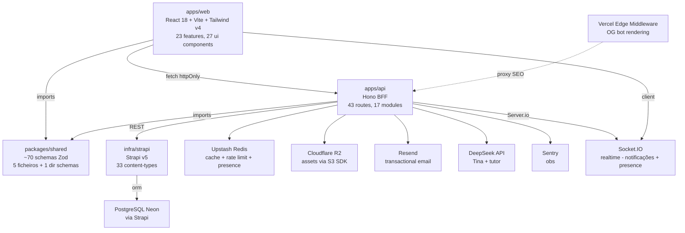
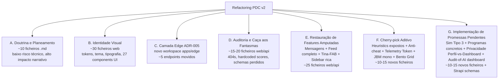
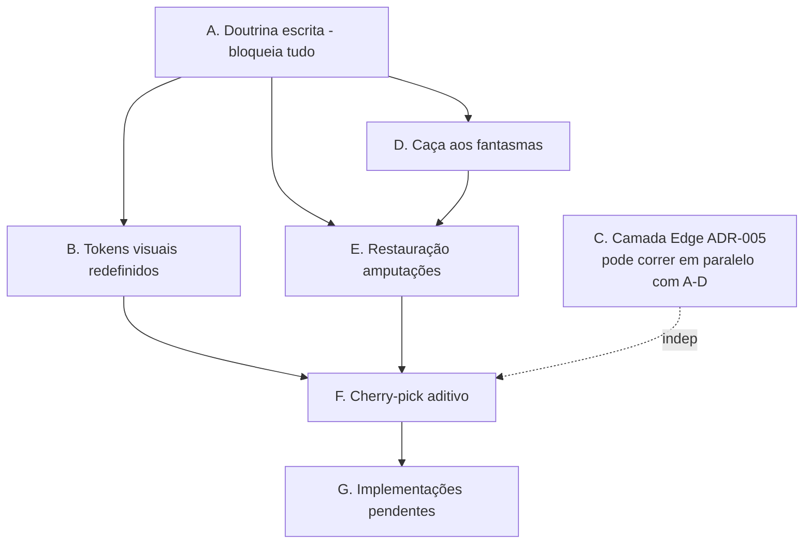

# Refactoring Analysis — PDC v2 Restauração da Alma + Cherry-Pick

# Refactoring Analysis — PDC v2

<user_quoted_section>Documento de análise (Parte 1 do plan-refactor). Não propõe soluções, apenas mapeia o estado real do código contra a alma v2 canónica e a conversa de Abril 15-17 que executou o REPLACE indesejado. Serve como atlas único antes de decidir abordagem técnica.</user_quoted_section>

## 0. Contexto deste refactoring

|  |  |
| --- | --- |
| **Origem do problema** | A conversa de Abril 15-17 (`chat:63eac955-69ad-45d7-8599-09637d3ce043` da sessão original) foi *input* de melhorias mas tornou-se *replace* destrutivo. O código actual reflecte esse replace. A documentação (`.planning/`) também. A alma v2 vive em `.planning_backup/` + `Documentos/Traycer/tmp/specs |
| **Objetivo** | Restaurar a alma v2 como base + adoptar 16 melhorias aditivas da conversa + reverter 15 cedências destrutivas + implementar ADR-005 (edge híbrido) + reorganizar planeamento. |
| **Risk level** | CORE / Alto, mitigado por faseamento em 5 Waves. |
| **Decisões já fechadas** | Rejeitar Clerk (manter auth v2). Tema CLARO (`#F8F9FA` + `#004AAD` + `#FFB800`) como BASE; escuro como opção; Terracota `#D2691E` como acento ≤5%. ADR-005 implementação na W1 (não adiar). PWA-First; Capacitor no W6. v1 (`/home/cj/1-PDC`) intocado. Strapi continua só como CMS. Sem gateway de pagamentos. |

## 1. Mapa de Dependências

### 1.1 Topologia geral do monorepo

### 1.2 Inventário do BFF (`apps/api/`)

**43 ficheiros de rota** em `apps/api/src/routes/`:
admin, ai, auth (3 ficheiros), area-enum.contract.spec, catalogo, catalogo-explorar, catalogo-pessoas, comments, comite, conquistas, cursos, denuncias, discussions, estudante, experiencias, feature-flags (+ contract spec), feed (+ helpers), health, interactions, landing, lti, media, mensagens, mentorias, moderacao, notificacoes, perfis, programas, projetos, propostas, ratings, reputation, seo, simulacoes, telemetria, tina, vinculos, vocacional.

**17 módulos** em `apps/api/src/modules/`:
ai, analysis (heuristics.engine), auth (service + middleware + helper + otp.service + rbac.middleware), conquistas (engine), feature-flags (service), feed, landing, lti (jwks + ags + nrps), mail, media, perfil (serializer), realtime (socket.service), reputation (service), strapi (client), telemetria, tina (service + knowledge + guardrails + ratelimit), vocacional.

**5 middlewares** em `apps/api/src/middleware/`: sentry, security, rateLimit, cache, audit.

**Bootstrap**: `apps/api/src/index.ts` regista 43 rotas + inicializa Sentry, Socket.IO, Tina knowledge index.

### 1.3 Inventário do Frontend (`apps/web/`)

**23 features** em `apps/web/src/features/`:
admin, ai, aluno, auth, catalogo, comite, conquistas, cursos, discussions, experiencias, feed, instituicao, landing (com `MicroDesafio.tsx` + `MicroDesafioVeredito.tsx`), mensagens, mentor, mentorias, moderacao, perfil, projetos, reputacao (com `ReputacaoPage.tsx`), simulacoes (com `Tipo1Player.tsx` + `Tipo2Player.tsx` + `SimulacaoPlayerPage.tsx`), tina, vinculos.

**27 UI components** em `apps/web/src/components/`:
auth/ProtectedRoute; layout/{TopBar, Sidebar, AppLayout, RootLayout, SEOHead}; ui/{Avatar, Badge, BookmarkButton, Button, Card, ConectarButton, DenunciarButton, EmptyState, Input, LikeButton, Modal, Pagination, RatingStars, Skeleton, Spinner, Tabs, Table, ThemeToggle, Toast, AppErrorBoundary}.

**8 páginas top-level** + `pages/dashboard/{Aluno|Mentor|Instituicao}Dashboard.tsx`.

### 1.4 Inventário do Shared (`packages/shared/src/`)

**~70 schemas Zod** em `index.ts` (815 linhas — viola file limit 200/300 da Constitution; é a excepção documentada).

**Ficheiros separados**: `user.ts`, `core.ts`, `cursos.ts`, `simulacoes.ts`, `experiencias.ts` (top-level), `telemetry.ts`, `telemetry.service.ts`, `telemetry.spec.ts`, `behavior-patterns.ts`, e em `schemas/`: `enums.ts` (com `AreaVocacionalSchema`), `programas.ts`, `propostas.ts`, `projetos.ts`, `experiencias.ts`.

**Coberturas notáveis**: 4 fluxos de Feed (FeedItem/Stats/Weights/Response), 4 tipos de Vínculo (`student-student`, `student-mentor`, `student-institution`, `mentor-institution`), interações transversais polimórficas (`InteractionTargetType`), LTI 1.3 completo (Plataforma + Launch claims + Score), Mentorias V1 e V2.

**Ausências críticas**: `FeatureRegistry`/`FeatureKey` enum (flags são strings soltas), `BootstrapResponseSchema` (não há endpoint consolidado), `TelemetryToken` (ADR-005 menciona, schema inexistente), `ReputacaoBreakdown` schema, sem `Tier` enum (Bronze→Diamond da conversa).

### 1.5 Inventário do Strapi (`infra/strapi/src/api/`)

**33 content-types**: audit-log, behavior-pattern, bookmark, certificado, comment, conquista, conquista-utilizador, curso, denuncia, experiencia, feature-flag, instituicao, inscricao, like, mensagem, mentoria, modulo, modulo-item, notificacao, partilha, perfil, perfil-vocacional, post, programa, projeto, proposta, rating, simulacao, subscricao, telemetria, tentativa, vinculo, voto-projeto.

**Scripts**: `infra/strapi/scripts/seed-narrativo-monumental.ts` + `infra/strapi/scripts/seed-narrativo.ts` — auditoria nestes ficheiros está pendente para confirmar se já implementam as 4 áreas + 100 personas da conversa.

**Sem ESLint configurado** no workspace.

### 1.6 Quem chama quem (call-graph crítico)

| Capacidade | Frontend caller | BFF route | Service module | Persistência |
| --- | --- | --- | --- | --- |
| Auth login | `LoginPage.tsx` → `useAuth()` → AuthContext | `/auth/*` (auth.ts, auth.oauth.ts, auth.otp.ts) | `auth.service` (`node:crypto`, jose) | Strapi `perfil` + cookies httpOnly |
| Telemetria | `useTelemetry.ts` (hook global) | `/telemetria` (route) | `modules/telemetria` | Redis (queue) → Strapi `telemetria` (eventual) |
| Reputação | `ReputacaoPage.tsx` → `reputationApi.getMe()` | `/reputacao` | `modules/reputation/reputation.service` (6 dimensões + cache Redis 5min + flag `REPUTATION_VISIBLE`) | Strapi `perfil.reputacao` |
| Heuristics | (não exposto na UI) | (sem rota directa) | `modules/analysis/heuristics.engine` | Strapi `behavior-pattern` |
| Conquistas auto | (eventos disparam) | `conquistas.controller.ts` | `modules/conquistas/conquistas.engine` (flag `AUTO_ACHIEVEMENTS`) | Strapi `conquista-utilizador` |
| Feed | `FeedPage.tsx` (tabs `geral` \| `trending`) | `/feed` (+ `feed.helpers.ts`) | `modules/feed` (cache `entity_score`) | Strapi multi-content-type |
| LTI Launch | (LMS externo) | `/lti` | `modules/lti/{jwks, ags, nrps}` | Strapi + JWT cookies |
| Tina chat | `<deep-chat-react>` em features/tina | `/tina` | `modules/tina/{service, knowledge, guardrails, ratelimit}` | Redis (knowledge index + rate) + AI provider |
| Realtime | `useSocket()` no web | (init no `index.ts`) | `modules/realtime/socket.service` (cors origin via env) | em-memória + Redis (planeado) |
| Discussions | `DiscussionsPanel` + `DiscussionThread` | `/discussions` (flag `DISCUSSIONS_ENABLED`) | inline em routes | Strapi `comment` polimórfico |
| Perfil V2 público | `PerfilPublicoPage` | `/perfis` + `/catalogo/mentores` (flag `PROFILE_V2_PUBLIC`) | `modules/perfil/perfil.serializer` | Strapi `perfil` |

### 1.7 Estado de feature flags (4 flags activas)

| Flag | Lida em | Comportamento |
| --- | --- | --- |
| `DISCUSSIONS_ENABLED` | `routes/discussions.ts`, `CursoDetailPage.tsx` | Esconde feature inteira se off |
| `PROFILE_V2_PUBLIC` | `routes/perfis.ts`, `routes/catalogo-pessoas.ts` | Rollout gradual da serialização nova |
| `REPUTATION_VISIBLE` | `modules/reputation/reputation.service` | Retorna `0` se off (esconde da UI por valor zero — **leakage risk**) |
| `AUTO_ACHIEVEMENTS` | `modules/conquistas/conquistas.engine` | Engine retorna `[]` se off |

### 1.8 Documentação versus realidade do código

| Doc actual diz… | Código real mostra… | Drift |
| --- | --- | --- |
| `STATE.md`: "Fase 5 LTI [x] COMPLETA" | `lti.ts` + `lti.jwks.ts` + `lti.ags.ts` + `lti.nrps.ts` existem; `sendScore()` funcional **mas nunca disparado automaticamente** | Parcial — falta integração com simulações |
| `STATE.md`: "Fase 7 IA [x] COMPLETA" | `tina.service.ts` + RAG + guardrails + ratelimit em código; deep-chat-react instalado | Sub-validado — Tina relegada a "anotações" pela conversa, mas componentes existem |
| `roadmap.md`: "Sem Top Bar" | `components/layout/TopBar.tsx` existe e é usado | Doc mente |
| `roadmap.md`: "M5-T7 SEO meta tags: [ ]" | `apps/web/middleware.ts` (Vercel Edge) faz OG bot rendering; `routes/seo.ts` no BFF; `SEOHead.tsx` no web | Doc mente |
| `roadmap.md`: "M7-T1 Sentry: [ ]" | `@sentry/node` instalado, `middleware/sentry.ts` chamado em `index.ts` | Doc mente |
| `roadmap.md`: "M4-T6 motor de conquistas auto: [ ]" | `conquistas.engine.ts` existe com flag | Doc mente |
| `roadmap.md`: "M1-T1 a M1-T9 [x]" | Likes/Bookmarks/Ratings/Comments têm rotas e UI buttons | Real — mas `entity_score` job (M1-T6) ausente |
| `REQUIREMENTS.md`: REQ-3-008 Zero mocks `[~]` | Constitution v2.1 exige ABSOLUTO | Conflito interno |
| `CONSTITUTION.md`: file limit 200 linhas | `STATE.md` diz "Reverter para 200" como decisão recente; conversa empurrou 300 | Conflito (e `shared/index.ts` tem 815) |
| ADR-002: "Hono pode migrar para Workers no futuro" | ADR-005 (Abr 2026): "migrar **agora** para fatia edge" | Cross-reference em falta |

## 2. Risk Hotspots

### 2.1 🔴 Pipeline de telemetria (multi-camada, multi-storage)

**Porquê alto risco**:

- Toca 4 sistemas: hook `useTelemetry`, route `/telemetria`, Redis queue, Strapi persistence.
- Validador Zod (`TelemetryEventSchema`) único em `shared/telemetry.ts` — qualquer alteração de schema parte tudo o que escreve/lê.
- ADR-005 requer **mover** o endpoint `/telemetria/batch` para Workers + introduzir **TelemetryToken** + cliente Frontend tem de aprender 2 destinos (Edge vs Railway).
- Auditoria da conversa apontou: score Tipo 2 hardcoded `=10`, `tentativaNum` nunca preenchido, `dwellTime` é `setInterval` básico, score do Tipo 1 é slider auto-avaliado, Tipo 3 é placeholder.
- **Não há sanity validator** para rejeitar eventos matematicamente impossíveis (anti-cheat) — risco de fraude que invalida o algoritmo `φ`/`R`/`F`.
- Hook actual usa `fetch` com `credentials: 'include'` (não `sendBeacon`); a conversa decidiu manter este caminho mas validar que `keepalive: true` funciona em apps mobile/PWA.

**Cuidados**: qualquer mudança na pipeline requer testes E2E novos (não existem para telemetria) + migração de eventos existentes + decisão sobre dual-write durante transição edge.

### 2.2 🔴 Sistema de auth próprio (jose + httpOnly + RBAC + OAuth + OTP)

**Porquê alto risco**:

- 6 roles personalizadas (`aluno`, `mentor`, `instituicao`, `comite_cientifico`, `moderador`, `super_admin`) — modelo que Clerk não modela bem (e por isso rejeitámos).
- 3 ficheiros de rota (`auth.ts`, `auth.oauth.ts`, `auth.otp.ts`) + 5 ficheiros de módulo (`auth.service`, `auth.middleware`, `auth.helper`, `otp.service`, `rbac.middleware`).
- Usa `node:crypto` directamente — **incompatível com Cloudflare Workers** (precisaria Web Crypto). Por isso auth fica em Railway (decisão fechada), mas qualquer endpoint movido para Workers precisa de pattern para validar JWT independentemente.
- Cookies httpOnly funcionam em PWA actual; **se Capacitor entrar (W6)**, cookies em WebViews nativas têm restrições — decisão futura sobre `bearer tokens` para mobile.
- `AuthContext` no Frontend é a única peça que saberia mudar.

**Cuidados**: mudanças de cookies/CORS requerem coordenação web↔BFF↔(futuro)edge. Tests E2E existem para auth (`tests/e2e/auth/*` — 7 ficheiros), mas auditar se cobrem RBAC com 6 roles.

### 2.3 🟠 Reputação como token transversal (mas hidden por flag)

**Porquê risco médio-alto**:

- `reputation.service.ts` calcula 6 dimensões ponderadas (ratings, cursos, simulações, conquistas, tempo, engagement) com cache Redis 5min — código maduro.
- Flag `REPUTATION_VISIBLE` retorna `0` quando off — "esconde por valor zero" é pattern frágil (consumidores podem confundir "0 = sem reputação ainda" vs "0 = reputação realmente baixa").
- A conversa promoveu reputação a **pilar transversal** (mentores contratados por isso, escolas escolhidas por isso, plataforma promove moderadores por isso) — **mas a UI actual é apenas uma página ****`ReputacaoPage.tsx`**** minimal**.
- Sem `ReputacaoBreakdown` schema no Shared — a estrutura de retorno do service é objecto livre.

**Cuidados**: mudar a fórmula = mudar percepção pública de muitos perfis simultaneamente. Adicionar surface (cards de mentor, instituições) requer cuidado para não tornar reputação numérica em "ego score".

### 2.4 🟠 Migração ADR-005 (criar `apps/edge/` workspace)

**Porquê risco médio-alto**:

- Não há workspace Workers ainda. Adicionar exige `wrangler.toml`, secrets duplicados (Cloudflare + Railway), pipeline de deploy, monitorização.
- Endpoints a mover: `POST /telemetria/batch`, `POST /landing/pulse`, `GET /catalogo*` públicos. Validar que **todos** são stateless e usam apenas Web APIs.
- TelemetryToken: design pendente (HMAC com secret partilhado vs JWT assinado pelo BFF). Decisão técnica para o approach.
- Worker → Upstash queue → consumer no Railway: testar latência ponta-a-ponta. Eventos podem chegar fora de ordem, exigindo `clientTimestamp` confiável.
- **Vercel Edge Middleware (****`apps/web/middleware.ts`****) JÁ EXISTE** para SEO bot rendering — confirma que o monorepo já tem código edge-deployed; ADR-005 não é virgem.

### 2.5 🟠 Tina como assistente vs camada de tradução

**Porquê risco médio-alto**:

- A alma v2 (spec `cf662319`) define Tina como **assistente completa global**: FAB em todas as páginas, chat completo, RAG, guardrails próprios, rate limiting próprio. **Em código, há **`deep-chat-react`** instalado + módulo completo ****`modules/tina/{service, knowledge, guardrails, ratelimit}`** — pronto para essa visão.
- A Hierarquia da Verdade (adoptada da conversa) coloca a Tina como **camada de tradução** opcional sobre o algoritmo determinístico.
- Os dois papéis devem coexistir (decisão fechada): assistente global + interpretação lateral em relatórios. Mas não há separação clara em código entre os dois usos.
- `tina.knowledge.ts` re-indexado no boot via `tinaService.indexarKnowledge()` em `index.ts` — se o boot falhar, FAB pode renderizar mas chat não terá knowledge base.

### 2.6 🟠 Simulações Tipo 1, 2, 3 (3 players, 3 estados de implementação)

**Porquê risco médio-alto**:

- **Tipo 1 (****`Tipo1Player.tsx`****)**: vídeo é falso (`Clapperboard` icon animado), `conteudoUrl` do Strapi nunca consumido. Score é slider 0-10 controlado pelo aluno. Telemetria funciona.
- **Tipo 2 (****`Tipo2Player.tsx`****)**: iframe real funcional (`simulacao.iframeUrl`). Mas score hardcoded `=10`. `dwellTime` é `setInterval` que conta segundos como estado React, não como métrica. **Sem ****`postMessage`**** com iframe** — PDC não recebe dados do laboratório externo.
- **Tipo 3 (****`SimulacaoPlayerPage.tsx`****)**: placeholder estático com `Wrench` icon. Zero código.
- BFF `simulacoes.ts` tem CRUD funcional, mas `tentativaNum` nunca calculado, `tentativasMaximas` nunca enforced, 8 campos do Strapi `tentativa` nunca escritos (`areaScore`, `feedback`, `sugestao`, `logsExecucao`, `outputExecucao`, etc.).
- Tests E2E existem para Tipo 1 e Tipo 2 (`tests/e2e/simulacoes/tipo1.spec.ts`, `tipo2.spec.ts`) — auditar se testam apenas happy path ou validam dados gravados.

### 2.7 🟠 Schemas Strapi vs Shared vs Frontend desalinhados

**Porquê risco médio-alto**:

- **Experiências**: Frontend envia `vagas`, `dataInicio`, `dataFim`, `localizacao`, `modalidade`. Shared os define. Strapi `experiencia/schema.json` **não os tem** — silent data loss. (auditoria precisa confirmar com a versão actual após cherry-picks).
- **Programas**: schemas em `packages/shared/src/schemas/programas.ts` existem mas estado de alinhamento Strapi pendente verificação.
- **Projetos**: schemas em `packages/shared/src/schemas/projetos.ts` existem; auditar se BFF usa estes ou ainda inline.
- **Migração ****`AreaVocacionalSchema`**: query filters em `routes/catalogo*.ts` ainda usam `area: z.string()` em alguns sítios (lint reports da conversa apontaram).

### 2.8 🟠 Realtime (Socket.IO) **não migra para Workers**

**Porquê risco médio-alto**:

- Workers não suportam WebSockets persistentes Socket.IO server-side. Confirma decisão "híbrido": realtime fica em Railway.
- Mensagens, notificações, landing pulse em tempo real — todos tocam Socket.IO.
- Se uma instância Railway escala horizontalmente, presença/contadores em-memória partem (ADR-005 já menciona "Upstash counter" como upgrade path).
- Frontend `useSocket()` precisa saber falar com domínio Railway diretamente (não Edge).

### 2.9 🟡 Gestão das 4 fontes documentais

**Porquê risco médio**:

- `.planning/` (post-conversa, drift forte vs código) ↔ `.planning_backup/` (alma v2, drift por antiguidade) ↔ `Documentos/Traycer/tmp/specs|tickets/` (alma v2 expandida) ↔ `pdc-v2/Traycer/` + `pdc-v2/Notes/` (cópias).
- Restaurar `.planning_backup/` → `.planning/` é destrutivo: **perde** o trabalho da Restauração da Alma (Constitution v2.1, ADR-005, content-type behavior-pattern, decisões Tech-Terracota).
- Migrar `Documentos/Traycer/tmp/specs|tickets/` para `pdc-v2/docs/produto/` requer renomear ficheiros (UUIDs no nome) e validar links cruzados.

### 2.10 🟡 Identidade visual (tokens hardcoded vs design system)

**Porquê risco médio**:

- `RelatorioVocacional.tsx` e outros usam `text-slate-900`, `bg-blue-50`, `bg-emerald-50` — Tailwind utility direct vs tokens semânticos.
- Tema actual em `index.css` é Tech-Terracota escuro (post-conversa). Reverter para tema CLARO base (`#F8F9FA` + `#004AAD` + `#FFB800`) afecta **todos** os components.
- Tipografia actual: Inter + Sora. Reverter para Inter + Instrument Serif + adicionar JetBrains Mono para dados.
- 27 ficheiros UI em `components/ui/` precisam ser auditados para ver se usam tokens ou utilities directos.

### 2.11 🟡 Sidebar com 5 links 404 + proposta de reorganização por hubs

**Porquê risco médio**:

- `/app/certificados`, `/app/ranking`, `/app/guardados`, `/app/instituicao/relatorios`, `/app/instituicao/branding` — definidos no router mas sem backend.
- Conversa propôs reduzir a 4-5 hubs (Aprender / O Meu Futuro / Comunidade / Oportunidades / Conta).
- Decisão fechada: **implementar** rotas em vez de esconder. Reorganizar em hubs sem cortar features.
- `Sidebar.tsx` tem ~166+ linhas — refactoring exige cuidado com role-based rendering.

## 3. Test Coverage

### 3.1 Cobertura por tipo

| Tipo | Quantidade | Localização | Estado |
| --- | --- | --- | --- |
| **Unit (Vitest)** | 1 | `apps/api/src/modules/vocacional/vocacional.service.spec.ts` | Cobre algoritmo vocacional. Outros services sem unit tests. |
| **Contract (Vitest)** | 2 | `apps/api/src/routes/area-enum.contract.spec.ts`, `feature-flags.contract.spec.ts` | Validam contratos de input/output em rotas. |
| **Shared (Vitest)** | 1 | `packages/shared/src/telemetry.spec.ts` | Valida schema de telemetria. |
| **Hook (Vitest + RTL)** | 1 | `apps/web/src/hooks/useTelemetry.spec.ts` | Valida batching e keepalive. Testes podem estar com imports fantasma (`@testing-library/react` ausente do `package.json` segundo a conversa). |
| **E2E (Playwright)** | 49 ficheiros | `tests/e2e/**` | Cobertura ampla — ver tabela abaixo. |
| **Load (k6)** | 10 scripts | `tests/k6/*.js` | auth-flow, catalogo-browse, discussions-load, feed-load, full-journey, soak-test, spike-test, stress-test, telemetry-parallel, helpers. |

### 3.2 E2E Playwright por área (49 ficheiros)

| Área | Specs | Validação |
| --- | --- | --- |
| critical-path | 1 | Smoke geral |
| auth | 7 | login, register, logout, oauth, password-recovery, rbac, rbac-full |
| admin | 5 | flags, configuracoes, instituicao-dashboard, telemetria, utilizadores |
| cursos | 5 | catalogo, criar-curso, inscricao, player, progresso |
| simulacoes | 3 | criar-simulacao, tipo1, tipo2 (sem tipo3) |
| experiencias | 2 | criar-experiencia, inscricao-exp |
| feed | 4 | feed, search, interacoes, tabs |
| discussions | 2 | replies, threads |
| conquistas | 2 | lista, auto-trigger |
| mensagens | 2 | conversa, grupos |
| mentorias | 2 | aceitar, solicitar |
| moderacao | 2 | denuncias, aprovacao-conteudo |
| perfil | 3 | editar-perfil, perfil-publico, privacidade |
| vinculos | 2 | aprovacao, pedido |

**Setup**: `tests/e2e/.auth/` tem fixtures por role (super_admin, mentor, instituicao, moderador) — confirma que existe seed real. `tests/helpers/seed.ts` + `tests/helpers/fixtures.ts` indicam infra de seeding para E2E.

### 3.3 K6 Load (10 scripts)

| Script | Foco |
| --- | --- |
| auth-flow.js | Login + sessão |
| catalogo-browse.js | Endpoints públicos com cache |
| discussions-load.js | Threads com replies |
| feed-load.js | Feed com scoring |
| full-journey.js | E2E real |
| soak-test.js | Long-running |
| spike-test.js | Pico súbito |
| stress-test.js | Ramp até quebrar |
| telemetry-parallel.js | Telemetria em batch |
| helpers.js | Utils |

### 3.4 Lacunas críticas para o refactoring

| Área a refactorizar | Tem teste? | Risco |
| --- | --- | --- |
| `useTelemetry.ts` (batching, keepalive, offline-first) | Parcial (1 spec, dependências possivelmente quebradas) | 🔴 Alto |
| Migração para Edge (TelemetryToken, Worker handler) | Não | 🔴 Alto |
| `heuristics.engine.ts` (φ, R, F) | Não | 🔴 Alto |
| `reputation.service.ts` (6 dimensões + cache) | Não | 🟠 Médio |
| `conquistas.engine.ts` (auto-trigger) | E2E sim, unit não | 🟡 Baixo |
| `tina.service.ts` (chat + RAG + guardrails) | Não | 🟠 Médio |
| `lti.ags.ts` (`sendScore`) | Não | 🟠 Médio |
| Sim Tipo 1/2/3 (refactor para músculo real) | E2E parcial | 🟠 Médio |
| Sidebar reorg + remoção de 404s | E2E auth/rbac valida acesso | 🟡 Baixo |
| Identidade visual (tema claro como base) | Visual regression: nenhum | 🟠 Médio |
| Schemas Strapi sync (Experiências) | Nenhum | 🟠 Médio |
| 4 fontes documentais (`.planning/` ↔ `_backup/` ↔ `Traycer/tmp/`) | Nenhum (artefactos não-código) | 🟡 Baixo |

### 3.5 Conformidade da Constitution v2.1 actual

| Princípio | Verificação automatizada? | Estado |
| --- | --- | --- |
| Zero `any` / `z.any()` | ESLint regra `no-explicit-any` (devDependencies presentes) | Lint reports da conversa contam ~8 ocorrências em `apps/api`, ~5 em `apps/web`, ~10 em `infra/strapi/scripts` |
| JWT em httpOnly cookies | Manual (gated em E2E) | OK em código auth |
| Zero mocks (UI) | Manual | REQ-3-008 marcado `[~]` — não auditado em código |
| File limit | Sem ESLint rule activa para `max-lines` | `shared/index.ts` tem 815 linhas (excepção); outros desconhecido |
| Pre-commit (`npm run lint && npm run typecheck`) | `.husky/pre-commit` existe | Conversa indicou que estava a ser bypassed com `--no-verify`; restaurar |
| Strapi ESLint | Não configurado | Workspace sem `lint` script |

## 4. Change Surface Area

### 4.1 Por categoria de impacto

### 4.2 Tabela mestra (mapeamento área → ficheiros principais → tests existentes)

| Área | Ficheiros principais afectados | Test coverage |
| --- | --- | --- |
| **A. Doutrina** | `.planning/{PROJECT,STATE,REQUIREMENTS,roadmap,CONSTITUTION}.md`, novo `docs/produto/*` (migrar de `Documentos/Traycer/tmp/specs | tickets/`), novos ADRs em `docs/decisoes/` |
| **B. Identidade visual** | `apps/web/src/index.css`, tokens Tailwind, `components/ui/*` (27 ficheiros), `RelatorioVocacional.tsx`, `LandingPage.tsx`, `TopBar.tsx`, `Sidebar.tsx` | E2E indirecto via flows; sem visual regression |
| **C. Camada Edge** | Novo `apps/edge/` workspace, `wrangler.toml`, mover lógica de `apps/api/src/routes/{telemetria,landing,catalogo*}.ts` (manter Railway versions como fallback temporário?), introduzir `TelemetryToken` no Shared | k6 telemetry-parallel.js, catalogo-browse.js |
| **D. Caça aos fantasmas** | `Sidebar.tsx` + `router.tsx` (5 rotas 404), `Tipo1Player.tsx` (vídeo falso), `Tipo2Player.tsx` (score hardcoded + `tentativaNum`), `simulacao.controller.ts` (8 campos não escritos), `experiencia.schema.json` (5 campos em falta) | Parciais E2E, requer testes específicos de regressão |
| **E. Restauração de amputações** | `mensagens/*` (BFF + UI), `FeedPage.tsx` (4 tabs + algoritmo `15428b59`), Tina como FAB global (não só lateral), `Sidebar.tsx` (todos os items por role conforme spec `c67e1ed4`), comments completo | E2E mensagens/conversa, feed/tabs, perfil/perfil-publico cobrem parcialmente |
| **F. Cherry-pick aditivo** | Novo `modules/heuristics/sanity-validator.ts` (anti-cheat), `BootstrapResponseSchema` no Shared, `FeatureRegistry` enum, `TelemetryToken`, JBM nas tipografias, novo `BentoGrid` component | A criar com cobertura de testes |
| **G. Implementações pendentes** | `SimulacaoPlayerPage.tsx` (Tipo 3 real), novo `programas/{ShadowAPro, EduVisita}` no Strapi+BFF+UI, refactor `perfis.ts` para Privacidade Perfil-vs-Dashboard, novo painel comité Audit-of-AI | A criar — alguns existem no Strapi como content-types mas sem fluxo end-to-end |

### 4.3 Dimensão por contagem de artefactos

| Métrica | Quantidade |
| --- | --- |
| Workspaces afectados | 4 (web, api, shared, strapi) + 1 novo (edge) |
| Ficheiros de doc a reescrever | ~10 (`.planning/`) + arquivar `_backup/` + migrar ~50 specs/tickets de `Documentos/Traycer/tmp/` |
| Routes BFF a tocar | ~15 (de 43) — incluindo telemetria, landing, catalogo, mensagens, feed, simulacoes, lti, perfis, conquistas, reputation, tina |
| Modules BFF a tocar/criar | ~8 — auth (manter), realtime (manter), telemetria (extender com edge consumer), reputation (expor mais surface), conquistas (manter), heuristics (expor + anti-cheat novo), tina (decidir FAB+lateral), perfil (privacidade) |
| Features web a tocar | ~15 — landing, simulacoes (3 players), reputacao, perfil, mensagens, feed, tina, sidebar, topbar, dashboards, projetos |
| Components UI a refactorizar | 27 (todos para nova paleta) + novos (BentoGrid, GlassCard, MonoNumber, etc.) |
| Strapi content-types a estender | 3-5 (experiencia +5 campos, programa Shadow/EduVisita, perfil para privacidade granular, possivelmente tentativa para Tipo 3) |
| Schemas Shared a adicionar | ~6 — `FeatureRegistry`, `BootstrapResponseSchema`, `TelemetryToken`, `ReputacaoBreakdown`, `Tier` (se adoptado), `SanityValidationRule` |
| Novos ADRs | ~3 — Doutrina Sovereign, Tina como camada dual, Reputação como pilar transversal |
| ADRs a errata | ADR-002 (cross-ref a ADR-005) |

### 4.4 Sequência de risco (dependências entre áreas)

## 5. Sumário executivo

| Dimensão | Conclusão |
| --- | --- |
| **Tamanho real** | ~80-100 ficheiros tocados, ~30-40 novos. 5 waves técnicas auto-contidas. |
| **Maior risco** | Pipeline de telemetria (multi-camada com migração edge a meio) + auth (intocada mas central) + identidade visual (toca todo o web). |
| **Maior surpresa** | Muito do que `STATE.md`/`roadmap.md` diz `[ ]` está implementado em código (Sentry, SEO, conquistas auto, Top Bar, AGS endpoint). A doc mente em ≥6 lugares confirmados. |
| **Maior dívida silenciosa** | Schemas Strapi `experiencia` faltam 5 campos que o Frontend já envia (silent data loss). Score Tipo 2 hardcoded `=10`. `tentativaNum` nunca escrito. Tipo 3 placeholder. |
| **Maior trunfo** | A alma v2 já decidiu o caminho (ADR-005, Spec Mestra de ~70 rotas, content-type `behavior-pattern`, módulos Tina completos, deep-chat-react instalado). Cherry-pick é maioritariamente *expor o que já existe*, não construir do zero. |
| **Maior ambiguidade** | Como tratar feature flags com semântica dual (rollout gradual vs esconder fantasmas) — actualmente as 4 flags activas misturam ambos os modelos. |

## 6. Re-auditoria — Respostas Q1/Q2/Q3/Q4 (consolidação)

<user_quoted_section>Esta secção integra as respostas do utilizador às questões pendentes (Q1a/Q1b/Q1c "não sei, procure/confirme"; Q2 default aceite; Q3 §2.12+§2.13 a adicionar; Q4 fontes documentais a expandir) e corrige factos que mudaram desde a versão original do atlas. Onde houver conflito, esta secção PREVALECE sobre as anteriores.</user_quoted_section>

### 6.1 Correcções a §1.8 (drift doc-vs-código) — factos refutados ou actualizados

Verificação directa contra `apps/web/src/router.tsx`, `apps/web/src/components/layout/{Sidebar,AppLayout}.tsx`, `apps/api/src/routes/simulacoes.ts`, `apps/edge/src/index.ts` e `.planning/`:

| Afirmação anterior | Realidade verificada | Estado |
| --- | --- | --- |
| "5 links da Sidebar a 404 (`/app/certificados`, `/app/ranking`, `/app/guardados`, `/app/instituicao/relatorios`, `/app/instituicao/branding`)" | TODAS as 5 rotas estão registadas no `router.tsx` (linhas 173-176, 263-269) com componentes lazy-loaded reais (`CertificadosPage`, `RankingPage`, `GuardadosPage`, `RelatoriosInstituicaoPage`, `BrandingPage`) e `RoleGuard` apropriado | **Refutado** — não são 404. Páginas existem; podem ser "vitrines minimalistas" mas não 404. |
| "Sidebar plana com itens fantasma" | Sidebar JÁ está organizada em **hubs** (Aprender / Explorar / Meu Futuro / Comunidade / Estúdio Mentor / Gestão Institucional / Autoridade) — a reorganização proposta na conversa de Abril 15-17 já foi parcialmente executada | **Refutado** — refactor já feito; falta polir hubs e icons. |
| "`SimulacaoPlayerPage.tsx` é placeholder estático com `Wrench` icon" | Ficheiro real (58 linhas) faz `useQuery` da simulação e roteia para `<Tipo1Player>` ou `<Tipo2Player>` conforme `simulacao.tipo`; o `<Wrench>` aparece **inline** apenas como fallback quando `tipo !== 1 && tipo !== 2` (i.e. Tipo 3) | **Parcialmente refutado** — não é placeholder global. **Confirmado**: Tipo 3 é fallback inline neste ficheiro, sem player próprio. |
| "`Tipo1Player.tsx` tem vídeo falso (`Clapperboard` icon)" | Linha 87-99: usa `<video src={simulacao.conteudoUrl}>` quando `conteudoUrl` existe; o `<Clapperboard>` é fallback quando o campo está vazio. Score continua a ser slider de auto-avaliação (linhas 153-160) | **Parcialmente refutado** — vídeo real funcional; mas score auto-avaliado ainda é a única métrica. |
| "Score Tipo 2 hardcoded `=10`" | Linha 58 de `Tipo2Player.tsx`: hardcoded `score: 8.5` (mudou de 10→8.5; continua hardcoded). Ainda sem `postMessage` com iframe. | **Confirmado** (com pequena variação) — fachada de telemetria continua. |
| "`tentativaNum` nunca preenchido" | Linhas 77-82 de `routes/simulacoes.ts`: agora calculado via count de tentativas anteriores e gravado no Strapi | **Refutado** — implementado. |
| "LTI AGS `sendScore()` nunca dispara automaticamente" | Linhas 125-137 de `routes/simulacoes.ts`: chama `ltiService.sendScore()` automaticamente quando `metadata.ltiContext` existe na conclusão de tentativa. **Mas**: usa `log.error` sem importar `log` (vai dar `ReferenceError` em runtime se a branch executar) | **Parcialmente refutado** — wiring existe mas tem bug. |
| "`apps/edge/` workspace é novo (a criar)" | `apps/edge/` JÁ EXISTE: `apps/edge/src/index.ts` é um worker Hono funcional com `POST /telemetria/batch` (push para Upstash via REST) + `POST /landing/pulse` + middleware de Bearer/X-Telemetry-Token. `node_modules/` tem `wrangler`, `miniflare`, `workerd`, `@cloudflare/workers-types`. | **Refutado** — ADR-005 está PARCIALMENTE EXECUTADA. Falta TelemetryToken HMAC real, dual-write/migração, e `wrangler.toml` versionado. |
| "Tina é fachada / só components, sem rendering global" | `apps/web/src/components/layout/AppLayout.tsx` linha 83: `<TinaChat />` é renderizado em TODAS as páginas autenticadas (`/app/*`). | **Refutado** — Tina é assistente global activa. Falta auditar se o `TinaChat` consome `tina.knowledge` corretamente. |

### 6.2 Q1a — Features fachada adicionais (UI sem backend, ou backend sem UI) descobertas

| # | Fachada | Lado vivo | Lado morto / quebrado | Severidade |
| --- | --- | --- | --- | --- |
| F1 | **Mensagens (inbox/lista)** | `routes/mensagens.ts` (BFF), Strapi `mensagem` content-type, `useSocket` realtime, rota `/app/mensagens/:conversaId` (detalhe) | `MensagensPage` (lista de conversas) está **COMENTADA** no router (linha 59 `// const MensagensPage = ...`). Sidebar (linha 87) aponta para `/app/mensagens` que cai no catch-all `*` → `NotFoundPage`. | 🔴 Fachada total para inbox |
| F2 | **Sidebar — ícones partidos** | `Sidebar.tsx` config | Linha 74 usa `<Brain>` e linha 84 usa `<Zap>` mas nenhum desses ícones está importado no bloco de import (linhas 7-13). Vai dar `ReferenceError` no runtime do React. | 🔴 Quebrado |
| F3 | **Grade Passback LTI** | `lti.service.sendScore`, integração em `routes/simulacoes.ts` | Linha 135 de `routes/simulacoes.ts` usa `log.error(...)` mas `log` nunca é importado no ficheiro. Branch raramente executada (precisa `metadata.ltiContext`), mas se executar, crash. | 🟠 Quebrado em runtime |
| F4 | **Campos perdidos em Strapi ****`tentativa`** | `routes/simulacoes.ts` PUT `/tentativas/:id` | Grava apenas `status`, `score`, `logsExecucao`, `finishedAt`. Nunca grava `areaScore`, `feedback`, `sugestao`, `outputExecucao` (campos que o spec original `36c60fa0` definia como obrigatórios). | 🟠 Silent data loss |
| F5 | **Campos perdidos em Strapi ****`experiencia`** (já mencionado §2.7) | Frontend envia | `experiencia/schema.json` em Strapi pode não ter `vagas`, `dataInicio`, `dataFim`, `localizacao`, `modalidade` — confirmar com leitura directa do schema. | 🟠 Silent data loss (a confirmar) |
| F6 | **Tina FAB + Knowledge RAG** | `<TinaChat />` em `AppLayout` (rendering global), módulos `tina.{service,knowledge,guardrails,ratelimit}` no BFF | Não há grep matches confirmando que `TinaChat` consome `tina.knowledge` no BFF (i.e., a chat pode estar a falar sem RAG). Knowledge index é construído no boot (`indexarKnowledge()`) mas a ponte client-side não está auditada. | 🟡 A confirmar |
| F7 | **Capítulos da spec mestra ****`83bb2912`** | `routes/projetos.ts`, `routes/programas.ts`, `routes/experiencias.ts` existem | Nem todas as ~45 rotas da Spec Mestra de Páginas têm UI correspondente — auditoria página-a-página fica para Wave 1.5. | 🟡 Cobertura parcial |
| F8 | **Endpoint ****`GET /bootstrap`**** consolidado** | Conversa empurrou; alma v2 não tinha | Não existe. Frontend faz N chamadas separadas (`/auth/me`, `/feature-flags/effective`, etc.) no boot. | 🟡 Não-fachada (ausência) |
| F9 | **Anti-cheat / Sanity Validator** | Especificado | Não há `sanity-validator.ts` ou similar em `apps/api/src/modules/`. Eventos com `clientTimestamp` impossível são aceites. | 🟠 Ausência crítica |
| F10 | **Tipo 3 player** | Spec REQ-4-003 prioridade Alta | Sem ficheiro `Tipo3Player.tsx`; só existe o fallback `<Wrench>` inline em `SimulacaoPlayerPage.tsx`. | 🟡 Confirmado placeholder honesto |

### 6.3 Q1b — Decisões/datas no `STATE.md`/`roadmap.md` falsas além das listadas

**Descoberta crítica**: a verificação do filesystem revela que dois dos quatro "docs canónicos" da alma actual NÃO EXISTEM:

- **`.planning/roadmap.md`**** — NÃO EXISTE** (referenciado em `STATE.md` linha 55 e em §1.8 do atlas; é fantasma documental).
- **`.planning/CONSTITUTION.md`**** — NÃO EXISTE** (referenciado em `STATE.md` linha 54 como "Constituição v2.2", e tratado como pilar pela conversa que falava de "Constitution v2.1"; é fantasma documental).
- `.planning/` real contém APENAS: `PROJECT.md`, `REQUIREMENTS.md`, `STATE.md` (3 ficheiros).

Mentiras adicionais confirmadas no `STATE.md`/`PROJECT.md`/`REQUIREMENTS.md` actuais:

| Doc | Linha/Local | Diz | Realidade |
| --- | --- | --- | --- |
| `STATE.md` | L19 "Fase 5 LTI [x] COMPLETA" | "Provider funcional" | AGS `sendScore` tem branch quebrada (`log.error` sem import). Auto-fire só com `metadata.ltiContext` (raro). Roster sync (NRPS) e configuração admin marcadas `[x]` em REQUIREMENTS.md mas precisam validação. |
| `STATE.md` | L20 "Fase 6 [x] COMPLETA / Sentry ativo" | Confirmado (`middleware/sentry.ts` chamado em `index.ts`) | OK — mas `roadmap.md` legacy ainda diz `[ ]` (e roadmap.md não existe). |
| `STATE.md` | L21 "Fase 7 IA e Realtime [x] COMPLETA / Tina v2.0 e Socket.IO ativos" | `<TinaChat />` global confirmado, Socket.IO inicializado | Mas: REQ-7-005 "Mensagens realtime [x]" mente — `MensagensPage` está comentada no router. F1 (acima). |
| `STATE.md` | L26 "Branch activa: main" | A confirmar via git | Não auditado. |
| `STATE.md` | L53 "Plano Mestre: docs/projeto/SISTEMA_MESTRE_FINAL.md" | Ficheiro **existe** (`/home/cj/pdc-v2/docs/projeto/SISTEMA_MESTRE_FINAL.md`) | É fonte documental real e NÃO estava capturada em §2.9 do atlas (lacuna minha). |
| `PROJECT.md` | L42 "paleta escura com acentos âmbar / Inter + Sora" | Tema canónico decidido = Claro (#F8F9FA + #004AAD + #FFB800) com Terracota como acento ≤5% | **PROJECT.md não foi actualizado** após a decisão. Conflito directo com STATE.md L48. |
| `PROJECT.md` | L52 "módulos de API por domínio (max 200 linhas cada)" | Decisão fechada: 300 linhas | Não actualizado. |
| `PROJECT.md` | L119 "file limit 200 linhas" | Mesma decisão 300 | Não actualizado. |
| `PROJECT.md` | L42 "Inter + Sora" | Decisão: Inter + Instrument Serif + JetBrains Mono (mono para dados) | Não actualizado. |
| `PROJECT.md` | L88-90 Fase 7 "AI tutor com DeepSeek (streaming) / RAG / quizzes / WebSocket / Fallback Ollama" | Hierarquia da Verdade adoptada: Tina é camada de tradução opcional sobre algoritmo determinístico, não "AI tutor" genérico | Não actualizado. |
| `PROJECT.md` | L111 "Specs de produto: Epic `332ffcdb-fa0f-41f5-bfff-9076e4bc1938` no Traycer — 13 specs" | Existe um Epic Traycer adicional referenciado | **5ª fonte documental** que eu não tinha capturado em §2.9. |
| `REQUIREMENTS.md` | REQ-4-002 "Tipo 2 [x] - tracking real" | Score hardcoded `=8.5`, sem postMessage com iframe | Marca como done, é fachada parcial. |
| `REQUIREMENTS.md` | REQ-7-005 "Mensagens realtime [x]" | Inbox/lista comentada no router; só conversa singular funciona | Marca como done, é fachada (F1). |
| `REQUIREMENTS.md` | REQ-NF-003 "Zero any [x]" | Lint reports da conversa contam ~8 + ~5 + ~10 ocorrências | Marca como done, mas não é. |
| `REQUIREMENTS.md` | REQ-3-001 "max 300 linhas" mas L72 mantém regra antiga | Decisão é 300 (consensual com STATE.md L49) | OK aqui — só PROJECT.md é que ficou desactualizado. |
| `REQUIREMENTS.md` | REQ-NF-007 "Nenhum ficheiro com mais de 300 linhas [~]" / nota "REQ atualizado conforme pacto de manutenção" | `packages/shared/src/index.ts` tem 815 linhas (excepção documentada) e provavelmente outros violam | Marca `[~]` honestamente, mas a excepção precisa ser nomeada explicitamente. |
| `STATE.md` | L42-50 "Decisions Log" | Lista 4 decisões | **Não menciona**: rejeição de Clerk (decisão fechada), file limit 300 (vs 200), Tipografia Inter+Instrument+Mono, ADR-005 W1 partial-execution, PWA-First→Capacitor-W6. Decisões reais estão dispersas. |

### 6.4 Q1c — Implementações marcadas "presentes" mas incompletas/quebradas

Auditoria por leitura directa dos ficheiros que o atlas marcou como "existe / implementado":

| Item presumido OK | Estado real | Acção implícita |
| --- | --- | --- |
| `useTelemetry.ts` (apps/web/src/hooks/) | Ficheiro existe (verificado). Conteúdo precisa auditoria de: batching, `keepalive`, `sendBeacon` vs `fetch`, fallback IndexedDB/LocalStorage, sanity validator client-side. Spec único `useTelemetry.spec.ts` existe — precisa confirmar que `@testing-library/react` está em devDependencies (a conversa indicou que estava em falta). | Auditoria W1 + adicionar testes faltantes. |
| `heuristics.engine.ts` | Existe. Conteúdo precisa auditoria das fórmulas reais (φ, R, F) vs especificadas. Sem testes unitários. | Adicionar `heuristics.engine.spec.ts` (Q2 default). |
| `vocacional.service.ts` | Existe + 1 spec. Cobre algoritmo. | OK base; expandir testes para cobrir 100 personas do seed. |
| `reputation.service.ts` | Existe. Cálculo de 6 dimensões + cache Redis 5min. **Sem testes unitários.** Flag `REPUTATION_VISIBLE` retorna `0` (leakage risk). | Adicionar testes (Q2 default) + decidir tratamento de `0`. |
| `feature-flags.service.ts` | Existe. Refactor recente (decisão Músculo: preservar 404 + nullable returns + zValidator). Auditoria recente mencionada na conversa. | OK. |
| `conquistas.engine.ts` | Existe. Auto-trigger gated por flag `AUTO_ACHIEVEMENTS`. Sem testes unitários. | Adicionar testes (Q2 default). |
| `tina.{service,knowledge,guardrails,ratelimit}.ts` | Existem todos. `<TinaChat />` global. **Sem testes unitários**. Verificar se `TinaChat` cliente consome o knowledge backend ou se chama directamente DeepSeek. | Auditoria de pipeline ponta-a-ponta. |
| `socket.service.ts` | Existe. Inicializado em `index.ts`. Mensagens realtime — em parte (inbox UI fachada F1). | Restaurar `MensagensPage` no router. |
| `lti.{ags,jwks,nrps,service}.ts` | Existem. AGS auto-fire IF `metadata.ltiContext` (gated). Bug `log.error` sem import (F3). | Fix bug + remover gate ou tornar gate explícito. |
| `perfil.serializer.ts` | Existe. Auditar se aplica privacidade Perfil-vs-Dashboard (das Notas) ou só serializa cru. | Auditar W4. |
| `MicroDesafio.tsx` + `MicroDesafioVeredito.tsx` + `useMicroDesafio.ts` + `microDesafioData.ts` | Existem. Spec `pdc-v2/specs/002-micro-desafio-live-data/` documenta integração com BFF/Edge. | Auditar end-to-end com a spec 002. |
| Componentes UI (`BookmarkButton`, `LikeButton`, `RatingStars`, `ConectarButton`, `DenunciarButton`) | Existem todos os 27. Auditar se chamam BFF ou são visual-only. | Auditoria W1 caça aos fantasmas. |
| Middlewares (`cache`, `rateLimit`, `audit`, `sentry`, `security`) | Existem todos. Verificar se aplicados nas rotas onde necessários. | Auditoria. |
| Pre-commit hook (Husky) | `.husky/pre-commit` existe. Conversa indicou que estava a ser bypassed com `--no-verify`. | Restaurar disciplina. |
| `entity_score` job (M1-T6) | Atlas dizia ausente. Re-confirmar com grep direto. | Adicionar se em falta. |
| TODOs em código auditados | `mail.service.ts` linha 21 (TODO domínio), `RegistoInstituicaoPage.tsx` L54 e `RegistoMentorPage.tsx` L73 (TODO file upload). | Endereçar W1. |

### 6.5 Q2 — Cobertura de testes (default proposta aceite)

**Aceite pelo utilizador**: adoptar a proposta default — escrever testes ANTES de refactorizar nas 6 áreas críticas:

1. `apps/web/src/hooks/useTelemetry.ts` — bateria de testes para batching (10 eventos), keepalive em `beforeunload`, fallback offline (IndexedDB/LocalStorage), sanity validator, retry com backoff. Stubs in-memory que validam o `TelemetryEventSchema` real do `@pdc/shared` (Constitution v2.x: zero mocks).
2. `apps/api/src/modules/analysis/heuristics.engine.ts` — testes determinísticos das fórmulas φ/R/F com casos limite (0, infinito, valores impossíveis).
3. `apps/api/src/modules/vocacional/vocacional.service.ts` — expandir spec existente para cobrir todas as 100 personas do seed narrativo.
4. `apps/api/src/modules/reputation/reputation.service.ts` — testes das 6 dimensões + invalidação de cache Redis + comportamento da flag `REPUTATION_VISIBLE`.
5. `apps/api/src/modules/conquistas/conquistas.engine.ts` — testes do auto-trigger por evento + flag `AUTO_ACHIEVEMENTS` retornando `[]`.
6. `apps/api/src/modules/lti/lti.ags.ts` (e service que o invoca) — teste de `sendScore` com mock fetch + validação do envelope JSON da spec LTI 1.3.

**Regra**: cada área só pode ser refactorizada após a sua spec de teste passar com a implementação atual (snapshot da verdade). Se os testes falharem na primeira execução, isso revela bugs latentes — endereçar antes do refactor.

### 6.6 Q3 — Hotspots adicionais (§2.12 e §2.13)

**§2.12 — 🟡 I18N/L10N (PT-AO base; futura internacionalização)**

Risco médio:

- Strings de UI hardcoded em PT-PT/PT-BR mistos em `apps/web/src/**` (auditoria pendente). REQ futura para PT-AO como locale base + EN como secundário.
- Sem biblioteca i18n instalada (`react-i18next`, `formatjs/react-intl` etc).
- Datas, números, moedas (Kz/AOA), nomes de cursos angolanos (UAN, ISPTEC) em copy precisam locale-aware formatting.
- Conteúdo de Strapi (cursos, experiências, programas) atualmente single-locale (PT). Strapi v5 suporta i18n nativo mas content-types estão sem `pluginOptions.i18n.localized: true`.

Cuidados: introduzir i18n é caro (refactor de TODA a UI); decisão fica para W5 ou pós-W5 mas precisa ser registada como REQ não-funcional explícita.

**§2.13 — 🟠 Acessibilidade (WCAG/axe-core/REQ-NF-005)**

Risco médio-alto:

- `REQ-NF-005` está `[ ]` (não iniciado) em REQUIREMENTS.md — admitido oficialmente.
- Sem `axe-core` ou `@axe-core/react` instalado; sem CI gate.
- Tema escuro Tech-Terracota tem contraste fronteiriço em alguns pares (Antracite `#0A0A0A` + Terracota `#D2691E` = ratio ~4.3 — falha WCAG AAA, passa AA).
- Touch targets <44px provavelmente em Sidebar mobile (auditar com axe).
- Componentes Radix UI são acessíveis por design — usar como gate.
- `prefers-reduced-motion` respeitado em `AppLayout.tsx` linha 15 (✅) e Motion lib em geral.

Cuidados: acessibilidade é prerequisito de App Store (Apple rejeita) e de B2B institucional (universidades têm pressão regulatória). Não negociável para escala mundial.

### 6.7 Q4 — Fontes documentais expandidas (revisão de §2.9)

Acrescentar às 4 fontes originais (que se reduzem a 3+1 dado que `roadmap.md` e `CONSTITUTION.md` em `.planning/` SÃO FANTASMAS — não existem):

| Fonte | Localização | Conteúdo / valor | Tratamento sugerido |
| --- | --- | --- | --- |
| **`Documentos/Traycer/tmp/executions/`** | Externo ao repo | ~16 ficheiros de "Handoff" e execuções de specs/tickets (Auth Segura M1, M3, M4-T1, M4-T2, Onda 1A/1B/1C, Fase 1 Auth Segura x2, Spec Visão do Produto, Spec Estratégia de Documentação, Spec Mestra de Produto, Fix Badge x2, Actualizar Docs Estado x2, M1 Interações). Contêm decisões e contexto. | Auditar para extrair decisões ainda relevantes; arquivar o resto. |
| **`Documentos/Notes/`** | Externo ao repo | Notas pessoais separadas do `Notes/` interno (que é cópia). Inclui `Plan Perfis V2 com Privacidade.md`, `Estou preocupada com o.txt` (1500+ linhas com network effects, Telemetry Cockpit, IA fail-safe), `vamos voltar ao trabalho comecando.txt` (Programas Shadow a Pro/EduVisita, demo 5min, denúncias, painel moderadores), `IMPORTANTE.txt`, `FUNCIONALIDADES.txt`, `1. Percurso de Aprendizagem Adaptat.txt`, `Instituições.txt`, `me foi feita uma questao.txt`. | Promover decisões a REQs formais; preservar como arquivo pessoal. |
| **`pdc-v2/specs/`** | Interno ao repo | Três sets de specs adicionais ao planeamento principal: (a) `001-refactoring-spec-consolidation/spec.md` — single file; (b) `002-micro-desafio-live-data/` — full spec dir com `plan.md`, `tasks.md`, `data-model.md`, `quickstart.md`, `research.md`, `checklists/requirements.md`, `contracts/landing-pulse.md`; (c) `4e02dfe2-b436-4a1f-8741-5b4bddc6be2f/` — set completo de spec+tickets+executions sobre "Auth Fix + Produção + Docs" (Análise + Abordagem Técnica + 5 tickets T1-T5 + 1 execution Handoff). | Reconciliar com o atlas; decidir migração para `docs/produto/` ou arquivar. |
| **`docs/projeto/SISTEMA_MESTRE_FINAL.md`** | Interno ao repo | Plano Mestre referenciado em `STATE.md` linha 53 como "Bússola unificada". | 5ª fonte canónica que faltava no atlas; integrar no inventário. |
| **Epic Traycer ****`332ffcdb-fa0f-41f5-bfff-9076e4bc1938`** | Externo (Traycer) | Referenciado em `PROJECT.md` linha 111 como "13 specs detalhadas de produto". Diferente do Epic actual `63eac955-...`. | A confirmar relação; possível 6ª fonte. |

**Total real de fontes documentais activas**: **8** (não 4): `.planning/{PROJECT,REQUIREMENTS,STATE}.md` + `.planning_backup/` + `Documentos/Traycer/{tmp/specs,tmp/tickets,tmp/executions}` + `Documentos/Notes/` + `pdc-v2/specs/` + `pdc-v2/Traycer/` + `pdc-v2/Notes/` + `docs/projeto/SISTEMA_MESTRE_FINAL.md` + Epic Traycer 332ffcdb. **Fantasmas**: `.planning/roadmap.md`, `.planning/CONSTITUTION.md`.

### 6.8 Sumário executivo — actualização

| Dimensão | Conclusão revista |
| --- | --- |
| **Tamanho** | Inalterado (~80-100 ficheiros tocados, ~30-40 novos) — confirmado pelo utilizador. |
| **Maior risco** | Inalterado — telemetria, auth, identidade visual + **acessibilidade (§2.13)** subiu para risco médio-alto por ser prerequisito de App Store e B2B. |
| **Maior surpresa (revista)** | (1) `roadmap.md` e `CONSTITUTION.md` **NÃO EXISTEM** em `.planning/` — são fantasmas documentais que toda a doc referencia. (2) `apps/edge/` workspace JÁ EXISTE com worker Hono funcional — ADR-005 está parcialmente executada. (3) Sidebar JÁ está em hubs. (4) `<TinaChat />` é global em `AppLayout`. (5) `tentativaNum` JÁ é gravado. (6) 5ª/6ª fonte documental: `SISTEMA_MESTRE_FINAL.md` + Epic Traycer 332ffcdb. |
| **Maior dívida silenciosa (revista)** | Score Tipo 2 ainda hardcoded (8.5). Mensagens inbox **comentado** no router. Sidebar com `<Brain>` e `<Zap>` não importados (ReferenceError pendente). LTI Grade Passback com `log` não importado (ReferenceError pendente). PROJECT.md desactualizado em 4 pontos (tema/tipografia/file-limit/Tina). 8 REQs marcados `[x]` que são fachada ou parcial. Anti-cheat sanity validator ausente. |
| **Maior trunfo (revista)** | Inalterado + a base instalada é maior do que o atlas reportava: edge worker já existe, sidebar já em hubs, Tina já global, tentativaNum já gravado, Grade Passback já wired (ainda que com bug). Cherry-pick é ainda mais aditivo do que pensávamos. |

## 7. Adenda de detalhamento (paste integral da conversa)

<user_quoted_section>Esta secção explicita 3 grupos de detalhes que estavam diluídos no Bloco B mas precisam de nomes canónicos para os tickets de execução não terem ambiguidade. Capturados a partir do paste integral da conversa de Abril 15-17 com a IA externa.</user_quoted_section>

### 7.1 Trackers comportamentais nomeados (para Heuristics Engine W2)

| Tracker | Fórmula / fonte | Métrica resultante | Onde captura |
| --- | --- | --- | --- |
| **Cognitive Friction** (Hesitação `H`) | `H = (Σ hesitações) / (número de ações)` onde hesitação = `t > 1.5 × média_utilizador` | Coeficiente 0–1 (alto = perfil que hesita muito antes de decidir) | `useTelemetry` no Frontend (mouseover/dwellTime) + processado no Worker BFF |
| **Persistence / Resilience** (`R`) | `R = T_pos_erro / T_pre_erro` (ratio do tempo médio entre cliques antes vs depois de erro) | `R ≈ 1.0` = ideal; `R > 1.5` = paralisia; `R < 0.5` = chute impulsivo | Apenas em Sim Tipo 2 (laboratório externo via iframe) |
| **Focus Stability** (`F`) | `F = 100 - 10 × (eventos de visibilitychange:hidden)` capped 0–100 | % de estabilidade de foco durante uma sessão crítica | Page Visibility API + listeners do ciclo de vida da app (W6 Capacitor) |
| **Cognitive Fluidity** (`φ`) | `φ = (baseline / média_utilizador) × (1 - CV)` onde CV = stdDev/mean | Coeficiente 0–1 (alto = decisão fluida e consistente) | Média ponderada das métricas anteriores |

Nomes canónicos a usar em `packages/shared/src/schemas/heuristics.ts` quando W2 criar o módulo.

### 7.2 Eventos de telemetria já em uso no código (consolidar no Shared Registry)

Grep dos `track()` / `telemetriaService.registarEvento()` actuais em `apps/web/src/`:

| Evento | Ficheiro | Estado |
| --- | --- | --- |
| `simulacao.iniciada` | `Tipo1Player.tsx` L26 | Em uso |
| `video.assistido` | `Tipo1Player.tsx` L36 | Em uso |
| `checklist.item_marcado` | `Tipo1Player.tsx` L44 | Em uso |
| `simulacao.concluida` | `Tipo1Player.tsx` L59 | Em uso |
| `simulacao.tipo2.iniciada` | `Tipo2Player.tsx` L28 | Em uso |
| `simulacao.foco.perdido` | `Tipo2Player.tsx` L36 | Em uso |
| `simulacao.tipo2.concluida` | `Tipo2Player.tsx` L66 | Em uso |

W1 deve criar `TelemetryEventNameSchema` enum no `@pdc/shared` para impedir typo'd events e permitir refactor seguro.

### 7.3 KPIs de pitch declarados (úteis para marketing institucional, não-comprometedores técnicos)

Mencionados no slide hipotético para o Presidente de Universidade. **Cuidado**: são números de pitch, não têm baseline real ainda — a W2 (Heuristics Engine + 100 personas) é que vai gerar números audíveis.

| KPI | Valor de pitch | Onde aparece | Estado de evidência |
| --- | --- | --- | --- |
| Redução de evasão universitária | "-22%" / "-80% no 1º ano" | Slide "Otimização do Património Intelectual" | 🟡 Sem evidência. Marketing aspiracional até W2 ter dados de simulação. |
| Match Vocacional típico | "89.4%" | Hero do Relatório Vocacional | 🟡 Número placeholder. Fórmula `φ × R × F` não calibrada. |
| Latency edge | "12ms" | Footer Sim Tipo 2 | 🟢 Realista para Cloudflare Edge no PoP de África/Lisboa. |
| Precision telemetria | "99.4%" | Footer Sim Tipo 2 | 🟡 Aspiracional. Anti-cheat Sanity Validator (§2.1) precisa de medir isto. |
| "1.240 pontos de dados em 24h" | "1.240" | Card Status da Análise (Tina) | 🟡 Plausível mas não medido. |
| Veteranía em "meses na plataforma" | "baseline 24 meses" | `reputation.service.ts` `tempoScore` | 🟢 Já calculado em código. |

**Decisão**: estes números podem aparecer em material de marketing/pitch como "projecção" ou "alvo", **nunca** como métricas claimed até W2 produzir baselines reais a partir das 100 personas do seed narrativo.

### 7.4 Conclusão do entendimento

Com esta adenda, todos os 33+ itens dos Blocos B+C estão capturados como factos canónicos. O spec serve agora como **atlas único** para o `plan-refactor`. Nenhuma decisão de approach foi tomada — apenas mapeamento.
| **Acção imediata para ****`plan-refactor`** | (a) Restaurar `MensagensPage` no router. (b) Importar `Brain`+`Zap` no `Sidebar.tsx` e `log` em `routes/simulacoes.ts`. (c) Reescrever `roadmap.md` e `CONSTITUTION.md` (ou eliminar referências fantasma). (d) Sincronizar `PROJECT.md` com decisões reais. (e) Adicionar testes Q2-default antes de tocar nas 6 áreas. (f) Rever `pdc-v2/specs/4e02dfe2-.../` (Auth Fix) — pode estar em conflito ou em complemento. |
