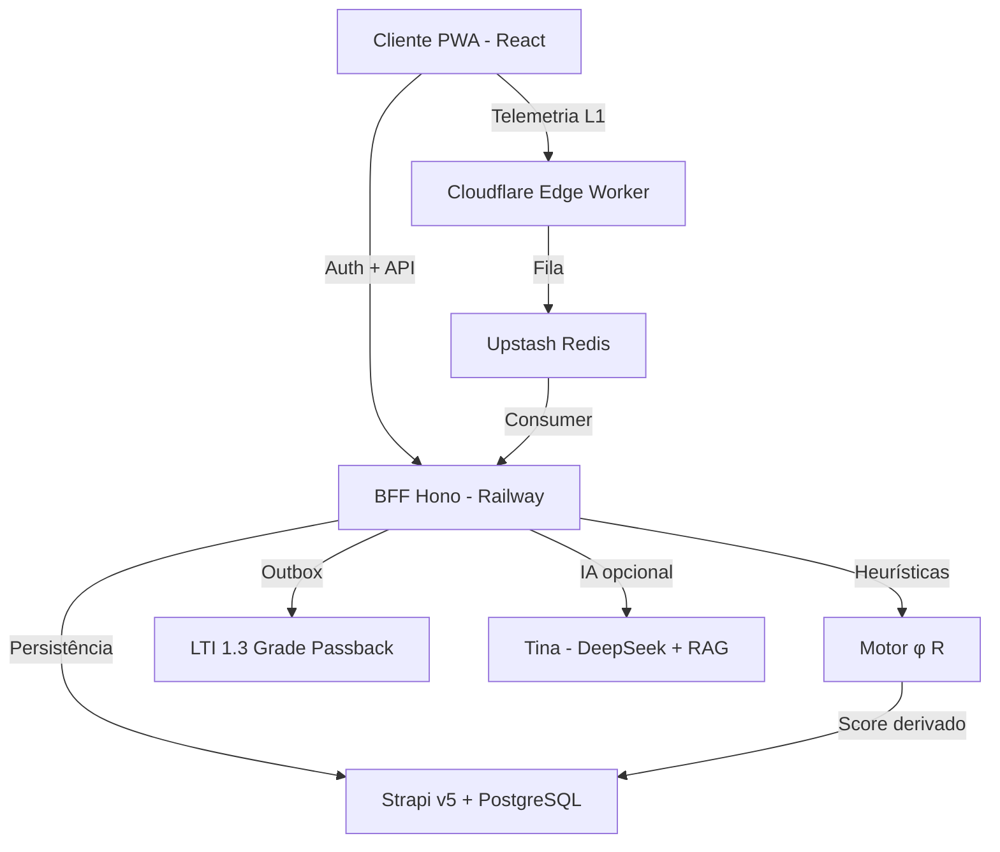
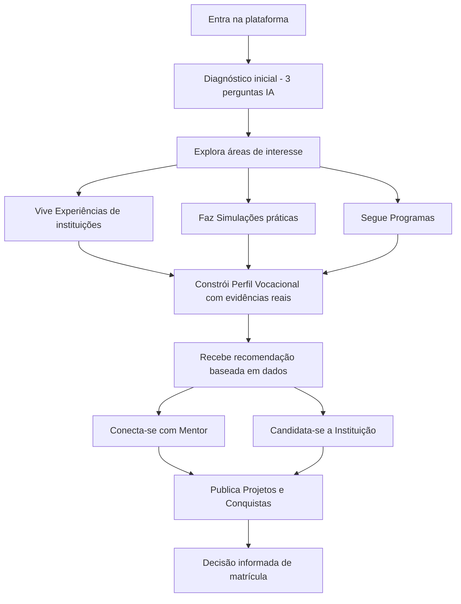
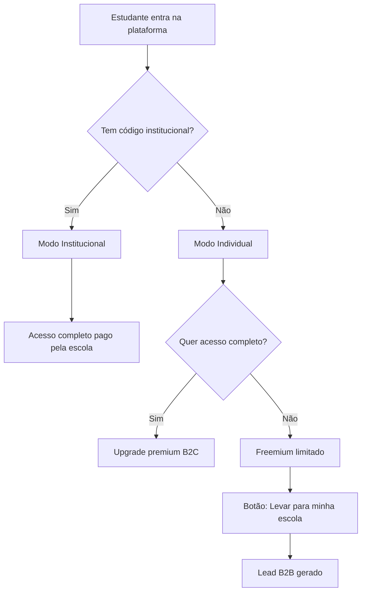

# 01 — Visão do Produto (Canónica)

# PDC v2 — Visão do Produto

<user_quoted_section>Frase de autoridade: O PDC não é uma plataforma de ensino. É uma infraestrutura de decisão educacional — transforma a incerteza vocacional em escolhas de carreira precisas, antes que as decisões erradas custem dinheiro.</user_quoted_section>

**Status:** Canónico · **Substitui:** versões dispersas em file:fv/docs/projeto/SISTEMA_MESTRE_FINAL.md, file:.planning/PROJECT.md e a spec original perdida (`d34f63b8-66cb-46b5-9c7c-bd0af0ad18c3`).

## 1. O Problema que o PDC Resolve

Em Angola e em mercados emergentes, a escolha de curso universitário é uma **aposta**, não uma decisão informada:

- Altos níveis** de evasão** universitário.
- Famílias perdem dinheiro em cursos abandonados.
- Instituições perdem receita e reputação.
- O país perde talentos que poderiam impulsionar o desenvolvimento.

<user_quoted_section>O PDC resolve isto dando ao estudante a experiência real do curso antes de se comprometer com a matrícula.</user_quoted_section>

## 2. O que o PDC É (e o que NÃO é)

| O PDC É | O PDC NÃO é |
| --- | --- |
| Uma infraestrutura de decisão vocacional | Um repositório passivo de conteúdo |
| Um sistema que mede **comportamento real** | Um teste de personalidade genérico |
| Uma plataforma de marketing institucional | Uma cópia do Canvas/Moodle |
| Um ecossistema onde todos ganham | Uma ferramenta só para estudantes |
| **Independente de IA** (continua a funcionar se a IA falhar) | Dependente de qualquer LLM |

## 3. Core Value (Promessa Mensurável)

**O estudante toma uma decisão de carreira baseada em evidência real do seu próprio comportamento — não em suposições.**

O sistema usa o **Motor de Heurísticas** (`packages/shared/src/heuristics.ts`) para calcular, a partir da telemetria bruta:

| Métrica | Símbolo | O que mede |
| --- | --- | --- |
| Fluidez Cognitiva | $\phi$ | Constância e ritmo de decisão |
| Resiliência ao Erro | $R$ | Recuperação após falha |
| Estabilidade de Foco | — | Micro-interrupções de atenção |
| Hesitação | — | Tempo + entropia de movimento antes de uma decisão |

<user_quoted_section>Princípio anti-fraude (D20–D22): A pontuação é derivada no servidor a partir da telemetria comportamental — nunca declarada pelo cliente. O browser é tratado como ambiente hostil.</user_quoted_section>

## 4. Stack Canónica (Soberana)

| Camada | Tecnologia | Papel |
| --- | --- | --- |
| Frontend | React 18 · Vite 5 · TailwindCSS v4 · Motion | UI Imersiva (PWA-First) |
| BFF | Hono v4 · Node.js 24 LTS · Jose v5 | Orquestração + RPC type-safe |
| Edge | Cloudflare Workers (`apps/edge`) | Telemetria L1 + sanity check |
| CMS | Strapi v5 · PostgreSQL 16 | Persistência e gestão de conteúdo |
| Cache/Rate-limit | Upstash Redis | Filas + idempotência + locks |
| Storage | Cloudflare R2 | Ativos, projetos, audit cold storage |
| IA (opcional) | DeepSeek + RAG (LangChain.js) | Tina — Oráculo Interpretativo |

**Decisões soberanas (rejeitadas alternativas populares):**

- ❌ Clerk → ✅ Auth próprio com JWT em **httpOnly cookies** (ADR-003)
- ❌ NestJS → ✅ Hono (zero-overhead, RPC type-safe end-to-end) (ADR-002)
- ❌ Turborepo → ✅ npm workspaces simples (ADR-001)

## 5. Arquitetura em 4 Camadas (L1–L4)

| Camada | Onde | Responsabilidade |
| --- | --- | --- |
| **L1 — Factos** | Cloudflare Edge | 90% do tráfego (telemetria, catálogos públicos, landing pulse) |
| **L2 — Cérebro Matemático** | `@pdc/shared` + BFF | Cálculo determinístico de $\phi$ e $R$ — **independente de IA** |
| **L3 — Verniz Inteligente** | BFF Hono | Tina (assistente + interpretação lateral) — fallback para heurísticas se falhar |
| **L4 — Core de Negócio** | BFF Hono + Strapi | Auth soberano, RBAC 6 roles, realtime Socket.IO |

## 6. Os Atores (Resumo)

| Ator | Papel resumido |
| --- | --- |
| **Estudante** | Utilizador principal — explora, simula, constrói perfil vocacional |
| **Mentor / Professor** | Publica cursos/simulações e programas, orienta, monetiza |
| **Instituição** | Marketing + recrutamento + redução de evasão |
| **Comité Científico** | Valida rigor académico de simulações e experiências |
| **Moderador** | Mantém ambiente seguro e produtivo |
| **Super Admin** | "DEUS" — gere toda a plataforma sem código |
| **Patrocinador** *(futuro)* | Financia talentos, trilhas e programas |

<user_quoted_section>Detalhe completo de capacidades e permissões: ver spec "03 — Tipos de Perfis".</user_quoted_section>

## 6.bis Para Quem Já Decidiu — Estudantes do Ensino Superior

<user_quoted_section>Pergunta legítima: "Como o PDC beneficia estudantes que já estão matriculados no ensino superior, mesmo que tenham escolhido errado?"
Resposta: se o PDC fosse apenas um "teste vocacional", morreria no momento da matrícula. Mas como é uma infraestrutura de decisão e performance, o valor para quem já decidiu é maior e mais urgente.</user_quoted_section>

O PDC deixa de ser **mapa de "para onde ir"** e passa a ser **GPS de performance** para garantir que o estudante chegue ao topo da montanha que escolheu.

| Necessidade do universitário | O que o PDC faz |
| --- | --- |
| **1. Validação de Rota e Redução de Danos** | Simulações Tipo 2/3 distinguem *"falta de base"* de *"falta de aptidão"*. O sistema diagnostica: *"Tens 90% de fluidez na parte prática de Engenharia, mas 20% na teórica. Não estás no curso errado — precisas de foco na base X."* É um **diagnóstico de sobrevivência académica**. |
| **2. CV do Futuro (Empregabilidade Real)** | O estudante constrói o **Perfil Vocacional** enquanto estuda. O relatório PDC anexa-se ao diploma: *"Sou licenciado E os meus dados provam que a minha resiliência sob pressão é 0.95."* — evidências objetivas que o diploma não dá. |
| **3. Especialização e Pivot Estratégico** | Em cursos genéricos (Gestão, Engenharia), o PDC funciona como **bússola de especialização** — mostra onde inclinar a carreira (Financeiro? RH? Operações?) **sem abandonar o curso**. |
| **4. Hub de Mentoria e Oportunidades** | Liga a **Mentores de Elite** via Vínculos. Aluno de 3.º ano de Direito encontra mentor para preparação de mercado, com simulações para feedback técnico de quem está no topo. |
| **5. Seguro Anti-Evasão (para a Instituição)** | A telemetria identifica alunos em **risco de desistência** (sinais de frustração, queda de engajamento) — a universidade intervém com apoio pedagógico **antes do abandono acontecer**. |

<user_quoted_section>Argumento canónico: "Não queremos que todos repensem as suas decisões. Queremos que todos otimizem a sua trajetória. Para quem já decidiu, o PDC é o GPS para chegar ao cume."</user_quoted_section>

Isto transforma o PDC numa ferramenta indispensável para **todo o ciclo de vida do talento** — não apenas para o candidato pré-matrícula.

## 7. Tipos de Conteúdo (Resumo)

| Tipo | Quem publica | Monetizável | Função primária |
| --- | --- | --- | --- |
| **Experiência** | Instituição, Mentor | ❌ Sempre gratuita | Marketing institucional + imersão |
| **Simulação** | Mentor, Instituição | ✅ Opcional | Avaliação comportamental real |
| **Curso** | Mentor, Instituição | ✅ Opcional | Aprendizagem estruturada com certificado |
| **Programa** | Instituição | ✅ Opcional | Iniciativa ampla (contém Cursos + Experiências) |
| **Projeto** | Estudante | ❌ | Visibilidade + feedback + ponte para patrocinador |
| **Post / Conquista** | Todos os autenticados | ❌ | Feed social + reputação |

<user_quoted_section>Detalhe completo (regras de visibilidade, criação, inscrição, avaliação): ver spec "04 — Tipos de Conteúdo".</user_quoted_section>

## 8. Jornada do Estudante (a Espinha Dorsal)

## 9. Modelo de Negócio

### 9.1 Motor Principal — B2B Institucional

Escolas e universidades pagam para oferecer o PDC aos seus alunos.

- **Modelo:** pacote por aluno/ano (ex.: $5–$15/aluno/ano).
- **Argumento de venda:** *"Se o PDC retiver apenas 2–5 alunos que desistiriam, o investimento já se paga."*

### 9.2 Complementares

1. **B2C Freemium** — estudantes individuais com acesso limitado; upgrade pago.
2. **Marketplace** — comissão sobre mentorias e cursos pagos.
3. **Patrocínio** — empresas financiam talentos e trilhas.

### 9.3 Dois Modos de Entrada

## 10. Identidade Visual — "Soul & Elite"

<user_quoted_section>Princípio: Herança Invisível (ADR-006). Sofisticação global com raízes culturais subliminares.</user_quoted_section>

| Elemento | Decisão |
| --- | --- |
| **Tema base** | Claro `#F8F9FA` — Escuro como opção (sem pretos puros para evitar smear OLED) |
| **Acento** | Terracota Africana `#D2691E` — limite ≤ 5% da UI |
| **Institucional** | Azul `#004AAD` |
| **Tipografia** | Inter (UI) · Instrument Serif (autoridade) · JetBrains Mono (dados) |
| **Layouts** | Bento Grids (dashboards) · Glassmorphism (IA) · HUD (simulações) |
| **Padrões africanos** | Subliminares — assimetria de bordas inspirada em Kente/Adinkra (≤ 3% da UI) |
| **Toque mobile** | Mínimo 44px (PWA-First) |
| **Linguagem** | "8th-grade rule" — se um aluno do 8.º ano não entender, o design falhou |

## 11. Constituição Inegociável (5 Regras de Ouro)

1. **SSOT** — Contratos, schemas e tipos nascem em `@pdc/shared`. Aplicações não definem formas privadas que cruzam fronteiras de rede.
2. **Zero ****`any`** — Tipagem estrita. `any` em código novo é um bug de governação.
3. **Rule of 300** — Nenhum ficheiro fonte > 300 linhas. (Exceção histórica: `packages/shared/src/index.ts`.)
4. **Doc is Law** — Se o código contradiz o markdown, o código é defeituoso. O documento justifica o código, nunca o inverso.
5. **Telemetria Resiliente Edge-First** — A perda de dados comportamentais é inaceitável. Outbox + idempotência são obrigatórios.

## 12. Visão de Longo Prazo

O PDC será o lugar de referência para preparar e decidir percursos académicos em todas as fases:

- **Pais de crianças pequenas** — escolha de escolas do ensino básico
- **Estudantes do ensino médio** — escolha de curso superior
- **Estudantes universitários** — mudança de curso ou área
- **Profissionais** — requalificação
- **Instituições** — atrair os alunos certos e reduzir evasão
- **Patrocinadores** — identificar e apoiar talentos validados

### O Moat (Barreira Competitiva)

<user_quoted_section>Quanto mais o PDC é usado, mais preciso e valioso ele se torna. Os dados comportamentais acumulados são um ativo único e crescente que nenhum concorrente pode replicar rapidamente.</user_quoted_section>

## 13. Out of Scope (MVP)

- Gateway de pagamento em produção (fase comercial posterior).
- Turborepo / Nx (over-engineering para o estágio atual).
- Upload de vídeos > 50MB (usar embed YouTube/Vimeo).
- Antifraude biométrico avançado.

*Última validação: 29 de Abril de 2026 · Fonte de verdade: este documento.*
*Revisão T-DOC-01 (audit-report-master 2026-04-29): nenhum Drift Constitucional confirmado para esta camada — no-op.*