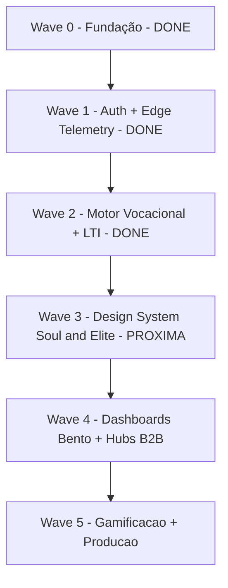

# 02 — Mapeamento de Funcionalidades (Canónico)

> **Fonte canónica de slugs e labels:** `packages/shared/src/glossary.ts` — editar lá, não aqui.

# PDC v2 — Mapa Canónico de Funcionalidades

<user_quoted_section>Status: Canónico · Substitui: registos dispersos em , ,  e na spec original ae07e114-7c3a-4ed1-8c59-55eec60b752f (Features Transversais).</user_quoted_section>

Cada funcionalidade tem **ID estável**, **estado canónico** (lei) e **estado real** (verdade do código no momento da última validação S3). Quando há divergência: o código é ajustado para bater com a doc, ou regista-se um *escape hatch*.

| Símbolo | Significado |
| --- | --- |
| ✅ | Implementado e em produção |
| 🟡 | Parcial — funciona mas tem lacunas conhecidas |
| ⏳ | Por implementar |
| ⏸ | Estacionado (depende de outra Wave) |
| ❓ | A confirmar em auditoria |

## 1. Núcleo de Decisão Vocacional (a alma do produto)

| ID | Funcionalidade | Estado | Wave | Notas |
| --- | --- | --- | --- | --- |
| **N1** | Motor de Heurísticas $\phi$ (Fluidez) e $R$ (Resiliência) | ✅ | W2 | `packages/shared/src/heuristics.ts` — determinístico, server-side |
| **N2** | Telemetria Edge-First (L1) | ✅ | W1 | `apps/edge` + Upstash queue + BFF consumer |
| **N3** | Idempotência de eventos (UUID + outbox) | ✅ | W4 | `REQ-4-004` |
| **N4** | Sanity Validator dual-layer (edge + BFF) | ✅ | W2 | Anti-cheat — `REQ-4-016` |
| **N5** | Score real derivado no BFF (sem hardcode) | ✅ | W2 | Substitui o legacy 8.5 — `REQ-4-002` |
| **N6** | Perfil Vocacional automático | ✅ | W4 | 6 dimensões + 4 tiers — `REQ-4-005`, `REQ-4-017` |
| **N7** | Reputação canónica `/reputacao/me` | ✅ | W2 | Cache Redis + recálculo batch |
| **N8** | Conquistas via Event Bus (12 regras) | ✅ | W4 | `REQ-4-018` |
| **N9** | Relatório Vocacional Premium | 🟡 | W2 | MVP entregue; threaded insights da Tina pendentes (`W4-T5`) |

## 2. Conteúdo (Domínios)

| ID | Funcionalidade | Estado | Notas |
| --- | --- | --- | --- |
| **C1** | Cursos — CRUD + módulos + itens | ✅ | Estrutura: Curso → Módulos → Itens → Submissões → Notas |
| **C2** | Simulações Tipo 1 (vídeo guiado + checklist) | ✅ | Player funcional |
| **C3** | Simulações Tipo 2 (laboratório iframe + tracking) | ✅ | Score derivado real |
| **C4** | Simulações Tipo 3 (interativo + feedback realtime) | ✅ | `Tipo3Player.tsx` |
| **C5** | Experiências (instituições, sempre gratuitas) | ✅ | Marketing institucional |
| **C6** | Programas (contêineres de Cursos + Experiências) | 🟡 | UI de gestão em progresso — `REQ-4-009` |
| **C7** | Projetos (estudantes publicam) | ✅ | Votação + feedback + Kudos |
| **C8** | Posts e Conquistas (feed social) | ✅ | Sistema completo de moderação |
| **C9** | Quizzes e Tarefas dentro de Cursos | ✅ | Submissões + notas automáticas |
| **C10** | Certificados de conclusão | ✅ | Página `/estudante/certificados` |
|  |  |  |  |

## 3. Features Transversais (operam sobre todos os Targets)

<user_quoted_section>Princípios: Tudo é sinal · Separação de contexto · Moderação por defeito</user_quoted_section>

<user_quoted_section>Modelo polimórfico: todas as interações usam (targetType, targetId) onde targetType ∈ { curso, experiencia, simulacao, programa, projeto, post, conquista, mentor, instituicao }.</user_quoted_section>

| ID | Funcionalidade | Estado | Detalhe |
| --- | --- | --- | --- |
| **T1** | **Like / Curtir** (toggle, 1 por user/entidade) | ✅ | `interaction.like` event |
| **T2** | **Bookmark / Guardar** (privado, toggle, sem limite) | ✅ | Página dedicada `/guardados` |
| **T3** | **Comentar** (3–1000 chars, 1 nível de reply, moderação <7 dias) | ✅ | Rate: 10/min |
| **T4** | **Avaliar (Rating)** 1–5 estrelas + comentário opcional | 🟡 | Pesistência migrada para PostgreSQL na reconstrução |
| **T5** | **Partilhar (Share)** interno/externo/link | ⏳ | Por integrar |
| **T6** | **Denunciar (Report)** + auto-hide threshold | ✅ | Fila para moderador |
| **T7** | **Telemetria** (views, scroll, vídeo, decisões, sociais) | ✅ | Coração do Oráculo |
| **T8** | **Vínculo (Conexão formal bilateral)** | 🟡 | Schema base ✅; serialização pública por role pendente |
| **T9** | **Notificações** sociais/vínculo/conteúdo (com agrupamento) | ✅ | Push + Socket.IO |
| **T10** | **Endorsements / Kudos** | ✅ | `REQ-4-014` |
| **T11** | **Project Votes** (upvote / endorsement / fork) | ✅ | Pesos contribuem para feed |
| **T12** | **Discussions / Threads** | ✅ | `REQ-5-007` |

## 4. Plataforma & Identidade

| ID | Funcionalidade | Estado | Notas |
| --- | --- | --- | --- |
| **P1** | Auth JWT em httpOnly cookie + RBAC 6 roles | 🟡 | Rotação de tokens pendente — `REQ-1-002` |
| **P2** | OAuth social login + OTP por SMS (Twilio) | 🟡 | OAuth ✅; Twilio mockado — `REQ-1-010`, `REQ-1-014` |
| **P3** | 2FA obrigatório no login (sem bypass) | ✅ | Hardening completo |
| **P4** | FeatureRegistry SSOT (5 statuses + 7 features + 6 HUBs) | ✅ | `REQ-1-012` |
| **P5** | `GET /bootstrap` em 4 camadas (session/capabilities/security/UX) | ✅ | `REQ-1-013` |
| **P6** | Rate limiting via Upstash | ✅ | Middleware integrado; OTP/tokens usam Redis persistente do BFF (ADR-053) |
| **P7** | LTI 1.3 Grade Passback | ✅ | Outbox pattern com retry exponencial |
| **P8** | Realtime Socket.IO (notificações + mensagens) | 🟡 | Notificações ✅; mensagens UI pendente |
| **P9** | Tina — Assistente IA (chat + interpretação lateral) | 🟡 | Streaming instável — `REQ-7-001` |
| **P10** | RAG sobre conteúdos da plataforma | ⏳ | "Ask the Lesson" |

## 5. Comunidade & Engagement

| ID | Funcionalidade | Estado | Notas |
| --- | --- | --- | --- |
| **F1** | **Streaks** — Caminho da Vocação (N dias consecutivos) | ⏳ | `REQ-5-005` |
| **F2** | **Tribos / Círculos de Interesse** (chats por programa) | ⏳ | `REQ-4-010` |
| **F3** | **Perfil Público Showcase** (LinkedIn vocacional partilhável) | ⏳ | `REQ-5-006` |
| **F4** | **Stories** — formato vídeo curto vertical para instituições | ⏳ | `REQ-4-011` |
| **F5** | **Pílulas de Conhecimento** — micro-simulações diárias ~1min | ⏳ | `REQ-4-012` |
| **F6** | Push FOMO / Notificações inteligentes | ✅ | Baseadas em telemetria |
| **F7** | Endorsements / Kudos públicos | ✅ | (= T10) |
| **F8** | **Top Bar com Command+K** (search global tipo Linear/Raycast) | 🟡 | Skeleton W1.2 Done-Plus (7 rotas estáticas, listener ⌘K D14 correcto, i18n); search dinâmico role-aware = W6.4 **Missing** — `REQ-NF-009` |
| **F9** | **Sidebar slim** (apenas ícones, retrátil) | ⏳ | `REQ-NF-010` |
| **F10** | **15 áreas vocacionais globais** (substitui 4 áreas) | ✅ | Mudança estrutural crítica para precisão de match |
| **F11** | **Rate limit Micro-Desafio Vocacional** (3 tentativas grátis) | ⏳ | `REQ-NF-011` |

## 6. Feed e Algoritmo

| ID | Funcionalidade | Estado | Notas |
| --- | --- | --- | --- |
| **A1** | Feed soberano (algoritmo de ranking) | ✅ | Cache Redis · pesos configuráveis pelo super_admin |
| **A2** | 4 fontes de feed (Geral / Vocacional / Institucional / Trending) | ⏸ | `W4-T2` depende de Wave 3 |
| **A3** | Comments com moderação inline | ⏸ | (parte de A2) |
| **A4** | Pesos de interação tunáveis via admin | ✅ | `REQ-3-003` |
| **A5** | Algoritmo de viralização e descoberta | ⏳ | Nota original em file:fv/Notes/FUNCIONALIDADES.txt |

## 7. Instituições (B2B)

| ID | Funcionalidade | Estado | Notas |
| --- | --- | --- | --- |
| **B1** | Feature Flags institucionais (overrides por instituição) | ✅ | `REQ-3-001` |
| **B2** | Branding white-label (logo, cores, copy) | 🟡 | Interface ✅; backend pendente |
| **B3** | Upload de documentos (Alvará, NIF, Estatuto) | 🟡 | Validação client-side ✅; persistência pendente |
| **B4** | Workflow de aprovação de instituição | ⏳ | Sem campo `status` formal no schema |
| **B5** | Dashboard de "Saúde do Aluno" (sinais de risco de evasão) | ⏳ | B2B core |
| **B6** | Exportação CSV de estudantes vinculados | ✅ | Com filtros temporais 30/60/90d |
| **B7** | Métricas por curso (matrículas, dropoff, aderência) | ✅ | Avaliação automática Alto/Médio/Baixo risco |
| **B8** | Propostas diretas a estudantes (Match Terminal) | ⏳ | `W4-T4` |
| **B9** | Calendário de eventos institucionais | ✅ |  |

## 8. Moderação & Segurança

| ID | Funcionalidade | Estado | Notas |
| --- | --- | --- | --- |
| **M1** | Fila de denúncias (pendente / em_analise / resolvida) | ✅ |  |
| **M2** | Ações: remover / avisar / ignorar (com nota interna) | ✅ |  |
| **M3** | Audit trail de moderação | ✅ | quem · o quê · quando · IP |
| **M4** | Suspender / banir conta | ✅ |  |
| **M5** | Validação científica (Comité) — `draft → review → approved` | ✅ |  |
| **M6** | Auto-hide por threshold de denúncias | ✅ |  |
| **M7** | Rate limits globais (anti-spam) | ✅ | Comments 10/min, etc. |

## 9. Não-Funcionais

| ID | Funcionalidade | Estado | Notas |
| --- | --- | --- | --- |
| **NF1** | Zero `any` em TypeScript | ✅ | Confirmado: zero `as any` / `: any` em todo o monorepo (grep 2026-04-29). `EditorialStateBadge` usa `state: string` (type looseness, não `any`). |
| **NF2** | Acessibilidade total (PWA, contraste AA, 44px touch) | ✅ | `REQ-NF-005` |
| **NF3** | Rule of 300 linhas por ficheiro | 🟡 | Expansão oficial para 300; alguns legacy pendentes |
| **NF4** | Performance (Sentry, cache, ratelimit, timeout via env) | ✅ | `REQ-NF-014` |
| **NF5** | i18n PT base + EN como segunda língua | ⏳ | `W3-T3` + `W5-T3` |
| **NF6** | Workers-Clean (BFF sem APIs Node-exclusivas) | ✅ | Para futura portabilidade total |
| **NF7** | Lighthouse ≥ 90 mobile | ❓ | `lighthouserc*` ausente — Cannot-Verify; `W5-T4` / `W6.5` |

## 10. Roadmap Resumido (Wave-View)

| Wave | Estado | Foco | Bloqueios |
| --- | --- | --- | --- |
| W-1 — Stabilization | ✅ (4/5 Done) | Outbox idempotência, hookResults, notifyHook, BootstrapContext | Characterization tests redirect (Partial) |
| W0 — Bootstrap & Foundation | 🟡 | Features SSOT, BootstrapContext retry, EstudanteDashboard fallback | BootstrapErrorScreen STUB; AspirationalEmpty parcial |
| W1 — TopBar + ⌘K skeleton | ✅ (W1.1 Done · W1.2 Done-Plus) | RoleChipMenu, NotificationsDropdown, CommandPalette skeleton | Focus trap ausente; rotas não role-aware |
| W2 — Dashboards + token purge | 🟡 | Soul & Elite dashboards 5 roles, token purge | ContentTypeCTAGrid STUB; snapshots Playwright ausentes |
| W3 — Strapi + BFF Full-Spec | ✅ (6/7 Done) | Schemas Zod, BFF RBAC, field-level filtering | PostComposer BFF Partial |
| W4 — Builder Primitives + Builders | ✅ (6/8 Done) | BuilderShell, 5 builders completos | PostComposer + ConquistaComposer STUB; EditorialStateBadge não nos builders |
| W5 — Pipeline Editorial + Impact | 🟡 | EcosystemImpactPanel, domain-events route, EditorialStateBadge catálogos | EcosystemImpactPanel sem polling; RBAC bloqueia criadores |
| W6 — Catálogos + a11y | 🟡 | 8 catálogos migrados, a11y spec, primitivos | ⌘K real Missing; primitivos STUB; lighthouserc ausente |

## 11. Dívida Técnica Registada

| ID | Item | Origem |
| --- | --- | --- |
| D1 | `apps/api/src/modules/analysis/heuristics.engine.ts` paralelo a `@pdc/shared/heuristics` — consolidar em W3 | `R3-1` |
| D2 | `apps/web/src/features/feed/FeedPage.tsx` contém 4 `any` — limpar em `W4-T2` | `R3-1` |
| D3 | Métrica `domain_events_failed_total` em logs; exporter Prometheus/Sentry pendente | `R3-1` |
| D4 | Naming mismatch de conquistas (12 regras nunca disparam) | `T-FIX-3` |
| D5 | Outbox Replay scheduler co-located com BFF main (risco de saturação) | Análise técnica |
| D6 | "Midnight Rollover Bug" potencial na chave Redis de telemetria | Análise técnica |
| D7 | Race condition entre Edge URL e BFF fallback | Análise técnica |
| D8 | `ContentTypeCTAGrid` STUB — 4 dashboards sem UI premium (GlassCard) | Audit W2.2 |
| D9 | `PostComposer` + `ConquistaManualComposer` STUB — flows de criação bloqueados | Audit W4.8 |
| D10 | `EcosystemImpactPanel` ignora `eventId` — sem polling; impacto sempre `"..."` | Audit W5.2 |
| D11 | `CommandPalette` ⌘K sem search dinâmico nem role-awareness | Audit W6.4 |
| D12 | `lighthouserc*` ausente — NF7 Lighthouse ≥90 mobile não verificável em CI | Audit W6.5 |

*Última validação: 29 de Abril de 2026 · Para detalhe granular ver *file:.planning/REQUIREMENTS.md* (formato REQ-W-NNN).*
*Revisão T-DOC-02 (audit-report-master 2026-04-29): DC-02 aplicado (F8 🟡, Wave-View actualizado, D8-D12 adicionados, NF1/NF7 corrigidos).*
