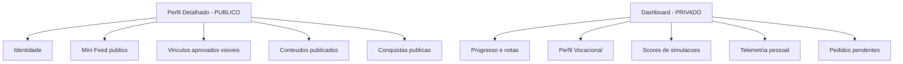
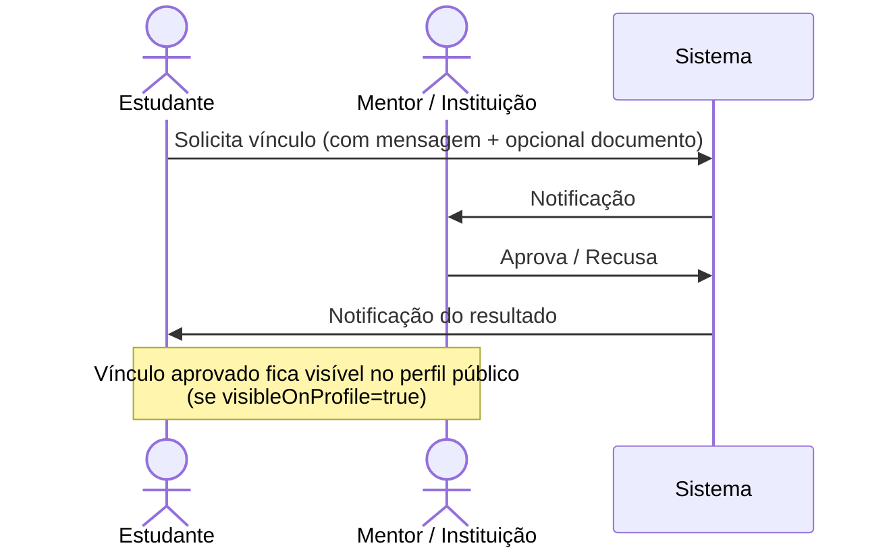

# 03 — Tipos de Perfis (Roles, Permissões e Privacidade)

# PDC v2 — Tipos de Perfis (Canónico)

<user_quoted_section>Status: Canónico · Substitui: as definições dispersas em ,  Perfis V2 com Privacidade.md,  de Moderação Strapi.md e a matriz parcial em .</user_quoted_section>

<user_quoted_section>Princípio fundador: Separação rígida entre Identidade Pública (perfil) e Progresso Privado (dashboard). Enforcement no backend é fonte de verdade; frontend é camada de UX.</user_quoted_section>

## 1. Os 7 Tipos de Perfil (Oficiais)

| Slug (DB) | Nome UI | Categoria | Visível publicamente | Pode ser criado via signup |
| --- | --- | --- | --- | --- |
| `estudante` | Estudante | Aluno | ✅ | ✅ |
| `mentor` | Mentor / Professor | Profissional | ✅ | ✅ (com docs) |
| `instituicao` | Instituição | Organização | ✅ | ✅ (com docs) |
| `comite_cientifico` | Comité Científico | Validador interno | 🟡 (mínimo: nome + função) | ❌ (criado por super_admin) |
| `moderador` | Moderador | Operador interno | 🟡 (mínimo: nome + função) | ❌ (promovido por super_admin) |
| `super_admin` | Super Admin | Operador interno | ❌ (perfil interno) | ❌ (criado via seed) |
| `patrocinador` 🔮 | Patrocinador | Empresa | ✅ (futuro) | ❌ (futuro — fase comercial) |

<user_quoted_section>Nota de compatibilidade legacy: tipo === 'admin' é normalizado para super_admin em normalizeTipo. Não criar novos registos com 'admin'.</user_quoted_section>

## 2. Matriz Mestre de Permissões (RBAC)

<user_quoted_section>Fonte canónica em código: src/config/roles.js · enforcement em App.jsx (ProtectedRoute) e em policies Strapi.</user_quoted_section>

| Permissão | Estudante | Mentor | Instituição | Comité | Moderador | Super Admin |
| --- | --- | --- | --- | --- | --- | --- |
| ver_catálogos_públicos | ✅ | ✅ | ✅ | ✅ | ✅ | ✅ |
| inscrever_em_curso | ✅ | ✅ | ✅ | ❌ | ❌ | ✅ |
| executar_simulação | ✅ | ✅ | ❌ | ✅ | ❌ | ✅ |
| publicar_curso | ❌ | ✅ | ✅ | ❌ | ❌ | ✅ |
| publicar_simulação | ❌ | ✅ | ✅ | ❌ | ❌ | ✅ |
| publicar_experiência | ❌ | ✅ | ✅ | ❌ | ❌ | ✅ |
| publicar_programa | ❌ | ✅ | ✅ | ❌ | ❌ | ✅ |
| publicar_projeto | ✅ | ✅ | ✅ | ❌ | ❌ | ✅ |
| publicar_post / conquista | ✅ | ✅ | ✅ | ❌ | ❌ | ✅ |
| comentar / curtir / guardar | ✅ | ✅ | ✅ | ✅ | ✅ | ✅ |
| denunciar conteúdo | ✅ | ✅ | ✅ | ✅ | ✅ | ✅ |
| solicitar_vínculo | ✅ | ✅ | ❌ | ❌ | ❌ | ✅ |
| aprovar_vínculo (recebido) | ✅ | ✅ | ✅ | ❌ | ❌ | ✅ |
| validar_conteúdo_académico | ❌ | ❌ | ❌ | ✅ | ❌ | ✅ |
| ver_denúncias | ❌ | ❌ | ❌ | ❌ | ✅ | ✅ |
| gerir_utilizadores | ❌ | ❌ | 🟡 (próprios) | ❌ | ✅ | ✅ |
| banir_conta | ❌ | ❌ | ❌ | ❌ | ✅ | ✅ |
| aprovar_instituições | ❌ | ❌ | ❌ | ❌ | ❌ | ✅ |
| aprovar_mentores | ❌ | ❌ | ❌ | ❌ | ❌ | ✅ |
| alterar_sistema | ❌ | ❌ | ❌ | ❌ | ❌ | ✅ |
| acesso_audit_trail | ❌ | ❌ | ❌ | ❌ | 🟡 (read-only) | ✅ |
| configurar_branding (white-label) | ❌ | ❌ | ✅ (própria) | ❌ | ❌ | ✅ |
| configurar_feature_flags | ❌ | ❌ | 🟡 (overrides) | ❌ | ❌ | ✅ |
| ver_telemetria_global | ❌ | ❌ | 🟡 (própria) | ❌ | ❌ | ✅ |
| exportar_CSV | ✅ (próprios) | ✅ (alunos) | ✅ | ❌ | ❌ | ✅ |

## 3. Perfil Público vs Dashboard Privado

<user_quoted_section>Lei suprema: o perfil público nunca mostra métricas privadas (Perfil Vocacional, scores, progresso, notas). Mesmo se o frontend falhar, o backend filtra os campos por viewer + role.</user_quoted_section>



### Estado por campo

Cada campo tem 3 estados independentes:

1. **Obrigatório / Opcional** (validação de schema)
2. **Público / Privado** (visibilidade ao mundo)
3. **Editável pelo próprio / Apenas admin** (autorização de mutação)

## 4. Capacidades por Perfil (detalhe)

### 4.1 Estudante 🎓

**Identidade:** nome, foto, bio, área de interesse, nível de ensino, região, headline, capa, website, social links.

**Capacidades:**

- Explorar Experiências, Simulações, Cursos, Programas
- Inscrever-se em Cursos · Executar Simulações
- Publicar Projetos · Publicar Posts/Conquistas
- Solicitar Mentoria · Solicitar Vínculo a Instituição
- Construir Perfil Vocacional automático (telemetria)
- Aceder a relatórios pessoais
- Receber propostas diretas de Instituições

**Privacidade:** contacto privado por defeito; mini feed e vínculos com toggle de visibilidade.

### 4.2 Mentor / Professor 👨‍🏫

**Identidade adicional:** `areaEspecialidade`, `areaFormacao`, `especializacao`, `instituicao` (vinculada), anos de experiência, disponibilidade (n.º máximo de mentorias simultâneas).

**Capacidades:**

- Publicar Cursos e Simulações (monetizáveis)
- Aceitar / Recusar / Concluir mentorias
- Aceder a analytics dos mentorados
- Avaliar Projetos formalmente (contribui para Rating do projeto)
- Receber propostas de colaboração de Instituições

**Boas práticas (regra do guia):** responder a pedidos pendentes em 48h.

### 4.3 Instituição 🏛️

**Identidade adicional:** nome oficial, `tipoInstituicao`, `natureza` (Pública / Privada), `modalidadeCusto` (Gratuita / Paga / Mista), `niveisEnsino` (Primário, Base, Médio, Superior), região, documentos (Alvará, NIF, Estatuto, Localização, Representante), website, branding (logo + cores).

**Capacidades:**

- Publicar Experiências (sempre gratuitas — marketing institucional)
- Publicar Cursos, Programas e Eventos (monetizáveis)
- Gerir Mentores e Estudantes vinculados
- Fazer propostas diretas a estudantes (Match Terminal)
- Aceder a relatórios B2B (evasão, dropoff, aderência por curso, exportar CSV)
- Configurar branding white-label e feature flag overrides
- Ver telemetria da própria instituição

**Lacunas conhecidas:** workflow formal de aprovação de instituição (sem campo `status` no schema atual).

### 4.4 Comité Científico 🔬

**Acesso:** zona dedicada `/comite-cientifico`. Perfil público mínimo (nome + função "Comité Científico").

**Capacidades:**

- Validar Simulações antes de publicação (rigor académico)
- Validar Experiências (autenticidade dos depoimentos)
- Avaliar Projetos formalmente
- Aprovar (`approved`) ou rejeitar (`draft`) com motivo

**Fluxo:** Mentor/Instituição submete (`review`) → Comité analisa → Aprova ou rejeita → Autor notificado.

### 4.5 Moderador 🛡️

**Acesso:** zona `/moderador`. Perfil público mínimo.

**Capacidades:**

- Resolver fila de denúncias (`pendente → em_analise → resolvida`)
- Ações disponíveis: `remover`, `avisar`, `ignorar` (sempre com nota interna)
- Suspender contas (com auditoria)
- Aprovar/rejeitar Posts, Conquistas, Vínculos
- Acesso read-only ao audit trail

**Restrições éticas:**

- Nunca tomar ações sobre conteúdo próprio
- Resolver por antiguidade (FIFO)
- Notas em linguagem factual, não emocional

### 4.6 Super Admin 👑

**Princípio:** *"DEUS" da plataforma — vê e controla tudo, zero código necessário.*

**Acesso:** zona `/admin`. **Não tem perfil público.**

**Capacidades exclusivas:**

- Aprovar Instituições e Mentores
- Promover utilizadores a moderador / comité científico
- Configurar landing (logo, textos, filtros, parceiros) sem código
- Editar matriz de permissões e feature registry
- Acesso total a telemetria, audit trail, financeiro
- Exportação global de dados
- Banir / reativar qualquer conta

### 4.7 Patrocinador 🔮 (futuro)

**Capacidades planeadas:** financiar trilhas/talentos, aceder a perfis vocacionais validados (com consentimento), publicar Talent Bounties, acompanhar projetos financiados.

## 5. Sistema de Vínculos (Conexão Bilateral)

<user_quoted_section>Funciona como o "Conectar" do LinkedIn — estabelece relação formal e bilateral.</user_quoted_section>



| Tipo de Vínculo | Direção | Estados |
| --- | --- | --- |
| Estudante ↔ Mentor (mentorado) | Aluno solicita; Mentor aprova | `pendente` · `aprovado` · `recusado` · `concluido` |
| Estudante ↔ Instituição (aluno/candidato) | Aluno solicita; Instituição aprova | `pendente` · `aprovado` · `reprovado` |
| Mentor ↔ Instituição (colaboração) | Qualquer um inicia | `pendente` · `aprovado` · `reprovado` |

**Regras de visibilidade pública:** apenas `status = aprovado` E `visibleOnProfile = true` aparecem no perfil público.

## 6. Sistema de Privacidade por Defeito

| Campo | Defeito | Quem pode ver |
| --- | --- | --- |
| Email | 🔒 Privado | Próprio + super_admin |
| Telefone | 🔒 Privado | Próprio + super_admin |
| Perfil Vocacional ($\phi$, $R$, scores) | 🔒 Privado | Próprio (no dashboard) |
| Histórico de simulações | 🔒 Privado | Próprio + Mentor vinculado + Instituição vinculada |
| Mensagens | 🔒 Privado | Participantes + super_admin (auditoria) |
| Bookmarks | 🔒 Privado | Próprio + super_admin (auditoria) |
| Posts e Conquistas aprovadas | 🌐 Público | Todos |
| Projetos publicados | 🌐 Público | Todos |
| Cursos publicados (Mentor/Instituição) | 🌐 Público | Todos |
| Vínculos `aprovado + visibleOnProfile` | 🌐 Público | Todos |
| Branding institucional | 🌐 Público | Todos |

<user_quoted_section>Endpoint público de perfil: o backend faz field-level filtering por viewer + role antes de devolver. Mesmo que o frontend tente desenhar um campo privado, o servidor não o entrega.</user_quoted_section>

## 7. Onboarding e Registo

```mermaid
flowchart TD
    A[/criar-conta] --> B{Tipo de conta?}
    B -->|Estudante| C[/criar-conta/estudante - formulário simples]
    B -->|Mentor| D[/criar-conta/mentor - formulário + upload de docs]
    B -->|Instituição| E[/criar-conta/instituicao - formulário + Alvará NIF Estatuto]
    C --> F[Verificação OTP]
    D --> F
    E --> F
    F --> G[2FA opcional]
    G --> H[Dashboard role-aware]
```

<user_quoted_section>Comité Científico, Moderador e Super Admin não passam por signup público — são criados via Strapi Admin (Content Manager) ou seed.</user_quoted_section>

## 8. Redirecionamento Pós-Login (canónico)

| Role | Redirect |
| --- | --- |
| `estudante` | `/estudante` |
| `mentor` | `/mentor` |
| `instituicao` | `/instituicao` |
| `comite_cientifico` | `/comite-cientifico` |
| `moderador` | `/moderador` |
| `super_admin` | `/admin` |

## 9. Auditoria

Todas as ações sensíveis (moderação, suspensão, alteração de role, acesso a dados de terceiros) são registadas com:

- ID do ator
- Ação executada
- Timestamp UTC
- IP de origem

<user_quoted_section>Visível apenas a: super_admin (full) e moderador (read-only sobre as próprias ações).</user_quoted_section>

*Última validação: 20 de Abril de 2026.*