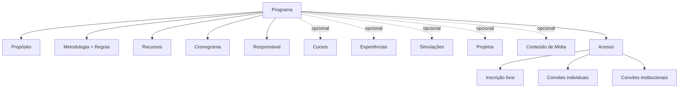
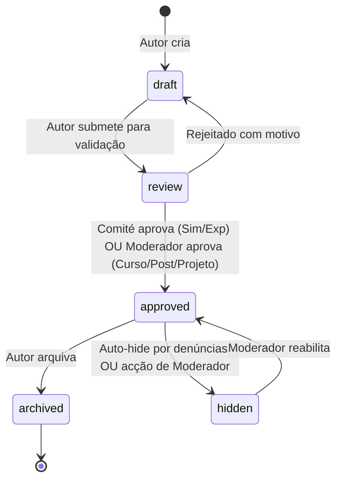
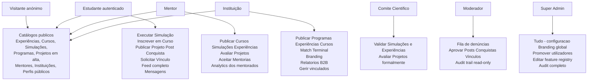

# 04 — Tipos de Conteúdo (Regras de Visibilidade, Criação, Inscrição e Moderação)

# PDC v2 — Tipos de Conteúdo (Canónico)

<user_quoted_section>Status: Canónico · Substitui: definições espalhadas em , guias de utilizador e nas specs originais d34f63b8… (Visão) e ae07e114… (Features Transversais).</user_quoted_section>

<user_quoted_section>Pergunta governadora: Para cada conteúdo — quem pode VER, quem pode INSCREVER-SE / SUBSCREVER, quem pode POSTAR / CRIAR, quem pode MODERAR, quem pode AVALIAR?</user_quoted_section>

## 1. Os 6 Tipos de Conteúdo Oficiais

| Tipo | Slug | Categoria | Marketing? | Monetizável? |
| --- | --- | --- | --- | --- |
| **Curso** | `curso` | Formativo (O Saber) | — | ✅ Opcional (criador decide) |
| **Experiência** | `experiencia` | Imersivo (O Sentir) | ✅ Marketing institucional | ❌ Sempre gratuita |
| **Simulação** | `simulacao` | Avaliativo (O Fazer) | — | ✅ Opcional (criador decide) |
| **Programa** | `programa` | Contêiner / Iniciativa Institucional ou do mentor | ✅ Marketing + agenda | ✅ Opcional (criador decide) |
| **Projeto** | `projeto` | Showcase autoral / Marketplace de Talentos | ✅ Reputação + matchmaking | ❌ Sempre gratuito |
| **Post / Conquista** | `post` / `conquista` | Social / Reputação | — | ❌ |

<user_quoted_section>Mantra para a equipa de devs e UX:"O Programa é a infraestrutura de oportunidades; o Curso é o saber; a Experiência é o sentir; a Simulação é o fazer; o Projeto é o ativo de carreira do utilizador; o Post/Conquista é a voz social."</user_quoted_section>

<user_quoted_section>Nota: os targetType polimórficos das features transversais incluem ainda mentor e instituicao — esses são perfis (ver spec 03), não conteúdos.</user_quoted_section>

## 2. Matriz Mestre — Quem Faz o Quê (em todos os tipos)

| Conteúdo | Visitante (não auth) vê? | Estudante autenticado vê? | Quem CRIA / PUBLICA | Quem se INSCREVE / SUBSCREVE | Quem MODERA | Quem AVALIA (Rating) |
| --- | --- | --- | --- | --- | --- | --- |
| **Curso** | ✅ Catálogo + módulos preview | ✅ + inscreve-se | Mentor, Instituição | Estudante, Mentor, Instituição (autenticados) — pagamento se aplicável (Pagina deve ser criada mas paenas com informacoes de contacto para pay) | Moderador | Estudante inscrito após ≥30% concluído |
| **Experiência** | ✅ Catálogo + detalhe completo | ✅ + bloco vocacional + IA | Instituição, Mentor | Estudante (após login) — **sempre gratuito** | Comité Científico (rigor) + Moderador | Qualquer auth após visitar ≥3 blocos |
| **Simulação** | ✅ Catálogo + descrição | ✅ + executa | Mentor, Instituição (com validação Comité e moderacao)  | Estudante (executa) | Comité Científico + Moderador | Estudante após completar |
| **Programa** | ✅ Catálogo + descrição | ✅ + inscreve-se ou recebe convite | **Mentores e Instituições** | Por **inscrição** OU **convite** — **o criador decide** (alunos individuais E/OU instituições inteiras) | Moderador (**aprova antes de listar**) | — *(herda dos conteúdos contidos)* |
| **Projeto** | ✅ Camada Pública (abstract) + feed público | ✅ + colabora / pede mentoria / patrocínio | **Estudantes, Mentores E Instituições** | — *(não há inscrição; há ****colaboração****, ****mentoria****, ****patrocínio**** ou ****feedback opcional**** da comunidade)* | Moderador | Mentor, Comité Científico ou comunidade (opcional) |
| **Post / Conquista** | ✅ (após moderação) | ✅ + interage | Todos os autenticados | — | Moderador (auto-fila <7 dias de conta) | — *(usa Like, não Rating)* |

## 3. Definições Detalhadas

### 3.1 Experiência — *O Sentir* (Portal de Decisão)

**O que é (definição final):** apresentação imersiva do programa curricular de **um curso específico numa instituição específica** — seja ensino primário, base, médio ou superior. **NÃO é um curso, é uma vitrine informativa** (é apresenatdo de forma selhante aos curos com ferramentas semelhantes para a criação + tas semelhantes para a criação + uma *landing page* educacional, em formato *storytelling*) que reúne tudo o que o estudante precisa saber para decidir se quer entrar.

**Objetivo:** dar ao estudante uma visão visceral e honesta de *"como é REALMENTE estudar X na instituição Y"* — antes de gastar um cêntimo ou um semestre.

**Para a equipa de devs:** é **conteúdo de marketing/orientação**, não conteúdo pedagógico. Schema dedicado `experiencia` (sem módulos/itens), com `validadoAcademicamente`, `area`, `nivel`, `instituicao`, `autorPerfilId`.

**Quem cria:** Instituições e Mentores. Validação obrigatória do Comité Científico e ou moderadores para garantir autenticidade dos depoimentos.

**Estrutura canónica de uma Experiência (3 painéis obrigatórios):**

| Painel | Conteúdo | Propósito |
| --- | --- | --- |
| **Painel de Realidade** | Estatísticas de empregabilidade, salário médio em Angola, taxa de conclusão do curso na instituição, principais empregadores | Honestidade de mercado |
| **Mural de Vozes (modulos)** | Vídeos curtos de depoimentos de ex-alunos, alunos atuais, professores e profissionais da área + material de apois para auxiliar na preparação | Prova social autêntica |
| **Guia Institucional** | Fotos do campus, laboratórios, biblioteca, corpo docente, infraestrutura, timeline curricular | Sentido de lugar |

Mais: **Q&A da comunidade** (perguntas vocacionais), **bloco vocacional IA** (interpretação Tina) só para autenticados.

**Regra de ouro inegociável:** **Experiências são SEMPRE gratuitas.** É marketing institucional — nunca cobram. Alterar esta regra requer aprovação do Super Admin + ADR formal.

**Visibilidade:**

- 🌐 Catálogo público (`/experiencias`) + detalhe completo (`/experiencias/:id`) acessíveis a visitantes
- ✅ Bloco vocacional IA + Q&A interativa só para autenticados

**Inscrição (subscrição):** estudante autenticado clica "Participar" → entra na lista de inscritos da instituição (que pode comunicar com eles via plataforma).

**Moderação:** Comité Científico valida (`draft → review → approved`) antes de publicação. Moderador trata denúncias posteriores. Auto-hide aos 5+ denúncias válidas.

### 3.2 Simulação — *O Fazer* (Laboratório Virtual)

**O que é (definição final):** **algo cirúrgico e técnico** — aulas práticas gravadas, treinamentos online, demonstrações de processos, laboratórios virtuais. Permite ao utilizador **simular ambientes reais da profissão** com labs, tecnologia e materiais necessários. É o coração do anti-fraude do PDC: tudo o que se faz aqui é medido pela telemetria.

**Para a equipa de devs:** é um **módulo de software interativo** (não conteúdo passivo). Pode requerer integração com ferramentas externas via iframe ou players proprietários. Schema `simulacao` com `tipoSimulacao` enum (`tipo1` | `tipo2` | `tipo3`), `executorConfig` JSON, `criteriosAvaliacao` JSON, `tentativasMaximas`, `validadoAcademicamente`.

**Os 3 Tipos canónicos:**

| Tipo | Descrição | Duração | Player | Exemplo prático |
| --- | --- | --- | --- | --- |
| **Tipo 1** | Questionário de triagem + vídeo guiado + checklist + avaliação por critérios | 15–20 min | `Tipo1Player` | *"Triagem vocacional para Engenharia"* |
| **Tipo 2** | Cenário com tomada de decisão / laboratório externo via iframe + tracking de tentativas | 30–45 min | `Tipo2Player` | *"Diagnóstico médico — escolhe os exames a pedir"* |
| **Tipo 3** | Desafio técnico altamente interativo com feedback realtime | 45–90 min | `Tipo3Player.tsx` | *"Simulador de cálculo de carga estrutural com HUD"* |

**Setup do Lab (que o criador define):**

- Tipo de Lab (Enfermagem, Código, Estaleiro Virtual, Diagnóstico, etc.)
- **Materiais necessários** (ex.: "Apenas browser" ou "Necessita microfone")
- Critérios de avaliação por dimensão (com pesos)
- Tentativas máximas (0 = sem limite)

**Página de execução:** interface limpa, focada na tarefa, com cronómetro e feedback de erros em tempo real.

**O que o sistema mede (telemetria — alimenta o Perfil Vocacional):**

- **Fluidez Cognitiva** ($\phi$) — constância e ritmo de decisão
- **Resiliência ao Erro** ($R$) — recuperação após falha
- **Estabilidade de Foco** — micro-interrupções de atenção
- **Hesitação** — tempo + entropia de movimento antes de decisão
- Tempo por questão, decisões mudadas, erros, taxa de conclusão

**Output para o estudante:** Score (derivado server-side, 0–100) + feedback detalhado + contribuição para o **Perfil Vocacional** + sugestões.

**Anti-fraude (D20–D22) — inegociável:**

- O cliente **NUNCA** declara o score. É derivado no BFF a partir da telemetria bruta.
- Sanity validator dual-layer (Edge + BFF) bloqueia eventos impossíveis (timestamps futuros, frequência > 50Hz, duração negativa).
- Telemetria idempotente (UUID `eventId` + outbox + chave Redis com TTL).
- Eventos suspeitos são **etiquetados** (`invalidated_reason`), nunca eliminados (audit completo).

**Quem pode publicar:** Mentores, Instituições — **sempre com validação prévia do Comité Científico** (rigor académico).

**Quem executa:** apenas Estudante autenticado (telemetria identificada é obrigatória).

**Avaliação (Rating 1–5):** apenas estudante após completar a simulação.

### 3.3 Curso — *O Saber* (Percurso Académico)

**O que é (definição final):** estrutura clássica de LMS — conteúdo estruturado para aprendizagem com certificado de conclusão. É o **percurso académico**: o aluno aprende a teoria de forma sequenciada e mensurável.

**Para a equipa de devs:** schema `curso` com `slug` (uid), `area` enum, `nivel` enum, `gratuito` boolean, `preco` decimal, `moeda`, `idioma`, `visibilidade` enum (`publico` | `privado` | `institucional`), `estado` enum (`draft` | `review` | `approved` | `published` | `archived`), `autor` FK→Perfil, `instituicao` FK→Instituicao. **Sem campo JSON ****`modulos`**** legado** — usar apenas content-type `modulo` relacional.

**Estrutura canónica (hierarquia rígida):**

```
Curso → Módulos (ordenados) → Itens → Submissões → Notas
```

**Tipos de Itens (****`modulo-item.tipo`**** enum):** `video` · `pdf` · `texto` (richtext) · `quiz` · `tarefa` · `iframe` (para laboratórios externos).

**Páginas necessárias (procedimentos):**

| Página | Função |
| --- | --- |
| **Dashboard do Criador** | Lista de cursos criados com status (Rascunho/Review/Publicado) |
| **Course Builder** | Formulário: Informação Básica (título, capa, categoria, descrição) → Estrutura (botão "Adicionar Módulo" → dentro do módulo, botão "Adicionar Item") |
| **Visualização do Aluno (Player)** | Sidebar com lista de módulos + área central com conteúdo (vídeo / texto / quiz / tarefa) |
| **Catálogo público** | `/cursos` + `/cursos/:id` com módulos preview, autor, rating |
| **Interior do Curso** | `/curso/:id/interior` — apenas para inscritos |

**Quem cria:** Mentores e Instituições.

**Quem se inscreve:** qualquer utilizador autenticado (estudante, mentor, instituição). Inscrição é o ato; pagamento (se houver) acontece no momento da inscrição.

**Modelo de monetização:** **o criador decide** se o curso é gratuito ou pago. Preço definido pelo autor; PDC retém comissão. Cursos podem ser gratuitos sempre.

**Acesso ao conteúdo interno** (`/curso/:id/interior`)**:** apenas **inscritos** OU papéis com `validar_conteudo_academico` (Comité, Super Admin).

**Avaliação:** estudante inscrito pode avaliar (1–5 estrelas + comentário opcional) **após completar ≥ 30% do curso** (anti-rating-bombing).

**Progresso:** guardado automaticamente ao concluir cada item (`Inscricao.modulosConcluidos` + `progressoPercentual`). Certificado disponível ao concluir 100%.

### 3.4 Programa — *A Infraestrutura de Oportunidades*

**O que é (definição final, fonte: *file:fv/Notes/Progra***` vs Projeto.txt`****):**

<user_quoted_section>Um Programa é o "chapéu" institucional, o roteiro estruturado de atividades que liga uma intenção à execução prática. Define o propósito, a metodologia, os recursos, o cronograma e o responsável. É o "plano de voo" que organiza a experiência de quem entra na plataforma.</user_quoted_section>

É a **moldura técnica e legal** que agrupa recursos para um objetivo maior — combater a evasão, integrar novos alunos, expor talentos, abrir o campus, etc.

**Para a equipa de devs:** é um **Parent Object / Container** de nível superior. Schema `programa` com `slug` (uid), `objetivo`, `metodologia`, `cronograma` (data início/fim), `responsavel` FK→Perfil, `regrasMatricula` JSON, `precoPolicy` JSON, `criadorTipo` enum (`mentor` | `instituicao`), e **lista de IDs** de `cursos[]`, `experiencias[]`, `simulacoes[]`, `projetos[]` que agrupa.

**Para o utilizador:** é a **iniciativa, área de estudo ou "bolsa"** em que se inscreve. *"Inscreve-te no Programa de Saúde para aceder aos cursos de Medicina, Enfermagem e Farmácia." “inscreva-te no programa EDU-Visotas para teres visitas guiadas as tuas intiuições dos sonhos“ “inscreva-te no programa ShadowAPro para acompanhares o dia a dia de um profissional“*

#### Quem pode CRIAR

- **Mentores** ✅
- **Instituições** ✅
- ❌ Estudantes não criam Programas (criam Projetos — ver 3.5)

#### Estrutura canónica de um Programa (5 elementos obrigatórios)

| Elemento | O que define |
| --- | --- |
| **Propósito** | O *porquê* (ex.: "Reduzir evasão em Engenharia", "Permitir visitas ao campus") |
| **Metodologia** | O *como* (regras, processos, etapas) |
| **Recursos** | Quem participa (intituições, mentores, alunos, técnicos) e o que se usa (espaços, materiais, conteúdos e formularios) |
| **Cronograma** | Duração e sequência (pode ser de 1 dia ou 1 ano letivo) |
| **Responsável** | Quem acompanha (guia, embaixador, docente, mentor) |

#### O que um Programa pode incluir

Um Programa pode agrupar:

- Cursos da plataforma
- Experiências
- Simulações
- Projetos
- Conteúdo de média próprio (vídeos, fotos, documentos)
- **OU apenas um objetivo bem formulado** (ex.: EduVisita — não precisa de conter cursos para ser válido)

#### Formas de Acesso

| Modo | Quem decide | Exemplo |
| --- | --- | --- |
| **Inscrição livre** | Criador permite inscrições abertas | "Programa de Orientação Vocacional para o Ensino Médio" |
| **Por convite** | Criador envia convites individuais OU institucionais | "Bolsa Talentos Engenharia 2026" |
| **Misto** | Algumas vagas livres + outras por convite | EduVisita com vagas reservadas para escolas parceiras |

#### Modelo de Custo

**O criador decide** se o programa é **gratuito ou pago**. Pagamento (se aplicável) é processado no momento da inscrição. PDC retém comissão.

#### Quem se INSCREVE / SUBSCREVE

**O criador define quem pode entrar** — pode ser:

- Estudantes individuais
- **Instituições inteiras** (que depois agendam para os seus alunos)
- Mentores (em programas de capacitação)

**Exemplo:** num programa **EduVisita**, uma instituição pode inscrever-se para *receber visitas* OU para *agendar visitas a outras instituições para os seus alunos*.

#### Aprovação Obrigatória

<user_quoted_section>🔴 Todos os Programas precisam ser aprovados pelo Moderador antes de serem listados na plataforma.</user_quoted_section>

Fluxo: `draft → review → approved → published` (Moderador aprova; Super Admin pode forçar).

#### Programas Seed Canónicos (a criar com a plataforma)

Fonte: file:fv/Notes/vamos` voltar ao trabalho comecando.txt`

##### 🎯 **Shadow a Pro**

*Permite ao estudante seguir um profissional / mentor durante um período pré-estabelecido (ex.: 1 dia, 1 semana) para observar o seu dia-a-dia.*

- **Trigger UI:** botão **"Shadow a Pro"** no perfil individual de **cada Mentor** + no card do mentor na página `/mentores`.
- **Vínculo automático:** ao clicar, abre fluxo de candidatura → notifica o mentor → aprovação cria sessão agendada.

##### 🏛️ **EduVisita**

*Permite agendar visita guiada a uma instituição (campus tour). Instituições podem matricular-se para ****receber visitas**** OU para ****agendar visitas para os seus estudantes**** noutras instituições.*

- **Trigger UI:** botão **"Agendar EduVisita"** no perfil individual de **cada Instituição** + no card da instituição na página `/instituicoes`.
- **Vínculo automático:** abre fluxo de calendário → instituição anfitriã aprova → cria evento + adiciona aos calendários dos participantes.

#### Diagrama de Estrutura



#### Avaliação

Programa em si **não tem Rating direto** — a avaliação herda dos conteúdos contidos (cursos, experiências, simulações). Pode receber **Likes**, **Bookmarks** e **Comentários**.

### 3.5 Projeto — *O Ativo de Carreira* (Marketplace de Talentos)

**O que é (definição final, fonte: *file:fv/Notes/Progra***` vs Projeto.txt`****):**

<user_quoted_section>No PDC, o Projeto é a célula de inovação individual — é onde o utilizador deixa de ser espectador (nas Experiências e visitas) e passa a ser autor. É o que ele "leva debaixo do braço" para o mercado. É o seu ativo intelectual apresentado de forma estratégica para gerar conexões sem expor o segredo do negócio.</user_quoted_section>

É a **unidade de trabalho autoral** que serve como **vitrine de competências, portfolio dinâmico e marketplace** para encontrar colaboradores, patrocinadores, mentores ou simplesmente expor talento.

**Para a equipa de devs:** é **User-Generated Content (UGC)** com sistema de privacidade em camadas (ACL). Schema `projeto` com `slug` (uid), `titulo`, `area` enum, `estado` enum, `autor` FK→Perfil, `colaboradores[]` JSON, `tags[]` JSON, `mediaUrls[]` JSON, `repositorioUrl`, `visibilidade` enum (`publico` | `privado`), `buscandoParceiros` boolean, e **dois campos críticos**: `abstract` (público/casca) e `core` (privado/núcleo encriptado).

#### Quem pode CRIAR (correção importante!)

| Perfil | Pode criar Projeto |
| --- | --- |
| **Estudantes** | ✅ — caso de uso principal (portfólio + ativo de carreira) |
| **Mentores** | ✅ — projetos próprios para atrair colaboradores ou expor trabalho |
| **Instituições** | ✅ — projetos institucionais (ex.: "Projeto de Reforma da Biblioteca") |
| Comité, Moderador, Super Admin | ❌ |

#### Estrutura em Camadas (Anti-Plágio)

<user_quoted_section>🔒 Princípio do "Pitch Seguro": o Projeto exibe publicamente apenas o abstract (o "quê"); o core (o "como" — algoritmos, código, dados sensíveis) fica encriptado ou sob permissão por ACL.</user_quoted_section>

| Camada | Conteúdo | Quem vê |
| --- | --- | --- |
| **Camada Pública ("Casca" / Abstract)** | Título · Resumo · Problema que resolve · Impacto social · Categoria · Tags · Mídia de showcase | 🌐 Todos |
| **Camada Privada ("Núcleo" / Core)** | Metodologia detalhada · Dados sensíveis · Código-fonte · Resultados de simulações · Planos técnicos | 🔒 Apenas autor + colaboradores aceites + perfis verificados que pediram acesso |

#### Os 4 Modos de um Projeto ("Mar de Possibilidades")

O autor escolhe **um ou mais modos** para o seu projeto:

| Modo | O que faz | Audiência alvo |
| --- | --- | --- |
| 🎨 **Modo Exposição (Portfolio)** | Mostra o pitch como showcase — sem CTAs ativos | Visitantes, recrutadores, qualquer pessoa |
| 🤝 **Modo Colaboração** | Etiqueta "Procuro Sócio" / "Procuro Designer" / "Procuro Colaborador" — abre repositório/chat partilhado para quem o autor aceitar | Outros estudantes / mentores |
| 🎓 **Modo Mentoria** | Botão "Pedir Feedback" / "Apresentar a Mentor" — mentor verificado pode pedir acesso ao Core | Mentores e Comité Científico |
| 💰 **Modo Financiamento** | Botão "Apresentar a Investidor / Patrocinador" — empresas verificadas podem solicitar acesso completo | Patrocinadores (papel futuro) |
| 💬 **Modo Feedback Comunitário** *(opcional)* | Permite comentários e votos da comunidade da plataforma | Toda a comunidade autenticada |

#### Funcionalidades Core

- **Sistema de Votos** (`voto-projeto`): `upvote`, `endorsement`, `fork` — pesos diferentes contribuem para reputação do autor
- **Endorsements / Kudos públicos** (badges visíveis no perfil)
- **Comentários da comunidade** (se Modo Feedback ativo)
- **Vitrine de Patrocínio** com selo "Aptidão Validada" (gerado pelo Programa onde o aluno passou)
- **Hub de Networking** com tags por afinidade (`#Sustentabilidade`, `#Fintech`, `#SaúdeAngola`)
- **Avaliação formal** opcional por Mentor ou Comité Científico → cria badge especial
- **Histórico de iterações** (versões do projeto)

#### Custo

<user_quoted_section>🔴 Projetos são SEMPRE gratuitos — não há monetização direta no schema. O ROI vem indiretamente (mentoria conseguida, parceiros, patrocínio).</user_quoted_section>

#### Aprovação

- Auto-aprovado se autor tem 7+ dias de conta
- Senão, vai para fila do Moderador
- Auto-hide aos 5+ denúncias válidas

#### Páginas necessárias

| Página | Função |
| --- | --- |
| `/projetos` | Catálogo público (Projetos em Alta) |
| `/projetos/:id` | Página individual — mostra Camada Pública + CTAs ativos conforme Modos |
| `/perfil/:id/projetos` | Aba "Projetos" no perfil de cada utilizador |
| `/dashboard/projetos/criar` | Builder com 2 abas: **Pitch (Público)** vs **Core (Privado)** |
| `/dashboard/projetos/:id/colaboracao` | Hub de colaboração com chat/repositório (se Modo Colaboração ativo) |
| `/dashboard/projetos/:id/pedidos` | Pedidos pendentes de acesso ao Core (de mentores / patrocinadores) |

#### Diferença final entre **Programa** e **Projeto**

| Característica | **PROGRAMA** | **PROJETO** |
| --- | --- | --- |
| **Natureza** | Estrutural e (semi-)permanente | Executiva e temporária |
| **Foco** | Combater evasão / criar oportunidades numa área | Resolver um desafio específico / mostrar talento |
| **Hierarquia** | Contém múltiplos cursos / experiências / projetos | Pertence (opcionalmente) a um Programa |
| **Sucesso medido por** | Redução de evasão / retenção | Precisão de aptidão detectada / parceiros atraídos |
| **Visibilidade** | 🌐 100% Público (marketing) | 🔓 Camada Pública + 🔒 Camada Privada (ACL) |
| **Quem cria** | Mentores, Instituições | Estudantes, Mentores, Instituições |
| **Custo** | Criador decide | **Sempre gratuito** |
| **Inscrição** | Sim (livre / convite) | Não — há colaboração / mentoria / patrocínio |

### 3.6 Post / Conquista

**Post:** publicação geral da comunidade (texto + imagem/vídeo opcional).

**Conquista:** marco alcançado por um utilizador (completar simulação, obter certificado, ser aceite numa instituição) — partilhável publicamente.

**Quem cria:** todos os perfis autenticados (estudante, mentor, instituição).

**Moderação:**

- Posts/comentários de utilizadores com **menos de 7 dias** de conta entram em **fila de moderação**
- Posts marcados como `aprovada: false` no schema Strapi não aparecem no feed público
- Conquistas auto-geradas pelo sistema (via Event Bus) entram já aprovadas

**Interações disponíveis:** Like, Comentar, Bookmark, Partilhar, Denunciar.

<user_quoted_section>Não têm Rating — usam Likes como sinal social rápido.</user_quoted_section>

## 4. Matriz de Visibilidade Pública vs Autenticada

| Tipo | Visitante (sem login) | Razão |
| --- | --- | --- |
| Catálogo de Experiências | ✅ Lista + filtros + detalhe completo | Marketing institucional |
| Catálogo de Cursos | ✅ Lista + módulos preview + autor + rating | Conversão de leads |
| Catálogo de Simulações | ✅ Lista + descrição + critérios | Conversão; histórico só com login |
| Catálogo de Programas | ✅ Lista + descrição + cursos contidos | Marketing institucional |
| Feed de Projetos em Alta | ✅ Lista pública + detalhe | Showcase de talento |
| Mentores | ✅ Catálogo + perfil público | Marketplace |
| Instituições | ✅ Catálogo + perfil + experiências/cursos/programas | B2B + descoberta |
| Perfil Público de utilizador | ✅ Identidade + conquistas + projetos públicos | Reputação |
| Feed Geral / Vocacional / Institucional / Trending | ❌ Apenas autenticados | Conteúdo social |
| Mensagens | ❌ Privado | RGPD / Privacidade |
| Notificações | ❌ Privado | Privacidade |
| Conteúdo interno de Curso (após inscrição) | ❌ Apenas inscritos | Modelo monetização |
| Executar Simulação | ❌ Apenas autenticados | Necessária telemetria identificada |

## 5. Pipeline de Publicação (Doc-Aware)



| Tipo | Quem aprova `review → approved` | Auto-hide threshold |
| --- | --- | --- |
| Experiência | Comité Científico | 5+ denúncias válidas |
| Simulação | Comité Científico | 5+ denúncias válidas |
| Curso | Moderador (Super Admin pode forçar) | 10+ denúncias válidas |
| Programa | Moderador | 10+ denúncias válidas |
| Projeto | Auto-aprovado se autor tem 7+ dias; senão Moderador | 5+ denúncias |
| Post / Conquista | Auto-aprovado se autor tem 7+ dias; senão fila Moderador | 3+ denúncias |
| Comentário | Auto-aprovado se autor tem 7+ dias; senão fila | 3+ denúncias |

## 6. Features Transversais Aplicáveis (recap)

<user_quoted_section>Para regras detalhadas ver spec "02 — Mapeamento de Funcionalidades" (secção 3, IDs T1–T12).</user_quoted_section>

| Conteúdo | Like | Bookmark | Comentar | Rating | Share | Report | Telemetria |
| --- | --- | --- | --- | --- | --- | --- | --- |
| Experiência | ✅ | ✅ | — *(usa Q&A próprio)* | ✅ | ✅ | ✅ | ✅ |
| Simulação | ✅ | ✅ | — | ✅ | ✅ | ✅ | ✅ (core) |
| Curso | ✅ | ✅ | — *(usa Discussões de módulo)* | ✅ | ✅ | ✅ | ✅ |
| Programa | ✅ | ✅ | ✅ | — | ✅ | ✅ | ✅ |
| Projeto | ✅ | ✅ | ✅ | ✅ | ✅ | ✅ | ✅ |
| Post / Conquista | ✅ | ✅ | ✅ | — | ✅ | ✅ | ✅ |

## 7. Modelo de Monetização (Resumo)

| Quem | O quê | Modelo |
| --- | --- | --- |
| **Mentores** | Cursos · Simulações · Programas · Mentorias | Preço definido pelo mentor; PDC retém comissão |
| **Instituições** | Cursos · Simulações · Programas | Preço definido pela instituição; PDC retém comissão |
| **Experiências** | — | 🔴 **SEMPRE GRATUITAS** (marketing institucional) |
| **Projetos** | — | 🔴 **SEMPRE GRATUITOS** (ativo de carreira do utilizador) |
| **PDC (B2B)** | Licença institucional | Por aluno/ano ou pacote fechado |
| **PDC (B2C)** | Acesso premium para estudantes | Freemium + upgrade (Micro-Desafio: 3 tentativas grátis) |

<user_quoted_section>Limite Freemium B2C: o Micro-Desafio Vocacional tem rate limit de 3 tentativas grátis (F11 / REQ-NF-011).</user_quoted_section>

## 8. Quem-Vê-O-Quê (Vista Compacta)



## 9. Princípios Inegociáveis para Conteúdo

1. **Doc is Law** — qualquer regra de visibilidade que não esteja escrita aqui não existe. Se o código tiver outra regra, é bug.
2. **Field-level filtering server-side** — a visibilidade é aplicada pelo backend antes de devolver dados. Frontend é UX, não autoridade.
3. **Telemetria é direito do sistema, não negociável** — todos os tipos geram eventos comportamentais (com consentimento documentado nos Termos).
4. **Single source of truth para telemetria** — eventos inválidos são **etiquetados** (não eliminados) para forensics completos. *(Ver dívida técnica D5–D7 na spec 02.)*
5. **Moderação por defeito para UGC** — comentários, posts, conquistas e projetos de utilizadores recentes (< 7 dias) passam por fila.
6. **Experiências são sempre gratuitas** — qualquer alteração desta regra requer aprovação do Super Admin e ADR formal.

*Última validação: 20 de Abril de 2026.*