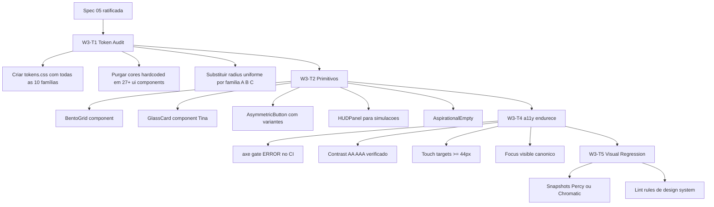

# 05 — Design System Soul & Elite (Tokens, Primitivos e Wireframes)

# PDC v2 — Design System "Soul & Elite"

<user_quoted_section>Status: Canónico · Substitui: decisões dispersas em  (§6 Estética),  (§3) e o ADR-006 (Herança Invisível).
Briefing operacional para: W3-T1 (token audit) · W3-T2 (Glassmorphism + BentoGrid + Padrões africanos) · W3-T4 (a11y endurece).</user_quoted_section>

## 1. Manifesto — Herança Invisível

<user_quoted_section>"Sofisticação global de Apple, raízes culturais de Angola, mas nenhum ornamento literal."</user_quoted_section>

O PDC nunca pode parecer:

- Um **panfleto governamental** (cores chapadas, tipografias institucionais cansadas).
- Uma **homenagem folclórica** (padrões tribais visíveis, máscaras, paletas terra exageradas).
- Um **dashboard genérico de SaaS** (azul corporativo Facebook, neon tecnológico).

O PDC tem de parecer um **instrumento científico de elite global** — onde a alma angolana entra **subliminarmente**, na geometria, no peso da tipografia e no calor das superfícies. O utilizador não deve **ver** Angola; deve **sentir** que algo é diferente, sem saber porquê.

<user_quoted_section>Analogia oficial: Como um chef Michelin que usa uma redução clássica francesa mas, no fundo, há uma especiaria angolana. O cliente sente a familiaridade no paladar, mas a técnica permanece imaculada.</user_quoted_section>

## 2. Os 8 Princípios Não-Negociáveis

| # | Princípio | Regra operacional |
| --- | --- | --- |
| 1 | **Aniquilação dos extremos** | Nunca usar `#000000` puro (smear OLED) nem `#FFFFFF` puro (branco de hospital). |
| 2 | **Tinta cinzento-castanha** | O texto principal não é preto. É um cinzento quente, derivado da terra, para reduzir contraste agressivo. |
| 3 | **Off-white de areia** | A superfície base do tema claro tem um sub-tom quente (areia/lama), não cinzento neutro. |
| 4 | **Acento Terracota Africano** | O acento é `#D2691E` (terracota). **Limite ≤ 5% da área visível**. Nunca azul electrico. |
| 5 | **Bordas Assimétricas** | ≤ 3% dos elementos têm radii assimétricos (inspiração Kente/Adinkra), apenas em momentos de autoridade. Restantes são uniformes. |
| 6 | **Física Apple** | Animações usam Motion com springs (`stiffness: 220, damping: 28`). Inércia idêntica a iOS. |
| 7 | **Linguagem do 8.º ano** | Toda a copy passa o teste do *"Painel de Decisão"* (não *"Cognitive Command Center"*). |
| 8 | **44px de toque mínimo** | Áreas tocáveis em mobile nunca abaixo de 44×44px. PWA-First. |

## 3. Tokens Canónicos (CSS Custom Properties)

<user_quoted_section>Aplicar via apps/web/src/styles/tokens.css (importado em index.css antes de Tailwind v4).</user_quoted_section>

### 3.1 Superfícies — Tema Claro (canónico base)

```
--surface-canvas:    #F8F9FA   /* OS chrome — canónico CONSTITUTION */
--surface-elevated:  #FAF6EE   /* Cards, painéis (warm sand layer) */
--surface-recessed:  #F2EFE8   /* Inputs, áreas de leitura */
--surface-overlay:   rgba(250, 246, 238, 0.72)  /* Glass background light */
```

### 3.2 Superfícies — Tema Escuro (deep, nunca preto puro)

```
--surface-canvas-dark:    #0E0D0C   /* Very deep — sem OLED smear */
--surface-elevated-dark:  #18171A
--surface-recessed-dark:  #0A0908
--surface-overlay-dark:   rgba(24, 23, 26, 0.78)
```

### 3.3 Tinta (texto e ícones)

```
--ink-primary:    #2A2724   /* Cinzento-castanho — substitui o preto */
--ink-secondary:  #5A5751
--ink-tertiary:   #8A867F
--ink-disabled:   #C4C0B8
--ink-on-accent:  #FFFCF7   /* Texto sobre terracota */

/* Dark mode */
--ink-primary-dark:    #ECE7DD
--ink-secondary-dark:  #B5AFA3
--ink-tertiary-dark:   #807A6F
```

### 3.4 Acentos

```
--accent-terracotta:        #D2691E   /* Canónico — momentos de autoridade */
--accent-terracotta-soft:   #E8945C   /* Hover / fundos suaves */
--accent-terracotta-deep:   #A14E0F   /* Pressed state */
--accent-terracotta-glow:   rgba(210, 105, 30, 0.18)  /* Halo, glass border */

--institutional-cobalt:     #004AAD   /* Canónico — links institucionais */
--accent-success:           #2F7A4F   /* Verde quente, não néon */
--accent-warning:           #C68A2E   /* Amarelo terra */
--accent-danger:            #B23B2E   /* Vermelho de barro queimado */
```

### 3.5 Tipografia

| Token | Fonte | Uso |
| --- | --- | --- |
| `--font-ui` | `Inter, system-ui, sans-serif` | Corpo, UI geral |
| `--font-authority` | `'Instrument Serif', Georgia, serif` | Hero, títulos de autoridade, números heroicos |
| `--font-mono` | `'JetBrains Mono', ui-monospace` | KPIs, scores ($\phi$, $R$), códigos |

**Escala (****`rem`**** baseado em 16px):**

```
--text-display-xl: 3.0rem   / line-height 1.05  /* Instrument Serif */
--text-display-lg: 2.25rem  / line-height 1.10
--text-display-md: 1.75rem  / line-height 1.15
--text-heading-lg: 1.5rem   / line-height 1.25
--text-heading-md: 1.25rem  / line-height 1.30
--text-heading-sm: 1.125rem / line-height 1.35
--text-body-lg:    1.0rem   / line-height 1.55
--text-body-md:    0.875rem / line-height 1.55
--text-caption:    0.75rem  / line-height 1.45
--text-mono-lg:    1.5rem   / line-height 1.20  /* KPIs */
--text-mono-md:    0.875rem / line-height 1.40
```

<user_quoted_section>Regra de uso: títulos com gravitas (Hero, Score do Perfil Vocacional, "Decisão") usam Instrument Serif. Tudo o resto é Inter.</user_quoted_section>

### 3.6 Espaçamento (escala 4-based)

```
--space-1:  4px
--space-2:  8px
--space-3:  12px
--space-4:  16px   /* Padrão de cards */
--space-5:  20px
--space-6:  24px   /* Gap default em BentoGrid */
--space-8:  32px
--space-10: 40px
--space-12: 48px
--space-16: 64px
```

### 3.7 Radii — A Regra das 3 Famílias

```
/* Família A — Simétricos (97% dos elementos) */
--radius-sm:  6px
--radius-md:  10px
--radius-lg:  14px
--radius-xl:  20px
--radius-full: 9999px

/* Família B — Assimétricos par TL+BR (≤ 1.5% dos elementos) */
--radius-asym-a: 18px 6px 18px 6px
                  /* top-left  top-right  bottom-right  bottom-left */

/* Família C — Assimétricos par TR+BL espelhado (≤ 1.5% dos elementos) */
--radius-asym-b: 6px 18px 6px 18px
```

<user_quoted_section>Regra das Bordas Assimétricas (subliminar Kente/Adinkra): apenas em momentos de autoridade — CTA primário do hero, badge de conquista milestone, card de score do Perfil Vocacional, selo "Aptidão Validada". Misturar A e B numa página dá assimetria deliberada sem parecer aleatório.</user_quoted_section>

### 3.8 Sombras (elevação suave, sem dramatismo)

```
--elevation-0: none
--elevation-1: 0 1px 2px rgba(42, 39, 36, 0.04), 0 1px 3px rgba(42, 39, 36, 0.06)
--elevation-2: 0 4px 12px rgba(42, 39, 36, 0.06), 0 2px 4px rgba(42, 39, 36, 0.04)
--elevation-3: 0 12px 32px rgba(42, 39, 36, 0.10), 0 4px 8px rgba(42, 39, 36, 0.05)
--elevation-glow: 0 0 0 1px rgba(210, 105, 30, 0.20), 0 8px 24px rgba(210, 105, 30, 0.12)
```

### 3.9 Glass (Tina, painéis IA)

```
--glass-bg-light:     rgba(250, 246, 238, 0.72)
--glass-bg-dark:      rgba(24, 23, 26, 0.78)
--glass-border-light: rgba(42, 39, 36, 0.08)
--glass-border-dark:  rgba(236, 231, 221, 0.12)
--glass-blur:         18px
--glass-saturate:     140%
```

CSS:

```
backdrop-filter: blur(var(--glass-blur)) saturate(var(--glass-saturate));
background: var(--glass-bg-light);
border: 1px solid var(--glass-border-light);
```

### 3.10 Motion (Física Apple-like)

```
--ease-out-expo:   cubic-bezier(0.19, 1, 0.22, 1)
--ease-spring:     spring(220, 28)  /* Motion lib config */
--duration-fast:   150ms
--duration-base:   250ms
--duration-slow:   400ms
--duration-page:   320ms
```

**Respeitar ****`prefers-reduced-motion: reduce`** sempre — fallback para opacidade simples sem transform.

## 4. Os 5 Primitivos do Design System

<user_quoted_section>Todos vivem em apps/web/src/components/ui/. Cada um exporta também os tipos para @pdc/shared quando relevante.</user_quoted_section>

### 4.1 `BentoGrid` — Dashboards Role-Aware

Layout de tiles com tamanhos variados (1×1, 2×1, 1×2, 2×2). O conteúdo de cada tile é **role-aware** — o mesmo grid mostra coisas diferentes conforme o role.

| Tile | Estudante vê | Mentor vê | Instituição vê |
| --- | --- | --- | --- |
| Tile principal (2×2) | Perfil Vocacional + score $\phi$, $R$ | KPIs da turma (média, dropoff) | Match Terminal |
| Tile médio (2×1) | Próxima simulação sugerida | Mentorias pendentes | Estudantes em risco |
| Tile pequeno (1×1) | Streak (dias consecutivos) | Pedidos novos | Inscrições novas |
| Tile pequeno (1×1) | Talent Bounty desbloqueado | Avaliações pendentes | Branding status |

Regras:

- Gap padrão: `--space-6` (24px).
- Tiles em `--surface-elevated` com `--elevation-1`.
- Tile principal pode ter `--radius-asym-a` (1 por dashboard, no máximo).

### 4.2 `GlassCard` — Painéis IA / Tina

Card com glassmorphism para destacar conteúdo gerado pela Tina (Threaded Insights, Sugestões, Resumos).

- Background: `--glass-bg-light` (auto-switch dark).
- Backdrop blur ativo, contraste AA garantido.
- Borda fina `--glass-border-light`.
- Pequena halo `--accent-terracotta-glow` no canto superior esquerdo (assina autoria Tina sem logo).

### 4.3 `AsymmetricButton` — CTA de Autoridade

Botão para o **CTA primário do hero**, **submeter simulação**, **publicar projeto**. Nunca mais que um por viewport.

- Radii: `--radius-asym-a` (TL+BR rounded, TR+BL square).
- Background: `--accent-terracotta`.
- Texto: `--ink-on-accent`, font Inter 600.
- Padding: `--space-3 --space-6`.
- Hover: `--accent-terracotta-soft` + `--elevation-glow`.
- Pressed: `--accent-terracotta-deep`, transform `scale(0.98)`.
- Reduced-motion: troca `scale` por mudança de opacidade.

### 4.4 `HUDPanel` — Cromo de Simulação

Para Simulações Tipo 2 e 3 — overlays de telemetria visível ao instrutor (e opcionalmente ao aluno em modo treino).

- Background: `--surface-canvas-dark` mesmo em tema claro (HUD é sempre escuro).
- Tipografia: `--font-mono` para números.
- Cantos: `--radius-md` (6×4 grid).
- Mostra em tempo real: cronómetro, $\phi$ instantâneo, $R$ acumulado, hesitação atual.

### 4.5 `AspirationalEmpty` — Empty States com Promessa

Em vez de *"Sem dados"*, mostra o que aparecerá **depois** com uma silhueta de placeholder + uma frase aspiracional curta.

Exemplos canónicos:

- Feed vazio: *"O teu feed acende quando começares a explorar. Faz a tua primeira simulação."*
- Perfil Vocacional sem dados: *"O teu mapa cognitivo nasce com a primeira simulação. Vamos lá?"*

## 5. Wireframes

### 5.1 Landing Page (Tema Claro · Hero com Constelação Neural)

```wireframe

<html>
<head>
<style>
:root {
  --surface-canvas: #F8F9FA;
  --surface-elevated: #FAF6EE;
  --ink-primary: #2A2724;
  --ink-secondary: #5A5751;
  --ink-tertiary: #8A867F;
  --accent-terracotta: #D2691E;
  --institutional-cobalt: #004AAD;
  --radius-md: 10px;
  --radius-lg: 14px;
  --radius-asym-a: 18px 6px 18px 6px;
}
* { margin: 0; padding: 0; box-sizing: border-box; }
body { font-family: Inter, system-ui, sans-serif; background: var(--surface-canvas); color: var(--ink-primary); }
.topbar { display: flex; justify-content: space-between; align-items: center; padding: 18px 32px; border-bottom: 1px solid rgba(42,39,36,0.06); }
.brand { font-family: 'Instrument Serif', Georgia, serif; font-size: 20px; letter-spacing: -0.01em; }
.brand .dot { color: var(--accent-terracotta); }
.nav-actions { display: flex; gap: 12px; align-items: center; }
.btn { font: 500 14px Inter; padding: 10px 18px; border-radius: var(--radius-md); border: none; cursor: pointer; min-height: 44px; }
.btn-ghost { background: transparent; color: var(--ink-secondary); }
.btn-outline { background: transparent; border: 1px solid rgba(42,39,36,0.12); color: var(--ink-primary); }
.btn-primary { background: var(--accent-terracotta); color: #FFFCF7; border-radius: var(--radius-asym-a); font-weight: 600; }
.hero { padding: 96px 32px 64px; max-width: 1100px; margin: 0 auto; display: grid; grid-template-columns: 1.1fr 1fr; gap: 64px; align-items: center; }
.hero-eyebrow { font-size: 12px; letter-spacing: 0.12em; text-transform: uppercase; color: var(--accent-terracotta); font-weight: 600; margin-bottom: 16px; }
.hero h1 { font-family: 'Instrument Serif', Georgia, serif; font-size: 56px; line-height: 1.05; letter-spacing: -0.02em; color: var(--ink-primary); margin-bottom: 20px; }
.hero h1 em { font-style: italic; color: var(--accent-terracotta); }
.hero p { font-size: 17px; line-height: 1.55; color: var(--ink-secondary); margin-bottom: 32px; max-width: 480px; }
.hero-cta-row { display: flex; gap: 12px; }
.constellation { aspect-ratio: 1; background: var(--surface-elevated); border-radius: var(--radius-lg); position: relative; overflow: hidden; box-shadow: 0 4px 12px rgba(42,39,36,0.06); }
.node { position: absolute; width: 12px; height: 12px; border-radius: 50%; background: var(--accent-terracotta); box-shadow: 0 0 0 8px rgba(210,105,30,0.10); }
.node.s { width: 6px; height: 6px; background: var(--ink-tertiary); box-shadow: 0 0 0 4px rgba(138,134,127,0.10); }
.line { position: absolute; height: 1px; background: rgba(210,105,30,0.18); transform-origin: left center; }
.constellation-label { position: absolute; bottom: 16px; left: 16px; font: 11px 'JetBrains Mono', ui-monospace; color: var(--ink-tertiary); letter-spacing: 0.05em; }
.proof { padding: 48px 32px; max-width: 1100px; margin: 0 auto; border-top: 1px solid rgba(42,39,36,0.06); }
.proof-title { font-size: 12px; letter-spacing: 0.12em; text-transform: uppercase; color: var(--ink-tertiary); margin-bottom: 24px; text-align: center; }
.proof-row { display: grid; grid-template-columns: repeat(3, 1fr); gap: 24px; }
.proof-card { background: var(--surface-elevated); border-radius: var(--radius-lg); padding: 24px; }
.proof-num { font-family: 'Instrument Serif', Georgia, serif; font-size: 40px; line-height: 1; color: var(--accent-terracotta); margin-bottom: 8px; }
.proof-label { font-size: 13px; color: var(--ink-secondary); }
</style>
</head>
<body>
<nav class="topbar">
  <div class="brand">Por Dentro do Curso<span class="dot">.</span></div>
  <div class="nav-actions">
    <button class="btn btn-ghost" data-element-id="nav-explore">Explorar</button>
    <button class="btn btn-ghost" data-element-id="nav-instituitions">Para Instituições</button>
    <button class="btn btn-outline" data-element-id="nav-login">Entrar</button>
    <button class="btn btn-primary" data-element-id="nav-cta">Começa o desafio</button>
  </div>
</nav>

<section class="hero">
  <div>
    <div class="hero-eyebrow">Decisão vocacional baseada em evidência</div>
    <h1>Descobre a tua carreira <em>antes</em> de te comprometeres.</h1>
    <p>O PDC mede o teu comportamento real em simulações práticas. Em 3 perguntas começas a entender se um curso é para ti — sem suposições, sem testes de personalidade, só evidência.</p>
    <div class="hero-cta-row">
      <button class="btn btn-primary" data-element-id="hero-cta-primary">Começa o desafio · 3 perguntas</button>
      <button class="btn btn-outline" data-element-id="hero-cta-secondary">Ver como funciona</button>
    </div>
  </div>

  <div class="constellation">
    <div class="node" style="top: 30%; left: 25%;"></div>
    <div class="node" style="top: 55%; left: 60%;"></div>
    <div class="node" style="top: 25%; left: 70%;"></div>
    <div class="node s" style="top: 70%; left: 35%;"></div>
    <div class="node s" style="top: 45%; left: 45%;"></div>
    <div class="node s" style="top: 80%; left: 75%;"></div>
    <div class="line" style="top: 32%; left: 27%; width: 240px; transform: rotate(20deg);"></div>
    <div class="line" style="top: 47%; left: 47%; width: 130px; transform: rotate(-15deg);"></div>
    <div class="line" style="top: 57%; left: 35%; width: 220px; transform: rotate(8deg);"></div>
    <div class="constellation-label">PERFIL_VOCACIONAL · 9.247 SINAIS</div>
  </div>
</section>

<section class="proof">
  <div class="proof-title">Confiado por instituições angolanas</div>
  <div class="proof-row">
    <div class="proof-card">
      <div class="proof-num">−42%</div>
      <div class="proof-label">Redução média de evasão no 1.º ano em escolas piloto</div>
    </div>
    <div class="proof-card">
      <div class="proof-num">12.4k</div>
      <div class="proof-label">Estudantes com Perfil Vocacional ativo</div>
    </div>
    <div class="proof-card">
      <div class="proof-num">98.7%</div>
      <div class="proof-label">Precisão do detector anti-fraude (dual-layer)</div>
    </div>
  </div>
</section>

</body>
</html>
```

### 5.2 Dashboard Estudante — BentoGrid (Tema Claro)

```wireframe

<html>
<head>
<style>
:root {
  --surface-canvas: #F8F9FA;
  --surface-elevated: #FAF6EE;
  --surface-recessed: #F2EFE8;
  --ink-primary: #2A2724;
  --ink-secondary: #5A5751;
  --ink-tertiary: #8A867F;
  --accent-terracotta: #D2691E;
  --accent-terracotta-soft: #E8945C;
  --accent-success: #2F7A4F;
  --radius-md: 10px;
  --radius-lg: 14px;
  --radius-asym-a: 18px 6px 18px 6px;
}
* { margin: 0; padding: 0; box-sizing: border-box; }
body { font-family: Inter, system-ui, sans-serif; background: var(--surface-canvas); color: var(--ink-primary); display: flex; min-height: 100vh; }
.sidebar { width: 64px; background: var(--surface-elevated); border-right: 1px solid rgba(42,39,36,0.06); display: flex; flex-direction: column; padding: 20px 0; gap: 8px; align-items: center; }
.brand-mark { width: 36px; height: 36px; border-radius: var(--radius-asym-a); background: var(--accent-terracotta); color: #FFFCF7; display: flex; align-items: center; justify-content: center; font: 700 14px 'Instrument Serif', Georgia, serif; margin-bottom: 16px; }
.nav-icon { width: 44px; height: 44px; border-radius: var(--radius-md); display: flex; align-items: center; justify-content: center; color: var(--ink-tertiary); font-size: 18px; cursor: pointer; }
.nav-icon.active { background: var(--surface-recessed); color: var(--accent-terracotta); }
.main { flex: 1; padding: 24px 32px; display: flex; flex-direction: column; gap: 24px; overflow-y: auto; }
.topbar { display: flex; justify-content: space-between; align-items: center; }
.greeting { font-family: 'Instrument Serif', Georgia, serif; font-size: 28px; line-height: 1.15; letter-spacing: -0.01em; }
.greeting em { color: var(--accent-terracotta); font-style: italic; }
.greeting-sub { font-size: 13px; color: var(--ink-tertiary); margin-top: 4px; }
.topbar-right { display: flex; gap: 12px; align-items: center; }
.cmdk { background: var(--surface-elevated); border: 1px solid rgba(42,39,36,0.08); border-radius: var(--radius-md); padding: 8px 12px; min-width: 280px; font-size: 13px; color: var(--ink-tertiary); display: flex; justify-content: space-between; cursor: pointer; }
.kbd { font: 11px 'JetBrains Mono', ui-monospace; background: var(--surface-recessed); padding: 2px 6px; border-radius: 4px; }
.avatar { width: 36px; height: 36px; border-radius: 50%; background: var(--accent-terracotta); color: #FFFCF7; display: flex; align-items: center; justify-content: center; font: 600 13px Inter; }
.bento { display: grid; grid-template-columns: repeat(4, 1fr); grid-auto-rows: 180px; gap: 24px; }
.tile { background: var(--surface-elevated); border-radius: var(--radius-lg); padding: 20px; box-shadow: 0 1px 2px rgba(42,39,36,0.04), 0 1px 3px rgba(42,39,36,0.06); display: flex; flex-direction: column; }
.tile-vocational { grid-column: span 2; grid-row: span 2; border-radius: var(--radius-asym-a); position: relative; overflow: hidden; }
.tile-eyebrow { font-size: 11px; letter-spacing: 0.10em; text-transform: uppercase; color: var(--ink-tertiary); margin-bottom: 12px; }
.score-hero { font-family: 'Instrument Serif', Georgia, serif; font-size: 64px; line-height: 1; color: var(--ink-primary); margin: 8px 0 4px; }
.score-hero em { color: var(--accent-terracotta); font-style: italic; font-size: 28px; vertical-align: super; }
.score-label { font-size: 14px; color: var(--ink-secondary); margin-bottom: 16px; }
.score-bars { display: flex; flex-direction: column; gap: 10px; margin-top: auto; }
.bar-row { display: flex; align-items: center; gap: 12px; font-size: 12px; }
.bar-label { width: 110px; color: var(--ink-secondary); font: 12px 'JetBrains Mono', ui-monospace; }
.bar-track { flex: 1; height: 6px; background: var(--surface-recessed); border-radius: 999px; position: relative; overflow: hidden; }
.bar-fill { position: absolute; left: 0; top: 0; bottom: 0; background: var(--accent-terracotta); border-radius: 999px; }
.bar-value { width: 36px; text-align: right; font: 12px 'JetBrains Mono', ui-monospace; color: var(--ink-primary); }
.tile-streak { display: flex; flex-direction: column; justify-content: space-between; }
.streak-num { font-family: 'Instrument Serif', Georgia, serif; font-size: 56px; line-height: 1; color: var(--accent-terracotta); }
.streak-dots { display: flex; gap: 4px; margin-top: 12px; }
.dot { width: 14px; height: 14px; border-radius: 50%; background: var(--accent-terracotta); }
.dot.empty { background: var(--surface-recessed); }
.tile-next { grid-column: span 2; }
.next-title { font: 600 16px Inter; margin-bottom: 4px; }
.next-meta { font: 12px 'JetBrains Mono', ui-monospace; color: var(--ink-tertiary); margin-bottom: 12px; letter-spacing: 0.05em; }
.next-desc { font-size: 13px; color: var(--ink-secondary); line-height: 1.5; margin-bottom: auto; }
.next-cta { background: var(--accent-terracotta); color: #FFFCF7; border: none; border-radius: var(--radius-md); padding: 10px 16px; font: 600 13px Inter; cursor: pointer; align-self: flex-start; min-height: 44px; }
.tile-talent { background: var(--surface-canvas); border: 1px dashed var(--accent-terracotta-soft); display: flex; flex-direction: column; justify-content: center; align-items: center; text-align: center; }
.talent-emoji { font-size: 24px; margin-bottom: 8px; opacity: 0.7; }
.talent-text { font-size: 12px; color: var(--ink-tertiary); line-height: 1.4; padding: 0 8px; }
.tile-tina { background: rgba(250, 246, 238, 0.72); border: 1px solid rgba(210, 105, 30, 0.18); position: relative; }
.tina-tag { position: absolute; top: 16px; right: 16px; font: 10px 'JetBrains Mono', ui-monospace; color: var(--accent-terracotta); letter-spacing: 0.10em; }
.tina-quote { font-family: 'Instrument Serif', Georgia, serif; font-size: 16px; line-height: 1.4; color: var(--ink-primary); font-style: italic; margin-top: 24px; }
</style>
</head>
<body>

<aside class="sidebar">
  <div class="brand-mark">P</div>
  <div class="nav-icon active" data-element-id="nav-dashboard">◆</div>
  <div class="nav-icon" data-element-id="nav-explore">⊞</div>
  <div class="nav-icon" data-element-id="nav-simulations">⟁</div>
  <div class="nav-icon" data-element-id="nav-vocational">⌬</div>
  <div class="nav-icon" data-element-id="nav-projects">◇</div>
  <div class="nav-icon" data-element-id="nav-feed">≋</div>
</aside>

<main class="main">
  <div class="topbar">
    <div>
      <div class="greeting">Bom dia, <em>Ana</em>.</div>
      <div class="greeting-sub">Estás a 2 simulações de subir para o tier Prata.</div>
    </div>
    <div class="topbar-right">
      <div class="cmdk" data-element-id="cmdk-trigger"><span>Procurar tudo…</span><span class="kbd">⌘K</span></div>
      <div class="avatar">A</div>
    </div>
  </div>

  <div class="bento">
    <div class="tile tile-vocational">
      <div class="tile-eyebrow">PERFIL VOCACIONAL · ENGENHARIA</div>
      <div class="score-hero">82<em>/100</em></div>
      <div class="score-label">Compatibilidade alta · certeza média</div>
      <div class="score-bars">
        <div class="bar-row">
          <div class="bar-label">FLUIDEZ_φ</div>
          <div class="bar-track"><div class="bar-fill" style="width: 78%"></div></div>
          <div class="bar-value">0.78</div>
        </div>
        <div class="bar-row">
          <div class="bar-label">RESILIÊNCIA_R</div>
          <div class="bar-track"><div class="bar-fill" style="width: 64%"></div></div>
          <div class="bar-value">0.64</div>
        </div>
        <div class="bar-row">
          <div class="bar-label">FOCO</div>
          <div class="bar-track"><div class="bar-fill" style="width: 88%"></div></div>
          <div class="bar-value">0.88</div>
        </div>
      </div>
    </div>

    <div class="tile tile-streak">
      <div class="tile-eyebrow">STREAK</div>
      <div>
        <div class="streak-num">12</div>
        <div style="font-size: 12px; color: var(--ink-secondary); margin-top: 4px;">dias seguidos</div>
      </div>
      <div class="streak-dots">
        <div class="dot"></div><div class="dot"></div><div class="dot"></div><div class="dot"></div><div class="dot"></div><div class="dot"></div><div class="dot empty"></div>
      </div>
    </div>

    <div class="tile tile-talent">
      <div class="talent-emoji">⬢</div>
      <div class="talent-text"><strong>Talent Bounty</strong><br/>Próximo desbloqueio em 3 simulações</div>
    </div>

    <div class="tile tile-next">
      <div class="tile-eyebrow">PRÓXIMA SUGESTÃO · TINA</div>
      <div class="next-title">Diagnóstico Médico — Tipo 2</div>
      <div class="next-meta">45 MIN · NÍVEL MÉDIO · 847 TENTATIVAS</div>
      <div class="next-desc">Os teus dados em decisões sob ambiguidade são fortes. Esta simulação vai validar se essa fluidez se estende ao raciocínio clínico.</div>
      <button class="next-cta" data-element-id="cta-start-sim">Iniciar simulação</button>
    </div>

    <div class="tile tile-tina">
      <div class="tina-tag">TINA · INSIGHT</div>
      <div class="tina-quote">"A tua hesitação aumenta nas perguntas de cálculo financeiro. Vale a pena ver o módulo de fundamentos do curso de Gestão antes da próxima simulação."</div>
    </div>
  </div>
</main>

</body>
</html>
```

### 5.3 Simulação Tipo 2 — HUD Telemetria (Tema Escuro Sempre)

```wireframe

<html>
<head>
<style>
:root {
  --surface-canvas-dark: #0E0D0C;
  --surface-elevated-dark: #18171A;
  --surface-recessed-dark: #0A0908;
  --ink-primary-dark: #ECE7DD;
  --ink-secondary-dark: #B5AFA3;
  --ink-tertiary-dark: #807A6F;
  --accent-terracotta: #D2691E;
  --accent-success: #2F7A4F;
  --accent-warning: #C68A2E;
  --radius-md: 10px;
  --radius-lg: 14px;
}
* { margin: 0; padding: 0; box-sizing: border-box; }
body { font-family: Inter, system-ui, sans-serif; background: var(--surface-canvas-dark); color: var(--ink-primary-dark); height: 100vh; display: flex; flex-direction: column; overflow: hidden; }
.sim-topbar { display: flex; justify-content: space-between; align-items: center; padding: 14px 24px; border-bottom: 1px solid rgba(236,231,221,0.08); }
.sim-title { font: 600 14px Inter; }
.sim-title small { color: var(--ink-tertiary-dark); margin-left: 12px; font-weight: 400; }
.sim-timer { font: 600 16px 'JetBrains Mono', ui-monospace; color: var(--accent-warning); padding: 6px 12px; border: 1px solid rgba(198,138,46,0.30); border-radius: var(--radius-md); }
.sim-exit { background: transparent; color: var(--ink-tertiary-dark); border: 1px solid rgba(236,231,221,0.12); border-radius: var(--radius-md); padding: 8px 14px; font-size: 13px; cursor: pointer; }
.sim-stage { flex: 1; display: grid; grid-template-columns: 1fr 280px; }
.scenario { padding: 48px; display: flex; flex-direction: column; gap: 32px; overflow-y: auto; }
.scenario-eyebrow { font: 11px 'JetBrains Mono', ui-monospace; color: var(--accent-terracotta); letter-spacing: 0.12em; }
.scenario h2 { font-family: 'Instrument Serif', Georgia, serif; font-size: 32px; line-height: 1.15; color: var(--ink-primary-dark); }
.scenario p { font-size: 15px; line-height: 1.6; color: var(--ink-secondary-dark); max-width: 640px; }
.options { display: grid; grid-template-columns: 1fr 1fr; gap: 12px; max-width: 720px; }
.option-card { background: var(--surface-elevated-dark); border: 1px solid rgba(236,231,221,0.08); border-radius: var(--radius-md); padding: 18px; cursor: pointer; min-height: 80px; display: flex; flex-direction: column; gap: 8px; }
.option-card.selected { border-color: var(--accent-terracotta); background: rgba(210,105,30,0.08); }
.option-key { font: 600 11px 'JetBrains Mono', ui-monospace; color: var(--ink-tertiary-dark); letter-spacing: 0.10em; }
.option-text { font-size: 14px; color: var(--ink-primary-dark); line-height: 1.45; }
.confirm-row { display: flex; justify-content: space-between; align-items: center; max-width: 720px; }
.confirm-meta { font: 11px 'JetBrains Mono', ui-monospace; color: var(--ink-tertiary-dark); letter-spacing: 0.10em; }
.confirm-btn { background: var(--accent-terracotta); color: #FFFCF7; border: none; border-radius: 18px 6px 18px 6px; padding: 12px 24px; font: 600 14px Inter; cursor: pointer; min-height: 44px; }
.hud { background: var(--surface-recessed-dark); border-left: 1px solid rgba(236,231,221,0.08); padding: 20px; display: flex; flex-direction: column; gap: 18px; }
.hud-section { display: flex; flex-direction: column; gap: 6px; }
.hud-label { font: 10px 'JetBrains Mono', ui-monospace; color: var(--ink-tertiary-dark); letter-spacing: 0.10em; }
.hud-value-big { font: 600 28px 'JetBrains Mono', ui-monospace; color: var(--ink-primary-dark); }
.hud-value-big.warn { color: var(--accent-warning); }
.hud-value-big.ok { color: var(--accent-success); }
.hud-bar { height: 4px; background: rgba(236,231,221,0.06); border-radius: 2px; position: relative; overflow: hidden; }
.hud-bar-fill { position: absolute; inset: 0; background: var(--accent-terracotta); border-radius: 2px; }
.hud-divider { height: 1px; background: rgba(236,231,221,0.06); }
.hud-spark { display: flex; align-items: end; gap: 2px; height: 32px; }
.hud-spark-bar { width: 4px; background: var(--accent-terracotta); border-radius: 1px; }
.hud-shadow-tag { font: 9px 'JetBrains Mono', ui-monospace; color: var(--ink-tertiary-dark); letter-spacing: 0.12em; padding: 4px 6px; background: rgba(236,231,221,0.04); border-radius: 4px; align-self: flex-start; }
</style>
</head>
<body>

<header class="sim-topbar">
  <div class="sim-title">Simulação · Diagnóstico Médico — Tipo 2 <small>Caso 3 de 8</small></div>
  <div class="sim-timer">28:42</div>
  <button class="sim-exit" data-element-id="exit-sim">Sair</button>
</header>

<main class="sim-stage">
  <section class="scenario">
    <div>
      <div class="scenario-eyebrow">CENÁRIO CLÍNICO</div>
      <h2 style="margin-top: 8px;">Doente com 56 anos, dor torácica há 2h, dispneia ligeira.</h2>
    </div>
    <p>Sinais vitais: TA 152/94, FC 108bpm, SpO2 94%. ECG mostra inversão de onda T em derivações inferiores. Troponina pendente. Que pedido prioritário fazes?</p>

    <div class="options">
      <div class="option-card" data-element-id="opt-a">
        <div class="option-key">A</div>
        <div class="option-text">Repetir ECG em 15 min e aguardar troponina</div>
      </div>
      <div class="option-card selected" data-element-id="opt-b">
        <div class="option-key">B</div>
        <div class="option-text">Activar protocolo de dor torácica + AAS 300mg + nitratos sublinguais</div>
      </div>
      <div class="option-card" data-element-id="opt-c">
        <div class="option-key">C</div>
        <div class="option-text">Pedir ecocardiograma urgente antes de qualquer fármaco</div>
      </div>
      <div class="option-card" data-element-id="opt-d">
        <div class="option-key">D</div>
        <div class="option-text">Encaminhar para observação sem intervenção imediata</div>
      </div>
    </div>

    <div class="confirm-row">
      <div class="confirm-meta">DECISÃO REGISTADA · TELEMETRIA ATIVA</div>
      <button class="confirm-btn" data-element-id="confirm-decision">Confirmar decisão</button>
    </div>
  </section>

  <aside class="hud">
    <div class="hud-section">
      <div class="hud-label">FLUIDEZ_φ · INSTANTÂNEA</div>
      <div class="hud-value-big ok">0.81</div>
      <div class="hud-bar"><div class="hud-bar-fill" style="width: 81%"></div></div>
    </div>

    <div class="hud-section">
      <div class="hud-label">RESILIÊNCIA_R · ACUMULADA</div>
      <div class="hud-value-big">0.67</div>
      <div class="hud-bar"><div class="hud-bar-fill" style="width: 67%"></div></div>
    </div>

    <div class="hud-divider"></div>

    <div class="hud-section">
      <div class="hud-label">HESITAÇÃO · ÚLTIMOS 60s</div>
      <div class="hud-spark">
        <div class="hud-spark-bar" style="height: 30%"></div>
        <div class="hud-spark-bar" style="height: 50%"></div>
        <div class="hud-spark-bar" style="height: 40%"></div>
        <div class="hud-spark-bar" style="height: 70%"></div>
        <div class="hud-spark-bar" style="height: 95%"></div>
        <div class="hud-spark-bar" style="height: 60%"></div>
        <div class="hud-spark-bar" style="height: 45%"></div>
        <div class="hud-spark-bar" style="height: 30%"></div>
      </div>
    </div>

    <div class="hud-section">
      <div class="hud-label">DECISÕES MUDADAS</div>
      <div class="hud-value-big">2</div>
    </div>

    <div class="hud-divider"></div>

    <div class="hud-shadow-tag">SANITY · DUAL-LAYER OK</div>
  </aside>
</main>

</body>
</html>
```

### 5.4 Tina Glass Card — Threaded Insight (Lateral, Tema Claro)

```wireframe

<html>
<head>
<style>
:root {
  --surface-canvas: #F8F9FA;
  --surface-elevated: #FAF6EE;
  --ink-primary: #2A2724;
  --ink-secondary: #5A5751;
  --ink-tertiary: #8A867F;
  --accent-terracotta: #D2691E;
}
* { margin: 0; padding: 0; box-sizing: border-box; }
body { font-family: Inter, system-ui, sans-serif; background: var(--surface-canvas); color: var(--ink-primary); padding: 32px; min-height: 100vh; }
.layout { display: grid; grid-template-columns: 1fr 380px; gap: 32px; max-width: 1240px; margin: 0 auto; }
.report { background: var(--surface-elevated); border-radius: 14px; padding: 32px; }
.report-eyebrow { font: 11px 'JetBrains Mono', ui-monospace; color: var(--accent-terracotta); letter-spacing: 0.12em; }
.report h1 { font-family: 'Instrument Serif', Georgia, serif; font-size: 36px; line-height: 1.1; margin: 8px 0 16px; }
.report .stat-row { display: flex; gap: 24px; margin: 24px 0; padding: 20px; background: rgba(242,239,232,0.6); border-radius: 10px; }
.stat { display: flex; flex-direction: column; gap: 4px; }
.stat-num { font-family: 'Instrument Serif', Georgia, serif; font-size: 28px; color: var(--ink-primary); }
.stat-num em { font-size: 16px; color: var(--accent-terracotta); font-style: italic; }
.stat-label { font: 11px 'JetBrains Mono', ui-monospace; color: var(--ink-tertiary); letter-spacing: 0.05em; }
.report p { font-size: 14px; line-height: 1.7; color: var(--ink-secondary); margin-bottom: 12px; }
.report .anchor { background: rgba(210,105,30,0.10); padding: 1px 6px; border-radius: 4px; cursor: pointer; color: var(--accent-terracotta); font-weight: 500; }
.glass { background: rgba(250, 246, 238, 0.72); backdrop-filter: blur(18px) saturate(140%); border: 1px solid rgba(42,39,36,0.08); border-radius: 14px; padding: 20px; position: sticky; top: 32px; box-shadow: 0 4px 12px rgba(42,39,36,0.06); }
.tina-header { display: flex; align-items: center; gap: 10px; margin-bottom: 16px; }
.tina-mark { width: 28px; height: 28px; border-radius: 18px 6px 18px 6px; background: var(--accent-terracotta); color: #FFFCF7; display: flex; align-items: center; justify-content: center; font: 700 12px 'Instrument Serif', Georgia, serif; }
.tina-name { font: 600 13px Inter; }
.tina-tag { font: 10px 'JetBrains Mono', ui-monospace; color: var(--ink-tertiary); letter-spacing: 0.10em; margin-left: auto; }
.thread { display: flex; flex-direction: column; gap: 14px; }
.insight { padding: 12px; background: rgba(242,239,232,0.7); border-radius: 10px; border-left: 2px solid var(--accent-terracotta); }
.insight-anchor { font: 10px 'JetBrains Mono', ui-monospace; color: var(--accent-terracotta); letter-spacing: 0.10em; margin-bottom: 6px; }
.insight-text { font-size: 13px; line-height: 1.5; color: var(--ink-primary); font-style: italic; }
.insight-actions { display: flex; gap: 8px; margin-top: 10px; }
.insight-btn { font: 500 11px Inter; padding: 6px 10px; background: transparent; border: 1px solid rgba(42,39,36,0.12); border-radius: 6px; color: var(--ink-secondary); cursor: pointer; }
.tina-input { margin-top: 16px; display: flex; gap: 8px; }
.tina-input input { flex: 1; background: rgba(255,255,255,0.6); border: 1px solid rgba(42,39,36,0.10); border-radius: 18px 6px 18px 6px; padding: 10px 14px; font-size: 13px; color: var(--ink-primary); min-height: 44px; }
.tina-input button { background: var(--accent-terracotta); color: #FFFCF7; border: none; border-radius: 18px 6px 18px 6px; padding: 10px 14px; cursor: pointer; min-height: 44px; min-width: 44px; }
</style>
</head>
<body>

<div class="layout">
  <article class="report">
    <div class="report-eyebrow">RELATÓRIO VOCACIONAL · v3</div>
    <h1>Engenharia · Compatibilidade alta com sinais a confirmar</h1>

    <div class="stat-row">
      <div class="stat"><div class="stat-num">82<em>/100</em></div><div class="stat-label">SCORE GLOBAL</div></div>
      <div class="stat"><div class="stat-num">0.78</div><div class="stat-label">FLUIDEZ_φ</div></div>
      <div class="stat"><div class="stat-num">0.64</div><div class="stat-label">RESILIÊNCIA_R</div></div>
      <div class="stat"><div class="stat-num">12</div><div class="stat-label">SIMULAÇÕES</div></div>
    </div>

    <p>O teu padrão comportamental em decisões sob ambiguidade está claramente acima da média da tua coorte. Em <span class="anchor" data-element-id="anchor-sim-3">simulação 3 (Estruturas)</span> mantiveste um ritmo de decisão constante mesmo nas perguntas de maior densidade técnica.</p>

    <p>Onde os teus dados sugerem cautela é em problemas que exigem cálculo financeiro intermediário. Na <span class="anchor" data-element-id="anchor-sim-7">simulação 7 (Análise de Custos)</span> a tua hesitação subiu 3.2× face à tua média habitual.</p>

    <p>A combinação destes sinais é compatível com perfis bem-sucedidos em Engenharia Civil e Engenharia Industrial. Se considerares Engenharia Financeira ou Gestão Industrial, recomendamos consolidar primeiro os fundamentos quantitativos.</p>
  </article>

  <aside class="glass">
    <div class="tina-header">
      <div class="tina-mark">T</div>
      <div class="tina-name">Tina</div>
      <div class="tina-tag">3 INSIGHTS</div>
    </div>

    <div class="thread">
      <div class="insight">
        <div class="insight-anchor">@ SIMULAÇÃO 3</div>
        <div class="insight-text">"A tua estabilidade neste módulo é equivalente à do top 8% dos estudantes de Engenharia Civil em Luanda."</div>
        <div class="insight-actions">
          <button class="insight-btn" data-element-id="insight-1-explore">Explorar dados</button>
          <button class="insight-btn" data-element-id="insight-1-bookmark">Guardar</button>
        </div>
      </div>

      <div class="insight">
        <div class="insight-anchor">@ SIMULAÇÃO 7</div>
        <div class="insight-text">"Sugiro o módulo 'Fundamentos de Custos' do curso da Eng.ª Beatriz Domingos antes de tentares de novo."</div>
        <div class="insight-actions">
          <button class="insight-btn" data-element-id="insight-2-open">Ver curso</button>
        </div>
      </div>

      <div class="insight">
        <div class="insight-anchor">@ PADRÃO GERAL</div>
        <div class="insight-text">"Tens 12 dias de streak. Manter este ritmo até dia 21 desbloqueia o Tier Prata."</div>
      </div>
    </div>

    <div class="tina-input">
      <input type="text" placeholder="Pergunta algo sobre o teu perfil…" data-element-id="tina-input">
      <button data-element-id="tina-send">→</button>
    </div>
  </aside>
</div>

</body>
</html>
```

### 5.5 Mobile PWA Shell (Tema Claro · Sidebar slim retrátil)

```wireframe

<html>
<head>
<style>
:root {
  --surface-canvas: #F8F9FA;
  --surface-elevated: #FAF6EE;
  --surface-recessed: #F2EFE8;
  --ink-primary: #2A2724;
  --ink-secondary: #5A5751;
  --ink-tertiary: #8A867F;
  --accent-terracotta: #D2691E;
  --radius-md: 10px;
  --radius-lg: 14px;
  --radius-asym-a: 18px 6px 18px 6px;
}
* { margin: 0; padding: 0; box-sizing: border-box; }
body { font-family: Inter, system-ui, sans-serif; background: #2A2724; display: flex; justify-content: center; padding: 24px; min-height: 100vh; }
.phone { width: 380px; height: 760px; background: var(--surface-canvas); border-radius: 36px; overflow: hidden; display: flex; flex-direction: column; box-shadow: 0 20px 60px rgba(0,0,0,0.4); border: 8px solid #18171A; }
.notch { height: 28px; display: flex; justify-content: center; align-items: flex-end; padding-bottom: 6px; background: var(--surface-canvas); }
.notch-pill { width: 90px; height: 24px; background: #0E0D0C; border-radius: 12px; }
.app-topbar { display: flex; justify-content: space-between; align-items: center; padding: 12px 20px; }
.app-greeting { font-family: 'Instrument Serif', Georgia, serif; font-size: 22px; }
.app-greeting em { color: var(--accent-terracotta); font-style: italic; }
.app-avatar { width: 36px; height: 36px; border-radius: 50%; background: var(--accent-terracotta); color: #FFFCF7; display: flex; align-items: center; justify-content: center; font: 600 13px Inter; }
.app-content { flex: 1; padding: 8px 20px 20px; display: flex; flex-direction: column; gap: 14px; overflow-y: auto; }
.score-card { background: var(--surface-elevated); border-radius: var(--radius-asym-a); padding: 18px; }
.score-eyebrow { font: 10px 'JetBrains Mono', ui-monospace; color: var(--ink-tertiary); letter-spacing: 0.12em; }
.score-num { font-family: 'Instrument Serif', Georgia, serif; font-size: 44px; line-height: 1; margin: 6px 0; }
.score-num em { color: var(--accent-terracotta); font-size: 18px; font-style: italic; vertical-align: super; }
.score-sub { font-size: 12px; color: var(--ink-secondary); }
.row-2 { display: grid; grid-template-columns: 1fr 1fr; gap: 10px; }
.mini-card { background: var(--surface-elevated); border-radius: var(--radius-md); padding: 14px; }
.mini-eyebrow { font: 9px 'JetBrains Mono', ui-monospace; color: var(--ink-tertiary); letter-spacing: 0.10em; }
.mini-num { font-family: 'Instrument Serif', Georgia, serif; font-size: 24px; line-height: 1; margin-top: 6px; color: var(--accent-terracotta); }
.next-card { background: var(--surface-elevated); border-radius: var(--radius-lg); padding: 16px; display: flex; flex-direction: column; gap: 8px; }
.next-eyebrow { font: 10px 'JetBrains Mono', ui-monospace; color: var(--accent-terracotta); letter-spacing: 0.10em; }
.next-title { font: 600 14px Inter; }
.next-meta { font: 10px 'JetBrains Mono', ui-monospace; color: var(--ink-tertiary); letter-spacing: 0.05em; }
.next-cta { background: var(--accent-terracotta); color: #FFFCF7; border: none; border-radius: var(--radius-md); padding: 10px; font: 600 13px Inter; cursor: pointer; min-height: 44px; margin-top: 4px; }
.app-tabbar { display: flex; justify-content: space-around; padding: 10px 16px 24px; border-top: 1px solid rgba(42,39,36,0.06); background: var(--surface-canvas); }
.tab { display: flex; flex-direction: column; align-items: center; gap: 4px; min-height: 44px; min-width: 44px; padding: 4px 8px; cursor: pointer; }
.tab-icon { font-size: 18px; color: var(--ink-tertiary); }
.tab.active .tab-icon { color: var(--accent-terracotta); }
.tab-label { font: 10px Inter; color: var(--ink-tertiary); }
.tab.active .tab-label { color: var(--accent-terracotta); font-weight: 600; }
</style>
</head>
<body>

<div class="phone">
  <div class="notch"><div class="notch-pill"></div></div>

  <div class="app-topbar">
    <div class="app-greeting">Olá, <em>Ana</em></div>
    <div class="app-avatar">A</div>
  </div>

  <div class="app-content">
    <div class="score-card">
      <div class="score-eyebrow">PERFIL VOCACIONAL · ENGENHARIA</div>
      <div class="score-num">82<em>/100</em></div>
      <div class="score-sub">Compatibilidade alta · 12 simulações</div>
    </div>

    <div class="row-2">
      <div class="mini-card">
        <div class="mini-eyebrow">STREAK</div>
        <div class="mini-num">12d</div>
      </div>
      <div class="mini-card">
        <div class="mini-eyebrow">PARA TIER PRATA</div>
        <div class="mini-num">−2</div>
      </div>
    </div>

    <div class="next-card">
      <div class="next-eyebrow">PRÓXIMA · SUGERIDA PELA TINA</div>
      <div class="next-title">Diagnóstico Médico — Tipo 2</div>
      <div class="next-meta">45 MIN · NÍVEL MÉDIO</div>
      <button class="next-cta" data-element-id="mobile-cta-start">Iniciar simulação</button>
    </div>

    <div class="next-card" style="background: rgba(250,246,238,0.72); border: 1px solid rgba(210,105,30,0.18);">
      <div class="next-eyebrow">TINA · INSIGHT</div>
      <div style="font-family: 'Instrument Serif', Georgia, serif; font-size: 14px; font-style: italic; line-height: 1.45;">"A tua hesitação aumentou nos cálculos financeiros. Vale a pena rever fundamentos."</div>
    </div>
  </div>

  <nav class="app-tabbar">
    <div class="tab active" data-element-id="tab-home"><div class="tab-icon">◆</div><div class="tab-label">Início</div></div>
    <div class="tab" data-element-id="tab-explore"><div class="tab-icon">⊞</div><div class="tab-label">Explorar</div></div>
    <div class="tab" data-element-id="tab-sim"><div class="tab-icon">⟁</div><div class="tab-label">Simular</div></div>
    <div class="tab" data-element-id="tab-feed"><div class="tab-icon">≋</div><div class="tab-label">Feed</div></div>
    <div class="tab" data-element-id="tab-me"><div class="tab-icon">●</div><div class="tab-label">Eu</div></div>
  </nav>
</div>

</body>
</html>
```

### 5.6 Hero Public Profile (Modo Pitch — sem métricas privadas)

```wireframe

<html>
<head>
<style>
:root {
  --surface-canvas: #F8F9FA;
  --surface-elevated: #FAF6EE;
  --ink-primary: #2A2724;
  --ink-secondary: #5A5751;
  --ink-tertiary: #8A867F;
  --accent-terracotta: #D2691E;
  --institutional-cobalt: #004AAD;
  --radius-md: 10px;
  --radius-lg: 14px;
  --radius-asym-a: 18px 6px 18px 6px;
}
* { margin: 0; padding: 0; box-sizing: border-box; }
body { font-family: Inter, system-ui, sans-serif; background: var(--surface-canvas); color: var(--ink-primary); padding: 32px; }
.profile { max-width: 960px; margin: 0 auto; }
.cover { height: 180px; background: linear-gradient(135deg, var(--surface-elevated), #EBE3D4); border-radius: var(--radius-lg); position: relative; }
.identity { padding: 0 32px; margin-top: -56px; display: flex; gap: 24px; align-items: flex-end; }
.avatar-big { width: 120px; height: 120px; border-radius: var(--radius-asym-a); background: var(--accent-terracotta); border: 6px solid var(--surface-canvas); color: #FFFCF7; display: flex; align-items: center; justify-content: center; font: 700 36px 'Instrument Serif', Georgia, serif; flex-shrink: 0; }
.identity-text { padding-bottom: 16px; flex: 1; }
.identity-name { font-family: 'Instrument Serif', Georgia, serif; font-size: 32px; line-height: 1.1; }
.identity-headline { font-size: 14px; color: var(--ink-secondary); margin-top: 4px; }
.identity-meta { display: flex; gap: 16px; margin-top: 8px; font: 12px 'JetBrains Mono', ui-monospace; color: var(--ink-tertiary); letter-spacing: 0.05em; }
.identity-actions { display: flex; gap: 10px; padding-bottom: 16px; }
.btn { font: 500 13px Inter; padding: 10px 16px; border-radius: var(--radius-md); border: 1px solid rgba(42,39,36,0.12); background: transparent; color: var(--ink-primary); cursor: pointer; min-height: 44px; }
.btn-primary { background: var(--accent-terracotta); color: #FFFCF7; border: none; border-radius: var(--radius-asym-a); font-weight: 600; }
.tabs { display: flex; gap: 0; padding: 0 32px; margin-top: 32px; border-bottom: 1px solid rgba(42,39,36,0.06); }
.tab { padding: 14px 18px; font: 500 13px Inter; color: var(--ink-tertiary); cursor: pointer; border-bottom: 2px solid transparent; }
.tab.active { color: var(--accent-terracotta); border-bottom-color: var(--accent-terracotta); }
.section { padding: 32px; display: grid; grid-template-columns: 1fr 1fr; gap: 24px; }
.card { background: var(--surface-elevated); border-radius: var(--radius-lg); padding: 20px; }
.card-eyebrow { font: 10px 'JetBrains Mono', ui-monospace; color: var(--ink-tertiary); letter-spacing: 0.12em; margin-bottom: 12px; }
.card-title { font: 600 16px Inter; margin-bottom: 6px; }
.card-meta { font: 11px 'JetBrains Mono', ui-monospace; color: var(--accent-terracotta); letter-spacing: 0.05em; margin-bottom: 8px; }
.card-desc { font-size: 13px; line-height: 1.55; color: var(--ink-secondary); }
.badge-row { display: flex; gap: 6px; margin-top: 12px; flex-wrap: wrap; }
.badge { font: 500 10px Inter; padding: 4px 8px; background: rgba(210,105,30,0.10); color: var(--accent-terracotta); border-radius: 999px; }
.badge.cobalt { background: rgba(0,74,173,0.10); color: var(--institutional-cobalt); }
.privacy-note { padding: 12px 32px; font: 11px 'JetBrains Mono', ui-monospace; color: var(--ink-tertiary); letter-spacing: 0.05em; border-top: 1px solid rgba(42,39,36,0.06); margin-top: 16px; }
</style>
</head>
<body>

<div class="profile">
  <div class="cover"></div>

  <div class="identity">
    <div class="avatar-big">AM</div>
    <div class="identity-text">
      <div class="identity-name">Ana Manuela</div>
      <div class="identity-headline">Estudante · 12.º ano · Procurando o caminho certo em Engenharia</div>
      <div class="identity-meta"><span>LUANDA, AO</span><span>·</span><span>NO PDC HÁ 4 MESES</span><span>·</span><span>3 PROJETOS</span></div>
    </div>
    <div class="identity-actions">
      <button class="btn" data-element-id="profile-msg">Mensagem</button>
      <button class="btn btn-primary" data-element-id="profile-connect">Conectar</button>
    </div>
  </div>

  <nav class="tabs">
    <div class="tab active" data-element-id="tab-pitch">Pitch</div>
    <div class="tab" data-element-id="tab-projects">Projetos</div>
    <div class="tab" data-element-id="tab-conquests">Conquistas</div>
    <div class="tab" data-element-id="tab-connections">Vínculos</div>
  </nav>

  <section class="section">
    <div class="card">
      <div class="card-eyebrow">PROJETO EM DESTAQUE</div>
      <div class="card-title">App de Gestão de Resíduos para Luanda</div>
      <div class="card-meta">CAMADA PÚBLICA · ABERTO A COLABORAÇÃO</div>
      <div class="card-desc">Sistema móvel para mapear pontos críticos de acumulação de lixo em zonas urbanas, gerando rotas otimizadas para os serviços municipais.</div>
      <div class="badge-row">
        <span class="badge">#Sustentabilidade</span>
        <span class="badge">#Mobile</span>
        <span class="badge">#Luanda</span>
        <span class="badge cobalt">Aptidão Validada</span>
      </div>
    </div>

    <div class="card">
      <div class="card-eyebrow">CONQUISTA RECENTE</div>
      <div class="card-title">Top 8% · Estabilidade em decisão sob ambiguidade</div>
      <div class="card-meta">SIMULAÇÃO ENGENHARIA CIVIL · NÍVEL MÉDIO</div>
      <div class="card-desc">Validado pelo Comité Científico em 12 Abr 2026.</div>
    </div>
  </section>

  <div class="privacy-note">PERFIL PÚBLICO · MÉTRICAS COMPLETAS DO PERFIL VOCACIONAL VISÍVEIS APENAS À PRÓPRIA E A MENTORES VINCULADOS</div>
</div>

</body>
</html>
```

## 6. Anti-Padrões (o que NÃO fazer)

| ❌ Errado | ✅ Certo |
| --- | --- |
| `background: #FFFFFF` (branco hospital) | `background: var(--surface-elevated)` (off-white quente) |
| `background: #000000` em dark mode (smear OLED) | `background: var(--surface-canvas-dark)` (#0E0D0C deep) |
| `color: #000` para texto | `color: var(--ink-primary)` (cinzento-castanho) |
| Acento `#3B82F6` (azul SaaS genérico) | `var(--accent-terracotta)` (#D2691E) |
| `border-radius: 8px` em todos os botões | 97% simétricos + ≤3% assimétricos para autoridade |
| Copy: *"Cognitive Command Center"* | Copy: *"Painel de Decisão"* |
| Padrões africanos visíveis (máscaras, prints tribais) | Geometria subliminar nas bordas e proporções |
| Touch target 32px em mobile | Mínimo 44×44px (PWA-First) |
| Animação `transition: all 1s ease` | Spring `(220, 28)` ou `--ease-out-expo` |
| Empty state *"Sem dados"* | `AspirationalEmpty` com promessa |
| Texto < 14px corrido | Mínimo `--text-body-md` (14px) |

## 7. Plano de Adoção (mapa para tickets W3)



| Ticket | Fica desbloqueado por | Output esperado |
| --- | --- | --- |
| `W3-T1` | Esta spec ratificada | `apps/web/src/styles/tokens.css` + purga de `#fff`, `#000`, `#3B82F6` em todos os componentes |
| `W3-T2` | `W3-T1` completo | 5 primitivos exportados em `apps/web/src/components/ui/` |
| `W3-T4` | `W3-T1` + `W3-T2` | Pipeline CI com `axe-core` em modo ERROR; relatório baseline |
| `W3-T5` | `W3-T2` + `W3-T4` | Visual regression baseline + lint rules de design system |
| `W4-T3` | `W3-*` completo | Dashboard Bento Grid + Top Bar Glass Header (`Cmd+K`) + Sidebar slim |

## 8. Vocabulário Canónico (anti-jargão)

<user_quoted_section>Aplicar o filtro do "8.º ano" — qualquer copy nova passa por esta tabela.</user_quoted_section>

| ❌ Jargão / Inglês | ✅ Canónico PT |
| --- | --- |
| Cognitive Command Center | Painel de Decisão |
| Vocational Telemetry Engine | Motor de Heurísticas |
| Behavioral Fingerprint | Marca Comportamental |
| Bento Grid Dashboard | Painel Principal |
| Glassmorphism Card | Cartão da Tina |
| Asymmetric Border Radius | Borda Assimétrica |
| Talent Bounty | Prémio de Talento |
| Streak | Dias Consecutivos / Streak (manter "streak" — termo já naturalizado) |
| Hub de Match Terminal | Terminal de Oportunidades |
| Threaded Insights | Notas da Tina |

*Última validação: 20 de Abril de 2026.*