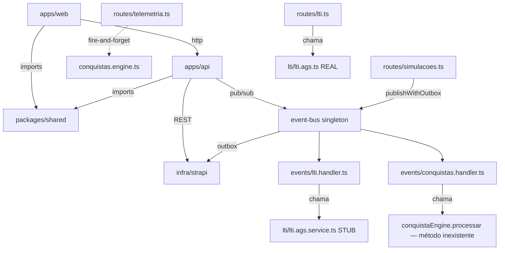

# Refactoring Analysis — Auditoria W0→W2 + Closure W2 (T3-T6)

## 0. Contexto

Este documento captura **APENAS o estado actual** do código relativo aos blocos:

- **A. Reviews profundos** dos 14 tickets marcados Done + 1 epic adicional (W0-T1…T9, W1-T1/T2/T4/T5, W2-T1/T2, Constelação Neural)
- **B. Gap-closure** dos 4 tickets parciais (W1-T3, W2-T3, W4-T1, W4-T2)
- **C. Implementação** dos 4 tickets W2 missing (W2-T3, T4, T5, T6)

NÃO contém soluções nem propostas de implementação — isso é a Approach (Parte 2). Cross-reference: `nao_versionar/traycer-epics/63eac955-…/specs/Refactoring_Approach_5_Waves` e `Refactoring_Analysis_Restauração`.

## 1. Dependency Map

### 1.1 Camadas e onde vive cada peça

### 1.2 Quem chama o quê — pontos críticos

| Caller | Callee | Nota |
| --- | --- | --- |
| `apps/api/src/index.ts` L113-120 | `eventBus.subscribe(TENTATIVA_CONCLUIDA, ltiHandler)` + `(TENTATIVA_CONCLUIDA, conquistasHandler)` + `(CONQUISTA_DESBLOQUEADA, conquistasHandler)` | Conquistas registado 2×; o segundo é recursivo se um dia `CONQUISTA_DESBLOQUEADA` for publicado por dentro do próprio handler |
| `apps/api/src/routes/simulacoes.ts` L247 | `eventBus.publishWithOutbox(TENTATIVA_CONCLUIDA, {...})` | Único publisher actual de eventos do bus; OK |
| `apps/api/src/routes/telemetria.ts` L67 | `void verificarConquistas(userId, evt.tipo)` | **DUPLICAÇÃO**: além do handler subscrever, telemetria também dispara directamente. Mesma conquista pode tentar desbloquear 2× via 2 caminhos paralelos |
| `apps/api/src/routes/conquistas.ts` L41 | `verificarConquistas(...)` | Endpoint manual de auto-trigger; mantém-se, sem problema |
| `apps/api/src/modules/events/lti.handler.ts` L19 | `ltiAgsService.sendScore(perfilId, tentativaId, score)` | **BUG CRÍTICO**: usa o **stub** `lti.ags.service.ts` (apenas log) com **assinatura diferente** do real `ltiAgs.sendScore(lineitemUrl, score, accessToken)`. Grade Passback **não funciona** apesar do código existir |
| `apps/web/src/main.tsx` L49-54 | `<BootstrapProvider>` | O frontend **já** monta um provider de bootstrap real (file:apps/web/src/lib/bootstrap/BootstrapContext.tsx); W1-T3 não está “sem implementação frontend” |
| `apps/web/src/lib/api/reputation.ts` L16-24 | `http.get('/reputacao/*')` | **Drift contratual**: o cliente web fala português (`/reputacao/*`), mas o BFF monta `routes/reputation.ts` em `/reputation/*` |
| `apps/web/src/features/simulacoes/RelatorioVocacional.tsx` L38 | `http.get('/vocacional/perfil-premium')` | Endpoint não confirmado — possível chamada para rota inexistente, com fallback mock; **não consome** `/reputacao/me` apesar do client helper já existir |
| `apps/web/src/features/simulacoes/Tipo2Player.tsx` L57 | `simulacoesApi.concluirTentativa({score: 8.5,...})` | Score hardcoded a partir do frontend; BFF aceita-o sem calcular |

### 1.3 SSOT vs Schemas espalhados

| Domínio | SSOT esperado (Constitution §2) | Estado real |
| --- | --- | --- |
| `BootstrapResponse` | `packages/shared/src/bootstrap.ts` Zod | ✅ existe |
| `Features` registry | `packages/shared/src/registry/features.ts` | ✅ existe |
| `TelemetryToken` payload | `packages/shared/src/telemetry-token.ts` | ✅ existe + spec |
| `SanityRule` | `packages/shared/src/sanity/` | ✅ existe |
| Heuristics (φ/R/F/H) | `packages/shared/src/heuristics.ts` | ✅ existe — **mas API diferente da engine BFF** (toma `phi: number`, não `events[]`); BFF `analysis/heuristics.engine.ts` ainda existe paralelo |
| `ReputacaoBreakdown` | `packages/shared/src/reputation.ts` | ❌ **não existe** — tipo `ReputationBreakdown` definido como `interface` no service do BFF |
| `DomainEvent` types | `apps/api/src/modules/events/types.ts` | ✅ existe — TS-only, sem Zod |
| `lti_context` field | Strapi `perfil` content-type | ✅ JSON field presente em `infra/strapi/src/api/perfil/content-types/perfil/schema.json` L152 |

### 1.4 Strapi domain-event (Outbox)

- Content-type `domain-event` existe (`infra/strapi/src/api/domain-event/content-types/domain-event/schema.json`).
- Usado por `event-bus.publishWithOutbox()` (POST) e `outbox-replay.ts` (GET pendentes + PUT processed).

## 2. Risk Hotspots

### 🔴 Hotspot 1 — Outbox Pattern não é "outbox" verdadeiro

- `event-bus.ts` `publishWithOutbox()` faz: `strapiPost('/domain-events') → publish() (sync emit) → strapiPut(processed=true)` em sequência.
- O EventEmitter nativo é **sincronamente despachante mas dispara handlers async sem aguardar**. O `strapiPut(processed=true)` dispara antes dos handlers terminarem.
- **Consequência:** se um handler falhar, o evento já está marcado `processed=true` no Strapi. **Replay nunca apanha falhas reais de handler.** Apenas apanha falhas entre `strapiPost` e `strapiPut` (rede entre ambas, ou crash do worker).
- O comentário nas L74-91 do próprio ficheiro reconhece a limitação ("simulamos a conclusão para manter o fluxo funcional").

### 🔴 Hotspot 2 — LTI Grade Passback handler é fachada

- `events/lti.handler.ts` L19: `await ltiAgsService.sendScore(perfilId, tentativaId, score)`.
- `ltiAgsService` (stub em `lti/lti.ags.service.ts`) tem assinatura `(perfilId, tentativaId, score)` e apenas `log.info`.
- Real `ltiAgs.sendScore` (em `lti/lti.ags.ts`) tem assinatura `(lineitemUrl, score: LtiScore, accessToken)` e faz fetch IMS.
- **Resultado:** apesar do AC W2-T3 dizer "Conquistas como event subscribers" + "LTI Grade Passback event-driven", **nenhum score é enviado a LMS externo nesta path**.
- O `lti_context` do perfil **não é lido** no handler.

### 🔴 Hotspot 3 — Double-fire de Conquistas

- Handler `conquistas.handler.ts` chama `conquistaEngine.processar(perfilId)` (mas no engine actual o método exportado é `verificarConquistas(userId, evento)` — **chama método inexistente**).
- Em paralelo, `routes/telemetria.ts` L67 ainda chama `verificarConquistas` directamente.
- **Resultados possíveis:** TypeError em runtime no handler (se `conquistaEngine` não tem `processar`) **OU** se vier a ser corrigido para `verificarConquistas`, dispara duplicado com a chamada da telemetria.

### 🟠 Hotspot 4 — Telemetria edge-first sem validação end-to-end

- `useTelemetry.ts` **já** envia para `${EDGE_URL}/telemetria/batch` e faz fallback para `${VITE_API_URL}/telemetria/batch`; o antigo mismatch `/ingest` vs `/telemetria/batch` já não descreve o código actual.
- O risco remanescente é outro: **não há validação end-to-end suficiente** do fluxo edge → queue → consumer → `behavior_patterns`.

### 🟠 Hotspot 5 — Reputação: semântica errada + drift de rota

- `routes/reputation.ts` GET `/me` **sempre retorna breakdown** (não verifica flag).
- Spec exige: 404 se `REPUTATION_VISIBLE=false`, 200 com payload se `true`.
- Service `getReputacaoBreakdown` também não verifica flag. Apenas `getReputacao` (legado) verifica.
- Além disso, o client web file:apps/web/src/lib/api/reputation.ts usa **`/reputacao/*`**, enquanto o BFF monta a rota em **`/reputation/*`**.

### 🟠 Hotspot 6 — Heuristics paralelo (Shared vs BFF)

- `packages/shared/src/heuristics.ts` exporta funções puras `analyzeFluidity(phi)`, `analyzeResilience(r)`, `analyzeFocus(stability)`, `analyzeHesitation(ms)`.
- BFF `apps/api/src/modules/analysis/heuristics.engine.ts` **continua a existir** com APIs diferentes (toma listas de eventos, retorna outro shape).
- Risco: divergência entre os dois conjuntos de fórmulas. Originalmente W2-T1 deveria mover as fórmulas para shared e usá-las em BFF.

### 🟡 Hotspot 7 — `roadmap.md` drift

- W0-T2 está como `🔄` quando todo o trabalho de governance reset (CONSTITUTION v2.1, archive, audit) já está feito. Pequeno drift documental.

### 🟡 Hotspot 8 — `RelatorioVocacional.tsx` chama endpoint não confirmado

- Endpoint `/vocacional/perfil-premium` consumido pelo componente — não verifiquei se existe; se não existir, está sempre a cair no `catch` e a mostrar mock. UX silenciosamente degradada.
- Mesmo se existir, **não passa pelo novo schema W2-T6 ****`/reputation/me`**.

### 🟡 Hotspot 9 — Constitution violations no FeedPage

- `apps/web/src/features/feed/FeedPage.tsx` usa `any` em 4 sítios (`useQuery` → `any`, `items.map((item: any, idx: number)`).
- Constitution §1: zero `any` é regra inegociável.

## 3. Test Coverage

### 3.1 Spec files presentes

| Área | Spec file | W0 ticket | Notas |
| --- | --- | --- | --- |
| Telemetry hook | `apps/web/src/hooks/useTelemetry.spec.tsx` + `__test-utils__/telemetry-stub.ts` | W0-T3 | Existe |
| Heuristics BFF | `apps/api/src/modules/analysis/heuristics.engine.spec.ts` | W0-T4 | Existe |
| Vocacional service | `apps/api/src/modules/vocacional/vocacional.service.spec.ts` + `__fixtures__/personas.ts` | W0-T5 | Existe |
| Reputation service | `apps/api/src/modules/reputation/reputation.service.spec.ts` | W0-T6 | Existe |
| Conquistas engine | `apps/api/src/modules/conquistas/conquistas.engine.spec.ts` | W0-T7 | Existe |
| LTI AGS | `apps/api/src/modules/lti/lti.ags.spec.ts` | W0-T8 | Existe |
| Bootstrap (BFF) | `apps/api/src/routes/bootstrap.spec.ts` | W1-T3 | Existe |
| Bootstrap (shared) | `packages/shared/src/bootstrap.spec.ts` | W1-T3 | Existe |
| TelemetryToken | `packages/shared/src/telemetry-token.spec.ts` + `apps/api/src/modules/auth/telemetry-token.spec.ts` | W1-T2 | Existe |
| JWS verify (edge) | `apps/edge/src/middleware/jws-verify.spec.ts` | W1-T2 | Existe |
| Heuristics shared | `packages/shared/src/heuristics.spec.ts` | W2-T1 | Existe |
| Sanity validators | `packages/shared/src/sanity/sanity.spec.ts` | W2-T1 | Existe |
| Telemetry shared | `packages/shared/src/telemetry.spec.ts` | (ad-hoc) | Existe |
| Event bus | `apps/api/src/modules/events/event-bus.spec.ts` | W2-T2 | Existe |

### 3.2 Lacunas críticas

| Lacuna | Risco | Comentário |
| --- | --- | --- |
| **Sem teste do **`lti.handler.ts`** nem ****`conquistas.handler.ts`** | 🔴 Alto | Os dois handlers têm bugs críticos (call de stub / método inexistente) — testes apanhariam |
| **Sem teste de integração "publica TENTATIVA_CONCLUIDA → ambos handlers disparam"** | 🔴 Alto | AC explícito do W2-T3 |
| **Sem teste e2e para Outbox replay funcionar** | 🟠 Médio | Comportamento crítico para resiliência |
| **Sem teste do endpoint ****`routes/reputation.ts`**** GET /me** | 🟠 Médio | A semântica 404-when-flag-off não está coberta |
| **Sem teste characterization do consumer Upstash** (W1-T4) | 🟠 Médio | Pipeline edge→queue→consumer não validado em isolamento |
| **Sem teste do ****`RelatorioVocacional.tsx`** | 🟡 Baixo | Consome endpoint diferente do que a spec W2-T6 prevê |
| **Sem teste do ****`FeedPage.tsx`** | 🟡 Baixo | A versão actual é minimal de qualquer forma |
| **Sem teste do ****`MensagensPage.tsx`** | 🟡 Baixo | Mesma razão |

### 3.3 Run check (não corrido — proposta)

A spec não executa testes. Esperamos correr `npm run lint && npm run typecheck && npm test --run` e `npm run test:e2e:a11y` em fase de Approach/Implementation para confirmar baseline antes de mexer.

## 4. Change Surface Area

### 4.1 Mapa do que se vai tocar (estimativa)

| Bloco | Ficheiros tocados (estimado) | Tipo de mudança | Risco |
| --- | --- | --- | --- |
| **A. Reviews retroactivos** | 0 (apenas leitura + comentários) | Read-only | 🟢 Baixo |
| **B1. W1-T3 review-only** | `apps/web/src/lib/bootstrap/BootstrapContext.tsx`, `apps/web/src/main.tsx` | Read-only (auditar provider actual, sem recriar) | 🟢 Baixo |
| **B2. Fix W2-T3 (parcial real)** | `events/lti.handler.ts` (assinatura + fetch perfil), `events/conquistas.handler.ts` (chama método correcto + idempotência Redis), `routes/telemetria.ts` (remover chamada directa), `event-bus.ts` (resolver outbox semântica), `index.ts` (corrigir double-subscribe) | Modify | 🟠 Alto |
| **B3. Fix W4-T1** | `MensagensPage.tsx` (rebuild ou expandir), `useSocket` integração | Modify (significativo) | 🟡 Médio |
| **B4. Fix W4-T2** | `FeedPage.tsx` (rebuild com tabs + comments + moderação), `routes/feed.ts` BFF (estender), Comments UI | Modify (significativo) | 🟠 Médio-Alto |
| **C1. W2-T4 Sim Tipo 2 score** | `Tipo2Player.tsx` (remover 8.5 + payload novo), `routes/simulacoes.ts` PUT (calcular via heuristics shared), persona testes | Modify | 🟡 Médio |
| **C2. W2-T5 Sim Tipo 3** | `Tipo3Player.tsx` (NOVO), `SimulacaoPlayerPage.tsx` (remover Wrench), `telemetry.ts` (3 novos eventos canónicos), seed fixture, e2e | Add | 🟢 Baixo |
| **C3. W2-T6 ****`/reputation/me`** | `packages/shared/src/reputation.ts` (NOVO Zod schema + tier), `routes/reputation.ts` (404 flag off), `reputation.service.ts` (flag check), `RelatorioVocacional.tsx` (consumir endpoint real, remover mock fallback) | Add+Modify | 🟠 Médio-Alto (semantic change intencional) |

### 4.2 Resumo quantitativo

- **Arquivos novos:** ~4 (`Tipo3Player.tsx`, `packages/shared/src/reputation.ts`, `lti.score.service.ts`, possivelmente 1-2 specs de teste novos)
- **Arquivos modificados:** ~12 (handlers + routes + frontend players + RelatorioVocacional + index + telemetria + mount de reputação)
- **Conteúdo decisivo:** 4 mudanças semânticas intencionais (Outbox real, LTI ligado ao real, Conquistas single-source, Reputação 404-flag-off + canonização `/reputacao/*`)

## 5. Dúvidas a confirmar com o utilizador (antes da Approach)

<user_quoted_section>Estas dúvidas determinam decisões na Parte 2; não devem ser respondidas dentro deste documento.</user_quoted_section>

1. Outbox real ou audit-log? — `publishWithOutbox` actualmente não garante reentrância. Aceitas que a Approach proponha tornar o outbox real (handler.ack → marcar processed) ou preferes manter como audit-log e só corrigir o nome/comentários?
2. Single-source de Conquistas — manter only-handler (remover chamada directa em `routes/telemetria.ts`) ou only-direct (remover handler + manter telemetria a chamar directo)?
3. LTI handler — fetch do `perfil.lti_context` para extrair `lineitemUrl` + `accessToken` (token LTI expira em ~1h, precisa reauth/refresh)?
4. Re-coverage W0 — confirmar antes de mexer em código novo, ou tolerar que reviews-execution apanhem regressões nos testes existentes?
5. Approach delegation — preferes que a Approach (Parte 2) seja escrita como nova spec separada, ou queres que actualize a `Refactoring_Approach_5_Waves` arquivada com um capítulo novo "W2 Closure"?
