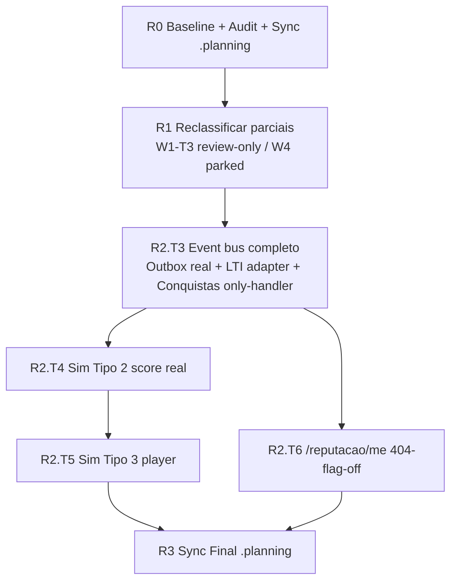
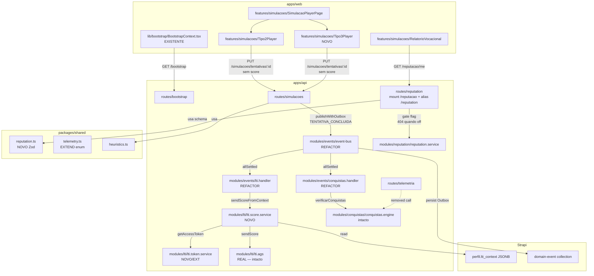
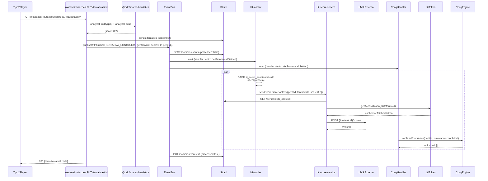

# Refactoring Approach — W0→W2 Audit + W2 Closure

## 0. Contexto e Decisões Fechadas

Este documento é a **Parte 2** do plano de refactoring. Captura decisões técnicas para 3 blocos de trabalho:

- **A. Audit retroactivo** dos 14 tickets marcados Done (W0-T1…T9, W1-T1/T2/T4/T5, W2-T1/T2 + Constelação Neural)
- **B. Reclassificação dos parciais** (W1-T3 → Done/review-only; W4-T1/W4-T2 estacionados até W3)
- **C. Implementação** dos 4 tickets de fecho W2 (T3, T4, T5, T6)

Cross-reference: spec:866df58c-39bf-4ecf-a16c-a107085047dd/9e1df3cf-7cd8-4bf5-80d1-86bc9b4d00aa (Analysis); approach original arquivada em `nao_versionar/traycer-epics/63eac955-…/specs/Refactoring_Approach_5_Waves`; constituição em file:.planning/CONSTITUTION.md.

### Decisões da ronda 1 (já fechadas com o utilizador)

| # | Decisão | Origem |
| --- | --- | --- |
| **D1** | Outbox real com **registry explícito de handlers**; `processed=true` só após `Promise.allSettled` dos handlers reais | Q1 + Validation |
| **D2** | Conquistas only-handler — remover chamada directa em `routes/telemetria.ts` | Q2 |
| **D3** | LTI handler faz fetch + cache no próprio handler (lê `perfil.lti_context`, usa `lti.token.service`, cacheia token em Redis com TTL = `exp - 5min`) | Q3 |
| **D4** | Baseline-first — primeira execução é correr lint/typecheck/test em todos os workspaces + e2e a11y; documentar reds | Q4 |
| **D5** | Approach vive como spec dedicada neste Epic (epic:866df58c-…); arquivos antigos servem de história | Q5 |
| **D6** | Sync em **two-pass apenas de ****`.planning/*`**; manifesto/pitch em `docs/projeto/` fica intacto | Q5 + Validation |
| **D7** | W1-T3 reclassificado como **Done/review-only**; `BootstrapProvider` actual em file:apps/web/src/lib/bootstrap/BootstrapContext.tsx é a implementação canónica | Validation |
| **D8** | Contrato externo canónico de reputação = **`/reputacao/*`**; `routes/reputation.ts` mantém nome interno em EN e expõe alias temporário `/reputation/*` para rollback | Q2 + Validation |
| **D9** | LTI sem contexto divide-se em 2 casos: tentativa não-LTI = **skip estruturado** (ack); contexto LTI presente mas inválido = **erro reprocessável** | Q4 + Validation |

## 1. Key Decisions

### 1.1 Structure — como organizar a mudança

**Decisão — 4 ondas internas auto-contidas, executadas em série:**

| Onda interna | Conteúdo | Critério de aceitação |
| --- | --- | --- |
| **R0 — Baseline & Audit** | Correr lint/typecheck/test/e2e a11y em todos os workspaces; sync `.planning/*`; lançar `review`-executions para os 14 tickets Done (uma por ticket atómico) | Baseline registado num ficheiro `nao_versionar/audit-reports/baseline-2026-04.md`; review-executions reportam comments e correções recomendadas |
| **R1 — Reclassificação dos Parciais** | W1-T3 passa a Done/review-only (provider actual já existe e está montado); W4-T1 e W4-T2 ficam estacionados até W3 por dependência de design/i18n/a11y; sem código novo neste passo | Matriz de parciais actualizada; zero novas implementações fora de W2 |
| **R2 — W2 Closure (T3, T4, T5, T6)** | Implementar 4 tickets em ordem de dependência: T3 (event bus completo) → T4 (Sim Tipo 2 score real) → T5 (Sim Tipo 3 player) → T6 (`/reputacao/me` + `RelatorioVocacional` real) | Todos os AC dos 4 tickets cumpridos; testes verdes; semântica `/reputacao/me` 404-when-flag-off correcta |
| **R3 — Sync Final** | Re-correr baseline; actualizar apenas `.planning/STATE.md`, `.planning/REQUIREMENTS.md` e `.planning/roadmap.md` para reflectir Done; commit final `complete W2 closure + audit` | `.planning/*` alinhado com código real; REQUIREMENTS Phase 4 honesto |

**Princípio de placement — onde vive cada peça nova:**

| Peça nova | Localização | Razão |
| --- | --- | --- |
| `BootstrapProvider` + `useBootstrap()` hook | file:apps/web/src/lib/bootstrap/BootstrapContext.tsx (EXISTENTE; review-only) | Já existe e está montado em file:apps/web/src/main.tsx; este ciclo apenas audita o AC do W1-T3, não recria provider |
| `ReputacaoBreakdownSchema` + `ReputacaoTier` | file:packages/shared/src/reputation.ts (NOVO) | SSOT — Constitution §2 |
| `lti.score.service.ts` adapter | file:apps/api/src/modules/lti/lti.score.service.ts (NOVO) | Mantém handler magro; centraliza fetch perfil + token + envio |
| Token cache Redis helpers | file:apps/api/src/modules/lti/lti.token.service.ts (criar se não existir; senão estender) | Reutilizado por `lti.score.service` |
| `Tipo3Player.tsx` + 3 eventos canónicos novos | file:apps/web/src/features/simulacoes/Tipo3Player.tsx + file:packages/shared/src/telemetry.ts (extend enum) | Player isolado em features; eventos ficam no SSOT do enum |
| Ack-tracking no Outbox | file:apps/api/src/modules/events/event-bus.ts (refactor) | `processed=true` só após `Promise.allSettled` resolvido |
| `lti.handler.spec.ts` + `conquistas.handler.spec.ts` + integração `event-bus.integration.spec.ts` | file:apps/api/src/modules/events/ | Cobre lacuna crítica identificada na Analysis §3.2 |

**Princípio de gathering — onde está lógica scattered hoje:**

| Tema | Hoje espalhado em… | Consolidar em… |
| --- | --- | --- |
| Conquistas auto-trigger | `routes/telemetria.ts` L67 + `events/conquistas.handler.ts` | **Apenas** `events/conquistas.handler.ts` (D2) |
| LTI Grade Passback | `events/lti.handler.ts` (chama stub) + `routes/lti.ts` (chama real) | Manter `routes/lti.ts` para callout manual; `events/lti.handler.ts` passa a usar adapter `lti.score.service` que internamente usa o real `ltiAgs.sendScore` |
| Score de Sim Tipo 2 | `Tipo2Player.tsx` envia `8.5` hardcoded; `routes/simulacoes.ts` aceita-o | Score sempre calculado pelo BFF a partir de `metadata` enviado pelo frontend; cliente nunca envia `score` |
| Reputação | `reputation.service.getReputacao()` (legacy) + `getReputacaoBreakdown()` (novo) + `routes/reputation.ts` + `apps/web/src/lib/api/reputation.ts` com drift `/reputacao/*` vs `/reputation/*` | Manter ambos getters; contrato externo canónico passa a ser `/reputacao/*` com alias temporário `/reputation/*`; `GET /reputacao/me` ganha gate de feature flag (404 se off) |

### 1.2 Transition — como migrar com segurança

**Decisão — bottom-up + commits atómicos por ticket + zero dual-running**

A cadeia é R0 → R1 → R2 → R3. Cada ticket é um commit. Sem feature flags porque os tickets são internos (não tocam frontends de roles diferentes); a única excepção semântica é o gate de `REPUTATION_VISIBLE` que **já é runtime flag** (Strapi) e portanto não precisa rollout próprio.

**Order:**



**Coexistência durante R2.T3 (event bus refactor):**

Não há fase A→B→C como na migração edge — o handler LTI **hoje não funciona** (é fachada), por isso a substituição é "broken → working", sem necessidade de manter o broken vivo. A única coexistência:

- Endpoint manual `routes/lti.ts` POST `/score` (chamada explícita) **continua intacto** — usa `ltiAgs.sendScore` directo. Apenas o fluxo *automático* event-driven é alterado.

**Rollback:**

- Cada ticket é commit único; `git revert` por ticket.
- R2.T3 é o mais arriscado (LTI fluxo automático). Se rollback necessário, revert volta ao estado actual (handler stub) — **não pior que hoje** porque hoje o handler já é fachada.
- R2.T6 muda semântica de `/reputacao/me`: antes `200 + breakdown`, depois `404 se flag off`. O alias temporário `/reputation/me` acompanha a mesma semântica durante a janela de compatibilidade. Frontend e BFF têm de ser actualizados no mesmo PR.

### 1.3 Mapping & Gaps — o que não traduz cleanly

| Gap identificado na Analysis | Resolução nesta Approach |
| --- | --- |
| `STATE.md` declara `bootstrap.ts`, `event-bus.ts`, `heuristics.ts` como "ausentes" mas **existem** no código | R0 sync — atualizar STATE.md secção "Lacunas Estruturais Críticas" para reflectir realidade |
| `roadmap.md` mostra W0-T2 com `🔄` quando trabalho está feito | R0 sync — `🔄` → `✅` |
| O frontend **já** tem `BootstrapProvider` funcional em file:apps/web/src/lib/bootstrap/BootstrapContext.tsx e monta-o em file:apps/web/src/main.tsx | W1-T3 reclassificado como Done/review-only; auditar AC e evitar churn/duplicação de provider |
| `event-bus.publishWithOutbox()` faz `processed=true` antes de handlers terminarem **e** `subscribe()` embrulha handlers em wrappers que engolem erros | R2.T3 — trocar a fonte de verdade dos eventos críticos para um registry explícito `Map<DomainEventName, Handler[]>`; `publishWithOutbox()` aguarda esses handlers reais com `Promise.allSettled(...)` e só depois marca `processed=true`. O EventEmitter deixa de ser a dependência crítica para semântica de outbox. |
| `events/conquistas.handler.ts` chama `conquistaEngine.processar(perfilId)` que **não existe** (engine só exporta `verificarConquistas(userId, evento)`) | R2.T3 — handler passa a chamar `verificarConquistas(perfilId, 'simulacao.concluida')` (e similares para outros eventos); assinatura unificada |
| Conquistas dispara em 2 caminhos (telemetria + handler) | D2 — remover chamada de `routes/telemetria.ts` L67; restantes eventos não-tentativa (rating, comentário, login) precisam de novos `DomainEventName` ou são publicados pelos próprios endpoints (`routes/comments.ts` publica `COMENTARIO_CRIADO`, etc.) |
| `events/lti.handler.ts` chama stub `ltiAgsService` em vez do real `ltiAgs` | R2.T3 — handler chama novo `lti.score.service.sendScoreFromContext(perfilId, tentativaId, score)` que internamente: 1) lê `perfil.lti_context` no Strapi; 2) extrai `lineitemUrl`; 3) chama `lti.token.service.getAccessToken(plataformaId)` (cache Redis); 4) chama `ltiAgs.sendScore(lineitemUrl, scorePayload, accessToken)` real |
| O cliente web usa `/reputacao/*` em file:apps/web/src/lib/api/reputation.ts enquanto o BFF monta `/reputation/*` | R2.T6 — contrato externo canónico passa a ser `/reputacao/*`; `app.route('/reputacao', reputationRoutes)` torna-se o mount principal e `app.route('/reputation', reputationRoutes)` fica como alias temporário |
| `RelatorioVocacional.tsx` consome `/vocacional/perfil-premium` (endpoint não confirmado) com fallback mock | R2.T6 — substituir por `useQuery(['reputacao','me'])` para `/reputacao/me` + `useQuery(['vocacional','heuristics-summary'])` para insights heurísticos (endpoint que vamos criar se não existir, OU usar dados já presentes em `behavior_patterns` do perfil); remover fallback mock |
| `routes/reputation.ts` GET `/me` retorna 200 sempre, ignora flag | R2.T6 — gate de `featureFlagService.getEffectiveFlags()` no início; `404` se `REPUTATION_VISIBLE=false`, montado em `/reputacao/me` com alias temporário `/reputation/me` |
| `Tipo2Player.tsx` envia `score: 8.5` hardcoded | R2.T4 — remover campo `score` do payload; `routes/simulacoes.ts` PUT `/tentativas/:id` calcula via `analyzeFluidity` + `analyzeFocus` do `@pdc/shared/heuristics` usando `metadata.duracaoSegundos` + `metadata.focusStability` |
| BFF `analysis/heuristics.engine.ts` paralelo ao `@pdc/shared/heuristics` | Adiar — não toca neste ciclo (R2 não inclui consolidação heuristics BFF→shared); registar como debt para Wave seguinte |
| Constituição violations no `FeedPage.tsx` (4 `any`) | Adiar — fora de scope (W4-T2 trata) |

**Semantic changes intencionais:**

- `GET /reputacao/me`: `200 + breakdown` (qualquer caso) → `404 + {error:"feature off"}` quando flag off; `200 + breakdown` quando on. O alias temporário `GET /reputation/me` espelha o mesmo comportamento. Frontend `RelatorioVocacional.tsx` deve tratar 404 como estado "Reputação ainda não disponível".
- Sim Tipo 2: score frontend `8.5` constante → score BFF derivado (varia com `focusStability`/`duracaoSegundos`).
- LTI passback: hoje **não envia nada** (stub) → envia score real para LMS quando perfil tem `lti_context`.
- Conquistas: hoje pode disparar 2× (telemetria + handler) → dispara 1× (only handler).

### 1.4 Design — interfaces e tipos novos

<user_quoted_section>Apenas assinaturas e schemas — não código de implementação.</user_quoted_section>

**`packages/shared/src/reputation.ts`**** (NOVO):**

```ts
// ~30 linhas
export const ReputacaoTierSchema = z.enum(['BRONZE','PRATA','OURO','DIAMANTE']);
export const ReputacaoBreakdownSchema = z.object({
  score: z.number().min(0).max(100),
  tier: ReputacaoTierSchema,
  dimensions: z.object({
    ratingsMedia: z.number(),
    cursosPublicados: z.number().int(),
    simulacoes: z.number().int(),
    conquistas: z.number().int(),
    tempoPlataforma: z.number(),
    engagement: z.number().int(),
  }),
});
```

**`packages/shared/src/telemetry.ts`**** (extend **`TelemetriaTipoSchema`**):**

Adicionar 3 novos eventos canónicos: `'simulacao.tipo3.iniciada'`, `'simulacao.tipo3.acao'`, `'simulacao.tipo3.concluida'`.

**`apps/api/src/modules/lti/lti.score.service.ts`**** (NOVO) — interface:**

```ts
export interface LtiScoreService {
  sendScoreFromContext(args: {
    perfilId: string;
    tentativaId: string;
    score: number;        // 0-10 internal
    scoreMaximum: number; // mapeia para LTI scoreGiven/scoreMaximum
  }): Promise<
    | { ok: true; status: 'sent' }
    | { ok: true; status: 'skipped'; reason: 'no-lti-context' }
    | { ok: false; status: 'retryable_error'; reason: 'invalid-lti-context' | 'token-failure' | 'lms-error'; detail?: string }
  >;
}
```

**`apps/api/src/modules/lti/lti.token.service.ts`**** (criar/estender):**

```ts
export interface LtiTokenService {
  getAccessToken(plataformaId: string): Promise<string>; // cached Redis TTL = exp - 5min
}
```

**`apps/api/src/modules/events/event-bus.ts`**** (refactor — interface mantida):**

```ts
export interface EventBus {
  subscribe<T>(name: DomainEventName, handler: (e: DomainEvent<T>) => Promise<void>): void;
  publish<T>(event: DomainEvent<T>): void;
  publishWithOutbox<T>(name: DomainEventName, payload: T): Promise<void>; // semântica MUDA: aguarda handlers
}
```

A interface pública não muda; o que muda é a implementação: eventos críticos passam a usar um registry explícito `Map<DomainEventName, Handler[]>` como fonte de verdade. `publishWithOutbox()` executa esses handlers reais com `Promise.allSettled([...])` e só marca `processed=true` se todos resolverem. Se algum rejeitar, `processed=false` permanece + log estruturado (`level=error`, `eventId`, lista de handlers que falharam). O EventEmitter deixa de decidir a semântica crítica do outbox; pode ser mantido apenas para `publish()` transiente ou removido integralmente no ticket, conforme simplificar a implementação.

**`apps/web/src/lib/bootstrap.tsx`**** (NOVO):**

```ts
export interface BootstrapState {
  loading: boolean;
  data: BootstrapResponse | null; // do schema @pdc/shared
  error: Error | null;
}
export const BootstrapProvider: React.FC<{ children: React.ReactNode }>;
export const useBootstrap: () => BootstrapState;
```

**`DomainEventName`**** enum (extend):**

Adicionar pelo menos: `CURSO_CONCLUIDO`, `RATING_CRIADO`, `LOGIN`, `MENTORIA_ACEITE`, `EXPERIENCIA_PUBLICADA`, `VINCULO_CONNECTED`, `PERFIL_ATUALIZADO`, `SIMULACAO_CRIADA`, `CURSO_PUBLICADO`, `CURSO_INSCRICAO` — cada um com publisher correspondente nas respectivas rotas (futuro). Para esta wave, adicionamos os enums mas **não obrigamos** a publishers em todas as rotas (R3 doc lista pendentes).

### 1.5 New Concerns introduzidos

| Concern | Mitigação |
| --- | --- |
| **Outbox real bloqueia request original** se `Promise.allSettled` for awaited inline em PUT `/tentativas/:id` | `routes/simulacoes.ts` continua a chamar `publishWithOutbox(...).catch(log.error)` em fire-and-forget; ack só é esperado **dentro** do `publishWithOutbox` para decidir `processed`. Cliente não espera. |
| **Handler LTI faz fetch perfil + token + LMS** — latência externa | Idempotência Redis (`SADD lti_score_sent:<tentativaId>`) já presente; token cached em Redis; `no-lti-context` conta como **skip estruturado** (ack), enquanto `invalid-lti-context` / `token-failure` / `lms-error` contam como erro reprocessável e ficam para replay |
| **`Promise.allSettled`**** mascara erros silenciosos se ninguém olhar logs** | Log estruturado com `eventId` e lista de handlers que rejeitaram; ticket R3 inclui adicionar métrica simples (counter `domain_events_failed_total{event=...,handler=...}`) |
| **Sim Tipo 2 score determinístico** — 2 alunos com mesma `duracaoSegundos`/`focusStability` terão mesmo score | Comportamento intencional (telemetry-driven); fixtures Personas (W0-T5 já existentes) usadas em testes para validar variação entre arquétipos |
| **`Tipo3Player.tsx`**** sem conteúdo de produto** — engenharia entrega **shell** funcional; conteúdo real (cenários, scoring específico) fica em ticket de produto futuro | Spec do W2-T5 explicitamente delimita "design premium e conteúdo concretos out-of-scope" |
| **Sync STATE.md** corre risco de overwrite a notas do utilizador | R0 sync usa `git diff --no-color` antes/depois e comenta no commit message exactamente o que mudou; secção `Próximos passos imediatos` preserva entradas do utilizador |

### 1.6 Risk Mitigation — tratamento dos hotspots da Analysis §2

| Hotspot Analysis | Mitigação Approach |
| --- | --- |
| 🔴 H1 Outbox não-real | D1 + R2.T3 resolve directamente (Promise.allSettled + processed pós-handlers) |
| 🔴 H2 LTI handler é fachada | D3 + R2.T3 resolve via `lti.score.service` adapter |
| 🔴 H3 Double-fire conquistas | D2 + R2.T3 remove chamada directa em `routes/telemetria.ts` |
| 🟠 H4 Telemetria edge-first sem validação e2e | R0 audit inclui review-execution sobre W1-T1/T4 que valida pipeline manualmente; se reds, ticket spinoff |
| 🟠 H5 `/reputation/me` sempre 200 | R2.T6 resolve com flag gate |
| 🟠 H6 Heuristics paralelo BFF vs Shared | Adiado para Wave seguinte (debt registado em R3) |
| 🟡 H7 roadmap.md drift | R0 sync resolve |
| 🟡 H8 RelatorioVocacional chama endpoint não confirmado | R2.T6 substitui consumo |
| 🟡 H9 Constitution violations FeedPage | Adiado (W4-T2) |

## 2. Target State

### 2.1 Como o código fica estruturado pós-R3

```
apps/
├── web/
│   └── src/
│       ├── lib/
│       │   └── bootstrap/
│       │       └── BootstrapContext.tsx ← EXISTENTE (review-only)
│       └── features/simulacoes/
│           ├── Tipo2Player.tsx          ← MODIFICADO (sem score hardcoded)
│           ├── Tipo3Player.tsx          ← NOVO (W2-T5)
│           ├── SimulacaoPlayerPage.tsx  ← MODIFICADO (sem fallback Wrench)
│           └── RelatorioVocacional.tsx  ← MODIFICADO (consome /reputation/me)
├── api/
│   └── src/
│       ├── modules/
│       │   ├── events/
│       │   │   ├── event-bus.ts          ← REFACTORED (Promise.allSettled)
│       │   │   ├── lti.handler.ts        ← REFACTORED (usa lti.score.service)
│       │   │   ├── conquistas.handler.ts ← REFACTORED (chama verificarConquistas)
│       │   │   ├── lti.handler.spec.ts   ← NOVO
│       │   │   ├── conquistas.handler.spec.ts ← NOVO
│       │   │   └── event-bus.integration.spec.ts ← NOVO
│       │   ├── lti/
│       │   │   ├── lti.score.service.ts   ← NOVO (adapter)
│       │   │   └── lti.token.service.ts   ← NOVO/EXTEND
│       │   └── reputation/
│       │       └── reputation.service.ts  ← MODIFICADO (flag gate em getReputacaoBreakdown)
│       ├── routes/
│       │   ├── reputation.ts              ← MODIFICADO (mount canónico `/reputacao/*` + alias `/reputation/*`)
│       │   ├── simulacoes.ts              ← MODIFICADO (calcula score Tipo 2)
│       │   └── telemetria.ts              ← MODIFICADO (remover verificarConquistas L67)
│       └── index.ts                       ← MODIFICADO (corrigir double-subscribe Conquistas)
packages/
└── shared/
    └── src/
        ├── reputation.ts                  ← NOVO (Zod schema + tier enum)
        └── telemetry.ts                   ← EXTENDED (3 eventos novos Tipo3)
.planning/
├── STATE.md                               ← SYNCED (R0 + R3)
├── REQUIREMENTS.md                        ← SYNCED
└── roadmap.md                             ← SYNCED (W0-T2 ✅, W2 marcações)
nao_versionar/
└── audit-reports/
    └── baseline-2026-04.md               ← NOVO (resultados de lint/typecheck/test/e2e + reviews)
```

### 2.2 Propriedades verificáveis

- **Honesto**: `STATE.md` reflecte exactamente o que existe no código (review-script `git ls-files | grep ...` consistente com declarações).
- **Outbox reentrante**: matar BFF a meio de `publishWithOutbox` deixa evento `processed=false`; replay-script no próximo run apanha e re-emite.
- **LTI funcional end-to-end**: completar simulação de aluno com `lti_context` no perfil resulta em request HTTP real para o `lineitemUrl/scores` do LMS (validável via mock LMS local ou e2e com captura de fetch).
- **Score Tipo 2 derivado**: 2 personas (Cirurgião vs Hacker Hesitante) na mesma simulação produzem scores distintos (≥7.5 vs ≤5.0), conforme AC do W2-T4.
- **Tipo 3 funcional**: navegar para simulação tipo=3 renderiza `<Tipo3Player>`; SQL `SELECT COUNT(*) FROM tentativa WHERE simulacao.tipo=3` ≥ 1 após seed.
- **`/reputacao/me`** semântica: `curl` com flag off → 404; com flag on → 200 + breakdown completo conforme `ReputacaoBreakdownSchema` (alias temporário `/reputation/me` espelha o mesmo comportamento).
- **Conquistas single-source**: completar simulação não dispara duplicado (verificar via spy nos testes ou contar entradas em `/conquistas/me`).
- **Bootstrap frontend**: o provider actual em file:apps/web/src/lib/bootstrap/BootstrapContext.tsx permanece único; nenhuma duplicação de provider/context é introduzida e o payload de 4 layers continua disponível no boot.
- **Constitution invariants**: `npm run lint && npm run typecheck && npm test --run` verde em monorepo.

## 3. Component Architecture

### 3.1 Diagrama do estado-alvo (apenas componentes tocados)



### 3.2 Responsabilidades-chave

| Componente | Responsabilidade após R2 | Localização |
| --- | --- | --- |
| `EventBus.publishWithOutbox` | Persiste evento no Strapi → executa `Promise.allSettled([h1(e),h2(e),...])` sobre um **registry explícito de handlers** → marca `processed=true` se todos resolveram (rejeições mantêm `processed=false` para replay) | file:apps/api/src/modules/events/event-bus.ts |
| `LtiScoreService.sendScoreFromContext` | Compõe score IMS LTI 1.3, lê contexto do perfil, obtém token, faz callout HTTP real via `ltiAgs.sendScore`; devolve `sent` / `skipped` / `retryable_error` | file:apps/api/src/modules/lti/lti.score.service.ts (NOVO) |
| `LtiTokenService.getAccessToken` | Obtém JWT client_credentials do LMS para a plataforma; cache Redis com TTL = `exp - 5min`; refresh transparente | file:apps/api/src/modules/lti/lti.token.service.ts |
| `ltiHandler` | Idempotência Redis → chama `lti.score.service.sendScoreFromContext`; `skipped(no-lti-context)` faz ack, `retryable_error` propaga rejeição para o outbox | file:apps/api/src/modules/events/lti.handler.ts |
| `conquistasHandler` | Chama `verificarConquistas(perfilId, eventoTipo)` baseado no `event.name` → propaga rejeição | file:apps/api/src/modules/events/conquistas.handler.ts |
| `Tipo3Player` | Renderiza shell de simulação interactiva; emite `simulacao.tipo3.{iniciada,acao,concluida}` via `useTelemetry` | file:apps/web/src/features/simulacoes/Tipo3Player.tsx (NOVO) |
| `BootstrapProvider` + `useBootstrap` | Provider já existente; continua a fazer `GET /bootstrap` no boot da app e expõe `data.session/capabilities/security/ux`; este ciclo apenas o audita | file:apps/web/src/lib/bootstrap/BootstrapContext.tsx |
| `GET /reputacao/me` | Verifica flag → 404 se off → 200 + `getReputacaoBreakdown` validado contra `ReputacaoBreakdownSchema`; alias temporário `/reputation/me` para rollback | file:apps/api/src/routes/reputation.ts |
| `routes/simulacoes PUT /tentativas/:id` | Recebe payload sem `score`; calcula via `analyzeFluidity(metadata.focusStability/100) + analyzeFocus(metadata.focusStability/100)` (mapeamento exacto refinado em ticket); publica `TENTATIVA_CONCLUIDA` | file:apps/api/src/routes/simulacoes.ts |

### 3.3 Sequência crítica — completar simulação Tipo 2 com LTI



## 4. Invariants

### Comportamentais (preservar)

- **Auth/RBAC**: zero toque em `apps/api/src/modules/auth/*`. Cookies httpOnly, 6 roles, JWT seguro.
- **Endpoints existentes não mudam contrato**:
  - `GET /auth/me`, `GET /feature-flags/effective` permanecem para rollback (W1-T3 spec exige).
  - `routes/lti.ts` POST `/score` manual permanece intacto.
  - `routes/conquistas.ts` POST trigger manual permanece intacto.
- **`getReputacao()`**** legacy** continua a retornar 0 quando flag off (consumidores existentes inalterados); apenas `routes/reputation GET /me` muda semântica.
- **Idempotência**: `eventId` UUID em telemetria + `SADD lti_score_sent:<tentativaId>` em LTI handler + `isAlreadyUnlocked` em conquistas — todos preservados.
- **Tentativa endpoint**: `POST /simulacoes/tentativas` (iniciar) continua a calcular `tentativaNum` (correcção do atlas).

### Contratos

- `BootstrapResponseSchema` actual em `@pdc/shared/bootstrap.ts` é canónico — não muda nesta wave; só passa a ser consumido pelo frontend.
- `TelemetriaEventoSchema` apenas extende enum (3 nomes novos); nenhum field renomeado/removido.
- LTI 1.3 AGS payload: continua a usar headers `Content-Type: application/vnd.ims.lis.v1.score+json` + `Authorization: Bearer <token>`.
- Strapi `domain-event` content-type schema inalterado.
- Strapi `perfil.lti_context` JSONB — campo já existe; não muda.

### Performance

- `publishWithOutbox` agora aguarda handlers (LTI + Conquistas). Latência adicionada: ~200-800ms (LTI fetch perfil + token + LMS callout). **Não bloqueia o cliente** — `routes/simulacoes` continua a chamar com `.catch()` fire-and-forget.
- `GET /reputation/me`: caching mantém-se via `getReputacao` cache Redis (5min); `getReputacaoBreakdown` continua sem cache (uso pessoal, baixa frequência).

### Dados

- Schema Strapi sem alterações nesta wave (campo `lti_context` já lá; `domain-event` já lá).
- Score legado em `tentativa` não migra (entradas anteriores com `score=8.5` ficam; novas serão derivadas).
- Conquistas já desbloqueadas inalteradas; só novos triggers passam pelo handler único.

### Constitucionais (Constitution v2.1)

- **Zero ****`any`**: todos os ficheiros novos/modificados em scope passam typecheck estrito.
- **File ≤ 300 linhas**: `event-bus.ts` está actualmente ~110 linhas; refactor pode aproximar dos 200; se exceder 300, dividir em `event-bus.ts` + `event-bus.outbox.ts`.
- **SSOT em ****`@pdc/shared`**: `ReputacaoBreakdownSchema` nasce em shared (nunca duplicado em BFF).

## 5. Test Strategy

### 5.1 Baseline (R0)

Antes de qualquer modificação, correr e arquivar resultados em `nao_versionar/audit-reports/baseline-2026-04.md`:

```
npm run lint --workspaces
npm run typecheck --workspaces
npm test --workspaces -- --run
npm run test:e2e (existing Playwright suite)
```

Documentar **todos os reds** existentes; cada futuro red é diff vs baseline. Reds existentes que não sejam regressão directa do nosso trabalho ficam como debt para tickets separados.

### 5.2 Audit (R0)

`review`-executions sobre os 14 tickets Done — uma por ticket atómico (não em massa). Cada review-execution:

- Lê o ticket arquivado em `nao_versionar/traycer-epics/63eac955-…/tickets/`
- Lê os ficheiros tocados pelo ticket no código
- Verifica AC um-a-um
- Reporta gaps em comments
- Recomenda correções (se houver) **sem implementar**

Nota: as review-executions são triggered via `new_execution(plan_artifact_type='review', ...)` no momento do ticket-breakdown / execution.

**Sequencing rule para áreas críticas:** `R2.T3` (outbox + LTI + conquistas) e `R2.T6` (reputação) executam em modo **tests-first**. Os testes listados abaixo devem existir e falhar antes de qualquer mudança no código de produção desses tickets.

### 5.3 Tests por ticket de R2

| Ticket | Testes a adicionar/actualizar |
| --- | --- |
| **R2.T3 Event bus completo** | NOVO `event-bus.integration.spec.ts` — testa `publishWithOutbox` aguarda handlers reais + marca `processed=true` só se todos resolvem; NOVO `lti.handler.spec.ts` — happy path (envia para LMS), idempotência (segundo evento mesmo `tentativaId` retorna sem chamar), `no-lti-context` → `skipped`, `invalid-lti-context` / `token-failure` / `lms-error` → erro reprocessável; NOVO `conquistas.handler.spec.ts` — happy path (chama `verificarConquistas`), error propagation (não engole rejeições externas); ACTUALIZAR `event-bus.spec.ts` para o registry explícito; verificar W0-T7/T8 mantêm-se verdes |
| **R2.T4 Sim Tipo 2 score real** | ACTUALIZAR `routes/simulacoes` test (se existir) — calcula score via heuristics; ACTUALIZAR `Tipo2Player` (se houver test) — payload sem `score`; NOVO test "personas geram scores distintos" usando fixtures de `vocacional/__fixtures__/personas.ts`; e2e Playwright `tests/e2e/simulacoes/tipo2.spec.ts` actualizado para verificar score derivado |
| **R2.T5 Sim Tipo 3 player** | NOVO `Tipo3Player` smoke test (renderiza, emite eventos correctos via spy `useTelemetry`); NOVO e2e `tests/e2e/simulacoes/tipo3.spec.ts` smoke; SQL fixture seed garante ≥1 simulação tipo=3 |
| **R2.T6 ****`/reputacao/me`**** 404 flag off** | ACTUALIZAR `reputation.service.spec.ts` (W0-T6) — adicionar caso `getReputacaoBreakdown` quando flag off; NOVO `routes/reputation.spec.ts` — `404` quando flag off, `200` + payload válido contra schema quando on, e alias `/reputation/me` com comportamento idêntico; NOVO `RelatorioVocacional` test — handle 404 graciosamente; contract test `reputation.spec.ts` no `@pdc/shared` para o schema |

### 5.4 Coverage gates

- Novos ficheiros: ≥85% coverage lines.
- Ficheiros modificados: coverage não pode cair (delta=0 mínimo).
- `lti.handler.ts`, `conquistas.handler.ts`, `event-bus.ts`: ≥90% (críticos).

### 5.5 Justificação de mudanças nos testes W0

Cada PR que altere um spec W0 (`reputation.service.spec.ts`, `useTelemetry.spec.tsx`, etc.) deve incluir no commit message:

- `Justify: W2-T6 muda semântica getReputacaoBreakdown para gate flag`
- `Justify: W2-T3 muda assinatura conquistasHandler`
- etc.

Isto cumpre a regra de "snapshot da verdade" do W0 — qualquer mudança é deliberada e documentada.
